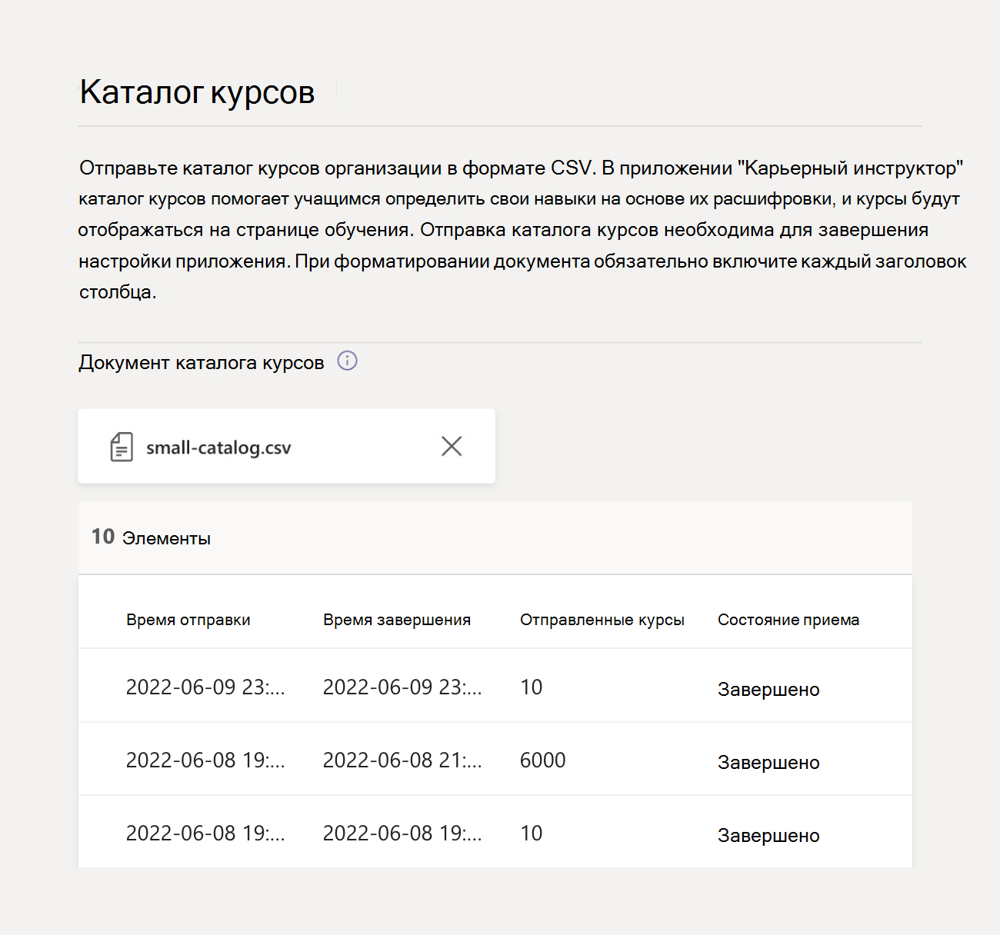

# Приобретение, настройка и включение Career Coach для Microsoft Teams

Career Coach — это Microsoft Teams для образования приложение на основе LinkedIn, которое предоставляет персонализированные рекомендации для учащихся с более высоким уровнем образования, чтобы перейти к карьерному пути. Карьерный тренер предлагает учебным заведениям единое решение для карьеры учащихся, чтобы они могли узнать свой путь к карьере, развивать реальные навыки и создать свою сеть в одном месте.

## Поддерживаемые языки

Карьерный тренер локализован на следующих языках:

- Китайский (упрощенное письмо, Китай)
- Китайский (традиционное письмо, Тайвань)
- Английский (США)
- Английский (Соединенное Королевство)
- Французский (Канада)
- Французский (Франция)
- Немецкий (Deutschland)
- Японский (Япония)
- Португальский (Бразилия)
- Испанский (Испания)
- Испанский (Мексика)

Дополнительные сведения о [карьерном тренере](https://aka.ms/career-coach).

> [!TIP]
> Используйте рекомендации и полезные советы в этом руководстве, чтобы обеспечить возможности карьерного преподавателя для учащихся, преподавателей и сотрудников. См. [статью с кратким руководством по планированию](https://support.microsoft.com/office/c5d0b934-bfcf-4fe7-8a85-ba7bbb1b6ad4) .

## Проверка требований

Чтобы включить карьеру преподавателя в учебном заведении, проверьте, что нужно для того, чтобы он начал работу.

### Технические требования

- Office 365 клиента с Azure Active Directory с включенными подключениями к учетной записи LinkedIn.
- Microsoft Teams.
- Страница LinkedIn School.

### Данные и файлы из учебного заведения

- Логотип учебного заведения и графические ресурсы [в требуемом формате](#brand-and-preferences).

- Данные каталога курсов. [Просмотр примера файла и](https://aka.ms/career-coach/docs/it-admins/sample-catalog) [формата документа](#course-catalog-document-format-and-schema).

- Список предлагаемых полей исследования. [Просмотрите пример файла](https://aka.ms/career-coach/docs/it-admins/sample-fieldsofstudy).

- URL-адрес страницы [LinkedIn School образовательного учреждения](https://www.linkedin.com/help/linkedin/answer/40133/differences-between-a-linkedin-page-for-a-school-and-company?lang=en).

- URL-адрес политики конфиденциальности образовательного учреждения.

- Образовательное учреждение ссылается на ресурсы, связанные с карьерой, такие как веб-сайт службы карьеры и публикации заданий учащихся (необязательно).

## Контрольный список установки

При подготовке к выпуску Career Coach для вашего клиента потребуется несколько ролей администраторов. Эти роли и разрешения могут быть назначены одному пользователю или требовать совместной работы с ИТ-специалистами в вашей организации. Используйте это руководство, чтобы определить лиц, необходимых для выполнения необходимых задач.

Вы можете проверить назначенные роли учетной записи, посетив веб-сайт Центр администрирования Microsoft 365 > ["> Активные](https://go.microsoft.com/fwlink/p/?linkid=834822) пользователи> Выберите свое имя пользователя, чтобы подтвердить свою роль.

Дополнительные сведения о [ролях администраторов в Центр администрирования Microsoft 365](/microsoft-365/admin/add-users/about-admin-roles).

### [Центр администрирования Microsoft 365](https://go.microsoft.com/fwlink/p/?linkid=2024339)

Роль: [задачи глобального администратора](/azure/active-directory/roles/permissions-reference#global-administrator) по карьере:

- [Приобретение лицензий](#purchase-career-coach-licenses)
- [Назначьте лицензии](#assign-career-coach-licenses-to-users)

### [Центр администрирования Azure Active Directory](https://go.microsoft.com/fwlink/p/?linkid=2067268)

Роль: [задача глобального администратора](/azure/active-directory/roles/permissions-reference#global-administrator) по карьере:

- [Включение подключений к учетной записи LinkedIn](#turn-on-linkedin-account-connections)

### [Центр администрирования Teams](https://admin.teams.microsoft.com/dashboard)

Роль: [задачи администратора Teams](/azure/active-directory/roles/permissions-reference#teams-administrator) по карьере:

- [Добавление Career Coach в качестве установленного приложения](#add-career-coach-as-an-installed-app)
- [Настройка параметров приложения "Карьерный тренер"](#configure-career-coach-settings)
  - [Фирменная символика и предпочтения](#brand-and-preferences)  — обязательный параметр
  - [Подключение LinkedIn](#linkedin-connection)  — обязательный параметр
  - [Каталог курсов](#course-catalog)  — обязательный параметр
  - [Поля исследования](#fields-of-study)  — обязательный параметр
  - [Настройка —](#customization) необязательно
- [Политики установки](#setup-policies-and-pin-the-app)
- [Закрепление приложения](#setup-policies-and-pin-the-app)

### Портал разработчика LinkedIn

Роль: [LinkedIn School Page Super Администратор](https://www.linkedin.com/help/linkedin/answer/a541981) Задача "Карьерный тренер":

- [Проверка страницы LinkedIn School](#verify-the-linkedin-school-page)

## Приобретение лицензий для карьерного специалиста

### Типы лицензий

Для доступа к приложению для карьерного специалиста требуется лицензия.

Доступны два типа лицензий.

- **Лицензия Student предназначена** для учащихся.
- **Лицензия для преподавателей** предназначена для преподавателей, сотрудников и ИТ-специалистов, участвующих в поддержке студентов с помощью карьерного преподавателя.

> [!IMPORTANT]
> Для **завершения настройки** ИТ-администратору необходимо назначить лицензию преподавателя карьерного преподавателя.

### Приобретение лицензий

Карьерный тренер доступен по всему миру (за исключением Китая и Россия) в качестве лицензии на надстройку для образовательных учреждений в рамках программы регистрации решений для образовательных учреждений (EES), поставщиков облачных служб (CSP) и Центр администрирования Microsoft 365 (веб-напрямую).

В качестве приложения Microsoft Teams клиент должен иметь Microsoft 365 A3/A5 или Office 365 A1/A3/A5, чтобы приобрести лицензию на надстройку Career Coach. Для учащихся и преподавателей предлагаются отдельные лицензии.

### Регистрация для использования бесплатной пробной версии

Стандартная 90-дневная бесплатная пробная версия доступна для 25 учащихся и 25 лицензий преподавателей и сотрудников. Одна пробная версия доступна для каждого соответствующего клиента. Пробные лицензии могут быть активированы из Центр администрирования Microsoft 365 клиенты, которые имеют полный доступ к приобретению карьерного специалиста.

Для активации пробной версии войдите в [Центр администрирования Microsoft 365 > выставления счетов > Purchase services > найдите Career Coach](https://go.microsoft.com/fwlink/p/?linkid=868433), чтобы найти пробную версию лицензии учащегося и лицензию [преподавателя](https://signup.microsoft.com/signup?OfferId=6f6e7db5-b9ab-4baa-86be-f13d0ae6a2c8).

## Подготовка к работе с карьерным тренером

### Включение подключений к учетной записи LinkedIn

Существует два способа использования подключений к учетной записи LinkedIn в Career Coach.

- Чтобы разрешить учащимся, преподавателям и сотрудникам подключать свою учетную запись Microsoft 365 к своей учетной записи [LinkedIn и отправлять приглашения LinkedIn от карьерного преподавателя](https://support.microsoft.com/topic/career-coach-quick-start-guide-for-students-c419db47-9290-4961-9684-c3f86a9b3708#bkmk_connect_your_linkedin_account).
- Включение функций ["Создание](https://support.microsoft.com/topic/career-coach-quick-start-guide-for-students-c419db47-9290-4961-9684-c3f86a9b3708#bkmk_build_your_network) сети" и " [Изучение](https://support.microsoft.com/topic/career-coach-quick-start-guide-for-students-c419db47-9290-4961-9684-c3f86a9b3708#bkmk_discover_your_career_path) карьеры" с использованием общедоступных данных из LinkedIn.

1. Войдите в [Azure AD администрирования с](https://go.microsoft.com/fwlink/p/?linkid=2067268) [помощью учетной](#setup-checklist) записи глобального администратора для Azure AD организации.

2. Выберите **"Пользователи"**.

3. На странице **"Пользователи** " выберите **"Параметры пользователя"**.

4. **Для правильной** настройки подключений к учетной записи LinkedIn необходимо задать значение **"** Да" или **"Выбранная** группа".

   - Выберите **"Да** ", чтобы включить службу для всех пользователей в учебном заведении.
   - Выберите **выбранную группу** , чтобы включить службу только для группы выбранных пользователей в учебном заведении.

Дополнительные сведения см. в [разделе о подключениях к учетной записи LinkedIn в Azure Active Directory](/azure/active-directory/enterprise-users/linkedin-integration).

> [!NOTE]
> Данные не совместно используются без согласия пользователя.

### Разрешить приложения Майкрософт в Teams

Career Coach — это приложение Майкрософт, поэтому оно должно быть разрешено в политиках разрешений приложений Teams.

1. Войдите в Центр **[администрирования Teams](https://admin.teams.microsoft.com)**.

2. В области навигации слева выберите **политики разрешений для приложений** >  Teams **[.](https://admin.teams.microsoft.com/policies/manage-apps)**

3. Выберите предпочтительную политику.
    1. Если вы не знаете, какую политику использовать, обратитесь к документации по управлению политиками [Microsoft Teams](policy-packages-edu.md)   или воспользуйтесь мастером политики образования, чтобы настроить политику для Microsoft Teams.

Дополнительные сведения [о настройке политик разрешений](teams-app-permission-policies.md).

### Добавление Career Coach в качестве установленного приложения

Этот шаг гарантирует, что карьерный тренер правильно настроен для вашей организации и что учащиеся находят его.

1. Войдите в [Центр администрирования Teams](https://go.microsoft.com/fwlink/p/?linkid=2066851).

2. Выберите **политики установки приложений** > Teams и выберите предпочтительную политику. ****
    1. Если вы не знаете, какую политику использовать, обратитесь к документации по управлению политиками [Microsoft Teams](policy-packages-edu.md)   или воспользуйтесь мастером политики образования, чтобы настроить политику для Microsoft Teams.

3. В **разделе "Установленные приложения**"  **выберите "+ Добавить приложения"**.

4. На панели **"Добавление установленных** приложений" найдите приложения, которые необходимо автоматически установить для пользователей при запуске Teams. Вы также можете фильтровать приложения по политике разрешений приложений.

5. Выбрав список приложений, нажмите кнопку " **Добавить"**.

6. Нажмите  **кнопку "Сохранить** > **подтверждение"**.

> [!NOTE]
> Изменение или назначение политики может занять несколько часов, чтобы изменения вступили в силу. Карьерный тренер не будет доступен в Microsoft Teams до тех пор, пока изменения не будут завершены.

## Настройка параметров карьерного специалиста

### Доступ к параметрам приложения "Карьерный тренер"

Чтобы настроить параметры Career Coach и включить его для пользователей, для доступа к странице необходимо быть глобальным администратором или администратором служб Teams.

1. Войдите в [Центр администрирования Teams](https://go.microsoft.com/fwlink/p/?linkid=2066851).
2. В области навигации слева выберите " **Приложения Teams" "** > **Управление приложениями"**.
3. Найдите или найдите **"Карьерный тренер"**.
4. Выберите **"Карьерный тренер**", а затем **"Параметры"**.

### Категории конфигурации "Карьерный тренер"

Для эффективного включения карьерного преподавателя для учащихся, преподавателей и сотрудников требуются следующие параметры:

- [Фирменная символика и предпочтения](#brand-and-preferences)
- [Подключение LinkedIn](#linkedin-connection)
- [Каталог курсов](#course-catalog)
- [Поля исследования](#fields-of-study)

Можно также задать [необязательные параметры](#customization) настройки.

> [!TIP]
> Быстро перейдите из одной категории в другую, выбрав путь к **карьерному тренеру** , расположенный в верхней части страницы в формате `Manage apps\Career Coach\Setting label`.

### Фирменная символика и предпочтения

Настройте карьерного преподавателя в соответствии с фирменной символикой учебного заведения. Вы несете ответственность за соблюдение прав других пользователей, включая права на авторские права и товарные знаки.

> [!IMPORTANT]
> Это обязательный раздел. Не удается включить "Карьерный тренер" без **фирменной символики и параметров** .

1. Войдите в **[Центр администрирования Teams](https://go.microsoft.com/fwlink/p/?linkid=2066851)**.

2. Выберите **приложения Teams "** > **Управление приложениями** > **" "Параметры** > **карьерного специалиста"** > **, чтобы изменить фирменную символику и предпочтения**.

3. В **разделе "Фирменная** символика" добавьте **название организации**.

4. Отправить **значок "Организация"**. Этот значок используется в рамках программы "Карьерный инструктор" для идентификации уникального содержимого вашего учебного заведения, ресурсов каталога курсов в приложении и в разделе реальных возможностей панели мониторинга.

    Значок лучше всего отформатирован следующим образом:

    - Прозрачный PNG
    - Пропорции 1:1
    - Максимальный размер : 64 пикселя x 64 пикселя

5. Отправьте эскиз **содержимого learning**. Эскиз будет использоваться для учебных ресурсов каталога курсов в приложении, если определенный образ не указан для курса, предлагаемого учебным заведением.

    Эскиз лучше всего отформатирован следующим образом:

    - A PNG
    - Пропорции 16:9
    - Максимальный размер 360 px x 200 пикселей

6. Добавьте **URL-адрес политики конфиденциальности организации**. Если этот параметр добавлен, политика конфиденциальности учебного заведения будет доступна для проверки учащимися в приложении Career Coach.

7. Нажмите **кнопку "Отправить"**.

8. Чтобы убедиться, что параметры были успешно отправлены, проверьте состояние [конфигурации "Карьерный тренер"](#configuration-status) на " **Завершено"**.

### Подключение LinkedIn

Параметр подключения LinkedIn соединяет Карету с общедоступными данными из учебного заведения LinkedIn School Page.

Этот шаг можно выполнить, только если подключения к учетной записи [LinkedIn включены в Azure Active Directory](#turn-on-linkedin-account-connections). Параметр подключения LinkedIn позволяет создавать сети [и изучать](https://support.microsoft.com/topic/career-coach-quick-start-guide-for-students-c419db47-9290-4961-9684-c3f86a9b3708#bkmk_build_your_network) [карьеры](https://support.microsoft.com/topic/career-coach-quick-start-guide-for-students-c419db47-9290-4961-9684-c3f86a9b3708#bkmk_discover_your_career_path) .

> [!IMPORTANT]
> Это обязательный раздел. Карету нельзя включить без проверки подключения linkedIn School Page.

#### Добавление URL-адреса страницы LinkedIn School

Процесс добавления URL-адреса страницы LinkedIn School обрабатывается администратором Teams. Последующий шаг проверки URL-адреса выполняется суперадминистратором страницы LinkedIn School вашего учебного заведения.

1. Войдите в **[Центр администрирования Teams](https://go.microsoft.com/fwlink/p/?linkid=2066851)**.

2. Выберите **"Приложения Teams"** > **, чтобы управлять приложениями** > **Для подключения LinkedIn "** > **Параметры каретки** > **карьеры"**.

3. Выберите **"Подключиться к LinkedIn"**.

4. Найдите страницу LinkedIn School вашего учебного заведения, выполнив поиск по LinkedIn и выбрав фильтр **School** . Или подключитесь к сотруднику отдела маркетинга в вашем учебном заведении, чтобы определить правильную страницу LinkedIn School. Дополнительные сведения см. в [разделе "Определение страниц LinkedIn"](https://www.linkedin.com/help/linkedin/answer/40133/differences-between-a-linkedin-page-for-a-school-and-company?lang=en).

    

5. Добавьте **URL-адрес страницы LinkedIn School**. URL-адрес должен быть *учебной* страницей, а не *страницей* компании и обычно имеет формат `https://www.linkedin.com/school/willow-university/`.

   

6. Нажмите **кнопку "Отправить"**.

7. После **успешной отправки URL-адреса страницы LinkedIn School** страница параметров обновится, **** чтобы отобразить ссылку проверки и срок действия  **ссылки проверки**. Срок действия ссылки проверки истекает через 30 дней.

8. **Скопируйте ссылку на проверку** и предокажите ее суперадминистратору страницы LinkedIn School вашего учебного заведения.

9. Суперадминистратор страницы LinkedIn School будет использовать уникальную ссылку проверки для проверки страницы [LinkedIn School и](#verify-the-linkedin-school-page) связывания ее с каретой карьеры.

10. Чтобы убедиться, что проверка и параметры были успешно отправлены, убедитесь, что состояние конфигурации ["Карьерный тренер](#configuration-status) " помечено как **"Завершено"**.

#### Проверка страницы LinkedIn School

Проверка страницы LinkedIn School должна быть выполнена суперадминистратором страницы [LinkedIn School вашего учебного заведения](https://www.linkedin.com/help/linkedin/answer/a541981).

Вы можете проверить роли администратора учетной записи LinkedIn, войдя в LinkedIn и посетив страницу LinkedIn School вашего образовательного учреждения. Если вашей учетной записи назначена роль суперадминистраторов, рядом с именем учебного заведения на странице LinkedIn отобразится представление суперадминистраторов. Если вы не видите тег представления суперадминистраторов, вы не являетесь суперадминистратором для страницы вашего учебного заведения.

1. После **отправки URL-адреса страницы LinkedIn School** администратором Teams на странице отобразится ссылка "Проверка" и срок действия **ссылки "Проверка"**. Срок действия ссылки проверки истекает через 30 дней.

     

2. Скопируйте ссылку на проверку и предокажите ее суперадминистратору страницы LinkedIn School.

3. Суперадминистратор страницы LinkedIn откроет ссылку для проверки, чтобы связать Карету с страницей вашего учебного заведения. Дополнительные сведения см. в [дополнительной документации по проверке страницы LinkedIn](https://www.linkedin.com/help/linkedin/answer/102672).

4. После завершения проверки администратор Teams может проверить, успешно ли отправлены параметры, проверив, помечено ли состояние конфигурации ["](#configuration-status) Карьерный тренер" как **завершенное**.

   

### Каталог курсов

Каталог курсов записывает курсы и классы, предлагаемые учебным заведением.

Карьерный инструктор использует данные каталога курсов, чтобы определить навыки учащегося из расшифровки и предложить курсы.

> [!IMPORTANT]
> Это обязательный раздел. Карьеру инструктора нельзя включить без каталога курсов.

Эти курсы используются в рамках карьерного инструктора в двух областях:

- Курсы возвращаются в рамках [учебных ресурсов](https://support.microsoft.com/topic/career-coach-quick-start-guide-for-students-c419db47-9290-4961-9684-c3f86a9b3708#bkmk_grow_real_world_skills).  

- Курсы и метаданные курсов, такие как названия и описания курсов, используются для того, чтобы помочь учащимся определить свои навыки при отправке [расшифровки](https://support.microsoft.com/topic/career-coach-quick-start-guide-for-students-c419db47-9290-4961-9684-c3f86a9b3708#bkmk_Set_up_your_profile).

Чтобы создать каталог курсов, создайте список всех курсов, которые были научены в учебном заведении, и отправьте его в виде CSV-файла с использованием формата и схемы документа каталога [курсов](#course-catalog-document-format-and-schema).

> [!TIP]
> Начните с [примера документа каталога курсов](https://aka.ms/career-coach/docs/it-admins/sample-catalog) , чтобы обеспечить правильное форматирование.Вы также можете ссылаться на [разделы документа и](#course-catalog-document-format-and-schema) схемы каталога курсов, чтобы получить подробные сведения о обязательных и рекомендуемых полях.

#### Добавление каталога курсов

1. Войдите в **[Центр администрирования Teams](https://go.microsoft.com/fwlink/p/?linkid=2066851)**.

2. Выберите **приложения Teams"** > **Управление** приложениями > **каталоге параметров карьерного** > **инструктора** >  по **поиску**.

3. Выберите **"Отправить каталог курсов** > отправить курсы в формате CSV с необходимыми столбцами: courseId, title и sourceLink.
    1. Каждая строка должна содержать данные для каждого из обязательных столбцов.
    1. *Включение рекомендуемых полей улучшает взаимодействие с учащимися, возвращая лучшие результаты поиска и идентификацию навыков.*

4. Для справки появится предварительная версия раздела отправленного каталога курсов.

5. Выберите " **Отправить** ", когда все будет готово.

6. Состояние [отправленного документа отображается](#course-catalog-status) на странице параметров.

7. Чтобы убедиться, что параметры отправлены успешно, убедитесь, что состояние конфигурации ["Карьерный тренер](#configuration-status) " помечено как **"Завершено"**.

> [!TIP]
> Чтобы отправить новый файл, убедитесь, что последний файл очищен, выбрав (X), чтобы закрыть предварительный просмотр документа. Это действие позволит снова **отобразить** кнопку "Отправить".

#### Формат и схема документа каталога курсов

Документ должен иметь формат CSV с максимальным размером 18 МБ. Большие файлы должны быть разделены на несколько файлов меньшего размера, которые содержат не более 15 000 строк для успешной обработки.

Документ должен содержать необходимые метаданные курса: **название** курса,  **идентификатор курса** и  **URL-адрес курса**.

> [!TIP]
> Начните с [примера документа каталога курсов]( https://aka.ms/career-coach/docs/it-admins/sample-catalog) , чтобы обеспечить правильное форматирование. *Включение рекомендуемых полей улучшает взаимодействие с учащимися, возвращая лучшие результаты поиска и идентификацию навыков.*

В следующей таблице показаны элементы, которые необходимо включить в каталог курсов:

| Имя             | Статус      | Тип   | Описание                                                                    |
|------------------|-------------|--------|--------------------------------------------------------------------------------|
| courseId         | Обязательно    | Строка | Идентификатор курса сопоставляется с тем, что создается в расшифровке учащегося.             |
| Название            | Обязательно    | Строка | Название курса.                                                              |
| sourceLink       | Обязательно    | URL    | Ссылка на веб-сайт на страницу курса, чтобы узнать больше о курсе и программе.   |
| Описание      | Рекомендуется | Строка | Вводный текст курса, описывающий цели обучения.       |
| language         | Рекомендуется | Строка | Язык курса. Используйте стандартные коды языка.                           |
| Формат           | Рекомендуется | Строка | Режим обучения (онлайн, видео, лично).                                   |
| thumbnailLink    | Рекомендуется | URL    | Ссылка на эскиз изображения курса.                                            |
| thumbnailAltText | Рекомендуется | Строка | Замещающий текст специальных возможностей для изображения                                           |
| educationLevel   | Рекомендуется | Строка | Уровень обучения, например Студенты и студенты.                                       |
| Темы           | Рекомендуется | Строка | Разделы или теги, связанные с навыками, которые будут обучаться в курсах.          |

### Состояние каталога курсов

Состояние каталога курсов отображается на странице параметров каталога курсов после отправки документа с указанием сведений о состоянии отправки и обработки документа.

Во время обработки карьерный тренер проанализирует документ на дублирование, нормализует и обогащает каталог, извлекая навыки из названий и описаний, а также сохраняет его для использования на странице "Обучение" и во время отправки расшифровки учащихся для идентификации навыка.

| Столбец           | Значение     | Описание                                                                                        |
| ---------------- | --------- | -------------------------------------------------------------------------------------------------- |
| Время отправки    | Timestamp | Дата и время отправки документа ИТ-администратором.                                                     |
| Время завершения   | Timestamp | Дата и время полной обработки документа.                                               |
| Отправленные курсы | Целое число   | Количество курсов, найденных в документе.                                                           |
| Состояние приема | Pending   | Документ в очереди для обработки.                                                                  |
| Состояние приема | Запущена   | Документ в настоящее время обрабатывается. Этот процесс может занять до 6 часов в зависимости от размера документа. |
| Состояние приема | Success (Успешно)   | Процесс приема завершен, и курсы будут доступны в Career Coach после настройки всех необходимых параметров. |
| Состояние приема | Сбой при    | Проверьте формат документа и выполните повторную загрузку.                                                           |
| Дубликаты       | Целое число   | Количество повторяющихся курсов, найденных в документе.                                                 |

> [!NOTE]
> Если столбец в состоянии каталога курса пуст, документ в настоящее время обрабатывается и эти значения недоступны. Этот процесс может занять до 6 часов в зависимости от размера каталога. После обработки документа значения будут заполнены. Вы можете обновить страницу, чтобы проверить наличие обновлений.

### Поля исследования

Области исследования являются синонимами основных интересующих областей, академических основных и образовательных программ. На эти поля исследования ссылаются учащиеся, когда они начинают использовать карьерного преподавателя и настраивают свой персонализированный профиль.

Список полей позволяет учащимся обнаруживать интересующую их область и добавлять запланированный учебный курс в свой профиль в Карьерном преподавателе.

> [!IMPORTANT]
> Это обязательный раздел. Не удается включить "Карьерный тренер" без списка полей исследования.
>
> Добавление всех полей обучения, доступных учащимся, таким как "Инженерия", "Английский", "Бизнес" и т. д.

#### Добавление полей исследования

1. Войдите в Центр **[администрирования Teams](https://go.microsoft.com/fwlink/p/?linkid=2066851)**.

2. Выберите **приложения Teams** > **"** Управление приложениями" **> полей** исследования "Параметры  > **карьерного специалиста** >   поиска **"**.

3. Выберите **"Отправить** ", чтобы отправить поля файла исследования в формате CSV. Появится предварительный просмотр полей документа для изучения.

4. Нажмите **кнопку "Отправить"**.

5. Чтобы убедиться, что параметры были успешно отправлены, убедитесь, что состояние конфигурации ["Карьерный тренер](#configuration-status) " помечено как **"Завершено"**.

#### Поля формата и схемы документа для изучения

Документ должен иметь формат CSV с максимальным размером 18 МБ. Документ должен содержать обязательные метаданные: **имя поля исследования**.

В следующей таблице показаны элементы, которые необходимо включить в поля исследования:

| Имя          | Статус   | Тип   | Описание                    |
|---------------|----------|--------|--------------------------------|
| fieldsOfStudy | Обязательно | Строка | Имя поля исследования |

### Настройки

Параметр "Настройка" поддерживает добавление возможностей для получения реальных возможностей на панели мониторинга, которую ваше учебное заведение предлагает учащимся.

Рекомендуемые ссылки— это ссылки, которые помогают учащимся получить реальный опыт, например доски заданий, мероприятия, офис службы карьеры, мероприятия, связанные с карьерой, и курсы учащихся.

1. Войдите в **[Центр администрирования Teams](https://go.microsoft.com/fwlink/p/?linkid=2066851)**.

2. Выберите **приложения Teams "** > **Управление приложениями** " > "Параметры **карьерного специалиста** > **по поиску"**.

3. Выберите **"Настройка интерфейса+** >  **Добавить"**

4. Добавьте **каждое название**, **URL-адрес** и описание подсказки > "Применить **"**. 

5. Появится предварительная версия добавленных сведений.

6. Нажмите **кнопку "Отправить"**.

## Состояние параметров "Карьерный тренер"

На странице параметров "Карьерный тренер" в Центре администрирования Teams представлена сводка состояния неполных, ожидающих, завершенных и неудачных шагов по настройке карьерного специалиста.

Сообщение о состоянии поможет определить, правильно ли настроена и готова ли она к выпуску в клиент.

### Состояние конфигурации

В разделе состояния конфигурации на странице параметров приложения будет отображаться состояние в режиме реального времени, используя следующие условные обозначения.

| Категория                    | Статус                                        | Описание                                                 |
| --------------------------- | --------------------------------------------- | ----------------------------------------------------------- |
| Состояние подготовки службы | Карьерный тренер инициализация клиента.     | Подготовка службы выполняется автоматически при доступе к странице параметров карьерного специалиста. Изменения конфигурации не будут приняты до завершения начальной настройки. Предполагаемое время подготовки службы — до 15 минут. |
| Состояние подготовки службы | Карьерный тренер готов к настройке.       | Страница параметров "Карьерный тренер" готова к отправке параметров ИТ-администратором. |
| Фирменная символика и предпочтения       | Не запущено                                   | Необходимо отправить параметры. |
| Фирменная символика и предпочтения       | Отсутствует: значок обучения                        | Отправьте отсутствующий эскиз обучающего содержимого. |
| Фирменная символика и предпочтения       | Отсутствует: логотип                                 | Отправьте значок отсутствующей организации. |
| Фирменная символика и предпочтения       | Отсутствует: имя учебного заведения                     | Отправьте отсутствующее имя организации. |
| Фирменная символика и предпочтения       | Полный                                      | Дальнейшие действия не требуются. Настройка завершена. |
| Отправка каталога курсов       | Не запущено                                   | Необходимо отправить CSV-файл каталога курсов. |
| Отправка каталога курсов       | Отсутствует: успешная отправка каталога курсов   | Дополнительные сведения об обработке каталога курсов см. в описании состояния каталога курсов. |
| Отправка каталога курсов       | Полный                                      | Дальнейшие действия не требуются. Настройка завершена. |
| Подключение LinkedIn school  | Не запущено                                   | Необходимо отправить URL-адрес страницы LinkedIn School. |
| Подключение LinkedIn school  | Отсутствует: утвержденный URL-адрес страницы LinkedIn School | Ожидание утверждения проверки суперадминистратором страницы LinkedIn School. |
| Подключение LinkedIn school  | Полный                                      | Дальнейшие действия не требуются. Настройка завершена. |
| Отправка полей исследования      | Не запущено                                   | Необходимо отправить CSV-файл в поле исследования. |
| Отправка полей исследования      | Отсутствует: интересующих вас областей                    | Проверьте, успешно ли передано поле исследования. |
| Отправка полей исследования      | Полный                                      | Дальнейшие действия не требуются. Настройка завершена. |

> [!NOTE]
> После того как все необходимые действия помечаются как завершенные, карьерный тренер может быть успешно освобожден для вашего клиента.

## Предоставление возможности карьерного специалиста вашей организации

На этом этапе для вашей организации настроена поддержка "Карьерный тренер".

Затем выполните следующие действия, чтобы убедиться, что в Microsoft Teams для вашей организации доступен career coach.

### Назначение лицензий "Карьерный тренер" пользователям

Пошаговые инструкции см. в разделе ["Назначение лицензий пользователям"](/microsoft-365/admin/manage/assign-licenses-to-users).

### Настройка политик и закрепление приложения

Pinning Career Coach добавит его в левую направляющую окна Microsoft Teams, чтобы сделать его более доступным и видимым для учащихся. Если вы предпочитаете закрепить Career Coach для подмножества пользователей, вам потребуется реализовать политику установки с этой  группой.

1. Войдите в **[Центр администрирования Teams](https://go.microsoft.com/fwlink/p/?linkid=2066851)**.

2. Выберите **политики установки приложений** >  Teams и выберите предпочтительную политику.

    Если вы не знаете, какую политику использовать, обратитесь к документации по управлению политиками [Microsoft Teams](policy-packages-edu.md) или  воспользуйтесь мастером политики образования, чтобы настроить политику для Microsoft Teams.

3. В **разделе закрепленных приложений** выберите **"Добавить приложения"**.

4. Выберите предпочтительную политику в разделе **"Поиск" на основе этой политики разрешений приложения**.

5. Найдите **"Карьерный тренер**" в **разделе "** Поиск по имени", а затем нажмите кнопку  **"** > Добавить **"**, чтобы закрыть область.

6. Выберите порядок отображения приложения и нажмите кнопку **"Подтвердить"**.

> [!NOTE]
> Учащиеся будут получать уведомления в Microsoft Teams о том, что карьерный тренер закреплен.

## Специальные возможности в карьерном тренере

За создание интерфейса, доступного для всех пользователей, отвечает тренер по карьерной карьере. Карьерный тренер соответствует стандартам WCAG 2.1 A, AA и AAA и внедряет все глобальные стандарты специальных возможностей.

К специальным возможностям карьерного специалиста относятся:

- Логическая структура заголовка и четкие индикаторы фокуса для поддержки навигации с помощью мыши, клавиатуры или голоса.
- Пропускайте ссылки, чтобы пользователи могли быстрее получать важные функции.
- Понятный и краткий текст, чтобы сделать чтение и понимание карьерного специалиста простым для всех пользователей.
- Цветовая контрастность с темными и высококонтрастными режимами для различных потребностей и предпочтений.
- Интерфейс пользователя нужного размера, который проверяется во всех форматах (ПК, Mac, Android и iPhone) с помощью доверенных тест-тестеров [раздела 508](https://www.dhs.gov/trusted-tester).

## Устранение неполадок

### Отсутствуют необходимые данные конфигурации

Если в интерфейсе "Карьерный тренер" отображается сообщение "В настоящее время для вас настроено использование в ближайшее время", все необходимые данные конфигурации не **были добавлены**.

Прежде чем **можно будет использовать** "Карьерный тренер", необходимо выполнить следующие действия:

- [Фирменная символика и предпочтения](#brand-and-preferences)
- [Подключение LinkedIn](#linkedin-connection)
- [Каталог курсов](#course-catalog)
- [Поля исследования](#fields-of-study)

Сведения о [том,](#configuration-status) какие параметры необходимо выполнить, см. в описании состояния конфигурации "Карьерный тренер".

### Неправильное форматирование каталога course или полей данных исследования

CSV-файлы для каталога курсов и области исследования имеют обязательные форматы и максимальный размер 18 МБ.

Чтобы обеспечить правильную [конфигурацию,](#course-catalog-document-format-and-schema) ознакомьтесь со схемой  документа каталога курсов "Карьерный инструктор" и полями схемы документа для обучения.

Кроме того, файл каталога курсов должен содержать не более 15 000 строк, чтобы обеспечить успешную обработку.

### Отсутствующие поля на страницах параметров "Карьерный тренер"

Страницы параметров "Карьерный тренер" содержат обязательные поля. Если необходимые поля не заполнены, страница не будет отправлена.

Возможно, вы не увидите предупреждающее сообщение. страница не будет отправлена.

Отправка выполнена успешно, если в верхней части страницы появится зеленый баннер.

### Изменения политики установки не завершены

Если в Microsoft Teams для пользователей не отображается "Career Coach", изменения политики установки могут еще не вступили в силу. Карьерный тренер не будет установлен и закреплен для пользователей в Microsoft Teams до тех пор, пока изменения политики установки не вступает в силу. Изменение политики может занять несколько часов.

Однако Career Coach можно установить непосредственно из магазина приложений Microsoft Teams.

- Если пользователи не могут найти career Coach в магазине приложений Microsoft Teams, просмотрите политики разрешений приложения и убедитесь, что Career Coach не является заблокированным приложением.
- Career Coach — это приложение Майкрософт, которое рекомендуется разрешать приложениям Майкрософт по политикам разрешений. Дополнительные сведения [о настройке политик разрешений](teams-app-permission-policies.md).

### Инициализация карьерного специалиста не завершена

Может возникнуть следующее сообщение об ошибке: "Не удается получить параметры приложения. Повторите попытку. Если у вас по-прежнему возникают проблемы, обратитесь в службу поддержки клиентов Майкрософт".

Проверьте состояние **подготовки службы** на странице параметров "Карьерный тренер".

Если ваш клиент по-прежнему инициализирован, подождите 15 минут и повторите попытку. Откройте запрос в службу поддержки, если вы по-прежнему получаете сообщение об ошибке.

## Ресурсы

Следующие ресурсы помогут вам спланировать реализацию карьерного специалиста с помощью Microsoft Teams.

- [Краткое руководство по планированию карьерного специалиста](https://support.microsoft.com/topic/career-coach-quick-planning-guide-c5d0b934-bfcf-4fe7-8a85-ba7bbb1b6ad4)
- [Краткое руководство по началу работы со карьерным преподавателем для учащихся](https://support.microsoft.com/topic/career-coach-quick-start-guide-for-students-c419db47-9290-4961-9684-c3f86a9b3708)
- [Привлечение учащихся к работе с планами занятий для преподавателей по карьере](https://support.microsoft.com/topic/get-started-with-career-coach-goals-and-activities-086ce412-05de-4259-a9fd-c96471cef1b0?preview=true)
- [Знакомство с Microsoft Teams](Teams-overview.md)
- [Как выполнить развертывание Teams](get-started-with-teams-resources-for-org-wide-rollout.md?tabs=SmallBusiness)
- [Обзор команд и каналов в Microsoft Teams](teams-channels-overview.md)
- [Управление приложениями в Центре администрирования Microsoft Teams](manage-apps.md)
- [Начало работы с обучением администраторов для Microsoft Teams](ITAdmin-readiness.md)
- [Устранение неисправностей Teams](/microsoftteams/troubleshoot/teams-welcome)
- [Управление политиками разрешений для приложений в Microsoft Teams](teams-app-permission-policies.md)
