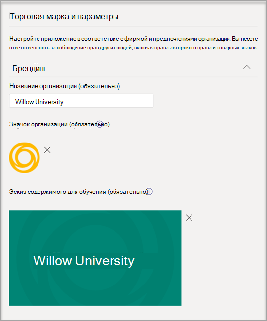

# Приобретение, настройка и Профконсультант для Microsoft Teams

Профконсультант — это Microsoft Teams для образования на сайте LinkedIn, которое предоставляет учащимся более высокого уровня персонализированные рекомендации по переходу к карьере. Профконсультант предлагает учебным заведениям единое решение для карьерной работы учащихся, которое позволяет им найти путь к карьере, развивать реальные навыки и создать свою сеть в одном месте.

## Поддерживаемые языки

Профконсультант локализованы на следующих языках:

- Китайский (упрощенное, совмеск. Китай)
- Китайский (традиционное письмо, Тайвань)
- Английский (США)
- Английский (Соединенное Королевство)
- Французский (Канада)
- Французский (Франция)
- Немецкий (Немецкий)
- Японский (Япония)
- Португальский (Бразилия)
- Испанский (Испания)
- Испанский (Мексика)

Подробнее о [Профконсультант](https://aka.ms/career-coach).

> [!NOTE]
> Используйте рекомендации и полезные советы из этого руководства, чтобы включить возможности Профконсультант для студентов, преподавателей и сотрудников. См. [статью Краткое руководство по планированию.](https://support.microsoft.com/office/c5d0b934-bfcf-4fe7-8a85-ba7bbb1b6ad4)

## Проверка требований

Чтобы включить Профконсультант для своего учебного заведения, просмотрите, что нужно для запуска приложения.

**Технические требования**

- Office 365 клиента с Azure Active Directory

- Microsoft Teams

- Подключения учетной записи LinkedIn в Azure Active Directory

**Лицензии**

- Факультет

- Студентов

> [!NOTE]
> Для Профконсультант конфигурации ИТ-администратору должна быть назначена лицензия на Профконсультант преподавателей.

**Данные и файлы из вашего образовательного учреждения**

- Данные каталога курса

- Предлагаемые поля исследования

- Страница LinkedIn образовательного учреждения

- LinkedIn Обучение с подпиской на campus (предпочтительный вариант)

## Приобретение лицензий Профконсультант лицензий

Профконсультант доступна по всему миру (за исключением Китая и России) для квалифицированных высших учебных заведений в качестве лицензии на надстройку через регистрирует решения для образовательных учреждений (EES), поставщики облачных услуг (CSP) и Центр администрирования Microsoft 365 (прямой веб-сайт). Чтобы приобрести Microsoft Teams надстройки, у клиентов должна быть Microsoft 365 A3/A5 или Office 365 A1/A3/A Профконсультант 5.

### Назначение лицензий на приложения пользователям

Пошаговую инструкцию см. в инструкциях по [назначению лицензий пользователям.](/microsoft-365/admin/manage/assign-licenses-to-users)

### Включить подключения к учетной записи LinkedIn

Профконсультант **требуется,** чтобы у пользователей учебного заведения была возможность подключать свою учетную запись Microsoft 365 к своей учетной записи LinkedIn, что упрощается в Профконсультант

1. Во войти в [Центр администрирования Azure AD](https://aad.portal.azure.com/) можно с помощью учетной записи, которая является глобальным администратором организации Azure AD.

2. Выберите **Пользователи**.

3. На странице **Пользователи** выберите **Параметры пользователя**.

4. В **области Подключения к учетной записи LinkedIn** разрешить пользователям подключать свои учетные записи для доступа к своим подключениям LinkedIn в некоторых приложениях Майкрософт. Никакие данные не делиться, пока пользователи не согласится подключить свои учетные записи.

   - Выберите **Да,** чтобы включить службу для всех пользователей в образовательном учреждении

   - Выберите **выбранную группу,** чтобы включить службу только для группы выбранных пользователей в вашем образовательном учреждении

   - Выберите **Нет,** чтобы отозвать согласие всех пользователей в образовательном учреждении

Узнайте, как [интегрировать подключения учетной записи LinkedIn в Azure Active Directory](/azure/active-directory/enterprise-users/linkedin-integration)

## Настройка Профконсультант в Центре Teams администрирования

С помощью параметров администратора в Центре Microsoft Teams вы можете настроить Профконсультант для своего учебного заведения и включить его для пользователей.

**Что необходимо учесть**

- Чтобы можно было использовать Профконсультант, необходимо выполнить следующие разделы: "Фирменная марка и параметры", LinkedIn
- CSV-форматы для каталога курса и поля исследования имеют требуемую форматирование и максимальный размер 18 МБ

- Если в приложении Профконсультант в настоящее время настроено использование в ближайшее время Профконсультант, необходимые разделы не выполнены.

- На страницах параметров с требуемой полями, если поля не заполнены, страница не будет отправляться
  - Пользователи не увидят предупреждающих сообщений, страница просто не будет отправляться

## Доступ к Профконсультант приложения

На странице [Управление приложениями](/microsoftteams/manage-apps) можно просмотреть Teams приложений в каталоге приложений учебного заведения.

1. Во sign in to the **Teams admin center**.

2. В левой области навигации выберите Teams **приложения Управление**  >  **приложениями**.  

    > [!NOTE]
    > Для доступа к странице необходимо быть глобальным Teams администратором службы.

3. Найдите или **найдите** Профконсультант .  

4. Выберите **Профконсультант**, а затем выберите **Параметры.**  

    

### Настройка параметров Профконсультант приложения

Профконсультант имеет пять категорий конфигурации:

- [Торговая марка и настройки](#brand-and-preferences)

- [Подключение к LinkedIn](#linkedin-connection)

- [Каталог курса](#course-catalog)

- [Поля исследования](#fields-of-study)

- [Настройки](#customization)

> [!NOTE]
> Чтобы эффективно включить приложение для студентов, преподавателей и  сотрудников, необходимо использовать фирменную марку и параметры, конфигурацию LinkedIn, каталог курса и поля обучения.

#### Торговая марка и параметры

Задайте название, логотип и язык по умолчанию учебного заведения на странице параметров и фирме.

> [!NOTE]
> Это необходимый раздел: Профконсультант невозможно включить, если не заданы фирменая марка и параметры.

##### Значок образовательного учреждения

Значок учебного заведения используется во всех Профконсультант для идентификации уникального содержимого учебного заведения, ресурсов каталога курсов во всем приложении и в разделе реальных функций панели мониторинга. Значок лучше всего отформатирован как:

- Прозрачный PNG
- Пропорции 1:1
- Максимальный размер: 64 px x 64 px.

##### Эскиз образовательного учреждения

Значок учебного заведения будет использоваться для ресурсов каталога курсов во всем приложении, если определенное изображение не доступно для курса. Значок лучше всего отформатирован как:

- A PNG
- Пропорции 16:9
- Максимальный размер: 360 px x 200 px.

#### Подключение к LinkedIn

Конфигурация LinkedIn связывает Профконсультант с данными общедоступных выпускников из LinkedIn.

> [!NOTE]
> Это необходимый раздел: Профконсультант невозможно включить без проверки подключения к странице LinkedIn.

##### Добавление и подтверждение страницы LinkedIn

Определите страницу LinkedIn учебного заведения. Найдите страницу LinkedIn, вы можете найти ее в LinkedIn или связаться с сотрудником, который является сотрудником службы по карьерной карьере, чтобы определить правильную страницу.  
  
1. Во sign in to the **Teams admin center**.

1. Выберите Teams **приложения**  >  **Управление приложениями**  >  **Профконсультант**  >  **LinkedIn подключение**.

2. Чтобы найти страницу LinkedIn, найдите ее в LinkedIn и выберите Учебный фильтр. Вы также можете связаться с сотрудником службы по карьерной карьере, чтобы определить правильную страницу LinkedIn для использования. [Определение страниц LinkedIn](https://www.linkedin.com/help/linkedin/answer/40133/differences-between-a-linkedin-page-for-a-school-and-company?lang=en)

    

3. Добавьте URL-адрес страницы LinkedIn учебного заведения. URL-адрес должен быть учебной страницей, а не страницей компании и обычно имеет формат `https://www.linkedin.com/school/willow-university/` .

   

4. Выберите **Отправить**.

5. В случае успешной отправки страница будет обновлена, и на странице покажутся ссылка Проверка и **срок** **действия ссылки Проверка.** Срок действия ссылки для проверки истекает через 30 дней.

     

6. Скопируйте ссылку на проверку и поделитесь им со страницей LinkedIn своего учебного заведения, супер администратором. Дополнительные информацию о роли супер администрирования на странице LinkedIn можно узнать в документации к администраторам страниц [LinkedIn.](https://www.linkedin.com/help/linkedin/answer/102672)

7. Администратор страницы LinkedIn использует уникальную ссылку для проверки, чтобы Профконсультант со страницей вашего учебного заведения. [Дополнительная документация по проверке страницы LinkedIn.](https://www.linkedin.com/help/linkedin/answer/102672)

> [!NOTE]
> Проверка со стороны суперадминистр страницы LinkedIn необходима для завершения подключения LinkedIn для Профконсультант.

   

#### Каталог курса

Каталог курсов представляет курсы и классы, предлагаемые учащимся учебным заведением.

> [!NOTE]
> Это необходимый раздел: Профконсультант невозможно включить без каталога курса.

Эти курсы используются в приложении в двух областях:

- Курсы возвращаются как часть учебных ресурсов.  

- Курсы и метаданные курса, например описания, используются для того, чтобы помочь учащимся определить свои навыки при отправке расшифровки.  

Чтобы создать каталог курсов, составьте список всех курсов, которые вы преподаете в учебном заведении, и загрузите его в CSV-файл. Приложение использует каталог курсов для определения навыков учащегося из его расшифровки и для определения курса.

##### Форматирование и схема документов каталога курсов

Документ должен быть в формате CSV с максимальным размером 18 МБ. Документ должен содержать обязательное название курса полей, его **ИД** и **URL-адрес курса.** Включив рекомендуемые поля, вы повысите качество работы учащихся, возвращая более лучшие результаты поиска и идентификацию навыков.

> [!NOTE]
> Начните с [образца документа каталога]( https://aka.ms/career-coach/docs/it-admins/sample-catalog) курса, чтобы приступить к работе.

В следующей таблице показаны элементы, которые нужно включить в каталог курса:

| Имя             | Статус      | Тип   | Описание                                                                    |
|------------------|-------------|--------|--------------------------------------------------------------------------------|
| courseId         | Обязательно    | Строка | Обычно ид курса (как правило, он сопописается с тем, что создается в записи разговоров). |
| Название            | Обязательно    | Строка | Обычно название курса.                                                      |
| sourceLink       | Обязательно    | URL    | Ссылка веб-сайта на страницу курса.                                               |
| Описание      | Рекомендуется | Строка | Вводный текст курса.                                              |
| language         | Рекомендуется | Строка | Язык курса. Используйте стандартные языковые коды.                           |
| Формат           | Рекомендуется | Строка | Режим обучения (в сети, видео, лично).                              |
| thumbnailLink    | Рекомендуется | URL    | Ссылка эскиза на изображение курса.                                            |
| thumbnailAltText | Рекомендуется | Строка | Заме доступа к изображению                                           |
| educationLevel   | Рекомендуется | Строка | Учебный уровень, пример. Студент-выпускник.                                       |
| Темы           | Рекомендуется | Строка | Темы и теги, связанные с навыками, которые преподаются в курсах.          |

##### Добавление каталога курса

1. Во sign in to the **Teams admin center**.

1. Выберите **Teams приложений Управление** &gt; **приложениями** &gt; **Профконсультант** &gt; **Параметры** &gt; **каталога курса**.  

2. Upload курсы в формате CSV с требуемой колонкой: courseId, название, sourceLink. Каждая строка должна включать данные для каждого из необходимых столбцов.

Включив рекомендуемые поля, вы повысите качество работы учащихся, возвращая более лучшие результаты поиска и идентификацию навыков.

4. Выберите **Отправить**.

   

#### Поля исследования

Поля исследования являются синонимами с основными областями интересов, академическими и градусами. На эти названия ссылается студент, когда он начинает использовать приложение и настраивает свой персонализированный профиль.

> [!NOTE]
> Это необходимый раздел, Профконсультант невозможно включить без списка полей исследования.

Добавьте все поля обучения, доступные учащимся, например инженерные, английский, бизнес и так далее. Список полей позволяет учащимся найти интересуют их поля и добавить в свой профиль область фокуса.

> [!NOTE]
> Начните с [примера поля в документе.](https://aka.ms/career-coach/docs/it-admins/sample-fieldsofstudy)

В следующей таблице показаны элементы, которые нужно включить в поля исследования:

| Имя          | Статус   | Тип   | Описание                    |
|---------------|----------|--------|--------------------------------|
| fieldsOfStudy | Обязательно | Строка | Имя поля исследования |

##### Добавление полей исследования

1. Во sign in to the **Teams admin center**.
1. Выберите **Teams приложений Управление** приложениями &gt;  &gt; **Профконсультант** &gt; **Параметры** &gt; **полей исследования**.  

2. Upload в формате CSV.

3. Выберите **Отправить**.

#### Настройки

Профконсультант можно настроить так, чтобы они были уникальными для вашего учебного заведения. Настройка поддерживает добавление функций на панель мониторинга. Рекомендуется добавлять ссылки на доски вакансий, мероприятия, офис служб по карьерной работе, мероприятия, связанные с карьерой, клубы учащихся и другие ресурсы, которые помогают учащимся получить реальный опыт.

##### Добавление настраиваемых функций

1. Во sign in to the **Teams admin center**.

1. Выберите **Teams приложений Управление** &gt; **приложениями** &gt; **Профконсультант**  >  **Параметры** &gt; **настройки**.

2. Добавьте каждый URL-адрес, заголовок и краткое описание.  
  
3. Выберите **Отправить**.

## Обеспечение Профконсультант для организации

Теперь Профконсультант настроена для вашей организации. Выполните эти действия, чтобы Профконсультант организации в Microsoft Teams.

### Включить приложение

После завершения настройки в включить приложение для учащихся и лицензированных пользователей, чтобы они могли Профконсультант.  
  
> [!NOTE]
> У вас должны быть разрешения глобального Teams роли администратора.

1. Во sign in to the **Teams admin center**.

1. Выберите Teams **приложения Управление** &gt; **приложениями** &gt; **Профконсультант**.

2. Переместить в положение Разрешено положение состояние **.**  

  > [!NOTE]
  > Разрешено означает, что приложение доступно для пользователей в вашем учебном заведении. Заблокировано означает, что приложение не доступно учащимся.

### Добавление Профконсультант как установленного приложения

> [!NOTE]
> Это гарантирует, что 1) Профконсультант правильно настроена для вашей организации 2), что учащиеся Профконсультант.

1. Во sign in to the **Teams admin center**.

2. Выберите **Teams политики установки** &gt; **приложений** Ваша &gt; *политика*.

3. В области Установленные приложения выберите Добавить приложения.

4. В области Добавить установленные приложения найщите приложения, которые вы хотите автоматически установить для пользователей, когда они начнут Teams. Вы также можете фильтровать приложения с помощью политики разрешений приложений. Выбрав список приложений, выберите Добавить.

### Закрепление приложения

Закрепление Профконсультант сделает приложение более доступным и видимым для учащихся.

1. Во sign in to the **Teams admin center**.

2. Выберите **Teams политики установки** &gt; **приложений** Ваша &gt; *политика*.

3. В **области Закрепленные приложения** выберите Добавить **приложения**.

4. Найщите **Профконсультант** и выберите **Добавить**.

5. Выберите порядок появления приложения и выберите **сохранить**.

> [!NOTE]
> Учащиеся будут уведомлены в Microsoft Teams о том Профконсультант что он закреплен.

Дополнительные [сведения можно и здесь:](/microsoftteams/teams-app-setup-policies) Управление политиками настройки приложений в Корпорации Майкрософт.

## Ресурсы

Следующие ресурсы помогут вам спланировать Профконсультант приложения.

- [Знакомство с Microsoft Teams](Teams-overview.md)

- [Как выполнить развертывание Teams](get-started-with-teams-resources-for-org-wide-rollout.md?tabs=SmallBusiness)

- [Обзор команд и каналов в Microsoft Teams](teams-channels-overview.md)

- [Управление приложениями в Microsoft Teams администрирования](manage-apps.md)

- [Набор виртуальных ориентаций в Интернете](https://www.microsoft.com/education/remote-learning/virtual-orientation)

- [Ограничения и спецификация Teams каналов](limits-specifications-teams.md)

- [Начало работы с обучением администраторов Microsoft Teams](ITAdmin-readiness.md)

- [Устранение неисправностей Teams](/microsoftteams/troubleshoot/teams-welcome)

- [Управление политиками разрешений для приложений в Microsoft Teams](teams-app-permission-policies.md)
