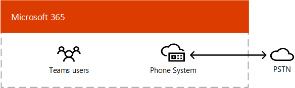

# Планирование решения голосовых команд 

В этой статье рассказывается, как выбрать, какое решение голосовой связи Майкрософт будет подставляться для вашей организации. После того как вы решите, статья содержит схему содержимого, которая позволит вам реализовать выбранное решение. 

Возможно, вам нужна простейшая &mdash; Телефонная система для решений с планом звонков. Это решение в облаке Microsoft, обеспечивающее функцию обмена частной ветвью (АТС) и звонки в коммутируемую телефонную сеть общего пользования (PSTN), как показано на приведенной ниже схеме. С помощью этого решения корпорация Майкрософт является вашим провайдером PSTN.

Если вы ответили "Да", то для вас вам нужно вам подписаться на телефонную систему с помощью тарифного плана.

- Тарифный план доступен в вашем регионе.
- Вы не обязаны хранить текущую несущую перевозчиков.
- Вы хотите использовать доступ к сети PSTN через управляемый Microsoft.

Однако ваша ситуация может быть более сложной. Например, у вас могут быть офисы в расположениях, где план звонков недоступен. Кроме того, вам может потребоваться комбинированное решение, которое поддерживает сложное развертывание с несколькими национальными региональными потребностями с различными требованиями для разных географических расположений. Корпорация Майкрософт поддерживает сочетание решений. 

- Телефонная система с планом звонков
- Телефонная система с собственной перевозчиком PSTN с прямой маршрутизацией
- Комбинированное решение, в котором используется телефонная система с планом звонков и телефонной системой с прямой маршрутизацией

## Что нужно прочитать?

**Обязательно для всех.** Некоторые из разделов этой статьи относятся ко всем организациям. Например, все должны прочитать сведения о телефонной системе и понять, как подключаться к общественной коммутируемой телефонной сети (PSTN). 

| Обязательно для всех | Описание |
| :------------|:-------|
| [**Телефонная система**](#phone-system) | Технология Microsoft, обеспечивающая возможность управления звонками и обмена личной ветвью в облаке Microsoft 365 с помощью Microsoft Teams. |
| [**Параметры подключения к общественной коммутируемой телефонной сети (КТСОП)**](#public-switched-telephone-network-connectivity-options) | Выбор между использованием Microsoft в качестве поставщика услуг телефонной связи или подключение собственного оператора телефонной связи к Microsoft Teams с помощью прямой маршрутизации. В сочетании с телефонной системой параметры подключения PSTN позволяют вашим пользователям звонить по всему миру.|

**В зависимости от ваших требований.** Некоторые разделы этой статьи имеют отношение к вашим существующим развернутым и требованиям. Например, Location-Based маршрутизацию требуется только для клиентов с прямым маршрутом в географических расположениях, которые не поддерживают платный звонок.

| В зависимости от ваших требований | Описание |
| :------------|:-------|
| [**Номера телефонов от корпорации Майкрософт**](#phone-numbers-from-microsoft) | Как получить номера телефонов от Майкрософт и как управлять ими, а также как перенести существующие номера в корпорацию Майкрософт. Прочтите этот документ, если вам необходимо получить номера телефонов для плана звонков по Microsoft, перенести существующие номера, получить номера служб и т. д. |
| [**Абонентские планы и маршрутизация звонков**](#dial-plans-and-call-routing) | Как настроить абонентские группы и управлять ими, которые преобразуют абонентские номера в альтернативный формат (обычно это формат E. 164) для авторизации звонков и маршрутизации звонков. Прочтите этот параметр, чтобы узнать, какие планы набора номера и как указать, нужно ли вам определять абонентские группы для своей организации.|
| [**Вызов экстренной помощи**](#emergency-calling) | Как управлять и настраивать вызов экстренной помощи в &mdash; зависимости от параметров подключения к сети PSTN. Прочтите этот раздел, если вы используете план звонков Microsoft или прямую маршрутизацию и хотите понять, как управлять вызовом экстренной помощи в Организации. |
| [**Маршрутизация на основе местоположения для прямой маршрутизации**](#location-based-routing-for-direct-routing) |Как использовать Location-Basedную маршрутизацию (LBR), чтобы ограничить платный звонок пользователям Microsoft Teams в соответствии с их географическим расположением. Прочтите этот раздел, если в вашей организации используется прямая маршрутизация в том месте, где не разрешено использовать платный звонок.
| [**Топология сети для функций голосовой связи в облаке**](#network-topology-for-voice-features) | Если в организации развернута Location-Basedная маршрутизация (LBR) для прямой маршрутизации или динамической службы экстренной помощи, необходимо настроить параметры сети для использования с этими функциями в Microsoft Teams. Прочтите этот раздел, если вы реализуете LBR для прямой маршрутизации или реализуете динамическую функцию вызова экстренной помощи в плане звонков или прямом маршруте. |
| [**Миграция существующего голосового решения**](#migrate-your-existing-voice-solution-to-teams) | Что нужно учесть при переносе голосовых решений в Teams.  Прочтите этот раздел, если вы выполняете миграцию из существующего голосового решения в Teams. 

> [!Important]
> В этой статье основное внимание уделяется решениям для голосовой связи в Microsoft Teams. Несмотря на то, что решения Skype для бизнеса Online по-прежнему доступны (как описано в разделе [решения для телефонной связи Microsoft](https://docs.microsoft.com/SkypeForBusiness/hybrid/msft-telephony-solutions)), важно понимать, что Skype для бизнеса Online будет прекращен до 31 июля 2021 г.  После этой даты служба Skype для бизнеса Online станет недоступна. Кроме того, с помощью PSTN-соединения между локальной средой, если &mdash; через Skype для бизнеса Server или с облачным &mdash; подключением и Skype для бизнеса Online больше не будет поддерживаться. В этой статье рассказывается о голосовых решениях для групп, а также о том, как при необходимости подключить локальную телефонную сеть к Teams с помощью прямой маршрутизации.

## Телефонная система

Телефонная система — это технология Microsoft, позволяющая использовать возможности управления звонками и обмена личной ветвью в облаке Microsoft 365 или Office 365 в Microsoft Teams.

Телефонная система работает с клиентами Teams и Skype для бизнеса, а также сертифицированными устройствами. Телефонная система позволяет заменить существующую систему УАТС набором функций, которые непосредственно доставляются из Microsoft 365 или Office 365. 

Звонки между пользователями в вашей организации обрабатываются внутри телефонной системы и никогда не переходят в телефонную сеть общего пользования (PSTN). Это относится к звонкам между пользователями в вашей организации, находящимися в разных географических регионах, удаляя на междугородную стоимость по этим внутренним звонкам.

В этой статье описаны следующие функции и возможности телефонной системы, а также решения по развертыванию, которые необходимо принять во всех случаях.

- [Автосекретари и очереди вызовов](#auto-attendants-and-call-queues)
- [Облачная голосовая почта](#cloud-voicemail)
- [Идентификация звонка](#calling-identity)

Сведения обо всех функциях телефонной системы и о том, как настроить телефонную систему, можно найти в следующих статьях:

- [Возможности телефонной системы](here-s-what-you-get-with-phone-system.md)
- [Настройка телефонной системы в Организации](setting-up-your-phone-system.md) 
  В этой статье рассказывается о том, как покупать и назначать лицензии на телефонную систему, управлять номерами телефонов, а также настраивать кредитные данные для бесплатных номеров. 

Сведения об управлении поддерживаемыми устройствами можно найти [в разделе Управление устройствами в Microsoft Teams](devices/device-management.md) и [Teams Marketplace](https://www.microsoft.com/microsoft-365/microsoft-teams/across-devices?ms.url=officecomteamsdevices&rtc=1).

### Автоматические ассистенты и очереди звонков

Автосекретарь позволяет настраивать параметры меню для направления звонков на основе ввода вызывающего абонента. Очереди звонков — это ожидающие области для вызывающих абонентов. Используемые вместе, автоматические ассистенты и очереди звонков могут легко перенаправлять вызывающих абонентов на подходящее лицо или подразделение в Организации.

Сведения об автосекретарях и очередях звонков можно найти в следующих статьях:

- [Планирование автоматических ассистентов и очередей звонков в Teams](plan-auto-attendant-call-queue.md)
- [Настройка автосекретаря](create-a-phone-system-auto-attendant.md)
- [Создание очереди вызовов](create-a-phone-system-call-queue.md) 
- [Исследование успеха Contoso: автосекретарей и очереди звонков](voice-case-study-call-queues.md) 
  В этой статье рассказывается о том, как вымышленная многонациональная корпорация, компания Contoso автоматически реализовала автосекретарьы и очереди звонков для голосовых решений.

### Облачная голосовая почта

Облачная Голосовая почта на базе служб Azure голосовой почты поддерживает депозиты голосовой почты только для почтовых ящиков Exchange. Она не поддерживает сторонние системы электронной почты. 

Облачная Голосовая почта включает функцию транскрипции голосовой почты, которая включена для всех пользователей в вашей организации по умолчанию. Для вашего бизнеса может потребоваться отключить функцию транскрипции голосовой почты для отдельных пользователей или всех участников в рамках всей Организации.

Для пользователей, не подключенных к сети, облачная Голосовая почта автоматически настраивается и предоставляется пользователям после назначения лицензии на телефонную систему. Для пользователей телефонной системы в почтовом ящике Exchange вам потребуется выполнить дополнительные действия по настройке. 

Дополнительные сведения о облачной голосовой почте и ее настройке можно найти в следующих статьях:

- [Настройка облачной голосовой почты](set-up-phone-system-voicemail.md)
- [Настройка политик голосовой почты в Организации](set-up-phone-system-voicemail.md#setting-voicemail-policies-in-your-organization)

### Идентификация звонка

По умолчанию во всех исходящих звонках используется назначенный номер телефона для идентификации звонка (идентификатор вызывающего абонента). Получатель звонка может быстро идентифицировать звонящего и решить, следует ли принять или отклонить вызов. Сведения о настройке идентификатора вызывающего абонента, а также о том, как изменить или заблокировать идентификатор звонящего, можно найти [в разделе Установка идентификатора вызывающего абонента для пользователя](set-the-caller-id-for-a-user.md). 

## Параметры подключения по коммутируемой телефонной сети с открытым подключением

Телефонная система предоставляет полные возможности УАТС для вашей организации. Однако чтобы разрешить пользователям совершать звонки за пределами вашей организации, необходимо подключить телефонную систему к общественной коммутируемой телефонной сети. Чтобы подключить телефонную систему к КТСОП, вы можете выбрать один из следующих вариантов:

- [**Телефонная система с планом звонков**](#phone-system-with-calling-plan). Решение "все в облаке" с корпорацией Майкрософт в качестве несущей для КТСОП.

- [**Телефонная система с собственной перевозчиком PSTN**](#phone-system-with-own-pstn-carrier-with-direct-routing) , использующая прямую маршрутизацию для подключения локальной среды к Teams.

Вы также можете выбрать сочетание параметров, которое позволит вам спроектировать решение для сложной среды или управлять многошаговой миграцией (Дополнительные сведения о миграции позже).

### Телефонная система с планом звонков 

Как описывалось ранее в этой статье, телефонная система с планом звонков — это комплексное решение для пользователей Teams в рамках облака Microsoft. Это самый простой вариант, который позволяет подключить телефонную систему Microsoft к общественной коммутируемой телефонной сети, чтобы звонить на стационарные телефоныные и мобильные телефоны по всему миру. С помощью этого параметра Корпорация Майкрософт предоставляет возможности обмена данными между филиалами в вашей организации и действует в качестве перевозчика PSTN, как показано на рисунке ниже.

Если вы ответили "Да", то для вас вам нужно вам подписаться на телефонную систему с помощью тарифного плана.

- Тарифный план доступен в вашем регионе.
- Вы не обязаны хранить текущую несущую перевозчиков.
- Вы хотите использовать доступ к сети PSTN через управляемый Microsoft.

С помощью этого параметра: 

- Вы получаете телефонную систему Майкрософт со всеми планами внутренних и международных звонков, которые позволяют звонить на телефоны по всему миру (в зависимости от уровня обслуживания, на котором выполняется лицензирование).

- Вам не требуется развертывание или обслуживание локального развертывания, &mdash; поскольку план звонков работает из Microsoft 365 или Office 365.

- Примечание. при необходимости вы можете подключить поддерживаемый контроллер границ (SBC) для взаимодействия с помощью прямой маршрутизации, чтобы обеспечить взаимодействие с другими сторонними АТС, аналоговыми устройствами и сторонним оборудованием телефонной связи, которые поддерживаются SBC.

Для использования этого параметра требуется непрерывное подключение к Microsoft 365 или Office 365.

Дополнительные сведения о плане звонков можно найти в следующих статьях:

- [Какой план звонков подходит для вас?](calling-plan-landing-page.md)
- [Как купить план звонков](calling-plans-for-office-365.md)
- [Доступность планов звонков в различных странах и регионах](https://docs.microsoft.com/microsoftteams/country-and-region-availability-for-audio-conferencing-and-calling-plans/country-and-region-availability-for-audio-conferencing-and-calling-plans)
- [Настройка плана звонков](set-up-calling-plans.md)

### Телефонная система с собственной перевозчиком PSTN с прямой маршрутизацией

Этот параметр подключает телефонную систему Microsoft к сети телефонной связи с помощью Direct Routing, как показано на рисунке ниже. 

Если вы ответили да на указанные ниже вопросы, телефонная система с прямой маршрутизацией является нужным решением.

- Вы хотите использовать Teams в качестве телефонной системы.
- Вы должны сохранить текущую несущую перевозчиков.
- Вы хотите смешать маршрут, с помощью которого можно позвонить по тарифному плану, а не через оператора.
- Вам нужно взаимодействовать со сторонними АТС и/или оборудованием, такими как пейджеры, аналоговые устройства и т. д.

С помощью этого параметра:

- Вы подключаете собственный поддерживаемый SBC к телефонной системе Microsoft, не требуя дополнительного локального программного обеспечения.

- Вы можете использовать практически любую несущую телефонную систему с телефонной системой Microsoft.

- Вы можете настроить этот параметр и управлять им, а также настроить и управлять им с помощью оператора или партнера (попросите оператора или партнера предоставить этот параметр).

- Вы можете настроить взаимодействие между оборудованием телефонной связи, &mdash; например АТС и аналоговым устройством, &mdash; а также телефонной системой Microsoft.

Для этого параметра требуется следующее:

- Непрерывное подключение к Microsoft 365 или Office 365.

- Развертывание и сохранение поддерживаемого SBC.

- Контракт с независимым провайдером.
  (За исключением случаев, когда вы разворачиваете этот вариант, чтобы предоставить подключение к сторонней УАТС, аналоговым устройствам и другим телефонам оборудования для пользователей, которые работают в телефонной системе с планом звонков.)

Дополнительные сведения о прямой маршрутизации можно найти в следующих статьях:

- [Прямая маршрутизация телефонной системы](direct-routing-landing-page.md)
- [Планирование прямой маршрутизации](direct-routing-plan.md)
- [Настройка прямой маршрутизации](direct-routing-configure.md)
- [Управление политиками голосовой маршрутизации для прямой маршрутизации](manage-voice-routing-policies.md)
- [Планирование маршрутизации на основе расположения для прямой маршрутизации](location-based-routing-plan.md)
- [Список пограничных контроллеров сеансов, сертифицированных для прямой маршрутизации](direct-routing-border-controllers.md)

## Номера телефонов от корпорации Майкрософт

У Microsoft есть два типа телефонных номеров: номера *абонентов* (пользователей), которые могут быть назначены для пользователей в вашей организации, и номера *услуг* , доступные в виде платных и бесплатных номеров услуг. Номера служб обладают более высокой емкостью, чем номера абонентов, и могут быть назначены для таких служб, как голосовая конференция, автосекретарь или очереди звонков.

Вам потребуется решить следующие действия:

- В каких расположениях пользователей должны быть введены новые номера телефонов из Microsoft?
- Какой тип номера телефона (подписчика или службы) нужен? 
- Как перенести существующие номера телефонов в Teams?

Дополнительные сведения об управлении телефонными номерами в вашей организации, в том числе о том, как получить новые номера или переноситься на другой номер, можно найти в следующих статьях:

- [Управление номерами телефонов для организации](manage-phone-numbers-for-your-organization/manage-phone-numbers-for-your-organization.md) 
- [Различные виды телефонных номеров, используемых для тарифного плана](different-kinds-of-phone-numbers-used-for-calling-plans.md)
- [Получение номеров телефонов для пользователей](getting-phone-numbers-for-your-users.md)
- [Передача телефонных номеров в Microsoft Teams](phone-number-calling-plans/transfer-phone-numbers-to-teams.md)

## Абонентские планы и маршрутизация звонков

Абонентская группа — это набор правил нормализации, который преобразует номера набранных номеров в альтернативный формат (обычно это формат E. 164) для авторизации звонков и маршрутизации звонков.

Вам потребуется решить следующие действия: 

- Требуется ли моей организации настраиваемая абонентская группа?
- Для каких пользователей нужна настраиваемая абонентская группа?
- Какая абонентская группа клиента должна быть назначена каждому пользователю?

Дополнительные сведения можно найти в следующих статьях: 

- [Что такое абонентские группы?](what-are-dial-plans.md)
- [Планирование абонентских планов для клиентов](what-are-dial-plans.md#planning-for-tenant-dial-plans)
- [Создание и использование абонентских групп](create-and-manage-dial-plans.md)

## Экстренные вызовы

Способ настройки вызова для экстренного реагирования зависит от параметра подключения по протоколу PSTN: план звонков или прямая маршрутизация (Майкрософт). Динамическое обращение в службу экстренной помощи в плане звонков и прямом маршруте для телефонной системы обеспечивает возможность настраивать и перенаправлять экстренные вызовы и уведомлять сотрудников системы безопасности в соответствии с текущим расположением клиента Teams. Дополнительные сведения о концепциях и терминологии для экстренных вызовов, а также о настройке динамической службы экстренной помощи можно найти в следующих статьях:

- [Управление вызовом экстренной помощи](what-are-emergency-locations-addresses-and-call-routing.md)
- [Планирование и настройка динамических экстренных вызовов](configure-dynamic-emergency-calling.md)
- [Исследование успеха Contoso: вызов экстренной помощи](voice-case-study-emergency-calling.md) 
  В этой статье рассказывается о том, как вымышленная многонациональная корпорация компании Contoso реализовала возможность вызова экстренной помощи в своей организации.

## Маршрутизация Location-Based для прямой маршрутизации

В некоторых странах и регионах не следует обходиться поставщиком услуг телефонной сети общего пользования (PSTN), чтобы снизить стоимость звонков на междугородную связь. Маршрутизация Location-Based за прямую маршрутизацию позволяет ограничивать платный звонок пользователям Microsoft Teams в соответствии с их географическим расположением. Дополнительные сведения о планировании и настройке маршрутизации Location-Based (LBR) можно найти в следующих статьях:

- [Планирование маршрутизации на основе расположения для прямой маршрутизации](location-based-routing-plan.md)
- [Настройка параметров сети для маршрутизации на основе расположения](location-based-routing-configure-network-settings.md)
- [Включение функции "Маршрутизация на основе расположения" для прямой маршрутизации](location-based-routing-enable.md)
- [Исследование успеха Contoso: Location-Based маршрутизация](voice-case-study-location-based-routing.md) 
  В этой статье рассказывается о том, как вымышленная многонациональная корпорация компания Contoso реализовала Location-Based маршрут для своей организации.

## Топология сети для функций голосовой связи

Если вы развернут динамический вызов экстренной помощи или Location-Based маршрутизацию для прямой маршрутизации, необходимо настроить параметры сети для использования с этими функциями в Microsoft Teams. Чтобы узнать, как настроить параметры сети, сетевые сайты, подсети сети и доверенные IP-адреса, ознакомьтесь со следующими статьями.

- [Параметры сети для функций голосовой связи в облаке в Microsoft Teams – понятия и терминология](cloud-voice-network-settings.md)
- [Управление топологией сети для облачных функций голосовой связи в Microsoft Teams](manage-your-network-topology.md)

## Перенос существующих решений голосовой связи в Teams

Для Организации, которая выполняет обновление до Teams, конечная цель состоит в том, чтобы переместить всех пользователей в режим TeamsOnly. Использование телефонной системы в Teams поддерживается, только если пользователь находится в режиме TeamsOnly. Если вам понадобятся основные сведения об обновлении до Teams, Начните отсюда.

- [Начало перехода на Microsoft Teams](upgrade-start-here.md)
- [Схема перехода](upgrade-framework.md)
- [Переход с Skype для бизнеса на Teams (для ИТ-администраторов)](upgrade-to-teams-on-prem-overview.md)

При переходе по голосовому решению существует четыре возможных сценария вызова при переходе в режим TeamsOnly:

- [**Пользователь в Skype для бизнеса Online с планом вызова Microsoft**](upgrade-to-teams-on-prem-pstn-considerations.md#from-skype-for-business-online-with-microsoft-calling-plans). После обновления у этого пользователя будет по-прежнему содержаться план звонков по Microsoft.

- **[Пользователь в Skype для бизнеса Online с локальной функцией голосовой связи](upgrade-to-teams-on-prem-pstn-considerations.md#from-skype-for-business-online-with-on-premises-voice) через Skype для бизнеса в локальной или облачной версии**. Переход пользователя на Teams необходимо координировать с помощью миграции пользователя в направлении прямой маршрутизации, чтобы убедиться в том, что у пользователя TeamsOnly есть функция КТСОП.

- **[Пользователь в локальной среде Skype для бизнеса с корпоративной голосовой](upgrade-to-teams-on-prem-pstn-considerations.md#from-skype-for-business-server-on-premises-with-enterprise-voice-to-direct-routing)связью, который будет переходить на Интернет и поддерживать локальную сеть PSTN**. Для миграции этого пользователя в Teams требуется переместить локальную учетную запись пользователя Skype для бизнеса в облако, а также перенести его с помощью миграции пользователей на прямую переадресацию. 

- **[Пользователь в локальной среде Skype для бизнеса с корпоративной голосовой](upgrade-to-teams-on-prem-pstn-considerations.md#from-skype-for-business-server-on-premises-with-enterprise-voice-to-microsoft-calling-plan)связью, который будет переноситься в Интернет и с помощью плана звонков Microsoft**.  Для миграции этого пользователя в Teams требуется переместить локальную учетную запись пользователя Skype для бизнеса в облако, а также прикрепить ее с помощью A) к номеру телефона этого пользователя в плане Microsoft о звонке или B) назначить новый номер абонента из доступных регионов.

Дополнительные сведения о том, как внедрить голосовую миграцию для каждого из этих сценариев &mdash; , в том числе сведения о том, когда нужно настроить гибридное подключение, а также о том, как перенести пользователей с помощью локальных голосовых функций в прямые маршруты, можно &mdash; найти в следующих статьях:

- [Рекомендации по КТСОП при обновлении до Teams (для ИТ-администраторов)](upgrade-to-teams-on-prem-pstn-considerations.md)

- [Учебный анализ для переноса голосовых учетных записи contoso](voice-case-study-overview.md) 
  В этой статье объясняется, как вымышленная многонациональная корпорация компании Contoso реализовала для своей организации решение для голосовой связи по группам. Она включает следующие статьи:

  - [План обновления Teams](voice-case-study-migration-plan.md)
  - [Параметры телефонной системы и подключения к PSTN](voice-case-study-phone-system.md)
  - [Реализация маршрутизации на основе местоположения](voice-case-study-location-based-routing.md)
  - [Вызов экстренной помощи](voice-case-study-emergency-calling.md)
  - [Автосекретари и очереди вызовов](voice-case-study-call-queues.md)
  - [Аудиоконференции](voice-case-study-audio-conferencing.md)

