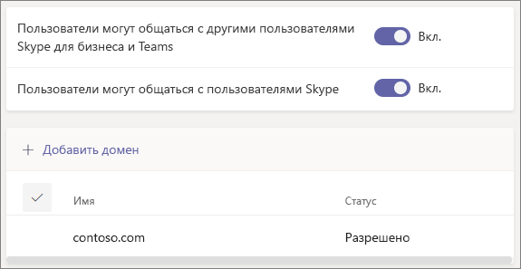

# Использование гостевого и внешнего доступа для совместной работы с людьми из-за пределов организации

В этой статье описаны два варианта совместной работы с людьми за пределами организации.

- **Внешний доступ** — тип федерации, позволяющий пользователям находить людей из других организаций, а также звонить им и общаться с ними в чате. Этих людей невозможно добавить в команду, если они не приглашены в качестве гостей.
- **Гостевой доступ**. Гостевой доступ позволяет приглашать людей из-за пределов вашей организации, чтобы они присоединялись к команде. Приглашенные люди получают гостевую учетную запись в Azure Active Directory.

Полный обзор внешней совместной работы в Microsoft 365 см. в статье [Обзор параметров внешней совместной работы в Microsoft 365](/microsoft-365/enterprise/external-guest-access).

## Внешний доступ (внешний чат и собрания)

Настройте внешний доступ, если вам нужно найти, позвонить, начать чат и настроить собрания с людьми из-за пределов вашей организации, использующими Teams, Skype для бизнеса (локальную или сетевую версию) или Skype. 

По умолчанию внешний доступ включен для всех доменов. Вы можете ограничить внешний доступ, разрешив или заблокировав определенные домены либо отключив его.

Внешний доступ предусмотрен для следующих клиентов.
- Управляемые корпоративные учетные записи
     - Только между коммерческими
     - Только между GCC
     - Только между GCC High
     - Только между DOD
- Неуправляемые (личные) учетные записи
     - Только между коммерческими и личными учетными записями
- Skype для бизнеса взаимодействия
     - Между коммерческими, GCC, GCC High и DoD
- Взаимодействие Skype
     - Только между коммерческим приложением и Skype

Сведения о настройке внешнего доступа см. в статье [Управление внешним доступом](manage-external-access.md). 

>[!NOTE]
> Лицензии [бесплатной версии Microsoft Teams (классической)](https://support.microsoft.com/office/welcome-to-microsoft-teams-free-classic-6d79a648-6913-4696-9237-ed13de64ae3c) не поддерживают внешний доступ.

## Гостевой доступ

Используйте гостевой доступ, чтобы добавить человека из-за пределов вашей организации в команду, где он сможет общаться, звонить, участвовать в собраниях и совместно работать над файлами. Гостю можно предоставлять практически все возможности Teams, доступные участнику команды. Дополнительные сведения см. в статье [Возможности гостя в Teams](guest-experience.md).

Гости добавляются в Azure Active Directory вашей организации в качестве пользователей службы совместной работы B2B и должны войти в Teams с помощью своей гостевой учетной записи. Это означает, что им может потребоваться выйти из своей организации, чтобы войти в вашу организацию.

Гостевой доступ предусмотрен для следующих клиентов.

- Между коммерческими клиентами и GCC
- Только между GCC High
- Только между DOD

Чтобы настроить гостевой доступ в Teams, см. статью [Совместная работа с гостями в команде](/microsoft-365/solutions/collaborate-as-team).

## Сравнение внешнего и гостевого доступа

В следующих таблицах показаны различия между использованием внешнего доступа (федерации) и гостей. В обоих случаях пользователи из-за пределов вашей организации определяются как внешние для ваших пользователей.

### Действия, доступные вашим пользователям

| Возможности пользователей | Пользователи внешнего доступа | Гости |
|---------|-----------------------|--------------------|
| Общение в чате с кем-либо из другой организации | Да | Да |
| Звонки кому-либо из другой организации | Да | Да |
| Просмотр того, доступен ли кто-то из другой организации для звонков или общения в чате | Да | Да1 |
| Поиск людей в других организациях | Да2 | Нет |
| Совместное использование файлов | Нет | Да |
| Просмотр сообщения об отсутствии на рабочем месте пользователя из другой организации | Нет | Да |
| Блокировка пользователя из другой организации  | Нет | Да |
| Использование @упоминаний | Да3 | Да |

### Действия, которые могут выполнять люди из-за пределов вашей организации

| Возможности людей из-за пределов вашей организации | Пользователи внешнего доступа | Гости |
|---------|-----------------------|--------------------|
| Обращение к ресурсам Teams | Нет | Да |
| Возможность их добавления в групповой чат | Да | Да |
| Возможность их приглашения на собрание | Да | Да |
| Совершение приватных звонков | Да | Да5 |
| Просмотр номеров телефонов участников собрания с телефонным подключением | Нет4 | Да |
| Использование видео по IP | Да | Да5 |
| Использование демонстрации экрана | Да3 | Да5 |
| Использование быстрого незапланированного собрания | Нет | Да5 |
| Редактирование отправленных сообщений | Да3 | Да5 |
| Удаление отправленных сообщений | Да3 | Да5 |
| Использование Giphy в беседе | Да3 | Да5 |
| Использование в беседе мемов | Да3 | Да5 |
| Использование в беседе стикеров | Да3 | Да5 |
| Отображается присутствие | Да | Да |
| Использование @упоминаний | Да3 | Да |

 

1 Если пользователь добавлен в качестве гостя и вошел с помощью гостевой учетной записи. 
2 Только по электронной почте или по протоколу SIP. 
3 Поддерживается для приватных чатов только между пользователями Teams из разных организаций.  
4 По умолчанию внешние участники не видят номера телефонов участников с телефонным подключением. Если нужно обеспечить конфиденциальность этих телефонных номеров, выберите **Тональные сигналы** для пункта **Тип объявлений о входе/выходе** (это позволит предотвратить прочтение номеров приложением Teams). Дополнительные сведения см. в статье [Включение и отключение оповещений о входе на собрание и выходе из него в Microsoft Teams](turn-on-or-off-entry-and-exit-announcements-for-meetings-in-teams.md). 
5 Разрешено по умолчанию, но может быть отключено администратором Teams.

## Статьи по теме

[Внешний доступ в Teams](manage-external-access.md)

[Гостевой доступ в Teams](guest-access.md)
