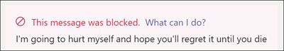

# Соответствие требованиям к общению с Microsoft TeamsCommunication compliance with Microsoft Teams

Соответствие требованиям к связи — это решение в Microsoft 365, позволяющее свести к минимуму риски в общении, помогая определять, фиксировать и исполнить нежелательные сообщения в Организации.Communication compliance is an insider risk solution in Microsoft 365 that helps minimize communication risks by helping you detect, capture, and act on inappropriate messages in your organization.

В Microsoft Teams соответствие требованиям помогает идентифицировать [следующие типы](https://docs.microsoft.com/microsoft-365/compliance/communication-compliance-feature-reference) неуместного содержимого в каналах Teams, а также в 1:1 и групповых чатах.For Microsoft Teams, communication compliance helps identify the [following types](https://docs.microsoft.com/microsoft-365/compliance/communication-compliance-feature-reference) of inappropriate content in Teams channels or in 1:1 and group chats:

- Оскорбительный, нецензурный и преследованиющий языкOffensive, profane, and harassing language
- Для взрослых, racyов и goryных изображенийAdult, racy, and gory images
- Совместное использование конфиденциальной информацииSharing of sensitive information

Дополнительные сведения о требованиях к общению и настройке политик для организации можно найти [в разделе соответствие требованиям в Microsoft 365](https://docs.microsoft.com/microsoft-365/compliance/communication-compliance).For more information on communication compliance and how to configure policies for your organization, see [Communication compliance in Microsoft 365](https://docs.microsoft.com/microsoft-365/compliance/communication-compliance).

## Использование соответствия связью в Microsoft TeamsHow to use communication compliance in Microsoft Teams

Соответствие требованиям к общению и Microsoft Teams тесно интегрировано и может помочь минимизировать риски связи в Организации.Communication compliance and Microsoft Teams are tightly integrated and can help minimize communication risks in your organization. После настройки первой политики соответствия требованиям вы можете активно управлять неуместными сообщениями Microsoft Teams и содержимым, которое автоматически помечается в оповещениях.After you've configured your first communication compliance policies, you can actively manage inappropriate Microsoft Teams messages and content that is automatically flagged in alerts.

### Начало работыGetting started

Приступая к работе с обеспечением соответствия требованиям в Microsoft Teams, вы начнете [планировать](https://docs.microsoft.com/microsoft-365/compliance/communication-compliance-plan) и создавать предопределенные или пользовательские политики для выявления нежелательных действий пользователей в каналах Teams, а также в 1:1 и группах.Getting started with communication compliance in Microsoft Teams begins with [planning](https://docs.microsoft.com/microsoft-365/compliance/communication-compliance-plan) and creating pre-defined or custom policies to identify inappropriate user activities in Teams channels or in 1:1 and groups. Имейте в виду, что в процессе настройки вам потребуется [настроить](https://docs.microsoft.com/microsoft-365/compliance/communication-compliance-configure) некоторые разрешения и базовые компоненты.Keep in mind that you'll need to [configure](https://docs.microsoft.com/microsoft-365/compliance/communication-compliance-configure) some permissions and basic prerequisites as part of the configuration process.

Администраторы Teams могут настроить политики соответствия требованиям к связи на следующих уровнях:Teams administrators can configure communication compliance policies at the following levels:

- **Пользовательский уровень**: политики на этом уровне применяются к отдельным пользователям Teams или могут быть применены для всех пользователей Teams в Организации.**User level**: Policies at this level apply to an individual Teams user or may be applied to all Teams users in your organization. Эти политики охватывают сообщения, которые могут отправлять пользователи в 1:1 или групповых чатах.These policies cover messages that these users may send in 1:1 or group chats. Обмен сообщениями в чате для пользователей автоматически контролируется во всех Microsoft Teams, в которых пользователи являются участниками.Chat communications for the users are automatically monitored across all Microsoft Teams where the users are a member.
- **Уровень Teams**: политики на этом уровне применяются к каналу команды Microsoft.**Teams level**: Policies at this level apply to a Microsoft Team channel. Эти политики охватывают сообщения, отправляемые только в канале Teams.These policies cover messages sent in the Teams channel only.

### Работа с недопустимыми сообщениями в Microsoft TeamsAct on inappropriate messages in Microsoft Teams

После того как вы настроили политики и получили уведомления о соответствии требованиям в сообщениях Microsoft Teams, вы можете сделать так, чтобы проверяющие на соответствие в вашей организации предприняли необходимые меры для этих сообщений.After you have configured your policies and have received communication compliance alerts for Microsoft Teams messages, it's time for compliance reviewers in your organization to take action on these messages. С помощью рецензентов можно защитить вашу организацию, изменив уведомления о соответствии на связи и удалив помеченные сообщения в Microsoft Teams.Reviewers can help safeguard your organization by reviewing communication compliance alerts and removing flagged messages from view in Microsoft Teams.

Удаленные сообщения и содержимое заменяются уведомлениями для посетителей о том, что сообщение или содержимое было удалено и какая политика применяется к удалению.Removed messages and content are replaced with notifications for viewers explaining that the message or content has been removed and what policy is applicable to the removal. Отправитель удаляемого сообщения или содержимого также уведомлен о состоянии удаления и содержит исходное содержимое сообщения для контекста, связанного с его удалением.The sender of the removed message or content is also notified of the removal status and provided with original message content for context relating to its removal. Отправитель также может просмотреть определенные условия политики, которые применяются к удалению сообщения.The sender can also view the specific policy condition that applies to the message removal.

Пример подсказки политики для отправителя:Example of policy tip seen by sender:

Пример уведомления о состоянии политики, отображаемого отправителем:Example of policy condition notification seen by the sender:

Пример подсказки политики, которую появлял получатель:Example of policy tip seen by recipient:

