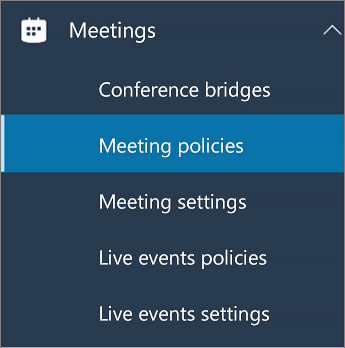

# Настройка общего доступа к рабочему столу в Microsoft Teams

Общий доступ к рабочему столу позволяет пользователям отображать экран или приложение во время встречи или чата. Администраторы могут настроить общий доступ к экрану в Microsoft Teams, чтобы пользователи могли совместно использовать весь экран, приложение или файл. Вы можете разрешить пользователям предоставлять или запрашивать контроль, разрешать общий доступ к PowerPoint, добавлять доску и разрешать общие заметки. Вы также можете настроить, могут ли анонимные или внешние пользователи запрашивать управление общим экраном. Внешних участников собраний Teams можно классифицировать следующим образом.

- Анонимный пользователь
- Гостевые пользователи
- Пользователь B2B
- Федеративный пользователь

Чтобы настроить общий экран, вы создаете новую политику собраний, а затем назначаете ее пользователям, которыми хотите управлять.

**В [центре администрирования Microsoft Teams](https://admin.teams.microsoft.com/)**

1. Выберите **Собрания** > **политики собраний**.

    

2. На странице **Политики собраний** выберите **Добавить**.

    

3. Дайте вашей политике уникальный заголовок и введите краткое описание.

4. В разделе **Общий доступ к контенту** выберите **режим совместного использования экрана** из раскрывающегося списка:

   - **Весь экран** - позволяет пользователям совместно использовать весь рабочий стол.
   - **Одно приложение** - позволяет пользователям ограничить общий доступ к экрану одним активным приложением.
   - **Отключено** - отключение общего доступа к экрану.

    

  > [!Note]
  > Вам не нужно включить политику звонков, чтобы пользователи могли использовать доступ к экрану из чата. Однако звук отключается, пока он не включит свой звук. Кроме того, пользователь, который делится экраном, может нажать кнопку **Добавить звук,** чтобы включить звук. Если политика звонков отключена, пользователи не смогут добавлять звук к экранной ленте из сеанса чата.

5. Включите или выключите следующие параметры:

    - **Разрешить участнику предоставить или** запросить управление — позволяет участникам группы предоставить или запросить контроль над рабочим столом или приложением участника.
    - **Разрешить внешнему участнику предоставить или запросить управление** — это политика "на пользователя". Настройка этого параметра организацией для пользователя не управляет возможностями внешних участников, независимо от того, что установил организатор собрания. Этот параметр определяет, могут ли внешние участники предоставлять или запрашивать управление экраном пользователя, предоставившего общий доступ, в зависимости от того, что этот пользователь настроил в политиках собраний своей организации.
    - **Предоставление общего доступа к PowerPoint** — позволяет пользователям создавать собрания, позволяющие отправлять и предоставлять доступ к презентациям PowerPoint.
    - **Разрешить на доске** — позволяет пользователям делиться досками.
    - **Разрешить общие заметки** - позволяет пользователям делать общие заметки.

6. Щелкните **Сохранить**.

## Используйте PowerShell для настройки общего рабочего стола

Вы также можете использовать командлет [Set-CsTeamsMeetingPolicy](/powershell/module/skype/set-csteamsmeetingpolicy?view=skype-ps) для управления общим доступом к рабочему столу. Установите следующие параметры:

- Описание
- ScreenSharingMode
- AllowPrivateCalling
- AllowParticipantGiveRequestControl
- AllowExternalParticipantGiveRequestControl
- AllowPowerPointSharing
- AllowWhiteboard
- AllowSharedNotes

[Подробнее об использовании командлета csTeamsMeetingPolicy](/powershell/module/skype/set-csteamsmeetingpolicy?view=skype-ps).