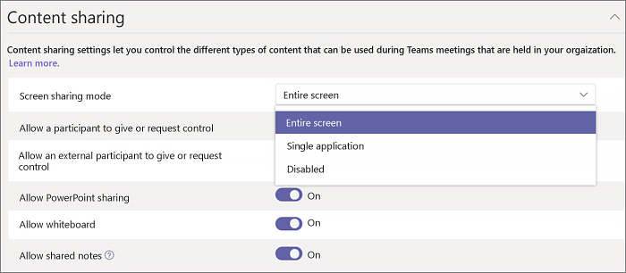

Совместный доступ к рабочему столу в Microsoft Teams
============================================

Общий доступ к рабочему столу позволяет пользователям Показать экран или приложение во время собрания или чата. Администраторы могут настроить демонстрацию экрана в Microsoft Teams, чтобы позволить пользователям демонстрировать весь экран, приложение или файл. Вы можете предоставить пользователям разрешение или запрос на управление, разрешить общий доступ к PowerPoint, добавить доску и разрешить доступ к общим заметкам. Вы также можете указать, могут ли анонимные или внешние пользователи запрашивать управление общим экраном.

Чтобы настроить демонстрацию экрана, создайте новую политику собраний и назначьте ее пользователям, которым хотите управлять.

**В центре администрирования Microsoft Teams**

1.  > Выберите ******политики собраний**для собраний.

    

2. На странице **политики собрания** нажмите кнопку **создать политику**.

    

3. Задайте для политики уникальный заголовок и введите краткое описание.

4. В разделе **общий доступ к контенту**выберите **режим демонстрации экрана** из раскрывающегося списка.

   - **Весь экран** — позволяет пользователям делиться на всем рабочем столе.
   - **Единое приложение** — позволяет пользователям ограничить демонстрацию экрана одним активным приложением.
   - **Disabled** (отключено) — отключает демонстрацию экрана.

    

5. Включать и отключать следующие параметры:

    - **Разрешать участнику предоставлять или запрашивать контроль** – позволяет членам команды предоставлять или запрашивать контроль над классической версией или приложением выступающего.
    - **Разрешать внешнему участнику предоставлять или запрашивать контроль** — позволяет гостям и внешним (федеративным) пользователям предоставлять или запрашивать управление классической версией и приложением докладчика.
    - **Разрешить общий доступ к PowerPoint** — позволяет пользователям создавать собрания, позволяющие отправлять и предоставлять общий доступ к презентациям PowerPoint.
    - **Разрешить доску** — позволяет пользователям делиться досками.
    - **Разрешить общие заметки** — позволяет пользователям использовать общие заметки.

6. Нажмите кнопку **Сохранить**.

## Настройка общего рабочего стола с помощью PowerShell

Вы также можете использовать командлет [Set-кстеамсмитингполици](https://docs.microsoft.com/en-us/powershell/module/skype/set-csteamsmeetingpolicy?view=skype-ps) , чтобы управлять общим доступом к рабочему столу. Задайте следующие параметры:

- Описание
- Скриншарингмоде
- АлловпартиЦипантгиверекуестконтрол
- АлловекстерналпартиЦипантгиверекуестконтрол
- Алловповерпоинтшаринг
- Алловвхитебоард
- AllowSharedNotes

Дополнительные [сведения об использовании командлета кстеамсмитингполици](https://docs.microsoft.com/en-us/powershell/module/skype/set-csteamsmeetingpolicy?view=skype-ps).

