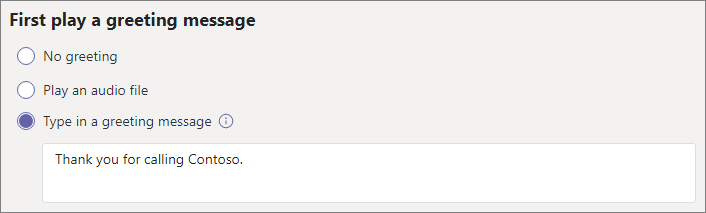

# Настройка автосекретаря

Автосекретари позволяют людям звонить в вашу организацию и перемещаться в системе меню для связи с нужным отделом, очередью вызовов, сотрудником или оператором. Вы можете создавать автосекретарей для своей организации в Центре администрирования Microsoft Teams или с помощью PowerShell.

> [!TIP]
> Эта статья предназначена для крупных организаций. Если вы относитесь к малому бизнесу, см. [руководство по настройке автосекретаря для малого бизнеса](/microsoftteams/business-voice/create-a-phone-system-auto-attendant-smb).

См. статью [Планирование автосекретарей и очередей вызовов в Teams](plan-auto-attendant-call-queue.md), а затем [инструкции по началу работы](plan-auto-attendant-call-queue.md#getting-started) до выполнения процедур, описанных в этой статье.

Автосекретари могут направлять вызовы на основе ввода вызывающих абонентов в один из следующих целевых объектов: 

- **Оператор** — оператор, определенный для автосекретаря. Определение оператора является необязательным. Оператора можно определить как любой из других целевых объектов в этом списке.
- **Человек в организации** — сотрудник в вашей организации, который может принимать голосовые звонки. Этот сотрудник может быть онлайн-пользователем или локальным пользователем, применяющим Skype для бизнеса Server.
- **Голосовое приложение** — другой автосекретарь или очередь вызовов. (При выборе этого целевого объекта выберите учетную запись ресурса, связанную с автосекретарем или очередью вызовов.)
- **Голосовая почта** — почтовый ящик голосовой почты, связанный с группой Microsoft 365, которую вы указали. Вы можете выбрать, требуются ли расшифровки голосовой почты и системное приглашение "Оставьте сообщение после сигнала" .
- **Внешний номер телефона** — любой номер телефона. (См. [технические сведения о внешней передаче](create-a-phone-system-auto-attendant.md#external-phone-number-transfers---technical-details).)
- **Объявление (звуковой файл)** — воспроизведение звукового файла. Отправленное записанное объявление, сохраненное как звук в формате WAV, MP3 или WMA. Размер записи не должен превышать 5 МБ. Система воспроизводит объявление, а затем возвращается в меню автосекретаря.
- **Объявление (введенное)** — введите сообщение. Текст, который должна прочитать система. Вы можете ввести не более 1000 символов. Система воспроизводит объявление, а затем возвращается в меню автосекретаря.

Вам будет предложено выбрать один из этих вариантов на разных этапах настройки автосекретаря.

Чтобы настроить автосекретаря в Центре администрирования Teams разверните **Голосовая связь**, выберите **Автосекретари** и нажмите **Добавить**.

## Видеодемонстрация

В этом видео показан базовый пример создания автосекретаря в Teams.

> [!VIDEO https://www.microsoft.com/videoplayer/embed/RWEnCG?autoplay=false]

## Общие сведения

1. Введите название автосекретаря в поле в верхней части окна.

2. Чтобы назначить оператора, укажите оператора в качестве целевого объекта для звонков. Это назначение необязательно (но рекомендуется). Установите параметр **Оператор**, чтобы разрешить вызывающим выходить из меню и общаться с назначенным человеком.

3. Укажите часовой пояс для этого автосекретаря. Часовой пояс используется для вычисления рабочего времени, если вы [создаете отдельный поток звонков для нерабочего времени](#call-flow-for-after-hours).

4. Укажите [поддерживаемый язык](create-a-phone-system-auto-attendant-languages.md) для этого автосекретаря. Это язык, который будет использоваться для системных голосовых подсказок.

5. Выберите, нужно ли включить речевой ввод. Если этот параметр включен, название каждого параметра меню становится ключевым словом для распознавания речи. Например, вызывающий абонент может произнести "Один" для выбора параметра меню, назначенного клавише 1, или "Отдел продаж" для перехода к одноименному параметру меню.

   > [!NOTE]
   > Если на шаге 4 выбран язык, не поддерживающий речевой ввод, этот параметр будет отключен.

6. Нажмите **Далее**.

## Поток звонков

Выберите, нужно ли воспроизводить приветственное сообщение, когда автосекретарь отвечает на звонок.

Если вы выберите **Воспроизводить звуковой файл**, вы сможете использовать кнопку **Загрузить файл** для отправки записанного приветственного сообщения, сохраненного как звуковой файл в формате WAV, MP3 или WMA. Размер записи не должен превышать 5 МБ.

Если вы выберите **Введите приветствие**, система будет читать текст, который вы ввели (до 1000 символов), когда автосекретарь отвечает на звонок.

Выберите способ маршрутизации звонка.

Если вы выберите **Отключить**, автосекретарь завершит звонок.

Если выбрать **Перенаправить звонок**, вы сможете выбрать один из целевых объектов для маршрутизации звонков.

Если выбрать **Прослушать пункты меню**, вы сможете выбрать вариант **Воспроизводить звуковой файл** или **Введите приветствие**, а затем указать один из параметров меню и поиск в каталоге.

### Параметры меню

В качестве параметров набора назначьте клавиши 0–9 на клавиатуре телефона одному из целевых объектов маршрутизации звонков. (Клавиши \* (звездочка) и \# (фунт) зарезервированы системой и не могут быть перена назначены. При нажатии одной из этих клавиш текущее меню повторяется.)

> [!NOTE]
> Клавиша # возвращает только последний автоотекатарь. После пересечения границы с новым автозаводом клавиша # не позволит перейти к предыдущему.

Сопоставления клавиш не должны быть непрерывными. Можно создать меню с клавишами 0, 1 и 3, соответствующими определенным вариантам, при этом клавиша 2 не используется.

Рекомендуется сопоставить клавишу "ноль" с оператором, если он настроен. Если оператору не присвоена какая-либо клавиша, голосовая команда "Оператор" также отключена.

Для каждого параметра меню укажите следующие настройки.

- **Клавиша набора** — клавиша на клавиатуре телефона для доступа к этому параметру. Если доступен речевой ввод, вызывающие абоненты также могут произнести этот номер для доступа к параметру.

- **Голосовая команда** — определяет голосовую команду, которую вызывающий может произнести, чтобы получить доступ к этому параметру, если включен речевой ввод. Она может содержать несколько слов, например "Служба поддержки клиентов" или "Отдел эксплуатации". Например, вызывающий может нажать 2, сказать "два" или произнести "Отдел продаж", чтобы выбрать параметр, сопоставленный с клавишей "два". Этот текст также воспроизводится функцией преобразования текста в речь для запроса подтверждения службы. Например, "Перенаправление вашего звонка в отдел продаж".

- **Кому перенаправить** — целевой объект маршрутизации звонков, используемый при выборе этого параметра вызывающим абонентом. Если вы используете перенаправление к автосекретарю или в очередь вызовов, выберите соответствующую связанную учетную запись ресурса.

### Поиск в каталоге

Если вы назначаете клавиши набора целевым объектам, рекомендуется выбрать **Нет** для параметра **Поиск в каталоге**. Если вызывающий пытается набрать имя или дополнительный номер с помощью клавиш, которые назначены определенным целевым объектам, он может быть неожиданно перенаправлен в целевой объект до завершения ввода имени или расширения. Рекомендуется создать отдельного автосекретаря для поиска в каталоге и связать с ним основного автосекретаря с помощью клавиши набора.

Если вы не назначили клавиши набора, выберите параметр для настройки **Поиск в каталоге**.

**Набор номера по имени**. Если включить этот параметр, вызывающие смогут произнести имя пользователя или ввести его на клавиатуре телефона. Любой пользователь из Интернета или любой локальный пользователь, применяющий Skype для бизнеса Server, является подходящим пользователем, и его можно найти с помощью набора номера по имени. (Вы можете указать, кто будет включен в каталог, на странице [Область набора](#dial-scope).)

**Набор дополнительного номера**. Если этот параметр включен, вызывающие могут связываться с пользователями в вашей организации путем набора их дополнительного номера. Любой пользователь из Интернета или любой локальный пользователь, применяющий Skype для бизнеса Server, является подходящим пользователем, и его можно найти с помощью **набора дополнительного номера**. (Вы можете указать, кто будет включен в каталог, на странице [Область набора](#dial-scope).)

У пользователей, которые вы хотите сделать доступными для расширения набора номера, должен быть задано расширение, в составе одного из следующих атрибутов телефона, определенных в Active Directory (и синхронизированных с помощью Azure AD Подключение) или Azure Active Directory. ( [Дополнительные сведения см](/microsoft-365/admin/add-users/add-users) . в том, как добавить пользователей по отдельности или массово.)

- OfficePhone/TelephoneNumber (AD и Azure AD)
- HomePhone (AD)
- Mobile/MobilePhone (AD и Azure AD)
- OtherTelephone (AD)

Для ввода дополнительного номера в поле номера телефона пользователя может требоваться один из следующих форматов.

- *+\<phone number>;ext=\<extension>*
- *+\<phone number>x\<extension>*
- *x\<extension>*

- Пример 1: Set-MsolUser -UserPrincipalName usern@domain.com -Phonenumber "+15555555678;ext=5678"
- Пример 2: Set-MsolUser -UserPrincipalName usern@domain.com -Phonenumber "+15555555678x5678"
- Пример 3: Set-MsolUser -UserPrincipalName usern@domain.com -Phonenumber "x5678"

Вы также можете настроить дополнительный номер в [Центре администрирования Microsoft 365](https://admin.microsoft.com/) или [Центре администрирования Azure Active Directory](https://aad.portal.azure.com). Может пройти до 12 часов, прежде чем изменения станут доступны автосекретарям и очередям вызовов.

> [!NOTE]
> Если вы хотите использовать как **Набор номера по имени**, так и **Набор дополнительного имени**, вы можете назначить клавишу набора для основного автосекретаря, чтобы связываться с автосекретарем, включенным для функции **Набор по имени**. В этом автосекретаре можно назначить клавишу 1 (с которой не связаны буквы), чтобы связываться с автосекретарем путем **набора дополнительного номера**.

Дополнительные сведения [можно найти в](dial-voice-reference.md) справочнике по набору номера и голосовой связи.

Выбрав параметр **Поиск в каталоге**, нажмите **Далее**.

## Поток звонков в нерабочее время

Рабочие часы можно настроить отдельно для каждого автосекретаря. Если рабочие часы не настроены, по умолчанию устанавливается круглосуточный график работы без выходных дней. Вы можете настроить перерывы в течение рабочего дня. Все часы, которые не настроены как рабочие, считаются нерабочими. Вы можете настроить различные правила обработки входящих звонков и приветствия для нерабочего времени.

В зависимости от того, как вы настроили автосекретарей и очереди вызовов, вам может потребоваться только указать маршрутизацию звонков в нерабочее время для автосекретарей с прямыми номерами телефонов.

Если вам нужна отдельная маршрутизация звонков для вызывающих абонентов в нерабочее время, укажите свои часы работы для каждого дня. Выберите **Добавить новое время**, чтобы указать несколько наборов часов для определенного дня, например, чтобы указать перерыв на обед.

Указав рабочие часы, выберите параметры маршрутизации звонков для нерабочего времени. Доступны те же параметры, что и для маршрутизации звонков в рабочее время, указанные выше.

После завершения нажмите **Далее**.

## Потоки звонков в выходные

У вашего автосекретаря может быть поток звонков для каждого [настроенного вами выходного](set-up-holidays-in-teams.md). Вы можете добавить до 20 запланированных выходных для каждого автосекретаря.

1. На странице "Настройки звонков в выходные" нажмите **Добавить**.

2. Введите имя этого выходного.

3. В раскрывающемся списке **Выходной** выберите праздник, который вы хотите использовать.

4. Выберите тип приветствия, который нужно использовать.

    

5. Выберите вариант **Отключить** или **Перенаправить звонок**.

6. Если вы выбрали перенаправление, выберите целевой объект маршрутизации звонка.

7. Нажмите **Сохранить**.

При необходимости повторите эту процедуру для каждого дополнительного выходного.

После добавления всех выходных нажмите **Далее**.

## Область набора

*Область набора* определяет, какие пользователи доступны в каталоге, если вызывающий абонент использует функцию набора по имени или набора по дополнительному номеру. Значение по умолчанию **Все пользователи в сети** включает всех пользователей вашей организации, которые находятся в сети или в локальной среде с использованием Skype для бизнеса Server.

Вы можете включить или исключить определенных пользователей, выбрав **Настраиваемая группа пользователей** в разделе **Включить** или **Исключить** и указав одну или несколько групп Microsoft 365, списков рассылки или групп безопасности. Например, может потребоваться исключить руководителей организации из каталога набора номера. (Если пользователь находится в обоих списках, он будет исключен из каталога.)

> [!NOTE]
> Может потребоваться до 36 часов, чтобы имя нового пользователя появилось в каталоге.

После настройки области набора выберите **Далее**.

## Учетные записи ресурсов

У всех автосекретарей должны быть связанные учетные записи ресурса.  У автосекретарей первого уровня должна быть как минимум одна учетная запись ресурса со связанным служебным номером. При желании вы можете назначить автосекретарю несколько учетных записей ресурсов, у каждой из которых будет отдельный служебный номер.

Чтобы добавить учетную запись ресурса, выберите **Добавить учетную запись** и найдите учетную запись, которую нужно добавить. Затем нажмите **Добавить** и снова — **Добавить**.

Завершив добавление учетных записей ресурсов, выберите **Отправить** , чтобы завершить настройку автозаполнеющего.

[Дополнительные сведения см. в Teams учетных записей](manage-resource-accounts.md) ресурсов.

## Передача внешних номеров телефонов — технические сведения

Обратитесь к разделу [Предварительные требования](plan-auto-attendant-call-queue.md#prerequisites), чтобы разрешить автосекретарям внешнюю передачу звонков.  Кроме того:

- Для учетной записи ресурса  с лицензией на  план звонков или номером Подключение оператора необходимо вводить номер внешнего переносного телефона в формате E.164 (+[код страны][код города][номер телефона]).

- Для учетной записи ресурса с лицензией Microsoft Teams Телефон и политикой прямой маршрутистики в Интернете формат номера внешнего переноса зависит от параметров [SBC](direct-routing-connect-the-sbc.md).

Отображаемый исходящий номер телефона определяется следующим образом.

  - Для номеров Подключение и операторов отображается исходный номер телефона звоня.
  - Для номеров прямой маршрутизации отправляемый номер основан на параметре P-Asserted-Identity (PAI) в SBC следующим образом:
    - Если установлено значение "Отключено", отображается исходный номер телефона звонящего абонента. Это параметр по умолчанию (рекомендуемый).
    - Если установлено значение "Включено", отображается номер телефона учетной записи ресурса.

В гибридной среде Skype для бизнеса для передачи звонка автосекретаря в ТСОП создайте нового локального пользователя с переадресацией звонков на номер ТСОП. Для пользователя должна быть включена корпоративная голосовая связь и назначена политика голосовой связи. Дополнительные сведения см. в разделе [Передача звонка автосекретаря в ТСОП](/SkypeForBusiness/plan/exchange-unified-messaging-online-migration-support#auto-attendant-call-transfer-to-pstn).

## Командлеты для работы с автосекретарями

Windows PowerShell позволяет создавать автоотправки и управлять ими с помощью командной строки пакетным или программным способом.

Для управления автозаправщиками можно использовать следующие cmdlets:

- [New-CsAutoAttendant](/powershell/module/skype/new-csautoattendant)  
- [Get-CsAutoAttendant](/powershell/module/skype/get-csautoattendant)
- [Set-CsAutoAttendant](/powershell/module/skype/set-csautoattendant)
- [Update-CsAutoAttendant](/powershell/module/skype/update-csautoattendant)
- [Remove-CsAutoAttendant](/powershell/module/skype/remove-csautoattendant)
- [New-CsOnlineTimeRange](/powershell/module/skype/new-csonlinetimerange)
- [New-CsOnlineDateTimeRange](/powershell/module/skype/new-csonlinedatetimerange)
- [New-CsOnlineSchedule](/powershell/module/skype/New-CsOnlineSchedule)
- [Get-CsAutoAttendantHolidays](/powershell/module/skype/get-csautoattendantholidays)
- [Import-CsAutoAttendantHolidays](/powershell/module/skype/import-csautoattendantholidays)
- [Export-CsAutoAttendantHolidays](/powershell/module/skype/export-csautoattendantholidays)
- [New-CsAutoAttendantDialScope](/powershell/module/skype/New-CsAutoAttendantDialScope)
- [New-CsAutoAttendantPrompt](/powershell/module/skype/New-CsAutoAttendantPrompt)
- [New-CsAutoAttendantCallableEntity](/powershell/module/skype/New-CsAutoAttendantCallableEntity)
- [New-CsAutoAttendantMenuOption](/powershell/module/skype/New-CsAutoAttendantMenuOption)
- [New-CsAutoAttendantMenu](/powershell/module/skype/new-csautoattendantmenu)
- [New-CsAutoAttendantCallFlow](/powershell/module/skype/New-CsAutoAttendantCallFlow)
- [New-CsAutoAttendantCallHandlingAssociation](/powershell/module/skype/New-CsAutoAttendantCallHandlingAssociation)
- [Get-CsAutoAttendantStatus](/powershell/module/skype/Get-CsAutoAttendantStatus)
- [Get-CsAutoAttendantTenantInformation](/powershell/module/skype/Get-CsAutoAttendantTenantInformation)

Для управления пользователями, учетными записями ресурсов, лицензиями на Microsoft Teams Телефон, номерами телефонов, звуковые файлы и поддерживаемым языком, которые будут использоваться с очередями звонков, также необходимы следующие дополнительные cmdlets:

Пользователи и Teams

- Пользователи
- - [Get-CsOnlineUser](/powershell/module/skype/Get-CsOnlineUser)

- Teams: 
- - [Get-Team](/powershell/module/teams/Get-Team)

Учетные записи ресурсов:

- [New-CsOnlineApplicationInstance](/powershell/module/skype/New-CsOnlineApplicationInstance)
- [Find-CsOnlineApplicationInstance](/powershell/module/skype/Find-CsOnlineApplicationInstance)
- [Get-CsOnlineApplicationInstance](/powershell/module/skype/Get-CsOnlineApplicationInstance)
- [Set-CsOnlineApplicationInstance](/powershell/module/skype/Set-CsOnlineApplicationInstance)
- [New-CsOnlineApplicationInstanceAssociation](/powershell/module/skype/New-CsOnlineApplicationInstanceAssociation)
- [Get-CsOnlineApplicationInstanceAssociation](/powershell/module/skype/Get-CsOnlineApplicationInstanceAssociation)
- [Remove-CsOnlineApplicationInstanceAssociation](/powershell/module/skype/Remove-CsOnlineApplicationInstanceAssociation)
- [Get-CsOnlineApplicationInstanceAssociationStatus](/powershell/module/skype/Get-CsOnlineApplicationInstanceAssociationStatus)

Лицензии Teams Телефон виртуальных лицензий:

- [Get-MsolAccountSku](/powershell/module/msonline/get-msolaccountsku)
- [Set-MsolUserLicense](/powershell/module/msonline/set-msoluserlicense)

Телефон назначение номера:

- [Get-CsOnlineTelephoneNumber](/powershell/module/skype/Get-CsOnlineTelephoneNumber)
- [Set-CsPhoneNumberAssignment](/powershell/module/teams/Set-CsPhoneNumberAssignment)

Звуковые файлы

- [Get-CsOnlineAudioFile](/powershell/module/skype/Get-CsOnlineAudioFile)
- [Import-CsOnlineAudioFile](/powershell/module/skype/Import-CsOnlineAudioFile)
- [Export-CsOnlineAudioFile](/powershell/module/skype/Export-CsOnlineAudioFile)
- [Remove-CsOnlineAudioFile](/powershell/module/skype/Remove-CsOnlineAudioFile)

Поддержка языков и часовых поясов

- [Get-CsAutoAttendantSupportedLanguage](/powershell/module/skype/Get-CsAutoAttendantSupportedLanguage)
- [Get-CsAutoAttendantSupportedTimeZone](/powershell/module/skype/Get-CsAutoAttendantSupportedTimeZone)

Пошаговые руководства по созданию автоотводников с помощью PowerShell см. в руководстве По созданию автоотводников с помощью [powerShell](create-a-phone-system-auto-attendant-via-cmdlets.md).

## Средство диагностики автоотвода

Если вы администратор, вы можете проверить, может ли автоответ принимать звонки с помощью следующего средства диагностики:

1. Выберите **Выполнить тесты** ниже, чтобы заполнить диагностику в Центре администрирования Microsoft 365. 

   > [!div class="nextstepaction"]
   > [Выполнить тесты: Teams автоотекатаря](https://aka.ms/TeamsAADiag)

2. В области диагностики Выполнить введите имя учетной записи ресурса  в поле Имя пользователя или Электронная почта и выберите **Выполнить тесты**.

3. В ходе проверок будут выявлены конфигурации клиента, политики или учетной записи ресурсов, которые не дают автоответам получать звонки, и будут предприняты действия по устранению выявленных проблем.

## См. также

[Вот что можно получить с помощью Teams Телефон](./here-s-what-you-get-with-phone-system.md)

[Получение служебных номеров телефонов](./getting-service-phone-numbers.md)

[Доступность аудиоконференций и тарифных планов в различных странах и регионах](./country-and-region-availability-for-audio-conferencing-and-calling-plans/country-and-region-availability-for-audio-conferencing-and-calling-plans.md)

[Введение в Windows PowerShell и Skype для бизнеса Online](/SkypeForBusiness/set-up-your-computer-for-windows-powershell/set-up-your-computer-for-windows-powershell)
