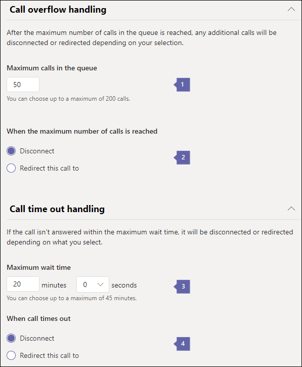

# <a name="create-a-phone-system-call-queue"></a><span data-ttu-id="cf8c7-104">Создание очереди звонков в телефонной системе</span><span class="sxs-lookup"><span data-stu-id="cf8c7-104">Create a Phone System call queue</span></span>

<span data-ttu-id="cf8c7-p102">Phone System call queues include greetings that are used when someone calls in to a phone number for your organization, the ability to automatically put the calls on hold, and the ability to search for the next available call agent to handle the call while the people who call are listening to music on hold. You can create single or multiple call queues for your organization.</span><span class="sxs-lookup"><span data-stu-id="cf8c7-p102">Phone System call queues include greetings that are used when someone calls in to a phone number for your organization, the ability to automatically put the calls on hold, and the ability to search for the next available call agent to handle the call while the people who call are listening to music on hold. You can create single or multiple call queues for your organization.</span></span>
  
<span data-ttu-id="cf8c7-107">Очереди вызовов в телефонной системе позволяют использовать следующие функции.</span><span class="sxs-lookup"><span data-stu-id="cf8c7-107">Phone System call queues can provide:</span></span>
  
- <span data-ttu-id="cf8c7-108">Приветствие звонящим в организацию пользователям.</span><span class="sxs-lookup"><span data-stu-id="cf8c7-108">An organizational greeting.</span></span>
- <span data-ttu-id="cf8c7-109">Воспроизведение музыки во время удержания звонка.</span><span class="sxs-lookup"><span data-stu-id="cf8c7-109">Music while people are waiting on hold.</span></span>
- <span data-ttu-id="cf8c7-110">Перенаправление звонков вызов агентам в списки рассылки с включенной поддержкой почты и группы безопасности.</span><span class="sxs-lookup"><span data-stu-id="cf8c7-110">Redirecting of calls to call agents in mail-enabled distribution lists and security groups.</span></span>
- <span data-ttu-id="cf8c7-111">Отображение параметров максимальный размер очереди вызовов, время ожидания и параметрах управления звонками.</span><span class="sxs-lookup"><span data-stu-id="cf8c7-111">Making settings for call queue maximum size, timeout, and call handling options.</span></span>

<span data-ttu-id="cf8c7-112">При получении звонка номер телефона, который связан с очереди звонок с помощью [учетной записи ресурса](manage-resource-accounts.md), они будут прослушать приветствия (Если какие-либо настройки), а затем они будут помещены в очередь и дождитесь следующего агента доступные звонок.</span><span class="sxs-lookup"><span data-stu-id="cf8c7-112">When someone calls in to a phone number that is associated  with a call queue via a [resource account](manage-resource-accounts.md), they will hear a greeting first (if any is set up), and then they will be put in the queue and wait for the next available call agent.</span></span> <span data-ttu-id="cf8c7-113">Вызывающий абонент будет прослушивают музыку, пока они находятся на удержании Ожидание и вызовы будут предложены звонок агентам в порядке *Первого в, первый выходной параметр* (FIFO).</span><span class="sxs-lookup"><span data-stu-id="cf8c7-113">The person calling in will hear music while they are on hold waiting, and the calls will be offered to the call agents in *First In, First Out* (FIFO) order.</span></span>
  
<span data-ttu-id="cf8c7-114">Все звонки в очереди будут распределяться с помощью одного из следующих методов:</span><span class="sxs-lookup"><span data-stu-id="cf8c7-114">All calls waiting in the queue will be distributed using one of the following methods:</span></span>
  
- <span data-ttu-id="cf8c7-115">С помощью автосекретаря маршрутизации первого звонка в очередь будет звонить все агенты в то же время.</span><span class="sxs-lookup"><span data-stu-id="cf8c7-115">With attendant routing, the first call in the queue will ring all agents at the same time.</span></span>
- <span data-ttu-id="cf8c7-116">При последовательной маршрутизации первый вызов в очереди поступает операторам поочередно.</span><span class="sxs-lookup"><span data-stu-id="cf8c7-116">With serial routing, the first call in the queue will ring all call agents one by one.</span></span>
- <span data-ttu-id="cf8c7-117">С помощью циклического перебора маршрутизации входящих вызовов равномерно, чтобы создать каждому агенту звонок будет такое же число вызовов из очереди.</span><span class="sxs-lookup"><span data-stu-id="cf8c7-117">With round robin, routing of incoming calls is balanced so that each call agent will get the same number of calls from the queue.</span></span>

    > [!NOTE]
    > <span data-ttu-id="cf8c7-118">Те операторы, которые находятся **Не в сети**, характеризуют свое присутствие значением **Не беспокоить** или выходят из очереди во избежание поступления к ним вызовов.</span><span class="sxs-lookup"><span data-stu-id="cf8c7-118">Call agents who are **Offline**, have set their presence to **Do not Disturb,** or have opted out of the call queue won't be called.</span></span>
  
- <span data-ttu-id="cf8c7-119">Одновременно операторам отправляется только одно уведомление о звонке, находящемся в начале очереди.</span><span class="sxs-lookup"><span data-stu-id="cf8c7-119">Only one incoming call notification (for the call at the head of the queue) at a time will be sent to the call agents.</span></span>
- <span data-ttu-id="cf8c7-120">После того, как оператор принимает звонок, всем операторам поступает следующий входящий звонок из очереди.</span><span class="sxs-lookup"><span data-stu-id="cf8c7-120">After a call agent accepts the call, the next incoming call in the queue will start ringing call agents.</span></span>

> [!NOTE]
> <span data-ttu-id="cf8c7-121">Эта статья относится к группам Майкрософт и Скайп для бизнеса в Интернет.</span><span class="sxs-lookup"><span data-stu-id="cf8c7-121">This article applies to both Microsoft Teams and Skype for Business Online.</span></span>

## <a name="step-1---get-started"></a><span data-ttu-id="cf8c7-122">Шаг 1 - начало работы</span><span class="sxs-lookup"><span data-stu-id="cf8c7-122">Step 1 - Get started</span></span>

<span data-ttu-id="cf8c7-123">Перед началом работы с очередями звонков необходимо запомнить следующие моменты.</span><span class="sxs-lookup"><span data-stu-id="cf8c7-123">To get started using call queues, it's important to remember a few things:</span></span>
  
- <span data-ttu-id="cf8c7-124">Очереди звонка необходимо иметь учетную запись связанных ресурсов.</span><span class="sxs-lookup"><span data-stu-id="cf8c7-124">A call queue is required to have an associated resource account.</span></span> <span data-ttu-id="cf8c7-125">Сведения о учетные записи ресурса в разделе [Управление учетными записями ресурсов в группах](manage-resource-accounts.md) .</span><span class="sxs-lookup"><span data-stu-id="cf8c7-125">See [Manage resource accounts in Teams](manage-resource-accounts.md) for details on resource accounts.</span></span>
- <span data-ttu-id="cf8c7-126">Если вы планируете нумерации прямой маршрутизации, необходимо получить и назначение лицензий на следующие учетные записи ресурса \(Office 365 корпоративный E1, E3 или E5 с телефонной системой надстройки\).</span><span class="sxs-lookup"><span data-stu-id="cf8c7-126">If you plan to assign a Direct Routing number, you need to acquire and assign the following licenses to your resource accounts \(Office 365 Enterprise E1, E3 or E5, with the Phone System add-on\).</span></span>
- <span data-ttu-id="cf8c7-127">Вместо этого при назначении номера службы Майкрософт, необходимо получить и назначьте следующие лицензии свою учетную запись ресурса \(Office 365 корпоративный E1, E3 или E5 с телефонной системой надстройки и вызов планирование\).</span><span class="sxs-lookup"><span data-stu-id="cf8c7-127">If you are assigning a Microsoft service number instead, you need to acquire and assign the following licenses to your resource account \(Office 365 Enterprise E1, E3 or E5, with the Phone System add-on and a Calling Plan\).</span></span>
- <span data-ttu-id="cf8c7-128">Необходимо лицензировать учетных записей с номером телефона, назначенные им.</span><span class="sxs-lookup"><span data-stu-id="cf8c7-128">You only need to license the resource accounts with a phone number assigned to them.</span></span> <span data-ttu-id="cf8c7-129">В вложенных auto attendant или звонков в очереди не требуется лицензировать rest автосекретари или вызвать очередей, если у них нет номера телефона, связанные с ними.</span><span class="sxs-lookup"><span data-stu-id="cf8c7-129">In a nested auto attendant or call queue, you do not need to license the rest of the auto attendants or call queues if they do not have phone numbers associated with them.</span></span> 

> [!NOTE] 
> <span data-ttu-id="cf8c7-130">Прямое номеров службы маршрутизации для принимаемые автосекретарем и очереди вызовов поддерживаются для пользователей группами Майкрософт и агенты только в данный момент.</span><span class="sxs-lookup"><span data-stu-id="cf8c7-130">Direct Routing service numbers for auto attendant and call queues are supported for Microsoft Teams users and agents only at the moment.</span></span>

> [!NOTE] 
> <span data-ttu-id="cf8c7-131">Корпорация Майкрософт работает на соответствующей модели лицензирования для приложений, таких как автосекретари облако и очереди вызовов, для теперь необходимо использовать модель лицензирования пользователя.</span><span class="sxs-lookup"><span data-stu-id="cf8c7-131">Microsoft is working on an appropriate licensing model for applications such as Cloud auto attendants and call queues, for now you need to use the user-licensing model.</span></span>

> [!NOTE]
> <span data-ttu-id="cf8c7-132">Для перенаправления вызовов тем сотрудникам организации, которые находятся в сети, им необходимо предоставить лицензию на **телефонную систему** и разрешить доступ к корпоративной голосовой связи, либо предоставить тарифные планы Office 365.</span><span class="sxs-lookup"><span data-stu-id="cf8c7-132">To redirect calls to people in your organization who are Online, they must have a **Phone System** license and be enabled for Enterprise Voice or have Office 365 Calling Plans.</span></span> <span data-ttu-id="cf8c7-133">В разделе [Назначение Скайп для бизнеса лицензий](/skypeforbusiness/skype-for-business-and-microsoft-teams-add-on-licensing/assign-skype-for-business-and-microsoft-teams-licenses.md) или [группами Майкрософт назначение лицензий](assign-teams-licenses.md).</span><span class="sxs-lookup"><span data-stu-id="cf8c7-133">See  [Assign Skype for Business licenses](/skypeforbusiness/skype-for-business-and-microsoft-teams-add-on-licensing/assign-skype-for-business-and-microsoft-teams-licenses.md) or [Assign Microsoft Teams licenses](assign-teams-licenses.md).</span></span> <span data-ttu-id="cf8c7-134">Для предоставления сотрудникам доступа к корпоративной голосовой связи, можно использовать Windows PowerShell.</span><span class="sxs-lookup"><span data-stu-id="cf8c7-134">To enable them for Enterprise Voice, you can use Windows PowerShell.</span></span> <span data-ttu-id="cf8c7-135">Например, выполните:`Set-CsUser -identity "Amos Marble" -EnterpriseVoiceEnabled $true`</span><span class="sxs-lookup"><span data-stu-id="cf8c7-135">For example run:  `Set-CsUser -identity "Amos Marble" -EnterpriseVoiceEnabled $true`</span></span>
  
- <span data-ttu-id="cf8c7-136">Чтобы узнать больше о вызове планы Office 365, обратитесь к разделу [телефонной системой и вызов планов](calling-plan-landing-page.md) и [Вызов планов Office 365](calling-plans-for-office-365.md).</span><span class="sxs-lookup"><span data-stu-id="cf8c7-136">To learn more about Office 365 Calling Plans, see [Phone System and Calling Plans](calling-plan-landing-page.md) and [Calling Plans for Office 365](calling-plans-for-office-365.md).</span></span>

- <span data-ttu-id="cf8c7-137">Можно назначить только международную и бесплатных служба телефонных номеров, для которого в **Центр администрирования группами Майкрософт** или переданы телефонной системой очередей звонок от другого поставщика услуг.</span><span class="sxs-lookup"><span data-stu-id="cf8c7-137">You can only assign toll and toll-free service phone numbers that you got in the **Microsoft Teams admin center** or transferred from another service provider to Phone System call queues.</span></span> <span data-ttu-id="cf8c7-138">Чтобы получить и использовать бесплатные телефонные номера, необходимо настроить кредиты на услуги связи.</span><span class="sxs-lookup"><span data-stu-id="cf8c7-138">To get and use toll-free service numbers, you need to set up Communications Credits.</span></span>

    > [!NOTE]
    > <span data-ttu-id="cf8c7-139">Номера телефонов пользователей (абонентов) нельзя назначить очередям звонков — можно использовать платные или бесплатные номера телефонов служб.</span><span class="sxs-lookup"><span data-stu-id="cf8c7-139">User (subscriber) phone numbers can't be assigned to call queues - only service toll or toll-free phone numbers can be used.</span></span>
  
- <span data-ttu-id="cf8c7-140">При распределении входящие звонки из очереди вызовов телефонной системой этих клиентов поддерживаются для агентов звонка:</span><span class="sxs-lookup"><span data-stu-id="cf8c7-140">When you are distributing the incoming calls from an Phone System call queue, these clients are supported for call agents:</span></span>

  - <span data-ttu-id="cf8c7-141">Клиент Skype для бизнеса для настольных ПК 2016 (32- и 64-разрядные версии)</span><span class="sxs-lookup"><span data-stu-id="cf8c7-141">Skype for Business desktop client 2016 (32 and 64-bit versions)</span></span>

  - <span data-ttu-id="cf8c7-142">Клиент Lync для настольных ПК 2013 (32- и 64-разрядные версии)</span><span class="sxs-lookup"><span data-stu-id="cf8c7-142">Lync desktop client 2013 (32 and 64-bit versions)</span></span>

  - <span data-ttu-id="cf8c7-143">Все модели телефона IP-адресов, поддерживаемые для групп Майкрософт.</span><span class="sxs-lookup"><span data-stu-id="cf8c7-143">All IP phone models supported for Microsoft Teams.</span></span> <span data-ttu-id="cf8c7-144">В разделе [Приступая к телефоны для Скайп для бизнеса в Интернет](/skypeforbusiness/what-is-phone-system-in-office-365/getting-phones-for-skype-for-business-online/getting-phones-for-skype-for-business-online).</span><span class="sxs-lookup"><span data-stu-id="cf8c7-144">See [Getting phones for Skype for Business Online](/skypeforbusiness/what-is-phone-system-in-office-365/getting-phones-for-skype-for-business-online/getting-phones-for-skype-for-business-online).</span></span>

  - <span data-ttu-id="cf8c7-145">Клиент Mac Skype для бизнеса (версия 16.8.196 и более поздние)</span><span class="sxs-lookup"><span data-stu-id="cf8c7-145">Mac Skype for Business Client (version 16.8.196 and later)</span></span>

  - <span data-ttu-id="cf8c7-146">Клиент Android Skype для бизнеса (версия 6.16.0.9 и более поздние)</span><span class="sxs-lookup"><span data-stu-id="cf8c7-146">Android Skype for Business Client (version 6.16.0.9 and later)</span></span>

  - <span data-ttu-id="cf8c7-147">Клиент iPhone Skype для бизнеса (версия 6.16.0 и более поздние)</span><span class="sxs-lookup"><span data-stu-id="cf8c7-147">iPhone Skype for Business Client (version 6.16.0 and later)</span></span>

  - <span data-ttu-id="cf8c7-148">Клиент iPad Skype для бизнеса (версия 6.16.0 и более поздние)</span><span class="sxs-lookup"><span data-stu-id="cf8c7-148">iPad Skype for Business Client (version 6.16.0 and later)</span></span>

  - <span data-ttu-id="cf8c7-149">Клиент Microsoft Teams Windows (32- и 64-разрядные версии)</span><span class="sxs-lookup"><span data-stu-id="cf8c7-149">Microsoft Teams Windows client (32 and 64-bit versions)</span></span>

  - <span data-ttu-id="cf8c7-150">Клиент Microsoft Teams Mac</span><span class="sxs-lookup"><span data-stu-id="cf8c7-150">Microsoft Teams Mac client</span></span>

  - <span data-ttu-id="cf8c7-151">Группами Майкрософт для iPhone</span><span class="sxs-lookup"><span data-stu-id="cf8c7-151">Microsoft Teams iPhone app</span></span>

  - <span data-ttu-id="cf8c7-152">Приложения для Android группами Майкрософт</span><span class="sxs-lookup"><span data-stu-id="cf8c7-152">Microsoft Teams Android app</span></span>

## <a name="step-2---getting-or-transferring-toll-or-toll-free-service-phone-numbers"></a><span data-ttu-id="cf8c7-153">Шаг 2. Получение или перенос платных или бесплатных номеров телефонов служб</span><span class="sxs-lookup"><span data-stu-id="cf8c7-153">Step 2 - Getting or transferring toll or toll-free service phone numbers</span></span>

<span data-ttu-id="cf8c7-154">Перед созданием и настройкой очередей вызовов необходимо получить или выполнить передачу существующих платных или бесплатных обслуживаемых номеров.</span><span class="sxs-lookup"><span data-stu-id="cf8c7-154">Before you can create and set up your call queues, you will need to get or transfer your existing toll or toll-free service numbers.</span></span> <span data-ttu-id="cf8c7-155">После получения счета или бесплатная служба телефонных номеров, они будут отображаться в **центре администрирования группами Майкрософт** > **голосовой связи** > **номера телефонов**и **тип номера** в списке будет отображаться как **Служба — бесплатный номер**.</span><span class="sxs-lookup"><span data-stu-id="cf8c7-155">After you get the toll or toll-free service phone numbers, they will show up in **Microsoft Teams admin center** > **Voice** > **Phone numbers**, and the **Number type** listed will be listed as **Service - Toll-Free**.</span></span> <span data-ttu-id="cf8c7-156">Чтобы получить номер службы, просмотреть [номера телефона службы Приступая к](https://docs.microsoft.com/SkypeForBusiness/what-is-phone-system-in-office-365/getting-service-phone-numbers?toc=/MicrosoftTeams/toc.json&bc=/microsoftteams/breadcrumb/toc.json) или необходимо перенести существующий номер службы, в статье [передачи телефонных номеров в Office 365](transfer-phone-numbers-to-office-365.md).</span><span class="sxs-lookup"><span data-stu-id="cf8c7-156">To get your service numbers, see [Getting service phone numbers](https://docs.microsoft.com/SkypeForBusiness/what-is-phone-system-in-office-365/getting-service-phone-numbers?toc=/MicrosoftTeams/toc.json&bc=/microsoftteams/breadcrumb/toc.json) or if you want to transfer an existing service number, see [Transfer phone numbers to Office 365](transfer-phone-numbers-to-office-365.md).</span></span>
  
> [!NOTE]
> <span data-ttu-id="cf8c7-157">Если вы находитесь за пределами США, не могут использовать Центр администрирования группами Майкрософт для получения номера службы.</span><span class="sxs-lookup"><span data-stu-id="cf8c7-157">If you are outside the United States, you can't use the Microsoft Teams admin center to get service numbers.</span></span> <span data-ttu-id="cf8c7-158">Перейдите на [Управление телефонные номера для вашей организации](manage-phone-numbers-for-your-organization/manage-phone-numbers-for-your-organization.md) вместо этого на вашу за ее пределами США.</span><span class="sxs-lookup"><span data-stu-id="cf8c7-158">Go to [Manage phone numbers for your organization](manage-phone-numbers-for-your-organization/manage-phone-numbers-for-your-organization.md) instead to see how to do it from the outside of the United States.</span></span>

<span data-ttu-id="cf8c7-159">Если вы также установка автосекретари, может только необходимо назначить номер телефона учетная запись ресурса главного автосекретаря и затем абонентов, которые его прямой звонок очередь.</span><span class="sxs-lookup"><span data-stu-id="cf8c7-159">If you are also setting up auto attendants, you may only need to assign a phone number to the main auto attendant's resource account, and then have it direct callers to your call queue.</span></span> <span data-ttu-id="cf8c7-160">Если это так, очереди вызовов будет необходимо создать перед созданием параметр автосекретаря, которая выбирает очереди вызовов.</span><span class="sxs-lookup"><span data-stu-id="cf8c7-160">If that's the case, the call queue will need to be created before you can create an option in the auto attendant that selects the call queue.</span></span>
  
## <a name="step-3---create-a-new-call-queue"></a><span data-ttu-id="cf8c7-161">Шаг 3 - создать новую очередь звонка</span><span class="sxs-lookup"><span data-stu-id="cf8c7-161">Step 3 - Create a new call queue</span></span>

[!INCLUDE [updating-admin-interfaces](includes/updating-admin-interfaces.md)]

> [!IMPORTANT]
> <span data-ttu-id="cf8c7-162">Каждые очереди звонка необходимо иметь связанной [учетной записи ресурса](manage-resource-accounts.md).</span><span class="sxs-lookup"><span data-stu-id="cf8c7-162">Every call queue is required to have an associated [resource account](manage-resource-accounts.md).</span></span> <span data-ttu-id="cf8c7-163">Сначала необходимо создать учетную запись ресурса, а затем можно связать его в очередь вызова.</span><span class="sxs-lookup"><span data-stu-id="cf8c7-163">You must create the resource account first, then you can associate it to the call queue.</span></span>

### <a name="using-the-microsoft-teams-admin-center"></a><span data-ttu-id="cf8c7-164">С помощью центра администрирования группами Майкрософт</span><span class="sxs-lookup"><span data-stu-id="cf8c7-164">Using the Microsoft Teams admin center</span></span>

<span data-ttu-id="cf8c7-165">**Центр администрирования группами Майкрософт**, **голосовой связи** >  **вызова очередей**, нажмите кнопку **+ Добавить новый**:</span><span class="sxs-lookup"><span data-stu-id="cf8c7-165">In the **Microsoft Teams admin center**, **Voice** >  **Call queues**, then click **+ Add new**:</span></span>

### <a name="set-the-call-queue-display-name-and-resource-account"></a><span data-ttu-id="cf8c7-166">Установка звонка очереди отображаемое имя и ресурсов учетной записи</span><span class="sxs-lookup"><span data-stu-id="cf8c7-166">Set the call queue display name and resource account</span></span>


* * *

<span data-ttu-id="cf8c7-168">
**имя** введите понятное отображаемое имя для очереди вызовов.</span><span class="sxs-lookup"><span data-stu-id="cf8c7-168">
**Name** Enter a descriptive display name for the call queue.</span></span> <span data-ttu-id="cf8c7-169">Это является обязательным и может содержать до 64 символов, включая пробелы.</span><span class="sxs-lookup"><span data-stu-id="cf8c7-169">This is required and can contain up to 64 characters, including spaces.</span></span>

 <span data-ttu-id="cf8c7-170">Это имя отображается в уведомлении о входящем звонке.</span><span class="sxs-lookup"><span data-stu-id="cf8c7-170">This name will be displayed in the notification for the incoming call.</span></span>

* * *


<span data-ttu-id="cf8c7-172">**Добавление учетных записей** Выберите учетную запись ресурса.</span><span class="sxs-lookup"><span data-stu-id="cf8c7-172">**Add Accounts** Select a resource account.</span></span> <span data-ttu-id="cf8c7-173">Учетная запись ресурса может и не могут быть связаны с международную службы или номер бесплатный номер телефона для звонка очереди, но каждого вызова очереди требуется учетная запись связанных ресурсов.</span><span class="sxs-lookup"><span data-stu-id="cf8c7-173">The resource account may or may not be associated with a service toll or toll-free phone number for the call queue, but each call queue requires an associated resource account.</span></span>

<span data-ttu-id="cf8c7-174">Если отсутствуют в списке, необходимо получить номера службы и назначить их учетная запись ресурса перед созданием очереди этот звонок, как описано выше.</span><span class="sxs-lookup"><span data-stu-id="cf8c7-174">If there aren't any listed, you need to get service numbers and assign them to a Resource account before you can create this call queue, as described earlier.</span></span> <span data-ttu-id="cf8c7-175">Для получения номера службы видеть [Приступая к службе телефонных номеров](https://docs.microsoft.com/SkypeForBusiness/what-is-phone-system-in-office-365/getting-service-phone-numbers?toc=/MicrosoftTeams/toc.json&bc=/microsoftteams/breadcrumb/toc.json).</span><span class="sxs-lookup"><span data-stu-id="cf8c7-175">To get your service numbers, see [Getting service phone numbers](https://docs.microsoft.com/SkypeForBusiness/what-is-phone-system-in-office-365/getting-service-phone-numbers?toc=/MicrosoftTeams/toc.json&bc=/microsoftteams/breadcrumb/toc.json).</span></span> <span data-ttu-id="cf8c7-176">Вам потребуется создать учетную запись ресурса, как описано в [Управление учетными записями ресурсов в группах](manage-resource-accounts.md) , если требуется очереди с числом телефонных звонков.</span><span class="sxs-lookup"><span data-stu-id="cf8c7-176">You'll need to create a resource account as described in [Manage resource accounts in Teams](manage-resource-accounts.md) if you want your call queue to have an associated phone number.</span></span>

> [!NOTE]
> <span data-ttu-id="cf8c7-177">Если требуется или необходимо назначить **домена** вы бы присвоение учетной записи ресурса в очередь вызова.</span><span class="sxs-lookup"><span data-stu-id="cf8c7-177">If you want or need to assign a **Domain** you would do so by assigning it to the resource account for the call queue.</span></span>

### <a name="set-the-greeting-and-music-played-while-on-hold"></a><span data-ttu-id="cf8c7-178">Настройка приветствия и музыки, воспроизводимой во время удержания</span><span class="sxs-lookup"><span data-stu-id="cf8c7-178">Set the greeting and music played while on hold</span></span>


  
* * *


<span data-ttu-id="cf8c7-181">**Приветствие** — необязательное поле.</span><span class="sxs-lookup"><span data-stu-id="cf8c7-181">**Greeting** is optional.</span></span> <span data-ttu-id="cf8c7-182">Это приветствие, которое воспроизведения для пользователей, которые звонка в номер очереди вызовов.</span><span class="sxs-lookup"><span data-stu-id="cf8c7-182">This is the greeting that is played for people who call in to the call queue number.</span></span>

<span data-ttu-id="cf8c7-183">Можно загрузить звукового файла (форматы формате WAV, .mp3 или WMA).</span><span class="sxs-lookup"><span data-stu-id="cf8c7-183">You can upload an audio file (.wav, .mp3, or .wma formats).</span></span>


<span data-ttu-id="cf8c7-185">**Музыка на удержание** Можно либо использовать музыку по умолчанию на удержание, входящие в состав очереди звонок или можно будет загрузить звукового файла в формате WAV, mp3 или WMA форматов для использования в качестве настраиваемого музыки при удержании.</span><span class="sxs-lookup"><span data-stu-id="cf8c7-185">**Music on hold** You can either use the default Music on Hold provided with the call queue, or you can upload an audio file in .wav, mp3, or .wma formats to use as your custom Music on Hold.</span></span>

* * *

### <a name="select-the-call-answering-options"></a><span data-ttu-id="cf8c7-186">Выберите параметры автоответчика</span><span class="sxs-lookup"><span data-stu-id="cf8c7-186">Select the call answering options</span></span>


<span data-ttu-id="cf8c7-189">Можно выбрать до 200 звонок агентам, относящегося к указанной списков рассылки или групп.</span><span class="sxs-lookup"><span data-stu-id="cf8c7-189">You can select up to 200 call agents belonging to specified mailing lists or groups.</span></span> <span data-ttu-id="cf8c7-190">Вызов агентам должно быть одно:</span><span class="sxs-lookup"><span data-stu-id="cf8c7-190">Call agents must be either:</span></span>

- <span data-ttu-id="cf8c7-191">подключенные к сети пользователи, обладающие лицензией на **телефонную систему** и разрешением на использование корпоративной голосовой связи, либо тарифным планом.</span><span class="sxs-lookup"><span data-stu-id="cf8c7-191">An Online user with a **Phone System** license and enabled for Enterprise Voice or with a Calling Plan.</span></span>

  > [!NOTE]
  > <span data-ttu-id="cf8c7-192">Для перенаправление звонков на людей в организации, сети, они должны иметь лицензию **Телефонной системой** и включен для корпоративной голосовой связи или иметь вызов планирование.</span><span class="sxs-lookup"><span data-stu-id="cf8c7-192">To redirect calls to people in your organization who are Online, they must have a **Phone System** license and be enabled for Enterprise Voice or have a Calling Plan.</span></span> <span data-ttu-id="cf8c7-193">В разделе [Назначение Скайп для бизнеса лицензий](/skypeforbusiness/skype-for-business-and-microsoft-teams-add-on-licensing/assign-skype-for-business-and-microsoft-teams-licenses) или [группами Майкрософт назначение лицензий](assign-teams-licenses.md).</span><span class="sxs-lookup"><span data-stu-id="cf8c7-193">See [Assign Skype for Business licenses](/skypeforbusiness/skype-for-business-and-microsoft-teams-add-on-licensing/assign-skype-for-business-and-microsoft-teams-licenses) or [Assign Microsoft Teams licenses](assign-teams-licenses.md).</span></span>

 <span data-ttu-id="cf8c7-194">Для предоставления сотрудникам доступа к корпоративной голосовой связи, можно использовать Windows PowerShell.</span><span class="sxs-lookup"><span data-stu-id="cf8c7-194">To enable them for Enterprise Voice, you can use Windows PowerShell.</span></span> <span data-ttu-id="cf8c7-195">Например, выполните:`Set-CsUser -identity "Amos Marble" -EnterpriseVoiceEnabled $true`</span><span class="sxs-lookup"><span data-stu-id="cf8c7-195">For example run:  `Set-CsUser -identity "Amos Marble" -EnterpriseVoiceEnabled $true`</span></span>

- <span data-ttu-id="cf8c7-196">Подключенные к сети пользователи, обладающие лицензией на **телефонную систему** и тарифным планом, которые добавлены в группу Office 365, список распределения с включенной поддержкой почты или группу безопасности.</span><span class="sxs-lookup"><span data-stu-id="cf8c7-196">Online users with a **Phone System** license and a Calling Plan that are added to an Office 365 Group, a mail-enabled Distribution List, or a Security Group.</span></span> <span data-ttu-id="cf8c7-197">Добавление нового оператора в список распределения или группу безопасности для приема содержащихся в очереди вызовов может занимать до 30 минут.</span><span class="sxs-lookup"><span data-stu-id="cf8c7-197">It might take up to 30 minutes for a new agent added for a distribution list or a security group to start receiving calls from a call queue.</span></span> <span data-ttu-id="cf8c7-198">Чтобы вновь созданный список распределения или группа безопасности стали доступными для использования с очередями вызовов, может потребоваться до 48 часов.</span><span class="sxs-lookup"><span data-stu-id="cf8c7-198">A newly created distribution list or security group might take up to 48 hours to become available to be used with call queues.</span></span> <span data-ttu-id="cf8c7-199">Вновь созданные группы Office 365 становятся доступными незамедлительно.</span><span class="sxs-lookup"><span data-stu-id="cf8c7-199">Newly created Office 365 Groups are available almost immediately.</span></span>


<span data-ttu-id="cf8c7-202">**Метод маршрутизации** Вы можете либо **Attendant**, **последовательное**или **циклического перебора** вызова метода рассылки очереди.</span><span class="sxs-lookup"><span data-stu-id="cf8c7-202">**Routing method** You can choose either **Attendant**,  **Serial**, or **Round Robin** for your call queue distribution method.</span></span> <span data-ttu-id="cf8c7-203">По умолчанию для всех новых и существующих очередей вызовов выбирается  маршрутизация автосекретаря.</span><span class="sxs-lookup"><span data-stu-id="cf8c7-203">All new and existing call queues will have attendant routing selected by default.</span></span> <span data-ttu-id="cf8c7-204">При использовании автосекретаря Маршрутизация первого звонка в очередь будет звонить все агенты звонок в то же время.</span><span class="sxs-lookup"><span data-stu-id="cf8c7-204">When attendant routing is used, the first call in the queue will ring all of the call agents at the same time.</span></span> <span data-ttu-id="cf8c7-205">Первый звонок агенту вызова получает звонок.</span><span class="sxs-lookup"><span data-stu-id="cf8c7-205">The first call agent to pick up the call gets the call.</span></span>

- <span data-ttu-id="cf8c7-206">**Маршрутизация автосекретаря** вызывает первого звонка в очередь, которая будет звонить все агенты звонок в то же время.</span><span class="sxs-lookup"><span data-stu-id="cf8c7-206">**Attendant routing** causes the first call in the queue to ring all call agents at the same time.</span></span> <span data-ttu-id="cf8c7-207">Первый звонок агенту вызова получает звонок.</span><span class="sxs-lookup"><span data-stu-id="cf8c7-207">The first call agent to pick up the call gets the call.</span></span>
- <span data-ttu-id="cf8c7-208">**Последовательной маршрутизации** вызывает входящие звонки звонок агенты звонок по одному, начиная с самого начала список агентов звонок.</span><span class="sxs-lookup"><span data-stu-id="cf8c7-208">**Serial routing** causes incoming calls to ring call agents one by one, starting from the beginning of the call agent list.</span></span> <span data-ttu-id="cf8c7-209">Если оператор отклоняет или не принимает вызов, то он перенаправляется следующему оператору в списке. Вызов поочередно поступает операторам до тех пор, пока он не будет принят, или пока не истечет тайм-аут по ожиданию в очереди.</span><span class="sxs-lookup"><span data-stu-id="cf8c7-209">If an agent dismisses or does not pick up a call, the call will ring the next agent on the list and will try all agents one by one until it is picked up or times out waiting in the queue.</span></span>
  > [!NOTE]
  > <span data-ttu-id="cf8c7-210">При последовательной маршрутизации пропускаются те операторы, которые имеют статус **Не в сети**, характеризуют свою доступность с помощью опции **Не беспокоить** или **отказались** от получения вызовов из этой очереди.</span><span class="sxs-lookup"><span data-stu-id="cf8c7-210">Serial routing will skip agents who are **Offline**, have set their presence to **Do not Disturb**, or have **opted out** of getting calls from this queue.</span></span>
- <span data-ttu-id="cf8c7-211">**Циклический перебор** обеспечивает оптимальное сочетание маршрутизации входящих вызовов, чтобы создать каждому агенту звонок будет такое же число вызовов из очереди.</span><span class="sxs-lookup"><span data-stu-id="cf8c7-211">**Round robin** balances routing of incoming calls so that each call agent will get the same number of calls from the queue.</span></span> <span data-ttu-id="cf8c7-212">Это может быть весьма желательно во входящих продаж среды для обеспечения возможности equal среди всех звонков агенты.</span><span class="sxs-lookup"><span data-stu-id="cf8c7-212">This may be very desirable in an inbound sales environment to assure equal opportunity among all the call agents.</span></span>

### <a name="select-an-agent-opt-out-option"></a><span data-ttu-id="cf8c7-213">Выбор функции отказа от получения вызова оператором</span><span class="sxs-lookup"><span data-stu-id="cf8c7-213">Select an agent opt out option</span></span>


  
* * *


<span data-ttu-id="cf8c7-216">**Функция отказа от получения вызова оператором**. Операторам очереди вызовов можно разрешить отказываться от приема вызовов из определенной очереди, выбрав **Функцию отказа от получения вызова оператором**.</span><span class="sxs-lookup"><span data-stu-id="cf8c7-216">**Agent Opt out option** You can choose to allow call queue agents to opt out of taking calls from a particular queue by selecting **Agent Opt out option**.</span></span>

<span data-ttu-id="cf8c7-217">Включение этого параметра позволяет будет все агенты в данной очереди для запуска или остановки принимать звонки из этой очереди вызовов в.</span><span class="sxs-lookup"><span data-stu-id="cf8c7-217">Enabling this option allows all agents in this queue to start or stop receiving calls from this call queue at will.</span></span> <span data-ttu-id="cf8c7-218">Сняв данный флажок, привилегию отказа от получения вызовов можно отменить в любое время, в результатае чего операторы снова будут выбраны для работы с этой очередью в автоматическм режиме (это значение по умолчанию применяется для всех операторов).</span><span class="sxs-lookup"><span data-stu-id="cf8c7-218">You can revoke the agent opt-out privilege at any time by clearing the check box, causing agents to become automatically opted in for this queue again (the default setting for all agents).</span></span>

<span data-ttu-id="cf8c7-219">Для доступа к функции отказа операторы могут выполнить следующие действия.</span><span class="sxs-lookup"><span data-stu-id="cf8c7-219">To access the opt-out option, agents can do the following:</span></span>

 1. <span data-ttu-id="cf8c7-220">Открыть секцию  **Параметры** на своем рабочем столе клиента Skype для бизнеса.</span><span class="sxs-lookup"><span data-stu-id="cf8c7-220">Open **Options** in their desktop Skype for Business client.</span></span>
 2. <span data-ttu-id="cf8c7-221">На вкладке **Переадресация вызовов** нажать на ссылку **Изменить параметры при подключении к сети** .</span><span class="sxs-lookup"><span data-stu-id="cf8c7-221">On the **Call Forwarding** tab, click the **Edit settings online** link.</span></span>
 3. <span data-ttu-id="cf8c7-222">На странице пользовательских параметров нажать на кнопку **Очереди вызовов**, а затем — снять  флажки для всех очередей, прием вызовов из которых следует отключить.</span><span class="sxs-lookup"><span data-stu-id="cf8c7-222">On the user settings page, click **Call Queues**, and then clear the check boxes for any queues for which they want to opt out.</span></span>

    > [!NOTE]
    > <span data-ttu-id="cf8c7-223">Агенты, отличный от с помощью приложения или конечные точки Скайп для бизнеса рабочего стола можно получить доступ явного out-параметр с портала параметры пользователя [https://aka.ms/cqsettings](https://aka.ms/cqsettings).</span><span class="sxs-lookup"><span data-stu-id="cf8c7-223">Agents using apps or endpoints other than Skype for Business Desktop can access the opt out option from the user settings portal [https://aka.ms/cqsettings](https://aka.ms/cqsettings).</span></span>

<span data-ttu-id="cf8c7-224">
**настройки агента оповещений**</span><span class="sxs-lookup"><span data-stu-id="cf8c7-224">
**Agent Alert setting**</span></span>

<span data-ttu-id="cf8c7-225">Этот параметр определяет продолжительность агент уведомляется вызова перед последовательного или методы маршрутизации циклического перебора переместите следующего агента.</span><span class="sxs-lookup"><span data-stu-id="cf8c7-225">This defines the duration of an agent being notified of a call before the Serial or Round Robin routing methods move to the next agent.</span></span>

<span data-ttu-id="cf8c7-226">Значение по умолчанию — 30 секунд, но его можно задать для до 3 минут.</span><span class="sxs-lookup"><span data-stu-id="cf8c7-226">The default setting is 30 seconds, but it can be set for up to 3 minutes.</span></span>

* * *

### <a name="set-the-call-overflow-and-timeout-handling-options"></a><span data-ttu-id="cf8c7-227">Установка параметров обработки переполнения вызова и время ожидания</span><span class="sxs-lookup"><span data-stu-id="cf8c7-227">Set the call overflow and timeout handling options</span></span>


  
* * *


<span data-ttu-id="cf8c7-230">**Максимум вызывает в очереди** Позволяет задать максимальное вызовов, которые можно ожидать в очереди, в то же время.</span><span class="sxs-lookup"><span data-stu-id="cf8c7-230">**Maximum calls in the queue** Use this to set the maximum calls that can wait in the queue at the same time.</span></span> <span data-ttu-id="cf8c7-231">Значение по умолчанию — 50, но может изменяться от 0 до 200.</span><span class="sxs-lookup"><span data-stu-id="cf8c7-231">The default is 50, but it can range from 0 to 200.</span></span> <span data-ttu-id="cf8c7-232">По достижении этого ограничения звонок будет обработан так, как установлено в параметре **Когда достигается максимальное число звонков** (см. ниже).   </span><span class="sxs-lookup"><span data-stu-id="cf8c7-232">When this limit is reached, the call will be handled in way you have set on the **When the maximum number of calls is reached** setting below.</span></span>

* * *


<span data-ttu-id="cf8c7-234">**При достижении максимальное число звонков** Очереди звонок по достижении максимального размера (задается с помощью параметра **Maximum вызывает в очереди** ), можно выбрать, что происходит с новой входящие звонки.</span><span class="sxs-lookup"><span data-stu-id="cf8c7-234">**When the maximum number of calls is reached** When the call queue reaches its maximum size (set using the **Maximum calls in the queue** setting), you can choose what happens to new incoming calls.</span></span>

- <span data-ttu-id="cf8c7-235">**Отключить**. Звонок отключается.   </span><span class="sxs-lookup"><span data-stu-id="cf8c7-235">**Disconnect** The call will be disconnected.</span></span>
- <span data-ttu-id="cf8c7-236">**Перенаправление** При выборе этого выберите один из следующих вариантов.</span><span class="sxs-lookup"><span data-stu-id="cf8c7-236">**Redirect to** When you choose this, select one of the following:</span></span>

  - <span data-ttu-id="cf8c7-237">**Сотрудники компании**. Пользователи, подключенные к сети, обладающие лицензией на **телефонную систему** и имеющие доступ к корпоративной голосовой связи, либо тарифный план.</span><span class="sxs-lookup"><span data-stu-id="cf8c7-237">**Person in your company** An Online user with a **Phone System** license and be enabled for Enterprise Voice or have a Calling Plan.</span></span> <span data-ttu-id="cf8c7-238">Ее можно настроить так, что звонки вызывающего абонента будут отправляться в голосовую почту.</span><span class="sxs-lookup"><span data-stu-id="cf8c7-238">You can set it up so the person calling in can be sent to voicemail.</span></span> <span data-ttu-id="cf8c7-239">Для этого выберите **лица в вашей компании** и установите их переадресация на голосовую почту напрямую звонков этому пользователю.</span><span class="sxs-lookup"><span data-stu-id="cf8c7-239">To do this, select a **Person in your company** and set this person to have their calls forwarded directly to voicemail.</span></span>

  <span data-ttu-id="cf8c7-240">Дополнительные сведения о лицензировании, необходимые для голосовой почты, см [голосовой почты в облаке](set-up-phone-system-voicemail.md).</span><span class="sxs-lookup"><span data-stu-id="cf8c7-240">To learn about licensing required for voicemail, see [Set up Cloud Voicemail](set-up-phone-system-voicemail.md).</span></span>

  - <span data-ttu-id="cf8c7-241">**Приложение голосовой связи** Выберите имя любого очередь звонок или автосекретаря, который еще создана.</span><span class="sxs-lookup"><span data-stu-id="cf8c7-241">**Voice application** Select the name of either a call queue or auto attendant that has already been created.</span></span>

* * *


<span data-ttu-id="cf8c7-243">**Время ожидания вызова: максимальное время ожидания** Можно также определить время звонка может быть на удержание в очереди до истечения и необходимо перенаправление или отключен.</span><span class="sxs-lookup"><span data-stu-id="cf8c7-243">**Call Timeout: maximum wait time** You can also decide how much time a call can be on hold in the queue before it times out and needs to be redirected or disconnected.</span></span> <span data-ttu-id="cf8c7-244">Где он будет перенаправлен основано на том, как установить параметр **после завершения периода ожидания** .</span><span class="sxs-lookup"><span data-stu-id="cf8c7-244">Where it will be redirected is based on how you set the **When a call times out** setting.</span></span> <span data-ttu-id="cf8c7-245">Можно задать время от 0 до 45 минут.</span><span class="sxs-lookup"><span data-stu-id="cf8c7-245">You can set a time from 0 to 45 minutes.</span></span>

<span data-ttu-id="cf8c7-246">Значение тайм-аута можно указать в секундах, с интервалом 15 секунд.</span><span class="sxs-lookup"><span data-stu-id="cf8c7-246">The timeout value can be set in seconds, at 15-second intervals.</span></span> <span data-ttu-id="cf8c7-247">Это позволяет управлять потоком вызовов с более высоким уровнем детализации.</span><span class="sxs-lookup"><span data-stu-id="cf8c7-247">This allows you to manipulate the call flow with finer granularity.</span></span> <span data-ttu-id="cf8c7-248">Например можно указать, что все вызовы, которые не отвечает в течение 30 секунд агент перейдите к автосекретаря поиск в каталоге.</span><span class="sxs-lookup"><span data-stu-id="cf8c7-248">For example, you could specify that any calls that are not answered by an agent within 30 seconds go to a Directory Search auto attendant.</span></span>


<span data-ttu-id="cf8c7-250">**После завершения периода ожидания** По достижении ограничения, установленные на **время звонка можно ожидать в очередь** параметр вызова можно выбрать, что происходит с этим звонком:</span><span class="sxs-lookup"><span data-stu-id="cf8c7-250">**When call times out** When the call reaches the limit you set on the **How long a call can wait in the queue** setting, you can choose what happens to this call:</span></span>

- <span data-ttu-id="cf8c7-251">**Отключить**. Звонок отключается.   </span><span class="sxs-lookup"><span data-stu-id="cf8c7-251">**Disconnect** The call will be disconnected.</span></span>
- <span data-ttu-id="cf8c7-252">**Перенаправление этот вызов** При выборе это будет иметь следующие параметры:</span><span class="sxs-lookup"><span data-stu-id="cf8c7-252">**Redirect this call to** When you choose this, you will have these options:</span></span>
  - <span data-ttu-id="cf8c7-253">**Сотрудники компании**. Пользователи, подключенные к сети, обладающие лицензией на **телефонную систему**  и имеющие доступ к корпоративной голосовой связи, либо имеющие тарифный план.</span><span class="sxs-lookup"><span data-stu-id="cf8c7-253">**Person in your company** An Online user with a **Phone System** license and be enabled for Enterprise Voice or have Calling Plans.</span></span> <span data-ttu-id="cf8c7-254">Ее можно настроить так, что звонки вызывающего абонента будут отправляться в голосовую почту.</span><span class="sxs-lookup"><span data-stu-id="cf8c7-254">You can set it up so the person calling in can be sent to voicemail.</span></span> <span data-ttu-id="cf8c7-255">Для этого выберите **лица в вашей компании** и установите их переадресация на голосовую почту напрямую звонков этому пользователю.</span><span class="sxs-lookup"><span data-stu-id="cf8c7-255">To do this, select a **Person in your company** and set this person to have their calls forwarded directly to voicemail.</span></span>

  <span data-ttu-id="cf8c7-256">Дополнительные сведения о лицензировании, необходимые для голосовой почты, см [голосовой почты в облаке](set-up-phone-system-voicemail.md).</span><span class="sxs-lookup"><span data-stu-id="cf8c7-256">To learn about licensing required for voicemail, see [Set up Cloud Voicemail](set-up-phone-system-voicemail.md).</span></span>

  - <span data-ttu-id="cf8c7-257">**Приложение голосовой связи** Выберите имя любого очередь звонок или автосекретаря, который еще создана.</span><span class="sxs-lookup"><span data-stu-id="cf8c7-257">**Voice application** Select the name of either a call queue or auto attendant that has already been created.</span></span>

## <a name="changing-a-users-caller-id-for-outbound-calls"></a><span data-ttu-id="cf8c7-258">Изменение идентификатора звонящего пользователя для исходящих звонков</span><span class="sxs-lookup"><span data-stu-id="cf8c7-258">Changing a user's Caller ID for outbound calls</span></span> 

<span data-ttu-id="cf8c7-259">Можно защитить удостоверения пользователя с помощью изменения их Звонящего для исходящих звонков на вызов очереди, автосекретаря или любой номер службы вместо этого путем создания политики с помощью командлета **New-CsCallingLineIdentity** .</span><span class="sxs-lookup"><span data-stu-id="cf8c7-259">You can protect a user's identity by changing their caller ID for outbound calls to a call queue, auto attendant, or any service number instead by creating a policy using the **New-CsCallingLineIdentity** cmdlet.</span></span>

<span data-ttu-id="cf8c7-260">Для этого выполните команду:</span><span class="sxs-lookup"><span data-stu-id="cf8c7-260">To do this, run:</span></span>

``` Powershell
New-CsCallingLineIdentity -Identity "UKSalesQueue" -CallingIdSubstitute "Service" -ServiceNumber 14258828080 -EnableUserOverride $False -Verbose
```

<span data-ttu-id="cf8c7-261">Затем примените политику к пользователю, воспользовавшись командлетом **Grant-CallingLineIdentity**.</span><span class="sxs-lookup"><span data-stu-id="cf8c7-261">Then apply the policy to the user using the **Grant-CallingLineIdentity** cmdlet.</span></span> <span data-ttu-id="cf8c7-262">Для этого выполните команду:</span><span class="sxs-lookup"><span data-stu-id="cf8c7-262">To do this, run:</span></span>
  
``` Powershell
Grant-CsCallingLineIdentity -PolicyName UKSalesQueue -Identity "AmosMarble@contoso.com"
```

<span data-ttu-id="cf8c7-263">Можно получить дополнительные сведения о внесении изменений в параметры идентификатор звонящего в вашей организации в статье, [как идентификатор звонящего используются в организации](/skypeforbusiness/what-are-calling-plans-in-office-365/how-can-caller-id-be-used-in-your-organization).</span><span class="sxs-lookup"><span data-stu-id="cf8c7-263">You can get more information on how to make changes to caller ID settings in your organization in the article [How can caller ID be used in your organization](/skypeforbusiness/what-are-calling-plans-in-office-365/how-can-caller-id-be-used-in-your-organization).</span></span>
  
## <a name="want-to-know-more"></a><span data-ttu-id="cf8c7-264">Дополнительные сведения</span><span class="sxs-lookup"><span data-stu-id="cf8c7-264">Want to know more?</span></span>

<span data-ttu-id="cf8c7-265">Для создания и настройки очередей звонков также можно использовать Windows PowerShell.</span><span class="sxs-lookup"><span data-stu-id="cf8c7-265">You can also use Windows PowerShell to create and set up call queues.</span></span>
  
### <a name="call-queue-cmdlets"></a><span data-ttu-id="cf8c7-266">Командлеты для работы с очередями звонков</span><span class="sxs-lookup"><span data-stu-id="cf8c7-266">Call queue cmdlets</span></span>

<span data-ttu-id="cf8c7-267">Далее перечислены командлеты, необходимые для управления очередью звонков.</span><span class="sxs-lookup"><span data-stu-id="cf8c7-267">Here are the cmdlets that you need to manage a call queue.</span></span>
  
- [<span data-ttu-id="cf8c7-268">Новый CsCallQueue</span><span class="sxs-lookup"><span data-stu-id="cf8c7-268">New-CsCallQueue</span></span>](https://docs.microsoft.com/powershell/module/skype/new-CsCallQueue?view=skype-ps)

- [<span data-ttu-id="cf8c7-269">SET-CsCallQueue</span><span class="sxs-lookup"><span data-stu-id="cf8c7-269">Set-CsCallQueue</span></span>](https://docs.microsoft.com/powershell/module/skype/set-CsCallQueue?view=skype-ps)

- [<span data-ttu-id="cf8c7-270">Get-CsCallQueue</span><span class="sxs-lookup"><span data-stu-id="cf8c7-270">Get-CsCallQueue</span></span>](https://docs.microsoft.com/powershell/module/skype/get-CsCallQueue?view=skype-ps)

- [<span data-ttu-id="cf8c7-271">Remove-CsCallQueue</span><span class="sxs-lookup"><span data-stu-id="cf8c7-271">Remove-CsCallQueue</span></span>](https://docs.microsoft.com/powershell/module/skype/remove-CsCallQueue?view=skype-ps)

### <a name="more-about-windows-powershell"></a><span data-ttu-id="cf8c7-272">Дополнительные сведения о Windows PowerShell</span><span class="sxs-lookup"><span data-stu-id="cf8c7-272">More about Windows PowerShell</span></span>

- <span data-ttu-id="cf8c7-273">Windows PowerShell is all about managing users and what users are allowed or not allowed to do.</span><span class="sxs-lookup"><span data-stu-id="cf8c7-273">Windows PowerShell is all about managing users and what users are allowed or not allowed to do.</span></span> <span data-ttu-id="cf8c7-274">С помощью Windows PowerShell можно управлять группами Майкрософт, с помощью точки администрирования, которые можно упростить повседневной работе, когда у вас есть несколько задач для выполнения и Office 365.</span><span class="sxs-lookup"><span data-stu-id="cf8c7-274">With Windows PowerShell, you can manage Office 365 and Microsoft Teams using a single point of administration that can simplify your daily work, when you have multiple tasks to do.</span></span> <span data-ttu-id="cf8c7-275">Чтобы начать работу с Windows PowerShell, ознакомьтесь с приведенными ниже разделами.</span><span class="sxs-lookup"><span data-stu-id="cf8c7-275">To get started with Windows PowerShell, see these topics:</span></span>

  - [<span data-ttu-id="cf8c7-276">Введение в Windows PowerShell и Skype для бизнеса Online</span><span class="sxs-lookup"><span data-stu-id="cf8c7-276">An introduction to Windows PowerShell and Skype for Business Online</span></span>](/SkypeForBusiness/set-up-your-computer-for-windows-powershell/set-up-your-computer-for-windows-powershell)

  - [<span data-ttu-id="cf8c7-277">Шесть причин использовать Windows PowerShell для управления Office 365</span><span class="sxs-lookup"><span data-stu-id="cf8c7-277">Why you need to use Office 365 PowerShell</span></span>](https://docs.microsoft.com/en-us/office365/enterprise/powershell/why-you-need-to-use-office-365-powershell)

- <span data-ttu-id="cf8c7-278">Windows PowerShell имеет много преимуществ в скорости, простоты и повышения производительности по сравнению только с помощью центра администрирования группами Майкрософт, например, при внесении изменений параметров для нескольких пользователей за один раз.</span><span class="sxs-lookup"><span data-stu-id="cf8c7-278">Windows PowerShell has many advantages in speed, simplicity, and productivity over only using the Microsoft Teams admin center such as when you are making setting changes for many users at one time.</span></span> <span data-ttu-id="cf8c7-279">Подробнее об этих преимуществах можно узнать в следующих разделах:</span><span class="sxs-lookup"><span data-stu-id="cf8c7-279">Learn about these advantages in the following topics:</span></span>

  - [<span data-ttu-id="cf8c7-280">Управление Office 365 с помощью Windows PowerShell</span><span class="sxs-lookup"><span data-stu-id="cf8c7-280">Manage Office 365 with Windows PowerShell</span></span>](https://docs.microsoft.com/en-us/office365/enterprise/powershell/manage-office-365-with-office-365-powershell)

  - [<span data-ttu-id="cf8c7-281">Настройка компьютера для Windows PowerShell</span><span class="sxs-lookup"><span data-stu-id="cf8c7-281">Set up your computer for Windows PowerShell</span></span>](https://docs.microsoft.com/en-us/SkypeForBusiness/set-up-your-computer-for-windows-powershell/set-up-your-computer-for-windows-powershell)

## <a name="related-topics"></a><span data-ttu-id="cf8c7-282">Связанные разделы</span><span class="sxs-lookup"><span data-stu-id="cf8c7-282">Related topics</span></span>

[<span data-ttu-id="cf8c7-283">Возможности телефонной системы в Office 365</span><span class="sxs-lookup"><span data-stu-id="cf8c7-283">Here's what you get with Phone System in Office 365</span></span>](here-s-what-you-get-with-phone-system.md)

[<span data-ttu-id="cf8c7-284">Получение номеров телефонов служб</span><span class="sxs-lookup"><span data-stu-id="cf8c7-284">Getting service phone numbers</span></span>](https://docs.microsoft.com/SkypeForBusiness/what-is-phone-system-in-office-365/getting-service-phone-numbers?toc=/MicrosoftTeams/toc.json&bc=/microsoftteams/breadcrumb/toc.json)

[<span data-ttu-id="cf8c7-285">Доступность аудиоконференций и планов звонков в различных странах и регионах</span><span class="sxs-lookup"><span data-stu-id="cf8c7-285">Country and region availability for Audio Conferencing and Calling Plans</span></span>](country-and-region-availability-for-audio-conferencing-and-calling-plans/country-and-region-availability-for-audio-conferencing-and-calling-plans.md)

[<span data-ttu-id="cf8c7-286">Новый CsOnlineApplicationInstance</span><span class="sxs-lookup"><span data-stu-id="cf8c7-286">New-CsOnlineApplicationInstance</span></span>](https://docs.microsoft.com/powershell/module/skype/new-csonlineapplicationinstance?view=skype-ps)
