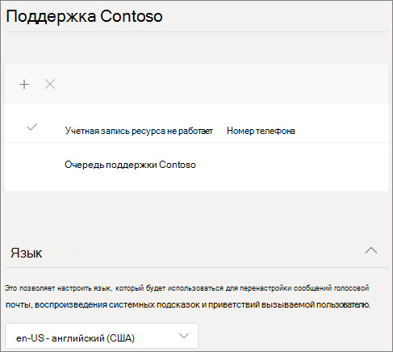
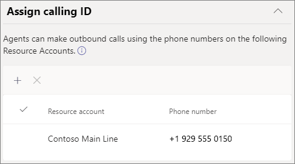
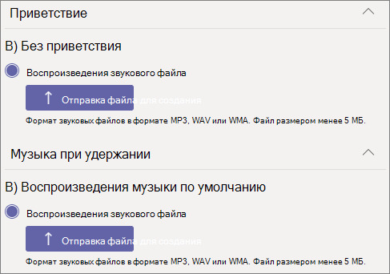
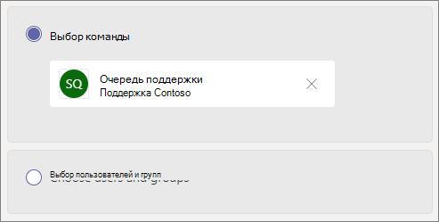
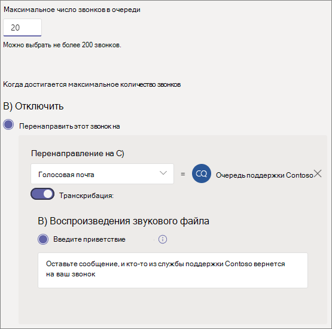
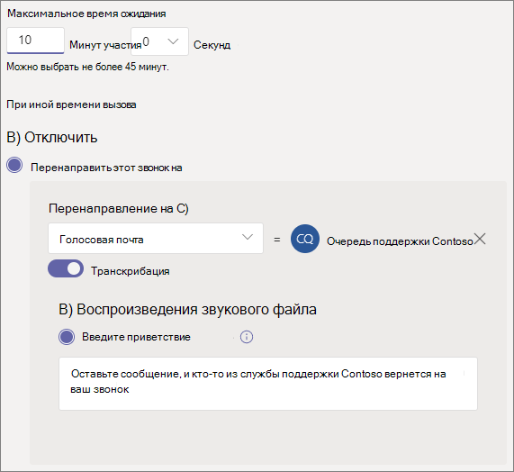

# Создание очереди вызовов

Очереди  вызовов предоставляют способ маршрутизации вызывающих людей в организации, которые могут помочь с определенной проблемой или вопросом. Звонки распределяются по одному для людей, которые находятся в очереди (которые называются *агентами*). 

> [!TIP]
> Эта статья предназначена для крупных организаций. Если ваша организация малого бизнеса, ознакомьтесь с учебным учебником Создание очереди вызовов [для малого](/microsoftteams/business-voice/create-a-phone-system-call-queue-smb) бизнеса.

Очереди  вызовов предоставляют:

- Приветствие.

- Музыка, пока люди находятся на удержании в очереди.

- Маршрутия вызовов — в *порядке first In, First Out* (FIFO) — агентам.

- Параметры обработки переполнения и времени ожидания в очереди.

См. статью [Планирование автосекретарей и очередей вызовов в Teams](plan-auto-attendant-call-queue.md), а затем [инструкции по началу работы](plan-auto-attendant-call-queue.md#getting-started) до выполнения процедур, описанных в этой статье.

**Дополнительные сведения см. в матрице совместимости [функций очереди](#call-queue-feature-compatibility) вызовов ниже.**

## Видеодемонстрация

В этом видео показан простой пример создания очереди  вызовов в Teams.

> [!VIDEO https://www.microsoft.com/videoplayer/embed/RWCF23?autoplay=false]

## Создание очереди  вызовов

Чтобы настроить очередь вызовов, в Центре администрирования Teams разойдите в **центр** голосовой почты, выберите очереди зовов **и нажмите** кнопку **Добавить**.

Введите имя очереди  вызовов.

## Учетные записи ресурсов

Нажмите **кнопку Добавить учетные** записи, найдите учетную запись ресурса, которую вы хотите использовать с этой очередью вызовов, нажмите кнопку **Добавить, а** затем нажмите кнопку **Добавить**. (Агенты увидят имя учетной записи ресурса, когда получат входящий звонок.)

Дополнительные сведения см. в [Teams ресурсами](manage-resource-accounts.md).

## Динамический ИД звоняного

**Доступно для пользователей Teams и для совместной работы при звонках на компьютер и Teams пользователей мобильных клиентов со стандартными очередями звонков**

Вы можете назначить агентам номера для исходяющих звонков, указав одну или несколько учетных записей ресурсов с телефонным номером. Агенты могут выбрать, какой номер исходящие номера вызываемого звонка использовать при каждом исходячем звонке.

Нажмите **кнопку** Добавить, найдите учетные записи ресурсов, которые должны разрешать агентам использовать при исходящем звонке, нажмите кнопку **Добавить, а** затем нажмите кнопку **Добавить**.

**Стандартные очереди  вызовов**

Для Teams рабочего стола и стандартных очередей  вызовов можно напрямую установить для участников очереди  вызовов номер службы очереди  вызовов или для соответствующего автозавода. Дополнительные сведения см. в [этой](caller-id-policies.md) Microsoft Teams.

> [!NOTE]
> Учетная запись ресурса, используемая для звонков, должна иметь лицензию виртуального пользователя Microsoft Teams телефонная система и одну из следующих лицензий:
>
> - Лицензия на план звонков и номер телефона, который назначен
> - Оператор Подключение назначенного номера телефона
> - Политика маршрутинга голосовой связи в Интернете (назначение номеров телефонов не является обязательным при использовании прямой маршрутии)

## Язык

Выберите [поддерживаемый язык](create-a-phone-system-call-queue-languages.md). Этот язык будет использоваться для системных голосовых подсказок и транскрибации голосовой почты (если вы их включаете).

## Приветствия и музыка при удержании в очереди

Укажите, хотите ли вы воспроизведения приветствия для вызывающих людей при их поступления в очередь. Необходимо отправить файл MP3, WAV или WMA, содержащий приветствие, которое вы хотите воспроизведения. Размер загруженной записи не должен быть больше 5 МБ.

Teams предоставляет вызывателям музыку по умолчанию, когда они находятся на удержании в очереди. Музыка по умолчанию, которая поставляется Teams очередях  вызовов, не предоставляется вашей организацией. Если вы хотите воспроизведения определенного звукового файла, выберите  Вариант воспроизведения звукового файла и загрузите файл MP3, WAV или WMA.

> [!NOTE]
> Вы несете ответственность за независимое очистку и обеспечение всех необходимых прав и разрешений на использование музыки или звуковых файлов в службе Microsoft Teams, которые могут включать интеллектуальную собственность и другие права в музыку, звуковые эффекты, звуковые эффекты, названия, имена и другое содержимое звукового файла от всех соответствующих владельцев прав, которые могут включать исполнителей, субъектов,  исполнителей, авторов, владельцев, редакторов, меток записей, издателей музыки, союзов, прав, авторов прав, организаций, которые являются их владельцем, контролируют или лицензируют музыкальные авторские права, звуковые эффекты, звуковые и другие права на интеллектуальную собственность.

## Агенты вызовов

Просмотрите [предварительные условия для добавления агентов в очередь зовов](plan-auto-attendant-call-queue.md#prerequisites).

##### Teams канале

Вы можете добавить до 200 агентов через Teams канале. Для добавления канала в очередь необходимо быть участником команды, создателем или владельцем канала.

Если вы хотите [использовать канал Teams](https://support.microsoft.com/office/9f07dabe-91c6-4a9b-a545-8ffdddd2504e) для управления очередью, выберите команду Выбрать команду и нажмите кнопку **Добавить канал**. Найдите команду, которую хотите использовать, выберите ее и нажмите кнопку **Добавить**. Выберите нужный канал (поддерживаются только стандартные каналы) и нажмите кнопку **Применить**. 

При использовании канала Teams для очередей  вызовов поддерживаются следующие клиенты: 

  - Microsoft Teams Windows клиента
  - Клиент Microsoft Teams Mac

> [!NOTE]
> Если вы используете этот параметр, для полной работы очереди  вызовов может занять до 24 часов.

##### Пользователи и группы

Вы можете добавить до 20 агентов по отдельности и до 200 агентов с помощью групп.

Если вы хотите добавить отдельных пользователей или группы в очередь, выберите **вариант Выбрать пользователей и** группы. 

Чтобы добавить пользователя в очередь, нажмите кнопку **Добавить пользователей,** найдите пользователя, нажмите кнопку **Добавить, а** затем нажмите кнопку **Добавить**.

Чтобы добавить группу в очередь, нажмите кнопку Добавить **группы,** найдите группу, нажмите кнопку **Добавить, а** затем нажмите кнопку **Добавить**. Вы можете использовать списки рассылки, группы безопасности и группы Microsoft 365 или Microsoft Teams группы.

> [!NOTE]
> Для первого звонка новым пользователям, добавленным в группу, может быть до восьми часов.

## Маршрутизация вызовов

**Режим конференции** значительно сокращает время, необходимое для связи звоняного с агентом, после того как агент принимает звонок. Чтобы режим конференции работал, агенты из очереди зовов должны использовать один из следующих клиентов:

  - Последняя версия клиента Microsoft Teams, приложения для Android или приложения для iOS
  - Microsoft Teams Телефон версии 1449/1.0.94.2020051601 или более поздней
  
Для Teams агентов необходимо установить режим Teams только для агентов. Агенты, не отвечающие требованиям, не включаются в список маршрутов зовов. Мы рекомендуем использовать режим конференции для очередей  вызовов, если все ваши агенты используют совместимые клиенты.

> [!NOTE]
> Режим конференции не поддерживается, если телефонные звонки перенаправят в очередь из шлюза прямой маршрутации, который включен для маршрутизов по расположению.

> [!TIP]
> Рекомендуется **установить для режима конференции** в **режиме** "В этом режиме".

**Способ маршрутики определяет** порядок, в котором агенты будут принимать звонки из очереди. Выберите один из этих вариантов:

- **Маршруты attendant одновременно** звонят всем агентам в очереди. Звонок получит первый агент вызова.

- **Порядковая маршрутия** звонит всем агентам по одному в порядке, указанном в списке **"Агенты звонка** ". Если агент отклоает звонок или не звонит, звонок звонит следующему агенту. Это будет повторяться до тех пор, пока звонок не будет перевыберется или не будет разозваться.

- **Round balances** the routing of incoming calls so each call agent gets the same number of calls from the queue. Этот способ маршрутизов может быть нежелательным в среде входящие продаж, чтобы обеспечить равные возможности для всех агентов.

- **Наиболее длинные** неавтоматные маршруты каждый звонок передается агенту, который простаивает в течение длительного времени. Агент считается неающим, если его состояние присутствия доступно. Агенты, состояние присутствия которых недоступно, не смогут принимать звонки, пока они не изменят свое состояние присутствия на В сети. 

> [!TIP]
> Рекомендуется **установить для параметра Метод маршрутинга** параметр **Округлите или** Самый длинный неавместимый.

> [!NOTE]
> Если [для агентов](teams-recording-policy.md) включена запись соответствия требованиям, **сочетание режима** конференции и маршрутации **Attendant не** поддерживается. Если вам нужно использовать  режим конференции **, выберите** способ Маршрутная маршрутная маршрутия **,** Округлите жижа или Длинный неавтиальный **.** Если вам нужно использовать **маршрутику Attendant**, установите для **режима конференции** режим **Выключить**.
> 
> Если **в** очереди больше звонков, чем в очереди, будут представлены только первые два самых длинных неавтных агента.
> 
> При использовании **longest idle** может быть время, когда агент получает звонок из очереди вскоре после того, как становится недоступным, или если прием звонка из очереди происходит с короткой задержкой после того, как он становится доступным.
> 
> Презентация с очереди  вызовов агентам может конфликтовть с ограничениями маршрутации по расположению. В этом случае агент получит всплывающее уведомление, но не сможет ответить на звонок. Это условие будет  продолжаться до тех пор, пока другой агент не сможет ответить на звонок, звонок зависает или возникает условие ожидания ожидания в очереди звонка.  

**В маршрутике** на основе присутствия используется состояние доступности агентов звонка, чтобы определить, следует ли включить агента в список маршрутов зовов для выбранного метода маршрутики. Агенты звонков, у которых установлено состояние  "В наличии", включаются в список маршрутов звонков и могут принимать звонки. Агенты, состояние доступности которых имеет любое другое состояние, исключаются из списка маршрутов звонков и не будут принимать звонки, пока их состояние доступности не изменится на **Доступно**. 

Вы можете включить маршрутику вызовов на основе присутствия с помощью любого из способов маршрутизов.

Если агент отключит получение звонков, он не будет включен в список маршрутов звонков независимо от состояния доступности. 

> [!NOTE]
> **Если в** качестве способа маршрутки выбран режим "Самый длинный неавместимый", маршрутная маршрутия на основе присутствия является обязательной и автоматически включена, даже если для переключения маршрутов на основе присутствия будет отключена и неанимна.
>
> Если маршрутия на основе присутствия не включена и в очереди несколько звонков, система будет одновременно представлять эти звонки агентам независимо от их состояния присутствия. В результате агенты получат несколько уведомлений о звонках, особенно если некоторые агенты не ответят на первоначальный звонок.
> 
> Агенты, которые используют Skype для бизнеса клиента, не включаются в список маршрутов зовов, если включена маршрутия на основе присутствия. Если у вас есть агенты, которые Skype для бизнеса, не в включаете маршрутику вызовов на основе присутствия.

> [!TIP]
> Рекомендуется **установить для маршрутики** на основе  присутствия параметр В сети.

**Время оповещения агента** определяет, как долго телефон агента будет звонить, прежде чем очередь перенаправит звонок следующему агенту.

> [!TIP]
> Рекомендуется **установить** **20** секунд для оповещения агента.

## Обработка переполнения  вызовов

**Максимальное число звонков в очереди** определяет максимальное количество звонков, которые могут быть в очереди в любое время. Значение по умолчанию — 50, но может быть от 0 до 200. Когда достигается это ограничение, звонок обрабатывается в том случае, если установлено максимальное **количество звонков.**

Вы можете отключить звонок или перенаправить его в любую из маршрутизов. Например, вы можете оставить голосовое сообщение для агентов в очереди. Сведения о внешних переводах см. в сведениях о предварительных и внешних передачах номеров [телефонов — технические](create-a-phone-system-auto-attendant.md#external-phone-number-transfers---technical-details) сведения о формате номеров.

> [!NOTE]
> Если максимальное количество звонков — 0, приветствие не будет воспроизведения.

## Обработка времени вызова

**Время ожидания звонка: максимальное** время ожидания определяет максимальное время удержания звонка в очереди перед перенаправлением или отключением. Можно указать значение от 0 секунд до 45 минут.

Вы можете отключить звонок или перенаправить его в одну из маршрутизов. Например, вы можете оставить голосовое сообщение для агентов в очереди. Сведения о внешних переводах: сведения о формате номеров, необходимые для передачи внешних телефонных номеров.

Выбрав параметры времени и времени вызова, нажмите кнопку **Сохранить**.

## Сводка рекомендуемых параметров очереди  вызовов

Рекомендуется использовать следующие параметры:

- **Режим конференции в** **режиме "Вт".**
- **Способ маршрутиста в** **round или** **longest idle**
- **Маршруты на основе присутствия в** В **сети**
- **Время оповещения агента:** **до 20 секунд**

## Совместимость функций очереди  вызовов

|Функция                          |Teams Desktop1 |Teams Mobile2 |Lync |IP-телефоны | Стандартные очереди  вызовов |Очереди  вызовов на основе каналов | Комментарий |
|:--------------------------------|:------------------------:|:-----------------------:|:---:|:--------:|:--------------------:|:------------------------:|:-------------|
|**Методы маршрутинга агента**        |                          |                         |     |          |                      |                          |              |
|`Attendant Routing`              |Да                         |Да                        |Да    |Да         |Да                     |Да                         |*По умолчанию*.     |
|`Longest Idle`3       |Да                         |Да                        |Нет    |Да         |Да                     |Да                         |*Рекомендуемые* |
|`Round Robin`                    |Да                         |Да                        |Да    |Да         |Да                     |Да                         |*Рекомендуемые* |
|`Serial`                         |Да                         |Да                        |Да    |Да         |Y4         |Y4             |              |
|**Режимы передачи**               |                          |                         |     |          |                      |                          |              |
|`Conference Mode`5    |Да                         |Да                        |Нет    |Y6|Да                  |Да                         |*Рекомендуемые* |
|`Transfer Mode`                  |Да                         |Да                        |Да    |Да         |Да                     |Да                         |              |
|Маршруты на основе присутствия3|Да                        |Да                        |Нет    |Да         |Да                     |Да                         |*Рекомендуемые* |
|Агенты могут отказаться               |Да                         |Да                        |Y7|Y7|Да          |Да                         |*По умолчанию*.     |
|Очереди на основе каналов             |Да                         |Нет                        |Нет    |Нет         |n/a                   |Y8             |              |
|Всплывающее уведомление о вызове с именем учетной записи ресурса |Y9       |Да                        |Да    |          |Да                     |Да                         |              |
|**Динамический ИД звоняного**            |                          |                         |     |          |                      |                          |              |
|`Standard call queue`            |Нет                         |Нет                        |Нет    |Нет         |Да                     |n/a                       |              |
|`Channel based call queue`       |Да                         |n/a                      |n/a  |n/a       |n/a                   |Да                         |              |
|**Способы подключения через ДНР**    |                          |                         |     |          |                      |                          |См. примечание 10   |
|`Calling Plans`                  |Да                         |Да                        |Да    |Да         |Да                     |Да                         |              |
|`Direct Routing`                 |Да                         |Да                        |Нет    |Нет         |Да                     |Да                         |              |
|`Operator Connect`               |Да                         |Да                        |     |          |Да                     |Да                         |              |

Примечания:
1. Microsoft Teams Windows, клиент Microsoft Teams Mac, Microsoft Teams в инфраструктуре виртуальных рабочих Microsoft Teams Web Client.
2. Microsoft Teams iPhone, Microsoft Teams Android.
3. Если выбрать для способа маршрутки агента режим Longest Idle, маршрутия на основе присутствия будет автоматически включиться.
4. Порядок можно настроить только при добавлении отдельных пользователей в стандартные очереди зовов. Если используется список рассылки или канал Teams используется порядок рассылки, будет использоваться по алфавиту.
5. Режим конференции не поддерживается, если телефонные звонки перенаправят в очередь из шлюза прямой маршрутации, который включен для маршрутизов по расположению.
6. Microsoft Teams телефоне.
7. На странице портала Параметры пользователя:https://aka.ms/vmsettings
8. Поддерживаются только общедоступные каналы.
9. За исключением Teams web client.
10. Автоответы и очереди звонков не могут переводить вызовы между способами подключения к ПСОП.

## Поддерживаемые клиенты

Для агентов, которые находятся в очереди зовов, поддерживаются следующие клиенты:

  - Skype для бизнеса 2016 (32- и 64-битные версии)
  - Клиент Lync для настольных пк 2013 (32- и 64-битные версии)
  - Все модели IP-телефонов, поддерживаемые Microsoft Teams. См[. получение телефонов для Skype для бизнеса Online](/skypeforbusiness/what-is-phone-system-in-office-365/getting-phones-for-skype-for-business-online/getting-phones-for-skype-for-business-online).
  - Клиент Mac Skype для бизнеса (версия 16.8.196 и более поздние)
  - Клиент Android Skype для бизнеса (версия 6.16.0.9 и более поздние)
  - Клиент iPhone Skype для бизнеса (версия 6.16.0 и более поздние)
  - Клиент iPad Skype для бизнеса (версия 6.16.0 и более поздние)
  - Microsoft Teams Windows (32- и 64-битные версии)
  - Клиент Microsoft Teams Mac
  - Microsoft Teams в инфраструктуре [виртуальных](/microsoftteams/teams-for-vdi) рабочих Windows (виртуальный рабочий стол, Citrix и VMWARE)
  - Microsoft Teams iPhone приложение
  - Microsoft Teams android

    > [!NOTE]
    > Очереди  вызовов, которые назначены прямой маршрутизов, не поддерживают Skype для бизнеса клиентов, клиентов Lync и Skype для бизнеса IP-телефонов в качестве агентов. Клиент Teams поддерживается только в режиме Teams[.](/microsoftteams/setting-your-coexistence-and-upgrade-settings)

## Командлеты для работы с очередями звонков

Windows PowerShell позволяет создавать очереди  вызовов и управлять ими с помощью командной строки пакетным или программным способом.

Управление очередью  вызовов можно управлять следующими cmdlets:

- [New-CsCallQueue](/powershell/module/skype/New-CsCallQueue)
- [Get-CsCallQueue](/powershell/module/skype/Get-CsCallQueue)
- [Set-CsCallQueue](/powershell/module/skype/Set-CsCallQueue)
- [Remove-CsCallQueue](/powershell/module/skype/Remove-CsCallQueue)

Для управления пользователями, учетными записями ресурсов, лицензиями на Microsoft Teams Телефон, номерами телефонов, звуковые файлы и поддерживаемым языком, которые будут использоваться с очередями звонков, также необходимы следующие дополнительные cmdlets:

Пользователи и Teams

- Пользователи
- - [Get-CsOnlineUser](/powershell/module/skype/Get-CsOnlineUser)

- Teams: 
- - [Get-Team](/powershell/module/teams/Get-Team)
- - [Get-TeamChannel](/powershell/module/teams/Get-TeamChannel)

Учетные записи ресурсов:

- [New-CsOnlineApplicationInstance](/powershell/module/skype/New-CsOnlineApplicationInstance)
- [Find-CsOnlineApplicationInstance](/powershell/module/skype/Find-CsOnlineApplicationInstance)
- [Get-CsOnlineApplicationInstance](/powershell/module/skype/Get-CsOnlineApplicationInstance)
- [Set-CsOnlineApplicationInstance](/powershell/module/skype/Set-CsOnlineApplicationInstance)
- [New-CsOnlineApplicationInstanceAssociation](/powershell/module/skype/New-CsOnlineApplicationInstanceAssociation)
- [Get-CsOnlineApplicationInstanceAssociation](/powershell/module/skype/Get-CsOnlineApplicationInstanceAssociation)
- [Remove-CsOnlineApplicationInstanceAssociation](/powershell/module/skype/Remove-CsOnlineApplicationInstanceAssociation)
- [Get-CsOnlineApplicationInstanceAssociationStatus](/powershell/module/skype/Get-CsOnlineApplicationInstanceAssociationStatus)

Лицензии Teams Телефон виртуальных лицензий:

- [Get-MsolAccountSku](/powershell/module/msonline/get-msolaccountsku)
- [Set-MsolUserLicense](/powershell/module/msonline/set-msoluserlicense)

Телефон назначение номера:

- [Get-CsOnlineTelephoneNumber](/powershell/module/skype/Get-CsOnlineTelephoneNumber)
- [Set-CsPhoneNumberAssignment](/powershell/module/teams/Set-csphonenumberassignment)

Звуковые файлы

- [Get-CsOnlineAudioFile](/powershell/module/skype/Get-CsOnlineAudioFile)
- [Import-CsOnlineAudioFile](/powershell/module/skype/Import-CsOnlineAudioFile)
- [Export-CsOnlineAudioFile](/powershell/module/skype/Export-CsOnlineAudioFile)
- [Remove-CsOnlineAudioFile](/powershell/module/skype/Remove-CsOnlineAudioFile)

Списки языков поддержки

- [Get-CsAutoAttendantSupportedLanguage](/powershell/module/skype/Get-CsAutoAttendantSupportedLanguage)

Пошаговые руководства по созданию очередей вызовов с помощью PowerShell см. в руководстве По созданию очередей вызовов с помощью [powerShell](create-a-phone-system-call-queue-via-cmdlets.md).

## Средство диагностики очереди  вызовов

Если вы администратор, вы можете проверить, может ли очередь звонков принимать звонки, с помощью следующего средства диагностики:

1. Выберите **Выполнить тесты** ниже, чтобы заполнить диагностику в Центре администрирования Microsoft 365. 

   > [!div class="nextstepaction"]
   > [Выполнить тесты: Teams очереди  вызовов](https://aka.ms/TeamsCallQueueDiag)

2. В области диагностики Выполнить введите имя учетной записи ресурса  в поле Имя пользователя или Электронная почта и выберите **Выполнить тесты**.

3. Тесты будут возвращать наилучшие дальнейшие действия для устранения конфигураций клиентов, политик и учетных записей ресурсов, чтобы проверить, могут ли очереди звонков принимать звонки.

## См. также

[Вот что можно получить с помощью Microsoft Teams Телефон](here-s-what-you-get-with-phone-system.md)

[Получение служебных номеров телефонов](getting-service-phone-numbers.md)

[Доступность аудиоконференций и тарифных планов в различных странах и регионах](country-and-region-availability-for-audio-conferencing-and-calling-plans/country-and-region-availability-for-audio-conferencing-and-calling-plans.md)
