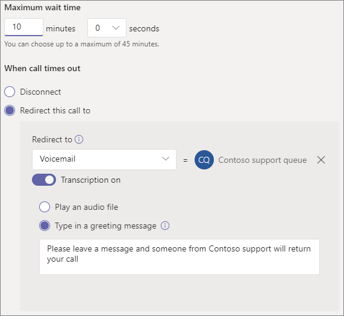

# Создание очереди вызововCreate a call queue

Очереди вызовов предоставляют способ маршрутизации вызывающих людей в организации, которые могут помочь с определенной проблемой или вопросом.Call queues provide a method of routing callers to people in your organization who can help with a particular issue or question. Звонки распределяются по одному для людей, которые находятся в очереди (которые называются *агентами).*Calls are distributed one at a time to the people in the queue (who are known as *agents*). 

> [!TIP]
> Эта статья посвящена крупным организациям.This article is for large organizations. Если ваша организация малого бизнеса, ознакомьтесь с учебным учебником Создание очереди вызовов [для малого](/microsoftteams/business-voice/create-a-phone-system-call-queue-smb) бизнеса.If your organization is a small business, read [Create a call queue - small business tutorial](/microsoftteams/business-voice/create-a-phone-system-call-queue-smb) instead.

Очереди вызовов предоставляют:Call queues provide:

- Приветствие.A greeting message.

- Музыка, пока люди находятся на удержании в очереди.Music while people are waiting on hold in a queue.

- Маршрутия вызовов — в порядке first *In, First Out* (FIFO) — агентам.Call routing - in *First In, First Out* (FIFO) order - to agents.

- Параметры обработки переполнения и времени ожидания в очереди.Handling options for queue overflow and timeout.

Прежде чем выполнять действия, которые вы выполните в этой  [статье, ознакомьтесь](plan-auto-attendant-call-queue.md) со статьей Планирование работы с Teams и очередей вызовов и следуйте этим шагам.Be sure you have read [Plan for Teams auto attendants and call queues](plan-auto-attendant-call-queue.md) and followed the [getting started steps](plan-auto-attendant-call-queue.md#getting-started) before you follow the procedures in this article.

## Демонстрация видеоVideo demonstration

В этом видео показан простой пример создания очереди вызовов в Teams.This video shows a basic example of how to create a call queue in Teams.

> [!VIDEO https://www.microsoft.com/videoplayer/embed/RWCF23?autoplay=false]

## Создание очереди вызововCreate the call queue

Чтобы настроить очередь вызовов, в Центре администрирования Teams Разойдите в центр администрирования Голосовая почта **,** щелкните Очереди зовов **и** нажмите кнопку **Добавить**.To set up a call queue, in the Teams admin center, expand **Voice**, click **Call queues**, and then click **Add**.

### Учетная запись ресурса и языкResource account and language

1. Введите имя очереди вызовов.Type a name for the call queue.

2. Нажмите **кнопку Добавить учетные** записи , найдите учетную запись ресурса, которую вы хотите использовать с этой очередью вызовов, нажмите кнопку **Добавить,** а затем нажмите кнопку **Добавить.**Click **Add accounts**, search for the resource account that you want to use with this call queue, click **Add**, and then click **Add**. (Агенты увидят имя учетной записи ресурса, когда получат входящий звонок.)(Agents will see the resource account name when they receive an incoming call.)

3. Выберите [поддерживаемый язык.](create-a-phone-system-call-queue-languages.md)Choose a [supported language](create-a-phone-system-call-queue-languages.md). Этот язык будет использоваться для системных голосовых подсказок и транскрибации голосовой почты (если вы их включаете).This language will be used for system-generated voice prompts and voicemail transcription (if you enable them).

### Приветствия и музыка на удержании в очередиGreetings and music on hold in queue

Укажите, хотите ли вы воспроизведения приветствия для вызывающих людей при их поступления в очередь.Specify if you want to play a greeting to callers when they arrive in the queue. Необходимо отправить файл MP3, WAV или WMA, содержащий приветствие, которое вы хотите воспроизведения.You must upload an MP3, WAV, or WMA file containing the greeting that you want to play.

Teams предоставляет вызывателям музыку по умолчанию, когда они находятся на удержании в очереди.Teams provides default music to callers while they are on hold in a queue. Если вы хотите воспроизведения определенного  звукового файла, выберите Вариант воспроизведения звукового файла и загрузите файл MP3, WAV или WMA.If you want to play a specific audio file, choose **Play an audio file** and upload an MP3, WAV, or WMA file.

> [!NOTE]
> Размер загруженной записи не должен быть больше 5 МБ.The uploaded recording can be no larger than 5 MB.
> Музыка по умолчанию, которая поставляется Teams очередях вызовов, не предоставляется вашей организацией.The default music supplied in Teams call queues is free of any royalties payable by your organization. 

### Агенты вызововCall agents

Просмотрите [предварительные условия для добавления агентов в очередь вызовов.](plan-auto-attendant-call-queue.md#prerequisites)Review the [prerequisites for adding agents to a call queue](plan-auto-attendant-call-queue.md#prerequisites).

##### Teams каналеTeams channel

Вы можете добавить до 200 агентов через Teams канале.You can add up to 200 agents via a Teams channel.

Если вы хотите [использовать канал Teams](https://support.microsoft.com/office/9f07dabe-91c6-4a9b-a545-8ffdddd2504e)для управления очередью, выберите команду Выбрать команду и щелкните Добавить **канал**. If you want to [use a Teams channel to manage the queue](https://support.microsoft.com/office/9f07dabe-91c6-4a9b-a545-8ffdddd2504e), select the **Choose a team** option and click **Add a channel**. Найдите команду, которую хотите использовать, выберите ее и нажмите кнопку **Добавить.**Search for the team that you want to use, select it, and click **Add**. Выберите канал, который вы хотите использовать, и нажмите кнопку **Применить**.Select the channel that you want to use and click **Apply**.

При использовании канала Teams для очередей вызовов поддерживаются следующие клиенты:The following clients are supported when using a Teams channel for call queues: 

  - Microsoft Teams Windows клиентаMicrosoft Teams Windows client
  - Клиент Microsoft Teams MacMicrosoft Teams Mac client

##### Пользователи и группыUsers and groups

Вы можете добавить до 20 агентов по отдельности и до 200 агентов с помощью групп.You can add up to 20 agents individually and up to 200 agents via groups.

Если вы хотите добавить отдельных пользователей или группы в очередь, выберите **параметр Выбрать пользователей и** группы.If you want to add individual users or groups to the queue, select the **Choose users and groups** option. 

Чтобы добавить пользователя в очередь, нажмите **кнопку** Добавить пользователей , найдите пользователя, нажмите кнопку Добавить **и** выберите **добавить**.To add a user to the queue, click **Add users**, search for the user, click **Add**, and then click **Add**.

Чтобы добавить группу в очередь, нажмите **кнопку** Добавить группы , найдите группу, нажмите кнопку Добавить **и** выберите **добавить**.To add a group to the queue, click **Add groups**, search for the group, click **Add**, and then click **Add**. Вы можете использовать списки рассылки, группы безопасности и Microsoft 365 группы или Microsoft Teams группы.You can use distribution lists, security groups, and Microsoft 365 groups or Microsoft Teams teams.

> [!NOTE]
> Первые вызовы новых пользователей, добавленных в группу, могут принимать до восьми часов.New users added to a group can take up to eight hours for their first call to arrive.

### Маршрутизация вызововCall routing

**Режим конференции** значительно сокращает время, необходимое для связи звоняного с агентом, после того как агент принимает звонок.**Conference mode** significantly reduces the amount of time it takes for a caller to be connected to an agent, after the agent accepts the call. Чтобы режим конференции работал, агенты в очереди зовов должны использовать один из следующих клиентов:For conference mode to work, agents in the call queue must use one of the following clients:

  - Последняя версия клиента Microsoft Teams, приложения Для Android или приложения для iOSThe latest version of the Microsoft Teams desktop client, Android app, or iOS app
  - Microsoft Teams версии телефона 1449/1.0.94.2020051601 или более позднейMicrosoft Teams phone version 1449/1.0.94.2020051601 or later
  
Для Teams агентов необходимо настроить режим Teams только для агентов.Agents' Teams accounts need to be set to Teams-only mode. Агенты, не отвечающие требованиям, не включаются в список маршрутов зовов.Agents who don't meet the requirements aren't included in the call routing list. Мы рекомендуем использовать режим конференции для очередей вызовов, если все ваши агенты используют совместимые клиенты.We recommend enabling conference mode for your call queues if your agents are all using compatible clients.

> [!NOTE]
> Режим конференции не поддерживается, если телефонные звонки перенаправлются в очередь из шлюза прямой маршрутации, который включен для маршрутизов по расположению.Conference mode is not supported if phone calls are routed to the queue from a Direct Routing gateway that is enabled for Location Based Routing.

**Способ маршрутики определяет** порядок, в котором агенты будут принимать звонки из очереди.**Routing method** determines the order in which agents receive calls from the queue. Выберите один из этих вариантов:Choose from these options:

- **Маршруты помощника одновременно** звонят всем агентам в очереди.**Attendant routing** rings all agents in the queue at the same time. Звонок получит первый агент звонка.The first call agent to pick up the call gets the call.

- **Порядковая маршрутия** звонит всем агентам по одному в порядке, указанном в списке **"Агенты звонка".****Serial routing** rings all call agents one by one in the order specified in the **Call agents** list. Если агент отклоает звонок или не звонит, звонок звонит следующему агенту и пробует всех агентов до тех пор, пока он не будет отклонен или не будет разозваться.If an agent dismisses or does not pick up a call, the call will ring the next agent and will try all agents until it is picked up or times out.

- **Round balances** the routing of incoming calls so each call agent gets the same number of calls from the queue.**Round robin** balances the routing of incoming calls so that each call agent gets the same number of calls from the queue. Это может быть нежелательно в среде входящие продаж, чтобы обеспечить равные возможности для всех агентов звонка.This may be desirable in an inbound sales environment to assure equal opportunity among all the call agents.

- **Наиболее длинные** неавтоматные маршруты каждый звонок передается агенту, который простаивает в течение долгого времени.**Longest idle** routes each call to the agent who has been idle the longest time. Агент считается неающим, если его состояние присутствия доступно или состояние присутствия "Нет на нем" менее 10 минут.An agent is considered idle if their presence state is Available or if their presence state has been Away for less than 10 minutes. Агенты, состояние присутствия которых отсутствует более 10 минут, не считаются неавтными и не смогут принимать звонки, пока они не изменят свое состояние присутствия на В сети.Agents whose presence state has been Away for more than 10 minutes are not considered idle and will not be eligible to receive calls until they change their presence to Available. 

**В маршрутике** на основе присутствия используется состояние доступности агентов звонка, чтобы определить, следует ли включить агента в список маршрутов зовов для выбранного метода маршрутики.**Presence-based routing** uses the availability status of call agents to determine whether an agent should be included in the call routing list for the selected routing method. Звонки от агентов, у  которых установлено состояние "В наличии", включаются в список маршрутов звонков и могут принимать звонки.Call agents whose availability status is set to **Available** are included in the call routing list and can receive calls. Агенты, состояние доступности которых имеет любое другое состояние, исключаются из списка маршрутов звонков и не будут получать звонки, пока их состояние доступности не изменится на **Доступно.**Agents whose availability status is set to any other status are excluded from the call routing list and won't receive calls until their availability status changes back to **Available**. 

Вы можете включить маршрутику вызовов на основе присутствия с помощью любого из способов маршрутизов.You can enable presence-based call routing with any of the routing methods.

Если агент отключит получение звонков, он не будет включен в список маршрутов звонков независимо от состояния доступности.If an agent opts out of getting calls, they won't be included in the call routing list regardless of what their availability status is set to. 

> [!NOTE]
> Агенты, которые используют Skype для бизнеса клиента, не включаются в список маршрутов зовов, если включена маршрутия на основе присутствия.Agents who use the Skype for Business client aren't included in the call routing list when presence-based routing is enabled. Если у вас есть агенты, Skype для бизнеса, не в включаете маршрутику вызовов на основе присутствия.If you have agents who use Skype for Business, don't enable presence-based call routing.

**Время оповещения агента** определяет, как долго телефон агента будет звонить, прежде чем очередь перенаправит звонок следующему агенту.**Agent alert time** specifies how long an agent's phone will ring before the queue redirects the call to the next agent.

Рекомендуется использовать следующие параметры:The following settings are recommended:

- **Режим конференции с** **автоматическим****Conference mode** to **Auto**
- **Способ маршрутинга до** **round или** **longest idle****Routing method** to **Round robin** or **Longest idle**
- **Маршруты на основе присутствия в** В **сети****Presence-based routing** to **On**
- **Время оповещения агента:** **до 20 секунд****Agent alert time:** to **20 seconds**

> [!NOTE]
> Если маршрутия на основе присутствия не включена и в очереди несколько звонков, система будет одновременно представлять эти звонки агентам независимо от их состояния присутствия.If presence-based routing is not enabled and there are multiple calls in the queue, the system will present these calls simultaneously to the agents regardless of their presence status. В результате агенты получат несколько уведомлений о звонках, особенно если некоторые агенты не ответят на первоначальный звонок.This will result in multiple call notifications to agents, particularly if some agents don’t answer the initial call presented to them.

### Обработка переполнения вызововCall overflow handling

**Максимальное число звонков** в очереди определяет максимальное количество звонков, которые могут быть в очереди в любое время.**Maximum calls in the queue** specifies the maximum number of calls that can wait in the queue at any given time. Значение по умолчанию — 50, но может быть от 0 до 200.The default is 50, but it can range from 0 to 200. Когда достигается это ограничение, звонок обрабатывается, как указано в параметре Когда достигается **максимальное количество звонков.**When this limit is reached, the call is handled as specified by the **When the maximum number of calls is reached** setting.

Вы можете отключить звонок или перенаправить его в любую из маршрутизов.You can choose to disconnect the call or redirect it to any of the call routing destinations. Например, вы можете оставить голосовое сообщение для агентов в очереди.For example, you might have the caller leave a voicemail for the agents in the queue. Сведения о внешних  переводах:  технические сведения о формате номеров.For external transfers, please refer to [Prerequisites](plan-auto-attendant-call-queue.md#prerequisites) and the [external phone number transfers - technical details](create-a-phone-system-auto-attendant.md#external-phone-number-transfers---technical-details) for number formatting.

> [!NOTE]
> Если максимальное количество звонков — 0, приветствие не будет воспроизведения.If the maximum number of calls is set to 0 then the greeting message will not play.

### Обработка времени вызоваCall timeout handling

**Время ожидания звонка: максимальное** время ожидания определяет максимальное время удержания звонка в очереди перед перенаправлением или отключением.**Call Timeout: maximum wait time** specifies the maximum time a call can be on hold in the queue before it is redirected or disconnected. Можно указать значение от 0 секунд до 45 минут.You can specify a value from 0 seconds to 45 minutes.

Вы можете отключить звонок или перенаправить его в одну из маршрутизов.You can choose to disconnect the call or redirect it to one of the call routing destinations. Например, вы можете оставить голосовое сообщение для агентов в очереди.For example, you might have the caller leave a voicemail for the agents in the queue. Сведения о внешних  переводах:  технические сведения о формате номеров.For external transfers, please refer to [Prerequisites](plan-auto-attendant-call-queue.md#prerequisites) and the [external phone number transfers - technical details](create-a-phone-system-auto-attendant.md#external-phone-number-transfers---technical-details) for number formatting.

Выбрав параметры времени и времени вызова, нажмите кнопку **Сохранить**.When you have selected your call timeout options, click **Save**.

## ИД звонка для исходящие вызовыCaller ID for outbound calls

Так как агенты в очереди зовов могут звонить, чтобы вернуть звонок клиента, можно установить для участников очереди зовов номер службы соответствующего автослужбу.Since agents in a call queue may dial out to return a customer call, consider setting the caller ID for members of a call queue to the service number of an appropriate auto attendant. Дополнительные [сведения см.](caller-id-policies.md) в Microsoft Teams управление политиками ИД звоня.See [Manage caller ID policies in Microsoft Teams](caller-id-policies.md) for more information.

## Поддерживаемые клиентыSupported clients

Для агентов, которые находятся в очереди зовов, поддерживаются следующие клиенты:The following clients are supported for call agents in a call queue:

  - Skype для бизнеса 2016 (32- и 64-битные версии)Skype for Business desktop client 2016 (32-bit and 64-bit versions)
  - Клиент Lync для настольных пк 2013 (32- и 64-битные версии)Lync desktop client 2013 (32-bit and 64-bit versions)
  - Все модели IP-телефонов, поддерживаемые Microsoft Teams.All IP phone models supported for Microsoft Teams. См. [получение телефонов для Skype для бизнеса Online.](/skypeforbusiness/what-is-phone-system-in-office-365/getting-phones-for-skype-for-business-online/getting-phones-for-skype-for-business-online)See [Getting phones for Skype for Business Online](/skypeforbusiness/what-is-phone-system-in-office-365/getting-phones-for-skype-for-business-online/getting-phones-for-skype-for-business-online).
  - Клиент Mac Skype для бизнеса (версия 16.8.196 и более поздние)Mac Skype for Business Client (version 16.8.196 and later)
  - Клиент Android Skype для бизнеса (версия 6.16.0.9 и более поздние)Android Skype for Business Client (version 6.16.0.9 and later)
  - Клиент iPhone Skype для бизнеса (версия 6.16.0 и более поздние)iPhone Skype for Business Client (version 6.16.0 and later)
  - Клиент iPad Skype для бизнеса (версия 6.16.0 и более поздние)iPad Skype for Business Client (version 6.16.0 and later)
  - Microsoft Teams Windows (32- и 64-битные версии)Microsoft Teams Windows client (32-bit and 64-bit versions)
  - Клиент Microsoft Teams MacMicrosoft Teams Mac client
  - Microsoft Teams в инфраструктуре [виртуальных](/microsoftteams/teams-for-vdi) рабочих Windows (виртуальный рабочий стол, Citrix и VMWARE)Microsoft Teams on [Virtualized Desktop Infrastructure](/microsoftteams/teams-for-vdi) (Windows Virtual Desktop, Citrix, and VMware)
  - Microsoft Teams iPhone приложениеMicrosoft Teams iPhone app
  - Microsoft Teams Приложение для AndroidMicrosoft Teams Android app

    > [!NOTE]
    > Очереди вызовов, которые назначены прямой маршрутизов, не поддерживают Skype для бизнеса клиентов, клиентов Lync и Skype для бизнеса IP-телефонов в качестве агентов.Call queues that are assigned a direct routing number don't support Skype for Business clients, Lync clients, or Skype for Business IP Phones as agents.

## Командлеты для работы с очередями звонковCall queue cmdlets

Для создания и настройки очередей звонков также можно использовать Windows PowerShell.You can also use Windows PowerShell to create and set up call queues. Ниже 2010 г. вы можете использовать для управления очередью вызовов.Here are the cmdlets that you use to manage a call queue.

- [New-CsCallQueueNew-CsCallQueue](/powershell/module/skype/new-CsCallQueue)

- [Set-CsCallQueueSet-CsCallQueue](/powershell/module/skype/set-CsCallQueue)

- [Get-CsCallQueueGet-CsCallQueue](/powershell/module/skype/get-CsCallQueue)

- [Remove-CsCallQueueRemove-CsCallQueue](/powershell/module/skype/remove-CsCallQueue)

## Статьи по темеRelated topics

[Возможности телефонной системыHere's what you get with Phone System](here-s-what-you-get-with-phone-system.md)

[Получение номеров телефонов службGetting service phone numbers](getting-service-phone-numbers.md)

[Доступность аудиоконференций и планов звонков в различных странах и регионахCountry and region availability for Audio Conferencing and Calling Plans](country-and-region-availability-for-audio-conferencing-and-calling-plans/country-and-region-availability-for-audio-conferencing-and-calling-plans.md)

[New-CsOnlineApplicationInstanceNew-CsOnlineApplicationInstance](/powershell/module/skype/new-csonlineapplicationinstance)

[Введение в Windows PowerShell и Skype для бизнеса OnlineAn introduction to Windows PowerShell and Skype for Business Online](/SkypeForBusiness/set-up-your-computer-for-windows-powershell/set-up-your-computer-for-windows-powershell)
