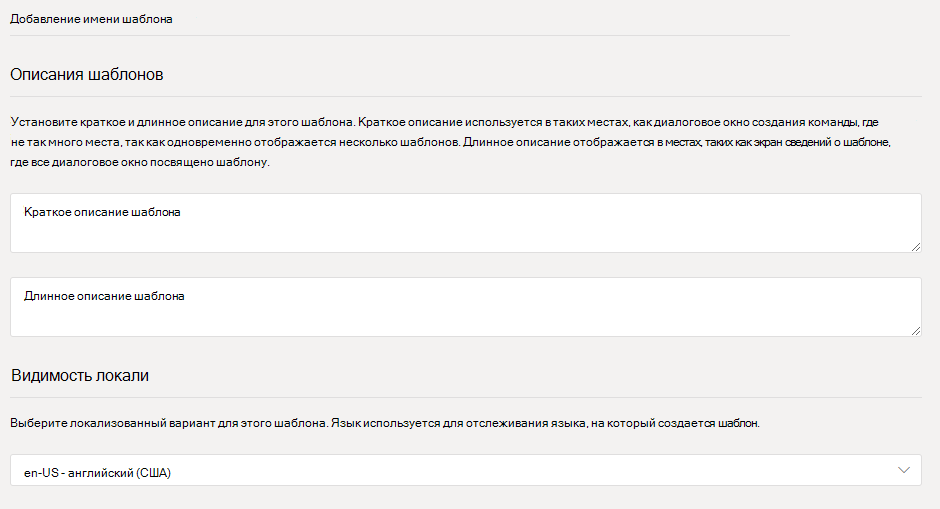
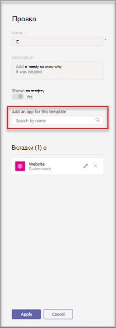
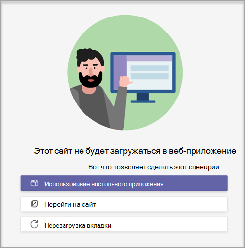

# Создание настраиваемой команды в Microsoft Teams

**Пользовательские шаблоны пока не поддерживаются пользователями EDU.**

Настраиваемый шаблон команды — это предопределена структура команды с набором каналов, вкладок и приложений. Вы можете разработать шаблон, который поможет быстро создать пространство для совместной работы. В настраиваемом шаблоне группы используются предпочтительные параметры.  

 

> [!VIDEO https://www.microsoft.com/en-us/videoplayer/embed/RE4P5rx]

Чтобы при начать работу:

1. Войдите в Центр администрирования Teams.

2. В левой области навигации **раз** Teams  >  **шаблоны команд**.

3. Нажмите **Добавить**.

    

4. В разделе **Шаблоны группы** выберите **Создать новый шаблон**.

5. В разделе **Параметры шаблона** заполним следующие поля и выберите **Далее:**
    - Имя шаблона
    - Краткое и длинное описание шаблона
    - Видимость локали  

    

6. В разделе **каналы, вкладки и приложения** добавьте каналы и приложения, необходимые вашей команде.

    1. В разделе **Каналы** выберите **Добавить**.
    2. В **диалоговом** оке Добавление привязайте каналу имя.
    3. Добавьте описание.
    4. Решите, должен ли канал показываться по умолчанию.
    5. Найди имя приложения, которое вы хотите добавить в канал.
    6. По **завершению** выберите Применить.

    

8. **Завершив отправку,** выберите Отправить.

Новый шаблон отобразит в **списке Шаблоны** группы. Шаблон можно использовать для создания команды в Teams.

> [!Note]
> Изменение пользовательского шаблона в коллекции может занять до 24 часов.

## Настройка веб-приложений вкладки "Веб-сайт"

> [!Note]
> Эта функция находится в предварительном режиме

В пользовательских шаблонах группы можно указать URL-адреса вкладок веб-сайтов для каналов. У конечных пользователей, которые создают команды на шаблонах, есть вкладки веб-сайтов, которые предустановлены для указанного URL-адреса сайта.

Чтобы при начать работу:

1. Создайте новый шаблон команды или отредактируете существующий шаблон.

2. В разделе Каналы добавьте новый канал или выберите существующий канал и выберите **Изменить**.

3. В разделе **Добавление приложения для этого шаблона** добавьте веб-приложение Веб-сайт.

    

4. Выберите значок редактирования и вводимый URL-адрес.

    

5. Чтобы **сохранить изменения** в приложении для вкладки, выберите Сохранить, а затем выберите **Применить.**

## Известные проблемы

**Проблема:** если вы создали команду из настраиваемого шаблона, который содержал дополнительные настраиваемые вкладки, вы можете видеть пустые вкладки на месте пользовательских приложений вкладок. Вкладки по умолчанию (такие как **Записи,** **Файлы** и **Вики)** будут отображаться как ожидалось.

**Решение:** чтобы устранить эту проблему, удалите настраиваемую вкладку и добавьте новую вкладку с тем же приложением. Если у вас нет разрешений на удаление настраиваемой вкладки и добавление новой вкладки, обратитесь за помощью к владельцу команды.

В настоящее время мы работаем над исправлением для будущих команд, созданных на основе пользовательских шаблонов.

**Проблема.** При использовании Teams в браузере некоторые веб-сайты не поддерживают отрисовку на вкладке Teams веб-сайта.

**Решение:** если у вас возникли проблемы при просмотре содержимого вкладки веб-сайта, вы будете перенаправлены на открытие вкладки на отдельной веб-странице или открытие Teams в настольном приложении, чтобы просмотреть приложение вкладки веб-сайта.

## Статьи по теме

- [Начало работы с шаблонами групп в Центре администрирования](get-started-with-teams-templates-in-the-admin-console.md)
- [Создание шаблона из существующей команды](create-template-from-existing-team.md)
- [Создание шаблона команды из существующего шаблона группы](create-template-from-existing-template.md)
