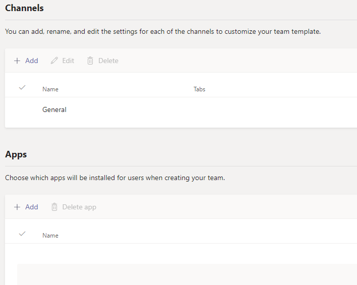

# Создание настраиваемого шаблона группы в Microsoft Teams

**Пользовательские шаблоны пока не поддерживаются для пользователей EDU.**

Настраиваемый шаблон группы — это предварительно определенная структура команды с набором каналов, вкладок и приложений, с помощью которых вы можете создать пространство для совместной работы. Настраиваемый шаблон команды использует ваши предпочтительные параметры.  

Начало работы:

1. Войдите в центр администрирования Teams.

2. На панели навигации **слева разверните раздел**  >  **шаблоны групп Teams**.

3. Нажмите **Добавить**.

4. В разделе **шаблоны группы** выберите пункт **создать новый шаблон для фирменной символики**.

5. В разделе **Параметры шаблона** заполните указанные ниже поля и нажмите кнопку **Далее**.
    - Имя шаблона
    - Краткие и длинные описания шаблона
    - Видимость языковых стандартов  

6. В разделе **каналы, вкладки и приложения** добавьте любые каналы и приложения, необходимые вашей команде.

    1. В разделе **каналы** нажмите кнопку **Добавить**.
    2. В диалоговом окне **Добавить** имя канала.
    3. Добавьте описание.
    4. Определите, должен ли канал отображаться по умолчанию.
    5. Найдите имя приложения, которое вы хотите добавить в канал.
    6. По завершении нажмите кнопку **Применить** .

8. По завершении нажмите кнопку **Отправить** .

Новый шаблон появится в списке **шаблонов групп** . Шаблон можно использовать для создания групп в Teams.

> [!Note]
> Чтобы пользователи Teams могли видеть настраиваемый шаблон в коллекции, может потребоваться до 24 часов.

## Связанные статьи

- [Начало работы с шаблонами группы в центре администрирования](get-started-with-teams-templates-in-the-admin-console.md)
- [Создание шаблона на основе существующей группы](create-template-from-existing-team.md)
- [Создание шаблона группы на основе существующего шаблона группы](create-template-from-existing-template.md)
