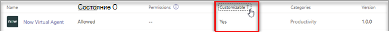
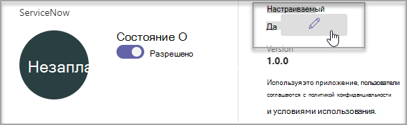

# Настройка приложений в Microsoft Teams

 Microsoft Teams позволяет настраивать приложения для улучшения Teams приложения. Некоторые разработчики приложений позволяют администратору Teams приложение. Администратор может изменить или изменить свойства приложения в зависимости от потребностей организации, используя страницу Teams Управление **приложениями.** Вы можете настроить такие сведения:

- Короткое имя
- Краткое описание
- Полное описание
- URL-адрес политики конфиденциальности
- URL-адрес веб-сайта
- Условия использования URL-адреса
- Значок цвета
- Значок "Контур"
- Цвет акцента

Подробные [сведения о полях,](/microsoftteams/platform/resources/schema/manifest-schema) которые можно настроить, см. в схеме манифеста Teams манифеста.

> [!NOTE]
> В настоящее время настройка приложений облако сообщества для государственных организаций высокая (GCCH) или Department of Defense (DoD).
> В настоящее время эта функция недоступна для Microsoft Teams приложений.

## Настройка сведений о приложении

Чтобы начать настройку приложения, выполните следующие действия:

1. Войдите в Центр администрирования Teams.

2. Разо **Teams приложения и** выберите Управление **приложениями**.

3. Проверьте **столбец Настраиваемый** список приложений и отсортировать их по настраиваемым приложениям.

   

   Для доступа к функции настройки доступны три точки входа:

   - Выберите рядом с приложением, которое вы хотите настроить, и выберите **Настроить**.

     

   - Выберите имя приложения и выберите **настраиваемый .**

     

   - Выберите имя приложения, а затем в **dropdown Actions (Действия)** выберите **customize** (Настроить).

     

4. **Разорите раздел** Сведения и настройте следующие поля:

    - Короткое имя
    - Краткое описание
    - Полное описание
    - Веб-сайт
    - URL-адрес политики конфиденциальности
    - Условия использования URL-адреса

   

> [!Note]
> Будут видны только поля, которые разработчик приложения настроит.

5. Разорите **раздел Значок.**

   1. Upload значок. Используйте один полноцветный значок (192x192) в формате PNG.

   1. Выберите цвет контура значка. Используйте один прозрачный контур (32x32) пикселя в формате PNG.

   1. Выберите цвет со значком.

    

6. После настройки приложения выберите Применить **.**

7. Чтобы **опубликовать настроенную** функцию, выберите опубликовать.

   Теперь настроенное приложение будет указано на странице **Управление приложениями.** У вас будет только одна версия приложения, так как при настройке функций приложения его копия не создается.

Теперь Teams пользователи могут открыть свой клиент Teams, чтобы увидеть настроенную приложение.

   

### Особые моменты для настройки приложения

В следующей заметке содержатся важные сведения о настройке приложения.

> [!Note]
> - При настройке приложений и любых описаний, связанных с приложением, убедитесь, что вы придерживались каких-либо рекомендаций по настройке, если издатель приложения предоставляет их документацию или условия использования. Кроме того, вы несете ответственность за соблюдение прав других людей в отношении изображений сторонних организаций, которые вы можете использовать.
> - Данные настройки, предоставленные администратором, хранятся в ближайшем регионе.
> - Вы несете ответственность за то, чтобы ссылки на условия использования или политику конфиденциальности были допустимы.
> - Если издатель приложения больше не разрешает настраивать поле, на странице сведений о приложении появится сообщение с уведомлением администратора о полях, которые больше нельзя настроить. Все изменения, внесенные в это поле, будут отменены с исходными значениями.
> - Мы рекомендуем протестировать изменения настроек приложений в Teams клиенте, прежде чем вносить эти изменения в вашей среде.
> - Для их изменения может потребоваться до 24 часов.

## Просмотр сведений о приложении

Возможно, вы захотите просмотреть сведения о приложении, чтобы просмотреть их.

1. Войдите в Центр администрирования Teams.

2. Разверните раздел **Приложения Teams** и выберите **Управление приложениями**.

3. Выберите имя приложения.

4. Просмотр сведений о приложении, включая исходное имя приложения **Краткое имя от издателя**.

   

   Поле **"Краткое имя** из publisher" отображается только в том случае, если вы изменили краткое имя приложения.

## Сброс сведений о приложении по умолчанию

Вы можете в любое время восстановить исходные параметры для сведений о приложении.

1. Войдите в Центр администрирования Teams.

2. Разо **Teams приложения и** выберите Управление **приложениями**.

3. Выберите имя приложения.

4. В **dropdown Actions (Действия) выберите** **восстановить** значение по умолчанию.

   

## Вопросы и ответы

**Сколько времени займет мой пользователь, чтобы увидеть настроенную настройку приложения?**

Хотя администратор сразу же видит изменения в Teams администрирования, пользователям может потребоваться до 24 часов.  

**Может ли поставщик приложения настроить приложение для своих клиентов?**

 Нет, администратору клиента необходимо настроить приложение для своего клиента с помощью Teams администрирования.

**Будет ли настроенное приложение автоматически развернуто вместо текущего пользовательского приложения в клиенте?**

Нет, администраторам клиентов придется вручную удалить все настраиваемые приложения и опубликовать его настроенную версию. Если вы настроили приложение и опубликовали его как пользовательское приложение, новое приложение, настроенное с помощью функции настройки приложения, не заменит текущее пользовательское приложение.  

**Будут ли в отчете об использовании приложений также демонстрироваться настроенные значения, такие как настроенное краткое имя?**

 Нет, в отчете об использовании приложений по-прежнему будет по-прежнему показываться исходное имя приложения, отправленного от издателя.

**Какие приложения можно настраивать с помощью функции настройки приложений?**

Настраивать можно только приложения, которые разрешено настраивать издателем. Издателю приложения потребуется разрешить пользователям настраивать приложение.

**Будут ли настроенные свойства показываться на экране согласия на разрешение графа?**

Нет, на экране согласия по-прежнему будет по-прежнему показываться исходное значение, отправленного издателем.

## Связанная статья

- [Управление приложениями](manage-apps.md)
- [Настройка магазина приложений](customize-your-app-store.md)
- [Повторное разбрасывка приложений](https://techcommunity.microsoft.com/t5/microsoft-teams-blog/rebrand-apps-to-your-own-organization-s-branding-with-app/ba-p/2376296)
