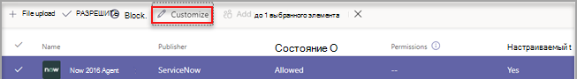
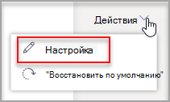
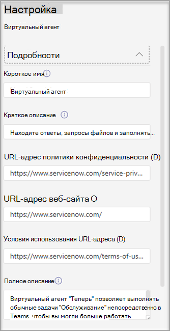
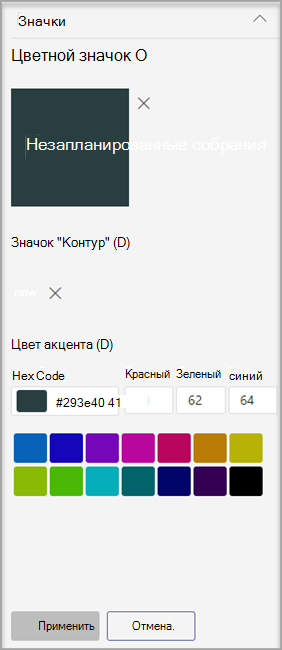
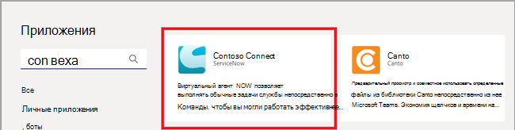
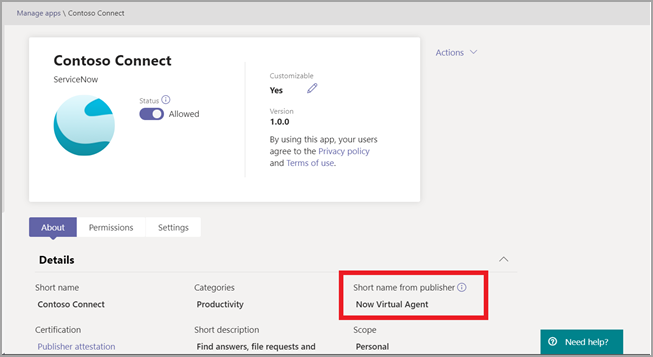
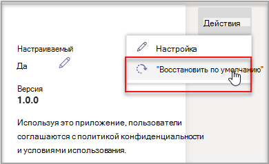

# Настройка внешнего вида приложений в магазине Teams вашей организации

Microsoft Teams позволяет администраторам настраивать приложение Teams, чтобы улучшить возможности магазина и использовать фирменную символику своей организации. Разработчик приложения может разрешить администратору Teams настраивать свое приложение. Затем можно обновить свойства приложения в соответствии с потребностями организации на странице "Управление приложениями" в Центре администрирования Teams. Можно настроить следующие элементы:

* Короткое имя
* Краткое описание
* Полное описание
* URL-адрес политики конфиденциальности
* URL-адрес веб-сайта
* URL-адрес условий использования
* Значок приложения
* Цвет контура значка
* Цвет выделения

Сведения о различных полях метаданных приложения см. в [схеме манифеста Teams](/microsoftteams/platform/resources/schema/manifest-schema) в документации разработчика.

> [!NOTE]
> Вы не можете настраивать неопубликованные приложения в любой организации. Вы не можете настроить любое приложение в облаках сообщества для государственных организаций высокого уровня защиты (GCCH) или в облаках Министерства обороны (DoD).

## Настройка сведений о приложении

Чтобы настроить приложение, выполните следующие действия:

1. Войдите в Центр администрирования Teams.

1. Разверните **Приложения Teams** и выберите **[Управление приложениями](https://admin.teams.microsoft.com/policies/manage-apps)**.

1. Проверьте столбец **Настраиваемое** в списке приложений и отсортируйте этот список по настраиваемым приложениям.

   

   Существует три точки входа для доступа к функции настройки:

   * Щелкните рядом с приложением, которое нужно настроить, а затем выберите **Настройка**.

     

   * Выберите имя приложения, а затем щелкните значок редактирования в режиме **настройки**.

     

   * Выберите имя приложения, щелкните **меню области переполнения**, наведите указатель мыши на **Действия** и выберите "Настроить".

     

1. Разверните раздел **Сведения** и настройте одно или несколько следующих полей. Отобразятся поля, назначаемые разработчиком как настраиваемые.

    * Короткое имя
    * Краткое описание
    * Полное описание
    * Веб-сайт
    * URL-адрес политики конфиденциальности
    * URL-адрес условий использования

   

1. Разверните раздел **Значок**.

1. Отправьте значок. Используйте один значок (192 x 192 пикселя) в формате PNG.

1. Выберите цвет контура значка. Используйте один прозрачный контур (32 x 32 пикселя) в формате PNG.

1. Выберите цвет выделения приложения, соответствующий значку.

   

1. После настройки приложения нажмите кнопку **Применить**.

1. Нажмите кнопку **Опубликовать**, чтобы опубликовать настроенное приложение.

   Теперь настроенное приложение отображается на странице **Управление приложениями**. Будет доступна только одна версия приложения, поскольку при настройке свойств приложения не создается его копия.

Теперь конечные пользователи Teams могут видеть настроенное приложение в своем клиенте.

   

Обратите внимание на следующие сведения о настройке приложения:

* При настройке приложений и описаний, связанных с приложениями, необходимо соблюдать правила настройки, если они предоставлены разработчиком приложения в документации или условиях использования. Вы также несете ответственность за соблюдение прав других пользователей в отношении любых сторонних изображений, которые вы можете использовать.

* Данные настройки, предоставленные администратором, хранятся в ближайшем регионе.

* Вы отвечаете за правильность ссылок на условия использования и политику конфиденциальности.

* Если разработчик приложения больше не разрешает настройку какого-либо поля, на странице сведений о приложении появится сообщение, уведомляющее администратора о полях, которые больше нельзя настраивать. Все изменения, внесенные в это поле, будут возвращены к исходным значениям.

* Рекомендуется протестировать изменения приложения в тестовом клиенте Teams перед применением этих изменений к рабочей среде.

* Распространение изменений фирменной символики для всех пользователей может занять до 24 часов.

* Чтобы приложение стало настраиваемым, разработчики могут предоставить новую версию приложения. Вы отправляете новую версию и удаляете предыдущую версию приложения. Если вы настроили приложение и опубликовали его, новое приложение, настроенное с помощью функции настройки приложения, не заменит текущее приложение.

* В [отчете об использовании приложения](teams-analytics-and-reports/app-usage-report.md) отображается исходное имя приложения, предоставленное издателем.

* В диалоговом окне согласия на разрешение Microsoft Graph отображается исходное имя приложения, указанное его издателем. Это помогает точно определить приложение при предоставлении ему разрешений.

## Проверка сведений о приложении

Может потребоваться просмотреть сведения о приложении для просмотра сведений.

1. Войдите в Центр администрирования Teams.

1. Разверните **Приложения Teams** и выберите **[Управление приложениями](https://admin.teams.microsoft.com/policies/manage-apps)**.

1. Выберите имя приложения.

1. Просмотрите сведения о приложении, включая исходное имя приложения в поле **Краткое имя, указанное издателем**.

   

   Поле **Краткое имя, указанное издателем** отображается только в случае, если вы изменили краткое имя приложения.

## Восстановление значений по умолчанию для сведений о приложении

Вы можете сбросить сведения о приложении до исходных значений, предоставленных разработчиком приложения. Этот параметр доступен только для настраиваемого приложения.

1. В Центре администрирования Teams откройте **Приложения Teams** > **[Управление приложениями](https://admin.teams.microsoft.com/policies/manage-apps)**.

1. Выберите имя приложения.

1. Выберите **Восстановить значения по умолчанию** в меню **Действия**.

   

## Связанная статья

* [Управление приложениями](manage-apps.md)
* [Настройка магазина приложений организации](customize-your-app-store.md)
* [Ребрендинг приложений](https://techcommunity.microsoft.com/t5/microsoft-teams-blog/rebrand-apps-to-your-own-organization-s-branding-with-app/ba-p/2376296)
