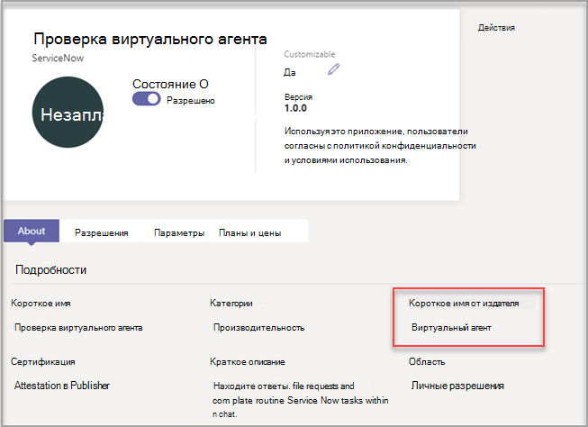

# Настройка приложений в Microsoft Teams

[!INCLUDE [preview-feature](includes/preview-feature.md)]

 Microsoft Teams позволяет настраивать приложения для улучшения работы Teams. Некоторые разработчики приложений позволяют администратору Teams настраивать приложение. Администратор может изменить свойства приложения в зависимости от потребностей организации на  странице "Управление приложениями" Центра администрирования Teams. Вы можете настроить такие сведения:

- Короткое имя
- Краткое описание
- Полное описание
- URL-адрес политики конфиденциальности
- URL-адрес веб-сайта
- Условия использования URL-адреса
- Значок цвета
- Значок "Контур"
- Цвет акцента

Подробные [сведения о настраиваемых](https://docs.microsoft.com/microsoftteams/platform/resources/schema/manifest-schema) полях см. в схеме манифеста Teams.

## Настройка сведений о приложении

Чтобы приступить к настройке приложения, выполните следующие действия:

1. Войдите в Центр администрирования Teams.
2. Раз **развернуть приложения Teams** и выбрать **"Управление приложениями".**
3. Проверьте **столбец "Настраиваемый"** в списке приложений и сортировать их по настраиваемым приложениям.

   

   Для настройки можно получить доступ к трем точкам входа:

   - Выберите приложение, которое вы хотите настроить, а затем выберите **"Настроить".**

     

   - Выберите имя приложения, а затем его **можно настроить.**

     

   - Выберите имя приложения, а затем в  **выпадаке** "Действия" выберите "Настроить".

     

4. Раз развернуть **раздел "Сведения"** и настроить следующие поля:

    - Короткое имя
    - Краткое описание
    - Полное описание
    - Веб-сайт
    - URL-адрес политики конфиденциальности
    - Условия использования URL-адреса

   

> [!Note]
> Будут видны только поля, которые разработчик приложения настроит.

5. **Разорите раздел "Значок".**

   а) Загрузите значок. Используйте один полноцветный значок (192x192) пикселя в формате PNG.

   б) Выберите цвет контура значка. Используйте один прозрачный контур (32x32) пикселя в формате PNG.

   в. Выберите цвет акцента приложения, который соответствует значку.

    

6. После настройки приложения выберите **"Применить".**

7. Выберите **"Опубликовать",** чтобы опубликовать настроенную приложение.

   Теперь настроенное приложение будет указано на странице **"Управление** приложениями". У вас будет только одна версия приложения, так как при настройке функций приложения его копия не создается.

Теперь конечные пользователи Teams могут открыть клиент Teams, чтобы увидеть настроенную приложение.

   

### Дополнительные факторы, которые следует учитывать при настройке приложения

Следующая заметка содержит важные сведения о настройке приложения.

> [!Note]
> - При настройке приложений и любых описаниях, связанных с приложением, соблюдайте правила настройки, предоставленные издателем приложения. Вы несете ответственность за соблюдение прав других лиц в отношении изображений сторонних организаций, которые вы можете использовать.
> - Данные настройки, предоставленные администратором, хранятся в Хранилище параметров ближайшего региона. Оно не обязательно в любом развертывании GoLocal Cloud Teams.
> - Вы несете ответственность за обеспечение действительности ссылок на условия использования или политику конфиденциальности. Необходимо обеспечить надлежащее управление изменениями метаданных приложений, которые они в них внести (или разрешить их внесение). Текущая реализация поможет вам вернуться к URL-адресам, предоставленным разработчиком. Вы не можете настроить приложение без URL-адреса (если приложение допускает настройку URL-адресов).
> - Если издатель приложения больше не позволяет настраивать поля, на странице сведений о приложении появляется сообщение с уведомлением администратора о полях, которые невозможно изменить. Все изменения, внесенные в поле, будут отменены с исходными значениями.
> - Для их изменения может потребоваться до 24 часов.

## Просмотр сведений о приложении

Чтобы просмотреть сведения о приложении, вам может потребоваться просмотреть сведения о приложении.

1. Войдите в Центр администрирования Teams.

2. Разверните раздел **Приложения Teams** и выберите **Управление приложениями**.

3. Выберите имя приложения.

4. Просмотр сведений о приложении, включая исходное имя приложения **Short name от издателя.**

   

   Короткое **имя в поле publisher** отображается только в том случае, если вы изменили краткое имя приложения.

## Сброс сведений о приложении до значения по умолчанию

Вы можете в любое время восстановить исходные параметры сведений о приложении.

1. Войдите в Центр администрирования Teams.

2. Раз **развернуть приложения Teams** и выбрать **"Управление приложениями".**

3. Выберите имя приложения.

4. В **выпадании "Действия" выберите** **"Восстановить** по умолчанию".

   

## Вопросы и ответы

**Сколько времени займет мой пользователь, чтобы увидеть настроенную приложение?**

Хотя администратор сразу же видит изменения в Центре администрирования Teams, на их просмотр пользователям может потребоваться до 24 часов.  

**Может ли поставщик приложения настроить приложение для своих клиентов?**

 Нет, администратору клиента необходимо настроить приложение для своего клиента с помощью Центра администрирования Teams.

**Будет ли настроенное приложение автоматически развернуто вместо текущего пользовательского приложения в клиенте?**

Нет, администраторам клиентов придется вручную удалить все настраиваемые приложения и опубликовать его настроенную версию. Если вы настроили приложение и опубликовали его как пользовательское приложение, новое приложение, настроенное с помощью функции настройки приложения, не заменит текущее пользовательское приложение.  

**Будут ли в отчете об использовании приложений также демонстрироваться настроенные значения, такие как настроенное краткое имя?**

 Нет, в отчете об использовании приложений по-прежнему будет по-прежнему видно исходное имя приложения, отправленного от издателя.

**Какие приложения можно настраивать с помощью функции настройки приложений?**

Вы можете настраивать только приложения, которые разрешено настраивать издателем приложения. Издателю приложения потребуется разрешить клиентам настраивать приложение.

**Будут ли настроенные свойства показываться на экране разрешения graph?**

Нет, на экране согласия по-прежнему будет отслано исходное значение, отправленного издателем.

## Связанная статья

- [Управление приложениями](manage-apps.md)
- [Настройка магазина приложений](customize-your-app-store.md)
