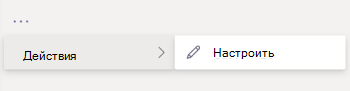

# Настройка приложений в Microsoft TeamsCustomize apps in Microsoft Teams

[!INCLUDE [preview-feature](includes/preview-feature.md)]

 Microsoft Teams позволяет настраивать приложения для улучшения работы Teams.Microsoft Teams provides app customization to enhance the Teams experience. Некоторые разработчики приложений позволяют администратору Teams настраивать приложение. Администратор может изменить свойства приложения в зависимости от потребностей организации на  странице "Управление приложениями" Центра администрирования Teams.Some app developers allow an app to be customized by the Teams admin. The admin can customize or rebrand the app properties based on the organizational needs using the Teams admin center **Manage apps** page. Вы можете настроить такие сведения:The details you can customize are:

- Короткое имяShort name
- Краткое описаниеShort description
- Полное описаниеFull description
- URL-адрес политики конфиденциальностиPrivacy policy URL
- URL-адрес веб-сайтаWebsite URL
- Условия использования URL-адресаTerms of use URL
- Значок цветаColor icon
- Значок "Контур"Outline icon
- Цвет акцентаAccent color

Подробные [сведения о настраиваемых](https://docs.microsoft.com/microsoftteams/platform/resources/schema/manifest-schema) полях см. в схеме манифеста Teams.See the [Teams Manifest schema](https://docs.microsoft.com/microsoftteams/platform/resources/schema/manifest-schema) for details about the fields that you can customize.

> [! Примечание. Настройка приложений в настоящее время не поддерживается в GCCH и Department of Defense (DoD).[!NOTE Customizing apps isn't supported in Government Community Cloud High (GCCH) or Department of Defense (DoD) at this time.

## Настройка сведений о приложенииCustomize the app's details

Чтобы приступить к настройке приложения, выполните следующие действия:To start customizing an app, complete the following steps:

1. Войдите в Центр администрирования Teams.Sign in to the Teams admin center.
2. Раз **развернуть приложения Teams** и выбрать **"Управление приложениями".**Expand **Teams Apps** and select **Manage apps**.
3. Проверьте **столбец "Настраиваемый"** в списке приложений и сортировать их по настраиваемым приложениям.Check the **Customizable** column of the apps list and sort by apps that are customizable.

   

   Для настройки можно получить доступ к трем точкам входа:There are three entry points to access the customize feature:

   - Выберите приложение, которое вы хотите настроить, а затем выберите **"Настроить".**Select next to the app that you want to customize, and then select **Customize**.

     

   - Выберите имя приложения, а затем его **можно настроить.**Select the app name and then **Customizable**.

     

   - Выберите имя приложения, а затем в  **выпадаке** "Действия" выберите "Настроить".Select the app name, and then select **Customize** from the **Actions** dropdown.

     

4. Раз развернуть **раздел "Сведения"** и настроить следующие поля:Expand the **Details** section and customize the following fields:

    - Короткое имяShort name
    - Краткое описаниеShort description
    - Полное описаниеFull description
    - Веб-сайтWebsite
    - URL-адрес политики конфиденциальностиPrivacy policy URL
    - Условия использования URL-адресаTerms of use URL

   

> [!Note]
> Будут видны только поля, которые разработчик приложения настроит.Only the fields that the app developer has assigned as customizable will be visible.

5. **Разорите раздел "Значок".**Expand the **Icon** section.

   а)a. Загрузите значок.Upload an icon. Используйте один полноцветный значок (192x192) пикселя в формате PNG.Use one full-color icon (192x192) pixel in PNG format.

   б)b. Выберите цвет контура значка.Choose an icon outline color. Используйте один прозрачный контур (32x32) пикселя в формате PNG.Use one transparent outline (32x32) pixel in PNG format.

   в.c. Выберите цвет акцента приложения, который соответствует значку.Select an app accent color that matches the icon.

    

6. После настройки приложения выберите **"Применить".**Once your app has been customized, select **Apply**.

7. Выберите **"Опубликовать",** чтобы опубликовать настроенную приложение.Select **Publish** to publish the customized app.

   Теперь настроенное приложение будет указано на странице **"Управление** приложениями".The customized app is now listed in your **Manage apps** page. У вас будет только одна версия приложения, так как при настройке функций приложения его копия не создается.You'll have only one version of the app, since customizing the app features doesn't create a copy of the app.

Теперь конечные пользователи Teams могут открыть клиент Teams, чтобы увидеть настроенную приложение.Now your Teams end users can open their Teams client to see the customized app.

   

### Особые моменты при настройке приложенияSpecial considerations for customizing an app

Следующая заметка содержит важные сведения о настройке приложения.The following note includes important details about customizing an app.

> [!Note]
> - При настройке приложений и любых описаниях, связанных с приложением, соблюдайте правила настройки, если они указаны издателем в документации или условиях использования приложения.When you customize apps, and any description related to an app, ensure that you follow any customization guidelines if provided by the app publisher in their documentation or terms of use. Вы также несете ответственность за соблюдение прав других лиц в отношении изображений сторонних организаций, которые вы можете использовать.You're also responsible for respecting the rights of others regarding any third-party images you might use.
> - Данные настройки, предоставленные администратором, хранятся в ближайшем регионе.Admin-provided customization data is stored in the nearest region.
> - Вы несете ответственность за обеспечение действительности ссылок на условия использования или политику конфиденциальности.You are responsible for ensuring that links to terms of use or privacy policy are valid.
> - Если издатель приложения больше не позволяет настраивать поля, на странице сведений о приложении появляется сообщение с уведомлением администратора о полях, которые невозможно изменить.In case the app publisher no longer allows a field to be customizable, a message appears on the app details page notifying the admin about the fields that can't be customized any longer. Все изменения, внесенные в поле, будут отменены с исходными значениями.All the changes made to that field will be reverted to the original values.
> - На их просмотр пользователям может потребоваться до 24 часов.Changes to branding might require up to 24 hours for the users to see the changes.

## Просмотр сведений о приложенииReview app details

Чтобы просмотреть сведения о приложении, вам может потребоваться просмотреть их.You might want to see the app details to review the information.

1. Войдите в Центр администрирования Teams.Sign in to the Teams admin center.

2. Разверните раздел **Приложения Teams** и выберите **Управление приложениями**.Expand **Teams apps** and select **Manage apps**.

3. Выберите имя приложения.Select the app name.

4. Просмотр сведений о приложении, включая исходное имя приложения **Short name от издателя.**View the app details, including the original app name **Short name from publisher**.

   

   Краткое **имя в поле publisher** отображается только в том случае, если вы изменили краткое имя приложения.The **Short name from publisher** field is only visible if you've changed the app's short name.

## Сброс сведений о приложении до значения по умолчаниюReset app details to default

Вы можете в любое время восстановить исходные параметры сведений о приложении.At any time, you can reset the app details to the original settings.

1. Войдите в Центр администрирования Teams.Sign in to the Teams admin center.

2. Раз **развернуть приложения Teams** и выбрать **"Управление приложениями".**Expand **Teams Apps** and select **Manage apps**.

3. Выберите имя приложения.Select the app name.

4. В **выпадании "Действия" выберите** **"Восстановить** по умолчанию".Select **Reset to default** from the **Actions** dropdown.

   

## Вопросы и ответыFrequently asked questions

**Сколько времени займет мой пользователь, чтобы увидеть настроенную приложение?****How long will it take for my users to see the customized app?**

Хотя администратор сразу же видит изменения в Центре администрирования Teams, на их просмотр пользователям может потребоваться до 24 часов.Although the admin can immediately see the changes in Teams Admin Center, it might take up to 24 hours for the end users to see the changes.  

**Может ли поставщик приложения настроить приложение для своих клиентов?****Can the app provider customize the app for its customers?**

 Нет, администратору клиента необходимо настроить приложение для своего клиента с помощью Центра администрирования Teams.No, the admin of a tenant needs to customize the app for their tenant using the Teams Admin Center.

**Будет ли настроенное приложение автоматически развернуто вместо текущего пользовательского приложения в клиенте?****Will the customized app automatically get deployed to replace my current custom app in a tenant?**

Нет, администраторам клиентов придется вручную удалить все настраиваемые приложения и опубликовать его настроенную версию.No, the tenant admins will have to manually remove any custom app and publish the customized version of the app. Если вы настроили приложение и опубликовали его как пользовательское приложение, новое приложение, настроенное с помощью функции настройки приложения, не заменит текущее пользовательское приложение.If you have customized an app and published it as a custom app, the new app customized using the app customization feature won't replace the current custom app.  

**Будут ли в отчете об использовании приложений также демонстрироваться настроенные значения, такие как настроенное краткое имя?****Will the app usage report also show the customized values such as customized short name?**

 Нет, в отчете об использовании приложений по-прежнему будет по-прежнему видно исходное имя приложения, отправленного от издателя.No, the app usage report will still show the original name of the app sent from the publisher.

**Какие приложения можно настраивать с помощью функции настройки приложений?****Which apps can I customize using the app customization feature?**

Вы можете настраивать только приложения, которые разрешено настраивать издателем приложения.You can only customize apps that have been allowed to be customizable by the app publisher. Издателю приложения потребуется разрешить клиентам настраивать приложение.The app publisher will need to opt in to allow its customers to customize the app.

**Будут ли настроенные свойства показываться на экране разрешения graph?****Will the customized properties show up on the graph permission consent screen?**

Нет, на экране согласия по-прежнему будет отслано исходное значение, отправленного издателем.No, the permission consent screen will still show the original value sent by the publisher.

## Связанная статьяRelated article

- [Управление приложениямиManage apps](manage-apps.md)
- [Настройка магазина приложенийCustomize your app store](customize-your-app-store.md)
