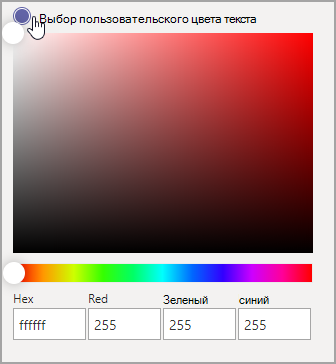
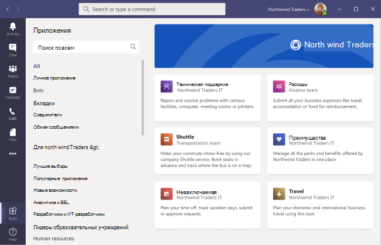

# Настройка магазина приложений организации в Microsoft Teams

Теперь вы можете настроить магазин приложений организации в Teams с использованием фирменной символики вашей компании, добавив логотип, настраиваемые фоновые изображения и настраиваемые цвета текста, чтобы сделать его более привлекательным для конечных пользователей.

> [!NOTE]
> Чтобы изменения фирменной символики вступили в силу, может потребоваться до 24 часов.

Вы можете получить доступ к настроенному магазину в Центре администрирования, выбрав **Приложения Teams** > **Настройка магазина**.

  

В этой статье описываются функции настраиваемого магазина приложений и способы их использования.

## Настройка логотипа организации

<!-- Bookmark used by Context Sensitive Help (CSH). Do not delete. -->

<!-- Do not remove the bookmark link above. -->

Здесь вы можете отправить логотип организации. Выбранный логотип появится в клиенте Teams на странице **Приложения** > **Создано для вашего клиента**.

Щелкнув параметр **Выберите изображение**, вы можете отправить выбранный вами файл. Логотип должен быть размером 240x60, или он будет масштабирован до этого размера. Он не должен превышать 5 МБ. Поддерживаемые форматы: SVG, PNG и JPG.

Логотип отображается в правом верхнем углу каталога приложений клиента в магазине Teams.

## Настройка мелкой эмблемы

<!-- Bookmark used by Context Sensitive Help (CSH). Do not delete. -->

<!-- Do not remove the bookmark link above. -->

Логотип вашей организации или мелкая эмблема — это изображение или символ, который представляет фирменную символику организации и не содержит название компании. Значок сердца поможет участникам команды определить магазин приложений. Выбранный логотип появится в клиенте Teams на странице "Приложения".

Щелкните параметр **Выберите изображение** и отправьте выбранный вами файл. Используйте разрешение логотипа до 32x32 пикселя, или оно будет понижено до этого разрешения. Используйте файл размером не более 5 МБ. Поддерживаемые форматы: SVG, PNG и JPG.

Магазин Teams отображает логотип рядом с разделом **Создано для вашего клиента**.

## Настройка цвета фона

<!-- Bookmark used by Context Sensitive Help (CSH). Do not delete. -->

<!-- Do not remove the bookmark link above. -->

Фон должен достаточно контрастировать с текстом, чтобы пользователи могли легко читать текст. Фон будет отображаться в клиенте Teams в разделе **Приложение** > **Создано для вашего клиента**.

Доступные варианты:

* Использовать фон стандартной темы клиента Teams
* Выберите изображение. При выборе фонового изображения вы можете отправить выбранный вами файл. Фон должен быть размером 1212x100 пикселей, или он будет масштабирован до этого размера. Он не должен превышать 5 МБ. Поддерживаемые форматы: SVG, PNG и JPG.
* Выбор пользовательского фона. Если вы нажмете **Выбор пользовательского цвета**, откроется палитра. Выберите нужный цвет, изменив масштаб палитры.

Фоновое изображение или цвет используется в качестве фона для верхнего баннера в каталоге приложений клиента Teams.

## Настройка цвета текста вашего имени

<!-- Bookmark used by Context Sensitive Help (CSH). Do not delete. -->

<!-- Do not remove the bookmark link above. -->

Обеспечьте достаточный контраст между цветом текста и фоном, чтобы пользователи могли легко прочитать название вашей организации. Текст отображается в клиенте Teams в разделе **Приложения** > **Создано для вашего клиента**.

Если вы нажмете **Выбор пользовательского цвета**, откроется палитра. Выберите нужный цвет, изменив масштаб палитры.

 

## Завершение настройки магазина приложений Teams

Завершив настройку магазина приложений, нажмите **Сохранить**, чтобы сохранить изменения.
Чтобы просмотреть изменения, выберите **Предварительный просмотр магазина приложений**, чтобы увидеть представление настроенного магазина приложений.

> [!NOTE]
> Представление может отличаться от окончательной версии настроенного магазина приложений, так как некоторые стандартные цвета зависят от версии клиента Teams пользователей.
