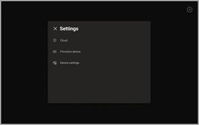
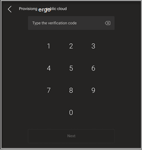
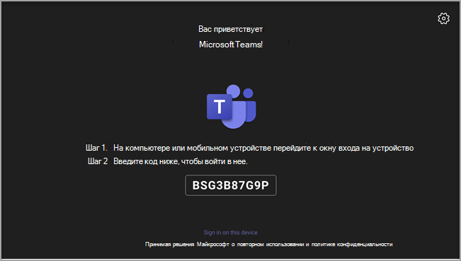
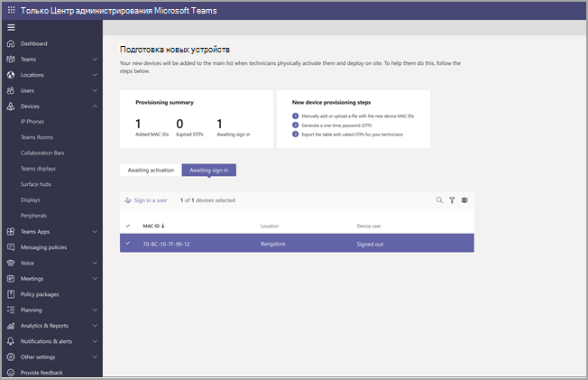
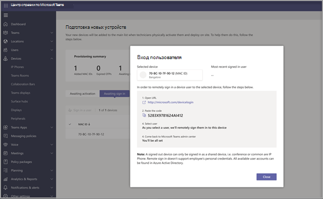

# Удаленная подготовка и вход для устройств Android в Teams

ИТ-администраторы могут удаленно подготавливать и входить на устройство Teams Android. Чтобы подготовить устройство удаленно, администратору необходимо передать MAC-идентификаторы подготавливаемых устройств и создать код проверки. Весь процесс можно завершить удаленно из Центра администрирования Teams.

## Просмотр поддерживаемых устройств

В следующем списке показаны требования к встроенномУ ПО устройства Android.

|Категория устройства|Модель устройства|Версия встроенного ПО|
|---|---|---|
|Телефоны Teams|Yealink T55/T56/T58|58.15.0.124|
|Телефоны Teams|Yealink VP59|91.15.0.58|
|Телефоны Teams|Yealink CP960|73.15.0.117|
|Телефоны Teams|Yealink MP56/MP54/MP58|122.15.0.36|
|Телефоны Teams|UC-2 в КХЛ|1.0.3.52|
|Телефоны Teams|Poly Многоайтовая C60|7.0.2.1071|
|Телефоны Teams|CCX400/CCX500/CCX600 |7.0.2.1072|
|Телефоны Teams|Аудиозаписи C448HD/C450HD/C470HD|1.10.120|
|Панели Teams|770.07.1070|1.004.0115|
|Комнаты Teams Android|Logitech Rally Bar Mini|1.2.982|
|Комнаты Teams Android|Logitech Rally Bar|1.2.982|
|Комнаты Teams Android|AudioCodes RXV80|1.13.361|
|Комнаты Teams Android|EPOS EXPAND Vision 3T|1.2.2.21182.10|
|Комнаты Teams Android|Yealink MeetingBar A30|133.15.0.60|
|Комнаты Teams Android|Yealink MeetingBar A20|133.15.0.60|
|Комнаты Teams Android|Сенсорная консоль Yealink CTP18|137.15.0.37|
|Комнаты Teams Android|Poly Studio X30|3.5.0.344025|
|Комнаты Teams Android|Poly Studio X50|3.5.0.344025|
|Комнаты Teams Android|Сенсорная консоль Poly TC8 |3.5.0.210489|
|Комнаты Teams Android|Yealink VC210|118.15.0.54|

## Добавление MAC-адреса устройства

Выполните следующие действия, чтобы подготовить новое устройство.

1. Войдите в Центр администрирования Teams.
2. **Разверните устройства Teams**.
3. Выберите **"Подготовка нового устройства" на** **вкладке "Действия** ".

В **окне "** Подготовка новых устройств" можно добавить MAC-адрес вручную или отправить файл.

### Добавление MAC-адреса устройства вручную

1. На **вкладке "Ожидание активации** " выберите **"Добавить MAC-идентификатор"**.

   

1. Введите MAC-идентификатор.
1. Введите расположение, которое поможет техническим специалистам определить, где установить устройства.
1. По **завершении нажмите кнопку "** Применить".

### Отправка файла для добавления MAC-адреса устройства

1. На **вкладке "Ожидание активации** " выберите **"Отправить MAC-идентификаторы"**.
2. Скачайте шаблон файла.
3. Введите MAC-идентификатор и расположение, а затем сохраните файл.
4. **Выберите файл** и нажмите кнопку " **Отправить"**.

## Создание кода проверки

Вам потребуется код проверки для устройств. Код проверки создается массово или на уровне устройства и действителен в течение 24 часов.

1. На **вкладке "Ожидание активации** " выберите существующий MAC-идентификатор.
   Пароль создается для MAC-адреса и отображается в столбце **"Код проверки** ".

2. Предоставьте список mac-идентификаторов и кодов проверки для технических специалистов по полю. Вы можете экспортировать сведения непосредственно в файл и поделиться файлом с техническим специалистом, который выполняет фактическую установку.

## Подготовка устройства

Когда устройство включено и подключено к сети, технический специалист подготавливает устройство. Эти действия выполняются на устройстве Teams.

1. Технический специалист выбирает **"Подготовка устройства** " в **разделе "Параметры"**.  

   
  
2. Технический специалист вводит код проверки для конкретного устройства в предоставленном поле ввода.

   

   После успешной подготовки устройства на странице входа появится имя клиента.

   

## Первый удаленный вход

Подготовленное устройство отображается на вкладке **"Ожидание входа** ". Запустите процесс удаленного входа, выбрав отдельное устройство.

1. Выберите устройство на вкладке **"Ожидание входа** ".

   

2. Следуйте инструкциям в **разделе "Вход пользователя**" и нажмите кнопку " **Закрыть"**.

   

## Статьи по теме

- [Управление устройствами в Teams](device-management.md)
- [Удаленный вход и выход](remote-sign-in-and-sign-out.md)
- [Удаленное обновление устройств Teams](remote-update.md)
