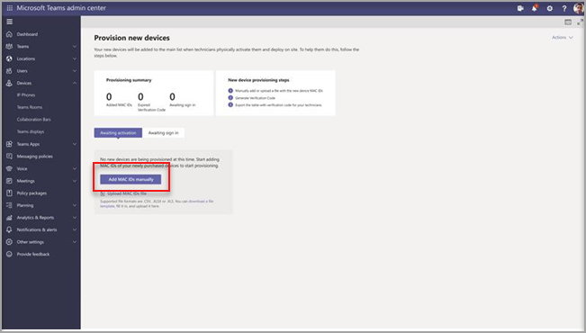

# Удаленная подготовка и вход для устройств с Android в Teams

ИТ-администраторы могут удаленно подавка и вход на устройство с Android в Teams. Чтобы подготовка устройства была удаленной, администратор должен отправить их коды MAC и создать код проверки. Весь процесс можно завершить удаленно из Центра администрирования Teams.

## Просмотр поддерживаемых устройств

В следующем списке показаны требования к устройству с Android.

|Категория устройств|Модель устройства|Версия с программным пошивом|
|-|-|-|
|Телефоны Teams|Yealink T55/T56/T58|58.15.0.124|
|Телефоны Teams|Yealink VP59|91.15.0.58|
|Телефоны Teams|Yealink CP960|73.15.0.117|
|Телефоны Teams|Yealink MP56/MP54/MP58|122.15.0.36|
|Телефоны Teams|Воронова UC-2|1.0.3.52|
|Телефоны Teams|  Poly Trio C60|  7.0.2.1071|
|Телефоны Teams|  CCX400/CCX500/CCX600    |7.0.2.1072|
|Телефоны Teams|  Audio Codes C448HD/C450HD/C470HD|   1.10.120|

## Добавление адреса MAC устройства

Выполните следующие действия, чтобы подвести новое устройство.

1. Войдите в Центр администрирования Teams.
2. Развернуть **устройства**.
3. На **вкладке Действия выберите** Подготовка **нового** устройства.

В **окне Подготовка новых устройств** можно добавить адрес MAC вручную или отправить файл.

### Добавление адреса MAC устройства вручную

1. На **вкладке Ожидание активации** выберите **Добавить mac ID**.

   

1. Введите mac ID.
1. Введите расположение, которое поможет техническим специалистам определить, где установить устройства.
1. По **завершению** выберите Применить.

### Добавление файла для добавления адреса MAC устройства

1. На **вкладке Ожидание активации** выберите **Отправить mac IDs**.
2. Скачайте шаблон файла.
3. Введите mac ID и расположение, а затем сохраните файл.
4. **Выберите файл** и выберите **Отправить**.

## Создание проверочных кодов

Вам потребуется код проверки для устройств. Код проверки создается массово или на уровне устройства и действителен в течение 24 часов.

1. На **вкладке Ожидание активации** выберите существующий ИД MAC.
   Пароль создается для адреса MAC и отображается в столбце **Код проверки.**

2. Предофератирует технических специалистов по полю список кодов MAC и кодов проверки. Вы можете экспортировать подробности непосредственно в файл и поделиться им с техническим специалистом, который фактически работает над установкой.

## Подготовка устройства

Когда устройство подключено и подключено к сети, специалист под его подготовка. Эти действия будут выполнены на устройстве Teams.

1. Специалист выбирает устройство **подготовка в** **параметрах**.  

   
  
2. Специалист вводит код проверки для конкретного устройства в предоставленное поле ввода.

   

   После успешной подготовка устройства на странице для регистрации появится имя клиента.

   

## Удаленный вход

Устройство появится на вкладке **Ожидается** вход. Начните удаленный вход, выбрав отдельное устройство.

1. Выберите устройство на вкладке **Ожидается** вход.

   

2. Следуйте инструкциям в **оке Вход пользователя**, а затем выберите **Закрыть**.

   

## Связанная статья

- [Управление устройствами в Teams](device-management.md)
- [Удаленное обновление устройств Teams](remote-update.md)
