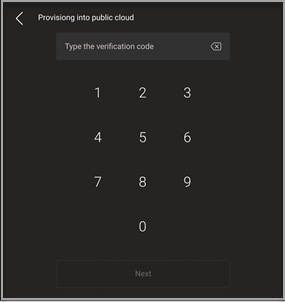

# Удаленная подготовка и вход в Teams для устройств с Android

ИТ-администраторы могут удаленно подаять и войти в Teams на устройстве с Android. Чтобы можно было создавать устройства удаленно, администратор должен отправить их коды MAC и создать код проверки. Весь процесс можно завершить удаленно из Центра администрирования Teams.

## Просмотр поддерживаемых устройств

В следующем списке показаны требования к устройству с Android.

|Категория устройства|Модель устройства|Версия по пошива|
|-|-|-|
|Телефоны Teams|Yealink T55/T56/T58|58.15.0.124|
|Телефоны Teams|Yealink VP59|91.15.0.58|
|Телефоны Teams|Yealink CP960|73.15.0.117|
|Телефоны Teams|Yealink MP56/MP54/MP58|122.15.0.36|
|Телефоны Teams|Окаймл UC-2|1.0.3.52|

## Добавление адреса MAC устройства

Выполните следующие действия, чтобы подготовка нового устройства.

1. Войдите в Центр администрирования Teams.
2. "Развернуть **устройства".**
3. Выберите **"Подготовка нового устройства" на** вкладке **"Действия".**

В **окне "Подготовка** новых устройств" можно добавить адрес MAC вручную или отправить файл.

### Добавление адреса MAC устройства вручную

1. На вкладке **"Ожидание активации"** выберите **"Добавить ИД MAC".**

   

1. Введите mac ID.
1. Введите расположение, которое помогает техническим специалистам определить, где установить устройства.
1. Выберите **"Применить** по завершению".

### Отправка файла для добавления адреса MAC устройства

1. На вкладке **"Ожидание активации"** выберите **"Отправить ИД MAC".**
2. Скачайте шаблон файла.
3. Введите ИД MAC и его расположение, а затем сохраните файл.
4. **Выберите файл,** а затем выберите **"Отправить".**

## Создание проверочных кодов

Вам потребуется провероный код для устройств. Код проверки создается массово или на уровне устройства и действителен в течение 24 часов.

1. На **вкладке "Ожидание активации"** выберите существующий ИД MAC.
   Пароль создается для адреса MAC и отображается в столбце **"Код проверки".**

2. Предоставить список кодов MAC и кодов проверки техническим специалистам по полям. Вы можете экспортировать информацию непосредственно в файл и поделиться файлом с техническим специалистом, который фактически работает над установкой.

## Подготовка устройства

Когда устройство работает и подключено к сети, технические специалисты его подавют. Эти действия выполнены на устройстве Teams.

1. Специалист выбирает устройство **в** **параметрах.**  

   
  
2. Специалист вводит код проверки для конкретного устройства в предоставленное поле ввода.

   

   После успешной подготовка устройства на странице регистрации появится имя клиента.

   

## Удаленный вход

Это устройство появится на вкладке **"Ожидание".** Начните удаленный вход, выбрав отдельное устройство.

1. Выберите устройство на вкладке **"Ожидание".**

   

2. Следуйте инструкциям при входе **пользователя, а** затем выберите **"Закрыть".**

   

## Связанная статья

- [Управление устройствами в Teams](device-management.md)
- [Удаленное обновление устройств Teams](remote-update.md)
