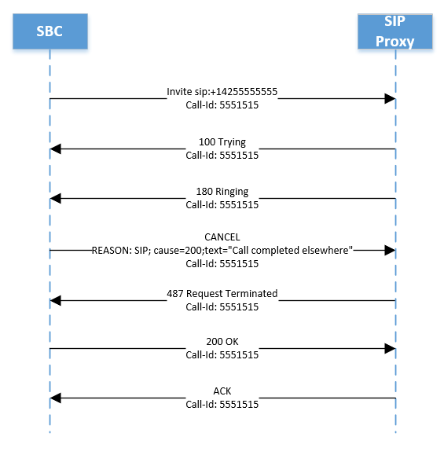

# Управление уведомлениями о звонках

В этой статье описано, как управлять уведомлениями о звонках для пользователей прямой маршрутии. Конечные точки звонка можно настроить как для Teams, так и для сторонней частной ветви Exchange (УАКС) или контроллера границы сеанса (SBC). Эта настройка удобна, например, если вы хотите одновременно отправить звонок на мобильные и настольные телефоны пользователя.   

На следующей схеме У Ирены есть две конечные точки:

- A Teams конечной точки
- Телефон SIP, подключенный к стороне SBC

Когда поступает звонок, SBC разнонаправка звонка между Direct Routing и сторонним SBC.

Если звонок принимается на fork 2 (сторонним SBC), Teams создает уведомление о пропущенных звонках.  

Вы можете отключить уведомление "Пропущенный звонок", настроив SBC для отправки отмены в fork 1 следующим образом:

ПРИЧИНА: SIP; cause=200;text"Звонок завершен в другом месте" 

Звонок не будет зарегистрирован в записях подробных Teams телефонная система как успешный звонок. Звонок будет зарегистрирован как "Попытка" с итоговым кодом SIP "487", итоговым подкодомом Майкрософт "540200" и фразой кода SIP "Звонок выполнен в другом месте".  (Чтобы просмотреть записи о звонках, перейдите в Центр администрирования Teams -> **Аналитика** ->  и ОтчетыИспользование отчетов и выберите Использование **ОКП**.)

На приведенной ниже схеме показано, как выглядит SIP для Fork 1, объясняется поток зова и ожидаемая ПРИЧИНА в сообщении об отмене. 

