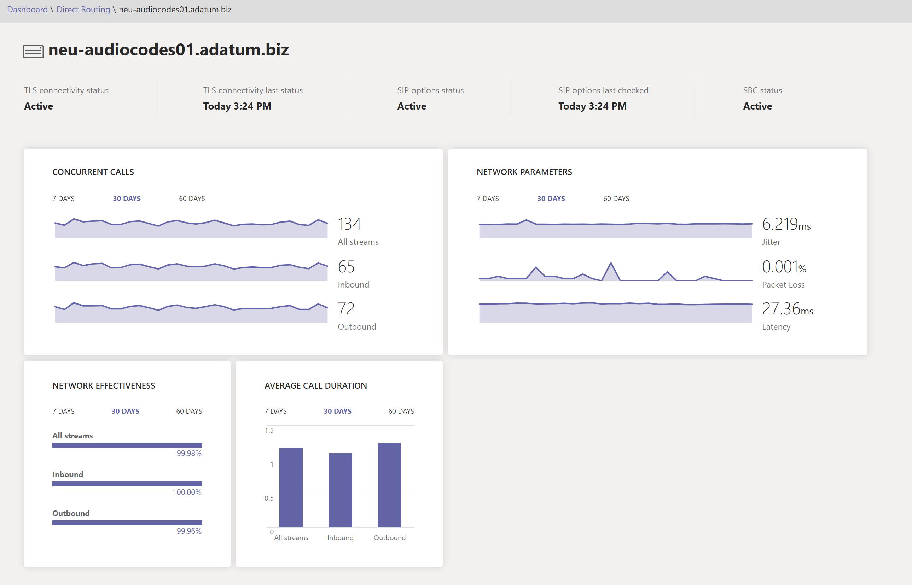

# Панель мониторинга состояния для прямой маршрутии

Панель мониторинга состояния для прямой маршрутии позволяет отслеживать подключение между контроллером границы сеанса (SBC) и интерфейсом прямой маршрутии.  С помощью панели мониторинга здоровья можно отслеживать сведения о SBC, телефонной службе и сетевых параметрах между SBC и интерфейсом прямой маршрутии. Эти сведения помогут вам выявить проблемы, в том числе причину сброшенных звонков. Например, SBC может прекратить отправку звонков, если истек срок действия сертификата на SBC или есть проблемы с сетью. Чтобы [узнать, у кого](using-admin-roles.md) есть доступ к панели мониторинга здоровья, см. роли администраторов.

Панель мониторинга состояния отслеживает два уровня информации:

- Общее состояние подключенных SBCs
- Подробные сведения о подключенных SBCs

Вы можете просмотреть панель мониторинга здоровья в Microsoft Teams и Skype для бизнеса центре администрирования.

## Общее состояние

Панель мониторинга состояния содержит следующую информацию, связанную с общим состоянием подключенных SBCs:

 

- **Сводка по прямой маршрутике—** общее количество SBCs, зарегистрированных в системе. Регистрация означает, что администратор клиента добавил SBC с помощью команды New-CsOnlinePSTNGateway клиента. Если SBC был добавлен в PowerShell, но не подключен, на панели мониторинга состояния "Здоровье" она имеет неработоспособное состояние.

- **SBC** — FQDN сопряженного SBC.

- **Отношение эффективности сети (NER). NER** измеряет возможность сети принимать звонки, измерив количество звонков и число звонков, доставленных получателю.  

   NER измеряет возможность сетей доставлять звонки на конечный терминал, исключая действия пользователей, которые вызывают отклонение звонков.  Если получатель отклонил звонок или отправил звонок на голосовую почту, звонок считается успешной доставкой. Это означает, что ответное сообщение, сигнал занятости или звонок без ответа считаются успешными.
  
   Например, предположим, что прямая маршрутизации отправила звонок на SBC, а SBC возвращает код SIP "504 Server Time-out- The server attempted to access another server in attempting to process the request and did not receive a prompt response". Этот ответ указывает на то, что на стороне SBC есть проблема, и это уменьшит число NER на панели мониторинга здравоохранения для этого SBC.
  
   Так как действия, которые вы принимаете, зависят от количества звонков, на панели мониторинга состояния показано, сколько звонков было проанализировано для вычисления параметра. Если число звонков меньше 100, то NER может быть довольно низким, но по-прежнему обычным.

   Для вычисления NER используется формула:

   NER = 100 x (ответы на звонки + Пользователь занят + Звонок без ответа + Отклонение терминала)/Total Calls

- **Средняя длительность звонка:** сведения о средней длительности звонков помогают отслеживать качество звонков. Средняя длительность звонка по 1:1 по ДНР составляет от четырех до пяти минут.  Однако для каждой компании это среднее значение может отличаться.  Корпорация Майкрософт рекомендует создать базовый план для средней длительности звонка для вашей компании. Если этот параметр значительно меньше базового плана, это может означать, что у ваших пользователей возникли проблемы с качеством и надежностью звонка и они свисают раньше обычного. Если вы начнете видеть очень низкую среднюю продолжительность звонка(например, 15 секунд), звонящие могут быть неавтратно из-за низкой надежности работы службы.

   Так как действия, которые вы принимаете, зависят от количества звонков, на панели мониторинга состояния показано, сколько звонков было проанализировано для вычисления параметра.

- **Состояние подключения TLS:** подключение TLS (TLS— безопасность уровня транспорта) показывает состояние подключений TLS между direct Routing и SBC. Панель мониторинга состояния также анализирует дату окончания срока действия сертификата и предупреждает о том, что срок действия сертификата истекает в течение 30 дней, чтобы администраторы могли продлить его до нарушения работы службы.

   Щелкнув предупреждающее сообщение, вы увидите подробное описание проблемы во всплывающее окно справа и рекомендации по ее устранению.

- **Состояние параметров SIP.** По умолчанию SBC каждую минуту отправляет сообщения о параметрах. Эта конфигурация может отличаться для разных поставщиков SBC. Прямая маршрутия предупреждает о том, что параметры SIP не отправлены или не настроены. Дополнительные сведения о мониторинге параметров SIP и условиях, когда SBC можно пометить как нефункциональный, см. в этой [статьи.](direct-routing-monitor-and-troubleshoot.md)

- Подробное состояние параметров **SIP.** Помимо того, что в потоке параметров SIP есть проблема, на панели мониторинга состояния также приводится подробное описание ошибок. Чтобы получить доступ к описанию, щелкните сообщение "Предупреждение". Во всплывающее окно справа будет покажите подробное описание ошибки.

   Возможные значения для сообщений о состоянии параметров SIP:

    - Активен — SBC активен. Служба прямой маршрутичности Майкрософт видит параметры, которые вытекают из регулярного интервала.

    - Предупреждение. Параметры SIP не доступны: в базе данных есть контроллер границы сеанса (администратор создал его с помощью команды New-CsOnlinePSTNGateway). Она настроена для отправки параметров SIP, но служба прямой маршрутии никогда не видели параметры SIP, исходяющие из этого SBC.

    - Предупреждение: сообщения SIP не настроены: мониторинг на ленте с помощью параметров SIP не включен. В системе звонков Майкрософт используются параметры SIP и контроль за рукопожатием TLS для определения состояния подключенных контроллеров границ сеанса (SBCs) на уровне приложения. У вас возникнут проблемы, если этот уровень связи будет достигнут на уровне сети (с помощью ping), но срок действия сертификата истек или Скайп SIP не работает. Чтобы помочь выявить такие проблемы на ранней стадии, Корпорация Майкрософт рекомендует отправлять параметры SIP. Проверьте документацию производителя SBC, чтобы настроить параметры отправки SIP.

- **Пропускная способность** для одновременной обработки звонков. Вы можете указать ограничение на количество одновременно обрабатываемых SBC звонков с помощью команды New- или Set-CsOnlinePSTNGateway с параметром -MaxConcurrentSessions. Этот параметр вычисляет количество звонков, отправленных или полученных с помощью прямой маршрутии с помощью определенного SBC, и сравнивает его с установленным ограничением. Примечание. Если SBC также обрабатывает звонки на разные УАКС, этот номер не будет показывать фактические вызовы одновременно.

## Подробные сведения для каждого SBC

Вы также можете просмотреть подробные сведения о конкретном SBC, как показано на снимке экрана:

В подробном представлении показаны следующие дополнительные параметры:

- **Состояние подключения TLS —** это та же метрика, что и на странице "Общее состояние";

- **Последнее состояние подключения TLS —** время, когда SBC сделал подключение TLS к службе Direct Routing;

- **Состояние параметров SIP** — та же метрика, что и на странице "Общее состояние".

- **Параметры SIP в последний раз проверялись** — время последнего выбора параметров SIP.

- **Состояние SBC** — общее состояние SBC на основе всех отслеживаемого параметра.

- **Один и тот же звонок**— показывает, сколько звонков одновременно обрабатывает SBC. Эти сведения полезны для предсказания количества нужных каналов и увидеть тенденцию. Вы можете продвиньте данные по количеству дней и направлению звонка (входящие, исходящие/все потоки).

- **Параметры сети:** все сетевые параметры измеряются от интерфейса прямой маршрутии до контроллера границы сеанса. Сведения о рекомендуемых значениях см. в Microsoft Teams сети организации и на сайте Customer Edge Microsoft Edge рекомендуемых значений.

   - Дрожание — это миллисекундный показатель разброса времени задержки распространения сети, вычисляемого между двумя конечными точками с помощью RTCP (RTP-протокола).

   - Packet Loss — это мера пакетов, которые не удалось получить; вычисляется между двумя конечными точками.

   - Задержка (или время кругового пути) — это время, необходимое для сигнала, а также длительность его подтверждения. Эта задержка состоит из времени распространения между двумя точками сигнала.

   Вы можете продвиньте данные по количеству дней и направлению звонка (входящие, исходящие/все потоки).

**Отношение эффективности** сети — это тот же параметр, который отображается на панели мониторинга "Общее состояние", но с возможностью срезов данных по рядам времени или направлению вызова.