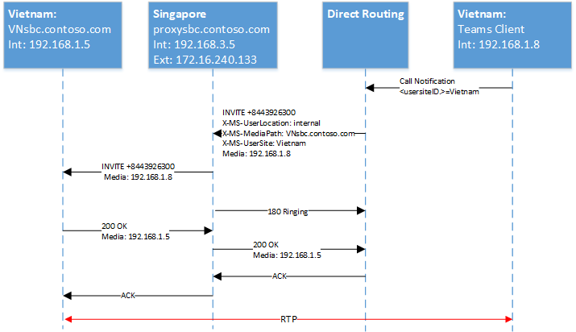

# <a name="configure-local-media-optimization-for-direct-routing"></a><span data-ttu-id="5c19b-103">Настройка оптимизации локальных файлов мультимедиа для прямой маршрутизации</span><span class="sxs-lookup"><span data-stu-id="5c19b-103">Configure Local Media Optimization for Direct Routing</span></span>

<span data-ttu-id="5c19b-104">Настройка оптимизации локальных файлов мультимедиа основывается на параметрах сети, которые являются общими для других функций голосовой связи в облаке, таких как маршрутизация на основе местоположения и динамический вызов экстренной помощи.</span><span class="sxs-lookup"><span data-stu-id="5c19b-104">Configuration for Local Media Optimization is based on network settings that are common to other cloud voice features, such as Location-Based Routing and dynamic emergency calling.</span></span> <span data-ttu-id="5c19b-105">Чтобы узнать больше о регионах сети, сетевых сайтах, подсетях сети и о доверенных IP-адресах, просмотрите [Параметры сети для функций голосовой связи в облаке](cloud-voice-network-settings.md).</span><span class="sxs-lookup"><span data-stu-id="5c19b-105">To learn more about network regions, network sites, network subnets, and trusted IP addresses, see [Network settings for cloud voice features](cloud-voice-network-settings.md).</span></span>

<span data-ttu-id="5c19b-106">Перед настройкой оптимизации локального мультимедиа ознакомьтесь со сведениями [об оптимизации локальных файлов для прямой маршрутизации](direct-routing-media-optimization.md).</span><span class="sxs-lookup"><span data-stu-id="5c19b-106">Before you configure Local Media Optimization, see [Local media Optimization for Direct Routing](direct-routing-media-optimization.md).</span></span>  

<span data-ttu-id="5c19b-107">Для настройки оптимизации локального мультимедиа необходимо выполнить указанные ниже действия.</span><span class="sxs-lookup"><span data-stu-id="5c19b-107">To configure Local Media Optimization, the following steps are required.</span></span> <span data-ttu-id="5c19b-108">Вы можете использовать центр администрирования Teams или PowerShell.</span><span class="sxs-lookup"><span data-stu-id="5c19b-108">You can use the Teams Admin Center or PowerShell.</span></span> <span data-ttu-id="5c19b-109">Подробности можно найти в разделе [Управление топологией сети](manage-your-network-topology.md).</span><span class="sxs-lookup"><span data-stu-id="5c19b-109">For details, see [Manage your network topology](manage-your-network-topology.md).</span></span>

1. <span data-ttu-id="5c19b-110">Настройте пользователя и сайты SBC (как описано в этой статье).</span><span class="sxs-lookup"><span data-stu-id="5c19b-110">Configure the user and the SBC sites (as described in this article).</span></span>
2. <span data-ttu-id="5c19b-111">Настройте локальную SBCs для оптимизации локальных файлов (в соответствии со спецификацией поставщика SBC).</span><span class="sxs-lookup"><span data-stu-id="5c19b-111">Configure the SBCs for Local Media Optimization (according to your SBC vendor specification).</span></span>

<span data-ttu-id="5c19b-112">На приведенной ниже схеме показана настройка сети, используемая в примерах в этой статье.</span><span class="sxs-lookup"><span data-stu-id="5c19b-112">The following diagram shows the network setup used in the examples throughout this article.</span></span>

<span data-ttu-id="5c19b-113"></span><span class="sxs-lookup"><span data-stu-id="5c19b-113"></span></span>


## <a name="configure-the-user-and-the-sbc-sites"></a><span data-ttu-id="5c19b-114">Настройка пользователей и сайтов SBC</span><span class="sxs-lookup"><span data-stu-id="5c19b-114">Configure the user and the SBC sites</span></span>

<span data-ttu-id="5c19b-115">Чтобы настроить пользователя и сайты SBC, необходимо выполнить следующие действия:</span><span class="sxs-lookup"><span data-stu-id="5c19b-115">To configure the user and the SBC sites, you will need to:</span></span>

1. <span data-ttu-id="5c19b-116">[Управление внешними доверенными IP-адресами](#manage-external-trusted-ip-addresses).</span><span class="sxs-lookup"><span data-stu-id="5c19b-116">[Manage external trusted IP addresses](#manage-external-trusted-ip-addresses).</span></span>  

2. <span data-ttu-id="5c19b-117">[Определите топологию сети](#define-the-network-topology) , настроив регионы сети, сетевые сайты и сетевые подсети.</span><span class="sxs-lookup"><span data-stu-id="5c19b-117">[Define the network topology](#define-the-network-topology) by configuring the network regions, network sites, and network subnets.</span></span>

3. <span data-ttu-id="5c19b-118">[Определите топологию виртуальной сети](#define-the-virtual-network-topology) путем назначения SBC (-ов) на сайты, используя необходимые режимы и значения SBC-прокси.</span><span class="sxs-lookup"><span data-stu-id="5c19b-118">[Define the virtual network topology](#define-the-virtual-network-topology) by assigning SBC(s) to site(s) with relevant modes and proxy SBC values.</span></span>


## <a name="configure-sbcs-for-local-media-optimization-according-to-the-sbc-vendor-specification"></a><span data-ttu-id="5c19b-119">Настройка SBC (s) для оптимизации локальных файлов мультимедиа в соответствии со спецификацией поставщика SBC</span><span class="sxs-lookup"><span data-stu-id="5c19b-119">Configure SBC(s) for Local Media Optimization according to the SBC vendor specification</span></span>

<span data-ttu-id="5c19b-120">В этой статье описано, как настроить компоненты Microsoft.</span><span class="sxs-lookup"><span data-stu-id="5c19b-120">This article describes configuration for Microsoft components.</span></span> <span data-ttu-id="5c19b-121">Сведения о настройке SBC можно найти в документации поставщика SBC.</span><span class="sxs-lookup"><span data-stu-id="5c19b-121">For information on SBC configuration, see your SBC vendor documentation.</span></span>

<span data-ttu-id="5c19b-122">Локальная Оптимизация файлов мультимедиа поддерживается следующими разработчиками SBC:</span><span class="sxs-lookup"><span data-stu-id="5c19b-122">Local Media Optimization is supported by the following SBC vendors:</span></span>

| <span data-ttu-id="5c19b-123">Поставщик</span><span class="sxs-lookup"><span data-stu-id="5c19b-123">Vendor</span></span> | <span data-ttu-id="5c19b-124">ПРОИЗВЕД</span><span class="sxs-lookup"><span data-stu-id="5c19b-124">Product</span></span> |    <span data-ttu-id="5c19b-125">Версия программного обеспечения</span><span class="sxs-lookup"><span data-stu-id="5c19b-125">Software version</span></span> |
|:------------|:-------|:-------| :-------|
| [<span data-ttu-id="5c19b-126">Audiocodes</span><span class="sxs-lookup"><span data-stu-id="5c19b-126">Audiocodes</span></span>](https://www.audiocodes.com/media/13253/connecting-audiocodes-sbc-to-microsoft-teams-direct-routing-enterprise-model-configuration-note.pdf) |    <span data-ttu-id="5c19b-127">Mediant 500 SBC</span><span class="sxs-lookup"><span data-stu-id="5c19b-127">Mediant 500 SBC</span></span> |   <span data-ttu-id="5c19b-128">7.20 а. 256</span><span class="sxs-lookup"><span data-stu-id="5c19b-128">7.20A.256</span></span> | 
|            |  <span data-ttu-id="5c19b-129">Mediant 800 SBC</span><span class="sxs-lookup"><span data-stu-id="5c19b-129">Mediant 800 SBC</span></span> |   <span data-ttu-id="5c19b-130">7.20 а. 256</span><span class="sxs-lookup"><span data-stu-id="5c19b-130">7.20A.256</span></span> | 
|            |  <span data-ttu-id="5c19b-131">Mediant 2600 SBC</span><span class="sxs-lookup"><span data-stu-id="5c19b-131">Mediant 2600 SBC</span></span> |  <span data-ttu-id="5c19b-132">7.20 а. 256</span><span class="sxs-lookup"><span data-stu-id="5c19b-132">7.20A.256</span></span> | 
|            |  <span data-ttu-id="5c19b-133">Mediant 4000 SBC</span><span class="sxs-lookup"><span data-stu-id="5c19b-133">Mediant 4000 SBC</span></span> |  <span data-ttu-id="5c19b-134">7.20 а. 256</span><span class="sxs-lookup"><span data-stu-id="5c19b-134">7.20A.256</span></span> | 
|            |  <span data-ttu-id="5c19b-135">Функция МЕДИАНА 1000Bого SBC</span><span class="sxs-lookup"><span data-stu-id="5c19b-135">Mediant 1000B SBC</span></span> | <span data-ttu-id="5c19b-136">7.20 а. 256</span><span class="sxs-lookup"><span data-stu-id="5c19b-136">7.20A.256</span></span> | 
|            |  <span data-ttu-id="5c19b-137">Одномедианый SBC 9000</span><span class="sxs-lookup"><span data-stu-id="5c19b-137">Mediant 9000 SBC</span></span> |  <span data-ttu-id="5c19b-138">7.20 а. 256</span><span class="sxs-lookup"><span data-stu-id="5c19b-138">7.20A.256</span></span> | 
|            |  <span data-ttu-id="5c19b-139">Односрединный виртуальный SBC</span><span class="sxs-lookup"><span data-stu-id="5c19b-139">Mediant Virtual Edition SBC</span></span> |   <span data-ttu-id="5c19b-140">7.20 а. 256</span><span class="sxs-lookup"><span data-stu-id="5c19b-140">7.20A.256</span></span> | 
|            |  <span data-ttu-id="5c19b-141">SBC по выпуску "Медиана"</span><span class="sxs-lookup"><span data-stu-id="5c19b-141">Mediant Cloud Edition SBC</span></span> | <span data-ttu-id="5c19b-142">7.20 а. 256</span><span class="sxs-lookup"><span data-stu-id="5c19b-142">7.20A.256</span></span> |
| [<span data-ttu-id="5c19b-143">Базовые компоненты SBC для ленты</span><span class="sxs-lookup"><span data-stu-id="5c19b-143">Ribbon SBC Core</span></span>](https://support.sonus.net/display/ALLDOC/SBC+8.2+-+Configure+Local+Media+Optimization)  |  <span data-ttu-id="5c19b-144">SBC 5110</span><span class="sxs-lookup"><span data-stu-id="5c19b-144">SBC 5110</span></span>         | <span data-ttu-id="5c19b-145">8,2</span><span class="sxs-lookup"><span data-stu-id="5c19b-145">8.2</span></span>  |
|            |  <span data-ttu-id="5c19b-146">SBC 5210</span><span class="sxs-lookup"><span data-stu-id="5c19b-146">SBC 5210</span></span>         | <span data-ttu-id="5c19b-147">8,2</span><span class="sxs-lookup"><span data-stu-id="5c19b-147">8.2</span></span>  |
|            |  <span data-ttu-id="5c19b-148">SBC 5400</span><span class="sxs-lookup"><span data-stu-id="5c19b-148">SBC 5400</span></span>         | <span data-ttu-id="5c19b-149">8,2</span><span class="sxs-lookup"><span data-stu-id="5c19b-149">8.2</span></span>  |
|            |  <span data-ttu-id="5c19b-150">SBC 7000</span><span class="sxs-lookup"><span data-stu-id="5c19b-150">SBC 7000</span></span>         | <span data-ttu-id="5c19b-151">8,2</span><span class="sxs-lookup"><span data-stu-id="5c19b-151">8.2</span></span>  |
|            |  <span data-ttu-id="5c19b-152">SBC SWe</span><span class="sxs-lookup"><span data-stu-id="5c19b-152">SBC SWe</span></span>          | <span data-ttu-id="5c19b-153">8,2</span><span class="sxs-lookup"><span data-stu-id="5c19b-153">8.2</span></span>  |
| [<span data-ttu-id="5c19b-154">TE-SYSTEMS</span><span class="sxs-lookup"><span data-stu-id="5c19b-154">TE-SYSTEMS</span></span>](https://www.anynode.de/local_media_optimization/) |  <span data-ttu-id="5c19b-155">anynode</span><span class="sxs-lookup"><span data-stu-id="5c19b-155">anynode</span></span>          | <span data-ttu-id="5c19b-156">4.0.1 +</span><span class="sxs-lookup"><span data-stu-id="5c19b-156">4.0.1+</span></span> |
| [<span data-ttu-id="5c19b-157">Oracle</span><span class="sxs-lookup"><span data-stu-id="5c19b-157">Oracle</span></span>](https://www.oracle.com/industries/communications/enterprise-communications/session-border-controller/microsoft.html) | <span data-ttu-id="5c19b-158">AP 1100</span><span class="sxs-lookup"><span data-stu-id="5c19b-158">AP 1100</span></span> | <span data-ttu-id="5c19b-159">8.4.0.0.0</span><span class="sxs-lookup"><span data-stu-id="5c19b-159">8.4.0.0.0</span></span> |
|        | <span data-ttu-id="5c19b-160">AP 3900</span><span class="sxs-lookup"><span data-stu-id="5c19b-160">AP 3900</span></span> | <span data-ttu-id="5c19b-161">8.4.0.0.0</span><span class="sxs-lookup"><span data-stu-id="5c19b-161">8.4.0.0.0</span></span> |
|        | <span data-ttu-id="5c19b-162">AP 4600</span><span class="sxs-lookup"><span data-stu-id="5c19b-162">AP 4600</span></span> | <span data-ttu-id="5c19b-163">8.4.0.0.0</span><span class="sxs-lookup"><span data-stu-id="5c19b-163">8.4.0.0.0</span></span> | 
|        | <span data-ttu-id="5c19b-164">AP 6300</span><span class="sxs-lookup"><span data-stu-id="5c19b-164">AP 6300</span></span> | <span data-ttu-id="5c19b-165">8.4.0.0.0</span><span class="sxs-lookup"><span data-stu-id="5c19b-165">8.4.0.0.0</span></span> |
|        | <span data-ttu-id="5c19b-166">AP 6350</span><span class="sxs-lookup"><span data-stu-id="5c19b-166">AP 6350</span></span> | <span data-ttu-id="5c19b-167">8.4.0.0.0</span><span class="sxs-lookup"><span data-stu-id="5c19b-167">8.4.0.0.0</span></span> | 
|        | <span data-ttu-id="5c19b-168">VME</span><span class="sxs-lookup"><span data-stu-id="5c19b-168">VME</span></span>     | <span data-ttu-id="5c19b-169">8.4.0.0.0</span><span class="sxs-lookup"><span data-stu-id="5c19b-169">8.4.0.0.0</span></span> |


## <a name="manage-external-trusted-ip-addresses"></a><span data-ttu-id="5c19b-170">Управление внешними надежными IP-адресами</span><span class="sxs-lookup"><span data-stu-id="5c19b-170">Manage external trusted IP addresses</span></span>

<span data-ttu-id="5c19b-171">Внешние надежные IP-адреса — это внешние IP-адреса Интернет-адресов корпоративной сети.</span><span class="sxs-lookup"><span data-stu-id="5c19b-171">External trusted IPs are the Internet external IPs of the enterprise network.</span></span> <span data-ttu-id="5c19b-172">Эти IP-адреса используются клиентами Microsoft Teams при подключении к Microsoft 365.</span><span class="sxs-lookup"><span data-stu-id="5c19b-172">These IP’s are the IP addresses used by Microsoft Teams clients when they connect to Microsoft 365.</span></span> <span data-ttu-id="5c19b-173">Вам необходимо добавить эти внешние IP-адреса для каждого сайта, на котором пользователи используют локальную оптимизацию мультимедиа.</span><span class="sxs-lookup"><span data-stu-id="5c19b-173">You need to add these external IPs for each site where you have users using Local Media Optimization.</span></span>

<span data-ttu-id="5c19b-174">Чтобы добавить общедоступные IP-адреса для каждого сайта, используйте командлет New-CsTenantTrustedIPAddress.</span><span class="sxs-lookup"><span data-stu-id="5c19b-174">To add the public IP addresses for each site, use the New-CsTenantTrustedIPAddress cmdlet.</span></span> <span data-ttu-id="5c19b-175">Вы можете определить неограниченное количество доверенных IP-адресов для клиента.</span><span class="sxs-lookup"><span data-stu-id="5c19b-175">You can define an unlimited number of trusted IP addresses for a tenant.</span></span> <span data-ttu-id="5c19b-176">Если внешние IP-адреса, обнаруженные Microsoft 365, являются адресами IPv4 и IPv6, необходимо добавить оба типа IP.</span><span class="sxs-lookup"><span data-stu-id="5c19b-176">If the external IPs seen by Microsoft 365 are both IPv4 and IPv6 addresses, you need to add both types of IP addresses.</span></span> <span data-ttu-id="5c19b-177">Для IPv4 используется маска 32.</span><span class="sxs-lookup"><span data-stu-id="5c19b-177">For IPv4, use mask 32.</span></span> <span data-ttu-id="5c19b-178">Для IPv6 используйте маску 128.</span><span class="sxs-lookup"><span data-stu-id="5c19b-178">For IPv6, use mask 128.</span></span> <span data-ttu-id="5c19b-179">Вы можете добавить как отдельные внешние IP-адреса, так и внешние IP-подсети, указав разные MaskBits в командлете.</span><span class="sxs-lookup"><span data-stu-id="5c19b-179">You can add both individual external IP addresses and external IP subnets by specifying different MaskBits on the cmdlet.</span></span>

```
New-CsTenantTrustedIPAddress -IPAddress <External IP address> -MaskBits <Subnet bitmask> -Description <description>
```


<span data-ttu-id="5c19b-180">Пример добавления доверенных IP-адресов.</span><span class="sxs-lookup"><span data-stu-id="5c19b-180">Example of adding trusted IP addresses.</span></span>

```
New-CsTenantTrustedIPAddress -IPAddress 172.16.240.110 -MaskBits 32 -Description "Vietnam site trusted IP"
New-CsTenantTrustedIPAddress -IPAddress 172.16.240.120 -MaskBits 32 -Description "Indonesia site trusted IP"
New-CsTenantTrustedIPAddress -IPAddress 172.16.240.130 -MaskBits 32 -Description "Singapore site trusted IP"
```


## <a name="define-the-network-topology"></a><span data-ttu-id="5c19b-181">Определение топологии сети</span><span class="sxs-lookup"><span data-stu-id="5c19b-181">Define the network topology</span></span>

<span data-ttu-id="5c19b-182">В этом разделе рассказывается, как определить регионы сети, сетевые сайты и сетевые подсети для топологии сети.</span><span class="sxs-lookup"><span data-stu-id="5c19b-182">This section describes how to define the network regions, network sites, and network subnets for your network topology.</span></span>

<span data-ttu-id="5c19b-183">Все параметры чувствительны к регистру, поэтому необходимо использовать тот же сценарий, который использовался при настройке.</span><span class="sxs-lookup"><span data-stu-id="5c19b-183">All parameters are case sensitive so you need to ensure that you use the same case that was used during setup.</span></span>  <span data-ttu-id="5c19b-184">(Например, GatewaySiteID значения "Вьетнам" и "Вьетнам" будут считаться разными сайтами.)</span><span class="sxs-lookup"><span data-stu-id="5c19b-184">(For example, GatewaySiteID values “Vietnam” and “vietnam” will be treated as different sites.)</span></span>

### <a name="define-network-regions"></a><span data-ttu-id="5c19b-185">Определение регионов сети</span><span class="sxs-lookup"><span data-stu-id="5c19b-185">Define network regions</span></span>

<span data-ttu-id="5c19b-186">Чтобы определить регионы сети, используйте командлет New-CsTenantNetworkRegion.</span><span class="sxs-lookup"><span data-stu-id="5c19b-186">To define network regions, use the New-CsTenantNetworkRegion cmdlet.</span></span> <span data-ttu-id="5c19b-187">Параметр RegionID — это логическое имя, представляющее собой географию области и не обладающее зависимостями или ограничениями.</span><span class="sxs-lookup"><span data-stu-id="5c19b-187">The RegionID parameter is a logical name that represents the geography of the region and has no dependencies or restrictions.</span></span> <span data-ttu-id="5c19b-188">Параметр CentralSite <site ID> является необязательным.</span><span class="sxs-lookup"><span data-stu-id="5c19b-188">The CentralSite <site ID> parameter is optional.</span></span>

```
New-CsTenantNetworkRegion -NetworkRegionID <region ID>  
```

<span data-ttu-id="5c19b-189">В следующем примере создается сетевой регион с именем APAC:</span><span class="sxs-lookup"><span data-stu-id="5c19b-189">The following example creates a network region named APAC:</span></span>

```
New-CsTenantNetworkRegion -NetworkRegionID "APAC"  
```

###  <a name="define-network-sites"></a><span data-ttu-id="5c19b-190">Определение сетевых сайтов</span><span class="sxs-lookup"><span data-stu-id="5c19b-190">Define network sites</span></span>

<span data-ttu-id="5c19b-191">Для определения сетевых сайтов используйте командлет New-CsTenantNetworkSite.</span><span class="sxs-lookup"><span data-stu-id="5c19b-191">To define network sites, use the New-CsTenantNetworkSite cmdlet.</span></span> <span data-ttu-id="5c19b-192">Каждый сетевой сайт должен быть связан с сетевым регионом.</span><span class="sxs-lookup"><span data-stu-id="5c19b-192">Each network site must be associated with a network region.</span></span>

```
New-CsTenantNetworkSite -NetworkSiteID <site ID> -NetworkRegionID <region ID>
```

<span data-ttu-id="5c19b-193">В следующем примере показано создание трех новых сайтов сети, Вьетнам, Индонезия и Сингапур в регионе APAC:</span><span class="sxs-lookup"><span data-stu-id="5c19b-193">The following example creates three new network sites, Vietnam, Indonesia, and Singapore in the APAC region:</span></span>

```
New-CsTenantNetworkSite -NetworkSiteID "Vietnam" -NetworkRegionID "APAC"
New-CsTenantNetworkSite -NetworkSiteID "Indonesia" -NetworkRegionID "APAC"
New-CsTenantNetworkSite -NetworkSiteID "Singapore" -NetworkRegionID "APAC"
```

### <a name="define-network-subnets"></a><span data-ttu-id="5c19b-194">Определение подсетей сети</span><span class="sxs-lookup"><span data-stu-id="5c19b-194">Define network subnets</span></span>

<span data-ttu-id="5c19b-195">Чтобы определить сетевые подсети и связать их с сетевыми сайтами, используйте командлет New-CsTenantNetworkSubnet.</span><span class="sxs-lookup"><span data-stu-id="5c19b-195">To define network subnets and associate them to network sites, use the New-CsTenantNetworkSubnet cmdlet.</span></span> <span data-ttu-id="5c19b-196">Каждая сетевая подсеть может быть связана только с одним сайтом.</span><span class="sxs-lookup"><span data-stu-id="5c19b-196">Each network subnet can only be associated with one site.</span></span> 

```
New-CsTenantNetworkSubnet -SubnetID <Subnet IP address> -MaskBits <Subnet bitmask> -NetworkSiteID <site ID>
```

<span data-ttu-id="5c19b-197">В приведенном ниже примере определяются три подсети, которые связываются с тремя сетевыми сайтами: Вьетнам, Индонезия и Сингапур.</span><span class="sxs-lookup"><span data-stu-id="5c19b-197">The following example defines three network subnets and associates them with the three network sites:  Vietnam, Indonesia, and Singapore:</span></span>

```
New-CsTenantNetworkSubnet -SubnetID 192.168.1.0 -MaskBits 24 -NetworkSiteID “Vietnam”
New-CsTenantNetworkSubnet -SubnetID 192.168.2.0 -MaskBits 24 -NetworkSiteID “Indonesia”
New-CsTenantNetworkSubnet -SubnetID 192.168.3.0 -MaskBits 24 -NetworkSiteID “Singapore”
```

## <a name="define-the-virtual-network-topology"></a><span data-ttu-id="5c19b-198">Определение топологии виртуальной сети</span><span class="sxs-lookup"><span data-stu-id="5c19b-198">Define the virtual network topology</span></span> 

<span data-ttu-id="5c19b-199">Сначала администратор клиента создает новую конфигурацию SBC для каждого связанного SBC с помощью командлета New-CsOnlinePSTNGateway.</span><span class="sxs-lookup"><span data-stu-id="5c19b-199">First, the tenant administrator creates a new SBC configuration for each relevant SBC by using the New-CsOnlinePSTNGateway cmdlet.</span></span>
<span data-ttu-id="5c19b-200">Администратор клиента определяет топологию виртуальной сети, указав сетевые сайты для объектов шлюза PSTN с помощью командлета Set-CsOnlinePSTNGateway:</span><span class="sxs-lookup"><span data-stu-id="5c19b-200">The tenant administrator defines the virtual network topology by specifying the network sites for the PSTN gateway objects using the Set-CsOnlinePSTNGateway cmdlet:</span></span>

```
PS C:\> Set-CsOnlinePSTNGateway -Identity <Identity> -GatewaySiteID <site ID> -MediaBypass <true/false> -BypassMode <Always/OnlyForLocalUsers> -ProxySBC  <proxy SBC FQDN or $null>
```

<span data-ttu-id="5c19b-201">Обратите внимание на следующее:</span><span class="sxs-lookup"><span data-stu-id="5c19b-201">Note the following:</span></span> 
   - <span data-ttu-id="5c19b-202">Если у клиента есть один объект SBC, параметр-ProxySBC должен быть обязательным как обязательно $null или однорангового значения SBC (то есть центрального SBC с помощью централизованной магистрали).</span><span class="sxs-lookup"><span data-stu-id="5c19b-202">If the customer has a single SBC, the -ProxySBC parameter must be either mandatory $null or SBC FQDN value (Central SBC with centralized trunks scenario).</span></span>
   - <span data-ttu-id="5c19b-203">Параметр-MediaBypass должен иметь значение $true, чтобы обеспечить поддержку локальной оптимизации мультимедиа.</span><span class="sxs-lookup"><span data-stu-id="5c19b-203">The -MediaBypass parameter must be set to $true in order to support Local Media Optimization.</span></span>
   - <span data-ttu-id="5c19b-204">Если для SBC не задан параметр-BypassMode, заголовки X-MS не будут отправляться.</span><span class="sxs-lookup"><span data-stu-id="5c19b-204">If the SBC doesn’t have the -BypassMode parameter set, X-MS headers will not be sent.</span></span> 
   - <span data-ttu-id="5c19b-205">Все параметры чувствительны к регистру, поэтому необходимо использовать тот же вариант, который использовался при настройке.</span><span class="sxs-lookup"><span data-stu-id="5c19b-205">All parameters are case sensitive so you need to ensure that you use the same case that was used used during setup.</span></span>  <span data-ttu-id="5c19b-206">(Например, GatewaySiteID значения "Вьетнам" и "Вьетнам" будут считаться разными сайтами.)</span><span class="sxs-lookup"><span data-stu-id="5c19b-206">(For example, GatewaySiteID values “Vietnam” and “vietnam” will be treated as different sites.)</span></span>

<span data-ttu-id="5c19b-207">В следующем примере добавляется три SBCs к сетевым сайтам Вьетнам, Индонезия и Сингапур в APAC области с режимом "всегда обходиться".</span><span class="sxs-lookup"><span data-stu-id="5c19b-207">The following example adds three SBCs to the network sites Vietnam, Indonesia, and Singapore in the APAC region with mode Always bypass:</span></span>

```
Set-CSOnlinePSTNGateway -Identity “proxysbc.contoso.com” -GatewaySiteID “Singapore” -MediaBypass $true -BypassMode “Always” -ProxySBC $null

Set-CSOnlinePSTNGateway -Identity “VNsbc.contoso.com” -GatewaySiteID “Vietnam” -MediaBypass $true -BypassMode “Always” -ProxySBC “proxysbc.contoso.com”

Set-CSOnlinePSTNGateway -Identity “IDsbc.contoso.com” -GatewaySiteID “Indonesia” -MediaBypass $true -BypassMode “Always” -ProxySBC “proxysbc.contoso.com”
```

<span data-ttu-id="5c19b-208">Примечание. для обеспечения бесперебойной работы при одновременной настройке локальной оптимизации и маршрутизации на основе местоположения (LBR) для LBR необходимо включить более подпадающую одноранговую SBCs, задав для параметра GatewaySiteLbrEnabled значение $true для каждого из этих одноименнох SBC-файлов.</span><span class="sxs-lookup"><span data-stu-id="5c19b-208">Note: To ensure uninterrupted operations when Local Media Optimization and Location-Based Routing (LBR) are configured at the same time, downstream SBCs must be enabled for LBR by setting the GatewaySiteLbrEnabled parameter to $true for each downstream SBC.</span></span> <span data-ttu-id="5c19b-209">(Этот параметр не является обязательным для прокси-сервера SBC).</span><span class="sxs-lookup"><span data-stu-id="5c19b-209">(This setting is not mandatory for the proxy SBC.)</span></span>

<span data-ttu-id="5c19b-210">В соответствии с приведенными выше сведениями прямая маршрутизация включает три собственных заголовка SIP для приглашений на SIP и повторений, как показано в приведенной ниже таблице.</span><span class="sxs-lookup"><span data-stu-id="5c19b-210">Based on the information above, Direct Routing will include three proprietary SIP Headers to SIP Invites and Re-invites as shown  in the following table.</span></span>

<span data-ttu-id="5c19b-211">Заголовки X-MS, введенные в прямом маршруте на приглашениях и повторных приглашениях, если определен BypassMode:</span><span class="sxs-lookup"><span data-stu-id="5c19b-211">X-MS Headers introduced in Direct Routing on Invites and Re-Invites if BypassMode is defined:</span></span>

| <span data-ttu-id="5c19b-212">Имя заголовка</span><span class="sxs-lookup"><span data-stu-id="5c19b-212">Header name</span></span> | <span data-ttu-id="5c19b-213">Данные</span><span class="sxs-lookup"><span data-stu-id="5c19b-213">Values</span></span> | <span data-ttu-id="5c19b-214">Комментарии</span><span class="sxs-lookup"><span data-stu-id="5c19b-214">Comments</span></span> | 
|:------------|:-------|:-------|
| <span data-ttu-id="5c19b-215">X-MS-UserLocation</span><span class="sxs-lookup"><span data-stu-id="5c19b-215">X-MS-UserLocation</span></span> | <span data-ttu-id="5c19b-216">внутренние и внешние</span><span class="sxs-lookup"><span data-stu-id="5c19b-216">internal/external</span></span> | <span data-ttu-id="5c19b-217">Указывает, является ли пользователь внутренним или внешним</span><span class="sxs-lookup"><span data-stu-id="5c19b-217">Indicates if user is internal or external</span></span> |
| <span data-ttu-id="5c19b-218">Запрос-URI INVITE SIP: + 84439263000@VNsbc.contoso.com SIP/2,0</span><span class="sxs-lookup"><span data-stu-id="5c19b-218">Request-URI   INVITE sip: +84439263000@VNsbc.contoso.com SIP /2.0</span></span> | <span data-ttu-id="5c19b-219">ПОЛНОЕ ДОМЕННОЕ ИМЯ SBC</span><span class="sxs-lookup"><span data-stu-id="5c19b-219">SBC FQDN</span></span> | <span data-ttu-id="5c19b-220">Полное доменное имя, которое предназначено для вызова, даже если SBC не подключен напрямую к прямой маршрутизации</span><span class="sxs-lookup"><span data-stu-id="5c19b-220">The FQDN which is targeted for the call even if the SBC is not directly connected to Direct Routing</span></span> |
| <span data-ttu-id="5c19b-221">X-MS-MediaPath</span><span class="sxs-lookup"><span data-stu-id="5c19b-221">X-MS-MediaPath</span></span> | <span data-ttu-id="5c19b-222">Пример: proxysbc.contoso.com, VNsbc.contoso.com</span><span class="sxs-lookup"><span data-stu-id="5c19b-222">Example: proxysbc.contoso.com, VNsbc.contoso.com</span></span> | <span data-ttu-id="5c19b-223">Порядковый номер SBCs, который должен использоваться для пути к носителю между пользователем и объектом SBC.</span><span class="sxs-lookup"><span data-stu-id="5c19b-223">Order of SBCs that should be used for Media path between the user and target SBC.</span></span> <span data-ttu-id="5c19b-224">Конечный SBC всегда в последнюю очередь</span><span class="sxs-lookup"><span data-stu-id="5c19b-224">The final SBC is always last</span></span> |
| <span data-ttu-id="5c19b-225">X-MS-UserSite</span><span class="sxs-lookup"><span data-stu-id="5c19b-225">X-MS-UserSite</span></span> | <span data-ttu-id="5c19b-226">usersiteID</span><span class="sxs-lookup"><span data-stu-id="5c19b-226">usersiteID</span></span> | <span data-ttu-id="5c19b-227">Строка, определенная администратором клиента</span><span class="sxs-lookup"><span data-stu-id="5c19b-227">String defined by tenant administrator</span></span> |

## <a name="call-flows"></a><span data-ttu-id="5c19b-228">Потоки звонков</span><span class="sxs-lookup"><span data-stu-id="5c19b-228">Call flows</span></span> 

<span data-ttu-id="5c19b-229">Ниже показаны потоки звонков для двух режимов:</span><span class="sxs-lookup"><span data-stu-id="5c19b-229">The following shows call flows for two modes:</span></span>

- [<span data-ttu-id="5c19b-230">Всегда обходить</span><span class="sxs-lookup"><span data-stu-id="5c19b-230">Always Bypass</span></span>](#always-bypass-mode)
- [<span data-ttu-id="5c19b-231">Только для локальных пользователей</span><span class="sxs-lookup"><span data-stu-id="5c19b-231">Only for local users</span></span>](#only-for-local-users-mode)

### <a name="always-bypass-mode"></a><span data-ttu-id="5c19b-232">Режим "всегда пропускать"</span><span class="sxs-lookup"><span data-stu-id="5c19b-232">Always Bypass mode</span></span>

<span data-ttu-id="5c19b-233">Режим "всегда пропускать" — это самый простой параметр для настройки.</span><span class="sxs-lookup"><span data-stu-id="5c19b-233">Always Bypass mode is the simplest option to configure.</span></span> <span data-ttu-id="5c19b-234">Администратор клиента может настроить один сайт для всех пользователей и SBCs, если все SBCs достижимы с любого сайта.</span><span class="sxs-lookup"><span data-stu-id="5c19b-234">The tenant administrator can configure a single site for all users and SBCs if all SBCs are reachable from any site.</span></span>

<span data-ttu-id="5c19b-235">В примерах показан режим "всегда обойти" для следующих сценариев:</span><span class="sxs-lookup"><span data-stu-id="5c19b-235">The examples show Always bypass mode for the following scenarios:</span></span>

- [<span data-ttu-id="5c19b-236">Исходящие звонки и пользователь находятся в той же папке, что и SBC</span><span class="sxs-lookup"><span data-stu-id="5c19b-236">Outbound calls and the user is in the same location as the SBC</span></span>](#outbound-calls-and-the-user-is-in-the-same-location-as-the-sbc-with-always-bypass)
- [<span data-ttu-id="5c19b-237">Входящие звонки и пользователь находятся в той же папке, что и SBC</span><span class="sxs-lookup"><span data-stu-id="5c19b-237">Inbound calls and the user is in the same location as the SBC</span></span>](#inbound-calls-and-the-user-is-in-the-same-location-as-the-sbc-with-always-bypass)
- [<span data-ttu-id="5c19b-238">Исходящие звонки и внешние пользователи</span><span class="sxs-lookup"><span data-stu-id="5c19b-238">Outbound calls and the user is external</span></span>](#outbound-calls-and-the-user-is-external-with-always-bypass)
- [<span data-ttu-id="5c19b-239">Входящие звонки и внешние пользователи</span><span class="sxs-lookup"><span data-stu-id="5c19b-239">Inbound calls and the user is external</span></span>](#inbound-calls-and-the-user-is-external-with-always-bypass)

<span data-ttu-id="5c19b-240">В приведенной ниже таблице указаны полные доменные имена и IP-адреса, используемые в примерах.</span><span class="sxs-lookup"><span data-stu-id="5c19b-240">The following table shows the FQDN and IP addresses used in the examples:</span></span>

| <span data-ttu-id="5c19b-241">Полное доменное имя</span><span class="sxs-lookup"><span data-stu-id="5c19b-241">FQDN</span></span> | <span data-ttu-id="5c19b-242">Внешний IP-адрес для SBC</span><span class="sxs-lookup"><span data-stu-id="5c19b-242">SBC external IP address</span></span> | <span data-ttu-id="5c19b-243">Внутренний IP-адрес SBC</span><span class="sxs-lookup"><span data-stu-id="5c19b-243">SBC internal IP Address</span></span> | <span data-ttu-id="5c19b-244">Внутренняя подсеть</span><span class="sxs-lookup"><span data-stu-id="5c19b-244">Internal subnet</span></span> | <span data-ttu-id="5c19b-245">Местоположение</span><span class="sxs-lookup"><span data-stu-id="5c19b-245">Location</span></span> | <span data-ttu-id="5c19b-246">Внешний NAT (доверенный IP-адрес)</span><span class="sxs-lookup"><span data-stu-id="5c19b-246">External NAT (Trusted IP)</span></span> |
|:------------|:-------|:-------|:-------|:-------|:-------|
| <span data-ttu-id="5c19b-247">VNsbc.contoso.com</span><span class="sxs-lookup"><span data-stu-id="5c19b-247">VNsbc.contoso.com</span></span> | <span data-ttu-id="5c19b-248">Нет</span><span class="sxs-lookup"><span data-stu-id="5c19b-248">None</span></span> | <span data-ttu-id="5c19b-249">192.168.1.5</span><span class="sxs-lookup"><span data-stu-id="5c19b-249">192.168.1.5</span></span> | <span data-ttu-id="5c19b-250">192.168.1.0/24</span><span class="sxs-lookup"><span data-stu-id="5c19b-250">192.168.1.0/24</span></span> | <span data-ttu-id="5c19b-251">Вьетнам</span><span class="sxs-lookup"><span data-stu-id="5c19b-251">Vietnam</span></span> | <span data-ttu-id="5c19b-252">172.16.240.110</span><span class="sxs-lookup"><span data-stu-id="5c19b-252">172.16.240.110</span></span> |
| <span data-ttu-id="5c19b-253">IDsbc.contoso.com</span><span class="sxs-lookup"><span data-stu-id="5c19b-253">IDsbc.contoso.com</span></span> | <span data-ttu-id="5c19b-254">Нет</span><span class="sxs-lookup"><span data-stu-id="5c19b-254">None</span></span> | <span data-ttu-id="5c19b-255">192.168.2.5</span><span class="sxs-lookup"><span data-stu-id="5c19b-255">192.168.2.5</span></span> | <span data-ttu-id="5c19b-256">192.168.2.0/24</span><span class="sxs-lookup"><span data-stu-id="5c19b-256">192.168.2.0/24</span></span> | <span data-ttu-id="5c19b-257">Индонезия</span><span class="sxs-lookup"><span data-stu-id="5c19b-257">Indonesia</span></span> | <span data-ttu-id="5c19b-258">172.16.240.120</span><span class="sxs-lookup"><span data-stu-id="5c19b-258">172.16.240.120</span></span> |
| <span data-ttu-id="5c19b-259">proxysbc.contoso.com</span><span class="sxs-lookup"><span data-stu-id="5c19b-259">proxysbc.contoso.com</span></span> | <span data-ttu-id="5c19b-260">172.16.240.133</span><span class="sxs-lookup"><span data-stu-id="5c19b-260">172.16.240.133</span></span> | <span data-ttu-id="5c19b-261">192.168.3.5</span><span class="sxs-lookup"><span data-stu-id="5c19b-261">192.168.3.5</span></span> | <span data-ttu-id="5c19b-262">192.168.3.0/24</span><span class="sxs-lookup"><span data-stu-id="5c19b-262">192.168.3.0/24</span></span> | <span data-ttu-id="5c19b-263">Сингапур</span><span class="sxs-lookup"><span data-stu-id="5c19b-263">Singapore</span></span> | <span data-ttu-id="5c19b-264">172.16.240.130</span><span class="sxs-lookup"><span data-stu-id="5c19b-264">172.16.240.130</span></span> |


#### <a name="outbound-calls-and-the-user-is-in-the-same-location-as-the-sbc-with-always-bypass"></a><span data-ttu-id="5c19b-265">Исходящие звонки и пользователь находятся в той же папке, что и SBC, но не всегда обходить</span><span class="sxs-lookup"><span data-stu-id="5c19b-265">Outbound calls and the user is in the same location as the SBC with Always Bypass</span></span>

| <span data-ttu-id="5c19b-266">Режиме</span><span class="sxs-lookup"><span data-stu-id="5c19b-266">Mode</span></span> |    <span data-ttu-id="5c19b-267">Пользователь</span><span class="sxs-lookup"><span data-stu-id="5c19b-267">User</span></span> |  <span data-ttu-id="5c19b-268">Местоположение</span><span class="sxs-lookup"><span data-stu-id="5c19b-268">Location</span></span> |  <span data-ttu-id="5c19b-269">Направление звонка</span><span class="sxs-lookup"><span data-stu-id="5c19b-269">Call direction</span></span> |
|:------------|:-------|:-------| :-------|
| <span data-ttu-id="5c19b-270">AlwaysBypass</span><span class="sxs-lookup"><span data-stu-id="5c19b-270">AlwaysBypass</span></span> |    <span data-ttu-id="5c19b-271">Internal</span><span class="sxs-lookup"><span data-stu-id="5c19b-271">Internal</span></span> |  <span data-ttu-id="5c19b-272">Тот же сайт, что и SBC</span><span class="sxs-lookup"><span data-stu-id="5c19b-272">The same site as SBC</span></span> |  <span data-ttu-id="5c19b-273">Исходящее</span><span class="sxs-lookup"><span data-stu-id="5c19b-273">Outbound</span></span> |

<span data-ttu-id="5c19b-274">В следующей таблице приведены сведения о конфигурации и действии конечных пользователей.</span><span class="sxs-lookup"><span data-stu-id="5c19b-274">The following table shows the end user configuration and action:</span></span>

| <span data-ttu-id="5c19b-275">Физическое расположение пользователя</span><span class="sxs-lookup"><span data-stu-id="5c19b-275">User physical location</span></span>| <span data-ttu-id="5c19b-276">Пользователь выполняет или получает звонок на номер</span><span class="sxs-lookup"><span data-stu-id="5c19b-276">User makes or receives a call to/from number</span></span> | <span data-ttu-id="5c19b-277">Номер телефона пользователя</span><span class="sxs-lookup"><span data-stu-id="5c19b-277">User phone number</span></span>  | <span data-ttu-id="5c19b-278">Политика голосовой маршрутизации в сети</span><span class="sxs-lookup"><span data-stu-id="5c19b-278">Online Voice Routing Policy</span></span> | <span data-ttu-id="5c19b-279">Режим, настроенный для SBC</span><span class="sxs-lookup"><span data-stu-id="5c19b-279">Mode configured for SBC</span></span> |
|:------------|:-------|:-------|:-------|:-------|
| <span data-ttu-id="5c19b-280">Вьетнам</span><span class="sxs-lookup"><span data-stu-id="5c19b-280">Vietnam</span></span> | <span data-ttu-id="5c19b-281">+ 84 4 3926 3000</span><span class="sxs-lookup"><span data-stu-id="5c19b-281">+84 4 3926 3000</span></span> | <span data-ttu-id="5c19b-282">+ 84 4 5555 5555</span><span class="sxs-lookup"><span data-stu-id="5c19b-282">+84 4 5555 5555</span></span>   | <span data-ttu-id="5c19b-283">Приоритет 1: ^ \+ 84 (\d {9} ) $-VNsbc.contoso.com</span><span class="sxs-lookup"><span data-stu-id="5c19b-283">Priority 1: ^\+84(\d{9})$ -VNsbc.contoso.com</span></span> <br> <span data-ttu-id="5c19b-284">Приоритет 2:. \*-proxysbc.contoso.com</span><span class="sxs-lookup"><span data-stu-id="5c19b-284">Priority 2: .\* - proxysbc.contoso.com</span></span>   | <span data-ttu-id="5c19b-285">VNsbc.contoso.com – всегда обходить</span><span class="sxs-lookup"><span data-stu-id="5c19b-285">VNsbc.contoso.com – Always Bypass</span></span> <br> <span data-ttu-id="5c19b-286">proxysbc.contoso.com – всегда обходить</span><span class="sxs-lookup"><span data-stu-id="5c19b-286">proxysbc.contoso.com – Always Bypass</span></span>


<span data-ttu-id="5c19b-287">На приведенной ниже схеме показана лестница SIP для исходящего звонка с режимом "всегда минуя", и пользователь в том же расположении, что и SBC.</span><span class="sxs-lookup"><span data-stu-id="5c19b-287">The following diagram shows the SIP ladder for an outbound call with Always bypass mode, and the user in the same location as the SBC.</span></span>

<span data-ttu-id="5c19b-288"></span><span class="sxs-lookup"><span data-stu-id="5c19b-288"></span></span>

<span data-ttu-id="5c19b-289">В таблице ниже указаны заголовки X-MS, отправленные с помощью Direct Routing.</span><span class="sxs-lookup"><span data-stu-id="5c19b-289">The following table shows the X-MS headers sent by Direct Routing:</span></span>

| <span data-ttu-id="5c19b-290">Параметр</span><span class="sxs-lookup"><span data-stu-id="5c19b-290">Parameter</span></span> | <span data-ttu-id="5c19b-291">Пояснение</span><span class="sxs-lookup"><span data-stu-id="5c19b-291">Explanation</span></span> |
|:------------|:-------|
| <span data-ttu-id="5c19b-292">Пригласить + 8443926300@VNsbc.contoso.com</span><span class="sxs-lookup"><span data-stu-id="5c19b-292">Invite +8443926300@VNsbc.contoso.com</span></span> | <span data-ttu-id="5c19b-293">Целевое полное доменное имя для SBC, определенное в политике голосовой маршрутизации через Интернет, отправляется в URI запроса.</span><span class="sxs-lookup"><span data-stu-id="5c19b-293">The target FQDN of the SBC as defined in the Online Voice Routing Policy is sent in the Request URI</span></span> | 
| <span data-ttu-id="5c19b-294">X-MS-UserLocation: Internal</span><span class="sxs-lookup"><span data-stu-id="5c19b-294">X-MS-UserLocation: internal</span></span> | <span data-ttu-id="5c19b-295">Поле, которое указывает, что пользователь входит в корпоративную сеть</span><span class="sxs-lookup"><span data-stu-id="5c19b-295">The field indicated that user is located inside the corporate network</span></span> |
| <span data-ttu-id="5c19b-296">X-MS-MediaPath: VNsbc.contoso.com</span><span class="sxs-lookup"><span data-stu-id="5c19b-296">X-MS-MediaPath: VNsbc.contoso.com</span></span> |   <span data-ttu-id="5c19b-297">Указывает, какой SBC — клиент должен пройти по целевому объекту SBC.</span><span class="sxs-lookup"><span data-stu-id="5c19b-297">Specifies which SBC the client must traverse to the target SBC.</span></span> <span data-ttu-id="5c19b-298">В этом случае, так как мы всегда обходите, а клиент является внутренним конечным именем, которое отправляется в заголовке как единственное имя.</span><span class="sxs-lookup"><span data-stu-id="5c19b-298">In this case as we have Always Bypass, and the client is internal the target name sent as the only name in the header.</span></span> | 
|<span data-ttu-id="5c19b-299">X-MS-UserSite: Вьетнам</span><span class="sxs-lookup"><span data-stu-id="5c19b-299">X-MS-UserSite: Vietnam</span></span> |   <span data-ttu-id="5c19b-300">Поле, указываемое на сайте, на котором находится пользователь.</span><span class="sxs-lookup"><span data-stu-id="5c19b-300">The field indicated within the site the user is located.</span></span> |


#### <a name="inbound-calls-and-the-user-is-in-the-same-location-as-the-sbc-with-always-bypass"></a><span data-ttu-id="5c19b-301">Входящие звонки и пользователь находятся в той же папке, что и SBC, но не всегда пропускать</span><span class="sxs-lookup"><span data-stu-id="5c19b-301">Inbound calls and the user is in the same location as the SBC with Always Bypass</span></span>

| <span data-ttu-id="5c19b-302">Режиме</span><span class="sxs-lookup"><span data-stu-id="5c19b-302">Mode</span></span> |    <span data-ttu-id="5c19b-303">Пользователь</span><span class="sxs-lookup"><span data-stu-id="5c19b-303">User</span></span> |  <span data-ttu-id="5c19b-304">Местоположение</span><span class="sxs-lookup"><span data-stu-id="5c19b-304">Location</span></span> |  <span data-ttu-id="5c19b-305">Направление звонка</span><span class="sxs-lookup"><span data-stu-id="5c19b-305">Call direction</span></span> |
|:------------|:-------|:-------|:-------|:-------|
| <span data-ttu-id="5c19b-306">AlwaysBypass</span><span class="sxs-lookup"><span data-stu-id="5c19b-306">AlwaysBypass</span></span> |    <span data-ttu-id="5c19b-307">Internal</span><span class="sxs-lookup"><span data-stu-id="5c19b-307">Internal</span></span> | <span data-ttu-id="5c19b-308">Тот же сайт, что и SBC</span><span class="sxs-lookup"><span data-stu-id="5c19b-308">The same site as SBC</span></span> | <span data-ttu-id="5c19b-309">443</span><span class="sxs-lookup"><span data-stu-id="5c19b-309">Inbound</span></span> |


<span data-ttu-id="5c19b-310">Во входящем звонке расположение пользователя неизвестно, и SBC должен быть указан в том месте, где находится пользователь.</span><span class="sxs-lookup"><span data-stu-id="5c19b-310">On an inbound call, the location of the user is unknown, and the SBC must guess where the user is.</span></span> <span data-ttu-id="5c19b-311">Если предположение не подходит, потребуется повторно пригласить приглашение.</span><span class="sxs-lookup"><span data-stu-id="5c19b-311">If the guess is not correct, a re-invite will be required.</span></span> <span data-ttu-id="5c19b-312">В этом случае подразумевается, что пользователь является внутренним, мультимедиа может напрямую перетекать, и дальнейшие действия не требуются (повторно пригласить).</span><span class="sxs-lookup"><span data-stu-id="5c19b-312">This case assumes user is internal, media can flow directly, and no further actions are required (re-invite).</span></span>
<span data-ttu-id="5c19b-313">SBC, подключенный к прямой маршрутизации, выводит на экран исходное расположение SBC, предоставляя поля "запись" и "контакт".</span><span class="sxs-lookup"><span data-stu-id="5c19b-313">The SBC connected to the Direct Routing service reports the originating SBC location by providing Record-Route and Contact fields.</span></span> <span data-ttu-id="5c19b-314">На основе этих полей путь к носителю рассчитывается посредством прямой маршрутизации.</span><span class="sxs-lookup"><span data-stu-id="5c19b-314">Based on these fields, the media path is calculated by Direct Routing.</span></span>

<span data-ttu-id="5c19b-315">Примечание. Учитывая, что пользователь может иметь несколько конечных точек, поддержка 183 невозможна.</span><span class="sxs-lookup"><span data-stu-id="5c19b-315">Note: Given that a user can have multiple endpoints, support of 183 is not possible.</span></span> <span data-ttu-id="5c19b-316">В этом случае прямая маршрутизация всегда будет использовать 180 звонков.</span><span class="sxs-lookup"><span data-stu-id="5c19b-316">The Direct Routing will always use 180 Ringing in this case.</span></span> 

<span data-ttu-id="5c19b-317">На приведенной ниже схеме показана лестница SIP для входящего звонка в режиме AlwaysBypass, и пользователь находится в том же расположении, что и SBC.</span><span class="sxs-lookup"><span data-stu-id="5c19b-317">The following diagram shows the SIP ladder for in inbound call with AlwaysBypass mode, and the user is in the same location as the SBC.</span></span>


#### <a name="outbound-calls-and-the-user-is-external-with-always-bypass"></a><span data-ttu-id="5c19b-319">Исходящие звонки, а также пользователь с внешними пользователями с помощью функций "всегда минуя"</span><span class="sxs-lookup"><span data-stu-id="5c19b-319">Outbound calls and the user is external with Always Bypass</span></span>

| <span data-ttu-id="5c19b-320">Режиме</span><span class="sxs-lookup"><span data-stu-id="5c19b-320">Mode</span></span> |    <span data-ttu-id="5c19b-321">Пользователь</span><span class="sxs-lookup"><span data-stu-id="5c19b-321">User</span></span> |  <span data-ttu-id="5c19b-322">Сайт</span><span class="sxs-lookup"><span data-stu-id="5c19b-322">Site</span></span> |  <span data-ttu-id="5c19b-323">Направление звонка</span><span class="sxs-lookup"><span data-stu-id="5c19b-323">Call direction</span></span>
|:------------|:-------|:-------|:-------|
<span data-ttu-id="5c19b-324">AlwaysBypass</span><span class="sxs-lookup"><span data-stu-id="5c19b-324">AlwaysBypass</span></span> |  <span data-ttu-id="5c19b-325">Внешняя</span><span class="sxs-lookup"><span data-stu-id="5c19b-325">External</span></span> |  <span data-ttu-id="5c19b-326">Н/Д</span><span class="sxs-lookup"><span data-stu-id="5c19b-326">N/A</span></span> | <span data-ttu-id="5c19b-327">Исходящее</span><span class="sxs-lookup"><span data-stu-id="5c19b-327">Outbound</span></span> |


<span data-ttu-id="5c19b-328">На приведенной ниже схеме показана лестница SIP для исходящего звонка с использованием режима AlwaysBypass, и пользователь является внешним:</span><span class="sxs-lookup"><span data-stu-id="5c19b-328">The following diagram shows the SIP ladder for an outbound call with AlwaysBypass mode, and the user is external:</span></span>


<span data-ttu-id="5c19b-330">В приведенной ниже таблице указаны заголовки X-MS, отправленные службой прямой маршрутизации.</span><span class="sxs-lookup"><span data-stu-id="5c19b-330">The following table shows the X-MS headers sent by the Direct Routing service:</span></span>

| <span data-ttu-id="5c19b-331">Параметр</span><span class="sxs-lookup"><span data-stu-id="5c19b-331">Parameter</span></span> |   <span data-ttu-id="5c19b-332">Пояснение</span><span class="sxs-lookup"><span data-stu-id="5c19b-332">Explanation</span></span> |
|:------------|:-------|
|<span data-ttu-id="5c19b-333">Пригласить + 8443926300@VNsbc.contoso.com</span><span class="sxs-lookup"><span data-stu-id="5c19b-333">Invite +8443926300@VNsbc.contoso.com</span></span> | <span data-ttu-id="5c19b-334">Целевое полное доменное имя для SBC, определенное в политике голосовой маршрутизации через Интернет, отправляется в URI запроса.</span><span class="sxs-lookup"><span data-stu-id="5c19b-334">The target FQDN of the SBC as defined in the Online Voice Routing Policy is sent in the Request URI.</span></span>|
| <span data-ttu-id="5c19b-335">X-MS-UserLocation: External</span><span class="sxs-lookup"><span data-stu-id="5c19b-335">X-MS-UserLocation: external</span></span> | <span data-ttu-id="5c19b-336">Поле, в котором указано, что пользователь находится за пределами корпоративной сети.</span><span class="sxs-lookup"><span data-stu-id="5c19b-336">The field indicated that user is located outside the corporate network.</span></span> |
| <span data-ttu-id="5c19b-337">X-MS-MediaPath: proxysbc.contoso.com, VNsbc.contoso.com</span><span class="sxs-lookup"><span data-stu-id="5c19b-337">X-MS-MediaPath: proxysbc.contoso.com, VNsbc.contoso.com</span></span>    | <span data-ttu-id="5c19b-338">Указывает, какой SBC — клиент должен пройти по целевому объекту SBC.</span><span class="sxs-lookup"><span data-stu-id="5c19b-338">Specifies which SBC the client must traverse to the target SBC.</span></span> <span data-ttu-id="5c19b-339">В этом случае, так как мы всегда обходите, а клиент внешне.</span><span class="sxs-lookup"><span data-stu-id="5c19b-339">In this case as we have Always Bypass, and the client is external.</span></span> |

#### <a name="inbound-calls-and-the-user-is-external-with-always-bypass"></a><span data-ttu-id="5c19b-340">Входящие звонки и пользователь являются внешними по отношению к параметру "всегда минуя"</span><span class="sxs-lookup"><span data-stu-id="5c19b-340">Inbound calls and the user is external with Always Bypass</span></span>

| <span data-ttu-id="5c19b-341">Режиме</span><span class="sxs-lookup"><span data-stu-id="5c19b-341">Mode</span></span> | <span data-ttu-id="5c19b-342">Пользователь</span><span class="sxs-lookup"><span data-stu-id="5c19b-342">User</span></span> | <span data-ttu-id="5c19b-343">Сайт</span><span class="sxs-lookup"><span data-stu-id="5c19b-343">Site</span></span> |  <span data-ttu-id="5c19b-344">Направление звонка</span><span class="sxs-lookup"><span data-stu-id="5c19b-344">Call direction</span></span> |
|:------------|:-------|:-------|:-------|
<span data-ttu-id="5c19b-345">AlwaysBypass</span><span class="sxs-lookup"><span data-stu-id="5c19b-345">AlwaysBypass</span></span> |  <span data-ttu-id="5c19b-346">Внешняя</span><span class="sxs-lookup"><span data-stu-id="5c19b-346">External</span></span> |  <span data-ttu-id="5c19b-347">Н/Д</span><span class="sxs-lookup"><span data-stu-id="5c19b-347">N/A</span></span> |   <span data-ttu-id="5c19b-348">443</span><span class="sxs-lookup"><span data-stu-id="5c19b-348">Inbound</span></span> |

<span data-ttu-id="5c19b-349">Для входящего звонка SBC, подключенный к прямой маршрутизации, должен отправить повторное приглашение (по умолчанию предлагаются пользовательские кандидаты на носители), если расположение пользователя является внешним.</span><span class="sxs-lookup"><span data-stu-id="5c19b-349">For an inbound call, the SBC connected to Direct Routing needs to send a re-invite (by default, local media candidates are always offered) if the location of the user is external.</span></span>  <span data-ttu-id="5c19b-350">X-MediaPath вычисляется на основе маршрута записи и заданного пользователем SBC.</span><span class="sxs-lookup"><span data-stu-id="5c19b-350">The X-MediaPath is calculated based on Record-Route and the SBC user specified.</span></span>

<span data-ttu-id="5c19b-351">На приведенной ниже схеме показана лестница SIP для входящего звонка с использованием режима AlwaysBypass, и пользователь является внешним.</span><span class="sxs-lookup"><span data-stu-id="5c19b-351">The following diagram shows the SIP ladder for an inbound call with AlwaysBypass mode, and the user is external.</span></span>


### <a name="only-for-local-users-mode"></a><span data-ttu-id="5c19b-353">Только в режиме локальных пользователей</span><span class="sxs-lookup"><span data-stu-id="5c19b-353">Only for local users mode</span></span>

<span data-ttu-id="5c19b-354">Локальные мультимедийные варианты целевого SBC будут предлагаться только в том случае, если пользователь находится в том же расположении, что и SBC.</span><span class="sxs-lookup"><span data-stu-id="5c19b-354">Local media candidates of the target SBC will be offered only if a user is in the same location as the SBC.</span></span> <span data-ttu-id="5c19b-355">Во всех остальных случаях мультимедиа будет проходить через внутренний или внешний IP-адрес объекта SBC прокси.</span><span class="sxs-lookup"><span data-stu-id="5c19b-355">In all other cases, media will flow through either an internal or external IP of the proxy SBC.</span></span>

<span data-ttu-id="5c19b-356">Ниже описаны сценарии.</span><span class="sxs-lookup"><span data-stu-id="5c19b-356">The following scenarios are described:</span></span>

- [<span data-ttu-id="5c19b-357">Исходящие звонки и пользователь находятся в той же папке, что и SBC</span><span class="sxs-lookup"><span data-stu-id="5c19b-357">Outbound calls and the user is in the same location as the SBC</span></span>](#outbound-calls-and-the-user-is-in-the-same-location-as-the-sbc-with-only-for-local-users)
- [<span data-ttu-id="5c19b-358">Входящие звонки и пользователь находятся в той же папке, что и SBC</span><span class="sxs-lookup"><span data-stu-id="5c19b-358">Inbound calls and the user is in the same location as the SBC</span></span>](#inbound-calls-and-the-user-is-in-the-same-location-as-the-sbc-with-only-for-local-users)
- [<span data-ttu-id="5c19b-359">Пользователь не находится в том же месте, что и SBC, но входит в корпоративную сеть</span><span class="sxs-lookup"><span data-stu-id="5c19b-359">User is not at the same location as the SBC but is in the corporate network</span></span>](#user-is-not-at-the-same-location-as-the-sbc-but-is-in-the-corporate-network-with-only-for-local-users)
- [<span data-ttu-id="5c19b-360">Входящие звонки и пользователь являются внутренними, но не находятся в том же месте, что и SBC.</span><span class="sxs-lookup"><span data-stu-id="5c19b-360">Inbound calls and the user is internal but is not at the same location as the SBC</span></span>](#inbound-call-and-the-user-is-internal-but-is-not-at-the-same-location-as-the-sbc-with-only-for-local-users)

<span data-ttu-id="5c19b-361">В приведенной ниже таблице показано, как настроить конфигурацию и действие конечного пользователя.</span><span class="sxs-lookup"><span data-stu-id="5c19b-361">The following table shows end user configuration and action:</span></span>

| <span data-ttu-id="5c19b-362">Физическое расположение пользователя</span><span class="sxs-lookup"><span data-stu-id="5c19b-362">User physical location</span></span> |  <span data-ttu-id="5c19b-363">Пользователь выполняет или получает звонок на номер</span><span class="sxs-lookup"><span data-stu-id="5c19b-363">User makes or receives a call to/from number</span></span> |  <span data-ttu-id="5c19b-364">Номер телефона пользователя</span><span class="sxs-lookup"><span data-stu-id="5c19b-364">User phone number</span></span> | <span data-ttu-id="5c19b-365">Политика голосовой маршрутизации в сети</span><span class="sxs-lookup"><span data-stu-id="5c19b-365">Online Voice Routing Policy</span></span> |   <span data-ttu-id="5c19b-366">Режим, настроенный для SBC</span><span class="sxs-lookup"><span data-stu-id="5c19b-366">Mode configured for SBC</span></span> |
|:------------|:-------|:-------|:-------|:-------|
| <span data-ttu-id="5c19b-367">Вьетнам</span><span class="sxs-lookup"><span data-stu-id="5c19b-367">Vietnam</span></span> | <span data-ttu-id="5c19b-368">+ 84 4 3926 3000</span><span class="sxs-lookup"><span data-stu-id="5c19b-368">+84 4 3926  3000</span></span> |  <span data-ttu-id="5c19b-369">+ 84 4 5555 5555</span><span class="sxs-lookup"><span data-stu-id="5c19b-369">+84 4 5555 5555</span></span> | <span data-ttu-id="5c19b-370">Приоритет 1: ^ \+ 84 (\d {9} ) $-VNsbc.contoso.com</span><span class="sxs-lookup"><span data-stu-id="5c19b-370">Priority 1: ^\+84(\d{9})$ -VNsbc.contoso.com</span></span> <br> <span data-ttu-id="5c19b-371">Приоритет 2:. \*-proxysbc.contoso.com</span><span class="sxs-lookup"><span data-stu-id="5c19b-371">Priority 2: .\* - proxysbc.contoso.com</span></span> | <span data-ttu-id="5c19b-372">VNsbc.contoso.com — OnlyForLocalUsers Proxysbc.contoso.com — всегда обходить</span><span class="sxs-lookup"><span data-stu-id="5c19b-372">VNsbc.contoso.com – OnlyForLocalUsers Proxysbc.contoso.com – Always Bypass</span></span> |

#### <a name="outbound-calls-and-the-user-is-in-the-same-location-as-the-sbc-with-only-for-local-users"></a><span data-ttu-id="5c19b-373">Исходящие звонки и пользователь находятся в той же папке, что и SBC только для локальных пользователей.</span><span class="sxs-lookup"><span data-stu-id="5c19b-373">Outbound calls and the user is in the same location as the SBC with Only for local users</span></span>

| <span data-ttu-id="5c19b-374">Режиме</span><span class="sxs-lookup"><span data-stu-id="5c19b-374">Mode</span></span> | <span data-ttu-id="5c19b-375">Пользователь</span><span class="sxs-lookup"><span data-stu-id="5c19b-375">User</span></span> | <span data-ttu-id="5c19b-376">Сайт</span><span class="sxs-lookup"><span data-stu-id="5c19b-376">Site</span></span> | <span data-ttu-id="5c19b-377">Направление звонка</span><span class="sxs-lookup"><span data-stu-id="5c19b-377">Call direction</span></span> |
|:------------|:-------|:-------|:-------|
| <span data-ttu-id="5c19b-378">OnlyForLocalUsers</span><span class="sxs-lookup"><span data-stu-id="5c19b-378">OnlyForLocalUsers</span></span> |   <span data-ttu-id="5c19b-379">Internal</span><span class="sxs-lookup"><span data-stu-id="5c19b-379">Internal</span></span> |<span data-ttu-id="5c19b-380">То же, что и SBC</span><span class="sxs-lookup"><span data-stu-id="5c19b-380">Same as SBC</span></span>   | <span data-ttu-id="5c19b-381">Исходящее</span><span class="sxs-lookup"><span data-stu-id="5c19b-381">Outbound</span></span> |

<span data-ttu-id="5c19b-382">На приведенной ниже схеме показан исходящий вызов с использованием режима OnlyForLocalUsers, и пользователь находится в том же расположении, что и SBC.</span><span class="sxs-lookup"><span data-stu-id="5c19b-382">The following diagram shows an outbound call with OnlyForLocalUsers mode, and the user is in the same location as the SBC.</span></span> <span data-ttu-id="5c19b-383">Это тот же поток, который показан в [исходящих звонках, если пользователь находится в том же месте, что и SBC](#outbound-calls-and-the-user-is-in-the-same-location-as-the-sbc-with-always-bypass).</span><span class="sxs-lookup"><span data-stu-id="5c19b-383">This is the same flow shown in [Outbound calls when the user is in the same location as the SBC](#outbound-calls-and-the-user-is-in-the-same-location-as-the-sbc-with-always-bypass).</span></span>


#### <a name="inbound-calls-and-the-user-is-in-the-same-location-as-the-sbc-with-only-for-local-users"></a><span data-ttu-id="5c19b-385">Входящие звонки и пользователь находятся в той же папке, что и SBC только для локальных пользователей.</span><span class="sxs-lookup"><span data-stu-id="5c19b-385">Inbound calls and the user is in the same location as the SBC with Only for local users</span></span>

| <span data-ttu-id="5c19b-386">Режиме</span><span class="sxs-lookup"><span data-stu-id="5c19b-386">Mode</span></span> | <span data-ttu-id="5c19b-387">Пользователь</span><span class="sxs-lookup"><span data-stu-id="5c19b-387">User</span></span> | <span data-ttu-id="5c19b-388">Сайт</span><span class="sxs-lookup"><span data-stu-id="5c19b-388">Site</span></span> | <span data-ttu-id="5c19b-389">Направление звонка</span><span class="sxs-lookup"><span data-stu-id="5c19b-389">Call direction</span></span> |
|:------------|:-------|:-------|:-------|
| <span data-ttu-id="5c19b-390">OnlyForLocalUsers</span><span class="sxs-lookup"><span data-stu-id="5c19b-390">OnlyForLocalUsers</span></span> |   <span data-ttu-id="5c19b-391">Internal</span><span class="sxs-lookup"><span data-stu-id="5c19b-391">Internal</span></span> | <span data-ttu-id="5c19b-392">То же, что и SBC</span><span class="sxs-lookup"><span data-stu-id="5c19b-392">Same as SBC</span></span> | <span data-ttu-id="5c19b-393">443</span><span class="sxs-lookup"><span data-stu-id="5c19b-393">Inbound</span></span> |

<span data-ttu-id="5c19b-394">На приведенной ниже схеме показан входящий вызов с использованием режима OnlyForLocalUsers, и пользователь находится в том же расположении, что и SBC.</span><span class="sxs-lookup"><span data-stu-id="5c19b-394">The following diagram shows an inbound call with OnlyForLocalUsers mode, and the user is in the same location as the SBC.</span></span> <span data-ttu-id="5c19b-395">Это тот же поток, что и во [входящих звонках, когда пользователь находится в том же месте, что и SBC](#inbound-calls-and-the-user-is-in-the-same-location-as-the-sbc-with-always-bypass).</span><span class="sxs-lookup"><span data-stu-id="5c19b-395">This is the same flow as shown in [Inbound calls when the user is in the same location as the SBC](#inbound-calls-and-the-user-is-in-the-same-location-as-the-sbc-with-always-bypass).</span></span>


#### <a name="user-is-not-at-the-same-location-as-the-sbc-but-is-in-the-corporate-network-with-only-for-local-users"></a><span data-ttu-id="5c19b-397">Пользователь не находится в том же месте, что и SBC, но входит в корпоративную сеть только для локальных пользователей.</span><span class="sxs-lookup"><span data-stu-id="5c19b-397">User is not at the same location as the SBC but is in the corporate network with Only for local users</span></span>

| <span data-ttu-id="5c19b-398">Режиме</span><span class="sxs-lookup"><span data-stu-id="5c19b-398">Mode</span></span> | <span data-ttu-id="5c19b-399">Пользователь</span><span class="sxs-lookup"><span data-stu-id="5c19b-399">User</span></span> | <span data-ttu-id="5c19b-400">Сайт</span><span class="sxs-lookup"><span data-stu-id="5c19b-400">Site</span></span> |<span data-ttu-id="5c19b-401">Направление звонка</span><span class="sxs-lookup"><span data-stu-id="5c19b-401">Call direction</span></span> |
|:------------|:-------|:-------|:-------|
| <span data-ttu-id="5c19b-402">OnlyForLocalUsers</span><span class="sxs-lookup"><span data-stu-id="5c19b-402">OnlyForLocalUsers</span></span>  | <span data-ttu-id="5c19b-403">Internal</span><span class="sxs-lookup"><span data-stu-id="5c19b-403">Internal</span></span> |   <span data-ttu-id="5c19b-404">Отличается от SBC</span><span class="sxs-lookup"><span data-stu-id="5c19b-404">Different from SBC</span></span> | <span data-ttu-id="5c19b-405">Исходящее</span><span class="sxs-lookup"><span data-stu-id="5c19b-405">Outbound</span></span> |

<span data-ttu-id="5c19b-406">Прямая маршрутизация рассчитывает X-MediaPath в зависимости от того, где находится указанное расположение пользователя и режима, настроенных на SBC.</span><span class="sxs-lookup"><span data-stu-id="5c19b-406">Direct routing calculates X-MediaPath based on the reported location of the user and mode configured on the SBC.</span></span>


<span data-ttu-id="5c19b-407">На приведенной ниже схеме показан исходящий вызов с использованием режима OnlyForLocalUsers и внутренний пользователь, который не находится в том же месте, что и SBC.</span><span class="sxs-lookup"><span data-stu-id="5c19b-407">The following diagram shows an outbound call with OnlyForLocalUsers mode, and an internal user who is not at the same location as the SBC.</span></span>


#### <a name="inbound-call-and-the-user-is-internal-but-is-not-at-the-same-location-as-the-sbc-with-only-for-local-users"></a><span data-ttu-id="5c19b-409">Входящий звонок и пользователь является внутренним, но не в том же месте, что и SBC только для локальных пользователей.</span><span class="sxs-lookup"><span data-stu-id="5c19b-409">Inbound call and the user is internal but is not at the same location as the SBC with Only for local users</span></span>

| <span data-ttu-id="5c19b-410">Режиме</span><span class="sxs-lookup"><span data-stu-id="5c19b-410">Mode</span></span> |    <span data-ttu-id="5c19b-411">Пользователь</span><span class="sxs-lookup"><span data-stu-id="5c19b-411">User</span></span> |  <span data-ttu-id="5c19b-412">Сайт</span><span class="sxs-lookup"><span data-stu-id="5c19b-412">Site</span></span> |  <span data-ttu-id="5c19b-413">Направление звонка</span><span class="sxs-lookup"><span data-stu-id="5c19b-413">Call direction</span></span> |
|:------------|:-------|:-------|:-------|
| <span data-ttu-id="5c19b-414">OnlyForLocalUsers</span><span class="sxs-lookup"><span data-stu-id="5c19b-414">OnlyForLocalUsers</span></span> | <span data-ttu-id="5c19b-415">Internal</span><span class="sxs-lookup"><span data-stu-id="5c19b-415">Internal</span></span> |    <span data-ttu-id="5c19b-416">Отличается от SBC</span><span class="sxs-lookup"><span data-stu-id="5c19b-416">Different from SBC</span></span> |    <span data-ttu-id="5c19b-417">443</span><span class="sxs-lookup"><span data-stu-id="5c19b-417">Inbound</span></span> |

<span data-ttu-id="5c19b-418">На приведенной ниже схеме показан входящий вызов с использованием режима OnlyForLocalUsers и внутренний пользователь, который не находится в том же месте, что и SBC.</span><span class="sxs-lookup"><span data-stu-id="5c19b-418">The following diagram shows an inbound call with OnlyForLocalUsers mode, and an internal user who is not at the same location as the SBC.</span></span>


