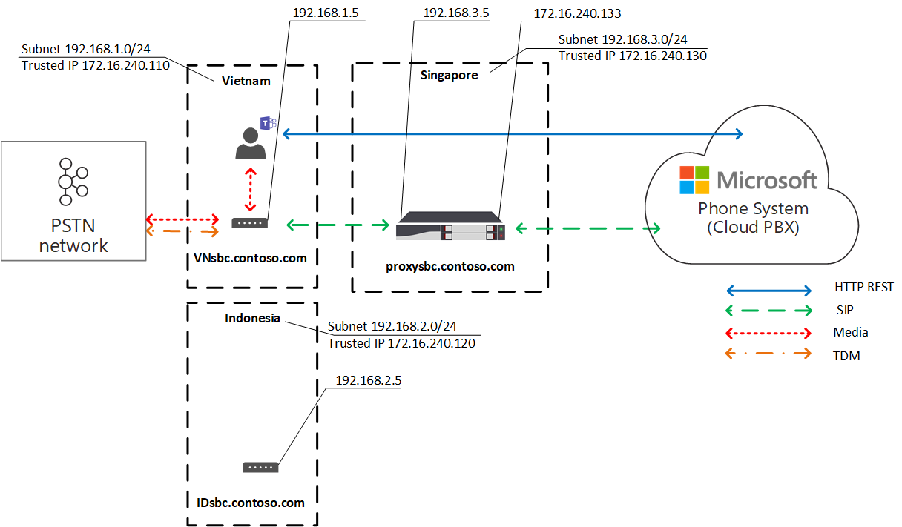

# Планирование оптимизации локальных мультимедиа для прямой маршрутизации

Голосовая связь телефонной сети общего перейти на телефонную сеть (ОКП) считается критически важным бизнес-приложением, которое высоко ожидает качества голосовой связи. Прямая маршрутия позволяет управлять потоками трафика мультимедиа, чтобы вместить большое количество сетевых топорологий и настройки локальных телефоний для различных предприятий по всему миру. 

Оптимизация локальных мультимедиа для прямой маршрутизации позволяет управлять качеством голосовой связи с помощью:

-   Контроль потоков мультимедиа между клиентами Teams и контроллерами границ сеанса клиента.
-   Сохранение локального мультимедиа в пределах подсетей корпоративной сети.
-   Разрешение потоков мультимедиа между клиентами Teams и SBCs, даже если SBCs находятся за корпоративными брандмауэрами с личными IPs и не видны непосредственно корпорации Майкрософт.

Оптимизация локальных мультимедиа поддерживает два сценария:

- Централизованное связывание всех локальных операторов связи через централизованный SBC, подключенный к главному каналу SIP, обеспечивая телефонию во всех локальных филиалах компании.

-   Построение топологии виртуальных сетей на веб-сайте SBCs, где SBCs в локальных филиалах подключены к централизованному прокси-серверу SBC, который виден вам, и общаются с Телефон (Майкрософт) через внешний IP-адрес. В виртуальной топологии сети SBCs, отстояющие от сети, общаются с внутренними виртуальными сетевыми сетями и не видны телефонная система.

В этой статье описаны функциональные возможности функций, сценарии и решения для клиентов. Подробные сведения о конфигурации см. в сведениях [о настройке локальной оптимизации мультимедиа.](direct-routing-media-optimization-configure.md) 

  > [!NOTE]
  > Если вы хотите, чтобы мультимедиа были локальными в пределах интрасети, рекомендуется использовать оптимизацию локальных мультимедиа. Если у вас уже есть обход мультимедиа и вы используете только общедоступные IP-адреса своих компьютеров, переход на локализованную оптимизацию мультимедиа не обязательно. Вы можете продолжать использовать обход мультимедиа. Дополнительные сведения см. в [теме Планирование обхода мультимедиа.](direct-routing-plan-media-bypass.md)

Сведения о том, какие поставщики SBC поддерживают оптимизацию локальных медиаконтроллеров, см. в теме Контроллеры границ сеанса, сертифицированные для [прямой маршрутизации.](direct-routing-border-controllers.md)

## Поддерживаемые сценарии клиентов

Предположим, что Contoso работает с несколькими организациями по всему миру следующим образом. (Обратите внимание, что в качестве примеров используются только регионы Европы и APAC. У компании может быть несколько регионов с похожими требованиями.)
 
- **В Европе** у Contoso есть офисы примерно в 30 странах. У каждого офиса есть свой частный филиал Exchange (УАКС). 

  Contoso предлагается централизованное расположение для всех 30 офисов в Европе (в том числе Для Европы). Компания Contoso развернула SBC вТипе, предоставила достаточно пропускной способности для звонков в централизованном расположении, подключила к централизованным расположениям канал SIP и начала обслуживать все европейские расположения из Канала. 

- **В регионе APAC** contoso имеет несколько офисов в разных странах. 

  Во многих странах в компании по-прежнему есть филиалы местного филиала компании с мультиплексным делением времени (TDM). Централизация туловища TDM не является параметром в регионе APAC, поэтому переключение на SIP невозможно. Предположим, что в регионе APAC есть более 50 филиалов Contoso с сотнями шлюзов. В этом сценарии невозможно при сопряжении всех шлюзов с интерфейсом Direct Routing из-за отсутствия общедоступных IP-адресов и/или разрывов локального интернета. Кроме того, в некоторых странах накладываются нормативные требования, которые невозможно выполнить без подключения к локальной сети ННР.

В зависимости от бизнес-требований Contoso реализовал два решения с помощью локальной оптимизации мультимедиа для прямой маршрутизации:

- **В Европе** все связи централизованы, а потоки мультимедиа между центральной SBC и пользователями основаны на расположении пользователей. 

  - Если пользователь подключен к локальной подсети корпоративной сети (то есть является внутренним), потоки мультимедиа между внутренним IP-адресом центрального SBC и клиентом Teams пользователя. 
  
  - Если пользователь находится за пределами корпоративной сети (например, если он использует беспроводное подключение к Интернету общего доступа), то он считается внешним. В этом случае потоки мультимедиа между внешним IP-адресом центрального клиента SBC Teams клиента.

- В регионе **APAC** централизованный прокси-сервер SBC сопряжен с маршрутикой Microsoft Direct Routing, которая направляет мультимедиа между интерфейсом Direct Routing и SBCs 9stream в локальных филиалах. 

  SBCs верхней части локальных филиалов не видны для прямой маршрутии в APAC, но они связаны с помощью Set-CSOnlinePSTNGateway для создания топологии виртуальной сети в Телефон (Майкрософт) System. Мультимедиа всегда остаются локальными по возможности. Внешние пользователи имеют поток мультимедиа между клиентом Teams и общедоступным IP-адресом прокси-сервера SBC.

## Центральный SBC с централизованной связи

Чтобы создать решение, в котором службы STN предоставляются всем локальным филиалам через единый центральный SBC с подключенной централизованной связью SIP, администратор клиента Contoso примещает один SBC (centralsbc.contoso.com) к службе; К SBC подключена централизованная связь SIP. 

- Когда пользователь находится во внутренней сети компании, SBC предоставляет внутренний IP-адрес SBC для мультимедиа. 

- Если пользователь находится за пределами корпоративной сети, SBC предоставляет внешний (общедоступный) IP-адрес SBC.

> [!NOTE]
> Все значения в примерах, таблицах или схемах представлены только для иллюстрации.

Таблица 1. Примеры сетевых параметров для SBCs 

| Местоположение | SBC FQDN | Внутренняя подсеть | Внешний NAT (надежный IP-адрес) | Внешний IP-адрес SBC | Внутренний IP-адрес SBC |
|:------------|:-------|:-------|:-------|:-------|:-------|
| Амстердам | centralsbc.contoso.com | 192.168.5.0/24 | 172.16.76.73 | 172.16.76.71 | 192.168.5.5 |
| Германия | Не развернуто | 192.168.6.0/24 | 172.16.76.74 | Не развернуто |  Не развернуто |
| Франция | Не развернуто | 192.168.7.0/24 | 172.16.76.75 | Не развернуто |  Не развернуто |

### Внутренний пользователь

На следующей схеме показан поток трафика, когда пользователь подключен к корпоративной сети в его домашнем филиале или на сайте. 

Локальному пользователю назначено локальное филиал в Германии. Пользователь совершает телефонный звонок прямой маршрутизовой Teams.

- Клиент службы Teams пользователя общается с телефонная система через API REST, но мультимедиа, созданные во время звонка, перетекают на внутренний IP-адрес центрального SBC. 

- SBC перенаправляет поток на телефонная система подключенную сеть ПСС. 

- Центральный SBC виден только телефонная система через внешний IP-адрес. 

Схема 1. Поток трафика, когда пользователь находится на домашнем сайте с централизованной SBC и подключенной централизованной связью SIP

### Внешний пользователь

На следующей схеме показан поток трафика, если пользователь не является локальной и не подключен к корпоративной сети (то есть устройство пользователя подключено к Интернету с помощью мобильного устройства или открытой сети Wi-Fi). Пользователь звонит по прямой маршрутике с помощью Teams:

- Клиент клиента Teams пользователя общается с телефонная система через API REST, но в данном случае мультимедиа, созданные во время звонка, перетекают на внешний IP-адрес центрального SBC. 

- SBC перенаправляет поток на телефонная система подключенную сеть ПСС. 

- Центральный SBC виден только телефонная система через внешний IP-адрес. 

В этом случае поведение аналогично тому, как пользователь является локальным в филиале в Германии или в любом другом филиале. Пользователь считается внешним, так как он находится за пределами корпоративной сети.

Схема 2. Поток трафика, когда пользователь является внешним с централизованной SBC и подключенной централизованной связью SIP

## Proxy SBC with connected downstream SBCs

Чтобы создать решение, в котором службы STN предоставляются во всех локальных филиалах в регионе APAC, где централизация линии TDM не является возможностью, администратор Contoso примещает один SBC (proxysbc.contoso.com) к службе прямой маршрутизации. 

После этого администратор Contoso добавит несколько SBCs, которые будут выводиться вниз, о том, что с них можно получить proxysbc.contoso.com. У SBCs downstream нет общедоступных ИП, но их можно на назначены голосовым маршрутам. В таблице ниже показаны примеры сетевых параметров и конфигурации.

Когда пользователь находится в локальном филиале, где находится SBC по 9 потокам, поток медиапотока между ним и локальным сетным SBC напрямую. Если пользователь находится за пределами офиса (в общедоступных интернет-службах), мультимедиа перетекают от него на общедоступный IP-адрес прокси-сервера SBC, который прокси-сервер передает его соответствующим SBC-серверам.

Таблица 2. Пример сведений о сети SBC

| Местоположение | SBC FQDN | Внутренняя подсеть | Внешний NAT (надежный IP-адрес) | Внешний IP-адрес SBC  | Внутренний IP-адрес SBC |
|:------------|:-------|:-------|:-------|:-------|:-------|
| Вьетнам | VNsbc.contoso.com | 192.168.1.0/24 | 172.16.240.110 | Нет |  192.168.1.5 |
| Индонезия  | IDsbc.contoso.com | 192.168.2.0/24 | 172.16.240.120 | Нет |  192.168.2.5 |
| Сингапур | proxysbc.contoso.com |   192.168.3.0/24 | 172.16.240.130 | 172.16.240.133 | 192.168.3.5 |

### Внутренний пользователь 

На следующей схеме показан высокоуровневый трафик для сценария, когда пользователь находится в офисе в регионе APAC. Пользователь, который является локальным филиалом местного филиала во Вьетнаме, совершает телефонный звонок с прямой маршрутией через Teams. 

- Клиент Teams пользователя общается с телефонная система через API REST, но мультимедиа, созданные во время звонка, перетекают на внутренний IP-адрес локального SBC.

- Локализованный сервер SBC перенаправляет поток на прокси-сервер SBC в Сингапуре и в подключенную локовую сеть STN.

-  Прокси-сервер SBC виден телефонная система через внешний IP-адрес и маршрутит поток от SBC вниз (в данном случае с локального SBC во Вьетнаме) на телефонная система. 

- SBC в локальном филиале не виден непосредственно телефонная система, но отображается в топологии виртуальной сети, которая определена администратором Contoso при настройке оптимизации локальных мультимедиа.

> [!NOTE]
> Поведение может быть другим для локальных и не локальных пользователей в зависимости от настроенного режима оптимизации локальных мультимедиа. 

Дополнительные сведения о возможных режимах и релевантном поведение см. в этой теме.

Схема 3. Поток трафика, когда пользователь находится в домашней сети с прокси-сервером SBC и подключенными 9-ми сетными компьютерами 

### Внешний пользователь

На следующей схеме показан поток трафика, когда пользователь находится за пределами корпоративной сети. Пользователь не является локальной (не находится в пределах корпоративной сети). Пользователь звонит прямой маршрутизовой Teams на телефонный номер во Вьетнаме. 

- Клиент Teams пользователя общается с телефонная система через API REST, но мультимедиа, созданные во время звонка, сначала перетекают на внешний IP-адрес прокси-сервера SBC в Сингапуре. 

- С учетом политик конфигурации  и голосовой почты (подробные сведения см. в настройках локальной оптимизации мультимедиа) прокси-сервер SBC перенаправляет поток на SBC вниз во Вьетнаме. 

- Ост.SBC во Вьетнаме перенаправляет поток на подключенную локскую сеть ПСС. 

- Прокси-сервер SBC виден только телефонная система через внешний IP-адрес.

-  SBC в локальном филиале не виден непосредственно телефонная система, но отображается в топологии виртуальной сети, определяемой администратором Contoso при настройке оптимизации локальных мультимедиа. В этом примере пользователь считается внешним, так как он находится за пределами корпоративной сети. 

Схема 4. Поток трафика, когда пользователь является внешним с прокси-сервером SBC и подключенными 9-ми вниз SBCs

## Локальные режимы оптимизации мультимедиа

Оптимизация локальных мультимедиа поддерживает два режима:

- **Режим 1. Всегда обходить**. В этом случае, если пользователь является внутренним, мультимедиа будут проходить через внутренний IP-адрес локального 9-го потока SBC независимо от фактического расположения внутреннего пользователя; Например, в том же филиале, где расположена SBC по направлению вниз, или в другом филиале.  

- **Режим 2. Только для локальных пользователей.** В этом режиме мультимедиа будут поступать непосредственно на внутренний IP-адрес локального 9-го потока SBC только в том случае, если его создает внутренний пользователь, расположенный в том же филиале, что и у SBC ниже. 

Чтобы различать локальные режимы оптимизации мультимедиа, администратору клиента необходимо установить для параметра -BypassMode параметр "Всегда" или "OnlyForLocalUsers" для каждого SBC с помощью командлета Set-CSonlinePSTNGateway. Дополнительные сведения см. [в настройках оптимизации локальных мультимедиа.](direct-routing-media-optimization-configure.md)  

> [!NOTE]
> Если пользователь является внутренним, требуется подключение мультимедиа между пользователем и SBC по внутреннему IP-адресу. В этом случае от ретрансляторов общественного транспорта для мультимедиа не должно быть отката, так как SBC предоставляет внутренний IP-адрес для подключения к мультимедиа. 

### Режим 1. Всегда обходить

Если у вас хорошее подключение между филиалами, рекомендуемый режим — Всегда обходить.
 
Предположим, у компании есть централизованная связь SIP в Стране, которая обслуживает 30 стран и имеет хорошее подключение между всеми 30 сайтами и локальными пользователями. Кроме того, в Германии есть ветвь, в которой развернут локальный SBC.

SBC в Германии можно настроить в режиме "Всегда обходить". Пользователи независимо от их расположения подключаются к SBC напрямую через внутренний IP-адрес SBC (например, из Франции в Германия; см. схему ниже для справки).

Ниже описаны два сценария.

- Сценарий 1. Пользователь находится в том же расположении, что и SBC, определенное в политике маршрутации голосовой почты в Интернете.

- Сценарий 2. Пользователи и шлюзы находятся на разных сайтах.

#### Сценарий 1. Пользователь находится в том же расположении, что и SBC, определенное в политике маршрутации голосовой почты в Интернете.

SBC в Приац настроен как прокси-сервер SBC для локального 9-го ходящего SBC в Германии. Пользователь находится в Германии в той же подсети, что и корпоративная сеть локального SBC. Оба SBCs (прокси-сервер и вниз) настроены для режима всегда обходить. Политики маршрутизировать голосовую сеть в Интернете определяют, что в случае звонков в Германии (с кодом города +49) они должны быть перенана которые должны маршрутизироваться на локальный SBC в Германии. Все остальные звонки ( и в случае сбой SBC в Германии, звонки в Германии) должны перенаправляться на прокси-сервер SBC в Германии. В таблице ниже подведены итоги конфигурации примера. 

Таблица 3. Пример конфигурации для сценария 1

| Физическое местонахождение пользователя | Пользователь звонит на номер | Политика маршрутинга голосовой почты в Интернете | Режим, настроенный для SBC | Media Flow | 
|:------------|:-------|:-------|:-------|:-------|
| Германия | +49 1 437 2800 | Приоритет 1: ^ \+ 49(\d {8} )$ -DEsbc.contoso.com Приоритет 2: .* — proxysbc.contoso.com| DEsbc.contoso.com — всегда обходить  proxysbc.contoso.com — всегда обходить | Teams пользовательских <-> DEsbc.contoso.com |

На приведенной ниже схеме показан высокоуровневый трафик, с помощью который внутренний пользователь в Германии звонит по прямому маршруту через Teams на номер в Германии. 

- Клиент Teams пользователя общается с телефонная система через REST API. 

- Мультимедиа, созданные во время звонка, перетекают на внутренний IP-адрес локального SBC. 

- Локализованный сервер SBC перенаправляет поток на прокси-сервер SBC в Городе и в подключенную локскую сеть STN. 

- Прокси-сервер SBC виден телефонная система через внешний IP-адрес и маршрутит поток от данной SBC (в данном случае с локального SBC в Германии) на телефонная система. 

- SBC в локальном филиале не виден непосредственно телефонная система, но отображается в топологии виртуальной сети, которая определена администратором Contoso при настройке оптимизации локальных мультимедиа.

Схема 5.  Поток трафика в режиме "Всегда обходить" и пользователь находится на домашнем сайте

#### Сценарий 2. Пользователи и шлюзы находятся на разных сайтах

SBC в Приац настроен как прокси-сервер SBC для локального 9-го ходящего SBC в Германии. Оба SBCs (прокси-сервер и вниз) настроены для режима всегда обходить. Внутренний пользователь во Франции, расположенный в локальном филиале, звонит в Напрямую в Германии. Политики маршрутизов голосовой связи в Интернете определяют, что звонки в Германия (с кодом города +49) должны перенаться в местный SBC в Германии. Все остальные звонки (и в случае сбой SBC в Германии) должны перенаправиться на прокси-сервер SBC в Германии. В таблице ниже подведены итоги конфигурации примера. 

Таблица 4. Пример конфигурации для сценария 2

| Физическое местонахождение пользователя | Пользователь звонит на номер | Политика маршрутинга голосовой почты в Интернете | Режим, настроенный для SBC | Media Flow | 
|:------------|:-------|:-------|:-------|:-------|
| Франция | +49 1 437 2800 | Приоритет 1: ^ \+ 49(\d {8} )$ -DEsbc.contoso.com  Приоритет 2: .* — proxysbc.contoso.com |  DEsbc.contoso.com — всегда обходить proxysbc.contoso.com — всегда обходить | Teams пользовательских < – > DEsbc.contoso.com  |

На следующей схеме показан высокоуровневый трафик, когда внутренний немецкий пользователь, расположенный во Франции, совершает прямой звонок маршрутизов через Teams на номер в Германии. 

- Клиент Teams пользователя общается с телефонная система через REST API.

- Мультимедиа, созданные во время звонка, перетекают непосредственно в SBC на внутренний IP-адрес Германии. 

- SBC в Германии перенаправляет поток на прокси-сервер SBC в Городе и в подключенную локовую сеть STN. 

Схема 6.  Поток трафика в режиме "Всегда обходить" и пользователь находится не на домашнем сайте, а во внутренней сети

### Режим 2. Только для локальных пользователей

Если между локальными филиалами существуют плохие подключения, но между каждым локальным и региональным филиалами есть хорошие подключения, рекомендуется использовать режим "Только для локальных пользователей".

Например, предположим, что в регионе APAC у Contoso несколько офисов в разных странах. Во многих странах переход на SIP невозможен, так как у компании по-прежнему есть связи TDM во многих местных филиалах. Централизация туловища TDM не является параметром в регионе APAC. Кроме того, в регионе APAC есть более 50 филиалов Contoso с сотнями шлюзов. 

Чтобы создать решение, в котором службы STN предоставляются во всех локальных филиалах в регионе APAC, где централизованные линии связи TDM не являются вариантом, администратор Contoso примещает один региональный SBC в Сингапуре как прокси-сервер SBC к службе прямой маршрутизации. Прямое подключение между филиалами местных филиалов плохое, но между каждым локальным филиалом и региональным офисом SBC в Сингапуре существует хорошая связь. Для региональных служб SBC администратор выбирает режим "Всегда обходить", а для локальных SBCs с последующим доступом — режим "Только для локальных пользователей".

Ниже описаны два сценария.

- Сценарий 1. Пользователь находится в том же расположении, что и SBC, определенное в политике маршрутации голосовой почты в Интернете.

- Сценарий 2. Пользователи и шлюзы находятся на разных сайтах

#### Сценарий 1. Пользователь находится в том же расположении, что и SBC, определенное в политике маршрутации голосовой почты Online.

Предположим, что SBC в Сингапуре настроен как прокси-сервер SBC для локальных SBCs downstream во Вьетнаме и Индонезии. Пользователь находится во Вьетнаме в том же расположении, что и местный SBC. Политики маршрутизов голосовой связи в Интернете определяют, что звонки во Вьетнаме (с кодом города +84) должны перенаться в местный номер SBC во Вьетнаме. Все остальные звонки ( и, если SBC во Вьетнаме не проходит, звонки во Вьетнаме должны быть перенаправлиться на прокси-сервер SBC в Сингапуре. В таблице ниже подведены итоги конфигурации примера. 

Таблица 5. Пример конфигурации для режима "Только для локальных пользователей", сценарий 1

| Физическое местонахождение пользователя | Пользователь звонит на номер | Политика маршрутинга голосовой почты в Интернете | Режим, настроенный для SBC | Media Flow | 
|:------------|:-------|:-------|:-------|:-------|
| Вьетнам | +84 4 3926 3000 | Приоритет 1: ^ \+ 84(\d {9} )$ -VNsbc.contoso.com  Приоритет 2: .* — proxysbc.contoso.com | VNsbc.contoso.com — только для локальных пользователей   proxysbc.contoso.com — всегда обходить | Teams пользовательских <–> VNsbc.contoso.com |

На приведенной ниже схеме пользователь, который назначен локальному филиалу вьетнамского филиала, совершает телефонный звонок прямой маршрутизовой маршрутизов через Teams. 

- Клиент Teams пользователя общается с телефонная система через REST API. 

- Мультимедиа, генерируемые во время звонка, перетекают на внутренний IP-адрес локального SBC. 

- Локализованный сервер SBC перенаправляет поток на прокси-сервер SBC в Сингапуре и в подключенную локовую сеть STN. 

- Прокси-сервер SBC виден телефонная система через внешний IP-адрес и маршрутит поток от SBC (в данном случае с локального SBC во Вьетнаме) на телефонная система. 

- SBC верхней части локального филиала не виден непосредственно телефонная система, но отображается в топологии виртуальной сети.

Схема 7. Поток трафика с режимом "Только для локальных пользователей", а пользователь находится на домашнем сайте

#### Сценарий 2. Пользователи и шлюзы находятся на разных сайтах

Предположим, что SBC в Сингапуре настроен как прокси-сервер SBC для локальных SBCs downstream во Вьетнаме и Индонезии. Внутренний пользователь в Индонезии, расположенный в локальном филиале, звонит прямой маршрутизов в Вьетнам. Политики маршрутизов голосовой связи в Интернете определяют, что звонки в Вьетнам (с кодом города +84) должны перенаться в местный SBC во Вьетнаме. Все остальные звонки ( и в случае сбой SBC во Вьетнаме ) должны быть перенаправляться на прокси-сервер SBC в Сингапуре. Для прокси-сервера SBC в Сингапуре установлен режим "Всегда обходить", а для локального SBC во Вьетнаме — режим "Только для локальных пользователей". В таблице ниже подведены итоги конфигурации примера. 

Таблица 6. Пользовательская конфигурация

| Физическое местонахождение пользователя | Пользователь звонит на номер | Политика маршрутинга голосовой почты в Интернете | Режим, настроенный для SBC | Media Flow | 
|:------------|:-------|:-------|:-------|:-------|
| Индонезия | +84 4 3926 3000 | Приоритет 1: ^ \+ 84(\d {9} )$ -VNsbc.contoso.com   Приоритет 2: .* — proxysbc.contoso.com |VNsbc.contoso.com — только для локальных пользователей   proxysbc.contoso.com — всегда обходить | Teams пользовательских <-> proxysbc.contoso.com <–> VNsbc.contoso.com |

На следующей схеме внутренний пользователь, находясь в филиале индонезийского филиала, звонит прямой маршрутизов Teams на номер во Вьетнаме. 

- Клиент Teams пользователя общается с телефонная система через REST API.

- Media generated during the call flows to proxy SBC's internal IP address first. 

- Прокси-сервер SBC в Сингапуре перенаправляет поток на внутренний IP-адрес 9-го потока SBC во Вьетнаме и телефонная система. 

- SBC Downstream во Вьетнаме маршрутит поток к подключенной локальной сети STN. 

- Прокси-сервер SBC виден только телефонная система через внешний IP-адрес.

- SBCs downstream в локальных филиалах не видны непосредственно телефонная система но соотносится с топологией виртуальной сети.

Схема 8.  Поток трафика в режиме "Только для локальных пользователей", а пользователь находится не на домашнем сайте, а во внутренней сети

## Известные проблемы

Ниже представлен список известных проблем, которые в настоящее время присутствуют в рамках оптимизации локальных мультимедиа. Корпорация Майкрософт работает над решением этих проблем.

| Ошибка | Решение |
| :--- | :--- |
| Teams не является внутренним,  если общедоступный IP-Teams соответствует списку доверенных IP-адресов клиента. | Для оптимизации локальных мультимедиа требуется, чтобы Teams подсети клиента соответствует сетевой подсети, настроенной [клиентом.](/powershell/module/skype/new-cstenantnetworksubnet)|
| Когда клиент Teams как внутренний, вызовы Teams звонков.| Отключить оптимизацию локальных мультимедиа в SBC direct Routing.|
| При звонках между внутренними клиентами может быть от 1 до 1 звонков, что приводит к сбросу звонков с внешним клиентом или ресурсом. | Идет работа над исправлением. Вы также можете отключить оптимизацию локальных мультимедиа на SBC Direct Routing.|
| Teams пользователь помещает звонок на удержание. Музыка воспроизводится на конце ДНР, и работает оптимизация локальных мультимедиа. Пользователь Teams возобновляет звонок. Звонок на ОКП возобновляется, но оптимизация локальных мультимедиа не работает, а звонок продолжается через центр (прокси-сервер) SBC. | Когда пользователь начинает звонок, чтобы инициировать музыку на удержании, она переадрится с 1:1 на многоэтапный звонок контроллера зова для вызова контроллера мультимедиа и процессора мультимедиа (который является миксером AVMCU), через который MoH достигает пользователя, поставленного на удержание. Де-фактуация до звонка 1:1 после возобновления никогда не происходит в обычном случае. Отключить оптимизацию локальных мультимедиа в SBC direct Routing.|
|Пока звонок устанавливается в течение нескольких секунд, пользователь может услышать тишину.| Из-за сложности архитектуры local Media Optimization это может произойти в некоторых случаях.|
|Голосовые приложения (например, автоотекатарь, очередь вызовов) не работают.| LMO не поддерживает голосовые приложения, так как они находятся в облаке и требуют внешнего подключения. В настоящее время обходного пути нет.|
