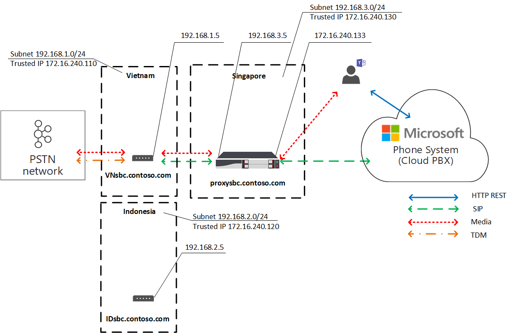

# Оптимизация локальных мультимедиа для прямой маршрутизации

Голосовая связь телефонной сети общего перейти на телефонную сеть (ННР) считается критически важным приложением, которое ожидает высокого качества голосовой связи. Прямая маршрутия позволяет контролировать потоки трафика мультимедиа, чтобы вместить различные сетевые топорологии и настройки локальных телефонов для различных предприятий по всему миру. 

Оптимизация локальных мультимедиа для прямой маршрутизации позволяет управлять качеством голоса с помощью:

-   Контроль потоков мультимедиа между клиентами Teams и клиентские граничные контроллеры сеанса (SBCs).
-   Локальное сохранение мультимедиа за границами подсетей корпоративной сети.
-   Разрешить потоки мультимедиа между клиентами Teams и SBCs, даже если SBCs находятся на корпоративных брандмауэрах с личными IPS и не видны непосредственно корпорации Майкрософт.

Оптимизация локальных мультимедиа поддерживает два сценария:

- Центризация всех локальных операторов связи через централизованную связь через SBC, подключенную к основной телефонной связи SIP, обеспечивая телефонные службы для всех локальных филиалов компании.

-   Построение виртуальной топологии сетей на основе подключения КБК в локальных филиалах к централизованному прокси-серверу SBC, который виден и с которой можно связываться, через внешний IP-адрес телефонной системы Майкрософт. В виртуальной топологии сети внутренние SBCs общаются с внутренними IPS и не видны непосредственно телефонной системе.

В этой статье описаны функциональные возможности функций, сценарии и решения для клиентов. Подробные сведения о конфигурации см. в [сведениях о настройке локальной оптимизации мультимедиа.](direct-routing-media-optimization-configure.md) 

  > [!NOTE]
  > Если вы хотите, чтобы мультимедиа были локальными в пределах интрасети, рекомендуется использовать оптимизацию локальных мультимедиа. Если у вас уже есть обход мультимедиа и вы используете только общедоступные IP-адреса ваших SBCs, переходить на процедуру оптимизации локальных мультимедиа не обязательно. Вы можете продолжать использовать обход мультимедиа. Дополнительные сведения см. в плане [обхода мультимедиа.](direct-routing-plan-media-bypass.md)

## Поддерживаемые сценарии для клиентов

Предположим, что Contoso работает с несколькими организациями по всему миру следующим образом. (Обратите внимание, что в качестве примеров используются только регионы Европы и ApAC. У компании может быть несколько регионов с похожими требованиями.)
 
- **В Европе** у Contoso есть офисы приблизительно в 30 странах. У каждого офиса есть собственная частная ветвь Exchange (УАКС). 

  Для всех 30 европейских офисов в Contoso предлагалась возможность централизованного централизации туловища в одном месте — в Москве — в Москве. Компания Contoso развернула SBC в Интервале, при этом предоставляла достаточное количество пропускной способности для звонков через централизованное расположение, подключила центральная телефонная связь SIP к централизованным расположениям и начала обслуживать все европейские расположения из Интервала. 

- **В регионе APAC** contoso имеет несколько офисов в разных странах. 

  Во многих странах в компании по-прежнему есть магистрали для деления времени (TDM) в местных филиалах компании. Централизация магистрали TDM не является возможностью в регионе APAC, поэтому переключение на SIP невозможно. Предположим, что в регионе APAC есть более 50 филиалов Contoso с сотнями шлюзов. В этом сценарии невозможно на сопряжение всех шлюзов с интерфейсом прямой маршрутинга из-за отсутствия общедоступных IP-адресов и /или локальных разрывов подключения к Интернету. Кроме того, в некоторых странах накладываются нормативные требования, которые невозможно выполнить без подключения к локальной сети ДНР.

В зависимости от бизнес-требований компания Contoso реализовала два решения с локальной оптимизацией мультимедиа для прямой маршрутизации:

- **В Европе** все связи централизованы, а потоки мультимедиа между центральной SBC и пользователями основаны на расположении пользователей. 

  - Если пользователь подключен к локальной подсети корпоративной сети (то есть он является внутренним), потоки мультимедиа между внутренним IP-адресом центральной SBC и клиентом Teams пользователя. 
  
  - Если пользователь находится за границами корпоративной сети (например, если он использует беспроводное подключение к Интернету общего доступа), пользователь считается внешним. В этом случае потоки мультимедиа между внешним IP-адресом центрального клиента SBC и клиентом Teams.

- В регионе **APAC** централизованный прокси-сервер сопряжен с маршрутикой Microsoft Direct Routing, которая направляет мультимедиа между интерфейсом Direct Routing и 9stream SBCs в локальных филиалах. 

  Перейти к верхней части SBCs в локальных филиалах не видно непосредственно для прямой маршрутики в APAC, но они связаны с помощью Set-CSOnlinePSTNGateway для создания виртуальной топологии сети в телефонной системе Майкрософт. Мультимедиа всегда остаются локальными, когда это возможно. Внешние пользователи имеют поток мультимедиа между клиентом Teams и общедоступным IP-адресом прокси-сервера SBC.

## Центральный SBC с централизованной магистралью

Чтобы создать решение, в котором службы STN предоставляются всем локальным филиалам через единый центр SBC с подключенной централизованной связью SIP, администратор клиента Contoso связывает одну SBC (centralsbc.contoso.com) со службой. К SBC подключена централизованная магистраль SIP. 

- Когда пользователь находится во внутренней сети компании, СДВ предоставляет внутренний IP-адрес SBC для мультимедиа. 

- Если пользователь находится за пределами корпоративной сети, SBC предоставляет внешний (общедоступный) IP-адрес SBC.

Примечание. Все значения в примерах, таблицах или схемах представляются только для иллюстрации.

Таблица 1. Примеры параметров сети для SBCs 

| Местоположение | SBC FQDN | Внутренняя подсеть | Внешний NAT (доверенный IP-адрес) | Внешний IP-адрес SBC | Внутренний IP-адрес SBC |
|:------------|:-------|:-------|:-------|:-------|:-------|
| Амстердам | centralsbc.contoso.com | 192.168.5.0/24 | 172.16.76.73 | 172.16.76.71 | 192.168.5.5 |
| Германия | Не развернуто | 192.168.6.0/24 | 172.16.76.74 | Не развернуто |  Не развернуто |
| Франция | Не развернуто | 192.168.7.0/24 | 172.16.76.75 | Не развернуто |  Не развернуто ||||

### Внутренний пользователь

На следующей схеме показан поток трафика, когда пользователь подключен к корпоративной сети в его домашнем филиале или на сайте. 

Локально пользователю назначено локальное филиал в Германии. Пользователь совершает прямой маршрутинг телефонного звонка через Teams.

- Клиент Teams пользователя взаимодействует с телефонной системой напрямую через REST API, но мультимедиа, созданные во время звонка, перетекают на внутренний IP-адрес центрального SBC. 

- SBC перенаправляет поток в телефонную систему и подключенную сеть ННП. 

- Центральная телефонная система будет видна только по внешнему IP-адресу. 

Схема 1. Поток трафика, когда пользователь находится на домашнем сайте с централизованной SBC и подключенной централизованной связью SIP-связи

### Внешний пользователь

На следующей схеме показан поток трафика, когда пользователь не является локальной и не подключен к корпоративной сети (то есть устройство пользователя подключено к Интернету с помощью мобильного устройства или общедоступных сетей Wi-Fi). Пользователь совершает прямой маршрутинг телефонного звонка через Teams:

- Клиент Teams пользователя взаимодействует с телефонной системой напрямую через REST API, но в данном случае мультимедиа, созданные во время звонка, перетекают на внешний IP-адрес центрального SBC. 

- SBC перенаправляет поток в телефонную систему и подключенную сеть ННП. 

- Центральная телефонная система будет видна только по внешнему IP-адресу. 

В этом случае поведение будет аналогичным вне зависимости от того, является ли пользователь локальным для филиала в Германии или другого филиала. Пользователь считается внешним, так как находится за границами корпоративной сети.

Схема 2. Поток трафика, если пользователь является внешним с централизованной SBC и подключенной централизованной связью SIP-связи

## Прокси-сервер SBC с подключенными вниз SBCs

Чтобы создать решение, в котором службы STN предоставляются во всех локальных филиалах региона APAC, где централизованные линии связи TDM не являются вариантами, администратор Contoso парил одну SBC (proxysbc.contoso.com), также называемую прокси-сервером SBC, со службой прямой маршрутизации. 

После этого администратор Contoso добавит несколько серверов SBCs, которые будут прокси-серверами, которые будут прокси-серверами proxysbc.contoso.com. У SBCs downstream нет общедоступных IP, но их можно на назначены голосовым маршрутам. В таблице ниже показаны примеры параметров сети и конфигурации.

Если пользователь находится в локальном филиале, где находится 9-й SBC, поток медиапотока между ним и локальным 9-х сетным филиалом SBC напрямую. Если пользователь находится за пределами офиса (в общедоступных интернет-службах), потоки мультимедиа перетекают от него на общедоступный IP-адрес прокси-сервера SBC, который прокси-сервера прокси-серверов передается на соответствующие сетные серверы SBC.

Таблица 2. Пример сетевой информации SBC

| Местоположение | SBC FQDN | Внутренняя подсеть | Внешний NAT (доверенный IP-адрес) | Внешний IP-адрес SBC  | Внутренний IP-адрес SBC |
|:------------|:-------|:-------|:-------|:-------|:-------|
| Вьетнам | VNsbc.contoso.com | 192.168.1.0/24 | 172.16.240.110 | Нет |  192.168.1.5 |
| Индонезия  | IDsbc.contoso.com | 192.168.2.0/24 | 172.16.240.120 | Нет |  192.168.2.5 |
| Сингапур | proxysbc.contoso.com |   192.168.3.0/24 | 172.16.240.130 | 172.16.240.133 | 192.168.3.5 |

### Внутренний пользователь 

На следующей схеме показан высокоуровневый поток трафика для сценария, когда пользователь находится внутри офиса в регионе APAC. Пользователь, который назначен локальному филиалу во Вьетнаме, совершает прямой маршрутный звонок через Teams. 

- Клиент Teams пользователя взаимодействует с телефонной системой непосредственно через REST API, но мультимедиа, созданные во время звонка, будут перенаться на внутренний IP-адрес локального SBC.

- Локализованная SBC перенаправляет поток на прокси-сервер SBC в Сингапуре и в подключенную локализованную сеть STN.

-  Прокси-сервер SBC виден телефонной системе только через внешний IP-адрес и маршрутит поток из направлений направлений SBC (в данном случае — местный SBC во Вьетнаме) в телефонную систему. 

- Теневая SBC в локальном филиале не видна непосредственно телефонной системе, а отображается в топологии виртуальной сети, которая определена администратором Contoso при настройке local Media Optimization.

Примечание. Поведение может быть другим для локальных и неместного пользователей в зависимости от настроенного режима оптимизации локальных мультимедиа. 

Дополнительные сведения о возможных режимах и релевантном поведение см. в подмносяке "Настройка оптимизации локальных мультимедиа".

Схема 3. Поток трафика, когда пользователь находится в домашней сети с прокси-сервером SBC и подключенными сетными УАС 

### Внешний пользователь

На следующей схеме показан поток трафика, когда пользователь находится за пределами границ корпоративной сети. Пользователь не является локальной (не находится в пределах корпоративной сети). Пользователь совершает прямой маршрутинг телефонного звонка через Teams на телефонный номер во Вьетнаме. 

- Клиент Teams пользователя взаимодействует с телефонной системой непосредственно через REST API, но мультимедиа, созданные во время звонка, сначала перетекают на внешний IP-адрес прокси-сервера SBC в Сингапуре. 

- В зависимости от конфигурации  и политик голосовой почты (подробные сведения см. в сведениях о настройке локальной оптимизации мультимедиа), прокси-сервер SBC перенаправляет поток на ходящийся ниже сервер SBC во Вьетнаме. 

- Ходящий SBC во Вьетнаме перенаправляет поток к подключенной локальной сети STN. 

- Прокси-сервер SBC будет виден телефонной системе только по внешнему IP-адресу.

-  Теневая SBC в локальном филиале не видна непосредственно телефонной системе, но соповодится с топологией виртуальной сети, которая определена администратором Contoso при настройке local Media Optimization. В этом примере пользователь считается внешним, так как находится за границами корпоративной сети. 

Схема 4. Поток трафика, если пользователь является внешним с прокси-сервером SBC и подключенными вниз компьютерами

## Локальные режимы оптимизации мультимедиа

Локализованная оптимизация мультимедиа поддерживает два режима:

- **Режим 1. Всегда обходить.** В этом случае, если пользователь является внутренним, то поток мультимедиа будет проходить через внутренний IP-адрес локального 9-го 9-го SBC независимо от фактического расположения внутреннего пользователя. Например, в том же филиале, где находится ходящий SBC, или в другом филиале.  

- **Режим 2. Только для локальных пользователей.** В этом режиме мультимедиа будут перенатекать напрямую на внутренний IP-адрес локального 9-го направлений SBC только в том случае, если внутренний пользователь находится в том же филиале, что и 9-й SBC. 

Чтобы различать режимы оптимизации локальных мультимедиа, администратор клиента должен с помощью командлета Set-CSonlinePSTNGateway установить для параметра -BypassMode параметр "Always" или "OnlyForLocalUsers". Дополнительные сведения см. в [подстройке "Настройка локальной оптимизации мультимедиа".](direct-routing-media-optimization-configure.md)  

 > [!NOTE]
  > Если пользователь является внутренним, требуется подключение мультимедиа между пользователем и SBC по внутреннему IP-адресу. В этом случае нельзя использовать ретрансляторы общественного транспорта, так как SBC будет предоставлять внутренний IP-адрес для подключения к мультимедиа. 

### Режим 1. Всегда обходить

Если у вас хорошее подключение к филиалам, рекомендуется использовать режим "Всегда обходить".
 
Предположим, например, что у компании есть централизованная магистраль SIP в Амстердаме, которая обслуживает 30 стран и имеет хорошее подключение между всеми 30 сайтами и локальными пользователями. Кроме того, в Германии имеется ветвь, в которой развернут локальный SBC.

SBC в Германии можно настроить в режиме "Всегда обходить". Пользователи независимо от своего расположения будут подключаться к SBC напрямую через внутренний IP-адрес SBC (например, из Франции в Германия; см. приведенную ниже схему для справки).

Ниже описаны два сценария.

- Сценарий 1. Пользователь находится в том же расположении, что и SBC, определенное в политике маршрутации голосовой почты.

- Сценарий 2. Пользователи и шлюзы находятся на разных сайтах.

#### Сценарий 1. Пользователь находится в том же расположении, что и SBC, определенное в политике маршрутации голосовой почты в Интернете.

SBC в Сервереве Настроен как прокси-сервер SBC для локального 9-го 9-го SBC в Германии. Пользователь находится в Германии в той же подсети, что и корпоративная сеть местной SBC. Обе SBCs (прокси-сервер и последующий поток) настроены для режима "Всегда обходить". Политики сетевой маршрутизировать голосовую маршрутку определяют, что при звонках в Германии (с кодом города +49) они должны маршрутизироваться на местный номер SBC в Германии. Все другие звонки (и в случае сбой SBC в Германии) должны быть перенаправляться на прокси-сервер SBC в Швейцарии. В таблице ниже подытоживается пример конфигурации. 

Таблица 3. Пример конфигурации для сценария 1

| Физическое местонахождение пользователя | Пользователь звонит на номер | Политика маршрутинга голосовой почты в Интернете | Режим, настроенный для SBC | Поток мультимедиа | 
|:------------|:-------|:-------|:-------|:-------|
| Германия | +49 1 437 2800 | Приоритет 1: ^ \+ 49(\d {8} )$ -DEsbc.contoso.com Приоритет 2: .* — proxysbc.contoso.com| DEsbc.contoso.com – всегда обходить  proxysbc.contoso.com – всегда обходить | Пользовательские < Teams > DEsbc.contoso.com |

На приведенной ниже схеме показан высокоуровневый трафик внутреннего пользователя в Германии, который звонит прямой маршрутизов в Teams на номер в Германии. 

- Клиент Teams пользователя общается с телефонной системой непосредственно через REST API. 

- Мультимедиа, генерируемые во время звонка, перетекают на внутренний IP-адрес локального SBC. 

- Локализованная SBC перенаправляет поток на прокси-сервер SBC в Мичигане и подключенную локализованную сеть STN. 

- Прокси-сервер SBC виден телефонной системе только через внешний IP-адрес и маршрутит поток от экономной SBC (в данном случае с локальной SBC в Германии) на телефонную систему. 

- Теневая SBC в локальном филиале не видна непосредственно телефонной системе, а отображается в топологии виртуальной сети, которая определена администратором Contoso при настройке local Media Optimization.

Схема 5.  Поток трафика в режиме "Всегда обходить" и пользователь находится на домашнем сайте

#### Сценарий 2. Пользователи и шлюзы находятся на разных сайтах

SBC в Сервереве Настроен как прокси-сервер SBC для локального 9-го 9-го SBC в Германии. Обе SBCs (прокси-сервер и последующий поток) настроены для режима "Всегда обходить". Внутренний пользователь во Франции, расположенный в локальном филиале, звонит в Германии прямой маршрут. Политики сетевой маршрутизировать голосовые маршруты определяют, что звонки в Германия (с кодом города +49) должны маршрутизироваться на местный номер SBC в Германии. Все другие звонки (и в случае сбой SBC в Германии) все звонки в Германии должны перенаправляться на прокси-сервер SBC в Швейцарии. В таблице ниже подытоживается пример конфигурации. 

Таблица 4. Пример конфигурации для сценария 2

| Физическое местонахождение пользователя | Пользователь звонит на номер | Политика маршрутинга голосовой почты в Интернете | Режим, настроенный для SBC | Поток мультимедиа | 
|:------------|:-------|:-------|:-------|:-------|
| Франция | +49 1 437 2800 | Приоритет 1: ^ \+ 49(\d {8} )$ -DEsbc.contoso.com  Приоритет 2: .* — proxysbc.contoso.com |  DEsbc.contoso.com – Всегда proxysbc.contoso.com — всегда обходить | Пользовательский < Teams — > DEsbc.contoso.com  |

На следующей схеме показан высокоуровневый трафик, когда внутренний немецкий пользователь из Франции совершает прямой маршрутный телефонный звонок через Teams на номер в Германии. 

- Клиент Teams пользователя общается с телефонной системой непосредственно через REST API.

- Мультимедиа, генерируемые во время звонка, перетекают непосредственно в SBC на внутренний IP-адрес Германии. 

- SBC в Германии перенаправляет поток на прокси-сервер SBC в Мичигане и подключенную локализованную сеть STN. 

Схема 6.  Поток трафика в режиме "Всегда обходить" и пользователь находится не на домашнем сайте, а во внутренней сети

### Режим 2. Только для локальных пользователей

Если между локальными филиалами есть плохие подключения, но есть хорошие подключения между филиалом и региональным офисом, рекомендуется использовать режим "Только для локальных пользователей".

Например, в регионе APAC предположим, что у Contoso несколько офисов в разных странах. В большинстве стран переключение на SIP невозможно, так как у компании все еще есть связи TDM во многих локальных филиалах компании. Централизация магистрали TDM не является возможностью в регионе APAC. Более того, в регионе APAC есть более 50 филиалов Contoso с сотнями шлюзов. 

Чтобы создать решение, в котором службы STN предоставляются во всех локальных филиалах в регионе APAC, где централизование линии связи TDM не является возможностью, администратор Contoso примещает один региональный SBC в Сингапуре как SBC-сервер прокси-сервера к службе Прямой маршрутизации. Прямое подключение между филиалами местного филиала не является хорошей, но между каждым местным филиалом и региональным офисом SBC в Сингапуре существует хорошая связь. Для региональной SBC администратор выбирает режим "Всегда обходить", а для локальных сетных УАЦ — режим "Только для локальных пользователей".

Ниже описаны два сценария.

- Сценарий 1. Пользователь находится в том же расположении, что и SBC, определенное в политике маршрутации голосовой почты в Интернете.

- Сценарий 2. Пользователи и шлюзы находятся на разных сайтах

#### Сценарий 1. Пользователь находится в том же расположении, что и SBC, определенное в политике маршрутации голосовой почты Online.

Предположим, что SBC в Сингапуре настроен как прокси-сервер SBC для локальных УАО во Вьетнаме и Индонезии. Пользователь находится во Вьетнаме в том же расположении, что и местный SBC. Политики сетевой маршрутизировать голосовые звонки во Вьетнаме (с кодом города +84) должны маршрутизироваться на местный номер SBC во Вьетнаме. Все остальные звонки (и в случае сбой SBC во Вьетнаме) должны перенаправиться на прокси-сервер SBC в Сингапуре. В таблице ниже подытоживается пример конфигурации. 

Таблица 5. Пример конфигурации для режима "Только для локальных пользователей", сценарий 1

| Физическое местонахождение пользователя | Пользователь звонит на номер | Политика маршрутинга голосовой почты в Интернете | Режим, настроенный для SBC | Поток мультимедиа | 
|:------------|:-------|:-------|:-------|:-------|
| Вьетнам | +84 4 3926 3000 | Приоритет 1: ^ \+ 84(\d {9} )$ -VNsbc.contoso.com  Приоритет 2: .* — proxysbc.contoso.com | VNsbc.contoso.com — только для локальных пользователей   proxysbc.contoso.com – всегда обходить | Пользовательский < Teams > VNsbc.contoso.com |

На следующей схеме пользователь, который назначен локальному филиалу во Вьетнаме, совершает прямой маршрутный звонок через Teams. 

- Клиент Teams пользователя общается с телефонной системой непосредственно через REST API. 

- Media generated during the call flows to the local SBC's internal IP address. 

- Локализованная SBC перенаправляет поток на прокси-сервер SBC в Сингапуре и в подключенную локализованную сеть STN. 

- Прокси-сервер SBC виден телефонной системе только через внешний IP-адрес и маршрутит поток из направлений направлений SBC (в данном случае — местный SBC во Вьетнаме) в телефонную систему. 

- Верхней SBC-запрос в локальном филиале не виден непосредственно телефонной системе, но соотносится с топологией виртуальной сети.

Схема 7. Поток трафика в режиме "Только для локальных пользователей" и пользователь находится на домашнем сайте

#### Сценарий 2. Пользователи и шлюзы находятся на разных сайтах

Предположим, что SBC в Сингапуре настроен как прокси-сервер SBC для локальных УАО во Вьетнаме и Индонезии. Внутренний пользователь в Индонезии, расположенный в местном филиале, звонит прямой маршрут и звонит во Вьетнам. Они определяют, что звонки в Вьетнам (с кодом города +84) должны маршрутизироваться на местный номер SBC во Вьетнаме. Все другие звонки (и в случае сбой SBC во Вьетнаме) должны перенаправляться на прокси-сервер SBC в Сингапуре. Для прокси-сервера SBC в Сингапуре установлен режим "Всегда обходить", а для локального SBC во Вьетнаме — режим "Только для локальных пользователей". В таблице ниже подытоживается пример конфигурации. 

Таблица 6. Пользовательская конфигурация

| Физическое местонахождение пользователя | Пользователь звонит на номер | Политика маршрутинга голосовой почты в Интернете | Режим, настроенный для SBC | Поток мультимедиа | 
|:------------|:-------|:-------|:-------|:-------|
| Индонезия | +84 4 3926 3000 | Приоритет 1: ^ \+ 84(\d {9} )$ -VNsbc.contoso.com   Приоритет 2: .* — proxysbc.contoso.com |VNsbc.contoso.com — только для локальных пользователей   proxysbc.contoso.com – всегда обходить | Пользовательский < Teams > proxysbc.contoso.com <–> VNsbc.contoso.com |

На следующей схеме внутренний пользователь, находясь локально в индонезийском филиале, совершает прямой маршрутный звонок через Teams на номер во Вьетнаме. 

- Клиент Teams пользователя общается с телефонной системой непосредственно через REST API.

- Сначала мультимедиа, генерируемые во время потоков звонка, на внутренний IP-адрес прокси-сервера SBC. 

- Прокси-сервер SBC в Сингапуре перенаправляет поток на внутренний IP-адрес ходящего SBC во Вьетнаме и в телефонную систему. 

- SBC Downstream во Вьетнаме маршрутит поток к подключенной локальной сети ННП. 

- Прокси-сервер SBC будет виден телефонной системе только по внешнему IP-адресу.

- Ветвяные SBCs в локальных филиалах не видны непосредственно телефонной системе, но соотноситься в виртуальной топологии сети.

Схема 8.  Поток трафика в режиме "Только для локальных пользователей" и пользователь находится не на домашнем сайте, а во внутренней сети

## Известные проблемы

Ниже представлен список известных проблем, которые в настоящее время присутствуют в локальной оптимизации мультимедиа. Корпорация Майкрософт работает над решением этих проблем.

| Ошибка | Обходное решение |
| :--- | :--- |
| Клиент Teams не определен как **внутренний,** если общедоступный IP-адрес клиента Teams соответствует списку доверенных IP-адресов клиента. | Для оптимизации локальных мультимедиа требуется, чтобы подсеть клиента Teams совпадала с сетью, настроенной [клиентом](https://docs.microsoft.com/powershell/module/skype/new-cstenantnetworksubnet?view=skype-ps)|
| Когда клиент Teams идентифицирован как внутренний, это приводит к перепадам звонков.| Отключать оптимизацию локальных мультимедиа на SBC Direct Routing.|

