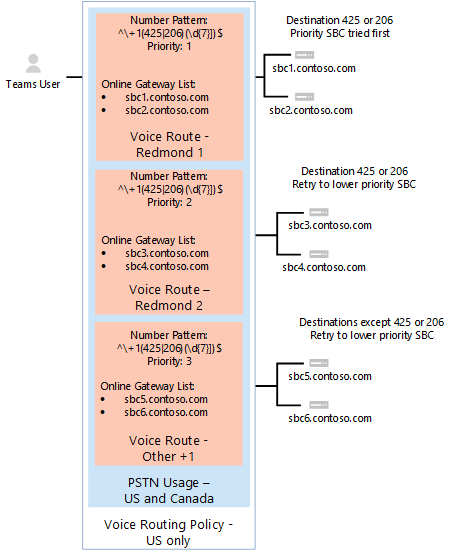

# Отслеживание и устранение неполадок прямой маршрутизации

В этой статье описано, как отслеживать и устранять неполадки с настройкой прямой маршрутии. 

Возможность звонить и принимать звонки с помощью прямой маршрутии включает следующие компоненты: 

- Контроллеры границ сеанса (SBCs) 
- Компоненты прямой маршрутии в Microsoft Cloud 
- Телекоммуникационные связи 

Если у вас возникают сложности при устранении неполадок, вы можете открыть запрос в службу поддержки у поставщика SBC или корпорации Майкрософт. 

Корпорация Майкрософт работает над предоставлением дополнительных средств для устранения неполадок и мониторинга. Периодически проверяйте документацию на новости. 

## Мониторинг доступности контроллеров границ сеанса с помощью сообщений параметров SIP

Прямая маршрутия использует параметры SIP, отправленные контроллерами границ сеанса для отслеживания состояния SBC. Для того чтобы включить мониторинг параметров SIP, администратор клиента не должен ничего делать. Собранные сведения принимаются во внимание при принятии решений по маршрутике. 

Например, если для определенного пользователя существует несколько SBCs, доступных для перенаправки звонка, прямая маршрутия рассматривает сведения о параметрах SIP, полученные от каждого SBC, чтобы определить маршрутику. 

На следующей схеме показан пример конфигурации: 

Когда пользователь звонит на номер +1 425, прямая маршрутная \<any seven digits> маршрутия оценивает маршрут. В маршруте есть два SBCs: sbc1.contoso.com и sbc2.contoso.com. У обоих SBCs одинаковый приоритет в маршруте. Прежде чем выбирать SBC, механизм маршрутации оценивает состояние SBCs на основе времени последней передачи параметров SIP. 

SBC считается полезным, если статистика на момент отправки звонка показывает, что параметры SBC отправляются каждую минуту.  

При звонии применяется следующая логика:

- SBC был сопряжен в 11:00.  
- Параметры SBC отправляются в 11:01, 11:02 и так далее.  
- В 11:15 пользователь звонит, и этот SBC выбирается с механизмом маршрутации. 

Прямая маршрутная маршрутия принимает параметры интервалов три раза (обычный интервал составляет одну минуту). Если параметры были отправляться в течение последних трех минут, SBC считается полезным.

Если параметры SBC в примере отправлены в любой период между 11:12 и 11:15 (время звонка), он считается полезным. В этом случае SBC будет понижен с маршрута. 

Понижение означает, что SBC не будет сначала опробоваться. Например, у нас есть sbc1.contoso.com и sbc2.contoso.com с равным приоритетом.  

Если sbc1.contoso.com SIP не отправляет параметры SIP через равные интервалы, как описано выше, он будет понижен. Затем sbc2.contoso.com пытается позвонить. Если sbc2.contoso.con не удается доставить звонок, sbc1.contoso.com (понизить его) перед сбоем. 

Если два (или более) SBCs в одном маршруте считаются полезными и равными, Fisher-Yates применяется Fisher-Yates для распространения звонков между ними.

## Мониторинг панели мониторинга средств аналитики качества вызовов и журналов SBC 
 
В некоторых случаях, особенно во время начальной связи, могут возникнуть проблемы, связанные с неправильнойнастройкой SBCs или службы прямой маршрутизации. 

Для отслеживания конфигурации можно использовать следующие средства:  
 
- Панель мониторинга качества вызовов 
- Журналы SBC 

В службе Direct Routing есть очень описательные коды ошибок, которые печатались в средствах аналитики вызовов или журналах SBC. 

Информационная панель качества звонка содержит сведения о качестве и надежности звонка. Дополнительные информацию об устранении неполадок с помощью средства аналитики вызовов см. в дополнительных информациях Включение и использование панели мониторинга качества звонка для Microsoft Teams и [Skype для бизнеса Online](/SkypeForBusiness/using-call-quality-in-your-organization/turning-on-and-using-call-quality-dashboard) и Использование средства аналитики вызовов для устранения неполадок с качеством [звонка.](/SkypeForBusiness/using-call-quality-in-your-organization/use-call-analytics-to-troubleshoot-poor-call-quality) 

В случае сбоев вызовов средства аналитики вызовов предоставляют стандартные коды SIP для устранения неполадок. 

Однако средству аналитики звонков может помочь только то, что звонки перенаправят на внутренние компоненты прямой маршрутки и не будут сбойным. В случае проблем с парой SBC или проблем, из-за которых SIP "Пригласить" была отклонена (например, неправильно задано имя FQDN для связи), аналитика вызовов не поможет. В этом случае обратитесь к журналам SBC. Direct Routing отправляет подробное описание проблем на SBCs; эти проблемы можно прочитать в журналах SBC.