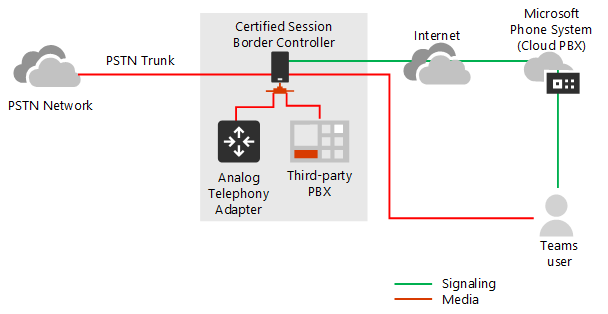
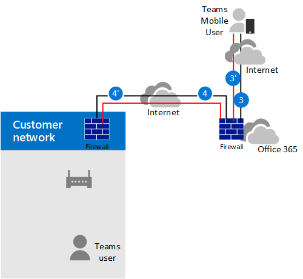
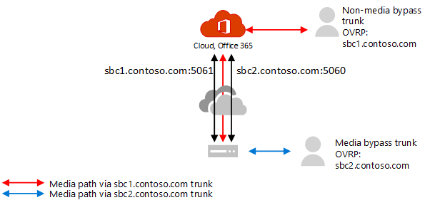

# Планирование обхода сервера-посредника с прямой маршрутизацией

## Обход мультимедиа с прямой маршрутией

Обход мультимедиа позволяет сократить путь к трафику мультимедиа и уменьшить количество переходов в пути для улучшения производительности. При обходе мультимедиа мультимедиа между SBC и клиентом хранятся мультимедиа, а не через телефонную систему Майкрософт. Чтобы настроить обход мультимедиа, SBC и клиент должны быть в одном расположении или сети.

Вы можете управлять обходом мультимедиа для каждого SBC с помощью команды **Set-CSOnlinePSTNGateway** с параметром **-MediaBypass,** для параметра true или false. Если включить обход мультимедиа, это не означает, что весь трафик мультимедиа будет оставаться в корпоративной сети. В этой статье описан поток зова в разных сценариях.

На схемах ниже показано, чем отличается поток вызовов при обходе мультимедиа и без него.

Без обхода мультимедиа, когда клиент совершает или принимает звонок, сигнальный и поток мультимедиа между SBC, телефонной системой Майкрософт и клиентом Teams, как показано на следующей схеме:

> [!div class="mx-imgBorder"]
> 

Но предположим, что пользователь находится в том же здании или сети, что и SBC. Например, предположим, что пользователь, который находится в здании в Области, звонит пользователю ННР: 

- **Без обхода мультимедиа** будут поступать через Залив или Dublin (где развернуты центра обработки данных Майкрософт) и обратно в SBC в Сша. 

  Центр обработки данных в Европе выбран, так как он находится в Европе, а корпорация Майкрософт использует центр обработки данных, ближайший к SBC. Хотя этот подход не влияет на качество звонка из-за оптимизации потока трафика в сетях Майкрософт в большинстве географических данных, трафик имеет ненужный цикл.     

- **При обходе** мультимедиа хранятся непосредственно между пользователем Teams и SBC, как показано на следующей схеме:

  > [!div class="mx-imgBorder"]
  > 

Обход мультимедиа использует протоколы, называемые интерактивными подключениями (ICE) в клиенте Teams и ICE lite на SBC. Эти протоколы позволяют прямой маршрутике использовать самый прямой маршрут мультимедиа для оптимального качества. ICE и ICE Lite являются стандартами WebRTC. Подробные сведения об этих протоколах см. в описании протокола RFC 5245.

## Планирование потока вызовов и брандмауэра

Планирование потока присоединения к звонкам и брандмауэра зависит от того, имеет ли пользователь прямой доступ к общедоступным IP-адресам SBC и находится ли пользователь внутри или за пределами сети.

### Поток зова, если у пользователя есть прямой доступ к общедоступным IP-адресу SBC

Если у пользователя есть прямой доступ к общедоступным IP-адресу SBC, поток зовов будет следующим:

- Для обхода мультимедиа у клиента Teams должен быть доступ к общедоступным IP-адресам SBC даже из внутренней сети. Если прямая мультимедиа не требуется, они могут перетекать через ретрансляторы транспорта.

- Это рекомендуемое решение, если пользователь находится в том же здании или сети, что и SBC, и удаляет компоненты Microsoft Cloud из пути мультимедиа.

- Сигнальный сигнал всегда проходит через облако Майкрософт.

На следующей схеме показан поток зова, когда включен обход мультимедиа, клиент является внутренним и может получить доступ к общедоступным IP-адресам SBC (прямой мультимедиа): 

- Стрелки и числимые значения путей соответствуют потокам вызовов [Microsoft Teams.](./microsoft-teams-online-call-flows.md)

- Сигнальный трафик SIP всегда проходит по путям 4 и 4' (в зависимости от направления трафика). Media stays local and takes path 5b.

> [!div class="mx-imgBorder"]
> 

### Поток присоединения к звонкам, если у пользователя нет доступа к общедоступным IP-адресам SBC

Ниже описан поток присоединения к звонкам, если у пользователя нет доступа к общедоступным IP-адресам SBC. 

Предположим, пользователь является внешним, а администратор клиента решил не открывать общедоступный IP-адрес SBC для всех пользователей в Интернете, а только в Microsoft Cloud. Внутренние компоненты трафика могут перетекать через ретрансляторы транспорта Teams. Примите во внимание следующее:

- Используются ретрансляторы транспорта Teams.

- Для обхода мультимедиа корпорация Майкрософт использует версию ретрансляторов транспорта, которая требует открывать порты от 50 000 до 59 999 между ретрансляторами транспорта Teams и SBC (в будущем планируется перейти на версию, которая требует портов 3478–3481).

На следующей схеме показан поток зова, когда включен обход мультимедиа, клиент является внешним и не может получить доступ к общедоступным IP-адресам контроллера границы сеанса (мультимедиа ретранслются ретранслятором транспорта Teams).

- Стрелки и числимые значения путей соответствуют потокам вызовов [Microsoft Teams.](./microsoft-teams-online-call-flows.md)

- Мультимедиа передается по путям 3, 3', 4 и 4'

> [!div class="mx-imgBorder"]
> 

### Поток присоединения к звонкам, если пользователь находится за пределами сети и имеет доступ к общедоступным IP-адресам SBC

> [!NOTE]
> Такая конфигурация не рекомендуется, так как она не имеет преимуществ в ретрансляторах транспорта Teams. Вместо этого следует рассмотреть предыдущий сценарий, в котором у пользователя нет доступа к общедоступным IP-адресам SBC. 

На следующей схеме показан поток зова, когда включен обход мультимедиа, клиент внешний, а клиент может получить доступ к общедоступным IP-адресам SBC (прямого мультимедиа).

- Стрелки и числимые значения путей соответствуют статье Потоки [зова в Microsoft Teams.](./microsoft-teams-online-call-flows.md)

- Сигнальный трафик SIP всегда проходит по путям 3 и 3' (в зависимости от направления трафика). Потоки мультимедиа, использующие путь 2.

> [!div class="mx-imgBorder"]
> 

## Использование процессоров мультимедиа и ретрансляторов транспорта

В Microsoft Cloud есть два компонента, которые могут быть в пути к трафику мультимедиа: процессоры мультимедиа и ретрансляторы транспорта. 

- Процессор мультимедиа — это общедоступный компонент, который обрабатывает мультимедиа в случаях без обхода и обрабатывает мультимедиа для голосовых приложений.

   Процессоры мультимедиа всегда находятся в пути для конечных пользователей, но никогда не находятся в пути для обходных звонков. Процессоры мультимедиа всегда находятся в пути для всех голосовых приложений, таких как "Парк вызовов", "Автоотправление организации" и "Очереди зовов".

- Ретранслятор транспорта используется для подключения к ближайшей службе транспорта для отправки трафика в режиме реального времени.

   В зависимости от того, где находится пользователь и как настроена сеть, ретрансляторы транспорта могут быть в пути для обходных вызовов или предназначенных для конечных пользователей.

На следующей схеме показаны два потока зова: один с включенным обходом мультимедиа, второй — с отключенным обходом мультимедиа.

> [!NOTE]
> Схема показывает только трафик, относяющийся к конечным пользователям или направляющийся на него.  

- Контроллер мультимедиа — это микрослужба в Azure, которая назначает процессоры мультимедиа и создает предложения протокола SDP.

- Прокси-сервер SIP — это компонент, который преобразует сигналы HTTP REST, используемые в Teams, в SIP.    

> [!div class="mx-imgBorder"]
> 

В таблице ниже приведена разница между процессорами мультимедиа и ретрансляторами транспорта.

|  &nbsp; | Процессоры мультимедиа | Ретрансляторы транспорта|
| :--------------|:---------------|:------------|
|В канале мультимедиа для вызовов без обхода для конечных пользователей | Всегда | Если клиенту не удается напрямую связаться с процессором мультимедиа |
|В пути мультимедиа для обхода звонков для конечных пользователей | Нвер | Если клиенту не удается связаться с SBC по общедоступным IP-адресу |
|В пути мультимедиа для голосовых приложений | Всегда | Нвер |
|Может делать транскодинг (B2BUA)\* | Да | Нет, звук передается только между конечными точками. |
|Количество экземпляров и расположение в разных странах | 10 итогов: 2 на востоке и западе США; 2 в области "Париж" и "Dublin"; 2 в Гонконге и Сингапуре; 2 в Японии; 2 в Восточной и Юго-Восточной Австралии | Несколько|

Диапазоны IP-адресов:
- 52.112.0.0/14 (IP-адреса от 52.112.0.1 до 52.115.255.254)
- 52.120.0.0/14 (IP-адреса от 52.120.0.1 до 52.123.255.254)

\* Объяснение транскодинга: 

- Процессор мультимедиа — это B2BUA, то есть он может изменять кодеки (например, ТЕКСТ ИЗ клиента Teams на MP и G.711 между MP и SBC).

- Ретрансляторы транспорта не являются B2BUA, то есть кодек никогда не меняется между клиентом и SBC, даже если трафик передается через ретрансляторы.

### Использование процессоров мультимедиа Teams, если в канале настроен обход мультимедиа

Процессоры мультимедиа Teams всегда вставляются в путь мультимедиа в следующих сценариях:

- Звонок перенается с 1:1 на групповой звонок
- Звонок федератированному пользователю Teams
- Звонок переадправлен или перенаправлен пользователю Skype для бизнеса

Убедитесь, что ваш SBC имеет доступ к диапазонам процессоров мультимедиа и ретрансляторов транспорта, как описано ниже.    

## Сигнальный SIP: FQDNs

Для сигнальных служб SIP требования к FQDN и брандмауэру одинаковы, как для случаев, не обходить которые не требуется. 

Прямая маршрутная маршрутия предоставляется в следующих Microsoft 365 или Office 365 средах:
- Microsoft 365 или Office 365
- Office 365 GCC
- Office 365 GCC высокая
- Office 365 DoD Подробнее о [средах](/office365/servicedescriptions/office-365-platform-service-description/office-365-us-government/office-365-us-government) Office 365 и государственных GCC, GCC Высокая и DoD.

### Microsoft 365, Office 365 и Office 365 GCC средах

Точки соединения для прямой маршрутии являются следующими тремя FQDNs:

- **sip.pstnhub.microsoft.com** — глобальное FQDN — необходимо сначала опробовоть. Когда SBC отправляет запрос на устранение этого имени, DNS-серверы Microsoft Azure возвращают IP-адрес, указывющий на основной центр обработки данных Azure, который назначен SBC. Назначение основано на метриках производительности центра обработки данных и географической близости к SBC. Возвращенный IP-адрес соответствует основному FQDN.

- **sip2.pstnhub.microsoft.com** — дополнительное FQDN — географически сопоставить со вторым приоритетным регионом.

- **sip3.pstnhub.microsoft.com** — tertiary FQDN — географически сопоставить с третьим приоритетным регионом.

Эти три FQDDNs необходимо разместить, чтобы:

- Обеспечение оптимальной работы (меньше нагрузка и ближе всего к центру обработки данных SBC, назначенного с помощью запроса к первому FQDN).

- Отбой в случае, если подключение из SBC установлено к центру обработки данных, который имеет временную проблему. Дополнительные сведения см. в приведенной ниже механизме отбойной передачи.

FQDNs sip.pstnhub.microsoft.com , **sip2.pstnhub.microsoft.com** и **sip3.pstnhub.microsoft.com** будут разрешены на IP-адреса из следующих подсетей:
- 52.112.0.0/14
- 52.120.0.0/14

Чтобы разрешить входящий и исходяющий трафик с адресов для сигнального трафика, необходимо открыть в брандмауэре порты для всех этих диапазонов IP-адресов. Если брандмауэр поддерживает имена DNS,  доменные sip-all.pstnhub.microsoft.com ко всем этим IP-подсетям. 

### Office 365 GCC DoD

Точка соединения для прямой маршрутии имеет следующий FQDN:

**sip.pstnhub.dod.teams.microsoft.us** — глобальное FQDN. Так как Office 365 DoD существует только в центрах обработки данных в США, дополнительные итериарные FQDNs не существует.

Это sip.pstnhub.dod.teams.microsoft.us будет разрешено на IP-адрес из следующей подсети:

- 52.127.64.0/21

Чтобы разрешить входящий и исходяющий трафик с адресов для сигнального трафика, необходимо открыть в брандмауэре порты для всех этих диапазонов IP-адресов.  Если брандмауэр поддерживает имена DNS, доменные sip.pstnhub.dod.teams.microsoft.us ко всем этим IP-подсетям. 

### Office 365 GCC высокая среда

Точка соединения для прямой маршрутии имеет следующий FQDN:

**sip.pstnhub.gov.teams.microsoft.us** — глобальное FQDN. Так как среда GCC Высокая существует только в центрах обработки данных в США, дополнительные и дополнительные FQDNs не имеются.

Для sip.pstnhub.gov.teams.microsoft.us будет разрешен IP-адрес из следующей подсети:

- 52.127.88.0/21

Чтобы разрешить входящий и исходяющий трафик с адресов для сигнального трафика, необходимо открыть в брандмауэре порты для всех этих диапазонов IP-адресов.  Если брандмауэр поддерживает имена DNS, доменные sip.pstnhub.gov.teams.microsoft.us будут разрешать их для всех этих IP-подсетей. 

## Сигнальный SIP: порты

Требования к порту одинаковы для всех сред Office 365, где предлагается прямая маршрутная маршрутия:
- Microsoft 365 или Office 365
- Office 365 GCC
- Office 365 GCC высокая
- Office 365 Dod

Необходимо использовать следующие порты:

| Трафика | От | До | Исходный порт | Конечный порт|
| :-------- | :-------- |:-----------|:--------|:---------|
| SIP/TLS| Прокси-сервер SIP | SBC | 1024 - 65535 | Определено в SBC |
| SIP/TLS | SBC | Прокси-сервер SIP | Определено в SBC | 5061 |

## Трафик мультимедиа: диапазоны IP-адресов и портов

Трафик мультимедиа передается между клиентом SBC и клиентом Teams, если доступно прямое подключение, или через Teams, если клиент не может связаться с SBC с использованием общего IP-адреса.

### Требования для прямого трафика мультимедиа (между клиентом Teams и SBC) 

У клиента должен быть доступ к указанным портам (см. таблицу) на общедоступный IP-адрес SBC. 

> [!NOTE]
> Если клиент находится во внутренней сети, мультимедиа перетекают на общедоступный IP-адрес SBC. Вы можете настроить закрепление ветвей на устройстве NAT, чтобы трафик никогда не покидает сетевое оборудование предприятия.

| Трафика | От | До | Исходный порт | Конечный порт|
| :-------- | :-------- |:-----------|:--------|:---------|
| UDP/SRTP | Клиент | SBC | 3478-3481 и 49152 – 53247| Определено в SBC |
| UDP/SRTP | SBC | Клиент | Определено в SBC | 3478-3481 и 49152 – 53247  |

> [!NOTE]
> Если у вас есть сетевое устройство, которое преобразует исходные порты клиента, убедитесь, что переведенные порты открыты между сетевым оборудованием и SBC. 

### Требования для использования ретрансляторов транспорта

Ретрансляторы транспорта находятся в том же диапазоне, что и процессоры мультимедиа (для случаев без обхода): 

### Microsoft 365, Office 365 и Office 365 GCC средах

- 52.112.0.0 /14 (IP-адреса от 52.112.0.1 до 52.115.255.254)

### Office 365 GCC DoD

- 52.127.64.0/21

### Office 365 GCC высокая среда

- 52.127.88.0/21

Диапазон портов ретрансляторов Teams транспорта (применимо для всех сред) отображается в таблице ниже.

| Трафика | От | До | Исходный порт | Конечный порт|
| :-------- | :-------- |:-----------|:--------|:---------|
| UDP/SRTP | Ретранслятор транспорта | SBC | 50 000 -59 999    | Определено в SBC |
| UDP/SRTP | SBC | Ретранслятор транспорта | Определено в SBC | 50 000 – 59 999, 3478-3481     |

> [!NOTE]
> Корпорация Майкрософт рекомендует не менее двух портов для одновременного вызова на SBC. Так как в корпорации Майкрософт есть две версии ретрансляторов транспорта, требуются следующие:
> 
> - V4, которая может работать только с диапазоном портов от 50 000 до 59 999
> 
> - v6, которая работает с портами 3478–3481

В настоящее время обход мультимедиа поддерживает только версию ретрансляторов транспорта версии 4. В будущем мы будем внедрять поддержку v6. 

Для перехода необходимо открыть порты 3478–3481. Когда Корпорация Майкрософт введет поддержку ретрансляторов транспорта v6 с помощью обхода мультимедиа, вам не придется перенастроять сетевое оборудование или БСК. 

### Требования к использованию процессоров мультимедиа

Процессоры мультимедиа всегда находятся в пути мультимедиа для голосовых приложений и веб-клиентов (например, клиентов Teams в Edge или Google Chrome). Требования одинаковы для настройки без обхода.

Диапазон IP-адресов для трафика мультимедиа: 

### Среды GCC Office 365 и Office 365

- 52.112.0.0 /14 (IP-адреса от 52.112.0.1 до 52.115.255.254)

### Среда DoD для GCC в Office 365

- 52.127.64.0/21

### Среда Office 365 GCC High

- 52.127.88.0/21

Диапазон портов процессоров мультимедиа (применимо для всех сред) показан в таблице ниже.

| Трафика | От | До | Исходный порт | Конечный порт|
| :-------- | :-------- |:-----------|:--------|:---------|
| UDP/SRTP | Процессор мультимедиа | SBC | 3478-3481 и 49 152 – 53 247    | Определено в SBC |
| UDP/SRTP | SBC | Процессор мультимедиа | Определено в SBC | 3478-3481 и 49 152 – 53 247     |

## Настройка отдельных каналов для обхода мультимедиа и обхода без мультимедиа  

Если вы хотите подтвердить функциональность перед переносом всех функций обхода мультимедиа в обход мультимедиа, вы можете создать отдельную магистраль и отдельную политику голосового маршрутирования Online для маршрутирования к каналу обхода мультимедиа и назначения определенным пользователям. 

Шаги высокой настройки:

- Определите пользователей, которые должны проверить обход мультимедиа.

- Создайте две отдельные связи с разными FQDNs: одно из них включено для обхода мультимедиа; другой нет. 

  Обе стороны указывают на один и тот же SBC. Порты для сигнального сигнала TLS SIP должны быть другими. Порты мультимедиа должны быть одинаковыми.

- Создайте политику маршрутирования голосовой связи в Интернете и назначьте канал обхода мультимедиа соответствующим маршрутам, связанным с использованием этой политики через ТСТС.

- Назначьте новую политику маршрутирования голосовой почты в Интернете пользователям, для проверки обхода мультимедиа.

Пример ниже иллюстрирует эту логику.

| Набор пользователей | Количество пользователей | FQDN", присвоенное в OVRP | Включен обход мультимедиа |
| :------------ |:----------------- |:--------------|:--------------|
| Пользователи с обводом без мультимедиа | 980 | sbc1.contoso.com:5061 | false |
| Пользователи с обводом мультимедиа | 20 | sbc2.contoso.com:5060 | true | 

Обе связи могут указать на один и тот же SBC с одинаковым общедоступным IP-адресом. Сигнальные порты TLS на SBC должны быть другими, как показано на приведенной ниже схеме. Обратите внимание, что сертификат должен поддерживать обе стороны. В САН у вас должны быть два имена **(sbc1.contoso.com** **и sbc2.contoso.com**) или поддиск.сертификат.

> [!div class="mx-imgBorder"]
> 

Сведения о настройке двух телефонов на одном ИТ-сайте см. в документации поставщика SBC:

 - [Документация по развертыванию AudioCodes](https://www.audiocodes.com/solutions-products/products/products-for-microsoft-365/direct-routing-for-microsoft-teams)
- [Документация по развертыванию Oracle](https://www.oracle.com/industries/communications/enterprise-session-border-controller/microsoft.html)
- [Документация по развертыванию коммуникаций на ленте](https://ribboncommunications.com/solutions/enterprise-solutions/microsoft-solutions/direct-routing-microsoft-teams-calling)
- [Документация по развертыванию TE-Systems (anynode)](https://www.anynode.de/anynode-and-microsoft-teams/)

## Клиентские конечные точки, поддерживаемые с обходом мультимедиа

Обход мультимедиа поддерживается для всех автономных классических клиентов Teams, клиентов Android и iOS и телефонных устройств Teams. 

Для всех остальных конечных точек, которые не поддерживают обход мультимедиа, мы преобразуем звонок в обход, даже если он начался как обходной вызов. Это происходит автоматически и не требует действий от администратора. К ним относятся телефоны 3PIP Skype для бизнеса и веб-клиенты Teams, поддерживаюющие прямые маршруты звонков (клиенты На основе WebRTC, работающие в Microsoft Edge, Google Chrome, Mozilla Firefox). 
 
## См. также

[Настройка обхода сервера-посредника с прямой маршрутизацией](direct-routing-configure-media-bypass.md)
