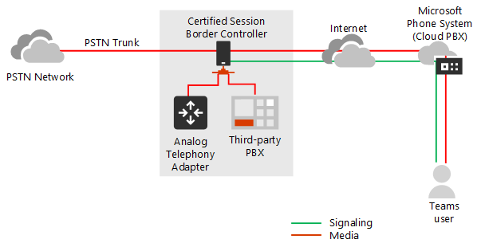

# Планирование обхода сервера-посредника с прямой маршрутизацией

## О сервера-посредника при прямой маршрутизации

Обход сервера-посредника позволяет сократить путь трафика мультимедиа и сократить число переходов между во время передачи для лучшей производительности. С сервера-посредника носитель остается между пограничный контроллер сеансов (SBC) и клиента, а не его отправки с помощью телефонной системой Microsoft. Настройка мультимедиа сервера-посредника, SBC и клиент должны находиться в одном месте или сети.

Обход сервера-посредника для каждого SBC можно управлять с помощью команды **Set-CSOnlinePSTNGateway** с параметром **- MediaBypass** установлено значение true или false. При включении сервера-посредника, это означает, что все трафика мультимедиа останется внутри корпоративной сети. В этой статье описываются поток вызовов в различных сценариях.    

Ниже схемах показаны различия в поток вызовов с и без сервера-посредника.

Без сервера-посредника когда клиент делает или получает вызов, передачи сигналов и мультимедиа передаются между SBC, телефонной системой Microsoft и клиентских групп, как показано на следующей схеме:

Но давайте предположим, что пользователь находится в той же построения или сети как SBC. Например предположим, пользователь, который находится в построение в Франкфурте делает вызова пользователю PSTN. 

- **Без такого обхода**, будет потока мультимедиа с помощью Амстердам или Dublin (где развертываются центрах обработки данных Майкрософт) и вернуться к SBC во Франкфурте. 

  Выбран центра обработки данных в Европе, поскольку SBC в Европе, и корпорация Майкрософт использует центра обработки данных, наиболее близкого к SBC. Хотя этот подход не влияет на качество звонка из-за оптимизации трафик в сети Microsoft в большинстве географических расположениях, трафика есть ненужные цикла.     

- **С носителя обхода**, будет храниться мультимедиа между группами пользователей и SBC, как показано на рисунке:

Протоколы использует именем интерактивных при установке подключения (ICE) на клиента групп и ICE быстрое на пограничный контроллер Сеансов сервера-посредника. Эти протоколы обеспечивают прямой маршрутизации в целях оптимизации качества наиболее коротких пути к мультимедиа. ICE и ICE Lite являются WebRTC стандартов. Подробные сведения о протоколах RFC 5245 см.

## Планирование брандмауэра и поток вызовов

Планирование брандмауэра и поток вызовов зависит от ли пользователь имеет прямой доступ к общедоступный IP-адрес SBC и является ли пользователь внутри или за пределами сети.

### Процесс передачи звонка, если у пользователя есть прямой доступ к общедоступный IP-адрес пограничного контроллера Сеансов

Если у пользователя есть прямой доступ к общедоступный IP-адрес SBC, поток вызовов выглядит следующим образом:

- Для сервера-посредника клиент группы должны иметь доступ к общедоступный IP-адрес SBC даже из внутренней сети. Если прямое мультимедиа не требуется, можно потока мультимедиа через реле транспорта.

- Это рекомендуемое решение, когда пользователь находится в одном здании и/или сети как SBC — удаление компонентов Microsoft Cloud из пути передачи данных.

- Сигналы всегда проходит через облаке Майкрософт.

На следующей схеме показана поток вызовов при сервера-посредника включен, клиент является внутренним, а клиент может достигнуть общий IP-адрес пограничного контроллера Сеансов (прямое мультимедиа): 

- Стрелки и числовых значений пути, в соответствии с статье [группами Майкрософт вызова денежных средств](https://docs.microsoft.com/microsoftteams/microsoft-teams-online-call-flows) .

- Сигналы SIP всегда принимает путей 4 и 4"(в зависимости от направление трафика). Среда остается локальной и принимает 5b путь.

### Процесс передачи звонка, если пользователь не имеет доступа к общедоступный IP-адрес пограничного контроллера Сеансов

Ниже описаны поток вызовов, если пользователь не имеет доступа к общедоступный IP-адрес пограничного контроллера Сеансов. 

Например предположим, пользователь является внешним, а администратор клиента решил не открыть общий IP-адрес SBC для всеобщего доступа в Интернет, но только в облаке Майкрософт. Внутренним компонентам трафика может потока с помощью реле транспорта группами. Это рекомендуемая конфигурация для пользователей за пределами корпоративной сети. Рассмотрим следующее:

- Реле транспорта команды используются.

- Для сервера-посредника Корпорация Майкрософт использует версию реле транспорта, который требует Открытие портов наблюдается 50 000 для 59 999 между реле транспорта групп и пограничный контроллер Сеансов (в будущем, которые планируется переместить в версия, которая требует только 3478 и 3479 портов).

- В целях оптимизации мультимедиа Корпорация Майкрософт рекомендует Открытие общедоступный IP-адрес SBC только к группам транспорта реле. Для клиентов за пределами корпоративной сети Корпорация Майкрософт рекомендует использовать реле транспорта вместо достигает общедоступный IP-адрес SBC напрямую.

На следующей схеме показана поток вызовов при сервера-посредника включен, клиент является внешним, а клиент не может связаться общедоступный IP-адрес пограничного контроллера сеансов (ретрансляция с группами транспорта ретрансляция мультимедиа).

- Стрелки и числовых значений пути, в соответствии с статье [группами Майкрософт вызова денежных средств](https://docs.microsoft.com/microsoftteams/microsoft-teams-online-call-flows) .

- Ретрансляция мультимедиа с помощью пути 3, 3", 4 и 4"

### Процесс передачи звонка, если пользователь находится вне сети и имеет доступ к общедоступный IP-адрес пограничного контроллера Сеансов

> [!NOTE]
> Это не рекомендуемые конфигурации, так как он не использует реле транспорта группами. Вместо этого необходимо учитывать предыдущей сценарий, где пользователь не имеет доступа к общедоступный IP-адрес пограничного контроллера Сеансов. 

На следующей схеме показана поток вызовов при сервера-посредника включен, клиент является внешним, а клиент может достигнуть общий IP-адрес пограничного контроллера Сеансов (прямое мультимедиа).

- Стрелки и числовых значений пути, в соответствии с статье [группами Майкрософт вызова денежных средств](https://docs.microsoft.com/microsoftteams/microsoft-teams-online-call-flows) .

- Сигналы SIP всегда принимает путей 3 и 3"(в зависимости от направление трафика). С помощью пути 2 потоков мультимедиа.

## Использование процессора мультимедиа и реле транспорта

Существует два компонента в облаке Майкрософт, который может быть в поле путь трафика мультимедиа: мультимедиа процессоров и реле транспорта. 

- Процессор мультимедиа — это общедоступный к компонент, который обрабатывает мультимедиа в тех случаях, без обхода и обработки мультимедиа для приложений голосовой связи.

   Путь для вызовов, не являющиеся обходили конечного пользователя, но никогда не на пути для вызовов, обходящих процессоров мультимедиа, всегда. Мультимедийные процессоры, всегда создаются на путь для всех приложений голосовой связи, например парковки вызовов, организационной автосекретаря и вызвать очереди.

- Ретрансляция транспорта используется для подключения к службе ближайших транспорта для отправки трафика в режиме реального времени.

   Реле транспорта может быть или не быть в поле путь к обходящих вызовах--, исходящие от или, предназначенные для конечных пользователей, в зависимости от того, где пользователь и процедуры настройки сети.

На следующей схеме показана двух потоков обработки вызовов – с поддержкой сервера-посредника, а второй с мультимедиа обходить отключено. Примечание схему только иллюстрирует трафика, исходящие от--или--конечным пользователям, предназначенные.  
- Контроллер мультимедиа-microservice в Azure, назначает обработчиков мультимедиа и создает предложения по протокола описание сеанса (SDP).

- Прокси-сервер SIP — это компонент, который преобразует сигналы HTTP REST, используемые в командах и SIP.    

В следующей таблице представлены различия между мультимедиа процессоров и реле транспорта.

|    | Мультимедийные процессоры | Реле транспорта|
| :--------------|:---------------|:------------|
В пути к мультимедиа для вызовов не применяется для конечных пользователей | Всегда | Никогда не | 
В пути к мультимедиа для обходящих вызовов для конечных пользователей | Никогда не | Если клиент не может связаться SBC на общедоступный IP-адрес | 
В пути к мультимедиа для приложений голосовой связи | Всегда | Никогда не | 
Можно сделать перекодировки (B2BUA)\* | Да | Нет, только ретранслирует звука между конечными точками | 
Число экземпляров по всему миру и расположение | всего 8: 2 в "мне Нравится" Восток и запад; 2 в Амстердам и Dublin; 2 в (Гонконг) и Сингапур; 2 в Японии (добавляемый в Q1CY2019)  | Несколько

Диапазон IP-адресов — 52.112.0.0 /14 (IP-адресов из 52.112.0.1 52.115.255.254). 

\*Объяснение перекодировки: 

- Процессор мультимедиа — B2BUA, что означает, что его можно изменить кодеков (например, SILK из группы клиента MP и G.711 между MP и SBC).

- Реле транспорта не B2BUA, что означает, что кодек никогда не изменяется между клиентом и SBC--даже в том случае, если трафик проходит через реле.

### Использование групп транспорта реле в сценариях эскалации, если настроена магистрали для мультимедиа обхода

Реле транспорта групп, всегда создаются на пути к мультимедиа в следующих сценариях:

- Вызов перерастает от 1:1 в группу звонка
- Вызов будет федеративных пользователей группам
- Звонок будет переслано или передан в Скайп для бизнес-пользователя

Убедитесь, что пограничного контроллера Сеансов имеет доступ к реле транспорта, как описано ниже.    

## Передача сигналов SIP: Полные доменные имена и порты брандмауэра

Для сигналы SIP, требования к полным доменным ИМЕНЕМ и брандмауэра совпадают с требованиями для случаев не применяется. 

Точек подключения для прямой маршрутизации являются следующие три полных доменных имен:

- **sip.pstnhub.microsoft.com** – полное доменное имя глобального – необходимо применять в первую очередь. Когда SBC отправляет запрос для сопоставления этого имени, Microsoft Azure DNS-серверов возвращает IP-адрес основного центра обработки данных Azure с указанием назначается SBC. Назначение основано на показатели производительности центров обработки данных и географических близости к SBC. IP-адрес соответствует основной полное доменное имя.

- **sip2.pstnhub.microsoft.com** – полное доменное имя дополнительного – географически сопоставляет вторая область приоритет.

- **sip3.pstnhub.microsoft.com** – полное доменное имя для третьего уровня – географически сопоставляет третий региона приоритет.

Необходимо поместить эти три полных доменных имен, чтобы:

- Предоставление оптимальную интерфейса (менее загружен и ближайший центр обработки данных SBC, назначенные путем отправки запроса в первом поле полное доменное имя).

- Предоставление отработки отказа при установке подключения из SBC центр обработки данных, в котором возникла временные проблемы. Для получения дополнительных сведений см механизм переключения ниже.

Полные доменные имена **sip.pstnhub.microsoft.com**, **sip2.pstnhub.microsoft.com**и **sip3.pstnhub.microsoft.com** разрешается к одному из следующих IP-адресов:
- 52.114.148.0
- 52.114.132.46
- 52.114.75.24
- 52.114.76.76
- 52.114.7.24
- 52.114.14.70

Необходимо будет открыть порты для всех этих IP-адресов в брандмауэре, чтобы разрешить входящий и исходящий трафик адреса для передачи сигналов. Если брандмауэр поддерживает DNS-имен, полное доменное имя **sip-all.pstnhub.microsoft.com** разрешается все выше IP-адреса. Необходимо использовать следующие порты:

| Трафик | От | До | Исходный порт | Конечный порт|
| :-------- | :-------- |:-----------|:--------|:---------|
SIP/TLS| Прокси-сервер SIP | SBC | 1024 – 65535 | Определенные на пограничный контроллер Сеансов |
| SIP/TLS | SBC | Прокси-сервер SIP | Определенные на пограничный контроллер Сеансов | 5061 |

## Трафика мультимедиа: диапазонов IP-адрес и порт

Трафика мультимедиа потоки между клиентом SBC и рабочих групп при наличии прямого подключения или с помощью команды транспорта реле клиент не может получить доступ SBC, с помощью общедоступный IP-адрес.

### Требования для трафика мультимедиа прямого (между группами клиента и SBC) 

Клиент должен иметь доступ к портов (см. таблица) на общедоступный IP-адрес пограничного контроллера Сеансов. 

Примечание: Если клиент во внутренней сети, носитель потоки общедоступный IP-адрес пограничного контроллера Сеансов. Можно настраивать hairpinning на устройство, чтобы трафик никогда не остается оборудования корпоративной сети.

| Трафик | От | До | Исходный порт | Конечный порт|
| :-------- | :-------- |:-----------|:--------|:---------|
UDP/SRTP | Клиент | SBC | наблюдается 50 000 – 50 019  | Определенные на пограничный контроллер Сеансов |
| UDP/SRTP | SBC | Клиент | Определенные на пограничный контроллер Сеансов | наблюдается 50 000 – 50 019  |

Примечание: Если сетевое устройство, которое переводит порты источника клиента, убедитесь в том, что преобразуемых порты открываются между сетевое оборудование и SBC. 

### Требования к использованию реле транспорта

Реле транспорта находятся в тот же диапазон как процессоры мультимедиа (для случаев, без обхода): 52.112.0.0 /14 (IP-адресов из 52.112.0.1 52.115.255.254).

В следующей таблице показан диапазон портов реле транспорта группами.

| Трафик | От | До | Исходный порт | Конечный порт|
| :-------- | :-------- |:-----------|:--------|:---------|
UDP/SRTP | Ретрансляция транспорта | SBC | 50 000-59 999    | Определенные на пограничный контроллер Сеансов |
| UDP/SRTP | SBC | Ретрансляция транспорта | Определенные на пограничный контроллер Сеансов | наблюдается 50 000 – 59 999, 3478, 3479     |

Примечание: Корпорация Майкрософт рекомендует по крайней мере два порта на возможность выполнения одновременных звонков на пограничный контроллер Сеансов. Так как Майкрософт имеет две версии реле транспорта, необходимы следующие условия.

- V4, который может работать только с диапазон портов наблюдается 50 000 для 59 999

- версии 6, который работает с портами 3478, 3479

В настоящее время сервера-посредника только поддерживает v4 версии реле транспорта. Поддержка v6 вы ознакомитесь в будущем. 

Вы должны быть открыты порты 3478 и 3479 для перевода. Когда Microsoft вводится поддержка реле транспорта версии 6 с сервера-посредника, не нужно повторно Настройте сетевое оборудование или их изготовителей. 

### Требования к использованию процессоров мультимедиа

Мультимедийные процессоры, всегда создаются на пути к мультимедиа для приложений голосовой связи. Требования совпадают с требованиями для конфигурации без обхода.

Диапазон IP-адресов для трафика мультимедиа — 52.112.0.0 /14 (IP-адресов из 52.112.0.1 52.115.255.254).

Диапазон портов мультимедиа процессоров показан в следующей таблице.

| Трафик | От | До | Исходный порт | Конечный порт|
| :-------- | :-------- |:-----------|:--------|:---------|
UDP/SRTP | Процессор мультимедиа | SBC | 49 152 – 53 247    | Определенные на пограничный контроллер Сеансов |
| UDP/SRTP | SBC | Процессор мультимедиа | Определенные на пограничный контроллер Сеансов | 49 152 – 53 247     |

## Сведения о выполнении, если у вас есть Скайп для рабочих телефонов в сети  

При наличии любого Скайп для бизнеса конечных точек в вашей сети, использующих прямой маршрутизации--, например команд, пользователь может иметь 3PIP телефон, основанный на Скайп для клиента бизнес - посредника на линии связи, который выступает в этих пользователей необходимо отключить.

Можно создать отдельные линии связи для этих пользователей и назначить его политику маршрутизации голосовой связи через Интернет.

Действия по настройке высокого уровня:

- Разделение пользователей по типу – в зависимости от того, имеет ли пользователь 3PIP телефон или нет.

- Создание двух отдельных магистралях с помощью различных полные доменные имена: один включен для сервера-посредника; не. 

  Оба магистральных линий связи выберите же SBC. Порты для SIP-TLS сигналы должны быть разными. Порты для мультимедиа должны быть одинаковыми.

- Назначьте правильные магистрали в зависимости от типа пользователя в политику маршрутизации голосовой связи через Интернет.

В приведенном ниже примере показана эта логика.

| Группы пользователей | Число пользователей | Полное доменное имя, назначенное в OVRP линии связи | Включено сервера-посредника |
| :------------ |:----------------- |:--------------|:--------------|
Пользователи с группами клиентов и 3PIP телефоны | 20 | sbc1.contoso.com:5061 | false | 
Пользователи, имеющие только группы конечных точек (в том числе новых телефонов, сертифицированный для групп) | 980 | sbc2.contoso.com:5060 | true

Оба магистральных линий связи можно указать же SBC с одной общедоступный IP-адрес. Протокол TLS, сигналы порты на SBC должны быть разными, как показано на следующей схеме. Обратите внимание, что вам понадобится убедитесь в том, что сертификат поддерживает оба магистральных линий связи. В сети хранения данных необходимо иметь два имени (**sbc1.contoso.com** и **sbc2.contoso.com**) или иметь групповой сертификат.

Сведения о том, как настроить две магистрали на одном SBC, обратитесь к документации, предоставляемые поставщиком SBC:

- AudioCodes
- Лента
- TE-систем (Anynode)   

## Пропускать клиентских конечных точек, поддерживаемых с носителя

Все конечные точки групп, за исключением групп веб-клиентов до дальнейшей уведомление о поддерживается сервера-посредника. 

Если пользователи предпочитают групп веб-приложения в Microsoft пограничного сервера, Mozilla Firefox или Google Chrome посредника для таких пользователей необходимо отключить. Вы ознакомитесь вызов через магистраль включен обход мультимедиа в будущем.   
 
## См. также

[Настройка обхода сервера-посредника с прямой маршрутизацией](direct-routing-configure-media-bypass.md)

