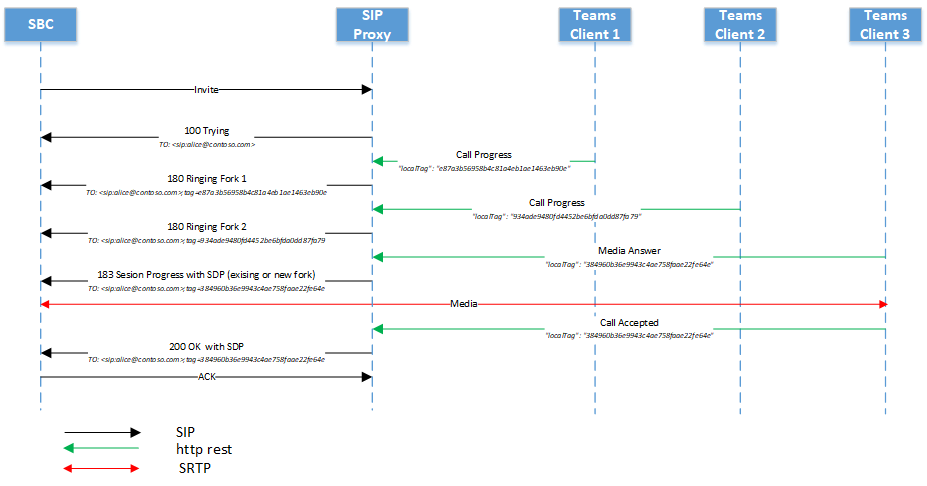

# <a name="direct-routing---sip-protocol"></a>Прямая маршрутизация — протокол SIP

В этой статье описывается, как прямая маршрутизация реализует протокол SIP. Для правильной маршрутизации трафика между пограничным контроллером сеансов (SBC) и прокси-сервером SIP некоторые параметры SIP должны иметь определенные значения. Эта статья предназначена для администраторов голосовой связи, которые отвечают за настройку подключения между локальным SBC и службой прокси-сервера SIP.

## <a name="processing-the-incoming-request-finding-the-tenant-and-user"></a>Обработка входящего запроса: поиск клиента и пользователя

Перед обработкой входящего или исходящего вызова сообщения OPTIONS обмениваются между прокси-сервером SIP и SBC. Эти сообщения OPTIONS позволяют прокси-серверу SIP предоставлять разрешенные возможности для SBC. Для успешного согласования OPTIONS (ответ 200OK) важно обеспечить дальнейшее взаимодействие между SBC и прокси-сервером SIP для установления вызовов. Заголовки SIP в сообщениях OPTIONS для прокси-сервера SIP приведены в следующем примере:

| Имя параметра | Пример значения | 
| :---------------------  |:---------------------- |
| URI запроса | OPTIONS sip:sip.pstnhub.microsoft.com:5061 SIP /2.0 |
| С помощью заголовка | Via: SIP/2.0/TLS sbc1.adatum.biz:5058;alias;branch=z9hG4bKac2121518978 | 
| Max-Forwards заголовка | Максимальное число пересылки:68 |
| Из заголовка | Из заголовка: <sip:sbc1.adatum.biz:5058> |
| В заголовок | Кому: <sip:sip.pstnhub.microsoft.com:5061> |
| Заголовок CSeq | CSeq: 1 INVITE | 
| Заголовок контакта | Контакт: <sip:sbc1.adatum.biz:50588;transport=tls> |

> [!NOTE]
> Заголовки SIP не содержат userinfo в используемом URI SIP. Согласно [RFC 3261, раздел 19.1.1](https://tools.ietf.org/html/rfc3261#section-19.1.1), часть userinfo URI является необязательной и может отсутствовать, если целевой хост не имеет понятия о пользователях или когда сам хост является идентифицированным ресурсом. Если знак @присутствует в универсальном коде ресурса (URI) SIP, поле пользователя НЕ должно быть пустым.
> Обратите внимание, что URI SIPS не следует использовать для прямой маршрутизации, так как он не поддерживается.
> Проверьте конфигурацию пограничного контроллера сеанса и убедитесь, что в SIP-запросах не используются заголовки Replaces. Прямая маршрутизация отклоняет SIP-запросы с определенными заголовками Replaces.

Во входящем вызове прокси-сервер SIP должен найти клиент, которому предназначен вызов, и найти конкретного пользователя в этом клиенте. Администратор клиента может настроить номера, отличные от DID, например +1001, в нескольких клиентах. Поэтому важно найти конкретный клиент, в котором выполняется поиск чисел, так как номера, отличные от DID, могут быть одинаковыми в нескольких организациях Microsoft 365 или Office 365.  

В этом разделе описывается, как прокси-сервер SIP находит клиента и пользователя, а также выполняет проверку подлинности SBC во входящем подключении.

Ниже приведен пример сообщения приглашения SIP во входящем вызове:

| Имя параметра | Пример значения | 
| :---------------------  |:---------------------- |
| URI запроса | INVITE sip:+18338006777@sip.pstnhub.microsoft.com SIP /2.0 |
| С помощью заголовка | Via: SIP/2.0/TLS sbc1.adatum.biz:5058;alias;branch=z9hG4bKac2121518978 | 
| Max-Forwards заголовка | Максимальное число пересылки:68 |
| Из заголовка | From Header From: <sip:+17168712781@sbc1.adatum.biz;transport=udp;tag=1c747237679 |
| В заголовок | To: sip:+183338006777@sbc1.adatum.biz | 
| Заголовок CSeq | CSeq: 1 INVITE | 
| Заголовок контакта | Контакт: <SIP: 68712781@sbc1.adatum.biz:5058;transport=tls> | 

Получив приглашение, прокси-сервер SIP выполнит следующие действия:

1. Проверьте сертификат. При первоначальном подключении служба прямой маршрутизации принимает полное доменное имя, указанное в заголовке контакта, и сопоставляет его с общим именем или альтернативным именем субъекта представленного сертификата. Имя SBC должно соответствовать одному из следующих параметров:

   - Вариант 1. Полное полное доменное имя, указанное в заголовке контакта, должно соответствовать общему имени или альтернативному имени субъекта представленного сертификата.  

   - Вариант 2. Часть домена полного доменного имени, представленная в заголовке контакта (например, adatum.biz имени полного доменного имени sbc1.adatum.biz), должна совпадать со значением подстановочного знака в общем имени или альтернативном имени субъекта (например, *.adatum.biz).

2. Попробуйте найти клиент, используя полное полное доменное имя, указанное в заголовке contact.  

   Проверьте, зарегистрировано ли полное доменное имя из заголовка контакта (sbc1.adatum.biz) в качестве DNS-имени в любой организации Microsoft 365 или Office 365. При обнаружении поиск пользователя выполняется в клиенте, где полное доменное имя SBC зарегистрировано как доменное имя. Если он не найден, применяется шаг 3.   

3. Шаг 3 применяется только в случае сбоя шага 2. 

   Удалите часть узла из полного доменного имени, представленного в заголовке контакта (FQDN: sbc12.adatum.biz, после удаления части узла: adatum.biz) и проверьте, зарегистрировано ли это имя в качестве DNS-имени в любой организации Microsoft 365 или Office 365. При обнаружении поиск пользователя выполняется в этом клиенте. Если он не найден, вызов завершается сбоем.

4. Используя номер телефона, представленный в URI запроса, выполните обратный поиск номера в клиенте, найденном на шаге 2 или 3. Сопоставляет представленный номер телефона с пользовательским URI SIP в клиенте, найденном на предыдущем шаге.

5. Применение параметров магистрали. Найдите параметры, задаемые администратором клиента для этого SBC.

   Корпорация Майкрософт не поддерживает наличие стороннего прокси-сервера SIP или сервера агента пользователя между прокси-сервером Microsoft SIP и сопряженным SBC, что может изменить URI запроса, созданный сопряженным SBC.

   Требования для двух уточняющих запросов (шаги 2 и 3), необходимые для сценария, в котором один SBC взаимосвязан со многими клиентами (сценарий оператора), рассматриваются далее в этой статье.

### <a name="detailed-requirements-for-contact-header-and-request-uri"></a>Подробные требования к заголовку контакта и URI запроса

#### <a name="contact-header"></a>Заголовок контакта

Для всех входящих сообщений SIP (OPTIONS, INVITE) на прокси-сервер Microsoft SIP заголовок Contact должен иметь парное полное доменное имя SBC в имени узла URI следующим образом:

Синтаксис: контакт: <sip:phone или sip address@FQDN SBC;transport=tls> 

Согласно [RFC 3261, раздел 11.1](https://tools.ietf.org/html/rfc3261#section-11.1), поле заголовка контакта может присутствовать в сообщении OPTIONS. В прямой маршрутизации требуется заголовок контакта. Для сообщений INVITE в приведенном выше формате для сообщений OPTIONS userinfo можно удалить из URI SIP и отправить только полное доменное имя в следующем формате:

Синтаксис: контакт: <sip:FQDN SBC;transport=tls>

Это имя (FQDN) также должно находиться в полях "Общее имя" или "Альтернативное имя субъекта" представленного сертификата. Корпорация Майкрософт поддерживает использование значений с подстановочными знаками имен в полях "Общее имя" или "Альтернативное имя субъекта" сертификата.   

Поддержка подстановочных знаков описана в [разделе 3.1 RFC 2818](https://tools.ietf.org/html/rfc2818#section-3.1). Специально:

*"Имена могут содержать подстановочный знак \* , который считается соответствующим любому отдельному компоненту доменного имени или фрагменту компонента. Например, \*.a.com соответствует foo.a.com, но не bar.foo.a.com. f.com\* соответствует foo.com но не bar.com".*

Если SBC отправляет несколько значений в заголовке Contact, указанном в сообщении SIP, используется только часть полного доменного имени первого значения заголовка Контакта.

Как правило, для прямой маршрутизации важно, чтобы полное доменное имя использовало для заполнения URI SIP вместо IP-адреса. Входящее сообщение INVITE или OPTIONS для прокси-сервера SIP с заголовком contact, где имя узла представлено IP-адресом, а не FQDN, подключение будет отклонено с помощью 403 Forbidden.

#### <a name="request-uri"></a>URI запроса 

Для всех входящих звонков используется URI запроса для сопоставления номера телефона с пользователем.   

В настоящее время номер телефона должен содержать знак "плюс" (+), как показано в следующем примере. 

```console
INVITE sip:+18338006777@sip.pstnhub.microsoft.com SIP /2.0
```
#### <a name="from-header"></a>Из заголовка

Для всех входящих звонков заголовок from используется для сопоставления номера телефона вызывающего абонента со списком заблокированных номеров телефонов вызываемого абонента.

Номер телефона должен содержать +, как показано в следующем примере.

```console
From: <sip:+17168712781@sbc1.adatum.biz;transport=udp;tag=1c747237679
```

## <a name="contact-and-record-route-headers-considerations"></a>Рекомендации по Record-Route контактов и заголовков

Прокси-сервер SIP должен вычислить полное доменное имя следующего прыжка для новых транзакций клиента в диалоговом окне (например, Bye или Re-Invite) и при ответе на параметры SIP. Используется контакт или Record-Route. 

В соответствии [с RFC 3261, разделом 8.1.1.8](https://tools.ietf.org/html/rfc3261#section-8.1.1.8), заголовок контакта требуется в любом запросе, который может привести к новому диалогу. Этот Record-Route требуется только в том случае, если прокси-сервер хочет оставаться на пути будущих запросов в диалоговом окне. Если прокси-сервер SBC используется с оптимизацией локального носителя для прямой маршрутизации [, необходимо](./direct-routing-media-optimization.md) настроить маршрут записи, так как прокси-сервер SBC должен оставаться в маршруте. 

Корпорация Майкрософт рекомендует использовать только заголовок Contact, если не используется прокси-сервер SBC:

- Для [RFC 3261, раздел 20.30](https://tools.ietf.org/html/rfc3261#section-20.30), Record-Route используется, если прокси-сервер хочет оставаться на пути будущих запросов в диалоговом окне, что не является обязательным, если не настроен прокси-сервер SBC, так как весь трафик проходит между прокси-сервером Microsoft SIP и сопряженным SBC. 

- Прокси-сервер Microsoft SIP использует только заголовок Contact (не Record-Route) для определения следующего прыжка при отправке параметров исходящей проверки связи. Настройка только одного параметра (контакт) вместо двух (Contact и Record-Route) упрощает администрирование, если прокси-сервер SBC не используется. 

Чтобы вычислить следующий прыжок, прокси-сервер SIP использует:

- Приоритет 1. Маршрут записи верхнего уровня. Если имя полного доменного имени Record-Route верхнего уровня, имя полного доменного имени используется для создания исходящего подключения в диалоговом окне.

- Приоритет 2. Заголовок контакта. Если Record-Route не существует, прокси-сервер SIP будет искать значение заголовка контакта, чтобы установить исходящее подключение. (Это рекомендуемая конфигурация.)

Если используются как contact, так и Record-Route, администратор SBC должен сохранить одинаковые значения, что приводит к административным издержкам. 

### <a name="use-of-fqdn-name-in-contact-or-record-route"></a>Использование полного доменного имени в контакте или Record-Route

Использование IP-адреса не поддерживается ни в Record-Route, ни в контакте. Единственным поддерживаемым вариантом является полное доменное имя, которое должно соответствовать общему имени или альтернативному имени субъекта сертификата SBC (поддерживаются значения с подстановочными знаками в сертификате).

- Если IP-адрес отображается в маршруте записи или контакте, проверка сертификата завершается сбоем и вызов завершается сбоем.

- Если полное доменное имя не соответствует значению общего или альтернативного имени субъекта в представленном сертификате, вызов завершается ошибкой. 

## <a name="inbound-call-sip-dialog-description"></a>Входящий вызов: описание диалогового окна SIP

В следующей таблице ниже перечислены различия и сходства потока вызовов между режимами без обхода и обхода.

| Имя параметра | Режим без обхода | Режим обхода
| :---------------------  |:---------------------- |:----------------|
| Кандидаты мультимедиа в 183 и 200 сообщениях, поступающих от | Обработчики мультимедиа | Клиенты | 
| Число 183 сообщений, которые может получить SBC | По одному на сеанс | Несколько | 
| Звонок может быть с ответом на запрос (183) | Да | Да |
| Звонок может быть без предварительного ответа (183) | Да | Да |

###  <a name="non-media-bypass-flow"></a>Поток обхода без носителя

У пользователя Teams может быть несколько конечных точек одновременно. Например, клиент Teams для Windows, клиент Teams для iPhone и Teams Phone (клиент Teams для Android). Каждая конечная точка может сигналить об rest HTTP следующим образом:

-   Ход вызова — преобразуется прокси-сервером SIP в сообщение SIP 180. При получении сообщения 180 SBC должен создать локальный звонок.

-   Ответ носителя — преобразуется прокси-сервером SIP в сообщение 183 с кандидатами мультимедиа в протоколе SDP. При получении сообщения 183 SBC ожидает подключения к кандидатам мультимедиа, полученным в сообщении SDP. 

    > [!NOTE]
    > В некоторых случаях ответ мультимедиа может не быть создан, а конечная точка может ответить сообщением "Звонок принят".

-   Вызов принят — преобразуется прокси-сервером SIP в сообщение SIP 200 с SDP. При получении сообщения 200 предполагается, что SBC будет отправлять и получать носители для указанных кандидатов SDP и от них.

    > [!NOTE]
    > Прямая маршрутизация не поддерживает приглашение отложенного предложения (приглашение без SDP).

#### <a name="multiple-endpoints-ringing-with-provisional-answer"></a>Несколько конечных точек, которые звонит с помощью ответа на запросы

1.  Получив первое приглашение из SBC, прокси-сервер SIP отправляет сообщение SIP SIP SIP/2.0 100 Trying и уведомляет все конечные точки пользователя о входящем вызове. 

2.  После уведомления каждая конечная точка начнет звонить и отправлять сообщения о ходе вызова прокси-серверу SIP. Так как у пользователя Teams может быть несколько конечных точек, прокси-сервер SIP может получать несколько сообщений о ходе вызова.

3.  Для каждого сообщения о ходе вызова, полученного от клиентов, прокси-сервер SIP преобразует сообщение о ходе вызова в сообщение SIP "SIP SIP/2.0 180 Ringing". Интервал отправки таких сообщений определяется интервалом получения сообщений от контроллера вызовов. На следующей схеме 180 сообщений создаются прокси-сервером SIP. Эти сообщения поступают из двух конечных точек Teams пользователя. У каждого клиента есть уникальный идентификатор тега.  Каждое сообщение, поступающие из другой конечной точки, будет отдельным сеансом (параметр "tag" в поле "To" будет отличаться). Но конечная точка может не создать сообщение 180 и отправить сообщение 183 сразу, как показано на следующей схеме.

4.  Когда конечная точка создает сообщение "Ответ на мультимедиа" с IP-адресами кандидатов на использование мультимедиа конечной точки, прокси-сервер SIP преобразует полученное сообщение в сообщение "Ход выполнения сеанса SIP 183" с SDP от клиента, замененного SDP из обработчика мультимедиа. На следующей схеме конечная точка из вилки 2 ответила на вызов. Если магистраль не обходится, сообщение 183 SIP создается только один раз (кольцевой бот или конечная точка клиента). 183 может иметь существующую вилку или запустить новую.

5.  Сообщение о приеме зова отправляется с окончательными кандидатами конечной точки, которые приняли звонок. Сообщение о приеме вызовов преобразуется в сообщение SIP 200. 

> [!div class="mx-imgBorder"]
> 

#### <a name="multiple-endpoints-ringing-without-provisional-answer"></a>Несколько конечных точек звонка без предварительного ответа

1.  Получив первое приглашение из SBC, прокси-сервер SIP отправляет сообщение SIP SIP SIP/2.0 100 Trying и уведомляет все конечные точки пользователя о входящем вызове. 

2.  После уведомления каждая конечная точка начнет звонить и отправлять сообщение "Ход вызова" прокси-серверу SIP. Так как пользователь Teams может иметь несколько конечных точек, прокси-сервер SIP может получать несколько сообщений о ходе вызова.

3.  Для каждого сообщения о ходе выполнения вызова, полученного от клиентов, прокси-сервер SIP преобразует сообщение о ходе вызова в сообщение SIP "SIP SIP/2.0 180 Trying".  Интервал отправки сообщений определяется интервалом получения сообщений от контроллера вызовов. На рисунке ниже показано два 180 сообщений, созданных прокси-сервером SIP. Это означает, что пользователь выполнил вход в три клиента Teams и каждый клиент отправляет ход выполнения вызова. Каждое сообщение будет отдельным сеансом (параметр "tag" в поле "To" отличается)

4.  Сообщение о приеме зова отправляется с окончательными кандидатами конечной точки, которые приняли звонок. Сообщение о приеме вызовов преобразуется в сообщение SIP 200. 

> [!div class="mx-imgBorder"]
> 

### <a name="media-bypass-flow"></a>Поток обхода сервера-посредника

Те же сообщения (100 пытается, 180, 183) используются в сценарии обхода сервера-посредника. 

В схеме ниже показан пример потока вызова обхода. 

> [!NOTE]
> Кандидаты мультимедиа могут поступать из разных конечных точек. 

> [!div class="mx-imgBorder"]
> 

## <a name="replaces-option"></a>Параметр Replaces

SBC должен поддерживать invite с заменами.

## <a name="size-of-sdp-considerations"></a>Рекомендации по размеру SDP

Интерфейс прямой маршрутизации может отправить сообщение SIP, превышающего 1500 байт.  Это в первую очередь приводит к размеру SDP. Однако если за SBC находится магистраль UDP, она может отклонить сообщение, если оно перенаправляется из прокси-сервера Microsoft SIP в магистраль без изменений. Корпорация Майкрософт рекомендует удалить некоторые значения в SDP на SBC при отправке сообщения в магистрали UDP. Например, можно удалить кандидаты ICE или неиспользуемые кодеки.

## <a name="call-transfer"></a>передача вызовов;

Прямая маршрутизация поддерживает два метода передачи вызовов:

- Вариант 1. Процессы прокси-сервера SIP ссылаются на клиент локально и выступают в качестве посредника, как описано в разделе 7.1 RFC 3892.

  С помощью этого параметра прокси-сервер SIP завершает передачу и добавляет новое приглашение. 


- Вариант 2. Прокси-сервер SIP отправляет ссылку на SBC и выступает в качестве посредника, как описано в разделе 6 статьи RFC 5589.

  При выборе этого параметра прокси-сервер SIP отправляет ссылку на SBC и ожидает, что SBC полностью обработает передачу.

Прокси-сервер SIP выбирает метод на основе возможностей, сообщаемых SBC. Если SBC указывает, что он поддерживает метод Refer, прокси-сервер SIP будет использовать вариант 2 для передачи вызовов.

Ниже приведен пример SBC, отправляющего сообщение о том, что метод Refer поддерживается:

```console
ALLOW: INVITE, OPTIONS, INFO, BYE, CANCEL, ACK, PRACK, UPDATE, REFER, SUBSCRIBE, NOTIFY
```

Если SBC не указывает, что Refer является поддерживаемым методом, прямая маршрутизация будет использовать вариант 1 (прокси-сервер SIP выступает в качестве сервера-посредника). SBC также должен сообщить, что он поддерживает метод Notify:

Пример SBC, указывающий, что метод Refer не поддерживается:

```console
ALLOW: INVITE, ACK, CANCEL, BYE, INFO, NOTIFY, PRACK, UPDATE, OPTIONS
```

### <a name="sip-proxy-processes-refer-from-the-client-locally-and-acts-as-a-referee"></a>Процессы прокси-сервера SIP ссылаются на клиент локально и выступают в качестве

Если SBC указывает на то, что метод Refer не поддерживается, прокси-сервер SIP выступает в качестве по умолчанию. 

Запрос ссылки, поступающий от клиента, будет завершен на прокси-сервере SIP. (На следующей схеме запрос на ссылку от клиента показан как "Передача вызовов в Дэвида".  Дополнительные сведения см. в разделе 7.1 [RFC 3892](https://www.ietf.org/rfc/rfc3892.txt). 

> [!div class="mx-imgBorder"]
> 

### <a name="sip-proxy-send-the-refer-to-the-sbc-and-acts-as-a-transferor"></a>Прокси-сервер SIP отправляет ссылку на SBC и выступает в качестве посредника

Это предпочтительный метод для передачи вызовов, который является обязательным для устройств, которые ищут сертификацию обхода сервера-посредника. Передача вызовов без возможности обработки refer для SBC не поддерживается в режиме обхода сервера-посредника. 

Стандарт описан в разделе 6 RFC 5589. Связанные RFC:

- [Управление вызовами протокола Инициации сеанса (SIP) — передача](https://tools.ietf.org/html/rfc5589)

- [Заголовок "Replaces" протокола Инициации сеанса (SIP)](https://tools.ietf.org/html/rfc3891)

- [Механизм "Referred-By" протокола Инициации сеанса (SIP)](https://tools.ietf.org/html/rfc3892)

Этот параметр предполагает, что прокси-сервер SIP выступает в качестве посредника передачи и отправляет сообщение Refer в SBC. SBC выступает в качестве получателя и обрабатывает ссылку для создания нового предложения для передачи. Существует два возможных варианта:

- Вызов передается внешнему участнику ТСОП. 
- Звонок передается от одного пользователя Teams другому пользователю Teams в том же клиенте через SBC. 

Если вызов передается от одного пользователя Teams другому через SBC, SBC должен отправить новое приглашение (начать новый диалог) для целевого объекта передачи (пользователя Teams), используя сведения, полученные в сообщении "Ссылка". 

Чтобы заполнить поля to/Transferor для транзакции запроса внутри организации, прокси-сервер SIP должен передать эти сведения внутри заголовков REFER-TO/REFERRED-BY. 

Прокси-сервер SIP будет состоять из ССЫЛКИ НА КАК URI SIP, состоящего из полного доменного имени прокси-сервера SIP в имени узла и одного из следующих значений:

- Номер телефона E.164 в части имени пользователя URI, если целью передачи является номер телефона или

- Параметры x-m и x-t, кодировка полного целевого объекта MRI и идентификатора клиента соответственно 

Заголовок REFERRED-BY — это универсальный код ресурса (URI) SIP с кодировщиком MRI, а также идентификатор клиента передателя и другие параметры контекста передачи, как показано в следующей таблице:

| Параметр | Значение | Описание |  
|:---------------------  |:---------------------- |:---------------------- |
| x-m | Мрт | Полная MRI целевого объекта передачи или передачи, заполненная инструкцией CC |
| x-t | Идентификатор клиента | X-t Tenant ID Optional Tenant ID as populated by CC |
| x-ti | Идентификатор корреляции передавлитора | Идентификатор корреляции вызова передающего |
| x-tt | URI передачи целевого вызова | Кодировка URI замены вызова |

В этом случае размер заголовка ссылки может быть не более 400 символов. SBC должен поддерживать обработку ссылок сообщений размером до 400 символов.

> [!div class="mx-imgBorder"]
> 

## <a name="session-timer"></a>Таймер сеанса

Прокси-сервер SIP поддерживает (всегда предлагает) таймер сеанса при вызовах без обхода, но не предлагает его при вызовах обхода. Использование таймера сеанса SBC не является обязательным.

##  <a name="use-of-request-uri-parameter-userphone"></a>Использование параметра Request-URI user=phone

Прокси-сервер SIP анализирует URI запроса и, если параметр user=phone присутствует, служба будет обрабатывать URI запроса в качестве номера телефона, совпадая с номером пользователя. Если параметр отсутствует, прокси-сервер SIP применяет эвристические действия для определения типа пользователя Request-URI (номер телефона или SIP-адрес).

Корпорация Майкрософт рекомендует всегда применять параметр user=phone, чтобы упростить процесс настройки звонков.

## <a name="history-info-header"></a>History-Info заголовка

Заголовок History-Info используется для перенаправления SIP-запросов и "предоставляет(-ы) стандартный механизм для записи сведений журнала запросов, чтобы включить широкий спектр служб для сетей и конечных пользователей". Дополнительные сведения см. в разделе [RFC 4244 — раздел 1.1](http://www.ietf.org/rfc/rfc4244.txt). Для телефонной системы Майкрософт этот заголовок используется в сценариях имитации и переадресации звонков.  

При отправке History-Info включен следующим образом:

- Прокси-сервер SIP вставляет параметр, содержащий связанный номер телефона, в отдельные записи History-Info записи, History-Info заголовка, отправляемого контроллеру ТСОП.  Используя только записи с параметром номера телефона, контроллер ТСОП перестроит новый заголовок History-Info и передает его поставщику магистрали SIP через прокси-сервер SIP.

- History-Info для одновременных вызовов и переадресации вызовов будет добавлен заголовок.

- History-Info заголовок не будет добавлен для вариантов передачи вызовов.

- Отдельная запись журнала в восстановленном заголовке History-Info будет иметь параметр номера телефона в сочетании с FQDN прямой маршрутизации (sip.pstnhub.microsoft.com), заданным в качестве хост-части URI; Параметр user=phone будет добавлен как часть URI SIP.  Любые другие параметры, связанные с исходным заголовком History-Info, за исключением параметров контекста телефона, будут передаваться в перестроеном History-Info заголовке.  

  > [!NOTE]
  > Записи, которые являются частными (в соответствии с механизмами, определенными в разделе 3.3 RFC 4244), будут пересылаться как есть, так как поставщик магистрали SIP является доверенным одноранговым узлом.

- Входящие History-Info пропускаются.

Ниже приведен формат заголовка history-info, отправляемого прокси-сервером SIP:

```console
<sip:UserB@sip.pstnhub.microsoft.com?Privacy=history&Reason=SIP%3B\cause%3D486>;index=1.2,
```

Если вызов перенаправляется несколько раз, сведения о каждом перенаправлении включаются с соответствующей причиной в хронологическом порядке.


Пример заголовка:

```console
History-info: 
<sip:+14257123456@sip.pstnhub.microsoft.com;user=phone?Reason=SIP;cause=302;text=”Move Temporarily”>;index=1
<sip:+14257123457@sip.pstnhub.microsoft.com;user=phone?Reason=SIP;cause=496;text=”User Busy”>;index=1.1
```

Протокол History-Info защищен с помощью обязательного механизма TLS. 

## <a name="sbc-connection-to-direct-routing-and-failover-mechanism"></a>Подключение SBC к прямой маршрутизации и механизму отработки отказа

См. раздел о механизме отработки отказа для передачи сигналов SIP в [plan for Direct Routing](direct-routing-plan.md#failover-mechanism-for-sip-signaling).

## <a name="retry-after"></a>Retry-After

Если центр обработки данных прямой маршрутизации занят, служба может отправить Retry-After сообщение с интервалом в одну секунду в SBC. Когда SBC получает сообщение 503 с заголовком Retry-After в ответ на приглашение, SBC должен завершить это подключение и попробовать следующий доступный центр обработки данных Майкрософт.

## <a name="handling-retries-603-response"></a>Обработка повторных попыток (ответ 603)
Если конечный пользователь отслеживает несколько пропущенных вызовов для одного вызова после отклонения входящего вызова, это означает, что механизм повтора поставщика SBC или ТСОП неправильно настроен. Необходимо перенастроить SBC, чтобы остановить повторные попытки ответа 603.

## <a name="ice-restart-media-bypass-call-transferred-to-an-endpoint-that-does-not-support-media-bypass"></a>Перезапуск ICE: вызов обхода сервера-посредника, переданный в конечную точку, которая не поддерживает обход сервера-посредника

SBC должен поддерживать перезапуски ICE, как описано в [разделе 9.1.1.1 RFC 5245](https://tools.ietf.org/html/rfc5245#section-9.1.1.1).

Перезапуск в прямой маршрутизации реализуется в соответствии со следующими абзацами RFC:

*Чтобы перезапустить ICE, агент должен изменить как ice-pwd, так и ice-ufrag для потока мультимедиа в предложении.  Обратите внимание, что в одном предложении можно использовать атрибут уровня сеанса, но в последующем предложении можно указать тот же атрибут ice-pwd или ice-ufrag, что и атрибут уровня мультимедиа.  Это не изменение пароля, а просто изменение его представления и не приводит к перезапуску ICE.*

*Агент задает остальные поля в SDP для этого потока мультимедиа, как в первоначальном предложении этого потока мультимедиа (см. раздел 4.3).  Следовательно, набор кандидатов может включать в себя некоторые, отсутствуют или все предыдущие кандидаты для этого потока и МОГУТ включать в себя полностью новый набор кандидатов, собранных, как описано в разделе 4.1.1.*

Если вызов был изначально установлен с обходом сервера-посредника и он передается клиенту Skype для бизнеса, прямой маршрутизации необходимо вставить обработчик мультимедиа. Это связано с тем, что прямую маршрутизацию нельзя использовать с клиентом Skype для бизнеса с обходом сервера-посредника. Прямая маршрутизация запускает процесс перезапуска ICE, изменяя ice-pwd и ice-ufrag и предлагая новые кандидаты мультимедиа в повторной обработке.
