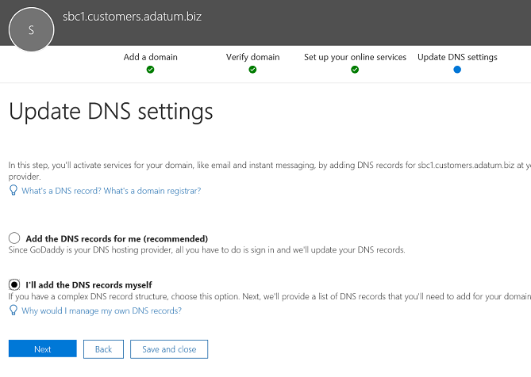

# Настройка множества клиентов в пограничном контроллере сеансов

Прямая маршрутизация поддерживает настроить один контроллер сеанса для обслуживания нескольких клиентов.

> [!NOTE]
> Этот сценарий предназначен для партнеров и операторов ТСОП, которые называются операторами, которые называются операторами, которые называются операторами, которые называются операторами, которые называются операторами. Службы перевозчика продаются в Microsoft Teams клиентам. 

Оператор:
- Развертывает SBC в своем центре обработки данных (клиентам не нужно внедрять SBC и получать технические службы от перевозчика в клиенте Teams).
- Связывание SBC с несколькими клиентами.
- Предоставляет услуги ТСОП клиентам.
- Управляет качеством звонков на конечный.
- Отдельно за использование служб ТСОП.

Майкрософт не управляет операторами. Корпорация Майкрософт предлагает уАТС (Microsoft Phone System) и клиент Teams. Корпорация Майкрософт также сертифиции использует сертификаты SBC, которые можно использовать с телефонной системой Майкрософт. Перед выбором оператора убедитесь, что выбранный вами параметр сертифицирован sBC сертифицирован и сможет управлять качеством голоса.

Ниже описаны технические этапы настройки сценария.

**Только для операторов:**
1. Разверните SBC и настройте его для размещения сценария размещения в зависимости от поставщиков SBC сертифицированного [SBC.](#deploy-and-configure-the-sbc)
2. Зарегистрировать базовое доменное имя в клиенте перевозчика и запросите подстановочный сертификат.
3. Регистрация поддомена для каждого клиента, которое является частью базового домена.

**Оператор клиента с правами глобального администратора клиента.**
1. Добавьте поддоменное имя в клиент.
2. Активация имени поддомена.
3. Настройте связь от перевозчика клиента клиента и подготовки пользователей.

*Убедитесь, что вы понимали основы DNS и основы управления доменным именем в Microsoft 365 или Office 365. Прежде чем [дальше ознакомиться со службой поддержки доменов Microsoft 365 или Office 365,](https://support.office.com/article/Get-help-with-Office-365-domains-28343f3a-dcee-41b6-9b97-5b0f4999b7ef) ознакомьтесь со справочной поддержкой по доменам Microsoft 365 или Office 365.*

## Развертывание и настройка SBC

Подробные инструкции по развертыванию и настройке SBC для сценария, размещенного с помощью SBC, см. в документации поставщика SBC.

- **AudioCodes:** [Прямые заметки](https://www.audiocodes.com/solutions-products/products/products-for-microsoft-365/direct-routing-for-Microsoft-Teams)конфигурации маршрутизации — конфигурация SBC, описанный в сценарии "Подключение AudioCodes SBC к Microsoft Teams Direct directing Modeling Modeling Modeling". 
- **Oracle:** [прямые](https://www.oracle.com/technetwork/indexes/documentation/acme-packet-2228107.html)заметки конфигурации маршрутизации — конфигурация SBC описана в разделе "Майкрософт". 
- **Информация на ленте.**  Сведения о настройке межзнаковых сценариев для связи с лентой и на этой странице рекомендуется о настройке операторов [SBC](https://support.sonus.net/display/IOT/PBXs+-+SBC+5k7kSWe) на ленте . Инструкции по настройке операторов [SBC Edge для Microsoft Teams Direct Routing SBC Edge](https://support.sonus.net/display/UXDOC81/Connect+SBC+Edge+to+Microsoft+Teams+Direct+Routing+to+Support+Direct+Routing+Carrier)
- **TE-Systems (anynode):**  Зарегистрируйтесь на странице [сообщества TE-Systems для](https://community.te-systems.de/) документации и примеры о том, как настроить SBC для нескольких клиентов.
- **Метаж:**  Зарегистрировать ся на странице [сообщества Metaswitch](https://sso.metaswitch.com/UI/Login) для документации о том, как включить периметр SBC для нескольких клиентов.

> [!NOTE]
> Оплачивайте, как настроить заголовок "Контакт". Заголовок контакта используется для поиска клиента в сообщении с входящим приглашением. 

## Регистрация базового домена и поддоменов

Для сценария размещения необходимо создать следующие элементы:
- Одно базовое доменное имя, принадлежащее работе оператором.
- Поддомен, являющийся частью базового доменного имени каждого клиента.

В примере ниже:
- Время использования службы связи является оператором, который обслуживается нескольким клиентам, предлагая интернет-и техническую связь.
- Woodgrove Bank, Contoso и Adventure Works — три клиента с доменами Microsoft 365 или Office 365, но получают техническую службу от Adatum.

Поддомены **MUST** должны соответствовать имени полного доменного имени клиента, которые будут настроены для клиента и полного доменного имени в заголовке контакта при отправке приглашения в Microsoft 365 или Office 365. 

При поступлении вызова в интерфейсе Microsoft 365 или Office 365 прямой маршрутизации в интерфейсе используется заголовок "Контакт" для определения клиента, в котором нужно найти искомый пользователь. Непосредственная маршрутизация не использует подстановку номеров телефона в приглашении, так как некоторые клиенты имели номера, которые могут перекрываться в нескольких клиентах. Поэтому в заголовке списка контактов потребуются полные доменные имена, чтобы точно искать пользователя по номеру телефона.

*Дополнительные сведения  [о создании](https://support.office.com/article/Get-help-with-Office-365-domains-28343f3a-dcee-41b6-9b97-5b0f4999b7ef) доменных имен в организациях Microsoft 365 и Office 365 см. в справке по доменам Office 365.*

На следующей схеме перечислены требования для базового домена, поддоменов и заголовка контакта.

Для проверки подключений в SBC требуется сертификат. В сценарии размещения SBC необходимо запросить сертификат * \* с сертификатом с поддержкой секретного base_domain \* (например, .customers.adatum.biz)* Этот сертификат можно использовать для проверки подлинности подключения к нескольким клиентам, обслуживаемым из одного SBC.

В таблице ниже показан пример одной конфигурации.

|Новое доменное имя |Тип|Зарегистрированный  |SAN сертификата для SBC  |Домен клиента по умолчанию в примере  |Полное имя, которое SBC должно отобразиться в заголовке контакта при переадресации вызовов пользователям|
|---------|---------|---------|---------|---------|---------|
|customers.adatum.biz|    Опорная     |     В клиенте переводчика  |    \*.customers.adatum.biz  |   adatum.biz      |NA, это клиент службы, ни пользователей нет |
|sbc1.customers.adatum.biz|    Subdomain  |    В клиенте клиента  |    \*.customers.adatum.biz  | woodgrovebank.us  |  sbc1.customers.adatum.biz|
|sbc2.customers.adatum.biz  |   Subdomain | В клиенте клиента   |   \*.customers.adatum.biz   |contoso.com   |sbc2.customers.adatum.biz |
|sbc3.customers.adatum.biz |   Subdomain | В клиенте клиента |   \*.customers.adatum.biz  |  adventureworks.com | sbc3.customers.adatum.biz |
||         |         |         |         |         |

Чтобы настроить базовые и поддомены, выполните описанные ниже действия. В этом примере мы настроим для базового доменного имени (customers.adatum.biz) и поддомен для одного клиента (sbc1.customers.adatum.biz в клиенте Woodgrove Bank).

> [!NOTE]
> Используйте sbcX.customers.adatum.biz для включения голосового голоса в клиенте переключения. sbcX может быть любое уникальное и допустимое буквенно-фактическое имя узла.

## Регистрация базового доменного имени в клиенте перевозчика

**Эти действия выполняются в клиенте перевозчика.**

### Убедитесь, что у вас есть права в клиенте перевозчика

Добавить новые домены можно только в том случае, если вы вошли в Центр администрирования Microsoft 365 как глобальный администратор. 

Чтобы проверить, есть ли у вас роль, войдите в Центр администрирования Microsoft 365 https://portal.office.com) (выберите **"Активные**пользователи" и убедитесь, что у вас есть  >  **Active Users**роль глобального администратора. 

Дополнительные сведения о ролях администраторов и назначении ролей в Microsoft 365 или Office 365 см. в статье ["Роли администраторов".](https://support.office.com/article/About-Office-365-admin-roles-da585eea-f576-4f55-a1e0-87090b6aaa9d)

### Добавление базового домена в клиент и проверка его

1. В Центре администрирования Microsoft 365 выберите элемент **"Настройка**  >  **доменов.**  >  **Add domain**
2. В поле **"Введите имя домена, которого** вы являетесь владельцем домена", введите полное доменное имя базового домена. В приведенном ниже примере базовым доменом является *customers.adatum.biz.*

    

3. Нажмите кнопку **Далее**.
4. В примере клиент уже содержит adatum.biz как проверенное доменное имя. Мастер не запрошает дополнительную проверку, так как customers.adatum.biz поддомен для уже зарегистрированного имени. Однако если добавить полное имя, которое раньше не было проверено, вам потребуется выполнить проверку. Процесс проверки описан [ниже.](#add-a-subdomain-to-the-customer-tenant-and-verify-it)

    

5. Нажмите **кнопку**"Далее", на странице **"Обновить параметры DNS"** выберите "Я добавим **записи DNS самостоятельно"** и нажмите кнопку **"Далее".**
6. На следующей странице очистите все значения (если вы не хотите использовать имя доменного имени **Next**для Exchange, SharePoint или Teams или Skype для бизнеса), нажмите кнопку "Далее" и нажмите **кнопку "Готово".** Убедитесь, что новый домен находится в состоянии установки.

    

### Активация доменного имени

Зарегистрировав доменное имя, его нужно активировать. Для этого добавьте хотя бы одного пользователя E1, E3 или E5 и назначив SIP-адрес у полного домена, соответствующей его адресу. Лицензию можно отозвать после активации домена (это может занять до 24 часов).

*Дополнительные сведения об добавлении [пользователей в организациях Microsoft 365](https://support.office.com/article/Get-help-with-Office-365-domains-28343f3a-dcee-41b6-9b97-5b0f4999b7ef) и Office 365 см. в справке по доменам Microsoft 365 или Office 365.*

Например, test@customers.adatum.biz

## Регистрация поддомена в клиенте клиента

Для каждого клиента потребуется создать уникальное поддоменное имя. В этом примере мы создадим поддомен sbc1.customers.adatum.biz клиенте с доменным именем по умолчанию, используемым по умолчанию woodgrovebank.us.

**Все действия приведены в клиенте клиента.**

### Проверка наличия необходимых прав в клиенте клиента

Добавить новые домены можно только в том случае, если вы вошли в Центр администрирования Microsoft 365 как глобальный администратор. 

Чтобы проверить, есть ли у вас роль, войдите в Центр администрирования Microsoft 365 https://portal.office.com) (выберите **"Активные**пользователи" и убедитесь, что у вас есть  >  **Active Users**роль глобального администратора. 

Дополнительные сведения о ролях администраторов и назначении ролей в Microsoft 365 или Office 365 см. в статье ["Роли администраторов".](https://support.office.com/article/About-Office-365-admin-roles-da585eea-f576-4f55-a1e0-87090b6aaa9d)

### Добавление поддомена в клиент клиента и его проверка
1. В Центре администрирования Microsoft 365 выберите элемент **"Настройка**  >  **доменов.**  >  **Add domain**
2. В поле **"Введите имя домена, которым** вы являетесь владельцем домена", введите полное доменное имя поддомена для этого клиента. В приведенном ниже примере поддомен является sbc1.customers.adatum.biz.

    

3. Нажмите кнопку **Далее**.
4. Полное имя_вопроса в клиенте никогда не было зарегистрировано. На следующем этапе потребуется подтвердить домен. Вместо **этого выберите "Добавить запись типа TXT".** 

    

5. Нажмите **кнопку**"Далее" и запомните значение TXT, сгенерированное для проверки доменного имени.

    

6. Создайте запись TXT со значением из предыдущего этапа поставщика услуг размещения DNS.

    

    Дополнительные сведения см. в статье ["Создание записей DNS на сайте любого поставщика услуг размещения DNS".](https://support.office.com/article/create-dns-records-at-any-dns-hosting-provider-for-office-365-7b7b075d-79f9-4e37-8a9e-fb60c1d95166)

7. Вернитесь в Центр администрирования Microsoft 365 клиента и нажмите **кнопку "Проверить".** 
8. На следующей странице выберите **"Я добавим записи DNS самостоятельно" и** нажмем кнопку "Далее". **Next**

    

9. На странице **"Выбор веб-служб"** отмените все параметры и нажмите кнопку "Далее". **Next**

    

10. Нажмите **кнопку** "Готово" на странице **"Обновить параметры DNS".**

    

11. Убедитесь, что состояние **завершено.** 
    
    

### Активация имени поддомена

После регистрации доменного имени необходимо активировать его, добавив по крайней неменной части и назначив SIP-адрес у SIP-адреса, соответствующий его адресу, в клиенте клиента клиента. Лицензию можно отозвать после активации поддомена (это может занять до 24 часов).

*Дополнительные сведения об добавлении [пользователей в организациях Microsoft 365](https://support.office.com/article/Get-help-with-Office-365-domains-28343f3a-dcee-41b6-9b97-5b0f4999b7ef) и Office 365 см. в справке по доменам Microsoft 365 или Office 365.*

Например, test@sbc1.customers.adatum.biz

### Создание линии спортсмена и подготовки пользователей

В первом выпуске прямой маршрутизации корпорация Майкрософт необходима ли добавить в каждый обслуживаемый клиент (клиент) новый cSOnlinePSTNGateway.

Однако это требуемый по двум причинам:
 
- **Нагрузка на градус..** Нестабильная загрузка или перекрытие SBC,например, изменяет некоторые параметры, такие как отключение или отключение медиаданных. Для изменения порта необходимо изменить параметры в нескольких клиентах (путем выполнения командлета Set-CSOnlinePSTNGateway), но он остается на самом же SBC-самом же слове. 

-  **Наложение обработки.** Сбор и мониторинг данных о работоспособности. Параметры SIP, собранные из нескольких логических слов, которые являются в реальности, той же SBC и той же физической линией трафика, замедливающая обработку маршрутизации данных.
 
Майкрософт отправляет новую логику для подготовки угроз для клиентов.

Вэтой статье даны два новых сущностей:
-    Trunprier trunk зарегистрирован в клиенте перевозчика с помощью команды New-CSOnlinePSTNGateway -FQDNGateway -FQDN customers.adatum.biz -SIPSignalingport 5068 -ForwardPAI $true.

-    Наливальная угрозка, для которой регистрация не требуется. Это просто имя узла, добавленное из набора карьеры. Оно выполняет извлекаемые параметры конфигурации от карманово. Динамическая линия транспорта не обязательно должна создаваться в PowerShell, а связь с ней основано на имени FQDN (см. подробные сведения ниже).

**Логика подготовки и пример**

-    Для операторов только для операторов и управления ими достаточно будет использовать одну линию (truner truner в домене оператора) с помощью команды Set-CSOnlinePSTNGateway. В приведенном выше примере это adatum.biz;
-    В клиенте клиента оператор должен добавить только полное полное полное имя FQDN в политики маршрутизации голосовой маршрутизации пользователей. Для обработки не требуется выполнять новый-CSOnlinePSTNGateway.
-    Названия, наследуемые или прошу все параметры конфигурации от карандаша. Примеры
-    Customers.adatum.biz — слово перевода, которую нужно создать в клиенте перевода.
-    Sbc1.customers.adatum.biz — известная тенденция в клиенте клиента, который не нужно создавать в PowerShell.  Вы можете просто добавить имя производимой тисковой сигнала в клиенте клиента в политике маршрутизации голосовой связи, не создавая его.
-   Carrier потребуется настроить запись DNS, чтобы оператор указал в целом составе SBC IP-адрес абонента.

-    Все изменения, внесенные на груше в каретке (в клиенте перевода), автоматически применяются к соответствующим прерыванию. Например, операторы могут изменить порт SIP на силе курьерской работы, и это изменение применяется ко всем подробным лицам. Новая логика для настройки трудозатрат упрощает управление, потому что вам не нужно переходить на каждый клиент и изменить параметр на каждой степени.
-    Параметры отправляются только к полному полному имени лицо связи с карандашом. Состояние работоспособности линии связи применяется ко всем выделенным линионным линиям, которое используется для принятия решений о маршрутизации. Узнайте больше о [параметрах прямой маршрутизации.](https://docs.microsoft.com/microsoftteams/direct-routing-monitor-and-troubleshoot)
-    Оператор может скорректировать график курьеры, и все сложные транспортные линии также будут различены. 
 

**Переход из предыдущей модели к карандашу**
 
При миграции из текущей реализации модели оператора, размещенной в новую модель, операторам должна повторно настроить упаковки для клиентов. Удалите линии из клиентов клиентов клиентов с помощью Remove-CSOnlinePSTNGateway (оставив при этом сертификат в клиенте перевозчика):

Мы настоятельно рекомендуем перейти на новое решение как можно скорее, как мы добавим мониторинг и доставку с помощью оператора торговой и основная трудозатраты.
 

Инструкции по настройке отправки полного доменного имени поддоменов в заголовке контакта см. в инструкциях поставщика [SBC.](#deploy-and-configure-the-sbc)

## Рекомендации по настройке отработки отработки микрофона клиента 

Чтобы настроить отработку отказа в среде с несколькими клиентами, выполните указанные ниже действия.

- Для каждого клиента добавьте полные доменные имена для двух разных SBC.  Например:

   customer1.sbc1.contoso.com  
   customer1.sbc2.contoso.com  

- В политиках маршрутизации голосовой связи по сети укажите оба снимка.  Если один sBC не удается, политика маршрутизации будет перенаправлять звонки по второму SBC.

## См. также

[Планирование прямой маршрутизации](direct-routing-plan.md)

[Настройка прямой маршрутизации](direct-routing-configure.md)

