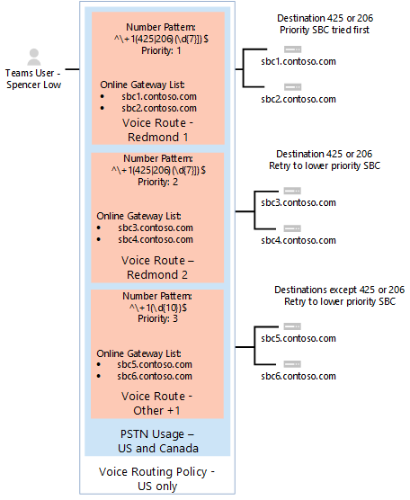

# <a name="configure-call-routing-for-direct-routing"></a>Настройка маршрутизов вызовов для прямой маршрутии

В этой статье описано, как настроить маршрутику вызовов для прямой маршрутии. Это шаг 3 из следующих действий по настройке прямой маршрутии:

- Шаг 1. [Подключение SBC с Телефон (Майкрософт) и проверьте подключение](direct-routing-connect-the-sbc.md) 
- Шаг 2. [Включить для пользователей прямую маршрутику, голосовую и голосовую почту](direct-routing-enable-users.md)
- **Шаг 3. Настройка маршрутизов вызовов** (эта статья)
- Шаг 4. [Перевод чисел в альтернативный формат](direct-routing-translate-numbers.md) 

Сведения о всех действиях, необходимых для настройки прямой маршрутии, см. в этой [ссылке.](direct-routing-configure.md)

## <a name="call-routing-overview"></a>Обзор маршрутии вызовов

Телефон (Майкрософт) В системе есть механизм маршрутации, позволяющий перенаправить звонок на определенный контроллер границы сеанса на основе: 

- The called number pattern 
- Шаблон вызываемого номера, а также конкретный пользователь, который совершает звонок
 
SBCs можно сделать активными и резервными. Если SBC, настроенный как активный, не доступен для определенного маршрута звонка, звонок будет перенанаться на резервную копию SBC.
 
Маршрутия вызовов состоит из следующих элементов: 

- **Политика маршрутизов вызовов** — также называется политикой маршрутизов голосовой маршрутии. Контейнер для использования услуг STN, который можно на назначении пользователю или нескольким пользователям. 

- **Использование услуг STN** — контейнер для голосовых маршрутов и использования услуг STN, который можно использовать с использованием различных политик маршрутов голосовой маршрутии. 

- **Голосовые маршруты** — шаблон номера и набор сетевых шлюзов ЗВОНКОВ, которые используются для звонков, где номер звонка соответствует шаблону.

- Сетевой шлюз **STN** — указатель на SBC, который также сохраняет конфигурацию, применяемую при размещении звонка через SBC, например перенапорядующий P-Наядерный-identity (PAI) или Preferred Codecs; могут быть добавлены в голосовые маршруты.

## <a name="voice-routing-policy-considerations"></a>Аспекты политики маршрутинга голосовой почты

Если у пользователя есть лицензия на план звонков, исходяющие звонки этого пользователя автоматически маршрутируются через инфраструктуру ЗВОНКОВ плана ЗВОНКОВ Майкрософт. Если вы настроили и назначили политику маршрутинга голосовой почты пользователю плана звонков, то исходяющие звонки этого пользователя проверяются на то, соответствует ли этот номер шаблону номера, определенному в политике маршрутиза голосовой почты в Интернете. Если есть совпадение, звонок будет перенаправиться через линию прямой маршрутии. Если совпадения не совпадают, звонок передается через инфраструктуру ЗВОНКОВ по плану ЗВОНКОВ.

> [!CAUTION]
> Если вы настроите и примените глобальную политику голосовой маршрутизации (по умолчанию в организации), все пользователи в организации, у которых есть голосовая связь, наследуют ее, что может привести к непреднамеренной перенаправке звонков от пользователей плана звонков на линию прямой маршрутизации. Если вы не хотите, чтобы все пользователи использовали глобальную политику маршрутинга голосовой почты в Интернете, настройте настраиваемую политику маршрутинга голосовой почты в Интернете и назначьте ее отдельным пользователям с поддержкой голосовой почты.

## <a name="example-1-voice-routing-with-one-pstn-usage"></a>Пример 1. Маршрутия голосовой связи с использованием одного ПСN

На следующей схеме показаны два примера политик маршрутизов голосовой маршрутии в потоке зовов.

**Звонок Flow 1 (слева):** Если пользователь звонит на +1 425 XXX XX или +1 206 XXX XX XX, звонок перенанося в SBC sbc1.contoso.biz или sbc2.contoso.biz. Если ни sbc1.contoso.biz, ни sbc2.contoso.biz недоступны, звонок будет отброшен. 

**Звонок Flow 2 (справа):** Если пользователь звонит на +1 425 XXX XX или +1 206 XXX XX XX, звонок сначала перенанося в SBC sbc1.contoso.biz или sbc2.contoso.biz. Если ни один из SBC не доступен, будет опробовен маршрут с более низким приоритетом (sbc3.contoso.biz и sbc4.contoso.biz). Если ни один из SBCs не доступен, звонок будет сброшен. 


В обоих примерах при присвоении голосовой маршруту приоритетов SBCs в маршрутах попытались в случайном порядке.

  > [!NOTE]
  > Если у пользователя нет лицензии на план звонков Майкрософт, звонки на любые номера, кроме номеров, которые соответствуют шаблонам +1 425 XXX XX XX или +1 206 XXX XX XX в конфигурации примера, будут сброшены. Если у пользователя есть лицензия на план звонков, звонок автоматически передается в соответствии с политиками плана звонков Майкрософт. План звонков (Майкрософт) применяется автоматически как последний маршрут для всех пользователей с лицензией на план звонков Майкрософт и не требует дополнительной настройки маршрутизов звонков.

В приведеном ниже примере для отправки звонков на другие номера в США и Канаде (для звонков по шаблону номера +1 XXX XXX XX XX) добавляется голосовой маршрут.


Для всех остальных звонков, если у пользователя есть обе лицензии (Телефон (Майкрософт) система и план звонков Майкрософт), используется автоматический маршрут. Если ничего не соответствует шаблонам номеров в сетевых голосовых маршрутах, созданных администратором, звонок перенаправлен через план звонков Майкрософт. Если у пользователя только Телефон (Майкрософт) система, звонок будет отброшен, так как не доступны правила.

  > [!NOTE]
  > Значение priority для маршрута "Other +1" в данном случае не имеет значения, так как существует только один маршрут, который соответствует шаблону +1 XXX XXX XX XX. Если пользователь звонит на +1 324 567 89 89 и sbc5.contoso.biz и sbc6.contoso.biz недоступны, звонок будет отброшен.

В следующей таблице подводятся итоги конфигурации с использованием трех голосовых маршрутов. В этом примере все три маршрута являются частью одного и того же использования ДНР (США и Канада).  Все маршруты связаны с использованием ОКП "США и Канада", а использование STN — с политикой голосовой маршрутии "Только в США".

|**Использование ТСОП**|**Голосовой маршрут**|**Шаблон номеров**|**Priority (Приоритет)**|**SBC**|**Описание**|
|:-----|:-----|:-----|:-----|:-----|:-----|
|США и Канада|"Редмонд 1"|^\\+1(425 \| 206)(\d {7} )$|1|sbc1.contoso.biz<br/>sbc2.contoso.biz|Активный маршрут для номеров + 1 425 XXX XX XX или +1 206 XXX XX|
|США и Канада|"Редмонд 2"|^\\+1(425 \| 206)(\d {7} )$|2|sbc3.contoso.biz<br/>sbc4.contoso.biz|Резервное копирование маршрута для номеров +1 425 XXX XX XX или +1 206 XXX XX|
|США и Канада|"Other +1"|^\\+1(\d {10} )$|3|sbc5.contoso.biz<br/>sbc6.contoso.biz|Маршрут по номерам +1 XXX XXX XX XX (за исключением +1 425 XXX XX или +1 206 XXX XX XX)|
|||||||

## <a name="example-1-configuration-steps"></a>Пример 1. Шаги настройки

В следующем примере показано, как:

1. Создание единого использования ННР.
2. Настройка трех голосовых маршрутов.
3. Создайте политику маршрутинга голосовой почты.
4. Назначьте политику пользователю с именем Низкий уровень.

Для выполнения этих [действий Microsoft Teams центр администрирования](#admincenterexample1) или [PowerShell.](#powershellexample1)

### <a name="using-the-microsoft-teams-admin-center"></a>С помощью Центра администрирования Microsoft Teams
<a name="admincenterexample1"></a>

#### <a name="step-1-create-the-us-and-canada-pstn-usage"></a>Шаг 1. Создание ОКП "США и Канада"

1. В левой области навигации Центра администрирования Microsoft Teams перейдите в voice  >  **Direct Routing**, а затем в правом верхнем углу выберите Управление записями использования **STN**.
2. Нажмите **кнопку Добавить**, **введите США и Канада** и нажмите кнопку **Применить**.

#### <a name="step-2-create-three-voice-routes-redmond-1-redmond-2-and-other-1"></a>Шаг 2. Создание трех голосовых маршрутов (Redmond 1, Redmond 2 и Other +1)

Ниже описано, как создать голосовой маршрут. В этом примере вы можете создать три голосовые маршруты с именами Redmond 1, Redmond 2 и Other +1, используя параметры, описанные в таблице выше.

1. В левой области навигации центра администрирования Microsoft Teams перейдите в voice  >  **Direct Routing** и выберите **вкладку Маршруты голосовой** связи.
2. Нажмите **кнопку** Добавить и введите имя и описание голосового маршрута.
3. Закажите приоритет и шаблон набора номера.
4. Чтобы зарегистрировать SBC с помощью голосового маршрута, в области Зарегистрированные **SBCs (необязательно)** щелкните Добавить SBCs , выберите **SBCs,** которые вы хотите зарегистрировать, и нажмите кнопку **Применить**.
5. Чтобы добавить записи использования ННР, в области Записи использования ННР **(необязательно)** щелкните Добавить использование ННР , выберите записи ННП, которые вы хотите добавить, и нажмите кнопку **Применить**.
6. Нажмите кнопку **Сохранить**.

#### <a name="step-3-create-a-voice-routing-policy-named-us-only-and-add-the-us-and-canada-pstn-usage-to-the-policy"></a>Шаг 3. Создание политики голосовой маршрутизовки с именем "Только для США" и добавление в нее использования STN "США и Канада"

1. В левой области навигации Центра администрирования Microsoft Teams перейдите к политике маршрутации голосовой голосовой почты  >  и нажмите кнопку **Добавить**.
2. Введите **в** качестве имени только US и добавьте описание.
3. В **области Записи использования** ННР щелкните Добавить использование **ОКП**, выберите запись использования ННП "США и Канада" и нажмите кнопку **Применить**.
4. Нажмите кнопку **Сохранить**.

Дополнительные узнать см. в [управлении политиками маршрутии голосовой маршрутии.](manage-voice-routing-policies.md)

#### <a name="step-4-assign-the-voice-routing-policy-to-a-user-named-spencer-low"></a>Шаг 4. Назначение политики маршрутинга голосовой почты пользователю с именем Низкий уровень

1. В Центре администрирования Microsoft Teams в области навигации слева перейдите в раздел **Пользователи**, затем щелкните пользователя.
2. Щелкните **Политики**, а затем рядом с **кнопкой Назначенные политики** нажмите кнопку **Изменить**.
3. В **области Политика маршрутинга голосовой** почты выберите политику "Только для США" и нажмите кнопку **Сохранить**.

Дополнительные узнать см. в [управлении политиками маршрутии голосовой маршрутии.](manage-voice-routing-policies.md)

### <a name="using-powershell"></a>С помощью PowerShell
<a name="powershellexample1"></a>


#### <a name="step-1-create-the-us-and-canada-pstn-usage"></a>Шаг 1. Создание ОКП "США и Канада"

В удаленном сеансе PowerShell в Skype для бизнеса Online введите:

```PowerShell
Set-CsOnlinePstnUsage -Identity Global -Usage @{Add="US and Canada"}
```

Убедитесь, что использование создано путем ввода:

```PowerShell
Get-CSOnlinePSTNUsage
``` 

Возвращает список усеченных имен.

```console
Identity    : Global
Usage        : {testusage, US and Canada, International, karlUsage. . .}
```

В следующем примере показан результат запуска команды PowerShell для отображения полных имен `(Get-CSOnlinePSTNUsage).usage` (без усеченных):

```console
 testusage
 US and Canada
 International
 karlUsage
 New test env
 Tallinn Lab Sonus
 karlUsage2
 Unrestricted
 Two trunks
```

#### <a name="step-2-create-three-voice-routes-redmond-1-redmond-2-and-other-1"></a>Шаг 2. Создание трех голосовых маршрутов (Redmond 1, Redmond 2 и Other +1)

Чтобы создать маршрут Redmond 1, в сеансе PowerShell в Skype для бизнеса Online введите:

```PowerShell
New-CsOnlineVoiceRoute -Identity "Redmond 1" -NumberPattern "^\+1(425|206)
(\d{7})$" -OnlinePstnGatewayList sbc1.contoso.biz, sbc2.contoso.biz -Priority 1 -OnlinePstnUsages "US and Canada"
```

Возвращает:

```console
Identity                : Redmond 1
Priority                : 1
Description             :
NumberPattern           : ^\+1(425|206) (\d{7})$
OnlinePstnUsages        : {US and Canada}
OnlinePstnGatewayList   : {sbc1.contoso.biz, sbc2.contoso.biz}
Name                    : Redmond 1
```

Чтобы создать маршрут Redmond 2, введите:

```PowerShell
New-CsOnlineVoiceRoute -Identity "Redmond 2" -NumberPattern "^\+1(425|206)
(\d{7})$" -OnlinePstnGatewayList sbc3.contoso.biz, sbc4.contoso.biz -Priority 2 -OnlinePstnUsages "US and Canada"
```

Чтобы создать маршрут Другой +1, введите:

```PowerShell
New-CsOnlineVoiceRoute -Identity "Other +1" -NumberPattern "^\+1(\d{10})$"
-OnlinePstnGatewayList sbc5.contoso.biz, sbc6.contoso.biz -OnlinePstnUsages "US and Canada"
```

  > [!CAUTION]
  > Убедитесь, что регулярное выражение в атрибуте NumberPattern является допустимым выражением. Вы можете проверить это на этом веб-сайте: [https://www.regexpal.com](https://www.regexpal.com)

В некоторых случаях необходимо перена маршрутизовыть все звонки на один и тот же SBC. use -NumberPattern ".*"

Перена маршрутизовы всех звонков на один SBC.

```PowerShell
Set-CsOnlineVoiceRoute -id "Redmond 1" -NumberPattern ".*" -OnlinePstnGatewayList sbc1.contoso.biz
```

Убедитесь, что вы правильно настроили маршрут, вы можете использовать команды `Get-CSOnlineVoiceRoute` PowerShell с помощью параметров, как показано ниже.

```PowerShell
Get-CsOnlineVoiceRoute | Where-Object {($_.priority -eq 1) -or ($_.priority -eq 2) or ($_.priority -eq 4) -Identity "Redmond 1" -NumberPattern "^\+1(425|206) (\d{7})$" -OnlinePstnGatewayList sbc1.contoso.biz, sbc2.contoso.biz -Priority 1 -OnlinePstnUsages "US and Canada"
```
Возвращаемая

```console
Identity            : Redmond 1 
Priority               : 1
Description         : 
NumberPattern         : ^\+1(425|206) (\d{7})$
OnlinePstnUsages     : {US and Canada}     
OnlinePstnGatewayList    : {sbc1.contoso.biz, sbc2.contoso.biz}
Name             : Redmond 1
Identity        : Redmond 2 
Priority               : 2
Description         : 
NumberPattern         : ^\+1(425|206) (\d{7})$
OnlinePstnUsages     : {US and Canada}     
OnlinePstnGatewayList    : {sbc3.contoso.biz, sbc4.contoso.biz}
Name             : Redmond 2
    
Identity        : Other +1 
Priority               : 4
Description         : 
NumberPattern         : ^\+1(\d{10})$
OnlinePstnUsages     : {US and Canada}     
OnlinePstnGatewayList    : {sbc5.contoso.biz, sbc6.contoso.biz}
Name             : Other +1
```

В этом примере маршруту "Другие +1" был автоматически назначен приоритет 4. 

#### <a name="step-3-create-a-voice-routing-policy-named-us-only-and-add-the-us-and-canada-pstn-usage-to-the-policy"></a>Шаг 3. Создание политики голосовой маршрутизовки с именем "Только для США" и добавление в нее использования STN "США и Канада"

В сеансе PowerShell в Skype для бизнеса Online введите:

```PowerShell
New-CsOnlineVoiceRoutingPolicy "US Only" -OnlinePstnUsages "US and Canada"
```

В этом примере показан результат:

```console
Identity            : Tag:US only
OnlinePstnUsages    : {US and Canada}
Description         :
RouteType           : BYOT
```

#### <a name="step-4-assign-the-voice-routing-policy-to-a-user-named-spencer-low"></a>Шаг 4. Назначение политики маршрутинга голосовой почты пользователю с именем Низкий уровень

В сеансе PowerShell в Skype для бизнеса Online введите:

```PowerShell
Grant-CsOnlineVoiceRoutingPolicy -Identity "Spencer Low" -PolicyName "US Only"
```

Чтобы проверить назначение политики, введите эту команду:

```PowerShell
Get-CsOnlineUser "Spencer Low" | select OnlineVoiceRoutingPolicy
```

Команда возвращает следующую команду:

```console
OnlineVoiceRoutingPolicy
---------------------
US Only
```

## <a name="example-2-voice-routing-with-multiple-pstn-usages"></a>Пример 2. Маршрутная маршрутия голосовой связи с несколькими использованием услуг ПСО

Политика маршрутинга голосовой связи, созданная в примере 1, позволяет звонить только на номера телефонов в США и Канаде, если пользователю не назначена лицензия на план звонков Майкрософт.

В примере, который вы выполните, вы можете создать политику маршрутинга голосовой маршрутии "Без ограничений". Политика повторно будет использовать использование ПСС "США и Канада", созданное в примере 1, а также новое "международное" использование ОКП. Эта политика перенананола все остальные звонки на sbc2.contoso.biz и sbc5.contoso.biz.

В показанных примерах политика "Только в США" назначается пользователю Low, а политика без ограничений — пользователю Ивану Иванову, чтобы маршрутия велись следующим образом:

- Low — политика только для США.  Звонки разрешены только на номера в США и Канаде. При вызове в диапазон номеров Редмонда необходимо использовать определенный набор SBCs. Номера, не в том числе для США, не будут маршрутизовы, если пользователю не назначена лицензия на план звонков.

- John John John — международная политика.  Звонки разрешены на любой номер. При вызове в диапазон номеров Редмонда необходимо использовать определенный набор SBCs. Номера, не в сша, будут маршрутивться с sbc2.contoso.biz и sbc5.contoso.biz.



Для всех остальных звонков, если у пользователя есть обе лицензии (Телефон (Майкрософт) Система и План звонков Майкрософт), автоматический маршрут используется. Если ничего не соответствует шаблонам номеров в сетевых голосовых маршрутах, созданных администратором, звонок перенаправлен с помощью плана звонков Майкрософт.  Если у пользователя только Телефон (Майкрософт) система, звонок будет отброшен, так как не доступны правила.


В следующей таблице 2010 2016 2016 2016 2016 2016 2013 2016 2016 2016 2013 2016 2013 2 

| Использование ТСОП | Голосовой маршрут | Шаблон номера | Priority (Приоритет) | SBC | Описание |
|:-----|:-----|:-----|:-----|:-----|:-----|
|США и Канада|"Редмонд 1"|^\\+1(425 \| 206)(\d {7} )$|1|sbc1.contoso.biz<br/>sbc2.contoso.biz|Активный маршрут для номеров звонит +1 425 XXX XX XX или +1 206 XXX XX|
|США и Канада|"Редмонд 2"|^\\+1(425 \| 206)(\d {7} )$|2|sbc3.contoso.biz<br/>sbc4.contoso.biz|Резервное копирование маршрута для номеров звонит +1 425 XXX XX XX или +1 206 XXX XX|
|США и Канада|"Other +1"|^\\+1(\d {10} )$|3|sbc5.contoso.biz<br/>sbc6.contoso.biz|Route for callee numbers +1 XXX XXX XX XX (except +1 425 XXX XX XX or +1 206 XXX XX XX)|
|International|International|\d+|4|sbc2.contoso.biz<br/>sbc5.contoso.biz|Маршрут для любого числового шаблона |

  > [!NOTE]
  > - Очень важно порядок использования услуг ОКП в политиках маршрутиза голосовой маршрутии. Использование применяется по порядку, и если совпадение найдено в первом использовании, то другие использования никогда не вычисляются. После использования ОКП "США" и "Канада" необходимо использовать "Международные" ДНР. Чтобы изменить порядок использования ОКП, запустите `Set-CSOnlineVoiceRoutingPolicy` команду. <br/>Например, чтобы изменить порядок с "США и Канада" первым, а второй — с "Международный", на обратный порядок выполнить:<br/> `Set-CsOnlineVoiceRoutingPolicy -id tag:"no Restrictions" -OnlinePstnUsages @{Replace="International", "US and Canada"}`
 > - Приоритет для голосовых маршрутов "Другие +1" и "Международные" назначен автоматически. Они имеют более низкий приоритет, чем "Редмонд 1" и "Редмонд 2".

## <a name="example-2-configuration-steps"></a>Пример 2. Шаги настройки

В следующем примере показано, как:

1. Создайте новое использование ОКП под названием "Международные".
2. Создайте новый голосовой маршрут под названием "Международные".
3. Создайте политику маршрутинга голосовой почты под названием "Нет ограничений".
4. Назначьте политику пользователю John John John.

Для выполнения этих [действий Microsoft Teams центр администрирования](#admincenterexample2) или [PowerShell.](#powershellexample2)

### <a name="using-the-microsoft-teams-admin-center"></a>С помощью Центра администрирования Microsoft Teams
<a name="admincenterexample2"></a>

#### <a name="step-1-create-the-international-pstn-usage"></a>Шаг 1. Создание "международного" использования ОКП

1. В левой области навигации Центра администрирования Microsoft Teams перейдите в voice  >  **Direct Routing**, а затем в правом верхнем углу выберите Управление записями использования **STN**.
2. Нажмите **кнопку Добавить,** **введите Международные** и нажмите кнопку **Применить**.

#### <a name="step-2-create-the-international-voice-route"></a>Шаг 2. Создание "международного" голосового маршрута

1. В левой области навигации центра администрирования Microsoft Teams перейдите в voice  >  **Direct Routing** и выберите **вкладку Маршруты голосовой** связи.
2. Нажмите **кнопку** Добавить, введите в качестве имени название "Международные" и добавьте описание.
3. Установите для приоритета значение 4, а затем в шаблоне набора номера — \d+.
4. В **области Зарегистрированные SBCs (необязательно)** щелкните Добавить **SBCs**, выберите sbc2.contoso.biz и sbc5.contoso.biz и нажмите кнопку **Применить**.
5. В области Записи использования ОКП **(необязательно)** щелкните Добавить использование **ДНР**, выберите "Международный" запись использования ННР, а затем нажмите кнопку **Применить**.
6. Нажмите кнопку **Сохранить**.

#### <a name="step-3-create-a-voice-routing-policy-named-no-restrictions-and-add-the-us-and-canada-and-international-pstn-usages-to-the-policy"></a>Шаг 3. Создание политики голосовой маршрутизовки с именами "Без ограничений" и добавление в нее использования услуг ПС "США и Канада" и "Международные"

В этой политике перенаправки голосовой маршрутии повторно за счет использования ОКП "США и Канада" сохраняется специальная обработка звонков на номера "+1 425 XXX XX XX" и "+1 206 XXX XX XX" как локальные и локальные звонки.

1. В левой области навигации Центра администрирования Microsoft Teams перейдите к политике маршрутации голосовой голосовой почты  >  и нажмите кнопку **Добавить**.
2. Введите **в качестве** имени без ограничений и добавьте описание.
3. В **области Записи** использования ННР щелкните Добавить использование ОКП **,** выберите запись использования ННП "США и Канада", а затем выберите запись "Международные" записи использования ПСП. Нажмите кнопку **Применить**.

    Обратите внимание на порядок использования услуг STN:

    - Если звонок на номер "+1 425 XXX XX XX" с использованием, настроенным в данном примере, звонок будет проходить по маршруту, заданной в примере использования "США и Канада", и будет применена специальная логика маршрутации. Это значит, что звонок сначала sbc1.contoso.biz sbc2.contoso.biz, а затем sbc3.contoso.biz и sbc4.contoso.biz в качестве запасных маршрутов.

    - Если использование ОКП "Международный" находится до "США и Канада", звонки на номер +1 425 XXX XX перенапоряются на sbc2.contoso.biz и sbc5.contoso.biz в рамках логики маршрутки.

4. Нажмите кнопку **Сохранить**.

Дополнительные узнать см. в [управлении политиками маршрутии голосовой маршрутии.](manage-voice-routing-policies.md)

#### <a name="step-4-assign-the-voice-routing-policy-to-a-user-named-john-woods"></a>Шаг 4. Назначение политики маршрутизов голосовой почты пользователю с именем Иван Иванов

1. В Центре администрирования Microsoft Teams в области навигации слева перейдите в раздел **Пользователи**, затем щелкните пользователя.
2. Щелкните **Политики**, а затем рядом с **кнопкой Назначенные политики** нажмите кнопку **Изменить**.
3. В **области Политика маршрутинга голосовой** почты выберите политику "Без ограничений" и нажмите кнопку **Сохранить**.

В результате голосовая политика, применяемая к звонкам Джона Конюха, не имеет ограничений и будет следовать логике маршрутизазвонков, доступной в США, Канаде и международных звонках.

### <a name="using-powershell"></a>С помощью PowerShell
<a name="powershellexample2"></a>

#### <a name="step-1-create-the-international-pstn-usage"></a>Шаг 1. Создание "международного" использования ОКП

В удаленном сеансе PowerShell в Skype для бизнеса Online введите:

```PowerShell
Set-CsOnlinePstnUsage -Identity Global -Usage @{Add="International"}
```

#### <a name="step-2--create-a-new-voice-route-named-international"></a>Шаг 2. Создание нового голосового маршрута с именем "Международный"

```PowerShell
New-CsOnlineVoiceRoute -Identity "International" -NumberPattern ".*" -OnlinePstnGatewayList sbc2.contoso.biz, sbc5.contoso.biz -OnlinePstnUsages "International"
```

Возвращает:

```console
Identity                  : International
Priority                  : 5
Description               :
NumberPattern             : .*
OnlinePstnUsages          : {International}
OnlinePstnGatewayList     : {sbc2.contoso.biz, sbc5.contoso.biz}
Name                      : International
```

#### <a name="step-3-create-a-voice-routing-policy-named-no-restrictions"></a>Шаг 3. Создание политики маршрутизов голосовой почты с именем "Без ограничений"

В этой политике перенаправки повторно задаются номера "Redmond 1" и "Redmond 1" для сохранения специальной обработки звонков на номера "+1 425 XXX XX XX" и "+1 206 XXX XX XX" в качестве локальных или локальных звонков.

  ```PowerShell
  New-CsOnlineVoiceRoutingPolicy "No Restrictions" -OnlinePstnUsages "US and Canada", "International"
  ```

Обратите внимание на порядок использования услуг STN:

  - Если звонок с номером "+1 425 XXX XX XX" с использованием, настроенным в следующем примере, звонок будет проходить по маршруту, заехав на номер "США и Канада", и будет применена специальная логика маршрутации. Это значит, что звонок сначала sbc1.contoso.biz sbc2.contoso.biz, а затем sbc3.contoso.biz и sbc4.contoso.biz в качестве запасных маршрутов.

  - Если использование ОКП "Международный" находится до "США и Канада", звонки на номер +1 425 XXX XX перенапоряются на sbc2.contoso.biz и sbc5.contoso.biz в рамках логики маршрутки. Введите команду:

  ```PowerShell
  New-CsOnlineVoiceRoutingPolicy "No Restrictions" -OnlinePstnUsages "US and Canada", "International"
  ```

Возвращает:

```console
    Identity              : International 
    OnlinePstnUsages : {US and Canada, International}     
    Description         :  
    RouteType               : BYOT
```

#### <a name="step-4-assign-the-voice-routing-policy-to-the-user-named-john-woods"></a>Шаг 4. Назначение политики маршрутизов голосовой почты пользователю с именем Иван Иванов

```PowerShell
Grant-CsOnlineVoiceRoutingPolicy -Identity "John Woods" -PolicyName "No Restrictions"
```

Затем проверьте задание с помощью команды: 

```PowerShell
Get-CsOnlineUser "John Woods" | Select OnlineVoiceRoutingPolicy
```

Возвращает:

```console
OnlineVoiceRoutingPolicy
------------------------
No Restrictions
```

В результате голосовая политика, применяемая к звонкам Джона Конюха, не имеет ограничений и будет следовать логике маршрутизазвонков, доступной для звонков в США, Канаде и международных звонках.

## <a name="see-also"></a>См. также

[Планирование прямой маршрутизации](direct-routing-plan.md)

[Настройка прямой маршрутизации](direct-routing-configure.md)
