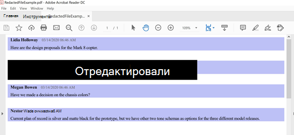

# <a name="conduct-an-ediscovery-investigation-of-content-in-microsoft-teams"></a><span data-ttu-id="32679-103">Обнаружение электронных данных в Microsoft Teams</span><span class="sxs-lookup"><span data-stu-id="32679-103">Conduct an eDiscovery investigation of content in Microsoft Teams</span></span>

<span data-ttu-id="32679-104">Крупные предприятия часто становятся в судебных разбирательствах по запросу отправки всей хранимой в электронном виде информации (ESI).</span><span class="sxs-lookup"><span data-stu-id="32679-104">Large Enterprises are often exposed to high penalty legal proceedings that demand submission of all Electronically Stored Information (ESI).</span></span> <span data-ttu-id="32679-105">Microsoft Teams контент можно искать и использовать во время исследования eDiscovery.</span><span class="sxs-lookup"><span data-stu-id="32679-105">Microsoft Teams content can be searched and used during eDiscovery investigations.</span></span>

## <a name="overview"></a><span data-ttu-id="32679-106">Обзор</span><span class="sxs-lookup"><span data-stu-id="32679-106">Overview</span></span>

<span data-ttu-id="32679-107">Все Microsoft Teams чаты 1:1 или группы проходят журнал в почтовые ящики соответствующих пользователей.</span><span class="sxs-lookup"><span data-stu-id="32679-107">All Microsoft Teams 1:1 or group chats are journaled through to the respective users' mailboxes.</span></span> <span data-ttu-id="32679-108">Все стандартные сообщения каналов пересылаются в почтовый ящик группы, представляющий группу.</span><span class="sxs-lookup"><span data-stu-id="32679-108">All standard channel messages are journaled through to the group mailbox representing the team.</span></span> <span data-ttu-id="32679-109">Файлы, добавленные в стандартные каналы, охватываются функциями eDiscovery для SharePoint Online и OneDrive для бизнеса.</span><span class="sxs-lookup"><span data-stu-id="32679-109">Files uploaded in standard channels are covered under the eDiscovery functionality for SharePoint Online and OneDrive for Business.</span></span>

<span data-ttu-id="32679-110">EDiscovery сообщений и файлов в закрытых [каналах](private-channels.md) работает не так, как в стандартных каналах.</span><span class="sxs-lookup"><span data-stu-id="32679-110">eDiscovery of messages and files in [private channels](private-channels.md) works differently than in standard channels.</span></span> <span data-ttu-id="32679-111">Дополнительные узнать см. в этой [ссылке.](#ediscovery-of-private-channels)</span><span class="sxs-lookup"><span data-stu-id="32679-111">To learn more, see [eDiscovery of private channels](#ediscovery-of-private-channels).</span></span>

<span data-ttu-id="32679-112">Не все Teams контента можно найти.</span><span class="sxs-lookup"><span data-stu-id="32679-112">Not all Teams content is eDiscoverable.</span></span> <span data-ttu-id="32679-113">В следующей таблице показаны типы контента, которые можно искать с помощью средств microsoft eDiscovery.</span><span class="sxs-lookup"><span data-stu-id="32679-113">The following table shows the content types that you can search for using Microsoft eDiscovery tools:</span></span>

| <span data-ttu-id="32679-114">Тип содержимого</span><span class="sxs-lookup"><span data-stu-id="32679-114">Content type</span></span> | <span data-ttu-id="32679-115">eDiscoverable</span><span class="sxs-lookup"><span data-stu-id="32679-115">eDiscoverable</span></span> | <span data-ttu-id="32679-116">Notes</span><span class="sxs-lookup"><span data-stu-id="32679-116">Notes</span></span> |
|:--- | :--- |:--- |
|<span data-ttu-id="32679-117">Аудиозаписи</span><span class="sxs-lookup"><span data-stu-id="32679-117">Audio recordings</span></span> | <span data-ttu-id="32679-118">Нет</span><span class="sxs-lookup"><span data-stu-id="32679-118">No</span></span> | |
|<span data-ttu-id="32679-119">Содержимое карточки</span><span class="sxs-lookup"><span data-stu-id="32679-119">Card content</span></span>|<span data-ttu-id="32679-120">Да</span><span class="sxs-lookup"><span data-stu-id="32679-120">Yes</span></span>|<span data-ttu-id="32679-121">Дополнительные [сведения см.](#search-for-card-content) в этой теме.</span><span class="sxs-lookup"><span data-stu-id="32679-121">See [Search for card content](#search-for-card-content) for more information.</span></span>|
|<span data-ttu-id="32679-122">Ссылки чата</span><span class="sxs-lookup"><span data-stu-id="32679-122">Chat links</span></span> | <span data-ttu-id="32679-123">Да</span><span class="sxs-lookup"><span data-stu-id="32679-123">Yes</span></span> | |
|<span data-ttu-id="32679-124">Сообщения чата</span><span class="sxs-lookup"><span data-stu-id="32679-124">Chat messages</span></span> | <span data-ttu-id="32679-125">Да</span><span class="sxs-lookup"><span data-stu-id="32679-125">Yes</span></span> |<span data-ttu-id="32679-126">Это относится к контенту Teams каналов, чатам 1:1, групповым чатам 1:N и чатам с участниками гостевого пользователя.</span><span class="sxs-lookup"><span data-stu-id="32679-126">This includes content in Teams channels, 1:1 chats, 1:N group chats, and chats with guest user participants.</span></span>  |
|<span data-ttu-id="32679-127">Фрагменты кода</span><span class="sxs-lookup"><span data-stu-id="32679-127">Code snippets</span></span> | <span data-ttu-id="32679-128">Нет</span><span class="sxs-lookup"><span data-stu-id="32679-128">No</span></span> | |
|<span data-ttu-id="32679-129">Измененные сообщения</span><span class="sxs-lookup"><span data-stu-id="32679-129">Edited messages</span></span> | <span data-ttu-id="32679-130">Да</span><span class="sxs-lookup"><span data-stu-id="32679-130">Yes</span></span> | <span data-ttu-id="32679-131">Если пользователь находится на удержании, предыдущие версии измененных сообщений также сохраняются.</span><span class="sxs-lookup"><span data-stu-id="32679-131">If the user is on hold, previous versions of edited messages are also preserved.</span></span> |
|<span data-ttu-id="32679-132">Эмодзи, GIF и наклейки</span><span class="sxs-lookup"><span data-stu-id="32679-132">Emojis, GIFs, and stickers</span></span> | <span data-ttu-id="32679-133">Да</span><span class="sxs-lookup"><span data-stu-id="32679-133">Yes</span></span> | |
|<span data-ttu-id="32679-134">Изображения в окне</span><span class="sxs-lookup"><span data-stu-id="32679-134">Inline images</span></span> | <span data-ttu-id="32679-135">Да</span><span class="sxs-lookup"><span data-stu-id="32679-135">Yes</span></span> | |
|<span data-ttu-id="32679-136">Мгновенные беседы на собрании</span><span class="sxs-lookup"><span data-stu-id="32679-136">Meeting IM conversations</span></span> | <span data-ttu-id="32679-137">Да</span><span class="sxs-lookup"><span data-stu-id="32679-137">Yes</span></span> | |
|<span data-ttu-id="32679-138">Метаданные собрания<sup>1</sup></span><span class="sxs-lookup"><span data-stu-id="32679-138">Meeting metadata<sup>1</sup></span></span> | <span data-ttu-id="32679-139">Да</span><span class="sxs-lookup"><span data-stu-id="32679-139">Yes</span></span> |  |
|<span data-ttu-id="32679-140">Название канала</span><span class="sxs-lookup"><span data-stu-id="32679-140">Name of channel</span></span> | <span data-ttu-id="32679-141">Нет</span><span class="sxs-lookup"><span data-stu-id="32679-141">No</span></span> | |
|<span data-ttu-id="32679-142">Сообщения в частном канале</span><span class="sxs-lookup"><span data-stu-id="32679-142">Private channel messages</span></span> | <span data-ttu-id="32679-143">Да</span><span class="sxs-lookup"><span data-stu-id="32679-143">Yes</span></span> | |
|<span data-ttu-id="32679-144">Котировки</span><span class="sxs-lookup"><span data-stu-id="32679-144">Quotes</span></span> | <span data-ttu-id="32679-145">Да</span><span class="sxs-lookup"><span data-stu-id="32679-145">Yes</span></span> | <span data-ttu-id="32679-146">Контент в кавычках можно искать.</span><span class="sxs-lookup"><span data-stu-id="32679-146">Quoted content is searchable.</span></span> <span data-ttu-id="32679-147">Однако результаты поиска не указывают на то, что контент был указан в кавычках.</span><span class="sxs-lookup"><span data-stu-id="32679-147">However, search results don't indicate that the content was quoted.</span></span> |
|<span data-ttu-id="32679-148">Реакции (например, "Нравится", "Сердце" и другие реакции)</span><span class="sxs-lookup"><span data-stu-id="32679-148">Reactions (such as likes, hearts, and other reactions)</span></span> | <span data-ttu-id="32679-149">Нет</span><span class="sxs-lookup"><span data-stu-id="32679-149">No</span></span> | |
|<span data-ttu-id="32679-150">Тема</span><span class="sxs-lookup"><span data-stu-id="32679-150">Subject</span></span> | <span data-ttu-id="32679-151">Да</span><span class="sxs-lookup"><span data-stu-id="32679-151">Yes</span></span> | |
|<span data-ttu-id="32679-152">Таблицы</span><span class="sxs-lookup"><span data-stu-id="32679-152">Tables</span></span> | <span data-ttu-id="32679-153">Да</span><span class="sxs-lookup"><span data-stu-id="32679-153">Yes</span></span> | |
|<span data-ttu-id="32679-154">Уведомления о веб-канале</span><span class="sxs-lookup"><span data-stu-id="32679-154">Feed notifications</span></span> | <span data-ttu-id="32679-155">Нет</span><span class="sxs-lookup"><span data-stu-id="32679-155">No</span></span> | |
|||

<span data-ttu-id="32679-156"><sup>1</sup> Метаданные собрания (и звонка) включают следующие:</span><span class="sxs-lookup"><span data-stu-id="32679-156"><sup>1</sup> Meeting (and call) metadata includes the following:</span></span>

- <span data-ttu-id="32679-157">Время начала и окончания собрания, а также длительность</span><span class="sxs-lookup"><span data-stu-id="32679-157">Meeting start and end time, and duration</span></span>
- <span data-ttu-id="32679-158">Присоединяться к событиям собраний и оставлять их для каждого участника</span><span class="sxs-lookup"><span data-stu-id="32679-158">Meeting join and leave events for each participant</span></span>
- <span data-ttu-id="32679-159">Присоединиться/звонки VOIP</span><span class="sxs-lookup"><span data-stu-id="32679-159">VOIP join/calls</span></span>
- <span data-ttu-id="32679-160">Анонимное участие</span><span class="sxs-lookup"><span data-stu-id="32679-160">Anonymous join</span></span>
- <span data-ttu-id="32679-161">Федератное присоединиться к пользователю</span><span class="sxs-lookup"><span data-stu-id="32679-161">Federated user join</span></span>
- <span data-ttu-id="32679-162">Присоединиться к гостевому пользователю</span><span class="sxs-lookup"><span data-stu-id="32679-162">Guest user join</span></span>

  <span data-ttu-id="32679-163">На рисунке показан пример метаданных собрания.</span><span class="sxs-lookup"><span data-stu-id="32679-163">The image shows an example of meeting metadata.</span></span>

  > [!div class="mx-imgBorder"]
  > <span data-ttu-id="32679-164"></span><span class="sxs-lookup"><span data-stu-id="32679-164"></span></span>

<span data-ttu-id="32679-165">Вот пример беседы между участниками во время собрания.</span><span class="sxs-lookup"><span data-stu-id="32679-165">Here's an example of an IM conversation between participants during the meeting.</span></span>


> [!div class="mx-imgBorder"]
> <span data-ttu-id="32679-167"></span><span class="sxs-lookup"><span data-stu-id="32679-167"></span></span>

<span data-ttu-id="32679-168">Дополнительные сведения о проведении исследования eDiscovery см. в статью Начало [работы с Core eDiscovery.](/microsoft-365/compliance/get-started-core-ediscovery)</span><span class="sxs-lookup"><span data-stu-id="32679-168">For more information about conducting an eDiscovery investigation, see [Get started with Core eDiscovery](/microsoft-365/compliance/get-started-core-ediscovery).</span></span>

<span data-ttu-id="32679-169">Microsoft Teams в результатах экспорта eDiscovery Excel как мгновенные Excel беседы.</span><span class="sxs-lookup"><span data-stu-id="32679-169">Microsoft Teams data will appear as IM or Conversations in the Excel eDiscovery export output.</span></span> <span data-ttu-id="32679-170">Вы можете открыть `.pst` файл в Outlook, чтобы просмотреть сообщения после экспорта.</span><span class="sxs-lookup"><span data-stu-id="32679-170">You can open the `.pst` file in Outlook to view those messages after you export them.</span></span>

<span data-ttu-id="32679-171">При просмотре PST-файла для команды все беседы находятся в папке "Чат группы" в области "История бесед".</span><span class="sxs-lookup"><span data-stu-id="32679-171">When viewing the .pst file for the team, all conversations are located in the Team Chat folder under Conversation History.</span></span> <span data-ttu-id="32679-172">Заголовок сообщения содержит название группы и название канала.</span><span class="sxs-lookup"><span data-stu-id="32679-172">The title of the message contains the team name and channel name.</span></span> <span data-ttu-id="32679-173">Например, на рисунке ниже показано сообщение от Сергея, который Project канале 7 производственной спецификации.</span><span class="sxs-lookup"><span data-stu-id="32679-173">For example, the image below shows a message from Bob who messaged the Project 7 standard channel of the Manufacturing Specs team.</span></span>


<span data-ttu-id="32679-175">Личные чаты в почтовом ящике пользователя хранятся в папке "Чат группы" в области "История бесед".</span><span class="sxs-lookup"><span data-stu-id="32679-175">Private chats in a user's mailbox are stored in the Team Chat folder under Conversation History.</span></span>

## <a name="ediscovery-of-private-channels"></a><span data-ttu-id="32679-176">EDiscovery частных каналов</span><span class="sxs-lookup"><span data-stu-id="32679-176">eDiscovery of private channels</span></span>

<span data-ttu-id="32679-177">Записи для сообщений, отправленных по частному каналу, доставляются в почтовый ящик всех участников частного канала, а не в групповой почтовый ящик.</span><span class="sxs-lookup"><span data-stu-id="32679-177">Records for messages sent in a private channel are delivered to the mailbox of all private channel members, rather than to a group mailbox.</span></span> <span data-ttu-id="32679-178">Названия записей форматируются, чтобы указать, с какого частного канала они были отправлены.</span><span class="sxs-lookup"><span data-stu-id="32679-178">The titles of the records are formatted to indicate which private channel they were sent from.</span></span>

<span data-ttu-id="32679-179">Так как у каждого закрытого канала есть собственный SharePoint сайт, который не является родительским сайтом группы, управление файлами в частном канале не будет действовать независимо от родительской группы.</span><span class="sxs-lookup"><span data-stu-id="32679-179">Because each private channel has its own SharePoint site that's separate from the parent team site, files in a private channel are managed independently of the parent team.</span></span>

<span data-ttu-id="32679-180">Teams не поддерживает поиск по обнаружению электронных данным по одному каналу в группе, поэтому поиск необходимо для всей группы.</span><span class="sxs-lookup"><span data-stu-id="32679-180">Teams doesn't support eDiscovery search of a single channel within a team, so the whole team must be searched.</span></span> <span data-ttu-id="32679-181">Чтобы выполнить поиск контента с помощью eDiscovery в частном канале, выполните поиск по всей команде, по семейому веб-сайту, связанному с закрытым каналом (чтобы включить файлы) и почтовым ящикам участников частного канала (чтобы включить сообщения).</span><span class="sxs-lookup"><span data-stu-id="32679-181">To perform an eDiscovery search of content in a private channel, search across the team, the site collection associated with the private channel (to include files), and mailboxes of private channel members (to include messages).</span></span>

<span data-ttu-id="32679-182">Чтобы идентифицировать файлы и сообщения в частном канале, чтобы включить их в поиск при обнаружении электронных данных, с помощью следующих действий:</span><span class="sxs-lookup"><span data-stu-id="32679-182">Use the following steps to identify files and messages in a private channel to include in your eDiscovery search.</span></span>

### <a name="include-private-channel-files-in-an-ediscovery-search"></a><span data-ttu-id="32679-183">Включить файлы частных каналов в поиск eDiscovery</span><span class="sxs-lookup"><span data-stu-id="32679-183">Include private channel files in an eDiscovery search</span></span>

<span data-ttu-id="32679-184">Перед выполнением этих действий установите SharePoint Online Management Shell и [подключите его к SharePoint Online.](/powershell/sharepoint/sharepoint-online/connect-sharepoint-online)</span><span class="sxs-lookup"><span data-stu-id="32679-184">Before you perform these steps, install the [SharePoint Online Management Shell and connect to  SharePoint Online](/powershell/sharepoint/sharepoint-online/connect-sharepoint-online).</span></span>

1. <span data-ttu-id="32679-185">Чтобы получить список всех веб-SharePoint, связанных с частными каналами в группе, запустите следующую команду:</span><span class="sxs-lookup"><span data-stu-id="32679-185">Run the following to get a list of all SharePoint site collections associated with private channels in the team.</span></span>

    ```PowerShell
    Get-SPOSite
    ```

2. <span data-ttu-id="32679-186">Запустите следующий сценарий PowerShell, чтобы получить список URL-SharePoint сайтов, связанных с частными каналами в группе и ид родительской группы.</span><span class="sxs-lookup"><span data-stu-id="32679-186">Run the following PowerShell script to get a list of all SharePoint site collection URLs associated with private channels in the team and the parent team group ID.</span></span>

    ```PowerShell
    $sites = get-sposite -template "teamchannel#0"
    foreach ($site in $sites) {$x= get-sposite -identity $site.url -detail; $x.relatedgroupID; $x.url}
    ```

3. <span data-ttu-id="32679-187">Для каждой группы или ИД группы запустите следующий сценарий PowerShell, чтобы определить все соответствующие сайты частных каналов, где $groupID — это ИД группы.</span><span class="sxs-lookup"><span data-stu-id="32679-187">For each team or group ID, run the following PowerShell script to identify all relevant private channel sites, where $groupID is the group ID of the team.</span></span>

    ```PowerShell
    $sites = get-sposite -template "teamchannel#0"
    $groupID = "e8195240-4a70-4830-9106-80193cf717cb"
    foreach ($site in $sites) {$x= Get-SpoSite -Identity $site.url -Detail; if ($x.RelatedGroupId -eq $groupID) {$x.RelatedGroupId;$x.url}}
    ```

### <a name="include-private-channel-messages-in-an-ediscovery-search"></a><span data-ttu-id="32679-188">Включить сообщения частного канала в поиск eDiscovery</span><span class="sxs-lookup"><span data-stu-id="32679-188">Include private channel messages in an eDiscovery search</span></span>

<span data-ttu-id="32679-189">Перед выполнением этих действий убедитесь, что у вас установлена последняя версия Teams [PowerShell.](teams-powershell-overview.md)</span><span class="sxs-lookup"><span data-stu-id="32679-189">Before you perform these steps, make sure you have the [latest version of the Teams PowerShell module](teams-powershell-overview.md) installed.</span></span>

1. <span data-ttu-id="32679-190">Чтобы получить список частных каналов в команде, запустите следующую команду:</span><span class="sxs-lookup"><span data-stu-id="32679-190">Run the following command to get a list of private channels in the team.</span></span>

    ```PowerShell
    Get-TeamChannel -GroupId <GroupID> -MembershipType Private
    ```

2. <span data-ttu-id="32679-191">Чтобы получить список участников частного канала, запустите следующую команду:</span><span class="sxs-lookup"><span data-stu-id="32679-191">Run the following command to get a list of private channel members.</span></span>

    ```PowerShell
    Get-TeamChannelUser -GroupId <GroupID> -DisplayName "Engineering" -Role Member
    ```

3. <span data-ttu-id="32679-192">Включите в поисковый запрос [eDiscovery](/microsoft-365/compliance/search-for-content-in-core-ediscovery)почтовые ящики всех участников из каждого частного канала в команду.</span><span class="sxs-lookup"><span data-stu-id="32679-192">Include the mailboxes of all members from each private channel in the team as part of your [eDiscovery search query](/microsoft-365/compliance/search-for-content-in-core-ediscovery).</span></span>

## <a name="search-for-content-for-guest-users"></a><span data-ttu-id="32679-193">Поиск контента для гостевых пользователей</span><span class="sxs-lookup"><span data-stu-id="32679-193">Search for content for guest users</span></span>

<span data-ttu-id="32679-194">Средства eDiscovery можно использовать для поиска Teams, связанных с гостевых пользователей в организации.</span><span class="sxs-lookup"><span data-stu-id="32679-194">You can use eDiscovery tools to search for Teams content related to guest users in your organization.</span></span> <span data-ttu-id="32679-195">Teams содержимого чата, связанного с гостевым пользователем, сохраняется в облачном хранилище, и его можно искать с помощью eDiscovery.</span><span class="sxs-lookup"><span data-stu-id="32679-195">Teams chat content that's associated with a guest user is preserved in a cloud-based storage location and can be searched for using eDiscovery.</span></span> <span data-ttu-id="32679-196">Это включает поиск контента в чатах 1:1 и 1:N, в которых гостевая пользователь является участником с другими пользователями в организации.</span><span class="sxs-lookup"><span data-stu-id="32679-196">This includes searching for content in 1:1 and 1:N chat conversations in which a guest user is a participant with other users in your organization.</span></span> <span data-ttu-id="32679-197">Вы также можете искать сообщения в частном канале, в которых  гостевом пользователем является участник, и искать содержимое в беседах гостевого чата, в которых единственными участниками являются гостевых пользователей.</span><span class="sxs-lookup"><span data-stu-id="32679-197">You can also search for private channel messages in which a guest user is a participant and search for content in *guest:guest* chat conversations where the only participants are guest users.</span></span>

<span data-ttu-id="32679-198">Чтобы найти контент для гостевых пользователей:</span><span class="sxs-lookup"><span data-stu-id="32679-198">To search for content for guest users:</span></span>

1. <span data-ttu-id="32679-199">Подключение в Azure AD PowerShell.</span><span class="sxs-lookup"><span data-stu-id="32679-199">Connect to Azure AD PowerShell.</span></span> <span data-ttu-id="32679-200">Инструкции см. в разделе "Подключение с Azure Active Directory PowerShell" в [Подключение-Microsoft 365 PowerShell.](/microsoft-365/enterprise/connect-to-microsoft-365-powershell#connect-with-the-azure-active-directory-powershell-for-graph-module)</span><span class="sxs-lookup"><span data-stu-id="32679-200">For instructions, see the "Connect with the Azure Active Directory PowerShell" section in [Connect to Microsoft 365 with PowerShell](/microsoft-365/enterprise/connect-to-microsoft-365-powershell#connect-with-the-azure-active-directory-powershell-for-graph-module).</span></span> <span data-ttu-id="32679-201">Не забудьте выполнить этапы 1 и 2 в предыдущей теме.</span><span class="sxs-lookup"><span data-stu-id="32679-201">Be sure to complete Step 1 and Step 2 in the previous topic.</span></span>

2. <span data-ttu-id="32679-202">После успешного подключения к Azure AD PowerShell запустите следующую команду, чтобы отобразить имя директора-пользователя (UPN) для всех гостевых пользователей в организации.</span><span class="sxs-lookup"><span data-stu-id="32679-202">After you successfully connect to Azure AD PowerShell, run the following command to display the user principal name (UPN) for all guest users in your organization.</span></span> <span data-ttu-id="32679-203">При создании поиска на шаге 4 необходимо использовать имя-имя гостя.</span><span class="sxs-lookup"><span data-stu-id="32679-203">You have to use the UPN of the guest user when you create the search in step 4.</span></span>

   ```powershell
   Get-AzureADUser -Filter "userType eq 'Guest'" -All $true | FL UserPrincipalName
   ```

   > [!TIP]
   > <span data-ttu-id="32679-204">Вместо отображения списка имен участников-пользователей на экране компьютера можно перенаправить результат команды в текстовый файл.</span><span class="sxs-lookup"><span data-stu-id="32679-204">Instead of displaying a list of user principal names on the computer screen, you can redirect the output of the command to a text file.</span></span> <span data-ttu-id="32679-205">Для этого можно использовать предыдущую `> filename.txt` команду.</span><span class="sxs-lookup"><span data-stu-id="32679-205">You can do this by appending `> filename.txt` to the previous command.</span></span> <span data-ttu-id="32679-206">Текстовый файл с именами основных пользователей будет сохранен в текущей папке.</span><span class="sxs-lookup"><span data-stu-id="32679-206">The text file with the user principal names will be saved to the current folder.</span></span>

3. <span data-ttu-id="32679-207">В другом окне Windows PowerShell к PowerShell Центра & безопасности.</span><span class="sxs-lookup"><span data-stu-id="32679-207">In a different Windows PowerShell window, connect to Security & Compliance Center PowerShell.</span></span> <span data-ttu-id="32679-208">Инструкции см. в Подключение [PowerShell центра](/powershell/exchange/connect-to-scc-powershell)& безопасности.</span><span class="sxs-lookup"><span data-stu-id="32679-208">For instructions, see [Connect to Security & Compliance Center PowerShell](/powershell/exchange/connect-to-scc-powershell).</span></span> <span data-ttu-id="32679-209">Вы можете подключаться с помощью многофакторной проверки подлинности или без нее.</span><span class="sxs-lookup"><span data-stu-id="32679-209">You can connect with or without using multi-factor authentication.</span></span>

4. <span data-ttu-id="32679-210">Создайте поиск контента для поиска всего контента (например, сообщений чата и сообщений электронной почты), в котором указанный гость был участником:</span><span class="sxs-lookup"><span data-stu-id="32679-210">Create a content search that searches for all content (such as chat messages and email messages) in which the specified guest user was a participant by running the following command.</span></span>

   ```powershell
   New-ComplianceSearch <search name> -ExchangeLocation <guest user UPN>  -AllowNotFoundExchangeLocationsEnabled $true -IncludeUserAppContent $true
   ```

   <span data-ttu-id="32679-211">Например, чтобы найти содержимое, связанное с гостевых пользователей Е.Ермолаевых, нужно выполнить следующую команду:</span><span class="sxs-lookup"><span data-stu-id="32679-211">For example, to search for content associated with the guest user Sara Davis, you would run the following command.</span></span>

   ```powershell
   New-ComplianceSearch "Sara Davis Guest User" -ExchangeLocation "sara.davis_hotmail.com#EXT#@contoso.onmicrosoft.com" -AllowNotFoundExchangeLocationsEnabled $true -IncludeUserAppContent $true
   ```

    <span data-ttu-id="32679-212">Дополнительные сведения об использовании PowerShell для создания поиска контента см. в [new-ComplianceSearch.](/powershell/module/exchange/new-compliancesearch)</span><span class="sxs-lookup"><span data-stu-id="32679-212">For more information about using PowerShell to create content searches, see [New-ComplianceSearch](/powershell/module/exchange/new-compliancesearch).</span></span>

5. <span data-ttu-id="32679-213">Чтобы начать поиск контента, созданного в шаге 4, запустите следующую команду:</span><span class="sxs-lookup"><span data-stu-id="32679-213">Run the following command to start the content search that you created in step 4:</span></span>

   ```powershell
   Start-ComplianceSearch <search name>
   ```

6. <span data-ttu-id="32679-214">Перейдите к [https://compliance.microsoft.com](https://compliance.microsoft.com) кнопке **Показать весь поиск**  >  **контента.**</span><span class="sxs-lookup"><span data-stu-id="32679-214">Go to [https://compliance.microsoft.com](https://compliance.microsoft.com) and then click **Show all** > **Content search**.</span></span>

7. <span data-ttu-id="32679-215">В списке поисковых запросов выберите поиск, созданный на шаге 4, чтобы отобразить вылетную страницу.</span><span class="sxs-lookup"><span data-stu-id="32679-215">In the list of searches, select the search that you created in step 4 to display the flyout page.</span></span>

8. <span data-ttu-id="32679-216">На странице вы можете сделать следующее:</span><span class="sxs-lookup"><span data-stu-id="32679-216">On the flyout page, you can do the following things:</span></span>

   - <span data-ttu-id="32679-217">Нажмите **кнопку Просмотреть** результаты, чтобы просмотреть результаты поиска и просмотреть содержимое.</span><span class="sxs-lookup"><span data-stu-id="32679-217">Click **View results** to view the search results and preview the content.</span></span>

   - <span data-ttu-id="32679-218">Рядом с **полем Query (Запрос)** **щелкните Edit (Изменить),** чтобы изменить, а затем повторно нажмите кнопку Search (Запрос).</span><span class="sxs-lookup"><span data-stu-id="32679-218">Next to the **Query** field, click **Edit** to edit and then rerun the search.</span></span> <span data-ttu-id="32679-219">Например, вы можете добавить поисковый запрос, чтобы сузить результаты.</span><span class="sxs-lookup"><span data-stu-id="32679-219">For example, you can add a search query to narrow the results.</span></span>

   - <span data-ttu-id="32679-220">Нажмите **кнопку Экспортировать** результаты, чтобы экспортировать и скачать результаты поиска.</span><span class="sxs-lookup"><span data-stu-id="32679-220">Click **Export results** to export and download the search results.</span></span>

## <a name="search-for-card-content"></a><span data-ttu-id="32679-221">Поиск содержимого карт</span><span class="sxs-lookup"><span data-stu-id="32679-221">Search for card content</span></span>

<span data-ttu-id="32679-222">Содержимое карток, сгенерированное приложениями в Teams каналах, 1:1 чатах и 1xN-чатах, сохраняется в почтовых ящиках и может искаться.</span><span class="sxs-lookup"><span data-stu-id="32679-222">Card content generated by apps in Teams channels, 1:1 chats, and 1xN chats is stored in mailboxes and can be searched.</span></span> <span data-ttu-id="32679-223">*Карточка* — это контейнер пользовательского интерфейса для коротких фрагментов содержимого.</span><span class="sxs-lookup"><span data-stu-id="32679-223">A *card* is a UI container for short pieces of content.</span></span> <span data-ttu-id="32679-224">Карточки могут иметь несколько свойств и вложений, а также кнопки, которые могут запускать действия с карточками.</span><span class="sxs-lookup"><span data-stu-id="32679-224">Cards can have multiple properties and attachments, and can include buttons that can trigger card actions.</span></span> <span data-ttu-id="32679-225">Дополнительные сведения см. в [карточках](/microsoftteams/platform/task-modules-and-cards/what-are-cards)</span><span class="sxs-lookup"><span data-stu-id="32679-225">For more information, see [Cards](/microsoftteams/platform/task-modules-and-cards/what-are-cards)</span></span>

<span data-ttu-id="32679-226">Как и Teams, содержимое карточки хранится в зависимости от места использования карточки.</span><span class="sxs-lookup"><span data-stu-id="32679-226">Like other Teams content, where card content is stored is based on where the card was used.</span></span> <span data-ttu-id="32679-227">Содержимое карточек, используемых Teams канале, хранится в почтовом Teams группы.</span><span class="sxs-lookup"><span data-stu-id="32679-227">Content for cards used in a Teams channel is stored in the Teams group mailbox.</span></span> <span data-ttu-id="32679-228">Содержимое карток для чатов 1:1 и 1xN сохраняется в почтовых ящиках участников чата.</span><span class="sxs-lookup"><span data-stu-id="32679-228">Card content for 1:1 and 1xN chats are stored in the mailboxes of the chat participants.</span></span>

<span data-ttu-id="32679-229">Для поиска содержимого карточки можно использовать условия или `kind:microsoftteams` `itemclass:IPM.SkypeTeams.Message` условия поиска.</span><span class="sxs-lookup"><span data-stu-id="32679-229">To search for card content, you can use the `kind:microsoftteams` or `itemclass:IPM.SkypeTeams.Message` search conditions.</span></span> <span data-ttu-id="32679-230">При проверке результатов поиска содержимое карточки, сгенерированное ботами в канале Teams, имеет свойство **Отправитель/Автор** сообщения электронной почты как , где имя приложения, сгенер которого было сгенерировано `<appname>@teams.microsoft.com` содержимое `appname` карточки.</span><span class="sxs-lookup"><span data-stu-id="32679-230">When reviewing search results, card content generated by bots in a Teams channel has the **Sender/Author** email property as `<appname>@teams.microsoft.com`, where `appname` is the name of the app that generated the card content.</span></span> <span data-ttu-id="32679-231">Если содержимое карточки было сгенерировано пользователем, его определяет значение **Отправитель или** Автор.</span><span class="sxs-lookup"><span data-stu-id="32679-231">If card content was generated by a user, the value of **Sender/Author** identifies the user.</span></span>

<span data-ttu-id="32679-232">При просмотре содержимого карточки в результатах поиска контента оно отображается как вложение в сообщение.</span><span class="sxs-lookup"><span data-stu-id="32679-232">When viewing card content in Content search results, the content appears as an attachment to the message.</span></span> <span data-ttu-id="32679-233">Вложение называется , где находится имя приложения, сгенер которого `appname.html` `appname` было создано содержимое карточки.</span><span class="sxs-lookup"><span data-stu-id="32679-233">The attachment is named `appname.html`, where `appname` is the name of the app that generated the card content.</span></span> <span data-ttu-id="32679-234">На снимках экрана ниже покажите, как содержимое карточки (для приложения "Асана") отображается в Teams и в результатах поиска.</span><span class="sxs-lookup"><span data-stu-id="32679-234">The following screenshots show how card content (for an app named Asana) appears in Teams and in the results of a search.</span></span>

<span data-ttu-id="32679-235">**Содержимое карточки в Teams**</span><span class="sxs-lookup"><span data-stu-id="32679-235">**Card content in Teams**</span></span>


<span data-ttu-id="32679-237">**Содержимое карточки в результатах поиска**</span><span class="sxs-lookup"><span data-stu-id="32679-237">**Card content in search results**</span></span>
  


> [!NOTE]
> <span data-ttu-id="32679-239">Чтобы в настоящее время в результатах поиска (например, с помощью контрольных знаков на предыдущем снимке экрана) выводилось содержимое карточки, необходимо в Teams (на другой вкладке в том же сеансе браузера, который используется для просмотра результатов https://teams.microsoft.com) поиска).</span><span class="sxs-lookup"><span data-stu-id="32679-239">To display images from card content in search results at this time (such as the checkmarks in the previous screenshot), you have to be signed into Teams (at https://teams.microsoft.com) in a different tab in the same browser session that you use to view the search results.</span></span> <span data-ttu-id="32679-240">В противном случае отображаются заметели изображений.</span><span class="sxs-lookup"><span data-stu-id="32679-240">Otherwise, image placeholders are displayed.</span></span>

## <a name="advanced-ediscovery"></a><span data-ttu-id="32679-241">Advanced eDiscovery</span><span class="sxs-lookup"><span data-stu-id="32679-241">Advanced eDiscovery</span></span>

<span data-ttu-id="32679-242">Некоторые Microsoft Teams контента также можно искать и сохранять с помощью [Advanced eDiscovery рабочего процесса](/microsoft-365/compliance/overview-ediscovery-20).</span><span class="sxs-lookup"><span data-stu-id="32679-242">Some Microsoft Teams content can also be searched and preserved using the [Advanced eDiscovery workflow](/microsoft-365/compliance/overview-ediscovery-20).</span></span> <span data-ttu-id="32679-243">Хотя eDiscovery предоставляет диапазон функций поиска, хранения и экспорта, Advanced eDiscovery предоставляет администраторам соответствия требованиям дополнительные средства для определения источников данных и анализа их содержимого.</span><span class="sxs-lookup"><span data-stu-id="32679-243">While eDiscovery provides a range of search, hold, and export functionality, Advanced eDiscovery gives compliance administrators more tools to identify data sources and analyze their contents.</span></span>

### <a name="advanced-ediscovery-custodian-workflow-for-teams-content"></a><span data-ttu-id="32679-244">Advanced eDiscovery хранителя для Teams контента</span><span class="sxs-lookup"><span data-stu-id="32679-244">Advanced eDiscovery custodian workflow for Teams content</span></span>

<span data-ttu-id="32679-245">Хранители могут быть членами разных команд.</span><span class="sxs-lookup"><span data-stu-id="32679-245">Custodians might be a member of various teams.</span></span> <span data-ttu-id="32679-246">Вы можете Teams содержимое, которое относится к хранителям.</span><span class="sxs-lookup"><span data-stu-id="32679-246">You can capture Teams content that is relevant to these custodians.</span></span> <span data-ttu-id="32679-247">Инструкции по работе хранителей см. в этой Advanced eDiscovery [дела.](/microsoft-365/compliance/add-custodians-to-case)</span><span class="sxs-lookup"><span data-stu-id="32679-247">For instructions on the custodian workflow, see [Add custodians to an Advanced eDiscovery case](/microsoft-365/compliance/add-custodians-to-case).</span></span>

<span data-ttu-id="32679-248">Добавив хранителя, нажмите **кнопку** Далее, а затем **кнопку** Добавить.</span><span class="sxs-lookup"><span data-stu-id="32679-248">After adding a custodian, click the **Next** button, then the **Add** button.</span></span> <span data-ttu-id="32679-249">После этого в окне будет предложено выбрать дополнительные расположения, в которых будут показаны все члены хранителя и соответствующие расположения SharePoint сайта для их данных.</span><span class="sxs-lookup"><span data-stu-id="32679-249">A window then displays that prompts you to select additional locations, which will show you all of the custodian's memberships and the corresponding SharePoint site locations for their data.</span></span> <span data-ttu-id="32679-250">Во всех этих источниках данных и командах вы можете выбрать контент, который вы хотите использовать для eDiscovery, а затем поместите этого пользователя и все источники данных, которые вы определили, на удержание.</span><span class="sxs-lookup"><span data-stu-id="32679-250">From all of these data sources and teams, you can choose the content you want to use for eDiscovery, then place that user and all the data sources that you've identified on hold.</span></span>

<span data-ttu-id="32679-251">Вы можете выбрать, следует ли включать Exchange контент, OneDrive контент или оба этих контента.</span><span class="sxs-lookup"><span data-stu-id="32679-251">You can select whether to include their Exchange content, their OneDrive content, or both.</span></span> <span data-ttu-id="32679-252">Exchange содержимое включает все содержимое приложения в почтовых ящиках пользователя, например его электронную почту, содержимое Teams, храняное в его почтовом ящике, и так далее.</span><span class="sxs-lookup"><span data-stu-id="32679-252">Exchange content includes all of the application content in the user's mailboxes, such as their email, the Teams content that is stored in their mailbox, and so on.</span></span> <span data-ttu-id="32679-253">Содержимое OneDrive содержит не только содержимое пользователя, но и все содержимое Teams, которое хранится в OneDrive, например чаты 1:1, чаты 1:N и файлы, к совместно хранимым в чатах.</span><span class="sxs-lookup"><span data-stu-id="32679-253">The OneDrive content includes not only the user's content, but also all of the Teams content that is stored in OneDrive, such as 1:1 chats, 1:N chats, and files shared in chats.</span></span>

<span data-ttu-id="32679-254">Вы также можете связать любую команду, в которую входит хранителя, чтобы включить в нее сообщения чата и файлы, к которые есть у хранителя.</span><span class="sxs-lookup"><span data-stu-id="32679-254">You also have the option to associate any team the custodian is a member of so that channel chat messages and files the custodian has access to are included.</span></span> <span data-ttu-id="32679-255">Кроме того, с хранителями можно связывать любые другие группы.</span><span class="sxs-lookup"><span data-stu-id="32679-255">Additionally, any other team can be associated with a custodian.</span></span>

> [!NOTE]
> <span data-ttu-id="32679-256">EDiscovery сообщений и файлов в закрытых [каналах](private-channels.md) работает не так, как в стандартных каналах.</span><span class="sxs-lookup"><span data-stu-id="32679-256">eDiscovery of messages and files in [private channels](private-channels.md) works differently than in standard channels.</span></span> <span data-ttu-id="32679-257">Дополнительные узнать см. в этой [ссылке.](#ediscovery-of-private-channels)</span><span class="sxs-lookup"><span data-stu-id="32679-257">To learn more, see [eDiscovery of private channels](#ediscovery-of-private-channels).</span></span>

### <a name="placing-a-data-source-on-hold"></a><span data-ttu-id="32679-258">Помещение источника данных на удержание</span><span class="sxs-lookup"><span data-stu-id="32679-258">Placing a data source on hold</span></span>

<span data-ttu-id="32679-259">Если конкретный пользователь не назначен хранителями, вы можете разместить на удержании весь источник данных.</span><span class="sxs-lookup"><span data-stu-id="32679-259">If there is no specific user to designate as a custodian, you can place an entire data source on hold.</span></span> <span data-ttu-id="32679-260">Дополнительные сведения об управлении удерживами см. [в](/microsoft-365/compliance/managing-holds)Advanced eDiscovery.</span><span class="sxs-lookup"><span data-stu-id="32679-260">For more information on holds, see [Manage holds in Advanced eDiscovery](/microsoft-365/compliance/managing-holds).</span></span>

<span data-ttu-id="32679-261">При создании удержания для Teams вы можете выбрать все расположения, которые вы хотите включить в удержание.</span><span class="sxs-lookup"><span data-stu-id="32679-261">When creating a hold for Teams content, you can choose all of the locations you wish to include in your hold.</span></span> <span data-ttu-id="32679-262">Даже если пользователи удаляют или изменяют содержимое, удержание будет поддерживать копии всех предыдущих версий этого контента.</span><span class="sxs-lookup"><span data-stu-id="32679-262">Even if users are deleting or changing content, the hold will maintain copies of all previous versions of that content.</span></span>

<span data-ttu-id="32679-263">Вы также можете использовать необязательный запрос для определения условий удержания на основе ключевых слов, диапазона дат, автора и многих других условий.</span><span class="sxs-lookup"><span data-stu-id="32679-263">You can also use an optional query to set conditions for the hold based on keywords, date range, author, and many other criteria.</span></span> <span data-ttu-id="32679-264">Если не указать ни одного ключевого слова, все данные из этого источника данных будут подлежать удержанию.</span><span class="sxs-lookup"><span data-stu-id="32679-264">If you specify no keywords, then everything from that data source will be subject to the hold.</span></span>

### <a name="advanced-ediscovery-searches"></a><span data-ttu-id="32679-265">Advanced eDiscovery поиска</span><span class="sxs-lookup"><span data-stu-id="32679-265">Advanced eDiscovery searches</span></span>

<span data-ttu-id="32679-266">Teams контент также можно искать.</span><span class="sxs-lookup"><span data-stu-id="32679-266">Teams content can also be searched.</span></span> <span data-ttu-id="32679-267">Дополнительные сведения о поиске см. в [этой](/microsoft-365/compliance/collecting-data-for-ediscovery)Advanced eDiscovery.</span><span class="sxs-lookup"><span data-stu-id="32679-267">For more information on searches, see [Collect data for a case in Advanced eDiscovery](/microsoft-365/compliance/collecting-data-for-ediscovery).</span></span> <span data-ttu-id="32679-268">При поиске будет возвращена вся беседа, если поисковому запросу соответствует хотя бы одно сообщение.</span><span class="sxs-lookup"><span data-stu-id="32679-268">A search will return an entire conversation if even one message matches the search query.</span></span>

<span data-ttu-id="32679-269">При создании поискового запроса можно выбрать хранителей, чтобы поиск был по всем выбранным источникам.</span><span class="sxs-lookup"><span data-stu-id="32679-269">When creating a search query, you can choose custodians so that all the sources that you've already selected will be searched.</span></span> <span data-ttu-id="32679-270">Вы также можете искать данные из других источников, таких как Teams, не соедиавли с пользователем.</span><span class="sxs-lookup"><span data-stu-id="32679-270">You can also search non-custodial sources such as a Teams site that is not mapped to a user.</span></span> <span data-ttu-id="32679-271">Кроме того, с помощью необязательных запросов можно сузить поиск в Teams контенте.</span><span class="sxs-lookup"><span data-stu-id="32679-271">Optional queries are also available to narrow your search within the Teams content.</span></span>

<span data-ttu-id="32679-272">После создания и выбора поискового запроса в окне отображаются дополнительные сведения и действия, которые можно использовать для выбранного поиска.</span><span class="sxs-lookup"><span data-stu-id="32679-272">After you've created a search and selected it, a window displays with additional details and actions that you can take on the selected search.</span></span> <span data-ttu-id="32679-273">Если нажать  кнопку Статистика, вы сможете просмотреть статистику поиска, включая разбивку по типам расположения, исходному источнику контента, а также по расположению контента в почтовом ящике группы, почтовом ящике отдельного пользователя или SharePoint сайте.</span><span class="sxs-lookup"><span data-stu-id="32679-273">If you click the **Statistics** button, you can view statistics about your search, including breakdowns according to location types, the original source for the content, and whether the content is located in a group mailbox, the individual user mailbox, or a SharePoint site.</span></span> <span data-ttu-id="32679-274">Таким образом, вы можете увидеть разбивку источников, которые повествуют о результатах поиска.</span><span class="sxs-lookup"><span data-stu-id="32679-274">Thus, you can see a breakdown of what sources are contributing to your search results.</span></span> <span data-ttu-id="32679-275">Кроме того, доступно **представление Запросы,** в котором можно увидеть, какие отдельные ключевые слова повествуют о результатах.</span><span class="sxs-lookup"><span data-stu-id="32679-275">There is also a **Queries** view available so you can see which individual keywords are contributing to your results.</span></span>

<span data-ttu-id="32679-276">Завершив поиск, вы можете нажать кнопку Добавить результаты для проверки **и** добавить ее в набор для проверки.</span><span class="sxs-lookup"><span data-stu-id="32679-276">After you finalize your search, you can click the **Add results to review set** button and add it to a review set.</span></span> <span data-ttu-id="32679-277">Дополнительные сведения о наборах проверки см. в статьях Управление наборами проверки в Advanced eDiscovery [и](/microsoft-365/compliance/managing-review-sets) Просмотр наборов [далее](#review-sets-workflow) в этой статье.</span><span class="sxs-lookup"><span data-stu-id="32679-277">For more information about review sets, see [Manage review sets in Advanced eDiscovery](/microsoft-365/compliance/managing-review-sets) and [Review Sets workflow](#review-sets-workflow) later in this article.</span></span>

#### <a name="normal-review-sets-and-conversation-review-sets"></a><span data-ttu-id="32679-278">Обычные наборы проверки и наборы проверки бесед</span><span class="sxs-lookup"><span data-stu-id="32679-278">Normal review sets and conversation review sets</span></span>

<span data-ttu-id="32679-279">При добавлении поиска в набор проверки можно выбрать обычный набор или набор для проверки беседы.</span><span class="sxs-lookup"><span data-stu-id="32679-279">When adding a search to a review set, you can choose from a normal review set or a conversation review set.</span></span>

<span data-ttu-id="32679-280">Обычный набор рецензий похож на экспорт; она содержит отдельные файлы для Teams контента и представляет `.msg` его в базовом представлении.</span><span class="sxs-lookup"><span data-stu-id="32679-280">A normal review set is similar to an export; it provides the individual `.msg` files for the Teams content and presents the content in a basic view.</span></span> <span data-ttu-id="32679-281">Обычно для повторной проверки файлов используется обычный набор.</span><span class="sxs-lookup"><span data-stu-id="32679-281">You would typically use a normal review set when you plan to use other software tools to reprocess the files later.</span></span>

<span data-ttu-id="32679-282">Набор рецензий бесед обеспечивает более интуитивно понятное и многопоточный просмотр бесед; соответствующие сообщения отображаются в правильном порядке.</span><span class="sxs-lookup"><span data-stu-id="32679-282">A conversation review set provides a more intuitive, threaded view of the conversations; it displays related messages together in the proper order.</span></span>

> [!div class="mx-imgBorder"]
> <span data-ttu-id="32679-283"></span><span class="sxs-lookup"><span data-stu-id="32679-283"></span></span>

<span data-ttu-id="32679-284">Такие функции, как redaction, доступны в обоих типах наборов проверки.</span><span class="sxs-lookup"><span data-stu-id="32679-284">Functionality such as redaction is available in both types of review sets.</span></span> <span data-ttu-id="32679-285">Дополнительные сведения о наборах проверки см. в документе [Просмотр бесед в advanced eDiscovery.](/microsoft-365/compliance/conversation-review-sets)</span><span class="sxs-lookup"><span data-stu-id="32679-285">For more information about review sets, see [Review conversations in advanced eDiscovery](/microsoft-365/compliance/conversation-review-sets).</span></span>

#### <a name="collection-options"></a><span data-ttu-id="32679-286">Параметры коллекции</span><span class="sxs-lookup"><span data-stu-id="32679-286">Collection options</span></span>

<span data-ttu-id="32679-287">При добавлении в набор проверки в разделе Параметры коллекции окна доступны несколько  параметров, включая Параметры иконки и Teams **беседы.** </span><span class="sxs-lookup"><span data-stu-id="32679-287">When adding to a review set, there are several options available as checkboxes under the **Collection Options** section of the window, including **Conversation Retrieval Options** and **Teams Conversations**.</span></span> <span data-ttu-id="32679-288">Если включить эти параметры, Teams сообщения, которые являются частью вашего набора для проверки, также будут показаны с дополнительными сообщениями, окружающими их для контекста.</span><span class="sxs-lookup"><span data-stu-id="32679-288">If you enable these options, any individual Teams messages that are part of your review set will also be shown with additional messages surrounding them for context.</span></span> <span data-ttu-id="32679-289">Например, если запрос является конкретным и в результате возвращается только одно сообщение, включение этих параметров также возвратит несколько сообщений, которые соответствуют запросу.</span><span class="sxs-lookup"><span data-stu-id="32679-289">For example, if your query is specific and only one message is returned as a result, enabling these options will also return several messages leading up to and following the message that matched your query.</span></span>

<span data-ttu-id="32679-290">Множество логических критериев используются для определения того, обеспечивают ли дополнительные сообщения контекст для сообщений, которые соответствуют вашему запросу.</span><span class="sxs-lookup"><span data-stu-id="32679-290">Many logical criteria are used to determine whether additional messages provide context to messages that match your query.</span></span> <span data-ttu-id="32679-291">Например, если Teams контента, при включите эти параметры будут извлекать родительское сообщение и все сообщения ребенка из-за цепочки сообщений.</span><span class="sxs-lookup"><span data-stu-id="32679-291">For example, for Teams content, enabling these options will retrieve the parent message and all the child messages because of the way the messages are threaded.</span></span>

<span data-ttu-id="32679-292">Также будут проверяться отметки времени сообщений.</span><span class="sxs-lookup"><span data-stu-id="32679-292">Message time stamps are also checked.</span></span> <span data-ttu-id="32679-293">Если сообщение соответствует вашему запросу, то соседние сообщения, которые предшествуют ему в течение 4 часов или следуют за ним в течение 4 часов, считаются частью беседы и также включаются в результаты.</span><span class="sxs-lookup"><span data-stu-id="32679-293">If a message matches your query, neighboring messages that precede it within a span of 4 hours or that follow it within a span of 4 hours are considered to be part of the conversation and are also included in the results.</span></span>

<span data-ttu-id="32679-294">Если вы должны быть уверены, какие контекстные сообщения будут возвращены с совпадениями с поисковым запросом, использовать эти параметры не нужно.</span><span class="sxs-lookup"><span data-stu-id="32679-294">If you must be certain about which contextual messages will be returned with matches to your search query, you do not need to use these options.</span></span> <span data-ttu-id="32679-295">Вы можете собрать весь контент или расширить диапазон дат поиска, чтобы больше сообщений возвращалось в результате запроса.</span><span class="sxs-lookup"><span data-stu-id="32679-295">You can either collect all content, or you can widen the date range of your search so that more messages are returned as a result of your query.</span></span>

### <a name="review-sets-workflow"></a><span data-ttu-id="32679-296">Рабочий процесс "Проверка наборов"</span><span class="sxs-lookup"><span data-stu-id="32679-296">Review sets workflow</span></span>

<span data-ttu-id="32679-297">Вы можете просмотреть существующие наборы проверки или создать новые на **вкладке Наборы проверки.** Дополнительные сведения о наборах проверки см. [в](/microsoft-365/compliance/managing-review-sets)Advanced eDiscovery.</span><span class="sxs-lookup"><span data-stu-id="32679-297">You can view existing review sets or create new ones by clicking the **Review Sets** tab. For more information about review sets, see [Manage review sets in Advanced eDiscovery](/microsoft-365/compliance/managing-review-sets).</span></span>

<span data-ttu-id="32679-298">Помимо документов, в набор проверки можно добавлять сообщения электронной почты, Teams сообщения, Yammer сообщения и другое содержимое.</span><span class="sxs-lookup"><span data-stu-id="32679-298">In addition to documents, you can add emails, Teams messages, Yammer messages, and other content to your review set.</span></span> <span data-ttu-id="32679-299">В наборе проверки можно выполнять многие операции, которые можно выполнять в других контекстах, например поиск контента и создание пользовательских запросов.</span><span class="sxs-lookup"><span data-stu-id="32679-299">Within a review set, you can also perform many of the same operations that you can perform in other contexts, such as searching content and creating custom queries.</span></span> <span data-ttu-id="32679-300">Эти операции относятся только к тем пунктам, которые были добавлены в набор проверки.</span><span class="sxs-lookup"><span data-stu-id="32679-300">These operations only apply to items that have been added to the review set.</span></span>

<span data-ttu-id="32679-301">Кнопка **Управление наборами** проверки предоставляет дополнительные параметры, такие как аналитика, сводные отчеты, количество добавленных наборов загрузки и так далее.</span><span class="sxs-lookup"><span data-stu-id="32679-301">The **Manage Review Sets** button provides additional options such as analytics, summary reporting, how many load sets have been added, and so on.</span></span>

<span data-ttu-id="32679-302">Чтобы получить доступ к визуализациям  и диаграммам с данными, щелкните Отдельные результаты \> **Просмотр профиля поиска** в правом верхнем поле.</span><span class="sxs-lookup"><span data-stu-id="32679-302">To access visualizations and charts of your data, click **Individual results** \> **Search profile view** in the upper right.</span></span> <span data-ttu-id="32679-303">Чтобы выбрать тип контента для запроса, щелкните на этих диаграммах.</span><span class="sxs-lookup"><span data-stu-id="32679-303">You can click on wedges in these charts to interactively select the type of content you want to query.</span></span> <span data-ttu-id="32679-304">Например, можно выбрать запрос только для Teams контента.</span><span class="sxs-lookup"><span data-stu-id="32679-304">For example, you can choose to query only Teams content.</span></span> <span data-ttu-id="32679-305">Эти запросы также можно сохранить так же, как и запросы, которые вы пишете вручную.</span><span class="sxs-lookup"><span data-stu-id="32679-305">You can also save these queries just as you would save queries that you write manually.</span></span>

#### <a name="summary-view-text-view-and-annotate-view"></a><span data-ttu-id="32679-306">Представление "Сводка", "Текст" и представление "Примечать"</span><span class="sxs-lookup"><span data-stu-id="32679-306">Summary view, text view, and annotate view</span></span>

<span data-ttu-id="32679-307">Если щелкнуть беседу Teams в наборе рецензировки, отобразится представление Сводка **,** в котором вся беседа Teams в качестве списка сообщений, с которыми можно взаимодействовать по отдельности.</span><span class="sxs-lookup"><span data-stu-id="32679-307">If you click on a Teams conversation in the review set, it displays the **Summary view**, which displays an entire Teams conversation as a list of messages that you can interact with individually.</span></span> <span data-ttu-id="32679-308">Щелкните стрелку вниз справа от сообщения, чтобы отобразить контекстное меню, в котором можно просмотреть сведения о сообщении или скачать отдельный `.msg` файл.</span><span class="sxs-lookup"><span data-stu-id="32679-308">Click the downward arrow to the right of a message to display a context menu that allows you to view message details or download the individual `.msg` file.</span></span> <span data-ttu-id="32679-309">Щелкнув сведения о сообщении, вы сможете отобрать сводку метаданных или полные метаданные сообщения.</span><span class="sxs-lookup"><span data-stu-id="32679-309">Clicking message details will show you a summary of metadata or the full metadata of the message.</span></span>

<span data-ttu-id="32679-310">Чтобы скачать PDF-файл, нажмите кнопку скачивания в правом верхнем верхнем конце представления сводки.</span><span class="sxs-lookup"><span data-stu-id="32679-310">To download a PDF, click the download button at the upper right of the summary view.</span></span>

<span data-ttu-id="32679-311">Щелкните **вкладку Текстовый** вид, чтобы отобразить обычный текст извлеченного текста Teams беседы.</span><span class="sxs-lookup"><span data-stu-id="32679-311">Click the **Text view** tab to display a plain text view of the extracted text of the Teams conversation.</span></span> <span data-ttu-id="32679-312">Этот обычный текст подходит для экспорта, и вы можете легко работать с ним с помощью других программных средств.</span><span class="sxs-lookup"><span data-stu-id="32679-312">This plain text content is suitable for export and you can easily work with it using other software tools.</span></span>

<span data-ttu-id="32679-313">Щелкните **вкладку Представление Примечания,** чтобы получить доступ к функциям примечания.</span><span class="sxs-lookup"><span data-stu-id="32679-313">Click on the **Annotate view** tab to access annotation features.</span></span> <span data-ttu-id="32679-314">На этой вкладке содержимое отображается в формате, напоминаемом Teams беседе, но есть и дополнительные параметры редактирования.</span><span class="sxs-lookup"><span data-stu-id="32679-314">This tab displays the content in a format that resembles a Teams conversation, but there are also additional options for editing.</span></span> <span data-ttu-id="32679-315">Существует инструмент карандаша, который можно использовать для создания заметок, создания набросков в сообщении или создания точной разметки в целях redaction.</span><span class="sxs-lookup"><span data-stu-id="32679-315">There is a pencil tool that you can use to make notes, draw on the message, or do fine-grained scratching out for redaction purposes.</span></span> <span data-ttu-id="32679-316">Кроме того, с помощью инструмента **redaction** области можно нарисовать прямоугольник, который затемнение области и пометит его как "Красный".</span><span class="sxs-lookup"><span data-stu-id="32679-316">There is also an **Area redaction** tool that you can use to draw a rectangle that blacks out the area and marks it as "Redacted".</span></span>

<span data-ttu-id="32679-317">Вот пример отредакт доступного файла для цепочки бесед между пользователями.</span><span class="sxs-lookup"><span data-stu-id="32679-317">Here's an example of a redacted file for threaded conversation between users.</span></span>

> [!div class="mx-imgBorder"]
> <span data-ttu-id="32679-318"></span><span class="sxs-lookup"><span data-stu-id="32679-318"></span></span>

<span data-ttu-id="32679-319">В нижней части вкладки Представление  **примечания** находится кнопка Документы тегов, которая отображает панель маркировки.</span><span class="sxs-lookup"><span data-stu-id="32679-319">At the bottom of the **Annotate view** tab is the **Tag documents** button, which displays the tagging panel.</span></span> <span data-ttu-id="32679-320">На этой панели можно применить тег для всех сообщений в Teams беседе.</span><span class="sxs-lookup"><span data-stu-id="32679-320">Within this panel, you can apply a tag to all messages within the Teams conversation.</span></span> <span data-ttu-id="32679-321">Вы можете пометить беседу как реагировать или не реагировать, иметь привилегии или нет привилегий, включать ли беседу в экспорт, включать ли ее в экспорт и требует ли она дальнейшего анализа.</span><span class="sxs-lookup"><span data-stu-id="32679-321">You can label a conversation as responsive or non-responsive, privileged or not privileged, whether it contains "Interesting items", whether it should be included in export, and whether it needs further review.</span></span> <span data-ttu-id="32679-322">Вы также можете управлять и применять другие настраиваемые теги.</span><span class="sxs-lookup"><span data-stu-id="32679-322">You can also manage and apply other customizable tags.</span></span>

#### <a name="action-menu"></a><span data-ttu-id="32679-323">Меню действий</span><span class="sxs-lookup"><span data-stu-id="32679-323">Action menu</span></span>

<span data-ttu-id="32679-324">В окне наборов проверки вы можете экспортировать содержимое, нажав кнопку **Экспорт** \> **действий.**</span><span class="sxs-lookup"><span data-stu-id="32679-324">Within the review sets window, you can export the content by clicking **Action** \> **Export**.</span></span> <span data-ttu-id="32679-325">Существует множество вариантов экспорта.</span><span class="sxs-lookup"><span data-stu-id="32679-325">There are many options available when exporting.</span></span>

<span data-ttu-id="32679-326">Чтобы экспортировать файл, содержащий все метаданные для всех Teams сообщений, щелкните, чтобы выбрать файл **загрузки.**</span><span class="sxs-lookup"><span data-stu-id="32679-326">To export a file that contains all the metadata for all Teams messages, click to select the **Load file** checkbox.</span></span> <span data-ttu-id="32679-327">Чтобы включить в файл все теги, примененные к содержимому, щелкните, чтобы выбрать **теги.**</span><span class="sxs-lookup"><span data-stu-id="32679-327">To include in your file any tags that you have applied to the content, click to select the **Tags** checkbox.</span></span>

<span data-ttu-id="32679-328">Используйте параметр **Собственные файлы** для экспорта файлов в их родном формате.</span><span class="sxs-lookup"><span data-stu-id="32679-328">Use the **Native files** option to export files in their native format.</span></span> <span data-ttu-id="32679-329">Вы можете экспортировать беседу как один файл или все отдельные сообщения чата в отдельные файлы.</span><span class="sxs-lookup"><span data-stu-id="32679-329">You can choose to export a conversation as one file or all individual chat messages in their own separate files.</span></span>

<span data-ttu-id="32679-330">Параметр **Текстовые** файлы позволяет сохранять версии содержимого в виде обычного текста.</span><span class="sxs-lookup"><span data-stu-id="32679-330">The **Text files** option allows you to save plain text versions of content.</span></span> <span data-ttu-id="32679-331">Дополнительные сведения о [том,](#summary-view-text-view-and-annotate-view) как получить обычный текст для Teams бесед в наборе рецензировок, см. в вышесказанном представлении сводки, текстовом представлении и представлении сносок.</span><span class="sxs-lookup"><span data-stu-id="32679-331">For more information about how to obtain a plain text view of Teams conversations in the review set, see [Summary view, text view, and annotate view](#summary-view-text-view-and-annotate-view) above.</span></span>

<span data-ttu-id="32679-332">Если вы применили какие-либо отредакции к содержимому, как описано в разделе [Сводка,](#summary-view-text-view-and-annotate-view) текстовое представление и представление примечаний выше, вы можете выбрать параметр Заменить старые форматы преобразованными PDF-файлами, чтобы заменить их преобразованными копиями в PDF. </span><span class="sxs-lookup"><span data-stu-id="32679-332">If you applied any redactions to the content as described in the [Summary view, text view, and annotate view](#summary-view-text-view-and-annotate-view) section above, you can select the **Replace redacted natives with converted PDFs** option to replace the native files with converted copies in PDF.</span></span>

<span data-ttu-id="32679-333">Вы можете экспортировать данные в контейнер хранилища BLOB-данных Azure, предоставленный Майкрософт, или предоставить собственный контейнер хранилища BLOB-хранилищ Azure.</span><span class="sxs-lookup"><span data-stu-id="32679-333">You can choose to export to a Microsoft-provided Azure blob storage container or you can provide your own Azure Blob storage container.</span></span>

<span data-ttu-id="32679-334">Когда вы будете готовы начать экспорт, нажмите **кнопку** Экспорт.</span><span class="sxs-lookup"><span data-stu-id="32679-334">When you are ready to begin the export process, click the **Export** button.</span></span> <span data-ttu-id="32679-335">Дополнительные [сведения о том,](/microsoft-365/compliance/download-export-jobs) как получить доступ к контейнеру хранилища BLOB-содержимого Azure и скачать экспортируемую информацию после завершения экспорта, см. в этой статьи.</span><span class="sxs-lookup"><span data-stu-id="32679-335">See [Download export jobs](/microsoft-365/compliance/download-export-jobs) for more information about how you can access the Azure blob storage container and download your exported content after export is complete.</span></span>

> [!NOTE]
> <span data-ttu-id="32679-336">Экспорт может занять продолжительное время.</span><span class="sxs-lookup"><span data-stu-id="32679-336">Exporting can take an extended period of time.</span></span> <span data-ttu-id="32679-337">Чтобы отслеживать состояние экспорта, зайдите на **вкладку** Наборы проверки и щелкните **вкладку Экспорты.**</span><span class="sxs-lookup"><span data-stu-id="32679-337">To track the status of the export process, exit the **Review sets** tab and click the **Exports** tab.</span></span>

## <a name="related-topics"></a><span data-ttu-id="32679-338">Статьи по теме</span><span class="sxs-lookup"><span data-stu-id="32679-338">Related topics</span></span>

- [<span data-ttu-id="32679-339">EDiscovery в Microsoft 365</span><span class="sxs-lookup"><span data-stu-id="32679-339">eDiscovery in Microsoft 365</span></span>](/microsoft-365/compliance/ediscovery)
- [<span data-ttu-id="32679-340">Обзор PowerShell в Teams</span><span class="sxs-lookup"><span data-stu-id="32679-340">Teams PowerShell Overview</span></span>](teams-powershell-overview.md)