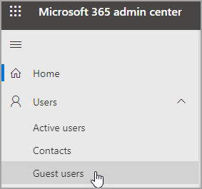

# Изменение сведений о гостевых пользователяхEdit guest user information

Вы можете изменить гостевую информацию в Центре администрирования Microsoft 365 или на портале Azure Directory.You can edit guest information from the Microsoft 365 admin center or the Azure Directory portal.

## Гостевых пользователей в администраторе Microsoft 365Guest users in the Microsoft 365 admin

1. Чтобы изменить гостевую информацию в Центре администрирования [Microsoft 365,](https://admin.microsoft.com)выберите **"Пользователи-**  >  **гостевых пользователей".**To edit the guest information in the [Microsoft 365 admin center](https://admin.microsoft.com), select **Users** > **Guest Users**.

   

2. Выберите пользователя в **гостевом доступе.**Select a user from **Guest users**.

3. В сведениях о гостевых пользователях выберите **"Управление контактной информацией".**In guest user information, select **Manage contact information**.

   

4. Отредактировать любые  выбранные поля, кроме отображаемой, в области "Управление контактной информацией" и выбрать **"Сохранить изменения".**Edit any fields that you choose except for **Display name** in **Manage contact information**, and then select **Save changes**.

   

Гостевой пользователь также можно изменить на [портале Azure Active Directory.](https://aad.portal.azure.com/#blade/Microsoft_AAD_IAM/UsersManagementMenuBlade/MsGraphUsers)You can also edit the guest user from the [Azure Active Directory portal](https://aad.portal.azure.com/#blade/Microsoft_AAD_IAM/UsersManagementMenuBlade/MsGraphUsers).
