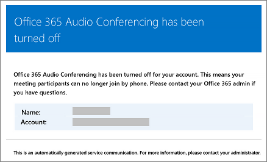

# Сообщения электронной почты, отправляемые пользователям при изменении их настроек в Microsoft Teams

Сообщения электронной почты будут автоматически  отправляться пользователям, у которых в качестве поставщика услуг аудиоконференции включена аудиоконференция с Майкрософт.

По умолчанию существует четыре типа сообщений электронной почты, которые отправляются пользователям, для которых включена аудиоконференция. Но если вы хотите ограничить количество сообщений, отключите их. Аудиоконференция в Microsoft 365 или Office 365 будет отправлять электронную почту пользователей по электронной почте в том случае, если:

- **Им назначена лицензия на аудиоконференцию или при смене поставщика услуг аудиоконференции на Майкрософт.**

     Это сообщение электронной почты содержит код конференции, номер телефона конференции по умолчанию для собраний, ПИН-код аудиоконференции для пользователя, а также инструкции и ссылку для использования средства обновления собраний Skype для бизнеса Online, которое используется для обновления существующих собраний для пользователя. См. ["Назначение лицензий на надстройки Microsoft Teams"](./teams-add-on-licensing/microsoft-teams-add-on-licensing.md) или "Назначение Майкрософт в качестве поставщика аудиоконференций". 

    > [!NOTE]
    > Если в вашей организации включены динамические ИД конференц-залов, всем собраниям пользователя, которые он запланил, будут уникальные. Вы можете настроить динамические ИД аудиоконференций [в своей организации.](/skypeforbusiness/audio-conferencing-in-office-365/reset-a-conference-id-for-a-user) 

    Вот пример такого сообщения:

     

    Дополнительные информацию о лицензировании см. в лицензировании надстройки [Microsoft Teams.](./teams-add-on-licensing/microsoft-teams-add-on-licensing.md)

- **Изменяется ИД конференции или телефонный номер конференции по умолчанию пользователя.**

    Это сообщение электронной почты содержит номер конференции, номер телефона конференции по умолчанию, инструкции и ссылку для использования средства обновления собраний Skype для бизнеса Online, которое используется для обновления существующих собраний для пользователя. Но это сообщение электронной почты не содержит ПИН-код аудиоконференции пользователя. See [Reset a conference ID for a user](reset-a-conference-id-for-a-user-in-teams.md).

    Вот пример такого сообщения:

     

- **ПИН-код аудиоконференции пользователя сбрасывается.**

    Это сообщение электронной почты содержит ПИН-код аудиоконференции организатора, существующий код конференции и номер телефона конференции по умолчанию для пользователя. См. ["Сброс ПИН-кода аудиоконференции".](reset-the-audio-conferencing-pin-in-teams.md)
    
     Вот пример такого сообщения:
    
     
  
- **Лицензия пользователя удаляется или если поставщик услуг аудиоконференций изменяется с Microsoft на другого поставщика или "Нет".**

    Это происходит  при удалении лицензии на аудиоконференцию для пользователя или при установке для поставщика услуг аудиоконференции параметра **"Нет".**

    См. ["Назначение и удаление лицензий для Microsoft 365 для бизнеса".](https://support.office.com/article/997596b5-4173-4627-b915-36abac6786dc)

    Вот пример такого сообщения:

     

> [!NOTE]
> [!INCLUDE [updating-admin-interfaces](includes/updating-admin-interfaces.md)]

## Внесение изменений в сообщения электронной почты, от которых они отправляются

Вы можете внести изменения в электронные письма, которые автоматически отправляются пользователям. По умолчанию отправитель сообщений отправляется из Microsoft 365 или Office 365, но вы можете изменить отображаемого имени, используя Windows PowerShell. Дополнительные [сведения см. в справочнике по Microsoft Teams PowerShell.](/powershell/module/teams/?view=teams-ps)

## Что делать, если вы не хотите, чтобы им отправляли электронную почту?

Если отключить отправку электронных писем пользователям, сообщения не будут отправляться, даже если пользователю назначена лицензия. В этом случае код конференции, номер телефона для конференц-связи по умолчанию и, что важнее, ПИН-код аудиоконференции не отправляются пользователю. В этом случае вы должны сообщить пользователю, отправив ему отдельный адрес электронной почты или позвонив ему.

По умолчанию пользователям отправляются сообщения электронной почты, но если вы хотите запретить им получать электронную почту для аудиоконференции, вы можете использовать Microsoft Teams или Windows PowerShell. 

 **Использование центра администрирования Microsoft Teams**

1. На панели навигации слева перейдите в раздел **Собрания** > **Мосты конференц-связи**. 

2. В верхней части страницы **"Мосты** конференций" щелкните **"Параметры моста".** 

3. В области **параметров моста** включите или отключите автоматическое отправку электронных писем пользователям в случае изменения **настроек телефонного дозвона.**

4. Нажмите кнопку **Сохранить**.

> [!Note]
> [!INCLUDE [updating-admin-interfaces](includes/updating-admin-interfaces.md)]

**Использование Windows PowerShell**

Дополнительные [сведения см. в справочнике по Microsoft Teams PowerShell.](/powershell/module/teams/?view=teams-ps)

## Хотите узнать больше о Windows PowerShell?

По умолчанию отправитель сообщений отправляется из Microsoft 365 или Office 365, но вы можете изменить адрес электронной почты и отображаемого имени, используя Windows PowerShell. 

Windows PowerShell is all about managing users and what users are allowed or not allowed to do. С Windows PowerShell вы можете управлять Microsoft 365 или Office 365, используя единый пункт администрирования, который упростит выполнение ваших повседневных задач. Для начала работы с Windows PowerShell ознакомьтесь с приведенными ниже разделами.

  - [Шесть причин использовать Windows PowerShell для управления Office 365](/microsoft-365/enterprise/why-you-need-to-use-microsoft-365-powershell)

  - [Лучшие способы управления Office 365 с помощью Windows PowerShell](/previous-versions//dn568025(v=technet.10))

Дополнительные сведения о Windows PowerShell см. в [справочнике по Microsoft Teams PowerShell](/powershell/module/teams/?view=teams-ps).

## Связанные разделы

[Включение и отключение отправки писем при смене настроек аудиоконференций](enable-or-disable-sending-emails-when-their-settings-change-in-teams.md)

[Отправка пользователю сообщения электронной почты со сведениями об аудиоконференции](send-an-email-to-a-user-with-their-dial-in-information-in-teams.md)