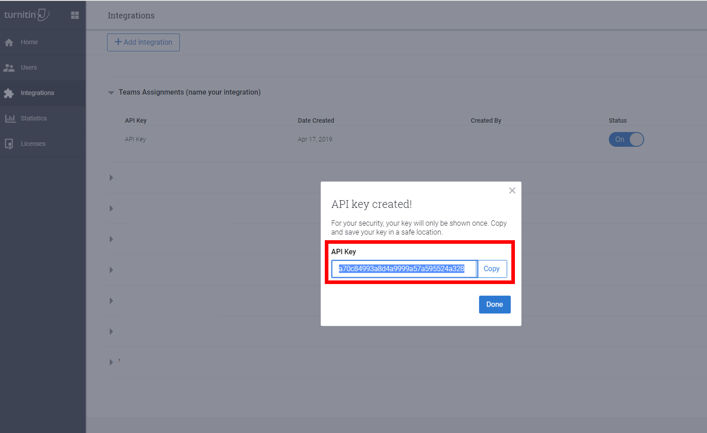

# Задания в Teams для образовательных учреждений

Функции "Задания" и "Оценки" в Teams для образования позволяют преподавателям назначать своим учащимся задачи, задания или тесты. Преподаватели могут управлять временными шкалами заданий, инструкциями, добавлять ресурсы для списания заданий, оценки с помощью рубрик и т. д. Они также могут отслеживать ход выполнения занятий и отдельных учащихся на вкладке Оценки.

[Подробнее о заданиях и оценках можно узнать в Teams для образования.](https://support.office.com/article/microsoft-teams-5aa4431a-8a3c-4aa5-87a6-b6401abea114?ui=en-US&rs=en-IE&ad=IE#ID0EAABAAA=Assignments)

> [!Note]
> Подробные сведения о Teams заданиях на разных платформах см. в Teams [по платформам.](https://support.microsoft.com/office/teams-features-by-platform-debe7ff4-7db4-4138-b7d0-fcc276f392d3)

## Интеграция заданий в Центре Microsoft Teams администрирования

С помощью параметров администратора в Центре Microsoft Teams вы можете включить или отключить функции для преподавателей в организации и их учащихся. Ниже параметров, связанных с заданиями:

### Еженедельный электронный дайджест для опекунов

Письма опекунов отправляются родителям или опекунам каждые выходные. Сообщение электронной почты содержит сведения о заданиях за предыдущую и предстоящую неделю. Синхронизацию для родителей и опекунов можно настроить с помощью [Синхронизация сведений о школе.](/schooldatasync/parent-contact-sync)

1. Импортируйте контактные данные родителей с помощью синхронизации для родителей и опекунов в SDS. Инструкции о том, как включить синхронизацию для родителей и опекунов, см. в этой [ссылке.](/schooldatasync/parent-contact-sync#enabling-parent-and-guardian-sync)

2. Включите параметр Опекун в центре Microsoft Teams, так как этот параметр отключен по умолчанию. Это позволит преподавателям отправлять еженедельный дайджест.

   > [!NOTE]
   > Преподаватели могут отказаться от дайджеста, отобрав этот параметр в своей личной группе класса (Параметры > для родителей и **опекунов).**

Чтобы убедиться, что родители получат письмо, должны быть истинными следующие три пункта:

 - Адрес электронной почты, вложенный в профиль учащегося в SDS и помечен как _родительский или_ _опекун._ Подробные сведения см. в теме Формат файлов синхронизации для родителей [и опекунов.](/schooldatasync/parent-contact-sync-file-format)

 - Учащиеся относятся хотя бы к одному классу, в котором преподаватели не отключили электронную почту в [параметрах задания.](https://support.microsoft.com/office/adjust-assignment-settings-in-your-class-team-05bb3b89-1cdf-415a-b6c7-44add0376a77)

 - Сообщения электронной почты будут содержать сведения о заданиях, срок выполнения которых был за предыдущую неделю или предстоящую неделю.

Значение по умолчанию для этой функции — **Выключено.**

### MakeCode
Microsoft MakeCode — это платформа программирования с блокировкой, которая позволяет информатиковать всех учащихся. 

MakeCode — это продукт Корпорации  Майкрософт, на который налагаются условия использования и политики [конфиденциальности](https://go.microsoft.com/fwlink/?LinkId=521839) корпорации Майкрософт.

Значение по умолчанию для этой функции — **Выключено.**

Чтобы включить задания MakeCode в Teams, перейдите в центр администрирования **Teams**, перейдите в раздел Задания и перейдите в раздел Задания и перейдите к параметру  Вкл.  Нажмите кнопку **Сохранить**. Чтобы эти параметры вступили в силу, в течение нескольких часов.

Дополнительные сведения о том, как работает эта функция, см. в этом [видеоролике.](https://makecode.com/blog/teams/teams-assignments)

[Подробнее о MakeCode.](https://aka.ms/makecode)

### Turnitin

[Turnitin](https://www.turnitin.com/) — это служба целостности знаний. Это сторонний продукт или служба, на которые лагаются собственные условия и политика конфиденциальности. Вы несете ответственность за использование сторонних продуктов и служб.

Значение по умолчанию для этой функции — **Отключено**..

Чтобы включить Turnitin для организации, вам потребуется подписка на Turnitin. Затем вы можете ввести следующие сведения, которые можно найти в консоли администратора Turnitin:

  * **TurnitinApiKey:** GUID, 32-символ, который находится в консоли администрирования в области Интеграции.
  * **TurnitinApiUrl:** URL-адрес HTTPS консоли администратора Turnitin.

Вот несколько инструкций, которые помогут вам получить эти сведения.

**TurnitinApiUrl —** это адрес хоста консоли администратора.
Пример: `https://your-tenant-name.turnitin.com`

В консоли администратора можно создать интеграцию и ключ API, связанный с ней.

Выберите **Интеграции** в боковом меню, а затем выберите **Добавить интеграцию** и придайте интеграции имя.

**TurnitinApiKey** будет предоставлен вам после того, как вы следуйте этим запросам. Скопируйте ключ API и вкопируйте его в Microsoft Teams администрирования.  Это единственный раз, когда можно просмотреть ключ.

Нажимая **кнопку Сохранить** в Центре администрирования для этого параметра, в течение нескольких часов эти параметры вступили в силу.

### Удаление заданий и о заданий
С помощью политик Teams можно удалить задания и оценки для определенного пользователя или для всего клиента. 

Чтобы удалить задания и оценки для отдельного пользователя, перейдите в Центр администрирования Teams и перейдите в Teams приложений **>** политики разрешений, чтобы создать новое определение политики разрешений приложений.   При создании определения политики установите в политике  приложений **Майкрософт** задание Блокировать  определенные приложения, разрешив всем остальным пользователям добавлять задания в список заблокированных приложений. После с сохраненного определения политики назначьте его соответствующим пользователям.

Чтобы удалить задания и оценки для всего клиента, перейдите в Центр администрирования **Teams**, перейдите к Teams приложениям **> Управление** приложениями и найдите и выберите Задания в списке приложений.  Измените параметр состояния на странице параметров приложения назначения на _Заблокировано._ 
