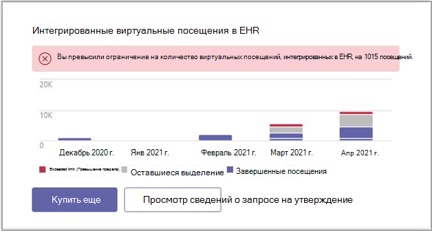

# Microsoft Teams Отчеты об администрировании соединители EHR

Диалоговое Microsoft Teams отчет об администрировании соединитела (EHR) обеспечивает быстрое и удобное для чтения представление данных об использовании.

Чтобы просмотреть отчет Microsoft Teams EHR, переходить на панель Microsoft Teams центра администрирования и просматривать диалоговое окно.

Доступ к отчету можно получить Microsoft Teams панели мониторинга Центра администрирования.

 

Диалоговое окно содержит следующие данные:

- Exceeded limit (Превышение предела).
- Оставшиеся выделение
- Завершенные посещения

Диалоговое окно отчета можно использовать для покупки дополнительных виртуальных посещений.

## Статьи по теме

[Teams виртуальных посещений](ehr-admin.md)
