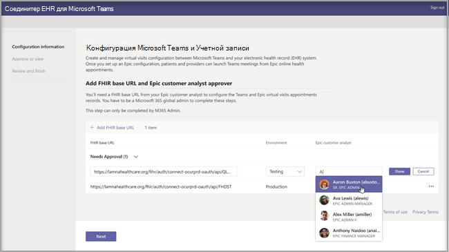
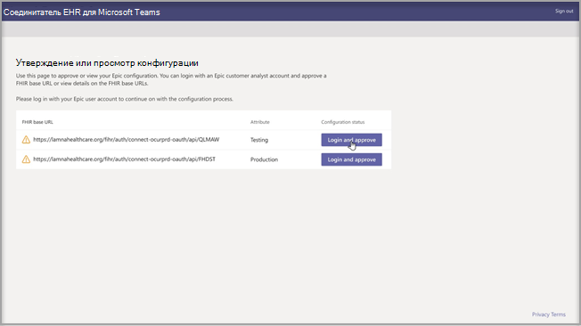
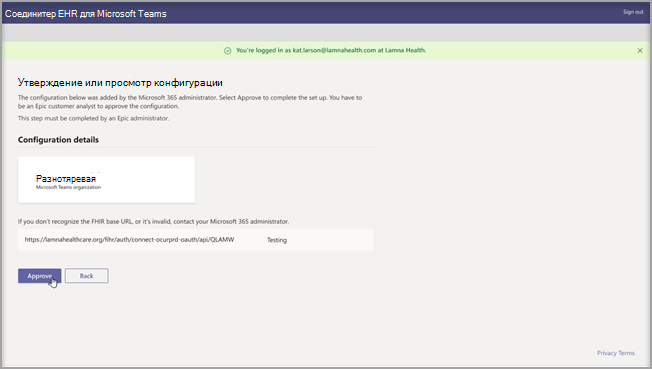
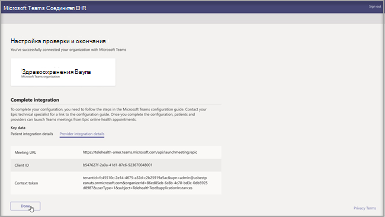
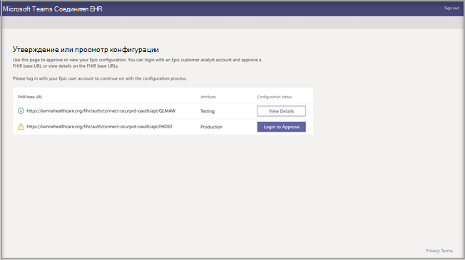

# Виртуальные посещения с помощью Teams — интеграция с электронными медицинскими картамиVirtual visits with Teams - Integration into EHR

Соединитель электронной медицинской записи (EHR) Microsoft Teams упрощает для врачей возможность виртуального посещения пациента или консультации с другим поставщиком в Teams непосредственно из системы EHR.Microsoft Teams Electronic Health Record (EHR) Connector makes it easy for clinicians to launch a virtual patient visit or consultation with another provider in Teams directly from the EHR system. Microsoft Teams, созданная на базе облака Microsoft 365, обеспечивает простую и безопасную совместную работу и общение с помощью инструментов чата, видео, голоса и здравоохранения в едином центре, который поддерживает соответствие требованиям сертификации акта HIPAA, HITECH и других.Built on the Microsoft 365 cloud, Microsoft Teams enables simple, secure collaboration and communication with chat, video, voice, and healthcare tools in a single hub that supports compliance with HIPAA, HITECH certification, and more.
Платформа для общения и совместной работы Teams позволяет врачам легко преодолевать беспорядок несрочных фрагментированных систем, чтобы они могли уделять время оказанию наилучшего медицинского обслуживания.The communication and collaboration platform of Teams makes it easy for clinicians to cut through the clutter of fragmented systems so they can spend time providing the best possible care. Соединитель электронной медицинской записи Microsoft Teams может:Microsoft Teams Electronic Health Record (EHR) Connector can:

- Запускайте виртуальные посещения Teams как с порталов поставщиков, так и с порталов пациентов.Launch Teams virtual visits from both provider and patient portals.
- Выполните обратную запись в метаданные электронной медицинской карты при подключении и отключении событий для включения автоматического аудита и сохранения записей.Write back into EHR metadata on connect and disconnect events to enable automatic auditing and record keeping.
- Интегрируются в существующие медицинские процессы и процессы пациентов, позволяя им использовать Microsoft Teams.Integrate into existing clinician and patient workflows while allowing them to use Microsoft Teams.

  Посмотрите видео о том, как управлять виртуальными посещениями с портала электронной медицинской карты.Watch the video of How to manage virtual visits from the EHR portal.

> [!VIDEO https://www.microsoft.com/videoplayer/embed/RE4HAtn]

## Подготовка к работеBefore you begin

Перед интеграцией соединителя электронной медицинской карты необходимо убедиться в том, что вами были соблюдены следующие необходимые условия:You’ll need to make sure you have the following prerequisites before you can integrate the EHR connector:

- Доступ к приложению Microsoft Teams в [магазине Epic — App Orchard](https://apporchard.epic.com/Gallery?id=6153).Access to use to the Microsoft Teams app in [Epic’s App Orchard marketplace](https://apporchard.epic.com/Gallery?id=6153).

- Активная подписка на Microsoft Cloud для здравоохранения или подписка на отдельное предложение соединителя электронной медицинской карты Microsoft Teams (применяется только во время производственного тестирования).Active subscription to Microsoft Cloud for Healthcare or subscription to Microsoft Teams EHR Connector standalone offer (only enforced during production testing).

- Пользователи должны иметь соответствующую лицензию на Microsoft 365 или Office 365, которая включает собрания Microsoft Teams.Users must have an appropriate Microsoft 365 or Office 365 license that includes Microsoft Teams meetings.

- Microsoft Teams следует внедрять и использовать внутри организации.Microsoft Teams should be adopted and used inside the organization.

- Организации должны иметь версию Epic с ноября 2018 г. или более позднюю.Organizations must have with Epic version November 2018 or later.

- Ваши системы должны соответствовать всем [требованиям к программному обеспечению и браузеру](https://docs.microsoft.com/microsoftteams/hardware-requirements-for-the-teams-app).Your systems must meet all [software and browser prerequisites](https://docs.microsoft.com/microsoftteams/hardware-requirements-for-the-teams-app).

Вам также потребуются сведения от следующих пользователей в вашей организации:You’ll also need information from the following people in your organization:

- Администратор Microsoft 365Microsoft 365 administrator

- Аналитик клиентов EpicEpic customer analyst

> [!Note]
> Просмотрите [руководство по интеграции telehealth Для Microsoft Teams](https://galaxy.epic.com/Search/GetFile?Url=1!68!100!100100357) с вашим техническим специалистом, специалистом по Microsoft Teams.Review the [Epic-Microsoft Teams Telehealth Integration Guide](https://galaxy.epic.com/Search/GetFile?Url=1!68!100!100100357) with your Epic technical specialist. Убедитесь, что все предварительные требования выполнены.Make sure that all pre-requisites are completed. 

## Настройка соединителяConnector setup

Для настройки соединители необходимо:The connector setup requires that you:

- [Запустить портал конфигурации соединителя электронной медицинской картыLaunch the EHR Connector configuration portal](ehr-admin.md#launch-the-ehr-connector-configuration-portal)
- [Сведения о конфигурацииConfiguration information](ehr-admin.md#configuration-information)
- [Утвердить или просмотреть конфигурациюApprove or view configuration](ehr-admin.md#approve-or-view-configuration)
- [Просмотреть и завершить конфигурациюReview and finish the configuration](ehr-admin.md#review-and-finish-the-configuration)

### [Запустить портал конфигурации соединителя электронной медицинской картыLaunch the EHR Connector configuration portal](#launch-the-ehr-connector-configuration-portal)

Настройка медицинской организации для запуска виртуальных посещений с помощью Microsoft Teams начинается с запуска портала конфигурации соединителя электронной медицинской карты.Configuring your healthcare organization to launch virtual visits with Microsoft Teams starts by launching the EHR Connector configuration portal. Для тестирования интеграции настраивается одна или несколько организаций.You configure a single or multiple organizations to test the integration. Настройте тестовый и рабочий URL-адреса на портале конфигурации.Configure the test and production URL in the configuration portal. Прежде чем переходить к производственной среде, протестируйте интеграцию из тестовой среды Epic.Test the integration from Epic’s test environment before moving to production.
  
- URL-адрес конфигурация соединителя электронной медицинской карты: [https://ehrconnector.teams.microsoft.com](https://ehrconnector.teams.microsoft.com)EHR connector configuration URL: [https://ehrconnector.teams.microsoft.com](https://ehrconnector.teams.microsoft.com)

Администратор Microsoft 365 и аналитик клиентов Epic из вашей организации должны выполнить действия по интеграции и информации на портале конфигурации.The Microsoft 365 admin and Epic customer analyst from your organization must complete the information and integration steps in the configuration portal. Для настройки Epic обратитесь к ресурсам технического специалиста Epic, назначенного вашей организации.For Epic configuration steps, contact the Epic technical specialist resource assigned to your organization.

### [Сведения о конфигурацииConfiguration information](#configuration-information)

Этот шаг должен быть выполнен **администратором Microsoft 365**.This step is to be completed by the **Microsoft 365 administrator**. Администратор Microsoft 365 должен запустить портал конфигурации соединителя и войти с помощью учетных данных Майкрософт, чтобы начать процесс конфигурации.The Microsoft 365 administrator must launch the connector configuration portal and sign in with Microsoft credentials to start the configuration process.

Для выполнения этого шага администратор Microsoft 365 должен получить действительный базовый URL-адрес ресурсов быстрого взаимодействия в сфере здравоохранения (FHIR) от вашего технического специалиста Epic и имя пользователя аналитика клиентов Epic, который будет утверждать конфигурацию.To complete this step, the Microsoft 365 administrator must receive a valid Fast Health Interoperability Resources (FHIR) base URL from your Epic technical specialist and the username of the Epic customer analyst who will be approving the configuration. Администратор Microsoft 365 должен запустить страницу конфигурации соединителя и войти с помощью учетных данных Майкрософт, чтобы начать процесс конфигурации.The Microsoft 365 administrator must launch the connector configuration page and sign in with Microsoft credentials to start the configuration process.

- Базовый URL-адрес FHIR — это статический адрес, соответствующий конечной точке API FHIR сервера.The FHIR base URL is a static address corresponding to your server FHIR API endpoint. Пример URL-адреса — `https://lamnahealthcare.org/fihr/auth/connect-ocurprd-oauth/api/FHDST`.An example URL is `https://lamnahealthcare.org/fihr/auth/connect-ocurprd-oauth/api/FHDST`.

- Имя утверждающего конфигурации — это имя аналитика клиентов Epic, который будет отвечать за утверждение конфигурации на следующем этапе.Configuration approver name is the name of the Epic customer analyst who will be responsible for approving the configuration in the next step. Аналитик клиентов Epic — это сотрудник вашей организации, который имеет доступ для входа в Epic.The Epic customer analyst is a person in your organization with sign-in access to Epic.

  

### [Утверждение или просмотр конфигурацииApprove or view configuration](#approve-or-view-configuration)

Аналитик клиента Epic вашей медицинской организации, добавленный в качестве утверждающего, теперь должен использовать тот же URL-адрес соединителя электронной медицинской карты, что и на предыдущем шаге, для входа с использованием учетных данных Microsoft 365.The Epic customer analyst for your healthcare organization who was added as an approver must now use the same EHR Connector URL from the previous step to sign in using their Microsoft 365 credentials. После успешной проверки утверждающему будет предложено войти в систему, используя учетные данные Epic, для проверки организации Epic.After successful validation, the approver is going to be asked to sign in using their Epic credentials to validate the Epic organization.

> [!Note]
> Администратор Microsoft 365 и аналитик клиентов Epic в вашей организации могут быть одним и тем же лицом.The Microsoft 365 admin and Epic customer analyst in your organization can be the same person. В этом случае добавьте собственное имя пользователя в качестве утверждающего.In that case, add your own username as approver. Вам все равно потребуется войти в Epic, чтобы подтвердить свой доступ.You'll still need to sign in to Epic to validate your access. Вход Epic используется только для проверки базового URL-адреса FHIR.The Epic sign in is only used to validate your FHIR base URL. Корпорация Майкрософт не будет хранить учетные данные или получать доступ к данным EHR с помощью этого входа.Microsoft won't store credentials or access EHR data with this sign in.

  

После успешного входа в Epic аналитику клиента Epic **необходимо** утвердить конфигурацию.After a successful Epic sign in, the Epic customer analyst **must** approve the configuration. Если конфигурация неверна, администратор Microsoft 365 сможет изменить исходную конфигурацию, снова войдя на портал соединителя электронной медицинской карты Microsoft.If the configuration isn't correct, the Microsoft 365 admin will have the ability to modify the original configurations by signing in to the Microsoft EHR connector portal again. 

### [Просмотр и завершение конфигурацииReview and finish the configuration](#review-and-finish-the-configuration)

После утверждения сведений о конфигурации администратором Epic вам будут представлены записи интеграции для запуска пациентов и поставщиков.When the configuration information is approved by the Epic administrator, you'll be presented with integration records for patient and provider launch. Эти записи необходимы для завершения настройки виртуального посещения в Epic.These records are necessary to complete the virtual visit configuration in Epic. Дополнительные сведения можно найти в руководстве по интеграции Epic-Microsoft Teams Telehealth.Refer to the Epic-Microsoft Teams Telehealth Integration guide for more details.

> [!Note]  
> В любое время аналитик клиентов Microsoft 365 или Epic может войти на портал конфигурации, чтобы просмотреть записи интеграции и при необходимости изменить конфигурацию организации.At any time the Microsoft 365 or Epic customer analyst can sign in to the configuration portal to view integration records and modify organization configuration, if needed.

> [!Note]
> Процесс утверждения должен быть завершен аналитиком клиентов Epic для каждого URL-адреса FHIR, настроенного администратором Майкрософт ранее.The approval process must be completed by the Epic customer analyst for every FHIR URL configured by the Microsoft admin before.

## Запуск виртуальных посещений TeamsLaunch Teams virtual visits

После выполнения действий соединителя электронной медицинской карты и конфигурации Epic ваша организация будет готова поддерживать видео посещения с помощью Microsoft Teams.After completing the EHR Connector steps and Epic configuration, your organization is ready to support video visits with Microsoft Teams.

### Предварительные условия для виртуального посещенияVirtual visit prerequisites

- Ваши системы должны соответствовать всем [требованиям к программному обеспечению и браузеру](https://docs.microsoft.com/microsoftteams/hardware-requirements-for-the-teams-app).Your systems must meet all [software and browser prerequisites](https://docs.microsoft.com/microsoftteams/hardware-requirements-for-the-teams-app).

- Медицинская организация должна выполнить настройку между организацией Epic и организацией Microsoft 365.Healthcare organization must have completed the setup between the Epic organization and Microsoft 365 organization.

### Взаимодействие с поставщикомProvider experience

Поставщики медицинских услуг из вашей организации также могут присоединяться к виртуальным посещениям Microsoft Teams из своих приложений поставщика Epic (Hyperspace, Haiku, Canto).Healthcare providers from your organization can also join virtual visits with Microsoft Teams from their Epic provider applications (Hyperspace, Haiku, Canto). Кнопка **Начать виртуальное посещение** внедрена в поток поставщика.The **Begin virtual visit** button is embedded in the provider flow.

Основные функции взаимодействия с поставщиком:Key features of the provider experience:

- Поставщики могут присоединяться к виртуальным посещениям с помощью поддерживаемых браузеров или приложения Microsoft Teams.Providers can join virtual visits using supported browsers or the Microsoft Teams application.

- Поставщики должны один раз войти в свою учетную запись Microsoft 365 при первом виртуальном посещении.Providers must do a one-time sign-in with their Microsoft 365 account when joining a virtual visit for the first time.

- После однократного входа поставщик будет перенаправлен сразу на виртуальную встречу в Microsoft Teams.After the one-time sign-in, the provider will be taken straight to the virtual appointment in Microsoft Teams. (Поставщик должен быть авторизован в Microsoft Teams).(Provider must be signed-in to Microsoft Teams).

- Провайдер может видеть в режиме реального времени обновления участников, подключающихся и отключающихся от встречи.Provider can see real-time updates of participants connect and disconnect for a given appointment. Поставщик может видеть, когда пациент подключен к виртуальному посещению.The provider can see when the patient is connected to a virtual visit.

  

### Взаимодействие с пациентомPatient experience

Соединитель позволяет пациентам присоединяться к виртуальным посещениям через MyChart в Интернете и на мобильных устройствах.The connector supports patients joining virtual visits through MyChart web and mobile. Во время приема пациенты могут начать виртуальное посещение из MyChart с помощью кнопки **Начать виртуальное посещение**.At the time of the appointment, patients can start a virtual visit from MyChart using the **Begin virtual visit** button.

Основные функции взаимодействия с пациентом:Key features of the patient experience:

- Пациенты могут присоединяться к виртуальным посещениям из современных веб-браузеров на настольных компьютерах и мобильных устройствах без установки приложения.Patients can join virtual visits from modern web browsers on desktop and mobile without app installation.

- Пациенты могут присоединиться к виртуальным посещениям одним щелчком мыши. Другие учетные записи или выполнение входа не требуются.Patients can join virtual visits with a single click and there is no other account or sign-in required.

- Для запуска виртуального посещения пациентам не требуется создавать учетную запись Майкрософт или выполнять вход.Patients aren't required to create a Microsoft account or sign in to launch a virtual visit.

- Пациенты будут помещены в "зал ожидания" до тех пор, пока поставщик медицинских услуг не присоединится к встрече и не допустит их к виртуальному посещению.Patients will be placed in a lobby until the healthcare provider joins the appointment and admits them to the virtual visit.

- Перед присоединением к виртуальному посещению в "зале ожидания" доступно тестирование видео и микрофона.Testing of the video and microphone is available in the lobby before joining the virtual visit.

  

> [!Note]
> Epic, MyChart, Haiku и Canto являются товарными знаками корпорации Epic Systems.Epic, MyChart, Haiku, and Canto are trademarks of Epic Systems Corporation.

### Конфиденциальность и расположение данныхPrivacy and location of data

Интеграция Teams в системы электронной медицинской карты оптимизирует объем данных, используемых и хранимых во время интеграции и потоков виртуальных посещений.Teams integration into EHR systems optimizes the amount of data being used and stored during integration and virtual visit flows. Решение соответствует общим принципам и рекомендациям по обеспечению конфиденциальности и управлению данными Teams, изложенным в разделе "Конфиденциальность Teams".The solution follows the overall Teams privacy and data management principles and guidelines outlined in Teams Privacy.

Соединитель электронной медицинской карты Microsoft Teams не хранит и не передает какие-либо идентифицирующие личные сведения или медицинские записи пациентов или поставщиков медицинских услуг из системы электронной медицинской карты.The Microsoft Teams EHR connector doesn't store nor transfer any identifiable personal data or any health records of patients or healthcare providers from the EHR system. Единственные данные, которые хранятся в соединителе электронной медицинской карты, — это уникальный идентификатор пользователя электронной медицинской карты, который используется во время настройки собрания Teams.The only data that is stored by the EHR connector is the EHR user’s unique ID, which is used during Teams meeting setup. Уникальный идентификатор пользователя электронной медицинской карты хранится в одном из трех географических регионов, описанных в статье [Где хранятся данные клиентов Microsoft 365](https://docs.microsoft.com/microsoft-365/enterprise/o365-data-locations?view=o365-worldwide#data-center-geographies).The EHR user’s unique ID is stored in one of the three geographic regions described in [Where your Microsoft 365 customer data is stored](https://docs.microsoft.com/microsoft-365/enterprise/o365-data-locations?view=o365-worldwide#data-center-geographies). Все беседы, записи и другие данные, которые участники собрания ввели в Teams, хранятся в соответствии с существующими политиками хранения.All chat, recordings, and other data entered into Teams by the meeting participants are stored according to existing storage policies. Дополнительные сведения о расположении данных в Microsoft Teams см. в статье [Расположения данных в Teams](https://docs.microsoft.com/microsoftteams/location-of-data-in-teams).If you want to learn more information on the location of data in Microsoft Teams, visit [Locations of data in Teams](https://docs.microsoft.com/microsoftteams/location-of-data-in-teams).
