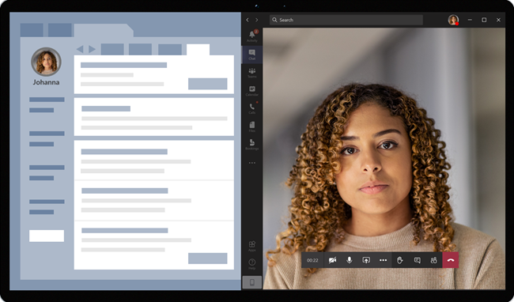

# Виртуальные встречи с Teams — интеграция в EHR для ситуаций

Соединитель Microsoft Teams электронной медицинской записи (EHR) упрощает запуск виртуальной встречи пациента или консультации с другим поставщиком в Microsoft Teams непосредственно из системы EHR Epic. Созданная на основе Microsoft 365, Teams обеспечивает простую и безопасную совместную работу и взаимодействие с помощью средств чата, видео, голосовой связи и здравоохранения в одном центре, который поддерживает соответствие требованиям HIPAA, сертификации HITECH и т. д.

Платформа обмена данными и совместной работы Teams упрощает для медицинских учреждений сквозь несрочные фрагментированные системы, чтобы они могли сосредоточиться на предоставлении наилучшей медицинской помощи. С помощью Teams EHR можно:

- Запустите Teams виртуальных встреч из системы EHR Epic с помощью интегрированного медицинского рабочего процесса.
- Разрешите пациенту присоединяться Teams к виртуальным встречам на портале пациентов или через SMS.
- Поддержка других сценариев, включая поддержку нескольких участников, посещений групп и служб интерпретаторов.
- Записывайте метаданные обратно в систему EHR Teams о виртуальных встречах для записи при подключении, отключении и включении автоматического аудита и хранения записей.
- Просмотр отчетов о потреблении данных и настраиваемых сведений о качестве звонков для встреч, подключенных к EHR.

В этой статье описывается, как настроить соединитель Teams EHR для интеграции с платформой Epic в вашей медицинской организации. Он также содержит общие сведения о Teams виртуальных встреч в системе EHR Epic.

## Подготовка к работе

Прежде чем приступить к работе, необходимо выполнить несколько действий по подготовке к интеграции.

### Знакомство с процессом интеграции

Ознакомьтесь со следующими сведениями, чтобы получить представление об общем процессе интеграции.

:::image type="content" source="media/ehr-connector-epic-flow.png" alt-text="Изображение с описанием шагов в общем процессе интеграции.":::

||||||
|---------|---------|---------|---------|---------|
|**Действие**. [Вы запрашиваете доступ к Teams приложения](#request-access-to-the-teams-app).   **Результат**. Мы авторизуем вашу организацию для тестирования.|**Действие**. Мы создадим сертификат открытого и закрытого ключей и передадим их в Epic.   **Результат**. Epic синхронизирует сертификат открытого ключа.|**Действие**. Вы выполняете действия по настройке на портале конфигурации соединителя EHR.   **Результат**. Вы получаете записи FDI для конфигурации Epic.| **Действие**. Вы работаете с техническим специалистом Epic, чтобы настроить записи FDI в Epic.  **Результат**: конфигурация завершена. Готово к тестированию.|**Действие**. Тестирование выполняется в тестовой среде.  **Результат**: полная проверка потоков и решение о переходе в рабочую среду.|

### Запрос доступа к Teams приложения

Вам потребуется запросить доступ к Teams приложения.

1. Запрос на скачивание приложения Teams в [Marketplace Epic App Marketplace](https://apporchard.epic.com/Gallery?id=16793). Это инициирует запрос от Epic к команде соединителя Microsoft EHR.
1. После выполнения запроса отправьте сообщение электронной почты  TeamsForHealthcare@service.microsoft.com с именем организации, идентификатором клиента и адресом электронной почты технического контакта Epic.
1. Команда соединителя Microsoft EHR ответит на ваше сообщение электронной почты с подтверждением включения.

### Ознакомьтесь с Epic-Microsoft Teams интеграции с telehealth

Просмотрите [руководство по интеграции телемедицины Epic-Microsoft Teams](https://galaxy.epic.com/Search/GetFile?Url=1!68!100!100100357) со своим техническим специалистом Epic. Убедитесь, что выполнены все предварительные требования.

## Необходимые компоненты

- Активная подписка на Microsoft Cloud для здравоохранения или подписка на автономное предложение Microsoft Teams EHR (применяется только при тестировании в рабочей среде EHR).
- Версия epic за ноябрь 2018 г. или более поздняя.
- У пользователей есть соответствующая Microsoft 365 или Office 365, которая включает Teams собраний.
- Teams внедрены и используются в вашей медицинской организации.
- Ваши системы соответствуют всем [требованиям к программному](../../hardware-requirements-for-the-teams-app.md) обеспечению и браузеру для Teams.

> [!IMPORTANT]
> Прежде чем перейти к интеграции, убедитесь, что выполнены все предварительные требования.

Действия по интеграции выполняются следующими сотрудниками организации:

- **Microsoft 365 глобального администратора**: главный пользователь, ответственный за интеграцию. Администратор настраивает соединитель, включает SMS (при необходимости) и добавляет аналитика клиента Epic, который будет утверждать конфигурацию.
- **Аналитик клиента Epic**: человек в вашей организации, у которого есть учетные данные для входа в Epic. Они утверждает параметры конфигурации, введенные администратором, и предоставляют записи конфигурации в Epic.

Администратор Microsoft 365 и аналитик клиента Epic могут быть одинаковыми пользователями.

## Настройка соединителя Teams EHR

Для настройки соединители необходимо:

- [Запуск портала конфигурации соединителя EHR](#launch-the-ehr-connector-configuration-portal)
- [Ввод сведений о конфигурации](#enter-configuration-information)
- [Включение SMS уведомлений (необязательно)](#enable-sms-notifications-optional)
- [Утверждение или просмотр конфигурации](#approve-or-view-the-configuration)
- [Просмотр и завершение конфигурации](#review-and-finish-the-configuration)

### Запуск портала конфигурации соединителя EHR

Чтобы приступить к работе, администратор Microsoft 365 запускает портал конфигурации соединителя [EHR](https://ehrconnector.teams.microsoft.com) и выполняет вход с использованием Microsoft 365 учетных данных.

Администратор Microsoft 365 может настроить одну или несколько организаций для тестирования интеграции. Настройте тестовый и рабочий URL-адреса на портале конфигурации. Обязательно протестируйте интеграцию из тестовой среды Epic перед переходом в рабочую среду.

> [!NOTE]
> Администратор Microsoft 365 и аналитик клиента Epic должны выполнить действия по интеграции на портале конфигурации. Для настройки Epic обратитесь к техническому специалисту Epic, назначенного вашей организации.

### Ввод сведений о конфигурации

Затем, чтобы настроить интеграцию, администратор Microsoft 365 выполняет следующие действия:

1. Добавляет базовый URL-адрес ресурсов быстрого взаимодействия работоспособности (FHIR) от технического специалиста Epic и задает среду. Настройте любое количество базовых URL-адресов FHIR в зависимости от потребностей организации и сред, которые требуется протестировать.

    - Базовый URL-адрес FHIR — это статический адрес, соответствующий конечной точке API FHIR сервера. Пример URL-адреса — `https://lamnahealthcare.org/fihr/auth/connect-ocurprd-oauth/api/FHDST`.

    - Интеграцию можно настроить для тестовых и рабочих сред. Для начальной настройки рекомендуется настроить соединитель из тестовой среды перед переходом в рабочую среду.

1. Добавляет имя пользователя аналитика клиента Epic, который будет утверждать конфигурацию на следующем шаге.

    :::image type="content" source="media/ehr-connector-epic-configure.png" alt-text="Снимок экрана: страница &quot;Конфигурация&quot;, на которой отображается добавляемый утверждающий." lightbox="media/ehr-connector-epic-configure.png":::

### Включение SMS уведомлений (необязательно)

> [!NOTE]
> SMS уведомления в настоящее время доступны только в США. Мы работаем над тем, чтобы эта функция была доступна в других регионах в будущих выпусках Teams и обновим эту статью, если она доступна.

Выполните этот шаг, если ваша организация хочет, чтобы корпорация Майкрософт SMS уведомлениями для ваших пациентов. Когда вы включите SMS, ваши пациенты получат сообщения с подтверждением и напоминанием о запланированных встречах.

Чтобы включить SMS уведомлений, Microsoft 365 администратор делает следующее:

1. На странице SMS уведомлений установите оба флажка согласия, чтобы:

    - Разрешить корпорации Майкрософт SMS уведомления пациентов от имени вашей организации.
    - Подтвердите, что вы обеспечите согласие участников на отправку и получение SMS сообщений.
    
    :::image type="content" source="media/ehr-connector-epic-sms-notifications.png" alt-text="Снимок экрана: страница SMS уведомлений с флажками согласия и параметром создания номера телефона." lightbox="media/ehr-connector-epic-sms-notifications.png":::

1. В **разделе "Номера телефонов**" выберите **"Создать новый номер** телефона", чтобы создать номер телефона для вашей организации. Это запускает процесс запроса и создания нового номера телефона. Этот процесс может занять до 2 минут.

    После создания номера телефона он отображается на экране. Этот номер будет использоваться для отправки SMS и напоминаний вашим пациентам. Номер подготовлен, но еще не связан с базовым URL-адресом FHIR. Это можно сделать на следующем шаге.

    :::image type="content" source="media/ehr-connector-epic-phone-number.png" alt-text="Снимок экрана: пример созданного номера телефона." lightbox="media/ehr-connector-epic-phone-number.png":::

    Нажмите **кнопку "Готово**", а затем нажмите кнопку **"Далее"**.

1. Чтобы связать номер телефона с базовым URL-адресом FHIR, Телефон **в** разделе SMS конфигурации  выберите номер. Сделайте это для каждого базового URL-адреса FHIR, для которого требуется включить SMS уведомлений.

    :::image type="content" source="media/ehr-connector-epic-link-phone-number.png" alt-text="Снимок экрана: связывание номера телефона с базовым URL-адресом FHIR." lightbox="media/ehr-connector-epic-link-phone-number.png":::

    Если вы настраиваете соединитель впервые, вы увидите базовый URL-адрес FHIR, введенный на предыдущем шаге. Один и тот же номер телефона можно связать с несколькими базовыми URL-адресами FHIR. Это означает, что пациенты будут получать SMS с одного и того же номера телефона для разных организаций и (или) отделов.

1. Выберите **SMS установки** рядом с каждым базовым URL-адресом FHIR, чтобы настроить типы SMS для отправки пациентов.

    :::image type="content" source="media/ehr-connector-epic-sms-setup.png" alt-text="Снимок экрана: SMS настройки." lightbox="media/ehr-connector-epic-sms-setup.png":::

    - **Подтверждение SMS**: уведомления отправляются пациенту при планировании, обновлении или отмене встречи в системе EHR.
    - **Напоминание SMS**: уведомления отправляются пациенту в соответствии с указанным интервалом времени и запланированным временем встречи.

    Нажмите кнопку **Сохранить**.

1. Выберите **"Отправить сертификат** ", чтобы отправить сертификат открытого ключа. Для каждой среды необходимо отправить CER-сертификат в кодировке Base64 (только открытый ключ).

    Для получения сведений о встрече для отправки SMS требуется сертификат открытого ключа. Сертификат необходим для проверки того, что входящие сведения были из допустимого источника.

    Когда соединитель используется для отправки SMS напоминаний, номер телефона пациента отправляется Службой Epic в полезных данных HL7v2 при создании встреч в Epic. Эти номера хранятся для каждой встречи в географическом регионе вашей организации и сохраняются до ее завершения. Дополнительные сведения о настройке сообщений HL7v2 см. в руководстве по интеграции [Epic-Microsoft Teams Telehealth](https://galaxy.epic.com/Search/GetFile?Url=1!68!100!100100357).

    Нажмите **кнопку "Далее"**.

> [!NOTE]
> В любое время администратор Microsoft 365 может обновить любой из SMS параметров. Помните, что изменение параметров может привести к остановке SMS службы. Дополнительные сведения о просмотре отчетов SMS см. в Teams отчетов администратора соединителя [EHR](ehr-admin-reports.md).

### Утверждение или просмотр конфигурации

Аналитик клиентов Epic в вашей организации, добавленный в качестве утверждающего, запускает портал конфигурации соединителя [EHR](https://ehrconnector.teams.microsoft.com) и выполняет вход с использованием Microsoft 365 учетных данных. После успешной проверки утверждающему предлагается выполнить вход с использованием учетных данных Epic для проверки организации Epic.

> [!Note]
> Если администратор Microsoft 365 и аналитик клиента Epic — один и тот же пользователь, вам по-прежнему потребуется войти в Epic, чтобы проверить доступ. Вход в Epic используется только для проверки базового URL-адреса FHIR. Корпорация Майкрософт не будет хранить учетные данные или получать доступ к данным EHR с помощью этого входа.

:::image type="content" source="media/ehr-connector-epic-login-approve.png" alt-text="Снимок экрана: страница &quot;Утвердить&quot; или &quot;Просмотреть конфигурацию&quot; с параметром &quot;Вход и утверждение&quot;." lightbox="media/ehr-connector-epic-login-approve.png":::

После успешного входа в Epic аналитик клиента Epic **должен** утвердить конфигурацию. Если конфигурация не правильная, Microsoft 365 администратор может войти на портал конфигурации и изменить параметры.

:::image type="content" source="media/ehr-connector-epic-approve.png" alt-text="Снимок экрана: страница &quot;Утвердить&quot; или &quot;Просмотреть конфигурацию&quot; с параметром &quot;Утвердить&quot;." lightbox="media/ehr-connector-epic-approve.png":::

### Просмотр и завершение конфигурации

После утверждения сведений о конфигурации администратором Epic вам будут представлены записи интеграции для запуска пациентов и поставщиков. Записи интеграции включают:

- Записи пациентов и поставщиков
- Запись SMS direct
- SMS конфигурации
- Запись конфигурации теста устройства

Маркер контекста для теста устройства можно найти в записи интеграции пациентов. Аналитик клиента Epic должен предоставить эти записи в Epic, чтобы завершить настройку виртуальных встреч в Epic. Дополнительные сведения см. в руководстве [по интеграции Epic-Microsoft Teams Telehealth](https://galaxy.epic.com/Search/GetFile?Url=1!68!100!100100357).

> [!Note]  
> Аналитик клиента Microsoft 365 Или Epic может в любое время войти на портал конфигурации, чтобы просмотреть записи интеграции и при необходимости изменить конфигурацию организации.

:::image type="content" source="media/ehr-connector-epic-finish.png" alt-text="Снимок экрана: страница &quot;Проверка и окончание&quot; с информацией об интеграции." lightbox="media/ehr-connector-epic-finish.png":::

> [!Note]
> Аналитик клиента Epic должен завершить процесс утверждения для каждого базового URL-адреса FHIR, настроенного Microsoft 365 администратором.

## Запуск Teams виртуальных встреч

После выполнения шагов соединителя EHR и настройки Epic ваша организация готова поддерживать видео встречи с Teams.

### Предварительные требования для виртуальных встреч

- Ваши системы должны соответствовать всем [требованиям к программному](../../hardware-requirements-for-the-teams-app.md) обеспечению и браузеру для Teams.

- Вы завершили настройку интеграции между организацией Epic и Microsoft 365 организации.

### Взаимодействие с поставщиком

Поставщики услуг здравоохранения из вашей организации могут присоединяться к встречам с помощью Teams из приложений поставщика Epic (Hyperspace, Haiku, Canto). Кнопка **Начать виртуальное посещение** внедрена в поток поставщика.

  

Основные функции взаимодействия с поставщиком:

- Поставщики могут присоединяться к встречам с помощью поддерживаемых браузеров или Teams приложения.

- Поставщики должны выполнить единый вход со своей учетной записью Microsoft 365 при первом присоединении к встрече.

- После единого входа поставщик перенаправлен непосредственно к виртуальной встрече в Teams. (Поставщик должен выполнить вход в Teams).

- Поставщики могут видеть обновления участников, подключающиеся и отключающиеся в режиме реального времени для данной встречи. Поставщики могут видеть, когда пациент подключен к встрече.

> [!NOTE]
> Все сведения, введенные в чате собрания, необходимые для обеспечения непрерывности или хранения медицинских записей, должны быть скачаны, скопированы и заданы поставщиком услуг здравоохранения. Чат не является юридической медицинской записью или назначенным набором записей. Сообщения из чата хранятся на основе параметров, созданных Microsoft Teams администратором.

### Взаимодействие с пациентом

Соединитель поддерживает присоединение пациентов к встречам по ссылке в текстовом SMS, в Интернете MyChart и на мобильном устройстве. Во время встречи пациенты могут начать встречу из MyChart с помощью кнопки "Начать виртуальное  посещение" или нажав ссылку в текстовом SMS сообщения.

  

Основные функции взаимодействия с пациентом:

- Пациенты могут присоединяться к встречам из современных веб-браузеров на настольных и мобильных устройствах[, не устанавливая Teams приложения](../browser-join.md).
- Перед присоединением к встрече пациенты могут протестировать оборудование и подключение устройства.

    :::image type="content" source="media/ehr-admin-epic-device-test.png" alt-text="Изображения мобильного устройства с возможностями тестирования устройства." lightbox="media/ehr-admin-epic-device-test.png":::
  
    Возможности тестирования устройств:

  - Пациенты могут тестировать динамик, микрофон, камеру и подключение.
  - Пациенты могут выполнить тестовый вызов, чтобы полностью проверить свою конфигурацию.
  - Результаты теста устройства можно отправить обратно в систему EHR.

- Пациенты могут присоединяться к встречам одним щелчком мыши, и никакие другие учетные записи или вход не требуются.

- Для запуска встречи пациенты не должны создавать учетную запись Майкрософт или выполнять вход.

- Пациенты помещаются в "зал ожидания", пока поставщик не присоединится и не допустит их.

- Пациенты могут протестировать свои видео и микрофон в зале ожидания перед присоединением к встрече.

> [!Note]
> Epic, MyChart, Haiku и Canto являются товарными знаками корпорации Epic Systems.

## Получение сведений об использовании виртуальных встреч

Отчет [об использовании](../../teams-analytics-and-reports/virtual-visits-usage-report.md) виртуальных посещений в центре администрирования Microsoft Teams предоставляет администраторам общие сведения о Teams виртуальных встреч в вашей организации. В отчете показана подробная аналитика виртуальных встреч, включая Teams собрания, интегрированные с EHR, которые проводятся из системы EHR.

Вы можете просмотреть ключевые метрики, такие как время ожидания ожидания "зал ожидания" и длительность встречи. Используйте эти сведения, чтобы получить представление о тенденциях использования, чтобы оптимизировать виртуальные встречи для улучшения бизнес-результатов.

### Конфиденциальность и расположение данных

Teams интеграции с системами EHR оптимизирует объем данных, используемых и хранящихся во время интеграции и потоков виртуальных встреч. Решение соответствует общим принципам и рекомендациям по обеспечению конфиденциальности и управлению данными Teams, изложенным в разделе "Конфиденциальность Teams".

Соединитель Teams EHR не хранит и не передает какие-либо идентифицируемые персональные данные или записи о состоянии здоровья пациентов или поставщиков услуг здравоохранения из системы EHR. Единственные данные, которые хранятся в соединителе электронной медицинской карты, — это уникальный идентификатор пользователя электронной медицинской карты, который используется во время настройки собрания Teams.

Уникальный идентификатор пользователя электронной медицинской карты хранится в одном из трех географических регионов, описанных в статье [Где хранятся данные клиентов Microsoft 365](/microsoft-365/enterprise/o365-data-locations). Все данные чата, записи и другие данные, Teams участниками собрания, хранятся в соответствии с существующими политиками хранения. Дополнительные сведения о расположении данных в Teams см. в [Teams.](../../location-of-data-in-teams.md)

## Статьи по теме

- [Teams об использовании виртуальных посещений](../../teams-analytics-and-reports/virtual-visits-usage-report.md)
- [Teams отчетов администратора соединителя EHR](ehr-admin-reports.md)
- [начало работы с Teams для организаций здравоохранения](teams-in-hc.md)
