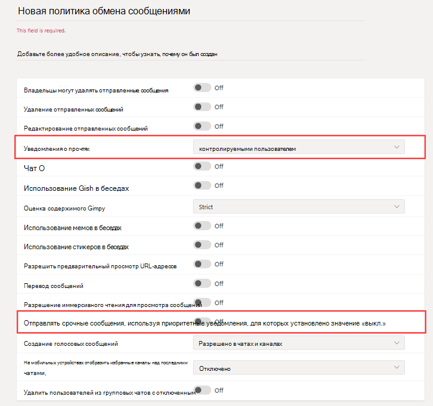

# Безопасный обмен сообщениями для организаций здравоохранения

Политики обмена сообщениями используются для контроля того, какие функции обмена сообщениями в чате или канале доступны пользователям в Microsoft Teams. Они также являются частью общего развертывания безопасного обмена сообщениями для организаций здравоохранения, таких как больницы, клиники или кабинеты врачей, где своевременное получение сообщения и принятие соответствующих мер имеет решающее значение, так же как и знание того, когда важное сообщение было прочитано.

Вы можете использовать глобальную политику (по умолчанию для всей организации) или создать одну или несколько настраиваемых политик обмена сообщениями для сотрудников вашей организации. Если вы не создадите и не назначите настраиваемую политику, пользователи в вашей организации автоматически получат глобальную политику. После создания настраиваемой политики назначьте ее пользователю или группам пользователей в вашей организации. Например, можно разрешить использовать эти функции только определенным сотрудникам (например, только врачам и медсестрам) и другим работникам (например, техническому или кухонному персоналу), чтобы получить более ограниченный набор функций. Это руководство носит рекомендательный характер, поэтому определите сами, какие потребности есть у вашей организации.

Политиками можно легко управлять в [Центре администрирования Microsoft Teams](https://admin.teams.microsoft.com). Для этого нужно войти в систему с учетными данными администратора и выбрать **Политики обмена сообщениями** в области навигации слева.

 :::image type="content" source="../../media/hc-messaging-policy-admin-center-new.png" alt-text="Снимок экрана: страница &quot;Политики обмена сообщениями&quot;." lightbox="../../media/hc-messaging-policy-admin-center-new.png":::
 
 Чтобы изменить существующую политику обмена сообщениями по умолчанию для вашей организации, нажмите **Глобальная (по умолчанию для всей организации)** и внесите изменения. Чтобы создать новую настраиваемую политику обмена сообщениями, нажмите **Добавить** и выберите необходимые параметры. Когда все будет готово, нажмите **Сохранить**.

Следующие параметры представляют особый интерес для медицинских организаций и должны учитываться при создании настраиваемой политики, используемой в сфере здравоохранения.

## Уведомления о прочтении

Уведомления о прочтении позволяют отправителю сообщения чата узнать, когда сообщение было прочитано получателем в личном или групповом чате из 20 или менее человек. Используйте этот параметр, чтобы указать, будут ли уведомления о прочтении управляться пользователем, будут ли они включены для всех или отключены для всех. Уведомления о прочтении сообщений играют важную роль в организациях здравоохранения, так как они устраняют неопределенность относительно того, было ли сообщение прочитано.

Для медицинских организаций выберите **Управляется пользователем** или **Включено для всех**. Помните, что при использовании параметра **Включено для всех** единственный способ настроить уведомления для всего клиента — это либо установить только одну политику обмена сообщениями для всего клиента (политика по умолчанию с именем "Глобальная (по умолчанию для всей организации)"), либо сделать так, чтобы все политики обмена сообщениями в клиенте использовали одни и те же параметры для уведомлений. Функция уведомлений о прочтении наиболее эффективна, когда для нее установлено значение **Включено для всех**.

*Пример использования без уведомлений о прочтении*. Александр Муравьев, пациент с высокой степенью операционного риска, был госпитализирован.  Софья Соколова — медсестра, работающая в составе междисциплинарной команды медицинских работников, включающей различных специалистов, назначается координатором ухода за этим пациентом.  Софья отправляет электронные сообщения и другие мгновенные сообщения группе медсестер и врачей, использующих различные клиенты и приложения для обмена сообщениями, и, как правило, не получает ответов или уведомлений о том, было ли сообщение прочитано участниками группы. Из-за запутанных коммуникационных процессов Александру прописывают неправильное лекарство и его пребывание в больнице задерживается.

*Пример использования с уведомлениями о прочтении*. Александр Муравьев, пациент с высокой степенью операционного риска, был госпитализирован.  Софья Соколова — медсестра, работающая в составе междисциплинарной команды медицинских работников, включающей различных специалистов, назначается координатором ухода за этим пациентом.  Софья начинает групповой чат с командой врачей и других медсестер, которые будут координировать уход за пациентом, и начинает экстренную сортировку.  Медсестры и врачи общаются и совместно работают над планом ухода за пациентом в течение всего процесса согласованного управления лечением.  Важные и срочные сообщения отправляются через личные и групповые чаты. Софья использует функцию уведомлений о прочтении, чтобы определить, доставлены ли сообщения с просьбой о помощи и прочитаны ли они целевыми врачами и медсестрами. Результаты лечения Александра близки к оптимальным, и он возвращается домой раньше благодаря эффективному общению медицинской команды.

## Отправка срочных сообщений с помощью уведомлений о приоритетном статусе

Пользователь может пометить сообщение как *срочное* при отправке сообщений чата другим пользователям. Эта функция помогает персоналу больницы предупреждать друг друга, когда критический случай требует их внимания. В отличие от обычных *важных* сообщений [уведомления о приоритетном статусе](https://support.microsoft.com/article/mark-a-message-as-important-or-urgent-in-teams-ea99d5b6-1317-4550-8d75-86ff14cd4462) уведомляют пользователей каждые две минуты в течение 20 минут или до тех пор, пока сообщение не будет получено и прочитано получателем, максимально увеличивая вероятность того, что сообщение будет своевременно прочитано.

Администратор может включить или отключить возможность пользователей, назначенных этой политикой, отправлять уведомления о приоритетном статусе. По умолчанию эта функция включена. Получатель сообщения о приоритетном статусе может не иметь такой же политики обмена сообщениями и возможности отключить получение сообщений о приоритетном статусе. Для медицинских организаций рекомендуется включить эту функцию, по крайней мере, для некоторых пользователей, но вам нужно будет определить, каких именно.

*Пример использования*. Софья Соколова повторно принимает пациента с высокой степенью операционного риска Александра Муравьева. Елена Павлова является главным врачом по уходу за этим пациентом.  Софья посылает Елене сообщение, используя уведомление о приоритетном статусе, с просьбой незамедлительно помочь ей с сортировкой Александра.  Сообщение приходит на телефон Елены, но она не чувствует вибрации телефона и не отвечает. Teams повторно уведомляет Елену и будут продолжать настойчиво уведомлять, пока она не прочтет сообщение. Если также включены уведомления о прочтении, Софья узнает, что Елена прочитала сообщение, еще до того, как Елена решит, как ей ответить.

## Связанные статьи

- [Управление политиками обмена сообщениями в Teams](../../messaging-policies-in-teams.md)
- [Начало работы с Teams для организаций здравоохранения](teams-in-hc.md)
