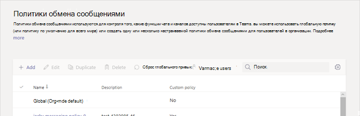

# Начало работы с безопасным обменом сообщениями для организаций в сфере здравоохраненияGet started with Secure Messaging for Healthcare organizations

Политики обмена сообщениями используются для управления тем, какие функции чата и обмена сообщениями доступны пользователям в Microsoft Teams, и являются частью общего развертывания защищенных сообщений в организациях здравоохранения, таких как больницами, практические и офисные офисы, где своевременно загружаются и обработаны сообщения, как это важно при чтении важных сообщений.Messaging policies are used to control which chat and channel messaging features are available to users in Microsoft Teams, and are part of the overall deployment of Secure Messaging for Healthcare organizations like Hospitals, clinics, or doctor's offices, where having a message picked up and acted upon in a timely manner is crucial, as is knowing when crucial messages are read.

Вы можете использовать глобальную политику (по умолчанию на уровне Организации) или создать одну или несколько настраиваемых политик обмена сообщениями для пользователей в вашей организации.You can use the global (Org-wide default) policy or create one or more custom messaging policies for people in your organization. Пользователи вашей организации автоматически получают глобальную политику, если вы не создали и не назначили настраиваемую политику.Users in your organization will automatically get the global policy unless you create and assign a custom policy. После создания настраиваемой политики назначьте ей пользователя или группы пользователей в вашей организации.After you create a custom policy, assign it a user or groups of users in your organization. Например, вы можете разрешить определенным ролям задач использовать эти функции (например, доктора и Nurses), а также другим сотрудникам (например, Janitorial или кухни), чтобы воспользоваться более ограниченным набором функций.For example, you may choose to only allow certain job roles to use these features (perhaps doctors and nurses only) and other workers (like the janitorial or kitchen staff) to get a more limited set of features. Решите, каковы требования вашей организации, но здесь вы найдете рекомендации, предлагаемые здесь.Decide for yourself what needs your organization has, the guidance here is at most a suggestion.

Политики можно легко управлять в [центре администрирования Microsoft Teams](https://admin.teams.microsoft.com) , войдя в систему с учетными данными администратора и выбрав **политики сообщений** в области навигации слева.Policies can be easily managed in the [Microsoft Teams admin center](https://admin.teams.microsoft.com) by logging in with administrator credentials and choosing **Messaging policies** in the left navigation pane.

 

Чтобы изменить существующую политику сообщений по умолчанию для Организации, щелкните **Глобальная (по умолчанию)** и внесите необходимые изменения.To edit the existing default Messaging policy for your organization, click **Global (Org-wide default)**, and then make your changes. Чтобы создать новую политику электронной почты, нажмите кнопку **Добавить** и выберите нужные параметры.To create a new custom messaging policy, click **Add** and then select your settings. Когда все будет готово, нажмите кнопку **сохранить** .Choose **Save** when you are done.

Ниже указаны специальные параметры для приложений для сферы здравоохранения, которые следует учитывать при проектировании особой политики, используемой в поле здравоохранение.The following settings are of special interest for Healthcare applications, and should be considered when designing a custom policy used in the Healthcare field:

## Уведомления о прочтенииRead receipts

Уведомления о прочтении позволяют отправителю сообщения чата знать, когда сообщение было прочитано получателем в 1:1, и групповая беседа не менее 20 человек.Read receipts allows the sender of a chat message to know when their message was read by the recipient in 1:1 and group chats 20 people or less. Используйте этот параметр, чтобы указать, что уведомления о прочтении управляются пользователями, для всех пользователей и выключены для всех.Use this setting to specify whether read receipts are user controlled, on for everyone, or off for everyone. Уведомления о прочтении сообщений важны для организаций здравоохранения, так как они не имеют уверенности в том, было ли Прочитано сообщение.Message read receipts are important in Healthcare organizations because they remove uncertainly about whether a message was read.

Для приложений для сферы здравоохранения выберите **для всех**пользователей или для них **Контрольное** значение.For Healthcare applications, choose either **User controlled** or **On for everyone**. Имейте в виду, что при использовании параметра **On для всех пользователей** единственный способ задать получение уведомлений для всего клиента — это либо наличие только одной политики сообщений для всего клиента (политика по умолчанию с именем "Глобальная (по умолчанию)"), либо все политики обмена сообщениями в клиенте используют одинаковые параметры для чеков.Be aware that when using the **On for everyone** setting, the only way to set receipts for the whole  tenant is either to have only one messaging policy for the whole tenant (the default policy named "Global (Org-wide Default)") or to have all messaging policies in the tenant use the same settings for receipts. Функция "уведомления о прочтении" наиболее эффективна, если функция включена для **всех**.The read receipts feature is most effective when the feature is enabled to **On for everyone**.

*Пример использования без уведомления о прочтении:* Jakob Roth, с большим риском, раздается для больницы.*Usage example without read receipts:* Jakob Roth, a high risk patient, is admitted to the hospital.София Krause — это медсестры, работающий в рамках коллективной организации (IDT) сотрудников, в том числе различных специалистов, назначенных в качестве основного координатора, в котором взимается плата за пациентами.  Sofia Krause is a nurse working as part of the inter-disciplinary team (IDT) of medical workers, including different specialists, is assigned as the primary care coordinator in charge of this patient.  София отправляет электронные письма и другие мгновенные сообщения группам Nurses и доктора, использующих различные клиенты и приложения для обмена сообщениями, и зачастую не получает ответа или указывает, было ли сообщение прочитано участниками группы.Sofia sends emails and other instant messages to a groups of nurses and doctors who use a variety of messaging clients and apps, and often gets no response or indication whether a message was read by team members. Из-за tangledных процессов Jakob лечения не будет применено, и его больницы останется на связи.Due to tangled communication processes, Jakob's medication is misapplied and his hospital stay is extended.

*Пример использования с уведомлениями о прочтении:* Jakob Roth, с большим риском, раздается для больницы.*Usage example with read receipts:* Jakob Roth, a high risk patient, is admitted to the hospital.София Krause — это медсестры, работающий в рамках коллективной организации (IDT) сотрудников, в том числе различных специалистов, назначенных в качестве основного координатора, в котором взимается плата за пациентами.  Sofia Krause is a nurse working as part of the inter-disciplinary team (IDT) of medical workers, including different specialists, is assigned as the primary care coordinator in charge of this patient.  София-это начало группового чата с набором доктора и другими nursesми, которые будут работать с пациентом, чтобы координировать внимание и начать процесс экстренного рассмотрения.Sofia starts a group chat with a set of doctors and other nurses who will be working with the patient to coordinate care and starts an emergency triage.Nurses и доктора работают и сотрудничают над планом обработки пациента в течение всего времени координирования.  The nurses and doctors communicate and collaborate over the patient's care plan throughout the care coordination process.  Важные и срочные сообщения отправляются через 1:1 и групповые беседы.Important and urgent messages are sent through 1:1 and group chat conversations. София использует функцию уведомления о прочтении, чтобы определить, доставляются ли сообщения, которые отправляют запросы на поддержку, целевым врача или Nurses.Sofia uses the read receipts functionality to determine if messages sent requesting support are delivered and read by the targeted physicians or nurses. Jakob о пациентах в пациент очень удобны, и он переходит на домашнюю страницу раньше, так как его группа по уходу на связи плавно работает.Jakob's patient outcomes are near-optimal and he goes home sooner because his care team communicates smoothly.

## Отправка срочных сообщений с помощью приоритетных уведомленийSend urgent messages using priority notifications

Пользователь может помечать сообщения как *срочные* при отправке сообщений чата другим пользователям.A user can mark a message as *urgent* when sending chat messages to other users. Эта функция позволяет компании-специалистам в компании больницы уделять оповещение друг друга, если для важного инцидента требуется вмешательство.This feature helps hospital staff alert one another when a critical incident requires their attention. В отличие от обычных *важных* сообщений, [уведомления о приоритетах](https://support.microsoft.com/en-us/office/mark-a-message-as-important-or-urgent-in-teams-ea99d5b6-1317-4550-8d75-86ff14cd4462) будут уведомлять пользователей каждые два минуты в течение 20 минут или до тех пор, пока сообщение не будет отправлено и прочитано получателем, что максимально дождаться, когда сообщение будет обработано своевременно.Unlike regular *important* messages, [priority notifications](https://support.microsoft.com/en-us/office/mark-a-message-as-important-or-urgent-in-teams-ea99d5b6-1317-4550-8d75-86ff14cd4462) notify users every two minutes for up to 20 minutes or until the message is picked up and read by the recipient, maximizing the likelihood that the message is acted upon in a timely manner.

Администратор может включить или отключить возможность пользователей, которым назначена эта политика, отправлять уведомления о приоритетах.An admin can enable or disable the ability for users assigned this policy to send priority notifications. Эта функция включена по умолчанию.This feature is on by default. У получателя сообщения приоритета может быть не одна политика обмена сообщениями, и вы не сможете отключить получение приоритетных сообщений.The recipient of the priority message might not have the same messaging policy, and will not have an option to disable receiving priority messages. Для приложений для сферы здравоохранения рекомендуется включить функцию по крайней мере для некоторых пользователей, но вам нужно будет определить, какие из них.For Healthcare applications, we recommend enabling the feature for at least some users, but you'll need to determine which ones.

*Пример использования:* София Krause — readmitting пациента высокого риска, Jakob Roth.*Usage example:* Sofia Krause is readmitting a high-risk patient, Jakob Roth. Manuela Carstens, врача, — основной объект для этого пациента.Manuela Carstens, a physician, is the primary care doctor for this patient.  София отправляет сообщение в Manuela с помощью уведомления о приоритете, которое запрашивает немедленное получение помощи в рассмотрении Jakob.Sofia sends a message to Manuela using a priority notification asking for immediate help with triage of Jakob.  Телефон Manuela получает сообщение, но Manuela не выделили вибрации и не отвечает.Manuela's phone receives the message but Manuela didn't feel the phone vibration and does not reply. Команды повторно уведомляют Manuela и продолжат повторно уведомлять, пока она не прочитает сообщение.Teams re-notifies Manuela and will continue to persistently re-notify until she reads the message. Если включены уведомления о прочтении, София может помнить о том, что сообщение было прочитано с помощью Manuela, даже перед тем, как Manuela решает ответить.If read receipts are also enabled, Sofia can be aware that the message was read by Manuela, even before Manuela decides how to respond.

## Статьи по темеRelated topics

- [Управление политиками обмена сообщениями в TeamsManage messaging policies in Teams](../../messaging-policies-in-teams.md)
- [Начало работы с Teams для организаций в сфере здравоохраненияGet started with Teams for Healthcare organizations](teams-in-hc.md)
