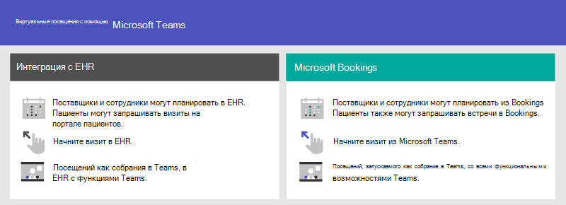
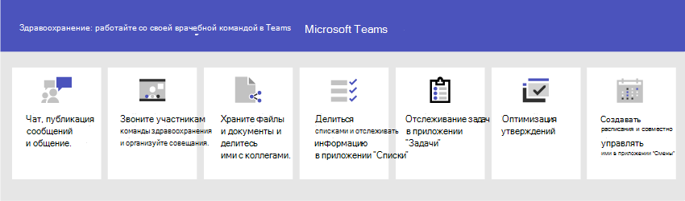

# Начало работы с Teams для сферы здравоохранения

Microsoft Teams предлагает ряд возможностей телемедицины для больниц и прочих организаций здравоохранения. Разрабатываемые функции Teams предназначены для того, чтобы помочь больницам в следующих задачах:

- Интеграция виртуальных посещений и электронных медицинских записей
- Пакеты политик Teams
- Безопасный обмен сообщениями
- Шаблоны Teams
- Согласование и совместная работа по уходу

Эта функция является частью Microsoft Cloud для здравоохранения. Узнайте больше об использовании этого решения, совмещающего возможности Azure, Dynamics 365 и Microsoft 365, в разделе [Microsoft Cloud для здравоохранения](/industry/healthcare).

Просмотрите следующий видеоролик, чтобы узнать больше об использовании коллекции медицинских учреждений для улучшения совместной работы группы здравоохранения в Teams.

> [!VIDEO https://www.microsoft.com/videoplayer/embed/RE4Hqan]

> [!NOTE]
> В этом разделе предполагается, что вы уже развернули Teams в своей организации. Если вы еще не развернули Teams, см. статью [Развертывание Microsoft Teams](../../deploy-overview.md).

Для организаций здравоохранения доступны следующие сценарии:

| Сценарий | Описание | Требования |
| -------- | -------- | -------- |
| [Виртуальные посещения с интеграцией электронной медицинских записей (EHR)](#virtual-visits-and-electronic-healthcare-record-ehr-integration) | Планировать виртуальные встречи с пациентами, управлять ими и проводить их. Этот сценарий связывает Teams и платформы Cerner или Android для поддержки виртуальных посещений. | Активная подписка на Microsoft Cloud для здравоохранения или подписка на Microsoft Teams EHR Connector.   У пользователей должна быть соответствующая Microsoft 365 или Office 365, которая включает Teams собраний*.   У организаций должна быть версия Cerner с ноября 2018 или более поздней либо версия с последующим с ноября 2018 г. или более поздней.  Подробные [сведения о требованиях eHR Cerner](ehr-admin-cerner.md#before-you-begin) [и EHR](ehr-admin.md#before-you-begin) |
| [Виртуальные посещения с помощью Microsoft Bookings и приложения Bookings](#virtual-visits-and-electronic-healthcare-record-ehr-integration) | Планировать виртуальные встречи с пациентами, управлять ими и проводить их. Этот сценарий использует Microsoft Bookings для поддержки виртуальных посещений. | Для организации должна быть включена служба Microsoft Bookings.   У всех пользователей приложения Bookings и всех сотрудников, участвующих в собраниях, должна быть лицензия, которая поддерживает планирование собраний Teams*.  [Подробные требования к Bookings](../../bookings-app-admin.md#prerequisites-for-using-the-bookings-app-in-teams)|
| [Пакеты политик Teams](#teams-policy-packages)| Убедитесь, что медицинские работники, информационные работники и устройства в палатах для пациентов имеют соответствующий доступ к функциям Teams.| У пользователей должна быть соответствующая лицензия*. |
| [Безопасный обмен сообщениями](#secure-messaging) | Обеспечьте должное внимание срочным сообщениям и будьте уверены в том, что сообщение получено и прочитано. | У пользователей должна быть соответствующая лицензия*.  |
| [Шаблоны Teams](#teams-templates-for-healthcare-organizations) | Создавайте команды с предопределенным шаблоном параметров, каналов и предварительно установленных приложений для общения и совместной работы в пределах палаты, крыла или отдела, а также между несколькими палатами, крыльями и отделами в больнице. | У пользователей должна быть соответствующая лицензия*.  |
| [Согласование и совместная работа по уходу](#care-coordination-and-collaboration) | Медицинский персонал и сотрудники больницы могут совместно работать над расписаниями, документами, задачами и т. д.| У пользователей должна быть соответствующая лицензия*. |

*Office 365 A3 поддерживаются A5, E3, E5, F1, F3, Microsoft 365 A3, A5, E3 и E5, бизнес-стандарт. Дополнительные общие сведения о лицензировании Teams см. в статье [Управление доступом пользователей к Teams](../../user-access.md).

## Интеграция виртуальных посещений и электронных медицинских записей

Используйте полную платформу собраний в Teams, чтобы планировать виртуальные встречи с пациентами, управлять ими и проводить их.

- Если в вашей организации уже используются электронные медицинские записи или EHR, вы можете Teams интеграцию для более простого использования. Teams электронной записи здоровья (EHR) позволяет стоматологам легко посетить виртуального пациента или обратиться к другому поставщику в Teams непосредственно из системы EHR. Дополнительные информации см. в Teams [интеграция с EHR Cerner](ehr-admin-cerner.md) и Виртуальные посещения Teams [интеграция с EHR](ehr-admin.md).
- Если вы не используете поддерживаемые электронные медицинские карты, можно воспользоваться Microsoft Bookings и приложением Bookings в Teams. Дополнительные информации см. в [Teams и приложении Bookings](../bookings-virtual-visits.md).

## Пакеты политик Teams

Примените пакеты политик Teams, чтобы определить возможности разных ролей в Teams. Например, укажите политики для:

- медицинских работников, таких как медсестры, старшие сестры, терапевты и социальные работники, чтобы дать им полный доступ к чатам, звонкам, управлению сменами и собраниям.
- информационных работников в организации здравоохранения, таких как ИТ-персонал, информационный персонал, финансовый персонал и сотрудники по обеспечению соответствия требованиям, чтобы дать им полный доступ к чатам, звонкам и собраниям.
- помещений для пациентов, чтобы управлять настройками для устройств в палатах для пациентов.

Чтобы узнать больше, см. статью [Пакеты политик Teams для здравоохранения](../../policy-packages-healthcare.md).

## Безопасный обмен сообщениями

Безопасный обмен сообщениями поддерживает совместную работу между командами здравоохранения и предлагает несколько новых возможностей:

- Отправитель может назначить сообщению особый приоритет, так что получатель будет постоянно видеть уведомления, пока не прочитает сообщение.
- Отправитель может запросить уведомление о прочтении, чтобы знать, когда получатель прочитал сообщение.

Вместе эти функции обеспечат должное внимание срочным сообщениям и дадут вам уверенность в том, что сообщение получено и прочитано. Новые команды здравоохранения с этими функциями можно создавать для каждого пациента. Эти функции основаны на политиках, и их можно назначать отдельным пользователям или целым командам.

Чтобы узнать больше, см. статью [Начало работы с безопасным обменом сообщениями для организаций в сфере здравоохранения](messaging-policies-hc.md).

Кроме того, для безопасного обмена сообщениями предусмотрена возможность объединения по организациям здравоохранения, чтобы способствовать связи между клиентами. (См. статью [Управление внешним доступом (федерация) в Microsoft Teams](../../manage-external-access.md)).

## Шаблоны Teams для организаций здравоохранения

Разработаны новые шаблоны для создания команд Teams в больницах, и вскоре ожидаются дополнительные функции. Это облегчит создание команд для работников здравоохранения и поможет координировать усилия по уходу за пациентами в разных отделах и палатах. Чтобы узнать больше, см. статью [Начало работы с шаблонами Teams для организаций в сфере здравоохранения](./healthcare-templates-admin-console.md) Также Teams можно использовать во внутренних отделах, например в кабинетах кардиологии, а также в палатах ухода за пациентами. Вскоре вас ждут и другие шаблоны.

## Согласование и совместная работа по уходу

Соедините свою группу здравоохранения, чтобы координировать уход и сотрудничать с другими Teams.

Teams обеспечивает эффективную совместную работу врачам, стоматологам, медсестрам и другим сотрудникам с помощью функций совместной работы в Teams, таких как:

- Настройка команд и каналов для медицинских и информационных работников. Использование каналов с вкладками для лучшей организации работы; на вкладках можно закрепить дополнительную полезную информацию.
- Беседы в чатах, публикация сообщений и общение. Ваша команда может вести непрерывные обсуждения о разных пациентах, которым требуется дополнительный уход.
- Звоните и встречайтесь с членами вашей команды здравоохранения. Назначайте отдельные встречи или воспользуйтесь встречами на канале, чтобы проводить ежедневные собрания. Вам помогут такие возможности как аудио- и видеосвязь Teams, демонстрация экрана, запись и транскрибирование сообщений.
- Сохраняйте и делитесь документами. Ваша команда здравоохранения — это единый цифровой организм, совместно работающий над документами Office.

Кроме того, ваша команда может использовать приложения в Teams, чтобы:

- Делиться списками и отслеживать информацию в приложении “Списки”
- Следить за выполнением задач в приложении “Задачи”
- Упростить процесс утверждений в приложении “Утверждения”
- Создавать расписания и совместно управлять ими в приложении “Смены”

### Делиться списками и отслеживать информацию в приложении “Списки”

> [!NOTE]
> С 30 октября 2020 г. приложение "Пациенты" устарело и заменено приложением [“Списки”](https://support.microsoft.com/office/get-started-with-lists-in-teams-c971e46b-b36c-491b-9c35-efeddd0297db) в Teams. С помощью приложения “Списки” медицинские бригады вашей организации здравоохранения могут создавать списки пациентов для различных сценариев: от обходов и собраний междисциплинарных команд до общего наблюдения за пациентами.

Приложение “Списки” в Microsoft Teams помогает пользователям в организации отслеживать данные, организовывать работу и управлять рабочими процессами. Приложение предварительно установлено для всех пользователей Teams и доступно в виде вкладки в каждой команде и канале. Списки можно создавать с нуля, из заранее определенных шаблонов или путем импорта данных в Excel.

Команды здравоохранения могут использовать шаблон "Пациенты" для начала работы. Они могут создавать списки, чтобы отслеживать нужды и состояние пациентов. Для создания списков в Teams можно использовать текущие данные пациентов в электронных таблицах Excel. Подобные списки пригодятся для обхода и наблюдения за пациентами, чтобы координировать врачебный уход.

Например, старшая сестра может создать список пациентов в команде, в которую входят все члены команды здравоохранения. Во время обходов члены команды здравоохранения заходят в Teams со своих мобильных устройств и обновляют сведения о пациентах в списке, доступном каждому члену команды. Когда команда собирается для обсуждения и оценки ключевых показателей состояния здоровья на совещаниях, чтобы убедиться, что пациенты находятся на пути к выздоровлению, информацию из Teams можно вывести на большой экран, а члены команды здравоохранения, которые не находятся на месте, могут присоединиться к совещанию дистанционно.

Вот пример списка, составленного для совещания о пациентах.

:::image type="content" source="../../media/lists-patients-example.png" alt-text="Снимок экрана: список примеров округлки пациентов.":::

Чтобы узнать больше, см. статью [Управление приложением "Списки" для организации в Teams](../../manage-lists-app.md).

### Отслеживание задач в приложении “Задачи”

Используйте приложение [“Задачи”](https://support.microsoft.com/office/use-the-tasks-app-in-teams-e32639f3-2e07-4b62-9a8c-fd706c12c070) в Teams, чтобы отслеживать задачи участников команды. Ваша медицинская команда может создавать, назначать и планировать задачи, классифицировать их и обновлять их статус в любое время и на любом устройстве с Teams. ИТ-специалисты и администраторы также могут публиковать задачи для конкретных команд в вашей организации. Например, можно опубликовать набор задач для новых протоколов безопасности или новый этап поступления, который будет использоваться в пределах больницы.

Чтобы узнать больше, см. [Управление приложением "Списки" для вашей организации в Microsoft Teams](../../manage-tasks-app.md)

### Упростить процесс утверждений в приложении “Утверждения”

Используйте приложение [“Утверждение”](https://support.microsoft.com/office/what-is-approvals-a9a01c95-e0bf-4d20-9ada-f7be3fc283d3) для упрощения запросов и процессов в команде. Создавайте утверждения, управляйте ими и делитесь ими непосредственно из центра для командной работы. Начните процесс утверждения там же, где вы отправляете сообщения в чат, в беседе канала или в самом приложении "Утверждения". Просто выберите тип утверждения, добавьте сведения, вложите файлы и выберите утверждающих лиц. После отправки утверждающие лица получат уведомление и смогут просмотреть запрос и принять необходимые действия.

Вы можете разрешить приложение "Утверждения" в своей организации и добавить его в свои команды. Чтобы узнать больше, см. статью [Доступность приложения "Утверждения" Teams](../../approval-admin.md).

### Создание расписаний, управление ими и предоставление к ним общего доступа в приложении “Смены” и в интеграции системы Frontline Worker

Teams интегрируется с приложением “Смены” и сотрудниками, работающими с клиентами. Их можно использовать для координации сотрудников в сменах и многого другого. Например, в приложении “Смены” старшие медсестры могут настраивать и координировать расписания для своего персонала, а медсестры могут просматривать смены и замещать друг друга. Teams содержит встроенную политику настройки приложений Frontline Worker, которую можно назначить сотрудникам без компьютеров в организации. По умолчанию политика включает приложения "Действия", "Смены", "Чат" и "Звонки". Эта политика управляет параметрами этих приложений, например закреплением приложения "Смены" на панели приложений, чтобы команда могла быстро получить к нему доступ.

Чтобы узнать больше, см. статью [Управление приложением "Смены" для организации в Microsoft Teams](../shifts/manage-the-shifts-app-for-your-organization-in-teams.md).

## Помощь для медицинских и информационных работников при работе с Teams

Существует множество ресурсов, которые помогут всем пользователям в вашей организации ознакомиться с Teams:

- Посетите [центр внедрения Teams](https://adoption.microsoft.com/microsoft-teams/), чтобы получить советы по развертыванию Teams, если вы только начинаете внедрять Teams в своей организации или распространяете Teams в других областях организации.
- Рассмотрите возможность ввода [схем обучения](https://adoption.microsoft.com/microsoft-365-learning-pathways/) для пользователей, чтобы помочь им в работе над своими задачами.
- Получите справку и учебные курсы по выполнению основных задач в Teams на сайте поддержки [Teams, в](https://support.microsoft.com/teams) том числе [краткие учебные видео](https://support.microsoft.com/office/microsoft-teams-video-training-4f108e54-240b-4351-8084-b1089f0d21d7). Также на сайте вы найдете справку и помощь по приложениям Teams, включая [“Списки”](https://support.microsoft.com/office/get-started-with-lists-in-teams-c971e46b-b36c-491b-9c35-efeddd0297db), [“Задачи”](https://support.microsoft.com/office/use-the-tasks-app-in-teams-e32639f3-2e07-4b62-9a8c-fd706c12c070), [“Утверждения”](https://support.microsoft.com/office/what-is-approvals-a9a01c95-e0bf-4d20-9ada-f7be3fc283d3), [Bookings](https://support.microsoft.com/office/overview-of-the-bookings-app-in-teams-7b8569e1-0c8a-444e-b712-d9968b05110b) и [“Смены”](https://support.microsoft.com/office/what-is-shifts-f8efe6e4-ddb3-4d23-b81b-bb812296b821).
