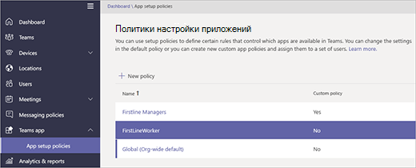

# Управление приложением "Смены" для вашей организации в Microsoft Teams

> [!IMPORTANT]
> Поддержка Microsoft StaffHub прекращена с 30 июня 2020 г. Мы встраиваем возможности StaffHub в Microsoft Teams. В настоящее время в состав Teams входит приложение "Смены" для управления расписанием, и со временем будут развернуты дополнительные возможности. Приложение StaffHub перестало работать для всех пользователей 30 июня 2020 г. При любой попытке открыть StaffHub отображается сообщение, ведущее на скачивание Teams. Дополнительные сведения см. в статье [Поддержка Microsoft StaffHub прекращена](microsoft-staffhub-to-be-retired.md).  

## Обзор Смен

Приложение "Смены" в Microsoft Teams обеспечивает связь и синхронизацию сотрудников переднего телефонного подключения. Она сначала встроена в мобильные устройства для быстрого и эффективного управления временем и взаимодействия для команд. Смены позволяют сотрудникам переднего плана и руководителям использовать свои мобильные устройства для управления расписаниями и связи с ним.

- Руководители могут создавать, обновлять и настраивать расписания смен для команд. Они могут отправлять сообщения одному человеку ("кто-то пролил воду на пол") или всей команде ("через 20 минут приезжает директор"). Также можно отправлять нормативные документы, новостные бюллетени и видео.
- Сотрудники могут видеть все свои предстоящие смены, кто еще работает в тот же день, просить коллег поменяться сменами или предложить смены, а также запросить отгул.

Важно знать, что в настоящее время смены не поддерживают гостей. Это означает, что гостей команды нельзя добавить и они не могут использовать расписания смен, если в Teams включен гостевой доступ. 

> [!Note]
> Подробные сведения о возможностях приложения "Смены" на разных платформах см. в статье [Возможности Teams на разных платформах](https://support.microsoft.com/office/teams-features-by-platform-debe7ff4-7db4-4138-b7d0-fcc276f392d3).

## Доступность приложения "Смены"

Смены доступны во всех корпоративных SKU, где доступно приложение Teams.

## Расположение данных Смен

В настоящее время данные Смен хранятся в центрах обработки данных Azure в Северной Америке, Западной Европе и Азиатско-Тихоокеанском регионе. Дополнительные сведения о месте хранения данных см. в статье [Где находятся мои данные?](http://o365datacentermap.azurewebsites.net/)

## Настройка Смен

### Включение и отключение Смен в организации

По умолчанию приложение "Смены" включено для всех пользователей Teams в организации. Вы можете отключить или включить приложение на уровне организации на странице [Управление приложениями](../../manage-apps.md) в Центре администрирования Microsoft Teams.

1. В левой панели навигации Центра администрирования Microsoft Teams выберите **Приложения Teams** > **Управление приложениями**.
2. В списке приложений выполните одно из следующих действий.

    - Чтобы отключить Смены для организации, найдите приложение "Смены", выделите его и нажмите **Заблокировать**.
    - Чтобы включить Смены для организации, найдите приложение "Смены", выделите его и нажмите **Разрешить**.

### Включение и отключение Смен для определенных пользователей в организации

Чтобы разрешить или заблокировать использование смен определенным пользователям в организации, убедитесь, что для вашей организации на странице Управление [приложениями](../../manage-apps.md) включена смена. Затем создайте настраиваемую политику разрешений приложений и назначьте ее этим пользователям. Дополнительные сведения см. в статье [Управление политиками и параметрами пользовательских приложений в Teams](../../teams-app-permission-policies.md).

### Используйте политику настройки приложения FirstLineWorker, чтобы закрепить shifts в Teams

Политики настройки приложений позволяют настроить Teams, чтобы выделить приложения, которые наиболее важны для пользователей в организации. Приложения, настроенные в политике, закрепляются на панели приложения&mdash;панели сбоку классического клиента Teams и в нижней части мобильных клиентов Teams,&mdash;где пользователи могут быстро и легко получить к ним доступ.
 
Teams включает встроенную политику настройки приложения FirstLineWorker, которую можно назначить сотрудникам в вашей организации. По умолчанию политика включает приложения "Действия", "Смены", "Чат" и "Звонки".

Чтобы просмотреть политику FirstLineWorker, в левой области навигации Центра администрирования Microsoft Teams перейдите к Teams политики настройки приложений  >  **приложений**.

#### Назначение политики настройки приложения FirstLineWorker пользователям

[!INCLUDE [assign-policy](../../includes/assign-policy.md)]

## Поиск событий Смен в журнале аудита

**(предварительная версия)**

Вы можете выполнять поиск в журнале аудита для просмотра действий Смен в организации.  Дополнительные сведения о поиске в журнале аудита и просмотре списка [действий Смен](../../audit-log-events.md#shifts-in-teams-activities), регистрируемых в журнале аудита, см. в статье [Поиск событий Teams в журнале аудита](../../audit-log-events.md).

Прежде чем выполнять поиск в журнале аудита, необходимо сначала включить функцию аудита в [Центре безопасности и соответствия требованиям](https://protection.office.com). Дополнительные сведения см. в статье [Включение и отключение поиска в журнале аудита](https://support.office.com/article/Turn-Office-365-audit-log-search-on-or-off-e893b19a-660c-41f2-9074-d3631c95a014). Обратите внимание, что данные аудита доступны только с момента его включения.

## Связанные статьи

- [Справка по сменам для сотрудников, работающих на переднем телефоне](https://support.office.com/article/apps-and-services-cc1fba57-9900-4634-8306-2360a40c665b)
- [Назначение политик пользователям в Teams](../../assign-policies.md)
