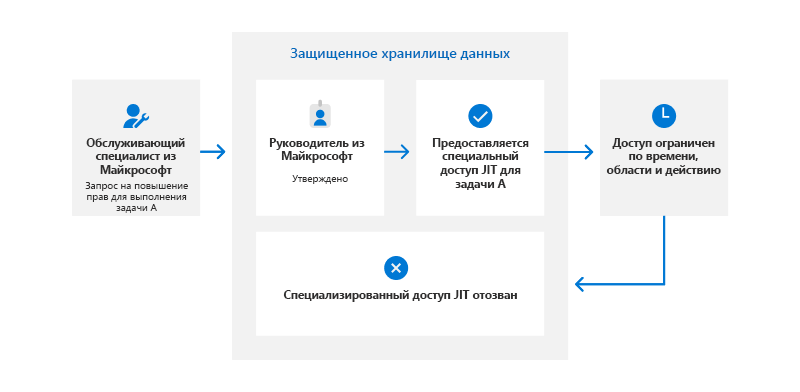
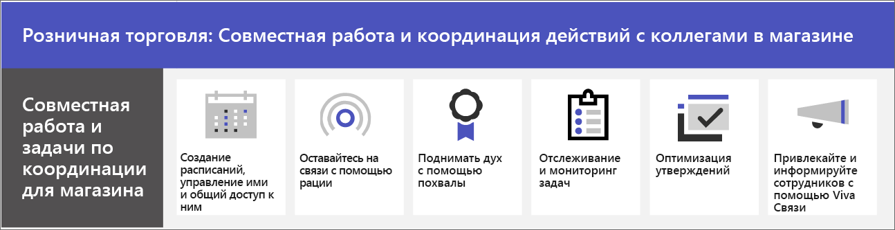
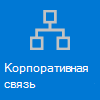

# Начало работы с Teams для розничной торговли

В средах розничной торговли со скользящим графиком и мобильным персоналом потребности совсем другие, чем в прочих организациях. Чтобы максимально эффективно использовать Teams в организации розничной торговли, сначала определите, как Teams может помочь вам в повседневных бизнес-операциях, а затем убедитесь, что среда Teams с соответствующими основными компонентами, командами и приложениями готова для поддержки этих сценариев.

1. [Выберите сценарии](#choose-your-scenarios), которые вы хотите реализовать для своей компании.
:::image type="content" source="../media/retail-teams-scenarios.png" alt-text="Схема, показывающая сценарии Teams для розничной торговли." lightbox="../media/retail-teams-scenarios.png":::
1. [Настройка основных компонентов.](#set-up-the-fundamentals) Поддержите сотрудников с помощью основных компонентов: управления учетными записями и устройствами и применения соответствующих политик Teams. :::image type="content" source="../media/retail-teams-fundamentals.png" alt-text="Схема, показывающая основные компоненты, включая политики Teams, учетные записи и устройства." lightbox="../media/retail-teams-fundamentals.png":::
1. [Настройка команд и приложений](#set-up-teams-and-apps). Используйте шаблоны групп, чтобы быстро настроить нужные вам команды, включая каналы и приложения, необходимые для вашего бизнеса. Добавьте другие приложения от Майкрософт, если это необходимо для поддержки сценариев.
:::image type="content" source="../media/retail-teams-apps.png" alt-text="Схема, показывающая команды, шаблоны команд и приложения, которые можно включить." lightbox="../media/retail-teams-apps.png":::

<!-- Additional capabilities for retail environments are available with the Microsoft Cloud for Retail, which includes capabilities from Dynamics 365 and Microsoft Azure as well as the Microsoft 365 features. For more information, see [Microsoft Cloud for Retail](/industry/retail/). -->

## Выбор сценариев

Microsoft 365 и Microsoft Teams предлагают несколько возможностей, которые могут помочь организациям розничной торговли в выполнении повседневных операций и переходе на цифровые технологии. Мы рекомендуем следующие сценарии для организаций розничной торговли:

     

> [!NOTE]
> Эти сценарии также предусмотрены в Microsoft Cloud для розничной торговли. Вы можете расширить свои возможности в этих сценариях, если также воспользуетесь другими ресурсами Microsoft Cloud для розничной торговли, такими как Microsoft Dynamics 365. Узнайте больше об использовании этого решения, совмещающего возможности Azure, Dynamics 365 и Microsoft 365, в разделе [Microsoft Cloud для розничной торговли](/industry/retail).

### Взаимодействие и совместная работа в магазине

Объедините сотрудников и руководство магазина для общения и упорядочения работы с помощью Teams и приложений Teams.

**Основные приложения:** Смены, Рация, Задачи, Утверждения, Чат, Благодарность, Списки, Файлы

**Дополнительные службы:** Viva Связи, SharePoint, Power Platform и Power Apps

Дополнительные сведения: [совместная работа группы розничной торговли](retail-team-collaboration.md)

### Взаимодействие и совместная работа в разных магазинах

Сотрудники могут общаться и совместно работать в разных магазинах в регионе или со штаб-квартирой, используя те же инструменты и приложения, которые вы используете в своем магазине.

**Основные приложения:** Смены, Рация, Задачи, Утверждения, Чат, Благодарность, Списки, Файлы

**Дополнительные службы:** Viva Связи, Yammer, SharePoint, Power Platform и Power Apps

Дополнительные сведения: [совместная работа группы розничной торговли](retail-team-collaboration.md)

### Виртуальная модернизация и консультации

Приложение Bookings в Microsoft Teams предоставляет организациям простой способ планирования и управления виртуальными встречами для сотрудников и клиентов. С ее помощью можно планировать виртуальные встречи, например виртуальные покупки.

**Основные функции и приложения:** собрания, Bookings

Дополнительные сведения: [виртуальные встречи с помощью Microsoft Teams и приложения Bookings](bookings-virtual-visits.md)

### Упрощение бизнес-процессов

Вы можете использовать приложения Teams, Power Apps и Power BI, чтобы упростить бизнес-процессы. Например, можно:

- Устанавливать и поддерживать графики сотрудников с помощью приложения «Смены».
- Посещать магазины и проводить инвентаризацию с помощью Power Apps.
- Отслеживать ключевые показатели эффективности (KPI) с помощью отчетов Power BI.

**Основные приложения:** Смены, Задачи, Списки, Утверждения

**Дополнительные службы:** Power Platform с Power Apps и Power BI

Дополнительные сведения: [Упрощение бизнес-процессов](retail-business-processes.md)

### Корпоративными связями

Вовлеченность сотрудников — важный фактор удовлетворенности рабочим местом, лояльности и производительности в любой организации. Узнайте, как информировать и вовлекать пользователей с помощью SharePoint, Teams, Yammer, Stream и Viva Связи.

**Дополнительные службы:** Viva Связи, SharePoint, Stream, Yammer

Дополнительные сведения: [Общение в организации: руководство, методы и продукты](/sharepoint/corporate-communications-overview)

### Подключение новых сотрудников

Сделайте процесс адаптации новых сотрудников приятным и эффективным, сформировав единое гибридное рабочее окружение, в котором новые сотрудники смогут найти важные ресурсы, познакомиться с коллегами в своей организации и подготовиться к успешной работе в своей новой роли.

**Основные приложения:** Списки, собрания Live Meetings

**Дополнительные службы.** Viva Обучение, SharePoint, Yammer

Дополнительные сведения: [Подключение новых сотрудников](/sharepoint/onboard-employees)

> [!NOTE]
> Для всех этих возможностей у пользователей должна быть соответствующая лицензия. Поддерживаются Microsoft 365 для сотрудников, работающих с клиентами F1 и F3 или Office 365 F3, Office 365 A3, A5, E3 и E5, а также Microsoft 365 бизнес стандарт, бизнес премиум, A3, A5, E3 и E5. Дополнительные общие сведения о лицензировании Teams см. в статье [Управление доступом пользователей к Teams](../user-access.md). Дополнительные сведения об использовании Microsoft 365 для передовых сотрудников в сочетании с другими лицензиями см. в статье [Параметры лицензирования для сотрудников, работающих с клиентами](../flw-licensing-options.md).

## Настройка основ

Заложите правильную основу для своих сотрудников, выбрав для них подходящие лицензии, управляя их учетными записями и устройствами, чтобы обеспечить безопасный и соответствующий требованиям способ выполнения их работы.

:::image type="content" source="../media/retail-teams-fundamentals.png" alt-text="Схема основ, которые поддерживают сценарии для Teams, такие как политики Teams и учетные записи и устройства.":::

### Лицензирование

Сотрудники, работающие в розничной сети, как правило, представляет собой мобильную рабочую силу: сотрудники, работающий с клиентами, и руководители, которые не привязаны к компьютерам весь день, в отличие от корпоративного персонала. Поэтому необходимые инструменты и приложения отличаются. Microsoft 365 предоставляет сотрудникам, работающим с клиентами, набор функций, адаптированный для этой аудитории. Дополнительные сведения см. в статье [Параметры лицензирования для сотрудников, работающих с клиентами](../flw-licensing-options.md).

### Учетные записи

При высокой текучести кадров ключевым моментом является возможность быстро добавлять и удалять учетные записи, а также назначать правильные политики. Начало работы с помощью мастера подключения сотрудников, работающих с клиентами, в Центре администрирования Microsoft 365. Мастер настраивает команду для сотрудников, работающих с клиентами, и назначает лицензии и пакеты политик каждому члену команды. Дополнительные сведения см. в статье [Использование мастера подключения сотрудника без компьютера для подготовки персонала без компьютеров](../flw-onboarding-wizard.md).

Если у вас много команд, которые нужно развернуть, см. статью [Развертывание команд в большом масштабе для сотрудников первой линии](../deploy-teams-at-scale.md).

Присутствие работников, работающих с клиентами, часто менее предсказуемо, чем других сотрудников, поскольку их рабочее время, как правило, не одинаково каждый день. Как администратор, вы можете настроить Teams с доступом на основе смен (предварительная версия), чтобы отображать набор состояний присутствия на основе смен для сотрудников, работающих с клиентами, в организации, чтобы указать, когда они работают и не работают. Вы также можете управлять доступом к Teams, когда сотрудники, работающие с клиентами, не работают. Дополнительные сведения см. в статье [Управление доступом на основе смен для сотрудников, работающих с клиентами](shifts/manage-shift-based-access-flw.md).

### Устройства

Поскольку сотрудники в основном мобильны, управление учетными записями и устройствами является ключевой основой для розничной торговли. Вам необходимо установить безопасный, совместимый базовый уровень с управляемыми устройствами для использования сотрудниками, будь то общее устройство или собственное устройство сотрудника. Дополнительные сведения:

- [Планирование развертывания устройства Azure Active Directory](/azure/active-directory/devices/plan-device-deployment)
- [Обзор Microsoft Intune](/mem/intune/fundamentals/what-is-intune#manage-devices)
- [Microsoft Teams для RealWear](../flw-realwear.md)

### Политики

Убедитесь, что продавцы и другие сотрудники, работающие с клиентами, имеют надлежащий доступ к функциям Teams, настроив соответствующие пакеты политик. Политики Teams помогают управлять тем, что могут делать пользователи с определенными ролями. [Пакеты политик для руководителей и сотрудников, работающих с клиентами,](../manage-policy-packages.md#policy-packages-included-in-teams) разработаны таким образом, чтобы они подходили для сотрудников, работающих с клиентами, например, в розничных магазинах.

Teams интегрируется с приложением “Смены” и сотрудниками, работающими с клиентами. Их можно использовать для координации сотрудников в сменах и многого другого. Например, в приложении “Смены” руководители магазинов могут настраивать и координировать расписания для своего персонала, а сотрудники могут просматривать смены и замещать друг друга.

## Настройка команд и приложений

:::image type="content" source="../media/retail-teams-apps.png" alt-text="Схема команд, шаблоны команд и приложения, которые можно включить.":::

### Приложения и службы для розничной торговли

Убедитесь, что ваши сотрудники могут общаться, совместно работать и обеспечивать отличное обслуживание клиентов с помощью таких приложений, как Смены, Рация, Задачи, Списки, Благодарность и т. д. Вы можете определить, какие приложения доступны для пользователей, включив их в Центре администрирования Teams или включив их в шаблон группы. Дополнительные сведения об [управлении приложениями Teams](../manage-apps.md).

В средах розничной торговли следующие приложения и службы могут помочь вам преобразовать бизнес-процессы и поддерживать связь:

| Приложения и службы Teams | Описание | Управление | Справка |
| ----- | ----- | ----- | ----- |
| Утверждения | Утверждения могут быть интегрированы в чат для простого утверждения. | [Управление утверждениями](../approval-admin.md) | [Использование утверждений](https://support.microsoft.com/office/what-is-approvals-a9a01c95-e0bf-4d20-9ada-f7be3fc283d3) |
| Чат | Обеспечьте быстрые беседы и проверки между сотрудниками с помощью безопасных средств связи корпоративного уровня вместо потребительских приложений или SMS. | [Чат, команды, каналы и приложения в Microsoft Teams](../deploy-chat-teams-channels-microsoft-teams-landing-page.md) | [Чат в Teams](https://support.microsoft.com/office/start-and-pin-chats-a864b052-5e4b-4ccf-b046-2e26f40e21b5?wt.mc_id=otc_microsoft_teams) |
| Документы | Делитесь стандартными операционными процедурами, храните политики, планы и многое другое. | [Взаимодействие SharePoint и OneDrive с Microsoft Teams](../sharepoint-onedrive-interact.md) | [Совместное использование файлов](https://support.microsoft.com/office/upload-and-share-files-57b669db-678e-424e-b0a0-15d19215cb12) |
| Благодарность | Отмечайте коллег за отличную командную работу с помощью приложения "Благодарность". | [Управление приложением "Благодарность"](../manage-praise-app.md) | [Отправка благодарностей пользователям](https://support.microsoft.com/office/send-praise-to-people-50f26b47-565f-40fe-8642-5ca2a5ed261e) |
| Устройства RealWear | Беспроводная связь с устройствами. | [Microsoft Teams для RealWear](../flw-realwear.md) | [Использование Microsoft Teams для RealWear](https://support.microsoft.com/office/using-microsoft-teams-for-realwear-af20d232-d18c-476f-8031-843a4edccd5f) |
| Смены | Управление расписаниями и заступлением на смену с помощью Смен. | [Управление Сменами](shifts-for-teams-landing-page.md) | [Использование Смен](https://support.microsoft.com/office/what-is-shifts-f8efe6e4-ddb3-4d23-b81b-bb812296b821) |
| Задачи | Помогите сотрудникам понять, на чем им следует сосредоточиться, когда они не работают с клиентами, назначая задачи. Операции могут использовать [публикацию задач](../manage-tasks-app.md#task-publishing) для отправки задач в расположения и отслеживания хода выполнения в этих расположениях. | [Управление приложением "Задачи"](../manage-tasks-app.md) | [Использование приложения "Задачи"](https://support.microsoft.com/office/use-the-tasks-app-in-teams-e32639f3-2e07-4b62-9a8c-fd706c12c070) |
| Рация | Быстрое общение, которое не ограничивается географическими данными, как стандартные двусторонние радиостанции.| [Управление приложением "Рация"](../walkie-talkie.md) | [Использование приложения "Рация"](https://support.microsoft.com/office/get-started-with-teams-walkie-talkie-25bdc3d5-bbb2-41b7-89bf-650fae0c8e0c) |

| Другие приложения и службы от Майкрософт | Описание | Управление | Справка |
| ----- | ----- | ----- | ----- |
| Bookings | Включите виртуальную модернизацию и консультации. | [Виртуальные встречи с помощью Microsoft Teams и приложения Bookings](bookings-virtual-visits.md) | [Использование Bookings](https://support.microsoft.com/en-us/office/what-is-bookings-42d4e852-8e99-4d8f-9b70-d7fc93973cb5) |
| Power Apps и Power Platform | Интеграция бизнес-процессов и возможность быстрого обновления данных, таких как перечень складских запасов, количество продаж, отчеты об инцидентах и многое другое. | [Интеграция Teams с Microsoft Power Platform](/microsoftteams/platform/samples/teams-low-code-solutions) и [управление приложениями Microsoft Power Platform в Центре администрирования Microsoft Teams](../manage-power-platform-apps.md) | -  |
| SharePoint | При создании новой группы создается новый сайт SharePoint, подключенный к группе. Многие из этих сценариев основаны на функциях SharePoint, уже встроенных в Teams, таких как совместное использование документов для совместной работы в команде. | [Интеграция Teams и SharePoint](/sharepoint/teams-connected-sites) | [Добавление страницы, списка или библиотеки документов SharePoint в качестве вкладки в Teams](https://support.microsoft.com/office/add-a-sharepoint-page-list-or-document-library-as-a-tab-in-teams-131edef1-455f-4c67-a8ce-efa2ebf25f0b)|
| Viva Связи | Viva Связи создает центр в Teams, где розничные партнеры могут просматривать веб-канал новостей организации и персонализированную информационную панель с нужными ресурсами. | [Обзор приложения "Viva Связи"](/sharepoint/viva-connections-overview) | [Viva Связи в Microsoft Teams](https://support.microsoft.com/office/your-intranet-is-now-in-microsoft-teams-8b4e7f76-f305-49a9-b6d2-09378476f95b) |
| Viva Обучение | При необходимости обучение можно проводить прямо в потоке работы. | [Управление Viva Обучение](/microsoft-365/learning/) | [Использование Viva Обучение (предварительная версия)](https://support.microsoft.com/office/viva-learning-preview-01bfed12-c327-41e0-a68f-7fa527dcc98a) |
| Yammer | Подключение организации и разрешение взаимодействие между отделами и регионами с помощью Yammer. | [Управление Yammer](/yammer) | [Использование Yammer](https://support.microsoft.com/office/what-is-yammer-1b0f3b3e-89ee-4b66-aac5-30def12f287c) |

### Настройка команд с помощью шаблонов

Создавайте команды, включающие предопределенный набор параметров, каналов, вкладок и предустановленных приложений для общения и совместной работы в отдельном магазине, в регионе или между штаб-квартирой и вашими сотрудниками, где бы они ни находились.

- Шаблон **"Организация магазина** розничной торговли" включает каналы "Общие", "Смена", "Готовность магазина" и "Обучение", а также приложения "Утверждения", "Задачи" и "Вики".
- Шаблон **Розничная торговля для менеджеров** включает каналы "Общие", "Операции", и "Обучение", а также вкладку "Вики".

Вы также можете [создать настраиваемый шаблон,](../create-a-team-template.md) чтобы включить приложения, необходимые вашему магазину. Дополнительные сведения см. в статье [Начало работы с шаблонами команд для розничной торговли](../get-started-with-retail-teams-templates.md)

Помимо шаблонов групп, вы также можете настроить другие сайты и службы, которые помогут в общении: сайты SharePoint и Viva Связи.

- Настройте сайты SharePoint, чтобы создать домашнюю страницу для вашей организации, распространять новости в вашей компании и предоставлять место с ресурсами для подключения пользователей. Дополнительные сведения об использовании сайтов SharePoint для сценариев корпоративного общения см. в разделе [Организационное общение: руководство, методы и продукты](/sharepoint/corporate-communications-overview).
- Используйте Viva Связи, чтобы все объединить. Благодаря Viva Связи в качестве домашнего приложения вашего сотрудника в Teams, он может получать обновления о своих задачах, организационные новости и многое другое. Дополнительные сведения см. в статьях [Обзор: Viva Связи (предварительная версия)](/viva/connections/viva-connections-overview) и [Добавление приложения Viva Связи в Центре администрирования Teams (предварительная версия)](/viva/connections/add-viva-connections-app).

## Подготовьтесь к развертыванию сценариев — определите роли и обязанности для сценариев

Теперь, когда вы знаете, какие сценарии хотите реализовать и что нужно для их поддержки, вы можете собрать свою команду, чтобы планировать, развертывать и отслеживать ее работу в организации. Например, для развертывания этих сценариев в организации могут потребоваться следующие роли:

| Изображение | Должность | Обязанности | Отдел |
| ---- | ---- | ----- | ----- |
| | ИТ-администратор | Работайте с операционным и розничным персоналом, чтобы определить сценарии и то, как они будут работать для организации.   Настройте параметры в Центре администрирования Teams, такие как политики и шаблоны, и включите приложения.   Настройте параметры приложения (например, глобальные параметры смен) для организации.   Добавление и лицензирование пользователей.  | ИТ-отдел |
|| Операционный персонал | Вместе с администраторами определите сценарии и определите, какие параметры, политики, шаблоны и приложения необходимы для Teams.   Создавайте региональные или дивизионные команды на основе шаблонов.   Настройка задач, списков и потоков утверждения для согласования между магазинами в регионе или между магазинами и головным офисом.   Настройка системы обучения для сотрудников. | Центральные операции |
| | Менеджер магазина | Определите сценарии вместе с администраторами и сотрудниками.   Создавайте команды для магазина из шаблонов.   При необходимости можно настроить каналы и приложения для команд. Например, канал для передачи смены.   Настройка расписания магазинов в сменах.   Настройка задач, списков и потоков утверждения, которые специфичны для магазина.   Настройка задач обучения для сотрудников. | Управление магазином |

Дополнительные сведения об успешном внедрении Teams см. в разделе [Внедрение Microsoft Teams](../adopt-microsoft-teams-landing-page.md).
