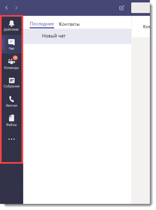
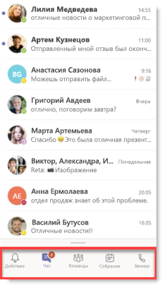
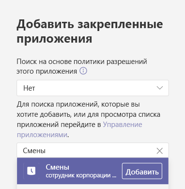
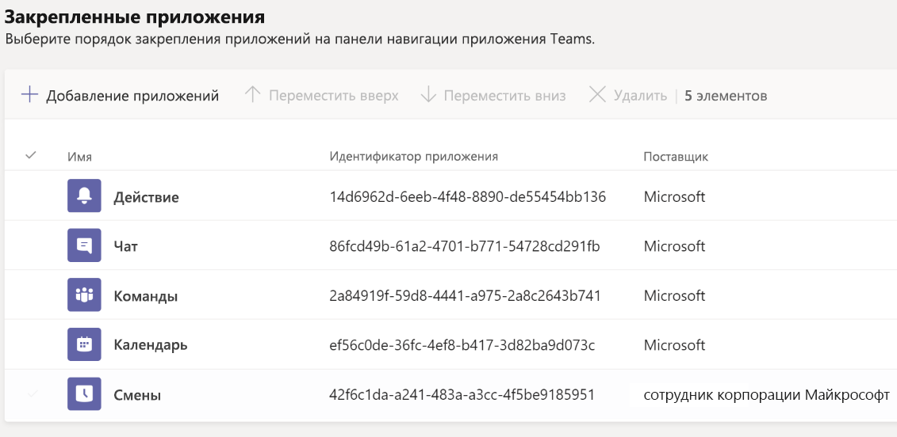
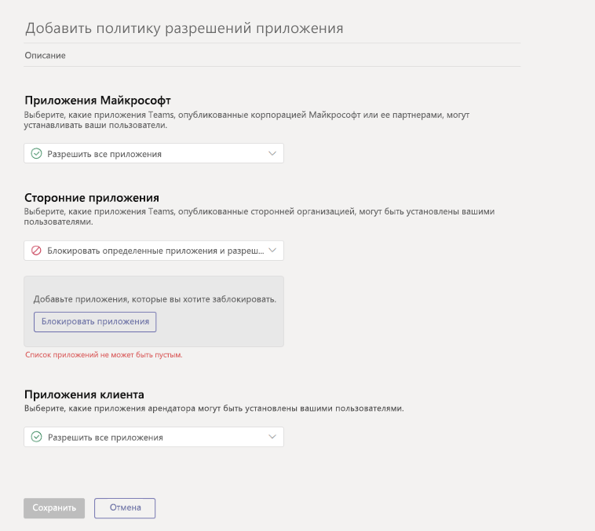

# <a name="how-to-provision-teams-at-scale-for-firstline-workers"></a><span data-ttu-id="93597-103">Как обеспечить Teams в масштабе для Сотрудников без компьютеров</span><span class="sxs-lookup"><span data-stu-id="93597-103">How to provision Teams at scale for Firstline Workers</span></span>

<span data-ttu-id="93597-104">Нужно ли вам быстро подключить большое количество пользователей к Microsoft Teams и настроить для них оптимизированный интерфейс?</span><span class="sxs-lookup"><span data-stu-id="93597-104">Do you need to rapidly onboard a large number of users to Microsoft Teams and configure a streamlined experience for them?</span></span> <span data-ttu-id="93597-105">Вы можете быстро предоставить удостоверения, подготовить группы и назначить все соответствующие политики для управления взаимодействием с конечным пользователем, выполнив следующие инструкции.</span><span class="sxs-lookup"><span data-stu-id="93597-105">You can quickly provision identities, provision teams, and assign all relevant policies to control the end user experience by walking through the following instructions.</span></span>

<span data-ttu-id="93597-106">В этом пошаговом руководстве вы узнаете, как:</span><span class="sxs-lookup"><span data-stu-id="93597-106">In this walkthrough, you'll learn how to:</span></span>

- <span data-ttu-id="93597-107">Создайте большое количество пользователей.</span><span class="sxs-lookup"><span data-stu-id="93597-107">Create a large number of users.</span></span>
- <span data-ttu-id="93597-108">Создайте большое количество команд и настройте соответствующие каналы.</span><span class="sxs-lookup"><span data-stu-id="93597-108">Create a large number of teams and set up the appropriate channels.</span></span>
- <span data-ttu-id="93597-109">Назначьте лицензирование в масштабе.</span><span class="sxs-lookup"><span data-stu-id="93597-109">Assign licensing at scale.</span></span>
- <span data-ttu-id="93597-110">Создайте соответствующие политики обмена сообщениями Teams, политики установки приложений и политики разрешений приложений.</span><span class="sxs-lookup"><span data-stu-id="93597-110">Create appropriate Teams Messaging Policies, App Setup Policies, and App Permission Policies.</span></span>
- <span data-ttu-id="93597-111">Применяйте эти политики к пользователям в масштабе.</span><span class="sxs-lookup"><span data-stu-id="93597-111">Apply those policies to users at scale.</span></span>
- <span data-ttu-id="93597-112">Назначьте большое количество пользователей в назначенную команду.</span><span class="sxs-lookup"><span data-stu-id="93597-112">Assign a large number of users into a designated team.</span></span>

> [!NOTE]
> <span data-ttu-id="93597-113">Если вы ознакомились с этой информацией и хотите обратиться за помощью или у вас возникли вопросы, [**нажмите здесь**](https://forms.office.com/Pages/ResponsePage.aspx?id=v4j5cvGGr0GRqy180BHbRyMDv-1voW9MqL7zkQ11DzBUREZaU1E0WEk5T0NYS0NDSkFMSDROUUdYMC4u), чтобы связаться со службой поддержки White Glove.</span><span class="sxs-lookup"><span data-stu-id="93597-113">If you've reviewed this information and feel like you need some help or have some questions, you can [**click here**](https://forms.office.com/Pages/ResponsePage.aspx?id=v4j5cvGGr0GRqy180BHbRyMDv-1voW9MqL7zkQ11DzBUREZaU1E0WEk5T0NYS0NDSkFMSDROUUdYMC4u) to reach out for White Glove Support.</span></span>

## <a name="prerequisites"></a><span data-ttu-id="93597-114">Необходимые компоненты</span><span class="sxs-lookup"><span data-stu-id="93597-114">Prerequisites</span></span>

<span data-ttu-id="93597-115">Загрузите ресурсы с [этого места](https://aka.ms/flwteamsscale).</span><span class="sxs-lookup"><span data-stu-id="93597-115">Download the assets from [this location](https://aka.ms/flwteamsscale).</span></span>

> [!IMPORTANT]
> <span data-ttu-id="93597-116">Сценарии в приведенной выше ссылке предоставлены Microsoft как есть и должны быть изменены в соответствии с вашими индивидуальными потребностями.</span><span class="sxs-lookup"><span data-stu-id="93597-116">The scripts in the link provided above are provided as-is by Microsoft, and must be modified for your individual needs.</span></span>

## <a name="technical-requirements"></a><span data-ttu-id="93597-117">Технические требования</span><span class="sxs-lookup"><span data-stu-id="93597-117">Technical requirements</span></span>

- <span data-ttu-id="93597-118">У вашего арендатора должно быть соответствующее количество доступных лицензий, включая Microsoft Teams.</span><span class="sxs-lookup"><span data-stu-id="93597-118">Your tenant must have the appropriate number of licenses available that include Microsoft Teams.</span></span> <span data-ttu-id="93597-119">Если у вас еще нет этих лицензий, попробуйте воспользоваться бесплатной пробной подпиской на [Teams Exploratory](teams-exploratory.md).</span><span class="sxs-lookup"><span data-stu-id="93597-119">If you do not already have these licenses, check out [Teams Exploratory](teams-exploratory.md) for a free trial subscription.</span></span>
- <span data-ttu-id="93597-120">Пользователю, выполняющему эти действия, должны быть назначены следующие роли: глобальный администратор, администратор пользователя и администратор службы команд в Azure AD.</span><span class="sxs-lookup"><span data-stu-id="93597-120">The user taking these steps must have these roles assigned: Global Admin, User Admin, and Teams Service Admin, in Azure AD.</span></span>
- <span data-ttu-id="93597-121">Пользователь должен иметь права на установку и настройку программного обеспечения на своем локальном компьютере.</span><span class="sxs-lookup"><span data-stu-id="93597-121">User must have the rights to install and configure software on their local machine.</span></span>

## <a name="step-by-step-process-overview"></a><span data-ttu-id="93597-122">Пошаговый обзор процесса</span><span class="sxs-lookup"><span data-stu-id="93597-122">Step-by-step process overview</span></span>

1. <span data-ttu-id="93597-123">**Настройка вашей среды**</span><span class="sxs-lookup"><span data-stu-id="93597-123">**Set up Your Environment**</span></span>
    1. <span data-ttu-id="93597-124">Загрузите из репозитория GitHub, содержащего примеры скриптов PowerShell и документацию</span><span class="sxs-lookup"><span data-stu-id="93597-124">Download from the GitHub repository containing the sample PowerShell scripts and documentation</span></span>
    1. <span data-ttu-id="93597-125">Настройте локальную среду</span><span class="sxs-lookup"><span data-stu-id="93597-125">Configure the local environment</span></span>
    1. <span data-ttu-id="93597-126">Настройка учетных данных</span><span class="sxs-lookup"><span data-stu-id="93597-126">Setup credentials</span></span>
    1. <span data-ttu-id="93597-127">Настройка модулей PowerShell и переменных среды</span><span class="sxs-lookup"><span data-stu-id="93597-127">Configure PowerShell Modules and environmental variables</span></span>
1. <span data-ttu-id="93597-128">**Создание и настройка Teams**</span><span class="sxs-lookup"><span data-stu-id="93597-128">**Create and Setup Teams**</span></span>
    1. <span data-ttu-id="93597-129">Создание команд</span><span class="sxs-lookup"><span data-stu-id="93597-129">Create teams</span></span>
    1. <span data-ttu-id="93597-130">Шаги по созданию команд</span><span class="sxs-lookup"><span data-stu-id="93597-130">Steps to create teams</span></span>
    1. <span data-ttu-id="93597-131">Создать каналы для команд</span><span class="sxs-lookup"><span data-stu-id="93597-131">Create channels for teams</span></span>
1. <span data-ttu-id="93597-132">**Создание политик Teams**</span><span class="sxs-lookup"><span data-stu-id="93597-132">**Create Teams Policies**</span></span>
    1. <span data-ttu-id="93597-133">Создание политик сообщений Teams</span><span class="sxs-lookup"><span data-stu-id="93597-133">Create Teams message policies</span></span>
    1. <span data-ttu-id="93597-134">Создание политик настройки приложения для Teams</span><span class="sxs-lookup"><span data-stu-id="93597-134">Create Teams app setup policies</span></span>
    1. <span data-ttu-id="93597-135">Создание политик разрешений приложений для Teams</span><span class="sxs-lookup"><span data-stu-id="93597-135">Create Teams app permission policies</span></span>
1. <span data-ttu-id="93597-136">**Пользователи и группы безопасности**</span><span class="sxs-lookup"><span data-stu-id="93597-136">**Users and Security Groups**</span></span>
    1. <span data-ttu-id="93597-137">Создать пользователей и группы безопасности</span><span class="sxs-lookup"><span data-stu-id="93597-137">Create users and security groups</span></span>
    1. <span data-ttu-id="93597-138">Назначение лицензирования пользователям через групповое лицензирование</span><span class="sxs-lookup"><span data-stu-id="93597-138">Assign licensing to users via group-based licensing</span></span>
1. <span data-ttu-id="93597-139">**Назначить пользователей и политики**</span><span class="sxs-lookup"><span data-stu-id="93597-139">**Assign Users and Policies**</span></span>
    1. <span data-ttu-id="93597-140">Назначать пользователей в Teams</span><span class="sxs-lookup"><span data-stu-id="93597-140">Assign users to Teams</span></span>
    1. <span data-ttu-id="93597-141">Назначение политик Teams пользователям</span><span class="sxs-lookup"><span data-stu-id="93597-141">Assign Teams policies to users</span></span>
    1. <span data-ttu-id="93597-142">НЕОБЯЗАТЕЛЬНО: преобразование типа членства в группе</span><span class="sxs-lookup"><span data-stu-id="93597-142">OPTIONAL: Convert group membership type</span></span>
1. <span data-ttu-id="93597-143">**Проверить и проверить**</span><span class="sxs-lookup"><span data-stu-id="93597-143">**Test and Validate**</span></span>
    1. <span data-ttu-id="93597-144">Войти в Teams с тестовым пользователем</span><span class="sxs-lookup"><span data-stu-id="93597-144">Login to Teams with a test user</span></span>
    1. <span data-ttu-id="93597-145">Поиск ошибок</span><span class="sxs-lookup"><span data-stu-id="93597-145">Check for errors</span></span>
    1. <span data-ttu-id="93597-146">Обработка ошибок</span><span class="sxs-lookup"><span data-stu-id="93597-146">Error handling</span></span>
1. <span data-ttu-id="93597-147">**Дополнительные материалы**</span><span class="sxs-lookup"><span data-stu-id="93597-147">**Further reading**</span></span>

## <a name="set-up-your-environment"></a><span data-ttu-id="93597-148">Настройка среды</span><span class="sxs-lookup"><span data-stu-id="93597-148">Set up your environment</span></span>

<span data-ttu-id="93597-149">Следующие шаги позволят вам настроить вашу среду:</span><span class="sxs-lookup"><span data-stu-id="93597-149">The following steps will allow you to set up your environment:</span></span>

### <a name="download-from-the-github-repository-containing-sample-powershell-scripts-and-documentation"></a><span data-ttu-id="93597-150">Загрузите из репозитория GitHub, содержащего примеры скриптов PowerShell и документацию</span><span class="sxs-lookup"><span data-stu-id="93597-150">Download from the GitHub repository containing sample PowerShell scripts and documentation</span></span>

<span data-ttu-id="93597-151">Прежде чем вы сможете продолжить, вам нужно скачать скрипты в [этом месте](https://aka.ms/flwteamsscale).</span><span class="sxs-lookup"><span data-stu-id="93597-151">Before you can proceed, you'll need to download the scripts at [this location](https://aka.ms/flwteamsscale).</span></span>

### <a name="configure-the-local-environment"></a><span data-ttu-id="93597-152">Настройте локальную среду</span><span class="sxs-lookup"><span data-stu-id="93597-152">Configure the local environment</span></span>

<span data-ttu-id="93597-153">Установка локальных переменных среды позволяет запускать скрипты, на которые есть ссылки, используя относительные пути.</span><span class="sxs-lookup"><span data-stu-id="93597-153">Setting the local environment variables allows the scripts referenced here to be run using relative paths.</span></span> <span data-ttu-id="93597-154">RootPath - это корень того места, где вы клонировали этот репозиторий, а tenantName имеет вид **yourTenant.onmicrosoft.com** (https не должен быть включен).</span><span class="sxs-lookup"><span data-stu-id="93597-154">The rootPath is the root of where you cloned this repository, and the tenantName is in the form **yourTenant.onmicrosoft.com** (https should not be included).</span></span>

1. <span data-ttu-id="93597-155">Откройте сеанс PowerShell и перейдите в папку сценариев внутри клонированного репозитория git.</span><span class="sxs-lookup"><span data-stu-id="93597-155">Open a PowerShell session and navigate to the scripts folder inside the cloned git repo.</span></span>
1. <span data-ttu-id="93597-156">Запустите скрипт. \ SetConfig.ps1 -tenantName [ваше имя клиента] -rootPath "полный путь к корню git-репозитория".</span><span class="sxs-lookup"><span data-stu-id="93597-156">Run the script .\SetConfig.ps1 -tenantName [your tenant name] -rootPath "full path to the root of the git repo".</span></span>

<span data-ttu-id="93597-157">Например:. \SetConfig.ps1 -имя_пользователя contoso.onmicrosoft.com -rootPath "C:\data\source\FLWTeamsScale"</span><span class="sxs-lookup"><span data-stu-id="93597-157">For example: .\SetConfig.ps1 -tenantName contoso.onmicrosoft.com -rootPath "C:\data\source\FLWTeamsScale"</span></span>

### <a name="setup-credentials"></a><span data-ttu-id="93597-158">Настройка учетных данных</span><span class="sxs-lookup"><span data-stu-id="93597-158">Setup credentials</span></span>

> [!IMPORTANT]
> <span data-ttu-id="93597-159">Способ управления учетными данными в этих сценариях может не подходить для вашего использования, и их легко изменить в соответствии с вашими требованиями.</span><span class="sxs-lookup"><span data-stu-id="93597-159">How credentials are managed in these scripts may not be appropriate for your use, and they're easily changed to meet your requirements.</span></span> <span data-ttu-id="93597-160">Всегда следуйте стандартам и практикам вашей компании для обеспечения безопасности учетных записей и управляемых идентификаторов.</span><span class="sxs-lookup"><span data-stu-id="93597-160">Always follow your company's standards and practices for securing service accounts and managed identities.</span></span>

<span data-ttu-id="93597-161">Сценарии используют учетные данные, которые хранятся в виде файлов XML в папке $ ENV:LOCALAPPDATA\keys, то есть в папке AppData\Local.</span><span class="sxs-lookup"><span data-stu-id="93597-161">The scripts use credentials that are stored as XML files in $ENV:LOCALAPPDATA\keys, that is, the AppData\Local folder.</span></span> <span data-ttu-id="93597-162">Вспомогательная функция **Set-Creds** в модуле **BulkAddFunctions.psm1** должна быть вызвана для установки учетных данных, используемых для запуска этих сценариев.</span><span class="sxs-lookup"><span data-stu-id="93597-162">The helper function **Set-Creds** in the module **BulkAddFunctions.psm1** needs to be called to set the credentials used to run these scripts.</span></span> <span data-ttu-id="93597-163">Этот метод устраняет необходимость аутентификации на всех различных конечных точках службы при сохранении учетных данных в локальном хранилище.</span><span class="sxs-lookup"><span data-stu-id="93597-163">This technique removes the need for you to authenticate to all various service endpoints while maintaining the credentials in a local store.</span></span> <span data-ttu-id="93597-164">Внутри каждого скрипта соответствующие учетные данные считываются с помощью вспомогательной функции **Get-Creds**, и эти учетные данные используются для подключения к различным службам.</span><span class="sxs-lookup"><span data-stu-id="93597-164">From within each script, the appropriate credentials are read with the helper function **Get-Creds** and those credentials are used to connect to the various services.</span></span>

<span data-ttu-id="93597-165">Когда вы вызываете **Set-Creds**, вам предлагается указать имя файла XML, которое будет записано в $ENV:LOCALAPPDATA\keys.</span><span class="sxs-lookup"><span data-stu-id="93597-165">When you call **Set-Creds**, you're prompted to provide an XML file name that will be written to $ENV:LOCALAPPDATA\keys.</span></span> <span data-ttu-id="93597-166">У вас могут быть разные учетные данные для разных служб.</span><span class="sxs-lookup"><span data-stu-id="93597-166">You might have different credentials for different services.</span></span> <span data-ttu-id="93597-167">Например, у вас могут быть разные учетные данные для MicrosoftTeams, AzureAD и MSonline, и в этом случае вы можете запускать **Set-Creds** более одного раза, сохраняя каждый файл учетных данных со своим осмысленным именем.</span><span class="sxs-lookup"><span data-stu-id="93597-167">For example, you might have different credentials for MicrosoftTeams, AzureAD, and MSonline, in which case you can run **Set-Creds** more than once, saving each credential file with its own meaningful name.</span></span>

<span data-ttu-id="93597-168">Примеры: Set-Creds msol-cred.xml Set-Creds azuread-cred.xml Set-Creds commands-cred.xml</span><span class="sxs-lookup"><span data-stu-id="93597-168">Examples: Set-Creds msol-cred.xml Set-Creds azuread-cred.xml Set-Creds teams-cred.xml</span></span>

<span data-ttu-id="93597-169">Запустите скрипт **SetCreds.ps1**, чтобы сохранить свои учетные данные.</span><span class="sxs-lookup"><span data-stu-id="93597-169">Run the script **SetCreds.ps1** to save your credentials.</span></span> <span data-ttu-id="93597-170">Вам будет предложено «Выполнение операции« Export-Clixml »...» и введите «Y» для подтверждения.</span><span class="sxs-lookup"><span data-stu-id="93597-170">You will be prompted with "Performing the operation "Export-Clixml"..." and enter 'Y' to approve.</span></span>

> [!NOTE]
> <span data-ttu-id="93597-171">Учетная запись, используемая для учетных данных, не может требовать многофакторной аутентификации (MFA).</span><span class="sxs-lookup"><span data-stu-id="93597-171">The account used for the credentials cannot require Multi-Factor Auth (MFA).</span></span>

<span data-ttu-id="93597-172">Вот пример того, как различные скрипты используют сохраненные учетные данные для аутентификации:</span><span class="sxs-lookup"><span data-stu-id="93597-172">Here's an example of how the various scripts use the saved credentials to authenticate:</span></span>

```azurepowershell
# Connect to MicrosoftTeams
$teams_cred = Get-Creds teams-cred.xml
Connect-MicrosoftTeams -Credential $teams_cred
```

### <a name="configure-powershell-modules-and-environmental-variables"></a><span data-ttu-id="93597-173">Настройка модулей PowerShell и переменных среды</span><span class="sxs-lookup"><span data-stu-id="93597-173">Configure PowerShell modules and environmental variables</span></span>

<span data-ttu-id="93597-174">Вам потребуется установить и подключиться к нескольким модулям PowerShell, включая Azure AD, MSAL, MSCloudUtils и MicrosoftTeams.</span><span class="sxs-lookup"><span data-stu-id="93597-174">You'll need to install and connect to several PowerShell modules, including Azure AD, MSAL, MSCloudUtils, and MicrosoftTeams.</span></span>

1. <span data-ttu-id="93597-175">Найдите **ConfigurePowerShellModules.ps1** в папке сценариев в хранилище.</span><span class="sxs-lookup"><span data-stu-id="93597-175">Find the **ConfigurePowerShellModules.ps1** in the scripts folder in the repository.</span></span>
1. <span data-ttu-id="93597-176">В PowerShell запустите сценарий **ConfigurePowerShellModules.ps1**.</span><span class="sxs-lookup"><span data-stu-id="93597-176">From PowerShell, run the **ConfigurePowerShellModules.ps1** script.</span></span>

## <a name="create-and-set-up-teams"></a><span data-ttu-id="93597-177">Создание и настройка команд</span><span class="sxs-lookup"><span data-stu-id="93597-177">Create and set up Teams</span></span>

<span data-ttu-id="93597-178">Чтобы общаться и сотрудничать с вашими сотрудниками Firstline, вам сначала необходимо создать серию команд и добавить стандартные каналы в эти команды, которые мы рассмотрим далее.</span><span class="sxs-lookup"><span data-stu-id="93597-178">In order to communicate and collaborate with your Firstline Workers, you will first need to establish a series of Teams and add standard Channels to those teams, which we'll walk through next.</span></span>

### <a name="create-teams"></a><span data-ttu-id="93597-179">Создание команд</span><span class="sxs-lookup"><span data-stu-id="93597-179">Create teams</span></span>

<span data-ttu-id="93597-180">Команды - это совокупность людей, контента и инструментов в вашей организации.</span><span class="sxs-lookup"><span data-stu-id="93597-180">Teams are a collection of people, content, and tools within your organization.</span></span> <span data-ttu-id="93597-181">Для большинства организаций Firstline, ориентированных на работников, рекомендуется закрепить команду вокруг физического места.</span><span class="sxs-lookup"><span data-stu-id="93597-181">For most Firstline Worker-centric organizations, it is best practice to anchor a Team around a physical location.</span></span> <span data-ttu-id="93597-182">Например, команда для каждого из следующих:</span><span class="sxs-lookup"><span data-stu-id="93597-182">For example, a Team for each of the following:</span></span>

- <span data-ttu-id="93597-183">Хранилище</span><span class="sxs-lookup"><span data-stu-id="93597-183">Store</span></span>
- <span data-ttu-id="93597-184">Центр распространения</span><span class="sxs-lookup"><span data-stu-id="93597-184">Distribution Center</span></span>
- <span data-ttu-id="93597-185">Завод</span><span class="sxs-lookup"><span data-stu-id="93597-185">Manufacturing Plant</span></span>
- <span data-ttu-id="93597-186">Больница</span><span class="sxs-lookup"><span data-stu-id="93597-186">Hospital</span></span>
- <span data-ttu-id="93597-187">Продуктовый магазин</span><span class="sxs-lookup"><span data-stu-id="93597-187">Grocery Store</span></span>

<span data-ttu-id="93597-188">*Обсуждение передового опыта*: При проектировании своих команд важно учитывать [ограничения и спецификации Teams](limits-specifications-teams.md).</span><span class="sxs-lookup"><span data-stu-id="93597-188">*Best Practice Discussion*: When designing your teams, it's important to keep in mind [Teams limits and specifications](limits-specifications-teams.md).</span></span> <span data-ttu-id="93597-189">Для небольших организаций можно использовать команду всей организации, чтобы упростить общение и дополнить структуру физического местоположения.</span><span class="sxs-lookup"><span data-stu-id="93597-189">For smaller organizations, an org-wide team can be used to streamline communication and complement a physical location structure.</span></span> <span data-ttu-id="93597-190">Для других - структурированное физическое местоположение. Соглашение об именах групп помогает корпоративным коммуникациям с одновременной публикацией нескольких групп.</span><span class="sxs-lookup"><span data-stu-id="93597-190">For others, a structured physical location Team naming convention helps assist Corporate Communications with Cross Posting to multiple teams simultaneously with ease.</span></span> <span data-ttu-id="93597-191">Например, вы можете выполнить поиск и перекрестную публикацию во всех командах, указав в названии США, чтобы охватить все места в США.</span><span class="sxs-lookup"><span data-stu-id="93597-191">For example, you can search and cross-post to all Teams with US in the name to target all US locations.</span></span> <span data-ttu-id="93597-192">Более подробную информацию о кросс-постинге можно найти [здесь](https://support.office.com/article/cross-post-a-channel-conversation-in-teams-9c1252a3-67ef-498e-a7c1-dd7147b3d295).</span><span class="sxs-lookup"><span data-stu-id="93597-192">More information on cross-posting can be found [here](https://support.office.com/article/cross-post-a-channel-conversation-in-teams-9c1252a3-67ef-498e-a7c1-dd7147b3d295).</span></span>

#### <a name="steps-to-create-teams"></a><span data-ttu-id="93597-193">Шаги по созданию команд</span><span class="sxs-lookup"><span data-stu-id="93597-193">Steps to create teams</span></span>

1. <span data-ttu-id="93597-194">Найдите файл **TeamsInformation.csv** в папке данных в хранилище.</span><span class="sxs-lookup"><span data-stu-id="93597-194">Find the **TeamsInformation.csv** file in the data folder in the repository.</span></span>
1. <span data-ttu-id="93597-195">Обновите информацию в файле **TeamsInformation.csv**, указав конкретные данные вашей организации.</span><span class="sxs-lookup"><span data-stu-id="93597-195">Update the information in the **TeamsInformation.csv** file with your organization's specific information.</span></span> <span data-ttu-id="93597-196">Имейте в виду наши лучшие практики выше.</span><span class="sxs-lookup"><span data-stu-id="93597-196">Keep in mind our best practices above.</span></span>
1. <span data-ttu-id="93597-197">Найдите скрипт **CreateTeams.ps1**.</span><span class="sxs-lookup"><span data-stu-id="93597-197">Find the **CreateTeams.ps1** script.</span></span>
1. <span data-ttu-id="93597-198">В PowerShell запустите сценарий **CreateTeams.ps1**.</span><span class="sxs-lookup"><span data-stu-id="93597-198">From PowerShell, run the **CreateTeams.ps1** script.</span></span>

### <a name="create-channels-for-teams"></a><span data-ttu-id="93597-199">Создать каналы для команд</span><span class="sxs-lookup"><span data-stu-id="93597-199">Create channels for teams</span></span>

<span data-ttu-id="93597-200">Каналы - это выделенные разделы внутри команды, позволяющие организовать беседы по определенной теме, проекту, дисциплине и т. д.</span><span class="sxs-lookup"><span data-stu-id="93597-200">Channels are dedicated sections within a team to keep conversations organized by specific topic, project, discipline, and more.</span></span> <span data-ttu-id="93597-201">Каждая команда автоматически получает общий канал, но оттуда вы можете настроить свою структуру в соответствии с потребностями вашего бизнеса.</span><span class="sxs-lookup"><span data-stu-id="93597-201">Every Team automatically gets a General channel, but from there you can customize your structure according to the needs of your business.</span></span> <span data-ttu-id="93597-202">Например, ваша дополнительная структура канала может включать:</span><span class="sxs-lookup"><span data-stu-id="93597-202">For example, your additional channel structure could include:</span></span>

- <span data-ttu-id="93597-203">**Производство** - Безопасность, Линия 1, Линия 2, Корпоративные коммуникации, Обучение</span><span class="sxs-lookup"><span data-stu-id="93597-203">**Manufacturing** - Safety, Line 1, Line 2, Corporate Communications, Training</span></span>
- <span data-ttu-id="93597-204">**Продуктовый магазин** - Пекарня, Продукты, Мясо, Корпоративные коммуникации, Обучение</span><span class="sxs-lookup"><span data-stu-id="93597-204">**Grocery** - Bakery, Produce, Meat, Corporate Communications, Training</span></span>
- <span data-ttu-id="93597-205">**Здравоохранение** - медсестры, врачи, отделение интенсивной терапии 1, отделение интенсивной терапии 2</span><span class="sxs-lookup"><span data-stu-id="93597-205">**Healthcare** - Nurses, Doctors, Critical Care Unit 1, Critical Care Unit 2</span></span>
- <span data-ttu-id="93597-206">**Гостиничный бизнес** - Рецепция, Техническое обслуживание, Уборка номеров, Услуги по парковке машин и багажа, Корпоративные коммуникации, Обучение</span><span class="sxs-lookup"><span data-stu-id="93597-206">**Hospitality** - Front Desk, Maintenance, Housekeeping, Valet and Baggage, Corporate Communications, Training</span></span>
- <span data-ttu-id="93597-207">**Розничная торговля** - фронт магазина, магазин, корпоративные коммуникации, обучение</span><span class="sxs-lookup"><span data-stu-id="93597-207">**Retail** - Front of Store, Back of Store, Corporate Communications, Training</span></span>

> [!NOTE]
> <span data-ttu-id="93597-208">Каналы не должны рассматриваться как граница безопасности.</span><span class="sxs-lookup"><span data-stu-id="93597-208">Channels should not be thought of as a security boundary.</span></span> <span data-ttu-id="93597-209">Они являются средством организации ваших работников в целях сотрудничества.</span><span class="sxs-lookup"><span data-stu-id="93597-209">They are a means of organizing your workers for the purposes of collaboration.</span></span>

<span data-ttu-id="93597-210">*Обсуждение передового опыта*: При проектировании структуры канала важно сохранять простоту, особенно если вы ищете много пользователей.</span><span class="sxs-lookup"><span data-stu-id="93597-210">*Best Practice Discussion*: When designing your channel structure, it's important to keep things simple, especially when you're looking to onboard a lot of users.</span></span> <span data-ttu-id="93597-211">Не поддавайтесь желанию создавать каналы для каждой ситуации, роли или темы, чтобы минимизировать потребность в обучении.</span><span class="sxs-lookup"><span data-stu-id="93597-211">Resist the urge to create channels for every situation, role, or topic in order to minimize the need for training.</span></span> <span data-ttu-id="93597-212">Выберите 3-5 каналов максимум, чтобы начать.</span><span class="sxs-lookup"><span data-stu-id="93597-212">Pick 3-5 channels at most to get started.</span></span> <span data-ttu-id="93597-213">Дополнительные каналы могут быть легко созданы по мере необходимости.</span><span class="sxs-lookup"><span data-stu-id="93597-213">Additional channels can easily be created as the need arises.</span></span> <span data-ttu-id="93597-214">На самом деле, пока можно использовать только общий канал!</span><span class="sxs-lookup"><span data-stu-id="93597-214">In fact, it's okay to just use the General channel alone for now!</span></span>

#### <a name="steps-to-create-channels-for-teams"></a><span data-ttu-id="93597-215">Шаги по созданию каналов для Teams</span><span class="sxs-lookup"><span data-stu-id="93597-215">Steps to Create Channels for Teams</span></span>

1. <span data-ttu-id="93597-216">Найдите файл **TeamsChannels.csv** в папке сценариев в хранилище.</span><span class="sxs-lookup"><span data-stu-id="93597-216">Find the **TeamsChannels.csv** file in the scripts folder in the repository.</span></span>
1. <span data-ttu-id="93597-217">Обновите файл **TeamsChannels.csv** с указанием конкретной информации вашей организации.</span><span class="sxs-lookup"><span data-stu-id="93597-217">Update the **TeamsChannels.csv** file with your organization's specific information.</span></span> <span data-ttu-id="93597-218">Имейте в виду наши лучшие практики выше.</span><span class="sxs-lookup"><span data-stu-id="93597-218">Keep in mind our best practices above.</span></span>
1. <span data-ttu-id="93597-219">Найдите скрипт **CreateTeamsChannels.ps1** в папке скриптов в хранилище.</span><span class="sxs-lookup"><span data-stu-id="93597-219">Find the **CreateTeamsChannels.ps1** script in the scripts folder in the repository.</span></span>
1. <span data-ttu-id="93597-220">В PowerShell запустите скрипт **CreateTeamsChannels.ps1**.</span><span class="sxs-lookup"><span data-stu-id="93597-220">From PowerShell, run the **CreateTeamsChannels.ps1** script.</span></span>

## <a name="create-teams-policies"></a><span data-ttu-id="93597-221">Создание политик Teams</span><span class="sxs-lookup"><span data-stu-id="93597-221">Create Teams policies</span></span>

<span data-ttu-id="93597-222">Как администратор, вы можете использовать групповые политики в Microsoft Teams для управления тем, что видят и могут пользователи вашей организации.</span><span class="sxs-lookup"><span data-stu-id="93597-222">As an admin, you can use teams policies in Microsoft Teams to control what users in your organization see and can.</span></span> <span data-ttu-id="93597-223">Например, вы можете контролировать, какие приложения прикрепляются к левой направляющей на вашем рабочем столе или в веб-браузере, или к нижней панели на мобильных устройствах, чтобы упростить работу конечного пользователя при подключении большого количества пользователей.</span><span class="sxs-lookup"><span data-stu-id="93597-223">For example, you can control which applications are pinned to the left rail on your Desktop or Web browser, or the bottom bar on mobile devices, in order to simplify the end user experience when onboarding a large amount of users.</span></span> <span data-ttu-id="93597-224">Некоторые из этих политик могут быть созданы с помощью PowerShell, а другие должны быть созданы вручную в консоли администрирования команд.</span><span class="sxs-lookup"><span data-stu-id="93597-224">Some of these policies can be created with PowerShell, and others have to be manually created in the Teams Admin Console.</span></span>

<span data-ttu-id="93597-225">*Обсуждение передового опыта*: Для каждой из следующих политик мы решили создать две политики: одну для первых сотрудников и одну для первых руководителей.</span><span class="sxs-lookup"><span data-stu-id="93597-225">*Best Practice Discussion*: For each of the following policies, we're choosing to actually create two policies: one for Firstline Workers and one for Firstline Managers.</span></span> <span data-ttu-id="93597-226">Вы можете создать столько, сколько захотите.</span><span class="sxs-lookup"><span data-stu-id="93597-226">You can choose to create as many or as few as you like.</span></span> <span data-ttu-id="93597-227">Для большинства клиентов два - хорошее место для начала, даже если изначально вы задали одинаковые настройки для каждой группы.</span><span class="sxs-lookup"><span data-stu-id="93597-227">For most customers, two is a good place to start, even if you give the same settings to each group initially.</span></span> <span data-ttu-id="93597-228">По мере того, как ваш опыт работы с Teams будет расти, вы можете еще больше разграничить их опыт, и наличие двух отдельных уже созданных политик может упростить эту задачу.</span><span class="sxs-lookup"><span data-stu-id="93597-228">As your experience with Teams grows, you may choose to differentiate their experience further and having the two separate policies already created can make that simpler.</span></span>

### <a name="create-teams-message-policies"></a><span data-ttu-id="93597-229">Создание политик сообщений Teams</span><span class="sxs-lookup"><span data-stu-id="93597-229">Create Teams message policies</span></span>

<span data-ttu-id="93597-230">Политики обмена сообщениями используются, чтобы определять, какие функции обмена сообщениями в чате или канале доступны для пользователей в Microsoft Teams.</span><span class="sxs-lookup"><span data-stu-id="93597-230">Messaging policies are used to control which chat and channel messaging features are available to users in Microsoft Teams.</span></span>

<span data-ttu-id="93597-231">*Обсуждение передового опыта*: Несмотря на то, что вы можете использовать глобальную политику по умолчанию, которая создается автоматически, мы решили создать настраиваемую политику, используя описанные ниже шаги, чтобы предоставить более закрытый, простой и дифференцированный опыт для руководителей первого уровня и работников первого ряда.</span><span class="sxs-lookup"><span data-stu-id="93597-231">*Best Practice Discussion*: While you can use the default Global policy that is created automatically, we have opted to create a custom policy using the steps below to provide a more locked down, simple, and differentiated experience for Firstline Managers and Firstline Workers.</span></span>

#### <a name="steps-to-create-teams-message-policies"></a><span data-ttu-id="93597-232">Шаги для создания политик сообщений команд</span><span class="sxs-lookup"><span data-stu-id="93597-232">Steps to Create Teams Message Policies</span></span>

1. <span data-ttu-id="93597-233">Найдите файл **TeamsMessagingPolicies.csv** в папке сценариев в хранилище.</span><span class="sxs-lookup"><span data-stu-id="93597-233">Find the **TeamsMessagingPolicies.csv** file in the scripts folder in the repository.</span></span>
1. <span data-ttu-id="93597-234">Обновите файл **TeamsMessagingPolicies.csv**, указав конкретные данные вашей организации.</span><span class="sxs-lookup"><span data-stu-id="93597-234">Update the **TeamsMessagingPolicies.csv** file with your organization's specific information.</span></span> <span data-ttu-id="93597-235">Дополнительную информацию о некоторых из различных опций можно найти [здесь](https://docs.microsoft.com/microsoftteams/messaging-policies-in-teams#messaging-policy-settings).</span><span class="sxs-lookup"><span data-stu-id="93597-235">Additional information on some of the various options can be found [here](https://docs.microsoft.com/microsoftteams/messaging-policies-in-teams#messaging-policy-settings).</span></span>
1. <span data-ttu-id="93597-236">Найдите сценарий **CreateTeamsMessagePolicies.ps1** в папке сценариев в хранилище.</span><span class="sxs-lookup"><span data-stu-id="93597-236">Find the **CreateTeamsMessagePolicies.ps1** script in the scripts folder in the repository.</span></span>
1. <span data-ttu-id="93597-237">В PowerShell запустите сценарий **CreateTeamsMessagePolicies.ps1**.</span><span class="sxs-lookup"><span data-stu-id="93597-237">From PowerShell, run the **CreateTeamsMessagePolicies.ps1** script.</span></span>

### <a name="create-teams-app-setup-policies"></a><span data-ttu-id="93597-238">Создание политик настройки приложения для Teams</span><span class="sxs-lookup"><span data-stu-id="93597-238">Create Teams app setup policies</span></span>

<span data-ttu-id="93597-239">Как администратор, вы можете использовать политики установки приложений для следующих целей:</span><span class="sxs-lookup"><span data-stu-id="93597-239">As an admin, you can use app setup policies to do the following:</span></span>

- <span data-ttu-id="93597-240">Настройте Teams, чтобы выделить приложения, которые наиболее важны для ваших пользователей.</span><span class="sxs-lookup"><span data-stu-id="93597-240">Customize Teams to highlight the apps that are most important for your users.</span></span> <span data-ttu-id="93597-241">Вы выбираете приложения для закрепления и устанавливаете порядок, в котором они появляются.</span><span class="sxs-lookup"><span data-stu-id="93597-241">You choose the apps to pin and set the order in which they appear.</span></span> <span data-ttu-id="93597-242">Закрепление приложений позволяет вам демонстрировать приложения, которые нужны пользователям в вашей организации, в том числе созданные третьими лицами или разработчиками в вашей организации.</span><span class="sxs-lookup"><span data-stu-id="93597-242">Pinning apps lets you showcase apps that users in your organization need, including those built by third parties or by developers in your organization.</span></span>
- <span data-ttu-id="93597-243">Контроль, могут ли пользователи прикреплять приложения к Teams.</span><span class="sxs-lookup"><span data-stu-id="93597-243">Control whether users can pin apps to Teams.</span></span>

<span data-ttu-id="93597-244">Приложения закрепляются на панели приложений.</span><span class="sxs-lookup"><span data-stu-id="93597-244">Apps are pinned to the app bar.</span></span> <span data-ttu-id="93597-245">Эта панель находится сбоку классического клиента Teams и внизу мобильных клиентов Teams (iOS и Android).</span><span class="sxs-lookup"><span data-stu-id="93597-245">This is the bar on the side of the Teams desktop client and at the bottom of the Teams mobile clients (iOS and Android).</span></span>

|<span data-ttu-id="93597-246">Настольный клиент Teams</span><span class="sxs-lookup"><span data-stu-id="93597-246">Teams Desktop Client</span></span>  |         |<span data-ttu-id="93597-247">Мобильный клиент Teams</span><span class="sxs-lookup"><span data-stu-id="93597-247">Teams Mobile Client</span></span>  |
|---------|---------|---------|
|         |         | |

<span data-ttu-id="93597-250">*Обсуждение передового опыта*: Вы управляете политиками настройки приложений в центре администрирования Microsoft Teams.</span><span class="sxs-lookup"><span data-stu-id="93597-250">*Best Practice Discussion*: You manage app setup policies in the Microsoft Teams admin center.</span></span> <span data-ttu-id="93597-251">Они не могут быть созданы с помощью PowerShell.</span><span class="sxs-lookup"><span data-stu-id="93597-251">They aren't able to be created with PowerShell.</span></span> <span data-ttu-id="93597-252">Вы можете использовать глобальную политику (по умолчанию для всей организации) или создавать собственные политики и назначать их пользователям.</span><span class="sxs-lookup"><span data-stu-id="93597-252">You can use the global (Org-wide default) policy or create custom policies and assign them to users.</span></span> <span data-ttu-id="93597-253">Пользователи в вашей организации будут автоматически назначены глобальной политике, если вы не создадите и не назначите пользовательскую политику.</span><span class="sxs-lookup"><span data-stu-id="93597-253">Users in your organization will automatically be assigned to the global policy unless you create and assign a custom policy.</span></span> <span data-ttu-id="93597-254">Для наших целей мы создаем две новые политики для работников Firstline Workers и Firstline Managers, чтобы предоставить им более простой и более удобный интерфейс для облегчения одновременной регистрации большого числа пользователей.</span><span class="sxs-lookup"><span data-stu-id="93597-254">For our purposes, we are creating two new policies for Firstline Workers and Firstline Managers, in order to provide them a simpler and more streamlined experience to ease onboarding a large number of users simultaneously.</span></span> <span data-ttu-id="93597-255">Вы можете настроить взаимодействие с потребностями своего бизнеса.</span><span class="sxs-lookup"><span data-stu-id="93597-255">You can choose to customize the experience as your business needs.</span></span>

#### <a name="create-the-firstline-manager-app-setup-policy"></a><span data-ttu-id="93597-256">Создайте политику установки приложения Firstline Manager</span><span class="sxs-lookup"><span data-stu-id="93597-256">Create the Firstline Manager app setup policy</span></span>

<span data-ttu-id="93597-257">Следующие параметры могут быть настроены в соответствии с потребностями вашего бизнеса.</span><span class="sxs-lookup"><span data-stu-id="93597-257">The following settings can be customized to meet your business needs.</span></span> <span data-ttu-id="93597-258">Мы выбрали некоторые рекомендуемые варианты, основанные на передовых методах и для упрощения адаптации новых пользователей в масштабе.</span><span class="sxs-lookup"><span data-stu-id="93597-258">We have chosen some recommended options based on best practices and to improve the ease of onboarding new users at scale.</span></span> <span data-ttu-id="93597-259">Дополнительные сведения см. [здесь](https://docs.microsoft.com/MicrosoftTeams/teams-app-setup-policies#create-a-custom-app-setup-policy).</span><span class="sxs-lookup"><span data-stu-id="93597-259">For more information, click [here](https://docs.microsoft.com/MicrosoftTeams/teams-app-setup-policies#create-a-custom-app-setup-policy).</span></span>

1. <span data-ttu-id="93597-260">В левой части панели администрирования Microsoft Teams перейдите в раздел  **Приложения Teams** > **Политики установки**.</span><span class="sxs-lookup"><span data-stu-id="93597-260">In the left navigation of the Microsoft Teams admin center, go to **Teams apps** > **Setup policies**.</span></span>
2. <span data-ttu-id="93597-261">Нажмите  **Добавить**.</span><span class="sxs-lookup"><span data-stu-id="93597-261">Click **Add**.</span></span>  
3. <span data-ttu-id="93597-262">Введите имя и описание для политики.</span><span class="sxs-lookup"><span data-stu-id="93597-262">Enter a name and description for the policy.</span></span> <span data-ttu-id="93597-263">В качестве примера: **Политика установки приложения Firstline Manager**.</span><span class="sxs-lookup"><span data-stu-id="93597-263">As an example: **Firstline Manager App Setup Policy**.</span></span>
<span data-ttu-id="93597-264"></span><span class="sxs-lookup"><span data-stu-id="93597-264"></span></span>

4. <span data-ttu-id="93597-265">Отключить **Загрузить пользовательские приложения**.</span><span class="sxs-lookup"><span data-stu-id="93597-265">Turn off **Upload custom apps**.</span></span>
5. <span data-ttu-id="93597-266">Отключите **Разрешить закрепление пользователя**.</span><span class="sxs-lookup"><span data-stu-id="93597-266">Turn off **Allow user pinning**.</span></span>
<span data-ttu-id="93597-267"></span><span class="sxs-lookup"><span data-stu-id="93597-267"></span></span>

6. <span data-ttu-id="93597-268">Если его еще нет в списке, добавьте приложение **Shifts**.</span><span class="sxs-lookup"><span data-stu-id="93597-268">If it's not already listed, add the **Shifts** app.</span></span> <span data-ttu-id="93597-269">Для получения дополнительной информации о **сменах**, нажмите [здесь](expand-teams-across-your-org/shifts/manage-the-shifts-app-for-your-organization-in-teams.md).</span><span class="sxs-lookup"><span data-stu-id="93597-269">For more information about **Shifts**, click [here](expand-teams-across-your-org/shifts/manage-the-shifts-app-for-your-organization-in-teams.md).</span></span>
<span data-ttu-id="93597-270"></span><span class="sxs-lookup"><span data-stu-id="93597-270"></span></span>

7. <span data-ttu-id="93597-271">Удалить вызов, если он появляется.</span><span class="sxs-lookup"><span data-stu-id="93597-271">Remove Calling, if it appears.</span></span> <span data-ttu-id="93597-272">Примечание: удаление этой функции не отключит ее для пользователя, но предотвратит ее появление на панели приложений, чтобы упростить работу конечного пользователя.</span><span class="sxs-lookup"><span data-stu-id="93597-272">Note: removing this feature will not disable it for the user, but will prevent it from appearing on the app bar to simplify the end user experience.</span></span>
8. <span data-ttu-id="93597-273">Расположите приложения в следующем порядке, чтобы определить их порядок на панели приложений команд, а затем нажмите  **Сохранить**.</span><span class="sxs-lookup"><span data-stu-id="93597-273">Arrange the apps in the following order to dictate their order in the Teams App Bar, and then click **Save**.</span></span>
    1. <span data-ttu-id="93597-274">Действие</span><span class="sxs-lookup"><span data-stu-id="93597-274">Activity</span></span>
    1. <span data-ttu-id="93597-275">Чат</span><span class="sxs-lookup"><span data-stu-id="93597-275">Chat</span></span>
    1. <span data-ttu-id="93597-276">Команды</span><span class="sxs-lookup"><span data-stu-id="93597-276">Teams</span></span>
    1. <span data-ttu-id="93597-277">Календарь</span><span class="sxs-lookup"><span data-stu-id="93597-277">Calendar</span></span>
    1. <span data-ttu-id="93597-278">Shifts </span><span class="sxs-lookup"><span data-stu-id="93597-278">Shifts </span></span>

#### <a name="create-the-firstline-worker-app-setup-policy"></a><span data-ttu-id="93597-279">Создайте политику установки приложения Firstline Worker</span><span class="sxs-lookup"><span data-stu-id="93597-279">Create the Firstline Worker app setup policy</span></span>

<span data-ttu-id="93597-280">Следующие параметры могут быть настроены в соответствии с потребностями вашего бизнеса.</span><span class="sxs-lookup"><span data-stu-id="93597-280">The following settings can be customized to meet your business needs.</span></span> <span data-ttu-id="93597-281">Мы выбрали некоторые рекомендуемые варианты, основанные на передовых методах и для упрощения адаптации новых пользователей в масштабе.</span><span class="sxs-lookup"><span data-stu-id="93597-281">We have chosen some recommended options based on best practices and to improve the ease of onboarding new users at scale.</span></span> <span data-ttu-id="93597-282">Дополнительные сведения см. [здесь](https://docs.microsoft.com/MicrosoftTeams/teams-app-setup-policies#create-a-custom-app-setup-policy).</span><span class="sxs-lookup"><span data-stu-id="93597-282">For more information, click [here](https://docs.microsoft.com/MicrosoftTeams/teams-app-setup-policies#create-a-custom-app-setup-policy).</span></span>

1. <span data-ttu-id="93597-283">В левой части панели администрирования Microsoft Teams перейдите в раздел  **Приложения Teams** > **Политики установки**.</span><span class="sxs-lookup"><span data-stu-id="93597-283">In the left navigation of the Microsoft Teams admin center, go to **Teams apps** > **Setup policies**.</span></span>
2. <span data-ttu-id="93597-284">Нажмите  **Добавить**.</span><span class="sxs-lookup"><span data-stu-id="93597-284">Click **Add**.</span></span>
3. <span data-ttu-id="93597-285">Введите имя и описание для политики.</span><span class="sxs-lookup"><span data-stu-id="93597-285">Enter a name and description for the policy.</span></span> <span data-ttu-id="93597-286">В качестве примера: **Политика установки приложения Firstline Worker**.</span><span class="sxs-lookup"><span data-stu-id="93597-286">As an example: **Firstline Worker App Setup Policy**.</span></span>
<span data-ttu-id="93597-287"></span><span class="sxs-lookup"><span data-stu-id="93597-287"></span></span>

4. <span data-ttu-id="93597-288">Отключить **Загрузить пользовательские приложения**.</span><span class="sxs-lookup"><span data-stu-id="93597-288">Turn off **Upload custom apps**.</span></span>
5. <span data-ttu-id="93597-289">Отключите **Разрешить закрепление пользователя**.</span><span class="sxs-lookup"><span data-stu-id="93597-289">Turn off **Allow user pinning**.</span></span>
<span data-ttu-id="93597-290"></span><span class="sxs-lookup"><span data-stu-id="93597-290"></span></span>

6. <span data-ttu-id="93597-291">Если его еще нет в списке, добавьте приложение **Shifts**.</span><span class="sxs-lookup"><span data-stu-id="93597-291">If it's not already listed, add the **Shifts** app.</span></span> <span data-ttu-id="93597-292">Для получения дополнительной информации о **сменах**, нажмите здесь.</span><span class="sxs-lookup"><span data-stu-id="93597-292">For more information about **Shifts**, click here.</span></span>
<span data-ttu-id="93597-293"></span><span class="sxs-lookup"><span data-stu-id="93597-293"></span></span>

7. <span data-ttu-id="93597-294">Удалить Встречи и Звонки, если они появляются.</span><span class="sxs-lookup"><span data-stu-id="93597-294">Remove Meetings and Calling, if they appear.</span></span> <span data-ttu-id="93597-295">Примечание: удаление этих функций не отключит их для пользователя, но предотвратит их появление на панели приложений, чтобы упростить работу конечного пользователя.</span><span class="sxs-lookup"><span data-stu-id="93597-295">Note: removing these features will not disable them for the user, but will prevent them from appearing on the app bar to simplify the end user experience.</span></span>
8. <span data-ttu-id="93597-296">Расположите приложения в следующем порядке, чтобы определить их порядок на панели приложений команд, а затем нажмите  **Сохранить**.</span><span class="sxs-lookup"><span data-stu-id="93597-296">Arrange the apps in the following order to dictate their order in the Teams App Bar, and then click **Save**.</span></span>
    1. <span data-ttu-id="93597-297">Действие</span><span class="sxs-lookup"><span data-stu-id="93597-297">Activity</span></span>
    1. <span data-ttu-id="93597-298">Чат</span><span class="sxs-lookup"><span data-stu-id="93597-298">Chat</span></span>
    1. <span data-ttu-id="93597-299">Teams</span><span class="sxs-lookup"><span data-stu-id="93597-299">Teams</span></span>
    1. <span data-ttu-id="93597-300">Shifts </span><span class="sxs-lookup"><span data-stu-id="93597-300">Shifts </span></span>

### <a name="create-teams-app-permission-policies"></a><span data-ttu-id="93597-301">Создание политик разрешений приложений для Teams</span><span class="sxs-lookup"><span data-stu-id="93597-301">Create Teams app permission policies</span></span>

<span data-ttu-id="93597-302">Как администратор, вы можете использовать политики разрешений приложений, чтобы контролировать, какие приложения доступны пользователям Microsoft Teams в вашей организации.</span><span class="sxs-lookup"><span data-stu-id="93597-302">As an admin, you can use app permission policies to control what apps are available to Microsoft Teams users in your organization.</span></span> <span data-ttu-id="93597-303">Вы можете разрешить или заблокировать все приложения или определенные приложения, опубликованные Microsoft, сторонними организациями и вашей организацией.</span><span class="sxs-lookup"><span data-stu-id="93597-303">You can allow or block all apps, or specific apps published by Microsoft, third-parties, and your organization.</span></span> <span data-ttu-id="93597-304">Когда вы блокируете приложение, пользователи, имеющие эту политику, не могут установить ее из магазина приложений Teams.</span><span class="sxs-lookup"><span data-stu-id="93597-304">When you block an app, users who have the policy are unable to install it from the Teams app store.</span></span> <span data-ttu-id="93597-305">Вы должны быть глобальным администратором или администратором службы Teams, чтобы управлять этими политиками.</span><span class="sxs-lookup"><span data-stu-id="93597-305">You must be a global admin or Teams service admin to manage these policies.</span></span>

<span data-ttu-id="93597-306">*Обсуждение передового опыта*: Вы управляете политиками настройки приложений в центре администрирования Microsoft Teams.</span><span class="sxs-lookup"><span data-stu-id="93597-306">*Best Practice Discussion*: You manage app setup policies in the Microsoft Teams admin center.</span></span> <span data-ttu-id="93597-307">Они не могут быть созданы с помощью PowerShell.</span><span class="sxs-lookup"><span data-stu-id="93597-307">They aren't able to be created with PowerShell.</span></span> <span data-ttu-id="93597-308">Вы можете использовать глобальную политику (по умолчанию для всей организации) или создавать собственные политики и назначать их пользователям.</span><span class="sxs-lookup"><span data-stu-id="93597-308">You can use the global (Org-wide default) policy or create custom policies and assign them to users.</span></span> <span data-ttu-id="93597-309">Пользователи вашей организации автоматически получают глобальную политику, если вы не создали и не назначили настраиваемую политику.</span><span class="sxs-lookup"><span data-stu-id="93597-309">Users in your organization will automatically get the global policy unless you create and assign a custom policy.</span></span> <span data-ttu-id="93597-310">Для наших целей мы создаем две новые политики для работников Firstline Workers и Firstline Managers, чтобы обеспечить безопасный и более упорядоченный опыт для облегчения одновременной регистрации большого числа пользователей.</span><span class="sxs-lookup"><span data-stu-id="93597-310">For our purposes, we are creating two new policies for Firstline Workers and Firstline Managers in order to provide a secure and more streamlined experience to ease onboarding a large number of users simultaneously.</span></span> <span data-ttu-id="93597-311">Вы можете, конечно, выбрать, чтобы настроить опыт в соответствии с потребностями вашего бизнеса.</span><span class="sxs-lookup"><span data-stu-id="93597-311">You can of course choose to customize the experience as your business needs.</span></span>

#### <a name="create-the-firstline-manager-app-permission-policy"></a><span data-ttu-id="93597-312">Создайте политику разрешений приложения Firstline Manager</span><span class="sxs-lookup"><span data-stu-id="93597-312">Create the Firstline Manager app permission policy</span></span>

<span data-ttu-id="93597-313">Следующие параметры могут быть настроены в соответствии с потребностями вашего бизнеса.</span><span class="sxs-lookup"><span data-stu-id="93597-313">The following settings can be customized to meet your business needs.</span></span> <span data-ttu-id="93597-314">Это некоторые рекомендуемые варианты, основанные на передовых практиках, которые могут облегчить адаптацию новых пользователей в масштабе.</span><span class="sxs-lookup"><span data-stu-id="93597-314">These are some recommended options based on best practices that can improve the ease of onboarding new users at scale.</span></span> <span data-ttu-id="93597-315">Дополнительные сведения см. [здесь](teams-app-permission-policies.md).</span><span class="sxs-lookup"><span data-stu-id="93597-315">For more information, click [here](teams-app-permission-policies.md).</span></span>

1. <span data-ttu-id="93597-316">В левой части панели администрирования Microsoft Teams перейдите к разделу  **приложения Teams** > **Политика разрешений**.</span><span class="sxs-lookup"><span data-stu-id="93597-316">In the left navigation of the Microsoft Teams admin center, go to **Teams apps** > **Permission policies**.</span></span>
2. <span data-ttu-id="93597-317">Нажмите  **Добавить**.</span><span class="sxs-lookup"><span data-stu-id="93597-317">Click **Add**.</span></span>
<span data-ttu-id="93597-318"></span><span class="sxs-lookup"><span data-stu-id="93597-318"></span></span>

3. <span data-ttu-id="93597-319">Введите имя и описание для политики.</span><span class="sxs-lookup"><span data-stu-id="93597-319">Enter a name and description for the policy.</span></span> <span data-ttu-id="93597-320">В качестве примера: политика разрешений приложений Firstline Manager.</span><span class="sxs-lookup"><span data-stu-id="93597-320">As an example: Firstline Manager App Permission Policy.</span></span>
4. <span data-ttu-id="93597-321">В Приложениях Microsoft выберите **Разрешить все приложения**.</span><span class="sxs-lookup"><span data-stu-id="93597-321">Under Microsoft apps, select **Allow all apps**.</span></span>
5. <span data-ttu-id="93597-322">В Приложениях независимых разработчиков выберите **Разрешить все приложения**.</span><span class="sxs-lookup"><span data-stu-id="93597-322">Under Third-party apps, select **Allow all apps**.</span></span>
6. <span data-ttu-id="93597-323">В Приложениях клиента выберите **Разрешить все приложения**.</span><span class="sxs-lookup"><span data-stu-id="93597-323">Under Tenant apps, select **Allow all apps**.</span></span>
7. <span data-ttu-id="93597-324">Нажмите  **Сохранить**.</span><span class="sxs-lookup"><span data-stu-id="93597-324">Click **Save**.</span></span>

#### <a name="create-the-firstline-worker-app-permission-policy"></a><span data-ttu-id="93597-325">Создайте политику разрешений приложения Firstline Worker</span><span class="sxs-lookup"><span data-stu-id="93597-325">Create the Firstline Worker App Permission Policy</span></span>

<span data-ttu-id="93597-326">Следующие параметры могут быть настроены в соответствии с потребностями вашего бизнеса.</span><span class="sxs-lookup"><span data-stu-id="93597-326">The following settings can be customized to meet your business needs.</span></span> <span data-ttu-id="93597-327">Это некоторые рекомендуемые варианты, основанные на передовых практиках, которые могут облегчить адаптацию новых пользователей в масштабе.</span><span class="sxs-lookup"><span data-stu-id="93597-327">These are some recommended options based on best practices that can improve the ease of onboarding new users at scale.</span></span> <span data-ttu-id="93597-328">Дополнительные сведения см. [здесь](teams-app-permission-policies.md).</span><span class="sxs-lookup"><span data-stu-id="93597-328">For more information, click [here](teams-app-permission-policies.md).</span></span>

1. <span data-ttu-id="93597-329">В левой части панели администрирования Microsoft Teams перейдите к разделу  **приложения Teams** > **Политика разрешений**.</span><span class="sxs-lookup"><span data-stu-id="93597-329">In the left navigation of the Microsoft Teams admin center, go to **Teams apps** > **Permission policies**.</span></span>
2. <span data-ttu-id="93597-330">Нажмите  **Добавить**.</span><span class="sxs-lookup"><span data-stu-id="93597-330">Click **Add**.</span></span>
<span data-ttu-id="93597-331"></span><span class="sxs-lookup"><span data-stu-id="93597-331"></span></span>

3. <span data-ttu-id="93597-332">Введите имя и описание для политики.</span><span class="sxs-lookup"><span data-stu-id="93597-332">Enter a name and description for the policy.</span></span> <span data-ttu-id="93597-333">Как пример: Firstline Worker App Permission Policy.</span><span class="sxs-lookup"><span data-stu-id="93597-333">As an example: Firstline Worker App Permission Policy.</span></span>
4. <span data-ttu-id="93597-334">В Приложениях Microsoft выберите **Разрешить все приложения**.</span><span class="sxs-lookup"><span data-stu-id="93597-334">Under Microsoft apps, select **Allow all apps**.</span></span>
5. <span data-ttu-id="93597-335">Под сторонними приложениями выберите **Блокировать все приложения**.</span><span class="sxs-lookup"><span data-stu-id="93597-335">Under Third-party apps, select **Block all apps**.</span></span>
6. <span data-ttu-id="93597-336">В Приложениях клиента выберите **Разрешить все приложения**.</span><span class="sxs-lookup"><span data-stu-id="93597-336">Under Tenant apps, select **Allow all apps**.</span></span>
7. <span data-ttu-id="93597-337">Нажмите  **Сохранить**.</span><span class="sxs-lookup"><span data-stu-id="93597-337">Click **Save**.</span></span>

## <a name="users-and-security-groups"></a><span data-ttu-id="93597-338">Пользователи и группы безопасности</span><span class="sxs-lookup"><span data-stu-id="93597-338">Users and security groups</span></span>

### <a name="create-users-and-security-groups"></a><span data-ttu-id="93597-339">Создать пользователей и группы безопасности</span><span class="sxs-lookup"><span data-stu-id="93597-339">Create users and security groups</span></span>

<span data-ttu-id="93597-340">Для работы с большим количеством пользователей в Teams сначала необходимо создать пользователей в Azure AD.</span><span class="sxs-lookup"><span data-stu-id="93597-340">To work with a large amount of users in Teams you first need to have the users created in Azure AD.</span></span> <span data-ttu-id="93597-341">Есть много способов обеспечить большое количество пользователей, но мы собираемся подчеркнуть следующее:</span><span class="sxs-lookup"><span data-stu-id="93597-341">There are many ways to provision a large number of users, but we're going to highlight the following:</span></span>

- <span data-ttu-id="93597-342">Если эти пользователи уже существуют в одной из следующих систем управления персоналом, используйте следующие ссылки для настройки обеспечения пользователей:</span><span class="sxs-lookup"><span data-stu-id="93597-342">If these users already exist in one of the following HR systems, use the following links to set up user provisioning:</span></span>
  - <span data-ttu-id="93597-343">Факторы успеха SAP - [Учебное пособие: настройте SAP SuccessFactors для обеспечения доступа пользователей Active Directory](https://docs.microsoft.com/azure/active-directory/saas-apps/sap-successfactors-inbound-provisioning-tutorial).</span><span class="sxs-lookup"><span data-stu-id="93597-343">SAP Success Factors - [Tutorial: Configure SAP SuccessFactors to Active Directory user provisioning](https://docs.microsoft.com/azure/active-directory/saas-apps/sap-successfactors-inbound-provisioning-tutorial).</span></span>
  - <span data-ttu-id="93597-344">Рабочий день - [Учебное пособие: настройка рабочего дня для автоматической подготовки пользователей](https://docs.microsoft.com/azure/active-directory/saas-apps/workday-inbound-tutorial).</span><span class="sxs-lookup"><span data-stu-id="93597-344">Workday - [Tutorial: Configure Workday for automatic user provisioning](https://docs.microsoft.com/azure/active-directory/saas-apps/workday-inbound-tutorial).</span></span>
- <span data-ttu-id="93597-345">Если у вас есть информация о пользователе в других системах, выполните следующие действия.</span><span class="sxs-lookup"><span data-stu-id="93597-345">If you have your user information in other systems, proceed with the following steps.</span></span>

<span data-ttu-id="93597-346">Для более эффективного управления этими пользователями в масштабе необходимо создать две группы безопасности для рабочих и менеджеров первой линии и предоставить этих пользователей непосредственно в группы безопасности, выполнив следующие действия:</span><span class="sxs-lookup"><span data-stu-id="93597-346">In order to manage these users at scale more effectively, you need to create two security groups for Firstline Workers and Firstline Managers, and provision those users into the security groups directly, following these steps:</span></span>

1. <span data-ttu-id="93597-347">Найдите файл **Users.csv** в папке сценариев в хранилище.</span><span class="sxs-lookup"><span data-stu-id="93597-347">Find the **Users.csv** file in the scripts folder in the repository.</span></span>
1. <span data-ttu-id="93597-348">Обновите файл **Users.csv** с указанием конкретной информации вашей организации.</span><span class="sxs-lookup"><span data-stu-id="93597-348">Update the **Users.csv** file with your organization's specific information.</span></span>
    1. <span data-ttu-id="93597-349">По умолчанию предоставленный нами скрипт создает пользователя с временным паролем, который необходимо изменить при первом входе в систему.</span><span class="sxs-lookup"><span data-stu-id="93597-349">By default, the script we've provided will create a user with a temporary password that must be changed on first login.</span></span> <span data-ttu-id="93597-350">Если вы не хотите использовать пароль по умолчанию, отредактируйте скрипт **CreateUsers.ps1**, чтобы он соответствовал вашим требованиям.</span><span class="sxs-lookup"><span data-stu-id="93597-350">If you don't want to use the default password, edit the **CreateUsers.ps1** script to meet your requirements.</span></span>
    1. <span data-ttu-id="93597-351">Обязательно обновите поле SecurityGroup, чтобы оно отражало соответствующее имя, созданное ранее.</span><span class="sxs-lookup"><span data-stu-id="93597-351">Make sure to update the SecurityGroup field to reflect the appropriate name created earlier.</span></span>
1. <span data-ttu-id="93597-352">Найдите файл **SecurityGroups.csv** в папке сценариев в хранилище.</span><span class="sxs-lookup"><span data-stu-id="93597-352">Find the **SecurityGroups.csv** file in the scripts folder in the repository.</span></span>
1. <span data-ttu-id="93597-353">Обновите файл **SecurityGroups.csv**, указав информацию о конкретной группе безопасности вашей организации.</span><span class="sxs-lookup"><span data-stu-id="93597-353">Update the **SecurityGroups.csv** file with your organization's specific security group information.</span></span>
    1. <span data-ttu-id="93597-354">Обязательно обновите поля **MessagePolicy**, **AppPermissionPolicy**и **AppSetupPolicy**, чтобы они соответствовали соответствующим политикам, созданным ранее.</span><span class="sxs-lookup"><span data-stu-id="93597-354">Make sure to update the **MessagePolicy**, **AppPermissionPolicy**, and **AppSetupPolicy** fields to map to the appropriate policies you created earlier.</span></span>
    1. <span data-ttu-id="93597-355">Обязательно обновите поле **LicensePlan**, чтобы отразить лицензирование, которое вы намереваетесь предоставить каждому из этих пользователей.</span><span class="sxs-lookup"><span data-stu-id="93597-355">Make sure to update the **LicensePlan** field to reflect the licensing that you intend to give each of these users.</span></span> <span data-ttu-id="93597-356">Для получения дополнительной информации об названиях продуктов и идентификаторах планов обслуживания просмотрите документацию [здесь](https://docs.microsoft.com/azure/active-directory/users-groups-roles/licensing-service-plan-reference).</span><span class="sxs-lookup"><span data-stu-id="93597-356">For more information on product names and service plan identifiers, review the documentation [here](https://docs.microsoft.com/azure/active-directory/users-groups-roles/licensing-service-plan-reference).</span></span>
1. <span data-ttu-id="93597-357">В PowerShell запустите скрипт **CreateUsers.ps1** из ресурсов.</span><span class="sxs-lookup"><span data-stu-id="93597-357">From PowerShell, run the script **CreateUsers.ps1** from assets.</span></span>

### <a name="assign-licensing-to-users-via-group-based-licensing"></a><span data-ttu-id="93597-358">Назначение лицензирования пользователям через групповое лицензирование</span><span class="sxs-lookup"><span data-stu-id="93597-358">Assign licensing to users via group-based licensing</span></span>

<span data-ttu-id="93597-359">Платные облачные службы Майкрософт, такие как Microsoft 365, Office 365, Enterprise Mobility + Security, Dynamics 365 и другие подобные продукты, требуют лицензий.</span><span class="sxs-lookup"><span data-stu-id="93597-359">Microsoft paid cloud services, such as Microsoft 365, Office 365, Enterprise Mobility + Security, Dynamics 365, and other similar products, require licenses.</span></span> <span data-ttu-id="93597-360">Эти лицензии назначаются каждому пользователю, которому необходим доступ к этим услугам.</span><span class="sxs-lookup"><span data-stu-id="93597-360">These licenses are assigned to each user who needs access to these services.</span></span> <span data-ttu-id="93597-361">Для управления лицензиями администраторы используют один из порталов управления (Office или Azure) и командлеты PowerShell.</span><span class="sxs-lookup"><span data-stu-id="93597-361">To manage licenses, administrators use one of the management portals (Office or Azure) and PowerShell cmdlets.</span></span> <span data-ttu-id="93597-362">Azure Active Directory (Azure AD) является базовой инфраструктурой, которая поддерживает управление удостоверениями для всех облачных служб Microsoft.</span><span class="sxs-lookup"><span data-stu-id="93597-362">Azure Active Directory (Azure AD) is the underlying infrastructure that supports identity management for all Microsoft cloud services.</span></span> <span data-ttu-id="93597-363">Azure AD хранит информацию о состояниях назначения лицензии для пользователей.</span><span class="sxs-lookup"><span data-stu-id="93597-363">Azure AD stores information about license assignment states for users.</span></span>

<span data-ttu-id="93597-364">Чтобы включить лицензирование в масштабе, Azure AD теперь включает групповое лицензирование, и по этой причине мы создали группы безопасности ранее в этой статье.</span><span class="sxs-lookup"><span data-stu-id="93597-364">In order to enable licensing at scale, Azure AD now includes group-based licensing, and for this reason we created the security groups earlier in this article.</span></span> <span data-ttu-id="93597-365">Вы можете назначить одну или несколько лицензий на продукты группе.</span><span class="sxs-lookup"><span data-stu-id="93597-365">You can assign one or more product licenses to a group.</span></span> <span data-ttu-id="93597-366">Azure AD обеспечит назначение лицензий всем участникам этой группы.</span><span class="sxs-lookup"><span data-stu-id="93597-366">Azure AD ensures that the licenses are assigned to all members of the group.</span></span> <span data-ttu-id="93597-367">Всем новым участникам, присоединившимся к группе, назначаются соответствующие лицензии.</span><span class="sxs-lookup"><span data-stu-id="93597-367">Any new members who join the group are assigned the appropriate licenses.</span></span> <span data-ttu-id="93597-368">Лицензии удаляются из участников, которые покидают группу.</span><span class="sxs-lookup"><span data-stu-id="93597-368">Licenses are removed from members who leave the group.</span></span> <span data-ttu-id="93597-369">Такое управление лицензированием устраняет необходимость автоматизации управления лицензиями с помощью PowerShell для отражения изменений в организации и структуре подразделений для каждого пользователя.</span><span class="sxs-lookup"><span data-stu-id="93597-369">This licensing management eliminates the need for automating license management via PowerShell to reflect changes in the organization and departmental structure on a per-user basis.</span></span>

## <a name="assign-users-and-policies"></a><span data-ttu-id="93597-370">Назначить пользователей и политики</span><span class="sxs-lookup"><span data-stu-id="93597-370">Assign Users and Policies</span></span>

### <a name="assign-users-to-teams"></a><span data-ttu-id="93597-371">Назначать пользователей в команды</span><span class="sxs-lookup"><span data-stu-id="93597-371">Assign users to teams</span></span>

<span data-ttu-id="93597-372">Теперь, когда вы создали пользователей и создали Teams, пришло время поместить всех пользователей в соответствующие Teams.</span><span class="sxs-lookup"><span data-stu-id="93597-372">Now that you've created the users and created the Teams, it's time to put all the users in the appropriate Teams.</span></span>

1. <span data-ttu-id="93597-373">Найдите файл **Users.csv** в папке данных в хранилище и убедитесь, что у вас есть точное сопоставление с командами в этом файле.</span><span class="sxs-lookup"><span data-stu-id="93597-373">Find the **Users.csv** file in the data folder in the repository and make sure you have accurate mapping to Teams in this file.</span></span>
1. <span data-ttu-id="93597-374">Из PowerShell запустите сценарий **AssignUserstoTeams.ps1** из папки сценариев в хранилище.</span><span class="sxs-lookup"><span data-stu-id="93597-374">From PowerShell, run the script **AssignUserstoTeams.ps1** from the scripts folder in the repository.</span></span>

### <a name="assign-teams-policies-to-users"></a><span data-ttu-id="93597-375">Назначение политик Teams пользователям</span><span class="sxs-lookup"><span data-stu-id="93597-375">Assign Teams policies to users</span></span>

<span data-ttu-id="93597-376">Теперь, когда вы создали пользователей и политики для изменения их опыта в Teams, пришло время назначить эти политики нужным пользователям.</span><span class="sxs-lookup"><span data-stu-id="93597-376">Now that you've created the users and the policies to modify their experience in Teams, it's time to assign those policies to the correct users.</span></span>

1. <span data-ttu-id="93597-377">Найдите файл **SecurityGroups.csv** в папке данных в репозитории и убедитесь, что у вас есть точное сопоставление политик с группами.</span><span class="sxs-lookup"><span data-stu-id="93597-377">Find the **SecurityGroups.csv** file in the data folder in the repository and make sure you have accurate mapping of the policies to the groups.</span></span>
1. <span data-ttu-id="93597-378">Из PowerShell запустите сценарий **AssignPoliciestoUsers.ps1** из папки сценариев в хранилище.</span><span class="sxs-lookup"><span data-stu-id="93597-378">From PowerShell, run the script **AssignPoliciestoUsers.ps1** from the scripts folder in the repository.</span></span>

### <a name="optional-convert-group-membership-type"></a><span data-ttu-id="93597-379">НЕОБЯЗАТЕЛЬНО: преобразование типа членства в группе</span><span class="sxs-lookup"><span data-stu-id="93597-379">OPTIONAL: Convert group membership type</span></span>

> [!NOTE]
> <span data-ttu-id="93597-380">Этот шаг предназначен для людей, у которых есть Azure AD P1 или выше.</span><span class="sxs-lookup"><span data-stu-id="93597-380">This step is for people who have Azure AD P1 or above.</span></span>

<span data-ttu-id="93597-381">Получив лицензию на Azure AD P1 или выше, вы можете использовать динамическое членство в группе вместо назначенного членства.</span><span class="sxs-lookup"><span data-stu-id="93597-381">When licensed for Azure AD P1 or above, you have the option of using Dynamic Group Membership instead of using assigned membership.</span></span> <span data-ttu-id="93597-382">Сценарии, которые создали Teams, также создали группы Office с типом членства Assigned, что означает, что их члены должны быть явно добавлены.</span><span class="sxs-lookup"><span data-stu-id="93597-382">The scripts that created the Teams also created Office Groups of the membership type Assigned, which means its members must be explicitly added.</span></span>

<span data-ttu-id="93597-383">Используя динамическое членство, правила пишутся, чтобы определить, является ли кто-то членом команды или нет.</span><span class="sxs-lookup"><span data-stu-id="93597-383">Using Dynamic membership, rules are written to determine if someone is a member of the team or not.</span></span>

> [!NOTE]
> <span data-ttu-id="93597-384">При запуске этого сценария текущее членство в группе будет удалено (кроме ее владельцев), и новые участники будут добавлены при выполнении задания синхронизации членства.</span><span class="sxs-lookup"><span data-stu-id="93597-384">When you run this script, the current membership of the group will be removed (except for its owners), and new members will be added when the membership synch job runs.</span></span>

1. <span data-ttu-id="93597-385">Найдите файл **migrateGroups.csv** в папке данных в хранилище.</span><span class="sxs-lookup"><span data-stu-id="93597-385">Find the **migrateGroups.csv** file in the data folder in the repository.</span></span>
1. <span data-ttu-id="93597-386">Обновите CSV-файл **migrateGroups.csv**, указав группы, которые будут перенесены, а также правило динамического членства.</span><span class="sxs-lookup"><span data-stu-id="93597-386">Update the CSV file **migrateGroups.csv** with the groups that will be migrated, along with the rule for dynamic membership.</span></span>
1. <span data-ttu-id="93597-387">Найдите файл **ConvertGroupMembershipType.ps1** в папке сценариев в хранилище.</span><span class="sxs-lookup"><span data-stu-id="93597-387">Find the **ConvertGroupMembershipType.ps1** file in the scripts folder in the repository.</span></span>
1. <span data-ttu-id="93597-388">Из PowerShell запустите скрипт **ConvertGroupMembershipType.ps1**</span><span class="sxs-lookup"><span data-stu-id="93597-388">From PowerShell, run the script **ConvertGroupMembershipType.ps1**</span></span>

## <a name="test-and-validate"></a><span data-ttu-id="93597-389">Протестируйте и подтвердите</span><span class="sxs-lookup"><span data-stu-id="93597-389">Test and validate</span></span>

### <a name="login-to-teams-with-a-test-user"></a><span data-ttu-id="93597-390">Войти в Teams с тестовым пользователем</span><span class="sxs-lookup"><span data-stu-id="93597-390">Login to Teams with a test user</span></span>

<span data-ttu-id="93597-391">Теперь, когда вы выполнили все шаги, пришло время проверить работу, которую вы выполнили.</span><span class="sxs-lookup"><span data-stu-id="93597-391">Now that you've completed all the steps, it's time to verify the work you've completed.</span></span>

1. <span data-ttu-id="93597-392">Созданный пользователь будет иметь исходный пароль, который находится в CreateUsers.ps1, и он должен изменить его при первом входе в систему.</span><span class="sxs-lookup"><span data-stu-id="93597-392">The created user will have an initial password that is in the CreateUsers.ps1 and they are required to change it at their first login.</span></span>
1. <span data-ttu-id="93597-393">Убедитесь, что внешний вид Teams - это то, что вы ожидали.</span><span class="sxs-lookup"><span data-stu-id="93597-393">Verify the look and feel of Teams is what you expected.</span></span> <span data-ttu-id="93597-394">Если нет, просмотрите разделы **Создание политик Teams** и **Назначение политик Teams пользователям**.</span><span class="sxs-lookup"><span data-stu-id="93597-394">If not, review the **Create Teams Policies** and the **Assign Teams Policies to Users** sections.</span></span>
1. <span data-ttu-id="93597-395">Убедитесь, что пользователь находится в правильной команде.</span><span class="sxs-lookup"><span data-stu-id="93597-395">Verify the user is in the correct team.</span></span> <span data-ttu-id="93597-396">Если нет, просмотрите разделы **Создание и настройка пользователей** и **Назначение пользователей в команды**.</span><span class="sxs-lookup"><span data-stu-id="93597-396">If not, review the **Create and Setup Users** and **Assign Users to Teams** sections.</span></span>

> [!NOTE]
> <span data-ttu-id="93597-397">Если управление персоналом Firstline осуществляется через вашу группу управления идентификацией и доступом, вам нужно будет следовать их процессу для предоставления сотруднику его учетных данных.</span><span class="sxs-lookup"><span data-stu-id="93597-397">If Firstline employee provisioning is managed through your Identity and Access Management team, you will need to follow their process for providing the employee their credentials.</span></span>

### <a name="check-for-errors"></a><span data-ttu-id="93597-398">Поиск ошибок</span><span class="sxs-lookup"><span data-stu-id="93597-398">Check for errors</span></span>

<span data-ttu-id="93597-399">При запуске более ранних сценариев ошибки или исключения были записаны в файл .csv, расположенный в папке журналов в вашей копии хранилища.</span><span class="sxs-lookup"><span data-stu-id="93597-399">As you ran the earlier scripts, errors or exceptions were written to a .csv file located in the logs folder in your copy of the repository.</span></span> <span data-ttu-id="93597-400">Этот файл может быть использован для расследования любых проблем, которые могли возникнуть.</span><span class="sxs-lookup"><span data-stu-id="93597-400">This file can be used to investigate any issues that may have occurred.</span></span>

<span data-ttu-id="93597-401">Примером исключения может быть, если вы пытаетесь создать команду, которая уже существует в вашем арендаторе.</span><span class="sxs-lookup"><span data-stu-id="93597-401">An example of an exception could be if you tried to create a team that already existed in your tenant.</span></span>

1. <span data-ttu-id="93597-402">Найдите папку **Logs** и просмотрите любой файл .csv, который она может содержать.</span><span class="sxs-lookup"><span data-stu-id="93597-402">Find the **Logs** folder and review any .csv file it may contain.</span></span> <span data-ttu-id="93597-403">Если исключений нет, вы можете не найти файл исключений здесь.</span><span class="sxs-lookup"><span data-stu-id="93597-403">If there are no exceptions, you may not find an exception file here.</span></span>

### <a name="error-handling"></a><span data-ttu-id="93597-404">Обработка ошибок</span><span class="sxs-lookup"><span data-stu-id="93597-404">Error handling</span></span>

<span data-ttu-id="93597-405">В этих примерах сценариев реализована минимальная обработка ошибок.</span><span class="sxs-lookup"><span data-stu-id="93597-405">Minimal error handling has been implemented in these sample scripts.</span></span> <span data-ttu-id="93597-406">Существуют блоки try / catch, и при их срабатывании мы сохраняем ошибку в переменной в блоке catch.</span><span class="sxs-lookup"><span data-stu-id="93597-406">There are try/catch blocks and, if triggered, we store the error into a variable in the catch block.</span></span> <span data-ttu-id="93597-407">Дополнительная обработка ошибок должна быть реализована в соответствии с вашими предпочтениями.</span><span class="sxs-lookup"><span data-stu-id="93597-407">Additional error handling must be implemented according to your preferences.</span></span>

## <a name="further-reading"></a><span data-ttu-id="93597-408">Дополнительные материалы</span><span class="sxs-lookup"><span data-stu-id="93597-408">Further reading</span></span>

- [<span data-ttu-id="93597-409">Создать канал группы (PowerShell)</span><span class="sxs-lookup"><span data-stu-id="93597-409">New Team Channel (Powershell)</span></span>](https://docs.microsoft.com/powershell/module/teams/new-teamchannel?view=teams-ps)
- [<span data-ttu-id="93597-410">Новая политика обмена сообщениями группы (PowerShell)</span><span class="sxs-lookup"><span data-stu-id="93597-410">New Teams Messaging Policy (Powershell)</span></span>](https://docs.microsoft.com/powershell/module/skype/new-csteamsmessagingpolicy?view=skype-ps)
- [<span data-ttu-id="93597-411">Назначение политик вашим пользователям в Microsoft Teams</span><span class="sxs-lookup"><span data-stu-id="93597-411">Assign policies to your users in Microsoft Teams</span></span>](assign-policies.md#install-and-connect-to-the-microsoft-teams-powershell-module)
- [<span data-ttu-id="93597-412">Назначение лицензий и учетных записей пользователей с помощью Office 365 PowerShell</span><span class="sxs-lookup"><span data-stu-id="93597-412">Assign licenses and user accounts with Office 365 PowerShell</span></span>](https://docs.microsoft.com/office365/enterprise/powershell/assign-licenses-to-user-accounts-with-office-365-powershell)
