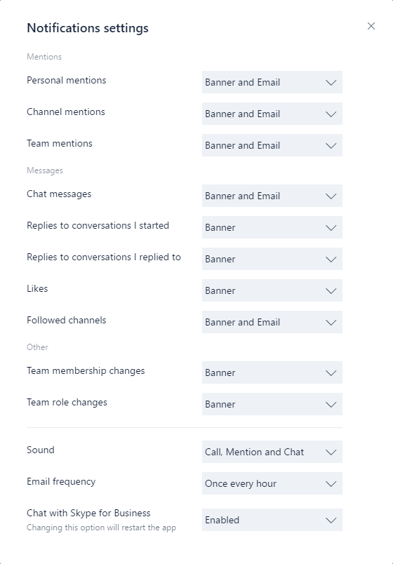

# <a name="get-clients-for-microsoft-teams"></a>Работа с клиентами для Microsoft Teams

У Microsoft Teams есть клиенты, доступные для настольных компьютеров (Windows, Mac и Linux), веб-сайтов и мобильных устройств (Android и iOS). Все они нуждаются в активном подключении к Интернету и не поддерживают автономный режим.

> [!NOTE]
> Подробные сведения о возможностях каждого клиента на разных платформах см. в статье [Возможности Teams на разных платформах](https://support.microsoft.com/office/teams-features-by-platform-debe7ff4-7db4-4138-b7d0-fcc276f392d3).
>
> С 29 ноября 2018 г. вы больше не сможете использовать приложение Microsoft Teams для Windows 10 S (предварительная версия), доступное в Магазине Microsoft Store. Вместо этого теперь вы можете скачать и установить классический клиент Teams на устройствах с Windows 10 в S-режиме. Чтобы скачать классический клиент, перейдите по ссылке [https://teams.microsoft.com/downloads](https://go.microsoft.com/fwlink/p/?linkid=855754). Сборки MSI для классического клиента Teams пока недоступны на устройствах с Windows 10 в S-режиме.
>
> Дополнительные сведения о Windows 10 в S-режиме см. в статье [Знакомство с Windows 10 в S-режиме](https://www.microsoft.com/windows/s-mode).

## <a name="desktop-client"></a>Классический клиент

> [!TIP]
> Просмотрите следующий сеанс, чтобы узнать о преимуществах классического клиента для Windows, его планировании и развертывании: [Классический клиент Teams для Windows](https://aka.ms/teams-clients)

Классический клиент Microsoft Teams представляет собой автономное приложение, а также [входит в состав Приложений Microsoft 365 для предприятий](/deployoffice/teams-install). Приложение Teams доступно для 32- и 64-разрядных версий Windows (8.1 или более поздней версии), ARM64 для Windows 10 на базе ARM и Windows Server (2012 R2 или более поздней версии), а также для macOS и Linux (в форматах `.deb` и `.rpm`). В Windows для Teams требуется платформа .NET Framework 4.5 или более поздней версии; установщик Teams предложит установить ее, если она отсутствует. В Linux, диспетчеры пакетов, такие как `apt` и `yum`, пытаются установить любые требования. Однако, если этого не произойдет, вам нужно будет установить все заявленные требования перед установкой Teams в Linux.

Классические клиенты поддерживают взаимодействие в реальном времени (звук, видео и общий доступ к контенту) для собраний команды, групповых звонков и частных индивидуальных звонков.

При наличии подходящих локальных разрешений (для установки клиента Teams на Mac требуются права администратора, а на ПК — нет) пользователи могут скачать и установить классические клиенты прямо со страницы [https://teams.microsoft.com/downloads](https://go.microsoft.com/fwlink/?linkid=855754).

> [!NOTE]
> Дополнительные сведения об установке Teams на Chromebook см. в статье [Установка и запуск Microsoft Office на Chromebook](https://support.office.com/article/how-to-install-and-run-microsoft-office-on-a-chromebook-32f14a23-2c1a-4579-b973-d4b1d78561ad).

ИТ-администраторы могут выбрать предпочтительный способ распространения установочных файлов на компьютеры в своей организации. Некоторые примеры включают Microsoft Endpoint Configuration Manager (Windows) или Jamf Pro (macOS). Сведения о получении MSI-пакета для распространения в Windows см. в статье [Установка Microsoft Teams с помощью MSI](msi-deployment.md).

> [!NOTE]
> Распространение посредством этих механизмов подходит только для начальной установки клиентов Microsoft Teams, но не для дальнейших обновлений.

### <a name="windows"></a>Windows

Установка Microsoft Teams для Windows предоставляет скачиваемые установщики для 32- и 64-разрядной архитектуры.

> [!NOTE]
> Архитектура Microsoft Teams (32- или 64-разрядная) не зависит от архитектуры Windows или установленного набора Office.

Клиент Windows развертывается в папке AppData внутри профиля пользователя. Развертывание в локальный профиль пользователя позволяет установить клиент без повышенных прав. Клиент Windows использует следующие расположения:

- %LocalAppData%\\Microsoft\\Teams

- %LocalAppData%\\Microsoft\\TeamsMeetingAddin

- %AppData%\\Microsoft\\Teams

- %LocalAppData%\\SquirrelTemp

Когда пользователи впервые выполняют звонок через клиент Microsoft Teams, они могут заметить предупреждение с параметрами брандмауэра Windows, предлагающее пользователю разрешить взаимодействие. Можно попросить пользователей игнорировать это сообщение, так как звонок будет работать даже при закрытии предупреждения.


> [!NOTE]
> Конфигурация брандмауэра Windows будет изменена, даже если закрыть запрос, нажав кнопку "Отмена". Создаются два правила входящего трафика для teams.exe с действием разрешения для протоколов TCP и UDP.

Если вы хотите запретить Teams предлагать пользователям создавать правила брандмауэра при первом вызове из Teams, используйте [пример сценария PowerShell — правило входящего трафика брандмауэра](#sample-powershell-script---inbound-firewall-rule) ниже.

### <a name="mac"></a>Mac

Пользователи Mac могут установить Teams с помощью файла установки PKG для компьютеров macOS. Для установки клиента Mac требуется административный доступ. Клиент macOS устанавливается в папку /Applications.

#### <a name="install-teams-by-using-the-pkg-file"></a>Установка Teams с помощью PKG-файла

1. На [странице скачивания Teams](https://teams.microsoft.com/downloads) в разделе **Mac** нажмите кнопку **Скачать**.
2. Дважды щелкните PKG-файл.
3. Для завершения установки следуйте инструкциям мастера.
4. Teams установится в папку /Applications. Это установка на уровне компьютера.

> [!NOTE]
> Во время установки PKG запросит учетные данные администратора. Пользователю потребуется ввести учетные данные администратора независимо от того, является ли он администратором.

Если пользователь в настоящее время использует установку DMG приложения Teams и хочет заменить ее установкой PKG, следует сделать следующее:

1. Выйти из приложения Teams.
2. Удалить приложение Teams.
3. Установить PKG-файл.

ИТ-администраторы могут использовать средство управляемого развертывания Teams для распространения установочных файлов на все компьютеры Mac в организации, например Jamf Pro.

> [!NOTE]
> Сообщите нам, если у вас возникают проблемы при установке PKG. В разделе **Обратная связь** в конце этой статьи нажмите кнопку **Отзыв о продукте**.

### <a name="linux"></a>Linux

Пользователи смогут установить собственные пакеты Linux в форматах `.deb` и `.rpm`. Установка пакета DEB или RPM автоматически установит репозиторий пакетов.

- DEB `https://packages.microsoft.com/repos/ms-teams stable main`
- RPM `https://packages.microsoft.com/yumrepos/ms-teams`

Ключ подписи для автоматического обновления с помощью системного менеджера пакетов устанавливается автоматически. Однако его также можно найти по адресу: <https://packages.microsoft.com/keys/microsoft.asc>. Microsoft Teams поставляется ежемесячно, и если репозиторий был установлен правильно, ваш системный менеджер пакетов должен обрабатывать автоматическое обновление так же, как и другие пакеты в системе.

> [!NOTE] 
> Если вы нашли ошибку, отправьте ее, используя `Report a Problem` из клиента. Известные проблемы см. в статье [Поддержка Teams в организации](/MicrosoftTeams/troubleshoot/teams-welcome).
> В Teams для Linux можно использовать канал поддержки форума [Linux в Microsoft Вопросы и ответы](/answers/topics/teams.html). При размещении вопросов используйте тег `teams-linux`. 

#### <a name="install-teams-using-deb-package"></a>Установить команды, используя пакет DEB

1. Скачайте пакет из <https://aka.ms/getteams>.
2. Установите с помощью одного из следующих:
    - Откройте соответствующий инструмент управления пакетами и пройдите процедуру самостоятельной установки приложений Linux.
    - Или, если вы любите Терминал, введите: `sudo dpkg -i **teams download file**`

Вы можете запустить Teams через Действия или через Терминал, набрав `teams`.

#### <a name="install-teams-using-rpm-package"></a>Установите Команды, используя пакет RPM

1. Скачайте пакет из <https://aka.ms/getteams>.
2. Установите с помощью одного из следующих:
    - Откройте соответствующий инструмент управления пакетами и пройдите процедуру самостоятельной установки приложений Linux.
    - Или, если вы любите Терминал, введите: `sudo yum install **teams download file**`

Вы можете запустить Teams через Действия или через Терминал, набрав `teams`.

#### <a name="install-manually-from-the-command-line"></a>Установить вручную из командной строки

Установите вручную в дистрибутивах Debian и Ubuntu:

```bash
curl https://packages.microsoft.com/keys/microsoft.asc | sudo apt-key add -

sudo sh -c 'echo "deb [arch=amd64] https://packages.microsoft.com/repos/ms-teams stable main" > /etc/apt/sources.list.d/teams.list'

sudo apt update
sudo apt install teams
```

Установите вручную в дистрибутивах на основе RHEL, Fedora и CentOS:

```bash
sudo rpm --import https://packages.microsoft.com/keys/microsoft.asc

sudo sh -c 'echo -e "[teams]\nname=teams\nbaseurl=https://packages.microsoft.com/yumrepos/ms-teams\nenabled=1\ngpgcheck=1\ngpgkey=https://packages.microsoft.com/keys/microsoft.asc" > /etc/yum.repos.d/teams.repo'

sudo dnf check-update
sudo dnf install teams
```

Также можно использовать yum вместо dnf:

```bash
yum check-update
sudo yum install teams
```

Установите вручную в дистрибутивах на основе openSUSE:

```bash
sudo rpm --import https://packages.microsoft.com/keys/microsoft.asc

sudo sh -c 'echo -e "[teams]\nname=teams\nbaseurl=https://packages.microsoft.com/yumrepos/ms-teams\nenabled=1\nautorefresh=1\nkeeppackages=0\ntype=rpm-md\ngpgcheck=1\ngpgkey=https://packages.microsoft.com/keys/microsoft.asc" > /etc/zypp/repos.d/teams.repo'

sudo zypper refresh
sudo zypper install teams
```

## <a name="web-client"></a>Веб-клиент

Веб-клиент ([https://teams.microsoft.com](https://go.microsoft.com/fwlink/?linkid=855753)) представляет собой полнофункциональный клиент, который можно использовать в различных браузерах. Веб-клиент поддерживает звонки и собрания с помощью webRTC, поэтому не требуется подключаемый модуль или скачивание для запуска Teams в веб-браузере. В браузере должно быть разрешено использование сторонних файлов cookie.

[!INCLUDE [browser-support](includes/browser-support.md)]

Веб-клиент определяет версию браузера при подключении к сайту [https://teams.microsoft.com](https://go.microsoft.com/fwlink/?linkid=855753). В случае обнаружения неподдерживаемой версии блокируется доступ к веб-интерфейсу и пользователю рекомендуется скачать классический клиент или мобильное приложение.

## <a name="mobile-clients"></a>Мобильные клиенты

Мобильные приложения Microsoft Teams доступны для Android и iOS и предназначены для пользователей, участвующих в беседах на основе чата и выполняющих одноранговые звонки во время поездок. Для мобильных приложений следует использовать соответствующий магазин: Google Play и Apple App Store. Приложение Windows Phone перестало поддерживаться 20 июля 2018 г. и может перестать работать.

В Китае вот как [получить Teams для Android](get-teams-android-in-china.md).

Для мобильных приложений Microsoft Teams поддерживаются следующие мобильные платформы:

- **Android**: поддержка ограничена последними четырьмя основными версиями Android. Когда выпущена новая основная версия Android, официально поддерживается новая версия и предыдущие три версии.

- **iOS**: поддержка ограничена двумя последними основными версиями iOS. Когда выпущена новая основная версия iOS, официально поддерживается новая версия iOS и предыдущая версия.

> [!NOTE]
> Мобильная версия должна быть общедоступной, чтобы приложение Teams работало правильно.

Мобильные приложения распространяются и обновляются только через магазин приложений для соответствующей мобильной платформы. Распространение мобильных приложений через MDM и загрузка неопубликованных приложений не поддерживаются корпорацией Майкрософт. Как только мобильное приложение Teams будет установлено на поддерживаемой мобильной платформе, оно само будет поддерживаться, при условии что с момента выпуска текущей версии прошло не более трех месяцев.   

| | | |
|---|---|---|
||Точка принятия решений|Существуют ли ограничения, мешающие пользователям установить на своих устройствах подходящий клиент Microsoft Teams?|
||Дальнейшие действия|Если ваша организация ограничивает установку программного обеспечения, убедитесь в совместимости данного механизма с Microsoft Teams. Примечание. Для установки клиента на Mac требуются права администратора, а на ПК — нет.|
|

## <a name="client-update-management"></a>Управление обновлениями клиентов

Сейчас клиенты обновляются службой Microsoft Teams автоматически и без вмешательства ИТ-администратора. При выходе обновления клиент автоматически скачивает его, а после определенного периода неактивности приложения начинает процесс обновления.

## <a name="client-side-configurations"></a>Конфигурации на стороне клиента

Сейчас не существует способа для настройки клиента администратором клиента, а также с помощью PowerShell, объектов групповой политики или реестра.

## <a name="notification-settings"></a>Параметры уведомлений

Сейчас не существует способа для настройки параметров уведомлений на стороне клиента ИТ-администраторами. Все эти параметры задает пользователь. Приведенный ниже рисунок показывает параметры клиента по умолчанию.



## <a name="sample-powershell-script---inbound-firewall-rule"></a>Пример сценария PowerShell — правило входящего трафика брандмауэра

Этот пример скрипта, который нужно запускать на клиентских компьютерах в контексте учетной записи администратора с повышенными правами, создает правило входящих подключений брандмауэра для каждой папки пользователя, находящейся в c:\users. Если Teams обнаруживает это правило, блокируется запрос для пользователей на создание правил брандмауэра, когда пользователи выполняют первый звонок из Teams.

```powershell
<#
.SYNOPSIS
   Creates firewall rules for Teams.
.DESCRIPTION
   (c) Microsoft Corporation 2018. All rights reserved. Script provided as-is without any warranty of any kind. Use it freely at your own risks.
   Must be run with elevated permissions. Can be run as a GPO Computer Startup script, or as a Scheduled Task with elevated permissions.
   The script will create a new inbound firewall rule for each user folder found in c:\users.
   Requires PowerShell 3.0.
#>

#Requires -Version 3

$users = Get-ChildItem (Join-Path -Path $env:SystemDrive -ChildPath 'Users') -Exclude 'Public', 'ADMINI~*'
if ($null -ne $users) {
    foreach ($user in $users) {
        $progPath = Join-Path -Path $user.FullName -ChildPath "AppData\Local\Microsoft\Teams\Current\Teams.exe"
        if (Test-Path $progPath) {
            if (-not (Get-NetFirewallApplicationFilter -Program $progPath -ErrorAction SilentlyContinue)) {
                $ruleName = "Teams.exe for user $($user.Name)"
                "UDP", "TCP" | ForEach-Object { New-NetFirewallRule -DisplayName $ruleName -Direction Inbound -Profile Domain -Program $progPath -Action Allow -Protocol $_ }
                Clear-Variable ruleName
            }
        }
        Clear-Variable progPath
    }
}
```
