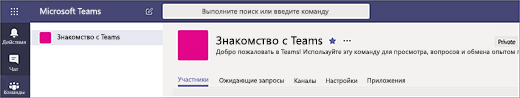

# Создание первых команд и каналов в Microsoft Teams

Настройка и использование вашего первого набора команд и каналов позволяет получить первые впечатления от использования Teams и определить чемпионов, которые могут помочь вам успешно выполнить внедрение Teams в масштабе всей организации. Если вы еще не установили Teams, ознакомьтесь со статьями [Получение клиентов Teams](get-clients.md) и [Регистрация в Teams с использованием современных средств проверки подлинности](sign-in-teams.md).

## Рекомендации для ваших первых команд и каналов

 Команда — это определенное количество пользователей, которые объединены одной общей целью. Каналы же являются местом, где выполняется совместная работа команды. 

Дополнительные сведения см. в статье [Общие сведения о командах и каналах в Teams](teams-channels-overview.md) и [Советы и рекомендации для организации команд в Teams](best-practices-organizing.md).

 Мы рекомендуем начать с группы «Знакомство с Teams», где ваши первые пользователи могут поэкспериментировать, задать вопросы и открывать для себя возможности Teams. Данная команда может иметь критическое значение для успеха, позволяя поэкспериментировать с Teams. 

### Команда «Знакомство с Teams»
Ваша проектная команда может использовать команду «Знакомство с Teams», чтобы выполнить настройку клиентов Teams, организовать первоначальную беседу и изучить возможности, которые предоставляет Teams. Возможно, у вас уже есть группа сотрудников в вашей организации, которым нравится пользоваться правом раннего доступа к новым возможностям. Эта команда может стать одной из их первых команд, пока вы выполняете комплектование, и поможет вам получить их первые отзывы.

Ниже вы найдете предлагаемую структуру для команды.

| Канал | Описание и использование | Закрепленные вкладки, боты и приложения |
| ------------ | -------------------- | -------------------- |
| Общий | Все команды начинают работу с общего канала. Используйте данный канал для создание оповещений в процессе знакомства с Teams. |  |
| Поздороваться | Познакомьтесь с участниками команды и поделитесь тем, что вы хотите получить от Teams. |  |
| Руководства | Канал для вопросов о способах использования Teams Шаг 1 – Установите настольный и мобильный клиенты. Шаг 2 – Перйдите в Teams.| Закрепленная вкладка, которая содержит ссылку на [Центр справки для Teams](https://support.office.com/teams) Закрепленная вкладка, которая содержит ссылку на [Обучающие видео для Teams](https://support.office.com/article/microsoft-teams-video-training-4f108e54-240b-4351-8084-b1089f0d21d7) Закрепленная вкладка, которая содержит ссылку на [Ссылки для скачивания настольного и мобильного клиента](https://teams.microsoft.com/downloads) |
| Отзывы | Поделитесь своими мыслями о ваших впечатлениях от Teams. | Закрепленная вкладка для проведения опроса|
| Идеи для будущих команд | Поделитесь своими идеями о том, где Teams может принести дополнительную пользу для вашей организации. Как могут называться эти команды? Кто может стать их участниками? ||
| Поддержка | Если что-то не работает должным образом, используйте данный канал, чтобы получить помощь. ||

## Организуйте работу ваших первых команд
Как администратор вы можете создавать команды и каналы и управлять ими с помощью клиента Teams или Центра администрирования Microsoft Teams. Вы можете создавать публичные или приватные команды. Вы также можете создать команды, предназначенные для всей организации. Любой сотрудник, использующий Teams в вашей организации, сможет присоединиться к общедоступной команде. В приватных командах их владельцы управляют членством. В команды, предназначенные для всей организации, автоматически добавляются все сотрудники вашей организации. 

Чтобы приступить к работе, мы рекомендуем создать приватные команды и добавить еще одного владельца для управления параметрами команды и членством в группах. 

> [!NOTE]
> В описанных ниже шагах мы используем настольный клиент Teams для создания команд и каналов. Имейте в виду, что вы как администратор также можете выполнить эти действия в Центре администрирования Microsoft Teams.

### Создание команды

В левой части интерфейса клиента Teams нажмите **Команды**, а затем в нижней части списка команд нажмите **Присоединиться или создать команду**. На плитке **Создание команды** нажмите **Создать команду**.

После создания команды вы можете пригласить людей присоединиться к ней. Вы можете добавить отдельных пользователей, отдельные группы и даже все группы контактов (ранее — «списки рассылки»). 

 

### Добавьте владельца группы
Найдите команду, которую вы создали, нажмите **Дополнительные параметры ˙˙˙** > **Управление командой**. Затем перейдите на вкладку**Участники**. Найдите людей, которых вы хотите назначить владельцами команды. В разделе **Роль** выберите **Владелец**.

### Создание канала в команде
Найдите команду, которую вы создали, нажмите **Дополнительные параметры ˙˙˙** > **Добавление канала**. Вы также можете нажать **Управление командой** и добавить канал на вкладке **Каналы**. 

 

Создайте развернутое название канала, чтобы пользователям было проще понять назначение данного канала. 

Как владелец команды вы можете автоматически добавлять каналы в избранное для всей команды, что позволит повысить видимость каналов для всех участников команды. Можно также закрепить для канала вкладки для добавления инструментов, таких как OneNote, ссылок на веб-страницы и другого содержимого, чтобы облегчить пользователям поиск необходимого содержания и дать им возможность делиться своими мыслями.  

Ниже представлен пример канала «Инструкции» в команде «Знакомство с Teams», показаны закрепленные вкладки со ссылками на веб-страницы Teams &ndash; cсылки на обучающие видео для Teams, справочный центр Teams и ссылки для скачивания Teams. 

 

## Дальнейшие действия
Перейдите в раздел [Добавьте ваших первых пользователей](get-started-with-teams-onboard-early-adopters.md).
