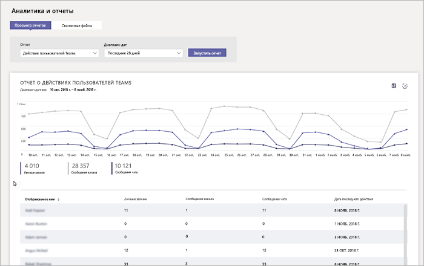
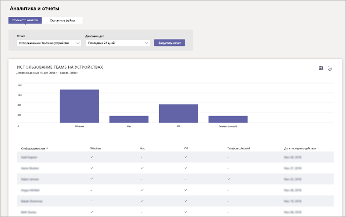

# Мониторинг использования и обратная связь в Microsoft Teams
Очень важно знать, как пользователи применяют Teams и оценить их впечатления от работы с Teams. Отчеты об использовании помогут вам лучше понять характер использования, а наряду с отзывам пользователей, позволяют получить ценную информации, что поможет вам выполнить широкое развертывание, а также определить приоритетные области для обучения и взаимодействия.

## Мониторинг использования
Для вашего первого набора команд мы рекомендуем изучать отчеты два раза в неделю, чтобы получить представление о возникающих тенденциях. 

Например, отчеты об использовании показывают, что далеко не все пользователи используют мобильные клиенты Teams. Это может указывать на то, что пользователи не представляют, как установить клиенты. Публикация пошаговых инструкций по установке в канале поможет стимулировать использование более широкого диапазона клиентов. Кроме того, отчеты об использовании показывают, что пользователи главным образом используют Teams для общения в приватных чатах. В этом примере вы можете захотеть просмотреть сценарии команды, так как пользователи общаются вне начальных команд и каналах, которые были настроены. 

Ниже описано, как можно создавать отчеты для просмотра использования Teams. 

### Аналитика команд и отчеты (Центр администрирования Microsoft Teams)

Отчеты Teams в Центре администрирования Microsoft Teams позволяют составить картину того, как Teams используется в вашей организации. Чтобы получить представление об использовании Teams, активности пользователей и использовании устройств в вашей организации, используйте отчеты. 

Чтобы просмотреть эти отчеты, вы должны обладать правами глобального администратора Office 365 или администратор Skype для бизнеса. Перейдите в Центр администрирования Microsoft Teams в левой панели навигации выберите **Аналитика и отчеты**, а затем в разделе **Отчет** выберите отчет, который вы хотите запустить.

- **Отчет об использовании Teams**: этот отчет предоставляет общую информацию об активности в Teams, в том числе общее количество активных пользователей и каналов, а также количество активных пользователей и каналов, гостей и сообщений в каждой команде. 

         
- **Отчет активности пользователей Teams**: этот отчет позволяет вам получить информацию о типах действий пользователей, например, сколько людей общаются посредством звонков, каналов и приватных чатах. 

     
`
- **Отчет об использовании устройств Teams**: этот отчет показывает, как пользователи подключаются к Teams, в частности, сколько людей используют Teams на своих мобильных устройствах, находясь в пути. 

    

Дополнительные сведения см. в статье [Аналитика и создание отчетов в Teams](teams-analytics-and-reports/teams-reporting-reference.md). 

### Отчеты об активности Teams (Центр администрирования Microsoft 365)
Вы можете также просмотреть активность в Teams с помощью отчетов, которые доступны в Центре администрирования Microsoft 365. Такие отчеты являются частью отчетов Office 365 в Центре администрирования Microsoft 365 и предоставляют сведения об активности пользователей и использовании устройств. 

Чтобы просмотреть эти отчеты, перейдите в Центр администрирования Microsoft 365, нажмите **Отчеты** > **Использование**. В разделе **Выберите отчет** нажмите **Microsoft Teams**. Затем выберите отчет, который вы хотите просмотреть.

Чтобы узнать больше, перейдите в раздел [Использование отчетов об активности в Teams](teams-activity-reports.md).

### Аналитика использования Microsoft 365

С помощью аналитических данных об использовании Microsoft 365 в Power BI вы сможете просматривать и анализировать данные об использовании для Teams и других продуктов Office 365, а также служб. Аналитические данных об использовании Microsoft 365 - это пакет содержимого, который включает встроенные панели мониторинга и большое количество встроенных отчетов. Каждый отчет предоставляет определенные данные по использованию и аналитику. Чтобы подключиться к пакету содержимого, вам потребуется Power BI и права глобального администратора Office 365 или права на чтение отчетов. Если у вас еще нет Power BI, [зарегистрируйтесь в бесплатной службе Power BI](https://powerbi.microsoft.com). 

Дополнительную информацию см. в статье [Аналитика использования Microsoft 365](https://support.office.com/article/Microsoft-365-usage-analytics-77ff780d-ab19-4553-adea-09cb65ad0f1f) 

## Получение отзыва
Внедрение нового метода взаимодействия заметно повлияет на поведение пользователей. Для принятия изменений требуется обучение, стимулирование и положительные примеры. Очень важно для пользователей иметь право голоса во время перехода на Teams и получить возможность открыто делиться своими впечатлениями. Мы рекомендуем использовать канал «Отзыв» в команде «Знакомство с Teams», который вы создали для сбора и ответов на отзывы пользователей о своих впечатлениях по работе с Teams. 

## Дальнейшие действия
Перейдите к [Ресурсы для планирования развертывания Microsoft Teams в масштабах организации](get-started-with-teams-resources-for-org-wide-rollout.md)
