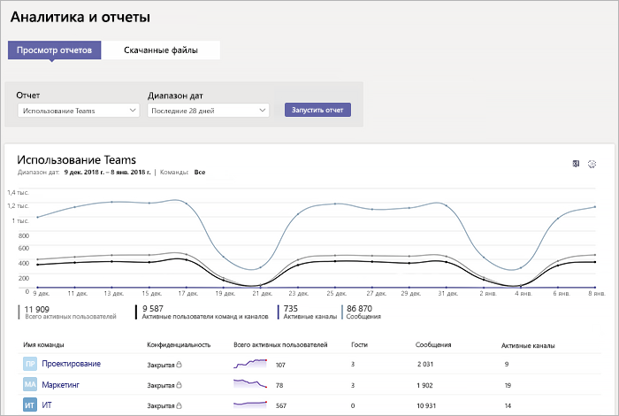

# Мониторинг использования и обратная связь в Microsoft TeamsMonitor usage and feedback in Microsoft Teams
Очень важно знать, как пользователи применяют Teams и оценить их впечатления от работы с Teams.It's important to know how users are using Teams and what their experience is with Teams. Отчеты об использовании помогут вам лучше понять характер использования, а наряду с отзывам пользователей, позволяют получить ценную информации, что поможет вам выполнить широкое развертывание, а также определить приоритетные области для обучения и взаимодействия.Usage reports can help you better understand usage patterns, and along with user feedback, give you insights to inform your wider rollout and where to prioritize training and communication efforts.

## Мониторинг использованияMonitor usage
Для вашего первого набора команд мы рекомендуем изучать отчеты два раза в неделю, чтобы получить представление о возникающих тенденциях.For your first set of teams, we recommend you review reports twice a week to understand emerging trends. 

Например, отчеты об использовании показывают, что далеко не все пользователи используют мобильные клиенты Teams.For example, usage reports show that not many users are using the Teams mobile clients. Это может указывать на то, что пользователи не представляют, как установить клиенты.This may indicate that users aren't sure how to install the clients. Публикация пошаговых инструкций по установке в канале поможет стимулировать использование более широкого диапазона клиентов.Posting step-by-step installation instructions in a channel may help drive usage of a wider range of clients. Кроме того, отчеты об использовании показывают, что пользователи главным образом используют Teams для общения в приватных чатах.Or, usage reports show that users are primarily using Teams for private chats. В этом примере вы можете захотеть просмотреть сценарии команды, так как пользователи общаются вне начальных команд и каналах, которые были настроены.In this example, you may want to review your team scenarios because users are chatting outside the initial teams and channels that were set up. 

Ниже описано, как можно создавать отчеты для просмотра использования Teams.Here's how to get reports to view Teams usage. 

### Аналитика команд и отчеты (Центр администрирования Microsoft Teams)Teams analytics & reports (Microsoft Teams admin center)

Отчеты Teams в Центре администрирования Microsoft Teams позволяют составить картину того, как Teams используется в вашей организации.Teams reports in the Microsoft Teams admin center give you insights into how Teams is used in your organization. Чтобы получить представление об использовании Teams, активности пользователей и использовании устройств в вашей организации, используйте отчеты.Use the reports to get a view into Teams usage, user activity, and device usage across your organization. 

Чтобы просмотреть эти отчеты, вы должны обладать правами глобального администратора Office 365 или администратор Skype для бизнеса. Перейдите в Центр администрирования Microsoft Teams в левой панели навигации выберите **Аналитика и отчеты**, а затем в разделе **Отчет** выберите отчет, который вы хотите запустить.To view these reports, you must be a global admin in Office 365, Teams service admin, or Skype for Business admin. Go to the Microsoft Teams admin center, in the left navigation, select **Analytics & reports**, and then under **Report**, choose the report you want to run.

- **Отчет об использовании Teams**: этот отчет предоставляет общую информацию об активности в Teams, в том числе общее количество активных пользователей и каналов, а также количество активных пользователей и каналов, гостей и сообщений в каждой команде.**Teams usage report**: This report gives you an overview of usage activity in Teams, including the total active users and channels, and the number of active users and channels, guests, and messages in each team. 

         
- **Отчет активности пользователей Teams**: этот отчет позволяет вам получить информацию о типах действий пользователей, например, сколько людей общаются посредством звонков, каналов и приватных чатах.**Teams user activity report**: This report gives you insight into the types of activities users engage in, such as how many people communicate through 1:1 calls, channel messages, and private chat messages. 

     
\` 
\`
- **Отчет об использовании устройств Teams**: этот отчет показывает, как пользователи подключаются к Teams, в частности, сколько людей используют Teams на своих мобильных устройствах, находясь в пути.**Teams device usage report**: This report shows you how users connect to Teams, including how many people use Teams on their mobile devices when on-the-go. 

    

Дополнительные сведения см. в статье [Аналитика и создание отчетов в Teams](teams-analytics-and-reports/teams-reporting-reference.md).To learn more, check out [Teams analytics and reporting](teams-analytics-and-reports/teams-reporting-reference.md). 

### Отчеты об активности Teams (Центр администрирования Microsoft 365)Teams activity reports (Office 365 admin center)
Вы можете также просмотреть активность в Teams с помощью отчетов, которые доступны в Центре администрирования Microsoft 365.You can also view Teams activity through reports that are available from the Office 365 admin center. Такие отчеты являются частью отчетов Office 365 в Центре администрирования Microsoft 365 и предоставляют сведения об активности пользователей и использовании устройств.These reports are part of the Office 365 reports in the Office 365 admin center and provide information about user activity and device usage. 

Чтобы просмотреть эти отчеты, перейдите в Центр администрирования Microsoft 365, нажмите **Отчеты** > **Использование**.To view these reports, go to the Office 365 admin center, click **Reports** > **Usage**. В разделе **Выберите отчет** нажмите **Microsoft Teams**.Under **Select a report**, click **Microsoft Teams**. Затем выберите отчет, который вы хотите просмотреть.From here, choose the report you want to view.

Чтобы узнать больше, перейдите в раздел [Использование отчетов об активности в Teams](teams-activity-reports.md).To learn more, go to [Use activity reports for Teams](teams-activity-reports.md).

### Аналитика использования Microsoft 365Microsoft 365 usage analytics

С помощью аналитических данных об использовании Microsoft 365 в Power BI вы сможете просматривать и анализировать данные об использовании для Teams и других продуктов Office 365, а также служб.You can use Microsoft 365 usage analytics in Power BI to view and analyze usage data for Teams and other Office 365 products and services. Аналитические данных об использовании Microsoft 365 - это пакет содержимого, который включает встроенные панели мониторинга и большое количество встроенных отчетов.Microsoft 365 usage analytics is a content pack that includes a pre-built dashboard and a number of pre-built reports. Каждый отчет предоставляет определенные данные по использованию и аналитику.Each report gives you specific usage data and insights. Чтобы подключиться к пакету содержимого, вам потребуется Power BI и права глобального администратора Office 365 или права на чтение отчетов.To connect to the content pack, you need Power BI and must be a global admin in Office 365 or reports reader. Если у вас еще нет Power BI, [зарегистрируйтесь в бесплатной службе Power BI](https://powerbi.microsoft.com).If you don't already have Power BI, [sign up for the free Power BI service](https://powerbi.microsoft.com). 

Дополнительную информацию см. в статье [Аналитика использования Microsoft 365](https://support.office.com/article/Microsoft-365-usage-analytics-77ff780d-ab19-4553-adea-09cb65ad0f1f)To learn more, see [Microsoft 365 usage analytics](https://support.office.com/article/Microsoft-365-usage-analytics-77ff780d-ab19-4553-adea-09cb65ad0f1f). 

## Получение отзываGather feedback
Внедрение нового метода взаимодействия заметно повлияет на поведение пользователей.The adoption of a new collaboration experience is about changing the behavior of users. Для принятия изменений требуется обучение, стимулирование и положительные примеры.Enabling change requires training, encouragement, and positive examples. Очень важно для пользователей иметь право голоса во время перехода на Teams и получить возможность открыто делиться своими впечатлениями.It's important for users to have a voice during the transition to Teams and to be able to openly share their experiences. Мы рекомендуем использовать канал «Отзыв» в команде «Знакомство с Teams», который вы создали для сбора и ответов на отзывы пользователей о своих впечатлениях по работе с Teams.We recommend using the Feedback channel in the "Get to know Teams" team you created to collect and address feedback from users on their experiences with Teams. 

## Дальнейшие действияNext steps
Перейдите к [Ресурсы для планирования развертывания Microsoft Teams в масштабах организации](get-started-with-teams-resources-for-org-wide-rollout.md)Go to [Get resources to plan your organization-wide rollout of Teams](get-started-with-teams-resources-for-org-wide-rollout.md).
