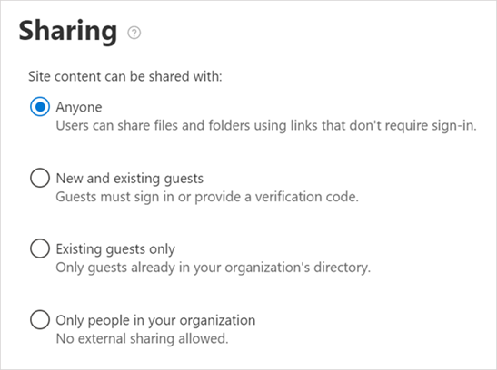

Контрольный список для гостевого доступа к TeamsTeams guest access checklist
==========================================

С помощью этого контрольного списка вы можете включить и настроить функцию гостевой доступа в Microsoft Teams в соответствии с настройками вашей организации.Use this checklist to help you enable and configure the guest access feature in Microsoft Teams according to the preferences of your organization.

> [!NOTE] 
> Для ограничений совместной работы ознакомьтесь с разрешениями для [внешней совместной работы и управления пользователями, которые могут приглашать гостей](https://docs.microsoft.com/azure/active-directory/b2b/delegate-invitations).For collaboration restrictions see [Enable B2B external collaboration and manage who can invite guests](https://docs.microsoft.com/azure/active-directory/b2b/delegate-invitations).

## Общие сведения об ограничениях гостейUnderstand the limitations for guests

У гостей есть ограничения на проектирование.The guest experience has limitations by design. Убедитесь, что вы понимаете впечатление гостя, и вы не можете устранить проблему, которая не связана с проблемой.Make sure you understand the guest experience so you don't try to fix something that isn't a problem. Например, ниже приведен список некоторых функциональных возможностей, недоступных для гостей в Microsoft teams:For example, here's a list of some of the functionality that isn't available to a guest in Microsoft Teams:

- OneDrive для бизнесаOneDrive for Business
- Поиск людей за пределами TeamsPeople search outside of Teams
- Календарь, запланированные собрания и сведения о собранииCalendar, Scheduled Meetings, or Meeting Details
- ТСОПPSTN
- Организационная диаграммаOrganization chart
- Создание и пересмотр командыCreate or revise a team
- Поиск группыBrowse for a team
- Отправка файлов в чат человекаUpload files to a person-to-person chat
- Гости смогут искать и находить пользователей (за пределами группы), если они знают полный идентификатор электронной почты пользователя.Guests can still search and find users (outside their team) if they know the user's full email ID. Чтобы не допустить этого, администраторы могут использовать шаблоны, такие как [Поиск](https://docs.microsoft.com/en-us/MicrosoftTeams/teams-scoped-directory-search) в каталогах с ограничениями, которые позволяют ограничить гостевые машины собственными ВИРТУАЛЬными глобальными адресными адресами.To prevent this, IT admins can use patterns like [scoped directory search](https://docs.microsoft.com/en-us/MicrosoftTeams/teams-scoped-directory-search) that have the ability to restrict Guests into their own virtual GAL.

Подробнее ознакомьтесь со сведениями о том, [как использовать гостевые возможности](guest-experience.md) и [гостевой доступ в группах Office 365](https://support.office.com/article/guest-access-in-office-365-groups-bfc7a840-868f-4fd6-a390-f347bf51aff6).For more details, see [What the guest experience is like](guest-experience.md) and [Guest access in Office 365 Groups](https://support.office.com/article/guest-access-in-office-365-groups-bfc7a840-868f-4fd6-a390-f347bf51aff6).

### Гостевой доступ и внешний доступ (Федерация)Guest access vs. external access (federation)

[!INCLUDE [guest-vs-external-access](includes/guest-vs-external-access.md)]

> [!NOTE] 
> В настоящее время в Microsoft Teams не поддерживается роль участника гостя.Currently, Microsoft Teams does not support the guest inviter role. По крайней мере для переключателя "участники могут пригласить" необходимо установить значение "Да" для гостевого доступа к работе в Microsoft Teams.At a minimum the "members can invite" toggle must be set to "Yes" for guest access to work in Microsoft Teams. Если вы настроили "нет", а затем включите гостевой доступ в группах Office 365 и Microsoft Teams, администраторы могут управлять приглашениями гостей в каталог.If you set "members can invite" to "No" and then enable guest access in Office 365 Groups and Microsoft Teams, admins can control guest invitations to your directory. После того как гости находятся в каталоге, они могут быть добавлены в Teams участниками, которые являются владельцами групп.After guests are in the directory, they can be added to teams by non-admin members who are team owners.

## Если гости видят ошибки лицензийIf your guests are seeing license errors

Гостевой доступ в Microsoft Teams использует службу Azure Active Directory (Azure AD) для бизнеса (B2B) и модель лицензирования.Guest access in Microsoft Teams uses Azure Active Directory (Azure AD) Business to Business (B2B) and its licensing model. Если вы видите ошибки лицензирования, ознакомьтесь с рекомендациями по [лицензированию B2B](https://docs.microsoft.com/azure/active-directory/b2b/licensing-guidance) , чтобы понять требования к лицензированию пользователей организации, чтобы они могли пригласить гостей в организацию.If you’re seeing licensing errors, make sure to read the [B2B licensing guidance](https://docs.microsoft.com/azure/active-directory/b2b/licensing-guidance) to understand the licensing requirements your organization has so that your users are able to invite guests to your organization.

Вот несколько моментов, которые нужно помнить:A few things to remember:

- Для каждой платной лицензии на Azure Active Directory, назначенной пользователю, пользователи могут пригласить до пяти гостевых пользователей в рамках внешнего пользователя.For each paid Azure AD license that you assign to a user, your users can invite up to five guest users under the External User Allowance.
- Гости — это пользователи за пределами вашей организации.Guests are users outside your organization. Ваши сотрудники, подрядчики на сайте, агенты по сайтам и т. д. нельзя добавить в качестве гостей.Your employees, onsite contractors, onsite agents, and so on can't be added as guests. То же касается ваших аффилированных лиц.The same applies to your affiliates.
- Гостевые лицензии подсчитываются с помощью приглашенной Организации.Guest licenses are counted against the inviting organization. Это следует помнить при расчете количества лицензий, которые вам понадобятся.Consider this when you calculate the number of licenses you need.
- Лицензии будут учитываться в вашей организации, независимо от того, приходят ли приглашенные гости другим клиентам Office 365 или используют их личные адреса электронной почты.Licenses are counted against your organization whether the invited guests come from another Office 365 tenant or are using their personal email addresses.

## □ Шаг 1: Настройка параметров в Azure AD Business-to-Business□  Step 1: Configure settings in Azure AD business-to-business

1. Войдите в учетную запись https://portal.azure.com.Sign in to https://portal.azure.com.
2. На левой панели выберите **Azure Active Directory** .Click **Azure Active Directory** in the left pane.
3. В разделе **Управление**выберите пункт **Параметры пользователя**.Under **Manage**, click **User settings**.
4. В разделе **внешние пользователи**выберите пункт **Управление внешними параметрами совместной работы**.Under **External users**, click **Manage external collaboration settings**.
5. На странице **внешние параметры совместной работы** убедитесь в том, что **Участники могут приглашать** установить значение **Да**.On the **External collaboration settings** page make sure **Members can invite** is set to **Yes**.

      

    Для поддержки гостей **участникам может** быть присвоено значение **Да**.To support guests, **Members can invite** must be set to **Yes**.

    > [!NOTE] 
    > Если вы настроили **пользователей** на " **нет** ", а затем включите гостевой доступ в группах Office 365 и Microsoft Teams, администраторы могут управлять приглашениями гостей в каталог.If you set **Members can invite** to **No** and then enable guest access in Office 365 Groups and Microsoft Teams, admins can control guest invitations to your directory. После того как гости находятся в каталоге, они могут быть добавлены в Teams участниками, которые являются владельцами групп.After guests are in the directory, they can be added to teams by non-admin members who are team owners.

Дополнительные сведения см. в статье [Авторизация гостевого доступа в Microsoft Teams](Teams-dependencies.md).For more information, see [Authorize guest access in Microsoft Teams](Teams-dependencies.md).

## □ Step 2: Настройка групп Office 365□ Step 2: Configure Office 365 Groups

1. В центре администрирования Microsoft 365 перейдите в раздел службы **настройки** > **&** > **группы Office 365**.In the Microsoft 365 admin center, go to **Settings** > **Services & Add-ins** > **Office 365 Groups**.
2. Убедитесь в том **, что группа "разрешить участникам группы за пределами" содержимого группы "доступ к Организации"** имеет значение **вкл**.Make sure **Let group members outside the organization access group content** is set to **On**. Если этот параметр отключен, гости не смогут получать доступ к содержимому группы.If this setting is turned off, guests won't be able to access any group content.
3. Убедитесь, что **владельцы групп смогут добавлять в группы пользователей за** пределами организации \*\*\*\*.Make sure **Let group owners add people outside the organization to groups** is set to **On**. Если этот параметр отключен, владельцы групп не смогут добавлять новых гостей.If this setting is turned off, Team owners won't be able to add new guests. Как минимум, этот параметр должен быть включен, чтобы поддерживать гостевой доступ.At a minimum, this setting must be On to support guest access.

     

Подробные инструкции по настройке этих параметров можно найти [в разделе Управление гостевым доступом в группах office 365](https://support.office.com/en-us/article/manage-guest-access-in-office-365-groups-9de497a9-2f5c-43d6-ae18-767f2e6fe6e0?appver=MOE150) и [Управление гостевым доступом в группах Office 365](Teams-dependencies.md#control-guest-access-in-office-365-groups).For detailed instructions about configuring these settings, see [Manage guest access in Office 365 Groups](https://support.office.com/en-us/article/manage-guest-access-in-office-365-groups-9de497a9-2f5c-43d6-ae18-767f2e6fe6e0?appver=MOE150) and [Control guest access in Office 365 Groups](Teams-dependencies.md#control-guest-access-in-office-365-groups).
 

## □ Step 3: Включите гостевой доступ на уровне клиента□ Step 3: Enable guest access at the tenant level

Как минимум, необходимо включить гостевой доступ для Microsoft Teams в **центре администрирования Microsoft Teams**.At a minimum, you must turn on guest access for Microsoft Teams under the **Microsoft Teams admin center**. 

1. В центре администрирования Teams выберите\*\*\*\* **Параметры** > для всей Организации.In the Teams admin center, select **Org-Wide settings** > **Guest access**.
2. Установите переключатель **Разрешить гостевой доступ в Microsoft Teams** . \*\*\*\*Set the **Allow guest access in Microsoft Teams** switch to **On**.

    

3. На этой же странице Настройте другие необходимые параметры гостя.On this same page, configure any other guest settings that you require.
4. Нажмите кнопку **Сохранить**.Click **Save**.

Подробные инструкции можно найти в разделе [Включение и отключение гостевого доступа к Microsoft Teams](set-up-guests.md).For detailed instructions, see [Turn on or turn off guest access to Microsoft Teams](set-up-guests.md).

## □ Действия 4: Настройка общего использования в Office 365□  Step 4: Configure sharing in Office 365 

Убедитесь в том, что пользователи могут добавлять гостей.Make sure that users can add guests. Вот как это можно делать:Here's how:

1. В центре администрирования Microsoft 365 выберите **Параметры** > **Безопасность & конфиденциальность**.In the Microsoft 365 admin center, go to **Settings** > **Security & privacy**.

     

2. В окне **общий доступ**нажмите кнопку **изменить**.In **Sharing**, select **Edit**.

     
 
3. Установите переключатель **Разрешить пользователям добавлять новых гостей в эту организацию** , а затем нажмите кнопку **сохранить**. \*\*\*\*Set **Let users add new guests to this organization** to **On**, and then click **Save**.

     
 
> [!NOTE]
> Этот параметр эквивалентен пользователям в службах Azure AD, которые **могут приглашать** **пользователей** в параметрах **пользователя** > .This setting is equivalent to the **Members can invite** setting in  **User settings** > **External users**  in Azure AD.  

## □ Шаг 5: Проверка параметров общего подключения в SharePoint□ Step 5: Verify sharing setting in SharePoint

1. Войдите в центр администрирования Microsoft 365.Sign in to the Microsoft 365 admin center.
2. Выберите пункт **центр администрирования**, а затем — пункт **SharePoint**.Click **Admin center**, and then select **SharePoint**.
3. В центре администрирования SharePoint выберите **общий доступ**.In the SharePoint admin center, select **Sharing**.
4. Убедитесь, что *не* выбран параметр не **разрешать общий доступ за пределами Организации** .Make sure the option for **Don’t allow sharing outside your organization** is *not* selected.
 
     

## □ Шаг 6: включение определенных параметров каналов□ Step 6: Enable specific settings for channels 

В приложении Teams на уровне отдельных групп Настройте разрешения гостя таким образом, чтобы гости могли создавать, обновлять и удалять каналы.In the Teams application, at the individual team level, configure guest permissions so that guests can create, update, and delete channels. В дополнение к администраторам, владельцы групп могут настроить этот параметр.In addition to admins,  team owners can configure this setting.

Дополнительные сведения, в том числе инструкции для видеороликов, можно найти [в разделе гостевой доступ в Microsoft Teams](guest-access.md).For more information, including how-to videos, see [Guest access in Microsoft Teams](guest-access.md).

## Поиск и устранение неполадокTroubleshooting

Если у вас возникли проблемы с добавлением гостей в Microsoft Teams, ознакомьтесь с [руководством по устранению неполадок с гостевым доступом](https://techcommunity.microsoft.com/t5/Microsoft-Teams/Guest-Access-Troubleshooting-Guide/td-p/119797).If you have problems with adding guests in Microsoft Teams, see the [Guest Access Troubleshooting Guide](https://techcommunity.microsoft.com/t5/Microsoft-Teams/Guest-Access-Troubleshooting-Guide/td-p/119797).

